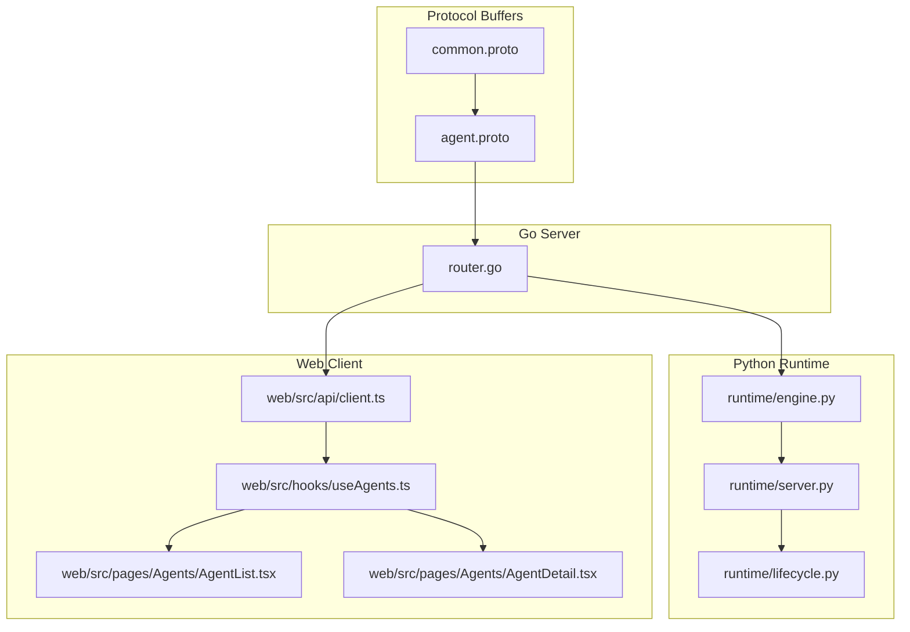
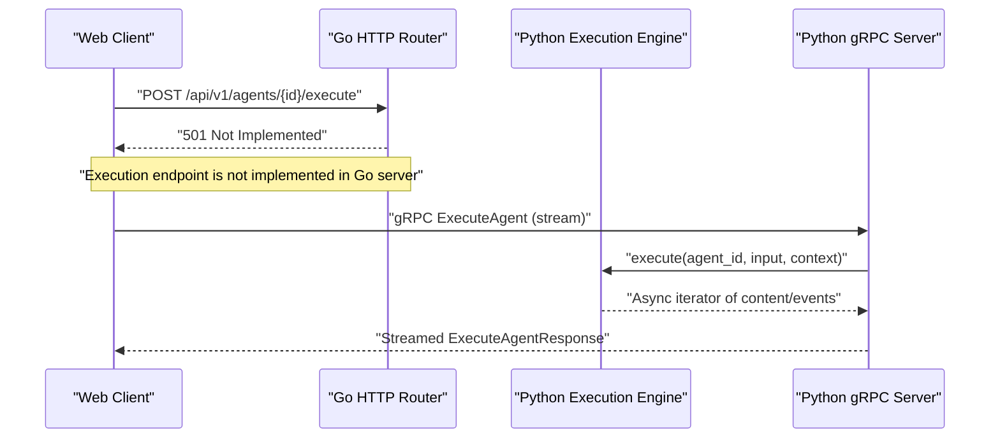
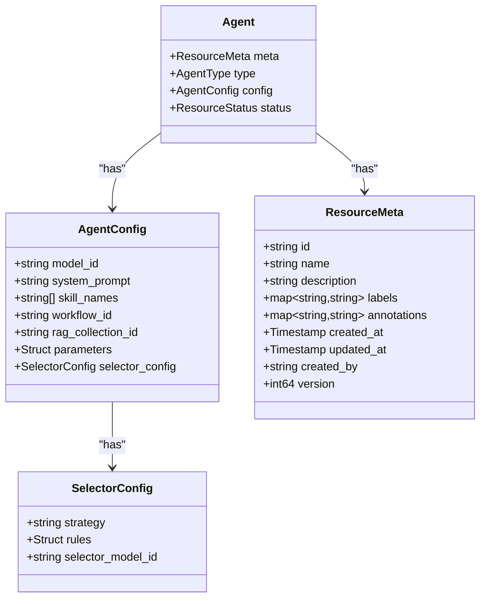
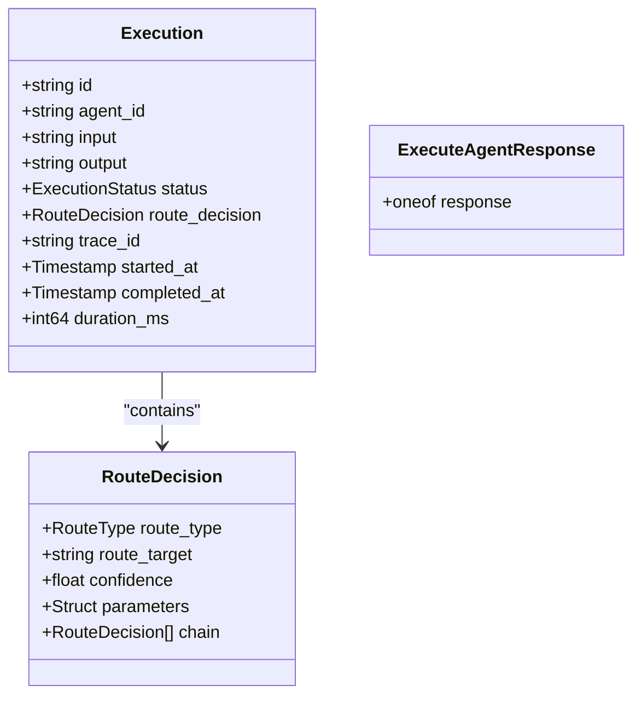
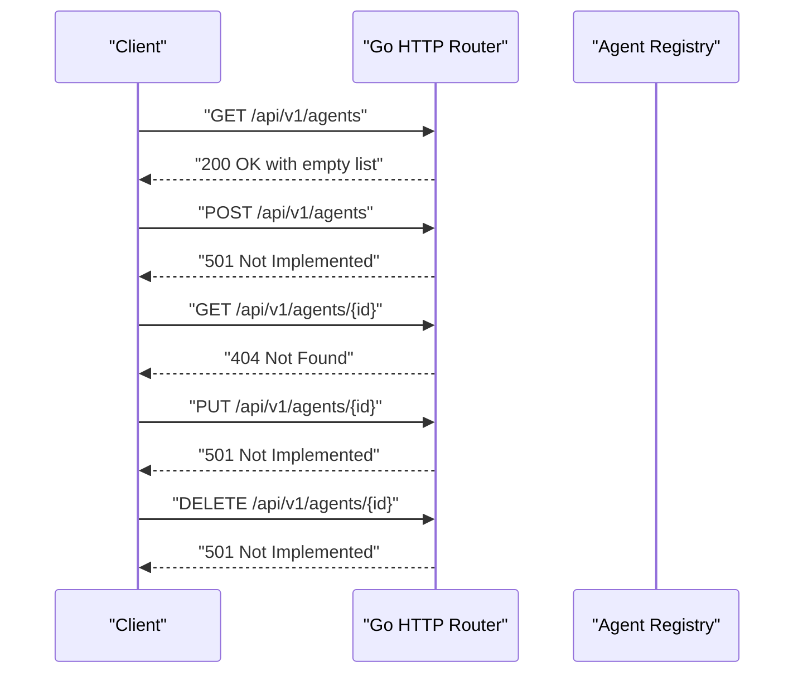
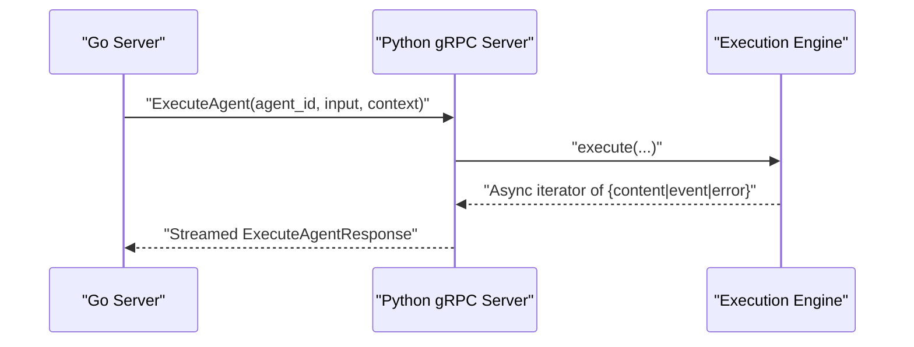
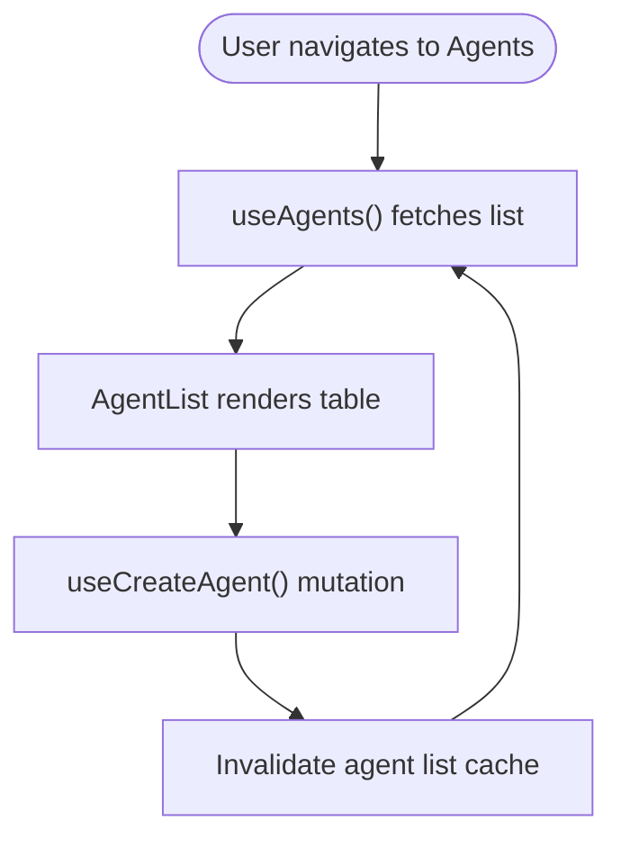
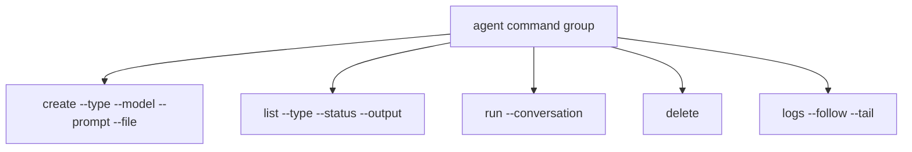
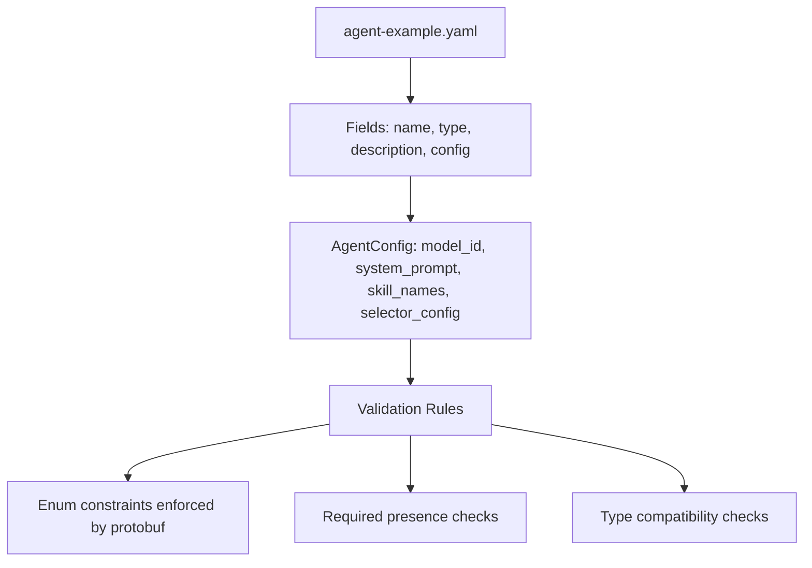
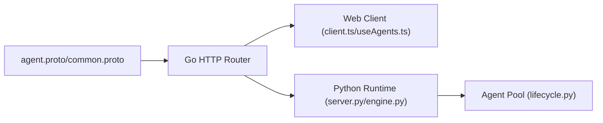

# Agent Management API

<cite>
**Referenced Files in This Document**
- [agent.proto](file://api/proto/resolvenet/v1/agent.proto)
- [common.proto](file://api/proto/resolvenet/v1/common.proto)
- [router.go](file://pkg/server/router.go)
- [client.ts](file://web/src/api/client.ts)
- [useAgents.ts](file://web/src/hooks/useAgents.ts)
- [agent-example.yaml](file://configs/examples/agent-example.yaml)
- [agent.go](file://pkg/registry/agent.go)
- [engine.py](file://python/src/resolvenet/runtime/engine.py)
- [server.py](file://python/src/resolvenet/runtime/server.py)
- [lifecycle.py](file://python/src/resolvenet/runtime/lifecycle.py)
- [AgentList.tsx](file://web/src/pages/Agents/AgentList.tsx)
- [AgentDetail.tsx](file://web/src/pages/Agents/AgentDetail.tsx)
- [create.go](file://internal/cli/agent/create.go)
- [delete.go](file://internal/cli/agent/delete.go)
- [list.go](file://internal/cli/agent/list.go)
- [run.go](file://internal/cli/agent/run.go)
- [logs.go](file://internal/cli/agent/logs.go)
- [agent_lifecycle_test.go](file://test/e2e/agent_lifecycle_test.go)
</cite>

## Table of Contents
1. [Introduction](#introduction)
2. [Project Structure](#project-structure)
3. [Core Components](#core-components)
4. [Architecture Overview](#architecture-overview)
5. [Detailed Component Analysis](#detailed-component-analysis)
6. [Dependency Analysis](#dependency-analysis)
7. [Performance Considerations](#performance-considerations)
8. [Troubleshooting Guide](#troubleshooting-guide)
9. [Conclusion](#conclusion)
10. [Appendices](#appendices)

## Introduction
This document describes the Agent Management API that enables lifecycle operations for agents, including creation, retrieval, listing, updates, deletion, and execution monitoring. It defines the Agent message structure, configuration fields, runtime status, and metadata. It also explains execution requests, progress tracking, and result retrieval mechanisms. The document covers the relationship between agents and underlying runtime services and provides client implementation examples for CRUD operations, real-time status updates, and batch agent management scenarios.

## Project Structure
The Agent Management API spans protocol buffers (protobuf), a Go HTTP server, a Python runtime execution engine, and a React web client.

**Diagram sources**
- [agent.proto:1-177](file://api/proto/resolvenet/v1/agent.proto#L1-L177)
- [common.proto:1-49](file://api/proto/resolvenet/v1/common.proto#L1-L49)
- [router.go:10-55](file://pkg/server/router.go#L10-L55)
- [engine.py:1-89](file://python/src/resolvenet/runtime/engine.py#L1-L89)
- [server.py:1-60](file://python/src/resolvenet/runtime/server.py#L1-L60)
- [lifecycle.py:1-52](file://python/src/resolvenet/runtime/lifecycle.py#L1-L52)
- [client.ts:1-85](file://web/src/api/client.ts#L1-L85)
- [useAgents.ts:1-29](file://web/src/hooks/useAgents.ts#L1-L29)
- [AgentList.tsx:1-41](file://web/src/pages/Agents/AgentList.tsx#L1-L41)
- [AgentDetail.tsx:1-29](file://web/src/pages/Agents/AgentDetail.tsx#L1-L29)

**Section sources**
- [agent.proto:1-177](file://api/proto/resolvenet/v1/agent.proto#L1-L177)
- [common.proto:1-49](file://api/proto/resolvenet/v1/common.proto#L1-L49)
- [router.go:10-55](file://pkg/server/router.go#L10-L55)

## Core Components
- AgentService: Defines lifecycle and execution RPCs for agents.
- Agent message: Encapsulates metadata, type, configuration, and status.
- AgentConfig: Holds model selection, system prompt, skills, workflow, RAG collection, arbitrary parameters, and selector configuration.
- Execution model: Tracks execution lifecycle, route decisions, timing, and status.
- Web client API: Provides typed REST endpoints for agents and integrates with React Query.
- Go HTTP router: Exposes REST endpoints for agents and execution.
- Python runtime engine: Orchestrates execution, emits events, and streams content.

**Section sources**
- [agent.proto:11-29](file://api/proto/resolvenet/v1/agent.proto#L11-L29)
- [agent.proto:42-47](file://api/proto/resolvenet/v1/agent.proto#L42-L47)
- [agent.proto:49-58](file://api/proto/resolvenet/v1/agent.proto#L49-L58)
- [agent.proto:124-136](file://api/proto/resolvenet/v1/agent.proto#L124-L136)
- [client.ts:20-48](file://web/src/api/client.ts#L20-L48)
- [router.go:18-24](file://pkg/server/router.go#L18-L24)
- [engine.py:14-31](file://python/src/resolvenet/runtime/engine.py#L14-L31)

## Architecture Overview
The Agent Management API consists of:
- Protobuf-defined service contract for agent lifecycle and execution.
- Go HTTP server implementing REST endpoints (currently stubbed).
- Python runtime execution server receiving gRPC requests and delegating to the execution engine.
- React web client consuming REST endpoints and managing UI state.

**Diagram sources**
- [router.go:24-94](file://pkg/server/router.go#L24-L94)
- [server.py:38-60](file://python/src/resolvenet/runtime/server.py#L38-L60)
- [engine.py:25-89](file://python/src/resolvenet/runtime/engine.py#L25-L89)

## Detailed Component Analysis

### Agent Message and Configuration
The Agent message encapsulates:
- ResourceMeta: identity, labels, annotations, timestamps, creator, and version.
- AgentType: supported agent categories.
- AgentConfig: model selection, system prompt, skill names, workflow association, RAG collection, free-form parameters, and selector configuration.
- ResourceStatus: lifecycle status of the agent resource.

**Diagram sources**
- [agent.proto:42-58](file://api/proto/resolvenet/v1/agent.proto#L42-L58)
- [agent.proto:29-39](file://api/proto/resolvenet/v1/agent.proto#L29-L39)
- [common.proto:28-48](file://api/proto/resolvenet/v1/common.proto#L28-L48)

**Section sources**
- [agent.proto:42-58](file://api/proto/resolvenet/v1/agent.proto#L42-L58)
- [agent.proto:60-65](file://api/proto/resolvenet/v1/agent.proto#L60-L65)
- [common.proto:28-48](file://api/proto/resolvenet/v1/common.proto#L28-L48)

### Execution Model and Progress Tracking
Executions track runtime progress and outcomes:
- Execution: execution identity, agent association, input/output, status, route decision, trace ID, timestamps, and duration.
- ExecutionStatus: lifecycle states for executions.
- RouteDecision: routing outcome from the Intelligent Selector.
- ExecuteAgentResponse: streaming response supporting content, events, and errors.

**Diagram sources**
- [agent.proto:124-136](file://api/proto/resolvenet/v1/agent.proto#L124-L136)
- [agent.proto:146-153](file://api/proto/resolvenet/v1/agent.proto#L146-L153)
- [agent.proto:104-110](file://api/proto/resolvenet/v1/agent.proto#L104-L110)

**Section sources**
- [agent.proto:124-144](file://api/proto/resolvenet/v1/agent.proto#L124-L144)
- [agent.proto:146-162](file://api/proto/resolvenet/v1/agent.proto#L146-L162)
- [agent.proto:104-110](file://api/proto/resolvenet/v1/agent.proto#L104-L110)

### Lifecycle Operations (REST)
The Go HTTP server exposes REST endpoints for agent lifecycle operations. Current implementation includes stub handlers that return placeholder responses.

**Diagram sources**
- [router.go:18-94](file://pkg/server/router.go#L18-L94)
- [agent.go:21-28](file://pkg/registry/agent.go#L21-L28)

**Section sources**
- [router.go:18-94](file://pkg/server/router.go#L18-L94)
- [agent.go:21-28](file://pkg/registry/agent.go#L21-L28)

### Execution Monitoring (gRPC Streaming)
The Python runtime provides a gRPC server and execution engine to process ExecuteAgent requests and stream responses. The Go server currently exposes an HTTP endpoint for execution that is not implemented.

**Diagram sources**
- [router.go](file://pkg/server/router.go#L24)
- [server.py:38-60](file://python/src/resolvenet/runtime/server.py#L38-L60)
- [engine.py:25-89](file://python/src/resolvenet/runtime/engine.py#L25-L89)

**Section sources**
- [server.py:11-60](file://python/src/resolvenet/runtime/server.py#L11-L60)
- [engine.py:14-89](file://python/src/resolvenet/runtime/engine.py#L14-L89)
- [router.go](file://pkg/server/router.go#L24)

### Client Implementation Examples
React Query hooks and UI components demonstrate CRUD and listing patterns:
- Listing agents with React Query.
- Creating agents via mutation and cache invalidation.
- Displaying agent details and execution history placeholders.

**Diagram sources**
- [useAgents.ts:4-28](file://web/src/hooks/useAgents.ts#L4-L28)
- [AgentList.tsx:1-41](file://web/src/pages/Agents/AgentList.tsx#L1-L41)
- [client.ts:24-30](file://web/src/api/client.ts#L24-L30)

**Section sources**
- [useAgents.ts:1-29](file://web/src/hooks/useAgents.ts#L1-L29)
- [AgentList.tsx:1-41](file://web/src/pages/Agents/AgentList.tsx#L1-L41)
- [client.ts:20-48](file://web/src/api/client.ts#L20-L48)

### CLI Commands for Agent Management
The CLI provides commands for agent lifecycle operations (placeholders pending implementation).

**Diagram sources**
- [create.go:9-31](file://internal/cli/agent/create.go#L9-L31)
- [list.go:9-28](file://internal/cli/agent/list.go#L9-L28)
- [run.go:9-28](file://internal/cli/agent/run.go#L9-L28)
- [delete.go:9-21](file://internal/cli/agent/delete.go#L9-L21)
- [logs.go:9-27](file://internal/cli/agent/logs.go#L9-L27)

**Section sources**
- [create.go:1-49](file://internal/cli/agent/create.go#L1-L49)
- [list.go:1-29](file://internal/cli/agent/list.go#L1-L29)
- [run.go:1-29](file://internal/cli/agent/run.go#L1-L29)
- [delete.go:1-22](file://internal/cli/agent/delete.go#L1-L22)
- [logs.go:1-28](file://internal/cli/agent/logs.go#L1-L28)

### Agent Definition Schema and Validation
Example agent YAML demonstrates typical fields and structure. Validation rules are implied by the protobuf schema and can include:
- Required fields: id/name in ResourceMeta, type in Agent.
- Enum constraints: AgentType, ExecutionStatus, RouteType, ResourceStatus.
- Optional fields: system_prompt, skill_names, workflow_id, rag_collection_id, selector_config.
- Parameterized configuration via google.protobuf.Struct.

**Diagram sources**
- [agent-example.yaml:1-18](file://configs/examples/agent-example.yaml#L1-L18)
- [agent.proto:49-58](file://api/proto/resolvenet/v1/agent.proto#L49-L58)
- [agent.proto:31-39](file://api/proto/resolvenet/v1/agent.proto#L31-L39)

**Section sources**
- [agent-example.yaml:1-18](file://configs/examples/agent-example.yaml#L1-L18)
- [agent.proto:49-58](file://api/proto/resolvenet/v1/agent.proto#L49-L58)
- [agent.proto:31-39](file://api/proto/resolvenet/v1/agent.proto#L31-L39)

## Dependency Analysis
- Protobuf contracts define the canonical API surface for agents and executions.
- Go server depends on protobuf-generated types and routes HTTP requests to business logic.
- Python runtime depends on the execution engine and lifecycle management for agent pooling.
- Web client depends on typed REST endpoints and React Query for state management.

**Diagram sources**
- [agent.proto:1-177](file://api/proto/resolvenet/v1/agent.proto#L1-L177)
- [common.proto:1-49](file://api/proto/resolvenet/v1/common.proto#L1-L49)
- [router.go:10-55](file://pkg/server/router.go#L10-L55)
- [client.ts:1-85](file://web/src/api/client.ts#L1-L85)
- [server.py:1-60](file://python/src/resolvenet/runtime/server.py#L1-L60)
- [engine.py:1-89](file://python/src/resolvenet/runtime/engine.py#L1-L89)
- [lifecycle.py:1-52](file://python/src/resolvenet/runtime/lifecycle.py#L1-L52)

**Section sources**
- [agent.proto:1-177](file://api/proto/resolvenet/v1/agent.proto#L1-L177)
- [common.proto:1-49](file://api/proto/resolvenet/v1/common.proto#L1-L49)
- [router.go:10-55](file://pkg/server/router.go#L10-L55)
- [client.ts:1-85](file://web/src/api/client.ts#L1-L85)
- [server.py:1-60](file://python/src/resolvenet/runtime/server.py#L1-L60)
- [engine.py:1-89](file://python/src/resolvenet/runtime/engine.py#L1-L89)
- [lifecycle.py:1-52](file://python/src/resolvenet/runtime/lifecycle.py#L1-L52)

## Performance Considerations
- Streaming execution responses reduce latency and enable real-time updates.
- Agent pooling with LRU eviction minimizes initialization overhead for frequently used agents.
- Pagination support in listing APIs prevents large payloads and improves scalability.
- Asynchronous execution engines allow concurrent processing of multiple agent runs.

[No sources needed since this section provides general guidance]

## Troubleshooting Guide
Common issues and patterns:
- HTTP 501 Not Implemented for agent lifecycle endpoints indicate missing backend implementation.
- HTTP 404 Not Found for agent retrieval suggests the agent does not exist or was not created.
- Execution endpoint requires a working gRPC runtime server; otherwise, clients receive Not Implemented responses.
- CLI commands are placeholders and do not perform actual operations until implemented.

**Section sources**
- [router.go:75-94](file://pkg/server/router.go#L75-L94)
- [router.go:79-82](file://pkg/server/router.go#L79-L82)

## Conclusion
The Agent Management API defines a robust contract for agent lifecycle and execution monitoring. While the REST endpoints are currently stubbed and execution relies on a separate Python runtime, the architecture supports scalable, streaming execution and efficient client integrations. Future work includes implementing the Go server handlers and integrating the Python runtime for production-grade agent orchestration.

[No sources needed since this section summarizes without analyzing specific files]

## Appendices

### API Reference Summary

- AgentService RPCs
  - CreateAgent: Creates an agent definition.
  - GetAgent: Retrieves an agent by ID.
  - ListAgents: Lists agents with pagination and filters.
  - UpdateAgent: Updates an existing agent.
  - DeleteAgent: Removes an agent.
  - ExecuteAgent: Streams execution results.
  - GetExecution: Retrieves execution details.
  - ListExecutions: Lists executions for an agent.

- Agent message fields
  - meta: ResourceMeta with identity and metadata.
  - type: AgentType enumeration.
  - config: AgentConfig with model, prompt, skills, workflow, RAG, parameters, and selector config.
  - status: ResourceStatus.

- Execution fields
  - id, agent_id, input, output, status, route_decision, trace_id, started_at, completed_at, duration_ms.

- Web client endpoints
  - GET /api/v1/agents
  - GET /api/v1/agents/{id}
  - POST /api/v1/agents
  - PUT /api/v1/agents/{id}
  - DELETE /api/v1/agents/{id}
  - POST /api/v1/agents/{id}/execute

**Section sources**
- [agent.proto:11-29](file://api/proto/resolvenet/v1/agent.proto#L11-L29)
- [agent.proto:42-47](file://api/proto/resolvenet/v1/agent.proto#L42-L47)
- [agent.proto:124-136](file://api/proto/resolvenet/v1/agent.proto#L124-L136)
- [client.ts:24-30](file://web/src/api/client.ts#L24-L30)

### Batch Agent Management Scenarios
- Bulk creation: Submit multiple CreateAgent requests sequentially or in parallel.
- Batch listing: Use ListAgents with pagination and filters to iterate over large sets.
- Batch execution: Trigger ExecuteAgent for multiple agents concurrently; monitor via ListExecutions.
- Batch deletion: Iterate DeleteAgent across agent IDs after verifying status.

[No sources needed since this section provides general guidance]

### End-to-End Testing
- E2E test scaffolding exists for agent lifecycle testing but is currently skipped pending infrastructure.

**Section sources**
- [agent_lifecycle_test.go:1-13](file://test/e2e/agent_lifecycle_test.go#L1-L13)