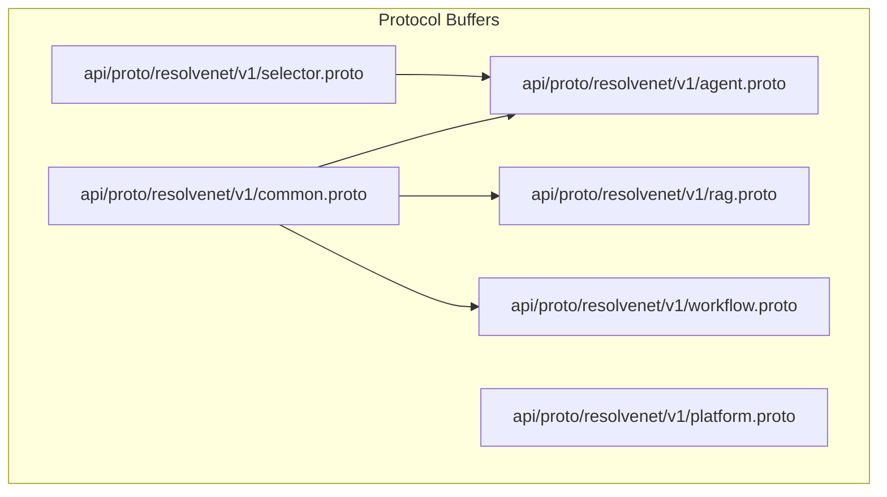
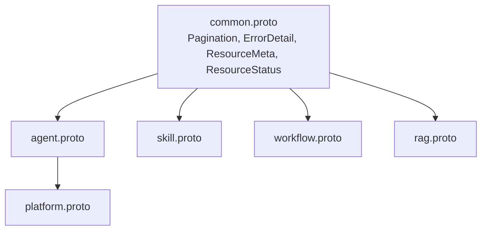
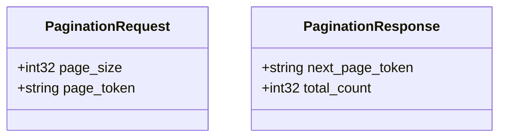
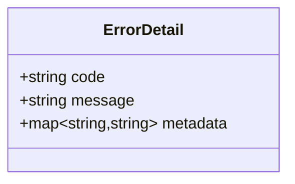
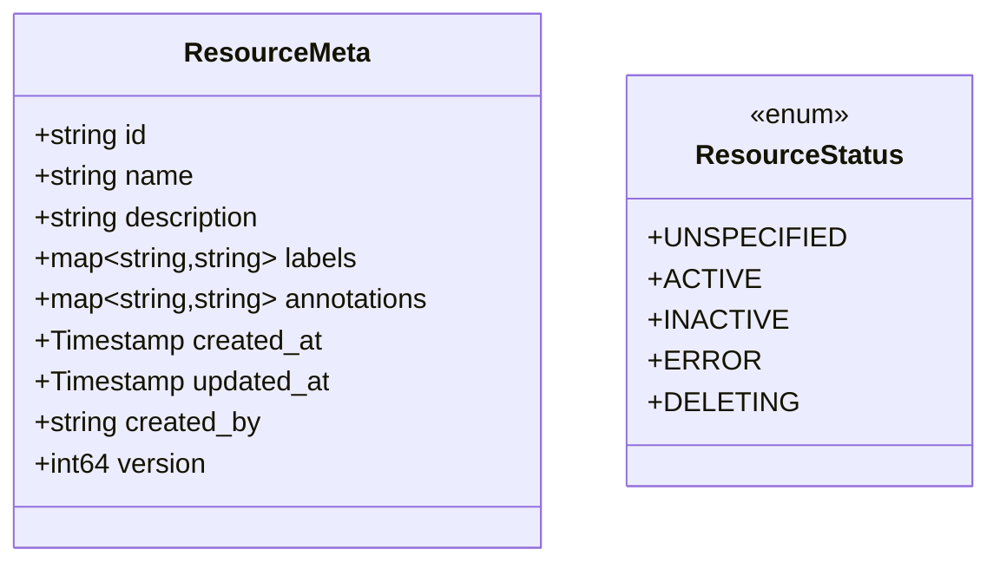
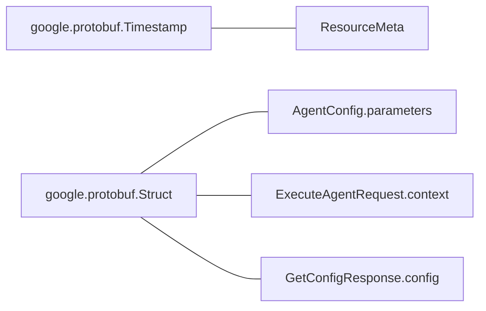
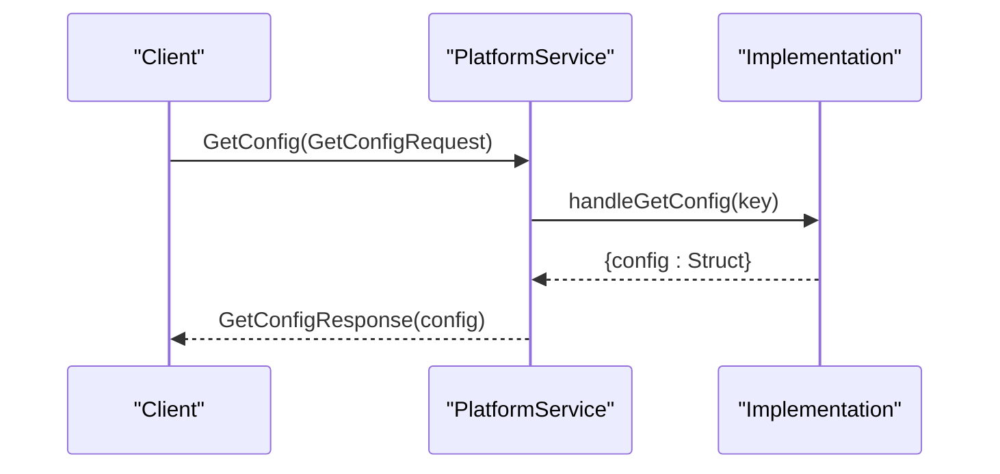
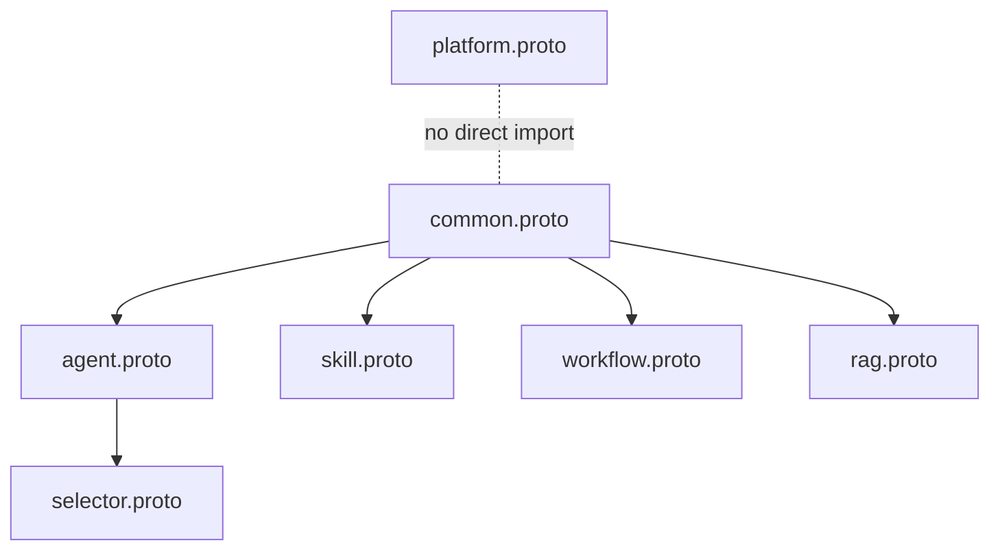
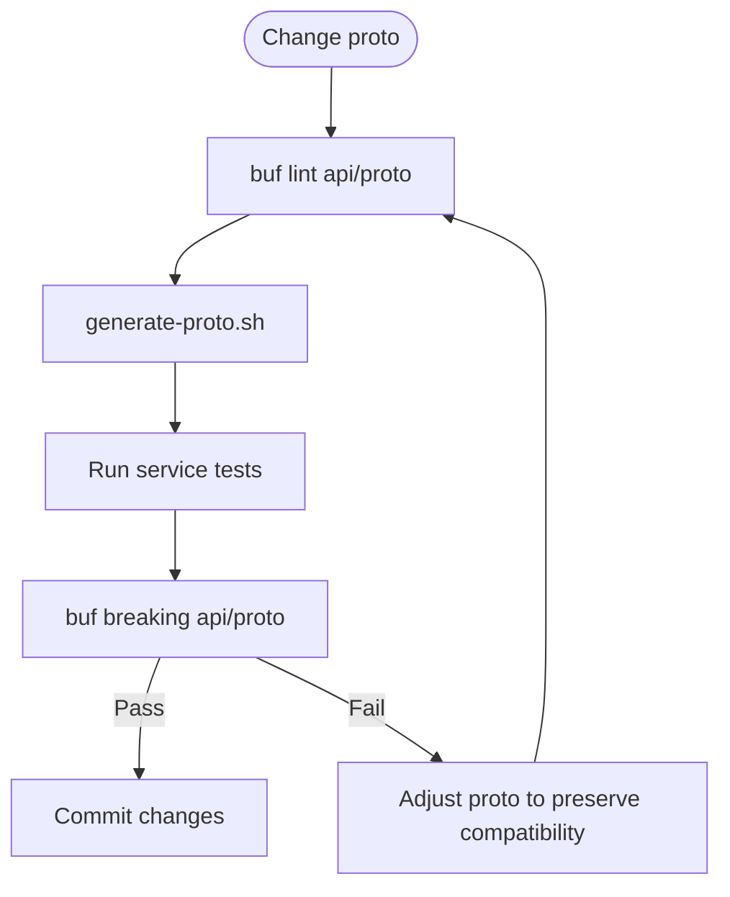

# Common Types and Messages

<cite>
**Referenced Files in This Document**
- [common.proto](file://api/proto/resolvenet/v1/common.proto)
- [agent.proto](file://api/proto/resolvenet/v1/agent.proto)
- [platform.proto](file://api/proto/resolvenet/v1/platform.proto)
- [rag.proto](file://api/proto/resolvenet/v1/rag.proto)
- [selector.proto](file://api/proto/resolvenet/v1/selector.proto)
- [workflow.proto](file://api/proto/resolvenet/v1/workflow.proto)
- [buf.yaml](file://tools/buf/buf.yaml)
- [buf.gen.yaml](file://tools/buf/buf.gen.yaml)
- [generate-proto.sh](file://hack/generate-proto.sh)
- [lint.sh](file://hack/lint.sh)
</cite>

## Table of Contents
1. [Introduction](#introduction)
2. [Project Structure](#project-structure)
3. [Core Components](#core-components)
4. [Architecture Overview](#architecture-overview)
5. [Detailed Component Analysis](#detailed-component-analysis)
6. [Dependency Analysis](#dependency-analysis)
7. [Performance Considerations](#performance-considerations)
8. [Troubleshooting Guide](#troubleshooting-guide)
9. [Conclusion](#conclusion)
10. [Appendices](#appendices)

## Introduction
This document describes the common Protocol Buffer message types and utility definitions used across all ResolveNet services. It focuses on shared message structures such as pagination, resource metadata, and status enums, and explains how services compose these types to achieve consistent request/response patterns, error reporting, and cross-language compatibility. It also provides guidance on naming conventions, field numbering strategies, versioning implications, and extension practices that maintain backward compatibility.

## Project Structure
ResolveNet defines service APIs using Protocol Buffers under a versioned package. The common types are declared in a dedicated common module and imported by service-specific modules. The Buf toolchain generates language bindings and enforces linting and breaking-change detection.

**Diagram sources**
- [common.proto](file://api/proto/resolvenet/v1/common.proto)
- [agent.proto](file://api/proto/resolvenet/v1/agent.proto)
- [platform.proto](file://api/proto/resolvenet/v1/platform.proto)
- [rag.proto](file://api/proto/resolvenet/v1/rag.proto)
- [selector.proto](file://api/proto/resolvenet/v1/selector.proto)
- [workflow.proto](file://api/proto/resolvenet/v1/workflow.proto)

**Section sources**
- [common.proto](file://api/proto/resolvenet/v1/common.proto)
- [agent.proto](file://api/proto/resolvenet/v1/agent.proto)
- [platform.proto](file://api/proto/resolvenet/v1/platform.proto)
- [rag.proto](file://api/proto/resolvenet/v1/rag.proto)
- [selector.proto](file://api/proto/resolvenet/v1/selector.proto)
- [workflow.proto](file://api/proto/resolvenet/v1/workflow.proto)
- [buf.yaml](file://tools/buf/buf.yaml)
- [buf.gen.yaml](file://tools/buf/buf.gen.yaml)

## Core Components
This section summarizes the shared types and enums that appear across services.

- Pagination types
  - PaginationRequest: page_size, page_token
  - PaginationResponse: next_page_token, total_count
- Error reporting
  - ErrorDetail: code, message, metadata
- Resource metadata and status
  - ResourceMeta: id, name, description, labels, annotations, created_at, updated_at, created_by, version
  - ResourceStatus: UNSPECIFIED, ACTIVE, INACTIVE, ERROR, DELETING
- Cross-language compatibility
  - Uses google.protobuf.Timestamp and google.protobuf.Struct for timestamps and dynamic values
- Versioning and packaging
  - Package resolvenet.v1 with language-specific go_package option
  - Generated code placed under pkg/api with paths=source_relative

Examples of usage across services:
- AgentService: composes ResourceMeta, ResourceStatus, PaginationRequest/PaginationResponse
- SkillService: composes ResourceMeta, ResourceStatus, PaginationRequest/PaginationResponse
- WorkflowService: composes ResourceMeta, ResourceStatus, PaginationRequest/PaginationResponse
- RAGService: composes ResourceMeta, ResourceStatus, PaginationRequest/PaginationResponse
- PlatformService: uses google.protobuf.Struct for configuration payloads

**Section sources**
- [common.proto](file://api/proto/resolvenet/v1/common.proto)
- [agent.proto](file://api/proto/resolvenet/v1/agent.proto)
- [rag.proto](file://api/proto/resolvenet/v1/rag.proto)
- [workflow.proto](file://api/proto/resolvenet/v1/workflow.proto)
- [platform.proto](file://api/proto/resolvenet/v1/platform.proto)

## Architecture Overview
The common types enable a uniform contract across services. Services import common.proto and compose shared messages to standardize pagination, resource metadata, and error reporting. The Buf toolchain generates idiomatic client/server stubs and JSON/HTTP adapters for cross-language consumption.

**Diagram sources**
- [common.proto](file://api/proto/resolvenet/v1/common.proto)
- [agent.proto](file://api/proto/resolvenet/v1/agent.proto)
- [rag.proto](file://api/proto/resolvenet/v1/rag.proto)
- [workflow.proto](file://api/proto/resolvenet/v1/workflow.proto)
- [platform.proto](file://api/proto/resolvenet/v1/platform.proto)

## Detailed Component Analysis

### Shared Pagination Types
- Purpose: Provide consistent pagination across list operations.
- Composition pattern: Services embed PaginationRequest for queries and PaginationResponse for results.
- Typical usage: ListAgentsRequest, ListSkillsRequest, ListWorkflowsRequest, ListExecutionsRequest, ListCollectionsRequest.

**Diagram sources**
- [common.proto](file://api/proto/resolvenet/v1/common.proto)

**Section sources**
- [common.proto](file://api/proto/resolvenet/v1/common.proto)
- [agent.proto](file://api/proto/resolvenet/v1/agent.proto)
- [rag.proto](file://api/proto/resolvenet/v1/rag.proto)
- [workflow.proto](file://api/proto/resolvenet/v1/workflow.proto)

### ErrorDetail for Standardized Error Reporting
- Purpose: Provide a consistent error envelope across services.
- Fields: code, message, metadata (map of string to string).
- Usage pattern: Services return ErrorDetail in error branches or wrap errors in response envelopes.

**Diagram sources**
- [common.proto](file://api/proto/resolvenet/v1/common.proto)

**Section sources**
- [common.proto](file://api/proto/resolvenet/v1/common.proto)
- [platform.proto](file://api/proto/resolvenet/v1/platform.proto)

### ResourceMeta and ResourceStatus
- Purpose: Provide a canonical resource identity and lifecycle metadata.
- Composition pattern: All domain entities include ResourceMeta; status is represented by ResourceStatus.
- Typical usage: Agent, Skill, Workflow, Collection.

**Diagram sources**
- [common.proto](file://api/proto/resolvenet/v1/common.proto)

**Section sources**
- [common.proto](file://api/proto/resolvenet/v1/common.proto)
- [agent.proto](file://api/proto/resolvenet/v1/agent.proto)
- [rag.proto](file://api/proto/resolvenet/v1/rag.proto)
- [workflow.proto](file://api/proto/resolvenet/v1/workflow.proto)
- [skill.proto](file://api/proto/resolvenet/v1/skill.proto)

### Cross-Language Compatibility and Serialization
- Timestamps: google.protobuf.Timestamp ensures consistent time representation across languages.
- Dynamic values: google.protobuf.Struct enables flexible configuration and context payloads.
- JSON/HTTP: The Buf gateway plugin generates REST endpoints from gRPC services for browser and HTTP clients.
- Language bindings: go_package option and paths=source_relative produce idiomatic Go packages under pkg/api.

**Diagram sources**
- [common.proto](file://api/proto/resolvenet/v1/common.proto)
- [agent.proto](file://api/proto/resolvenet/v1/agent.proto)
- [platform.proto](file://api/proto/resolvenet/v1/platform.proto)

**Section sources**
- [common.proto](file://api/proto/resolvenet/v1/common.proto)
- [agent.proto](file://api/proto/resolvenet/v1/agent.proto)
- [platform.proto](file://api/proto/resolvenet/v1/platform.proto)
- [buf.gen.yaml](file://tools/buf/buf.gen.yaml)

### Message Composition Patterns Across Services
- List operations: Embed PaginationRequest and return repeated items plus PaginationResponse.
- Resource operations: Embed ResourceMeta and ResourceStatus in entity messages.
- Error handling: Use ErrorDetail consistently for error reporting.

**Diagram sources**
- [platform.proto](file://api/proto/resolvenet/v1/platform.proto)

**Section sources**
- [platform.proto](file://api/proto/resolvenet/v1/platform.proto)
- [agent.proto](file://api/proto/resolvenet/v1/agent.proto)
- [rag.proto](file://api/proto/resolvenet/v1/rag.proto)
- [workflow.proto](file://api/proto/resolvenet/v1/workflow.proto)

## Dependency Analysis
Common types are consumed by service modules. SelectorService depends on Agent types for routing decisions. The Buf configuration governs linting and breaking-change detection.

**Diagram sources**
- [common.proto](file://api/proto/resolvenet/v1/common.proto)
- [agent.proto](file://api/proto/resolvenet/v1/agent.proto)
- [rag.proto](file://api/proto/resolvenet/v1/rag.proto)
- [workflow.proto](file://api/proto/resolvenet/v1/workflow.proto)
- [platform.proto](file://api/proto/resolvenet/v1/platform.proto)
- [selector.proto](file://api/proto/resolvenet/v1/selector.proto)

**Section sources**
- [selector.proto](file://api/proto/resolvenet/v1/selector.proto)
- [buf.yaml](file://tools/buf/buf.yaml)

## Performance Considerations
- Prefer streaming RPCs for long-running operations (e.g., agent execution, workflow execution) to reduce latency and improve responsiveness.
- Use PaginationRequest.page_size judiciously to balance payload size and round-trip overhead.
- Minimize nested structures in google.protobuf.Struct to keep serialized payloads compact.
- Keep ResourceMeta lightweight; avoid storing large binary blobs in ResourceMeta; use external storage with identifiers.

## Troubleshooting Guide
- Validation and linting: Run buf lint to catch style and dependency issues.
- Generation: Use the provided script to regenerate code after proto changes.
- Breaking changes: Buf breaking enforcement on FILE level helps prevent incompatible changes to message layouts.

**Diagram sources**
- [lint.sh](file://hack/lint.sh)
- [generate-proto.sh](file://hack/generate-proto.sh)
- [buf.yaml](file://tools/buf/buf.yaml)

**Section sources**
- [lint.sh](file://hack/lint.sh)
- [generate-proto.sh](file://hack/generate-proto.sh)
- [buf.yaml](file://tools/buf/buf.yaml)

## Conclusion
The common types in common.proto establish a consistent foundation for pagination, resource metadata, and error reporting across ResolveNet services. By composing these shared types and adhering to the Buf toolchain’s linting and breaking-change policies, the project maintains cross-language compatibility and evolves safely over time.

## Appendices

### Naming Conventions and Field Numbering Strategies
- Naming conventions
  - Use PascalCase for message and enum names.
  - Use UPPER_SNAKE_CASE for enum values with explicit zero-value UNPREFIXED_ENUM_NAME_UNSPECIFIED.
  - Use camelCase for field names.
- Field numbering
  - Reserve low-numbered fields for frequently used fields.
  - Leave gaps between major groups to accommodate future additions without renumbering.
  - Do not reuse field numbers once removed from a message.
- Versioning implications
  - Add new fields with new tags; never remove or repurpose existing tags.
  - Use oneof for mutually exclusive fields to minimize storage and clarify intent.
  - Keep google.protobuf.Timestamp and google.protobuf.Struct fields optional in older messages to avoid breaking deserialization.

### Guidelines for Extending Common Types
- Backward compatibility
  - Never delete or modify existing fields.
  - Introduce new fields with new tags; mark old consumers as optional.
- Enum safety
  - Always include UNSPECIFIED as the zero value.
  - Do not reorder enum values; append new values at the end.
- Cross-language compatibility
  - Use google.protobuf.Timestamp for time fields.
  - Use google.protobuf.Struct for dynamic configuration and context payloads.
- Generation and testing
  - Regenerate code after changes using the provided script.
  - Verify lint passes and breaking checks succeed before merging.