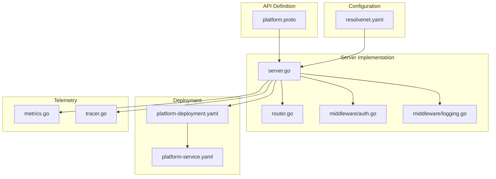
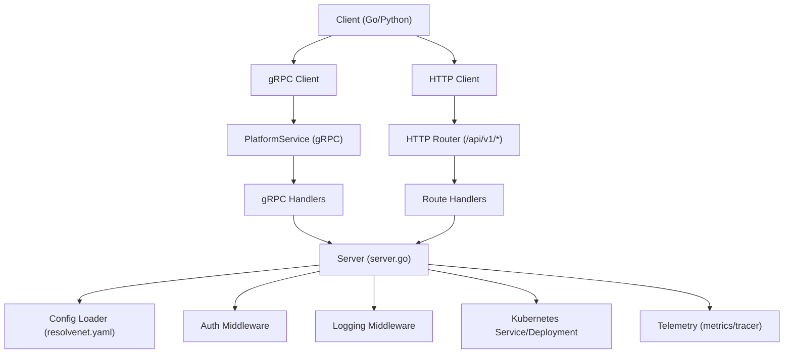
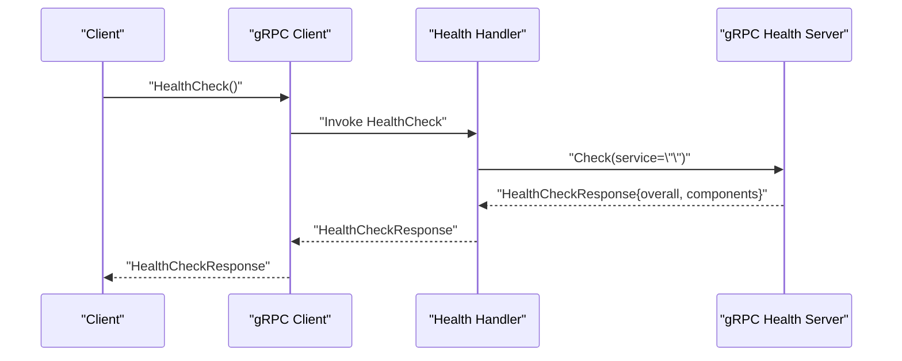
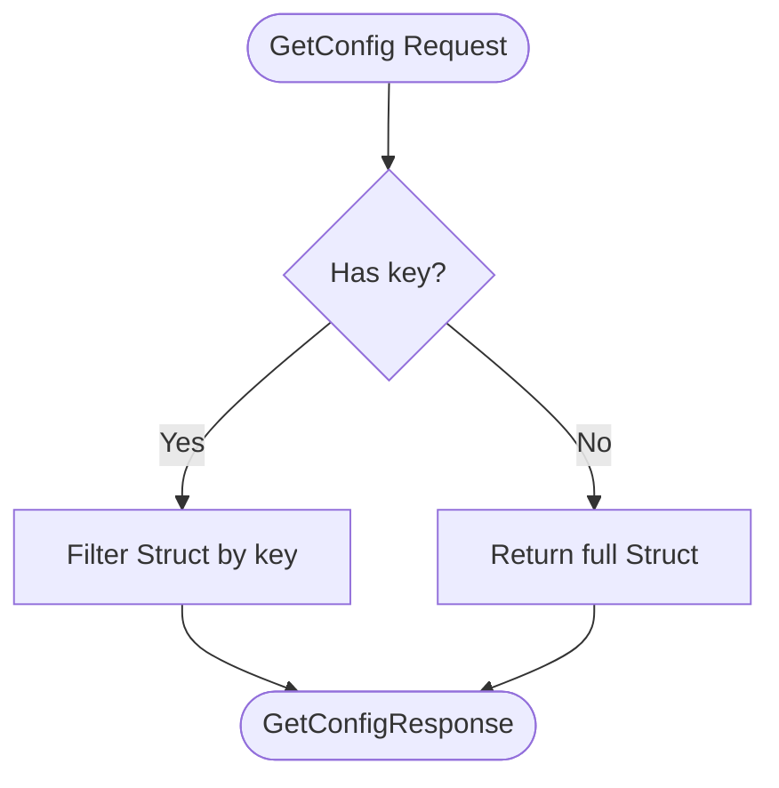
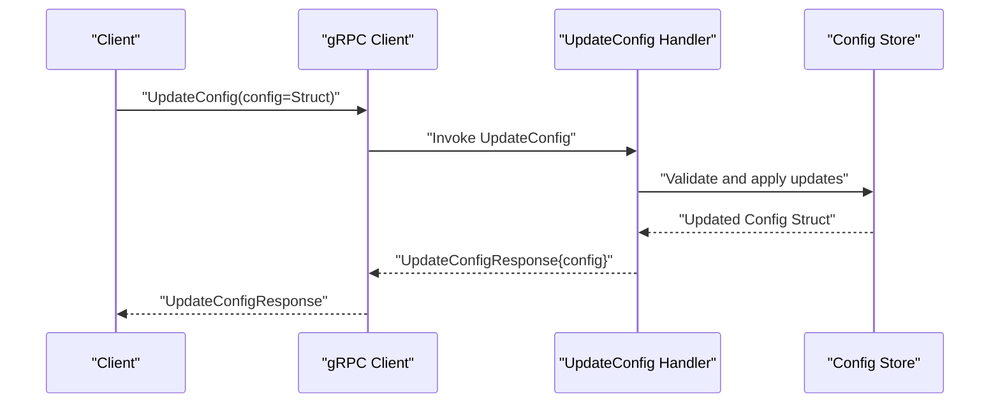
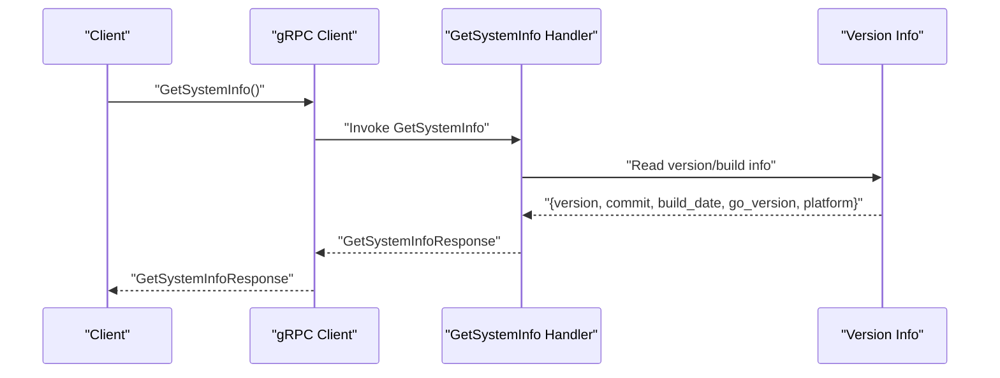
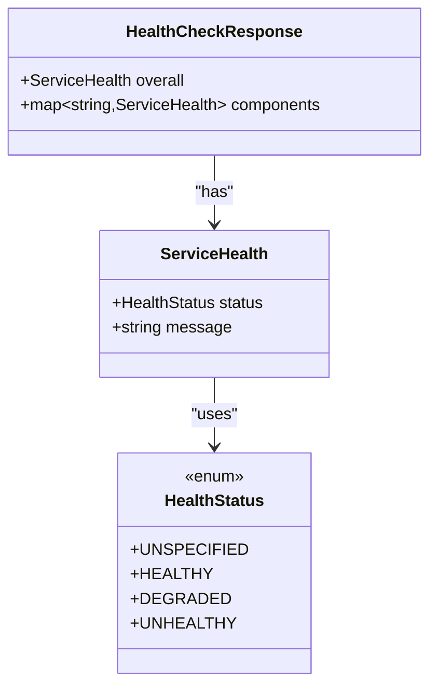
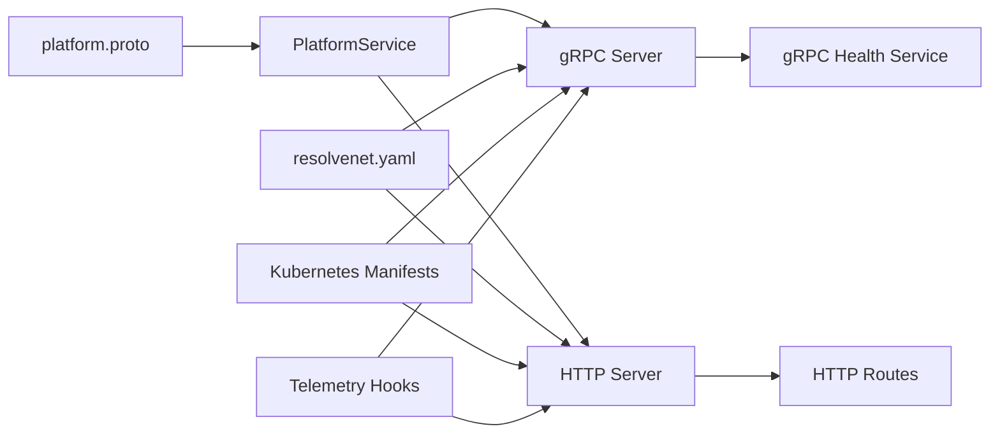

# Platform Service API

<cite>
**Referenced Files in This Document**
- [platform.proto](file://api/proto/resolvenet/v1/platform.proto)
- [server.go](file://pkg/server/server.go)
- [router.go](file://pkg/server/router.go)
- [auth.go](file://pkg/server/middleware/auth.go)
- [logging.go](file://pkg/server/middleware/logging.go)
- [resolvenet.yaml](file://configs/resolvenet.yaml)
- [main.go](file://cmd/resolvenet-server/main.go)
- [platform-deployment.yaml](file://deploy/helm/resolvenet/templates/platform-deployment.yaml)
- [platform-service.yaml](file://deploy/helm/resolvenet/templates/platform-service.yaml)
- [metrics.go](file://pkg/telemetry/metrics.go)
- [tracer.go](file://pkg/telemetry/tracer.go)
</cite>

## Table of Contents
1. [Introduction](#introduction)
2. [Project Structure](#project-structure)
3. [Core Components](#core-components)
4. [Architecture Overview](#architecture-overview)
5. [Detailed Component Analysis](#detailed-component-analysis)
6. [Dependency Analysis](#dependency-analysis)
7. [Performance Considerations](#performance-considerations)
8. [Troubleshooting Guide](#troubleshooting-guide)
9. [Conclusion](#conclusion)
10. [Appendices](#appendices)

## Introduction
This document describes the Platform Service API that provides system health monitoring, configuration management, and system information services. It covers the gRPC service definition, message schemas, server implementation, deployment configuration, and integration guidance within the ResolveNet ecosystem. It also outlines client implementation patterns for Go and Python, error handling, authentication, rate limiting considerations, and monitoring best practices.

## Project Structure
The Platform Service API is defined in protocol buffers and served by a Go-based HTTP/gRPC server. Configuration is loaded from YAML and environment variables. Kubernetes/Helm manifests expose the service and configure probes. Middleware supports logging and placeholder authentication. Telemetry components provide hooks for metrics and tracing.

**Diagram sources**
- [platform.proto:1-61](file://api/proto/resolvenet/v1/platform.proto#L1-L61)
- [server.go:1-104](file://pkg/server/server.go#L1-L104)
- [router.go:57-94](file://pkg/server/router.go#L57-L94)
- [auth.go:1-18](file://pkg/server/middleware/auth.go#L1-L18)
- [logging.go:1-38](file://pkg/server/middleware/logging.go#L1-L38)
- [resolvenet.yaml:1-34](file://configs/resolvenet.yaml#L1-L34)
- [platform-deployment.yaml:1-38](file://deploy/helm/resolvenet/templates/platform-deployment.yaml#L1-L38)
- [platform-service.yaml:1-17](file://deploy/helm/resolvenet/templates/platform-service.yaml#L1-L17)
- [metrics.go:1-13](file://pkg/telemetry/metrics.go#L1-L13)
- [tracer.go:1-22](file://pkg/telemetry/tracer.go#L1-L22)

**Section sources**
- [platform.proto:1-61](file://api/proto/resolvenet/v1/platform.proto#L1-L61)
- [server.go:1-104](file://pkg/server/server.go#L1-L104)
- [resolvenet.yaml:1-34](file://configs/resolvenet.yaml#L1-L34)
- [platform-deployment.yaml:1-38](file://deploy/helm/resolvenet/templates/platform-deployment.yaml#L1-L38)
- [platform-service.yaml:1-17](file://deploy/helm/resolvenet/templates/platform-service.yaml#L1-L17)

## Core Components
- PlatformService gRPC interface with four RPCs:
  - HealthCheck: Returns overall and per-component health status.
  - GetConfig: Retrieves configuration as a Google Struct; optional key filtering.
  - UpdateConfig: Updates configuration via a Google Struct payload.
  - GetSystemInfo: Returns version, commit, build date, Go version, and platform.
- HealthCheckResponse includes:
  - overall ServiceHealth
  - components map of ServiceHealth entries
- ServiceHealth includes:
  - status: HealthStatus enum
  - message: human-readable status text
- HealthStatus enum values:
  - UNSPECIFIED, HEALTHY, DEGRADED, UNHEALTHY

**Section sources**
- [platform.proto:9-60](file://api/proto/resolvenet/v1/platform.proto#L9-L60)

## Architecture Overview
The Platform Service exposes:
- gRPC endpoint for service discovery and health checking
- HTTP REST endpoints for basic health and system info
- Kubernetes services and deployments for containerized operation
- Middleware for logging and placeholder authentication
- Telemetry hooks for metrics and tracing

**Diagram sources**
- [server.go:27-52](file://pkg/server/server.go#L27-L52)
- [router.go:57-94](file://pkg/server/router.go#L57-L94)
- [auth.go:8-17](file://pkg/server/middleware/auth.go#L8-L17)
- [logging.go:19-37](file://pkg/server/middleware/logging.go#L19-L37)
- [resolvenet.yaml:3-5](file://configs/resolvenet.yaml#L3-L5)
- [platform-deployment.yaml:29-37](file://deploy/helm/resolvenet/templates/platform-deployment.yaml#L29-L37)
- [platform-service.yaml:8-16](file://deploy/helm/resolvenet/templates/platform-service.yaml#L8-L16)
- [metrics.go:7-12](file://pkg/telemetry/metrics.go#L7-L12)
- [tracer.go:8-21](file://pkg/telemetry/tracer.go#L8-L21)

## Detailed Component Analysis

### HealthCheck RPC
Purpose: Verify service health and component status.

- Request: HealthCheckRequest (empty)
- Response: HealthCheckResponse with:
  - overall ServiceHealth
  - components map<string, ServiceHealth>

Implementation highlights:
- gRPC health service is registered by the server.
- HTTP health endpoint exists at /api/v1/health returning JSON.

**Diagram sources**
- [server.go:37-42](file://pkg/server/server.go#L37-L42)
- [router.go:57-59](file://pkg/server/router.go#L57-L59)

**Section sources**
- [platform.proto:10-22](file://api/proto/resolvenet/v1/platform.proto#L10-L22)
- [server.go:37-42](file://pkg/server/server.go#L37-L42)
- [router.go:57-59](file://pkg/server/router.go#L57-L59)

### GetConfig RPC
Purpose: Retrieve configuration as a Google Struct; optionally filtered by key.

- Request: GetConfigRequest with optional key field
- Response: GetConfigResponse containing google.protobuf.Struct

Notes:
- Empty key means return all configuration.
- Configuration is loaded from YAML and environment variables.

**Diagram sources**
- [platform.proto:36-42](file://api/proto/resolvenet/v1/platform.proto#L36-L42)
- [config.go:11-62](file://pkg/config/config.go#L11-L62)

**Section sources**
- [platform.proto:36-42](file://api/proto/resolvenet/v1/platform.proto#L36-L42)
- [config.go:11-62](file://pkg/config/config.go#L11-L62)
- [resolvenet.yaml:1-34](file://configs/resolvenet.yaml#L1-L34)

### UpdateConfig RPC
Purpose: Modify configuration using a Google Struct payload.

- Request: UpdateConfigRequest with google.protobuf.Struct
- Response: UpdateConfigResponse with updated google.protobuf.Struct

Guidance:
- Validate and merge incoming Struct against current configuration.
- Persist changes according to configuration storage strategy.

**Diagram sources**
- [platform.proto:44-50](file://api/proto/resolvenet/v1/platform.proto#L44-L50)

**Section sources**
- [platform.proto:44-50](file://api/proto/resolvenet/v1/platform.proto#L44-L50)

### GetSystemInfo RPC
Purpose: Retrieve version and build information.

- Request: GetSystemInfoRequest (empty)
- Response: GetSystemInfoResponse with:
  - version, commit, build_date, go_version, platform

Implementation:
- HTTP handler returns version/build metadata.
- gRPC handler would mirror this data.

**Diagram sources**
- [platform.proto:52-60](file://api/proto/resolvenet/v1/platform.proto#L52-L60)
- [router.go:61-67](file://pkg/server/router.go#L61-L67)

**Section sources**
- [platform.proto:52-60](file://api/proto/resolvenet/v1/platform.proto#L52-L60)
- [router.go:61-67](file://pkg/server/router.go#L61-L67)

### ServiceHealth and HealthStatus
Structure:
- ServiceHealth: status (HealthStatus enum), message (string)
- HealthStatus: UNSPECIFIED, HEALTHY, DEGRADED, UNHEALTHY

Usage:
- HealthCheckResponse.overall and components use ServiceHealth.
- Implementors should populate message with actionable diagnostics.

**Diagram sources**
- [platform.proto:19-34](file://api/proto/resolvenet/v1/platform.proto#L19-L34)

**Section sources**
- [platform.proto:19-34](file://api/proto/resolvenet/v1/platform.proto#L19-L34)

## Dependency Analysis
- Protocol buffer service definition depends on Google Struct for flexible configuration payloads.
- Server composes gRPC health service and HTTP mux routes.
- Configuration loading supports YAML files and environment variables.
- Kubernetes manifests define service exposure and liveness/readiness probes.
- Telemetry components provide initialization hooks for metrics and tracing.

**Diagram sources**
- [platform.proto:1-61](file://api/proto/resolvenet/v1/platform.proto#L1-L61)
- [server.go:27-52](file://pkg/server/server.go#L27-L52)
- [resolvenet.yaml:1-34](file://configs/resolvenet.yaml#L1-L34)
- [platform-deployment.yaml:29-37](file://deploy/helm/resolvenet/templates/platform-deployment.yaml#L29-L37)
- [platform-service.yaml:8-16](file://deploy/helm/resolvenet/templates/platform-service.yaml#L8-L16)
- [metrics.go:7-12](file://pkg/telemetry/metrics.go#L7-L12)
- [tracer.go:8-21](file://pkg/telemetry/tracer.go#L8-L21)

**Section sources**
- [platform.proto:1-61](file://api/proto/resolvenet/v1/platform.proto#L1-L61)
- [server.go:27-52](file://pkg/server/server.go#L27-L52)
- [resolvenet.yaml:1-34](file://configs/resolvenet.yaml#L1-L34)
- [platform-deployment.yaml:29-37](file://deploy/helm/resolvenet/templates/platform-deployment.yaml#L29-L37)
- [platform-service.yaml:8-16](file://deploy/helm/resolvenet/templates/platform-service.yaml#L8-L16)
- [metrics.go:7-12](file://pkg/telemetry/metrics.go#L7-L12)
- [tracer.go:8-21](file://pkg/telemetry/tracer.go#L8-L21)

## Performance Considerations
- Keep configuration payloads compact; avoid unnecessary nesting.
- Cache frequently accessed configuration segments in-memory.
- Use streaming or pagination for large configuration structures if extended.
- Ensure gRPC keepalive and timeouts are configured appropriately.
- Monitor HTTP and gRPC latencies; set up alerting thresholds.

[No sources needed since this section provides general guidance]

## Troubleshooting Guide
Common issues and resolutions:
- Health check failures:
  - Verify liveness/readiness probes are hitting /api/v1/health.
  - Confirm gRPC health service registration and connectivity.
- Authentication:
  - Current auth middleware is a placeholder; implement JWT or API key validation.
- Rate limiting:
  - Not implemented yet; consider adding middleware or API gateway controls.
- Configuration errors:
  - Validate YAML syntax and environment variable overrides.
  - Ensure keys match expected configuration structure.

Operational references:
- Health endpoints and probes are defined in Kubernetes manifests.
- Logging middleware records method, path, status, duration, and remote address.

**Section sources**
- [platform-deployment.yaml:29-37](file://deploy/helm/resolvenet/templates/platform-deployment.yaml#L29-L37)
- [auth.go:8-17](file://pkg/server/middleware/auth.go#L8-L17)
- [logging.go:19-37](file://pkg/server/middleware/logging.go#L19-L37)

## Conclusion
The Platform Service API provides essential operational capabilities: health verification, configuration management, and system information retrieval. Its design leverages gRPC for strong typing and HTTP for simple integrations. With configurable middleware, telemetry hooks, and Kubernetes-ready deployment, it fits seamlessly into the ResolveNet ecosystem. Future enhancements should focus on robust authentication, rate limiting, and comprehensive health coverage.

[No sources needed since this section summarizes without analyzing specific files]

## Appendices

### API Reference Summary

- Service: PlatformService
  - RPC: HealthCheck(HealthCheckRequest) -> HealthCheckResponse
  - RPC: GetConfig(GetConfigRequest) -> GetConfigResponse
  - RPC: UpdateConfig(UpdateConfigRequest) -> UpdateConfigResponse
  - RPC: GetSystemInfo(GetSystemInfoRequest) -> GetSystemInfoResponse

- Messages and Enums
  - HealthCheckRequest: empty
  - HealthCheckResponse: ServiceHealth overall, map<string, ServiceHealth> components
  - ServiceHealth: HealthStatus status, string message
  - HealthStatus: UNSPECIFIED, HEALTHY, DEGRADED, UNHEALTHY
  - GetConfigRequest: string key (empty means all)
  - GetConfigResponse: google.protobuf.Struct config
  - UpdateConfigRequest: google.protobuf.Struct config
  - UpdateConfigResponse: google.protobuf.Struct config
  - GetSystemInfoRequest: empty
  - GetSystemInfoResponse: version, commit, build_date, go_version, platform

**Section sources**
- [platform.proto:9-60](file://api/proto/resolvenet/v1/platform.proto#L9-L60)

### Client Implementation Patterns

- Go client
  - Use generated gRPC stubs for PlatformService.
  - Configure credentials and interceptors as needed.
  - Example invocation paths:
    - HealthCheck: [platform.proto:10-11](file://api/proto/resolvenet/v1/platform.proto#L10-L11)
    - GetConfig: [platform.proto:11-12](file://api/proto/resolvenet/v1/platform.proto#L11-L12)
    - UpdateConfig: [platform.proto:12-13](file://api/proto/resolvenet/v1/platform.proto#L12-L13)
    - GetSystemInfo: [platform.proto:13-14](file://api/proto/resolvenet/v1/platform.proto#L13-L14)

- Python client
  - Use the Python SDK module structure under python/src/resolvenet.
  - Integrate with gRPC channel and service stubs.
  - Example module paths:
    - Package init: [__init__.py:1-4](file://python/src/resolvenet/__init__.py#L1-L4)
    - Runtime server skeleton: [server.py:1-45](file://python/src/resolvenet/runtime/server.py#L1-L45)

**Section sources**
- [platform.proto:1-61](file://api/proto/resolvenet/v1/platform.proto#L1-L61)
- [__init__.py:1-4](file://python/src/resolvenet/__init__.py#L1-L4)
- [server.py:1-45](file://python/src/resolvenet/runtime/server.py#L1-L45)

### Authentication and Security
- Current auth middleware is a placeholder; implement JWT or API key validation.
- Secure gRPC channels with TLS in production.
- Restrict HTTP endpoints to trusted networks or gateways.

**Section sources**
- [auth.go:8-17](file://pkg/server/middleware/auth.go#L8-L17)

### Monitoring and Observability
- Metrics: Initialize via telemetry.InitMetrics with service name.
- Tracing: Initialize via telemetry.InitTracer with OTLP endpoint.
- Logging: HTTP middleware logs method, path, status, duration, and remote address.

**Section sources**
- [metrics.go:7-12](file://pkg/telemetry/metrics.go#L7-L12)
- [tracer.go:8-21](file://pkg/telemetry/tracer.go#L8-L21)
- [logging.go:19-37](file://pkg/server/middleware/logging.go#L19-L37)

### Deployment and Operations
- Kubernetes service exposes HTTP and gRPC ports.
- Liveness and readiness probes use /api/v1/health.
- Server startup loads configuration and runs both HTTP and gRPC servers.

**Section sources**
- [platform-service.yaml:8-16](file://deploy/helm/resolvenet/templates/platform-service.yaml#L8-L16)
- [platform-deployment.yaml:29-37](file://deploy/helm/resolvenet/templates/platform-deployment.yaml#L29-L37)
- [main.go:16-55](file://cmd/resolvenet-server/main.go#L16-L55)