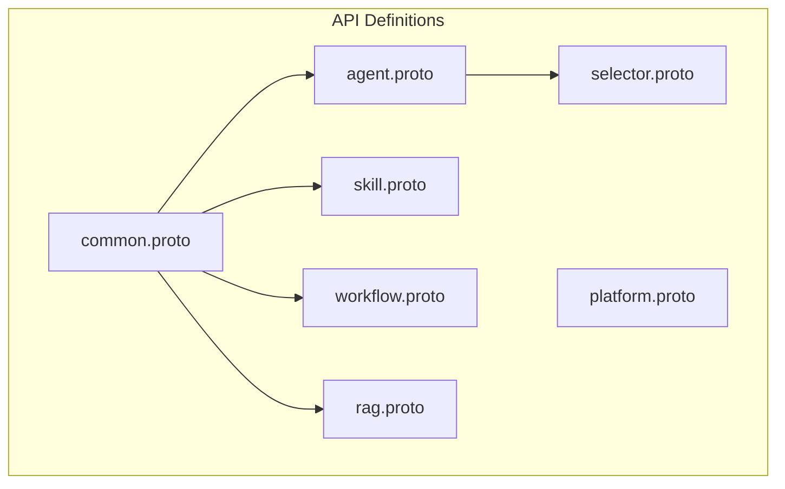
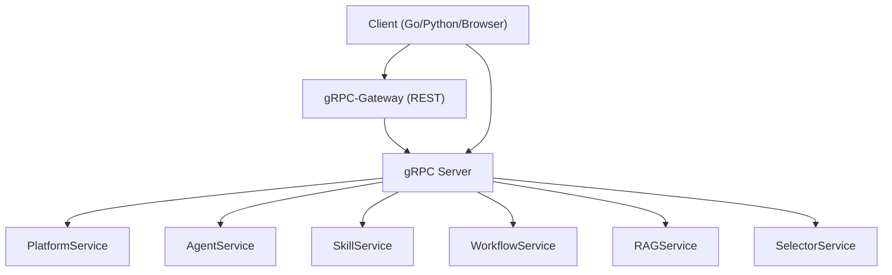
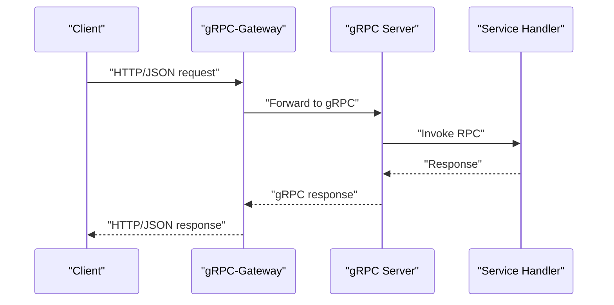
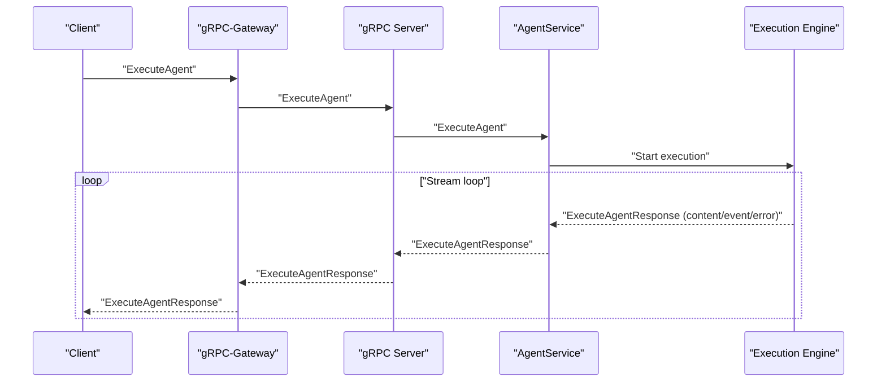
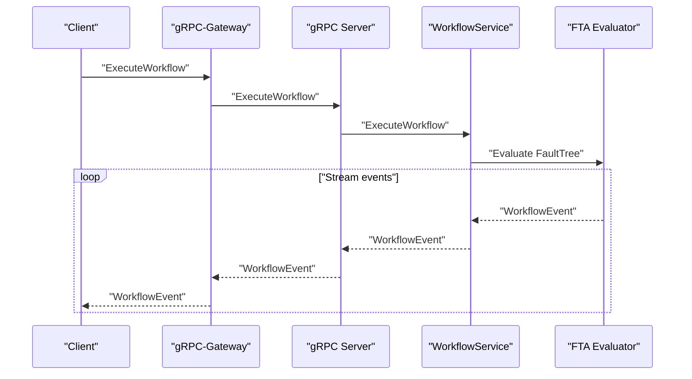
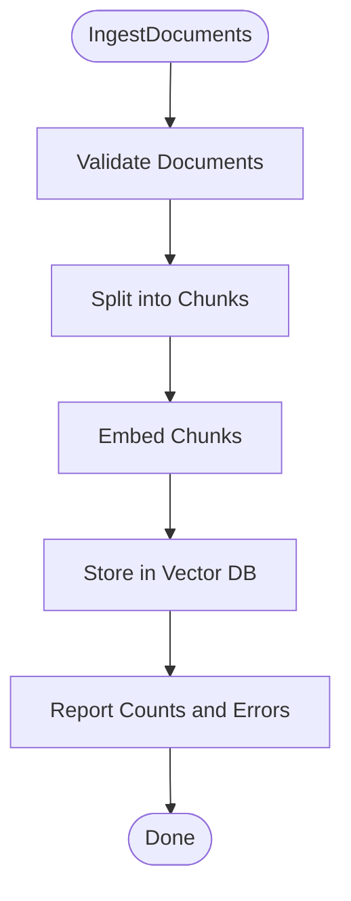
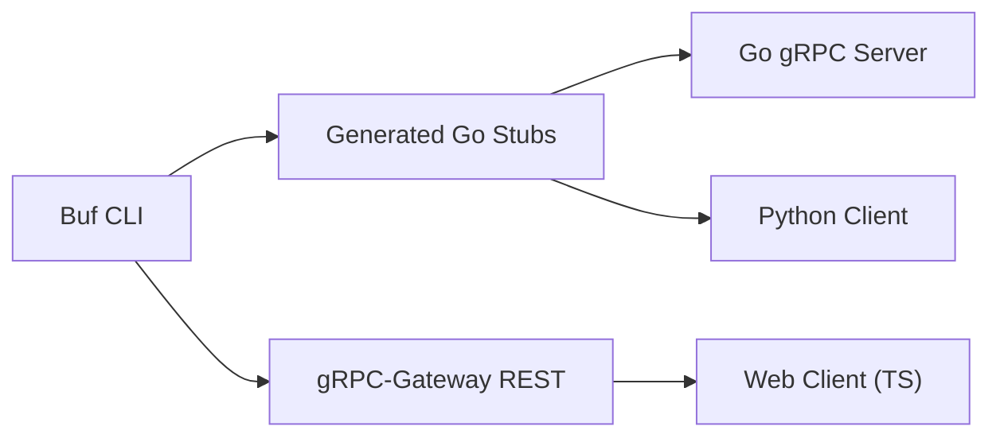

# Protocol Buffer APIs

<cite>
**Referenced Files in This Document**
- [platform.proto](file://api/proto/resolvenet/v1/platform.proto)
- [agent.proto](file://api/proto/resolvenet/v1/agent.proto)
- [skill.proto](file://api/proto/resolvenet/v1/skill.proto)
- [workflow.proto](file://api/proto/resolvenet/v1/workflow.proto)
- [rag.proto](file://api/proto/resolvenet/v1/rag.proto)
- [common.proto](file://api/proto/resolvenet/v1/common.proto)
- [selector.proto](file://api/proto/resolvenet/v1/selector.proto)
- [buf.yaml](file://tools/buf/buf.yaml)
- [buf.gen.yaml](file://tools/buf/buf.gen.yaml)
- [generate-proto.sh](file://hack/generate-proto.sh)
- [go.mod](file://go.mod)
- [server.go](file://pkg/server/server.go)
- [client.ts](file://web/src/api/client.ts)
- [server.py](file://python/src/resolvenet/runtime/server.py)
</cite>

## Table of Contents
1. [Introduction](#introduction)
2. [Project Structure](#project-structure)
3. [Core Components](#core-components)
4. [Architecture Overview](#architecture-overview)
5. [Detailed Component Analysis](#detailed-component-analysis)
6. [Dependency Analysis](#dependency-analysis)
7. [Performance Considerations](#performance-considerations)
8. [Troubleshooting Guide](#troubleshooting-guide)
9. [Conclusion](#conclusion)
10. [Appendices](#appendices)

## Introduction
This document describes the Protocol Buffer-based APIs that define ResolveNet’s platform services. It emphasizes strong typing, backward compatibility, and cross-language interoperability. The APIs cover agent management, skill operations, workflow execution (FTA), and Retrieval-Augmented Generation (RAG). It also documents service contracts, common message types, gRPC integration, streaming capabilities, versioning and migration strategies, code generation via Buf, and client implementation guidelines.

## Project Structure
The API definitions live under api/proto/resolvenet/v1 and are composed of:
- Platform service: health checks, configuration, and system info
- Agent service: lifecycle, execution, and execution records
- Skill service: registration, listing, testing, and permissions
- Workflow service: FTA definitions, validation, and streaming execution
- RAG service: collection management and retrieval
- Selector service: intent classification and routing
- Common types: pagination, resource metadata, and status enums

**Diagram sources**
- [common.proto](file://api/proto/resolvenet/v1/common.proto)
- [platform.proto](file://api/proto/resolvenet/v1/platform.proto)
- [agent.proto](file://api/proto/resolvenet/v1/agent.proto)
- [skill.proto](file://api/proto/resolvenet/v1/skill.proto)
- [workflow.proto](file://api/proto/resolvenet/v1/workflow.proto)
- [rag.proto](file://api/proto/resolvenet/v1/rag.proto)
- [selector.proto](file://api/proto/resolvenet/v1/selector.proto)

**Section sources**
- [platform.proto](file://api/proto/resolvenet/v1/platform.proto)
- [agent.proto](file://api/proto/resolvenet/v1/agent.proto)
- [skill.proto](file://api/proto/resolvenet/v1/skill.proto)
- [workflow.proto](file://api/proto/resolvenet/v1/workflow.proto)
- [rag.proto](file://api/proto/resolvenet/v1/rag.proto)
- [common.proto](file://api/proto/resolvenet/v1/common.proto)
- [selector.proto](file://api/proto/resolvenet/v1/selector.proto)

## Core Components
- Strong typing: All messages and enums are explicitly defined with field types and constraints.
- Backward compatibility: New fields are optional, enums include an unspecified sentinel, and breaking change detection is enforced by Buf.
- Cross-language interoperability: Generated stubs for Go and gRPC-Gateway enable gRPC and REST clients.

Key design principles:
- Optional additions: New fields are added with new tags to avoid breaking existing clients.
- Sentinel enums: UNSPECIFIED values allow graceful handling of unknown values.
- Struct-based extensibility: google.protobuf.Struct enables flexible configuration and context payloads.
- Streaming: ExecuteAgent and ExecuteWorkflow return streaming responses for real-time progress.

**Section sources**
- [common.proto](file://api/proto/resolvenet/v1/common.proto)
- [platform.proto](file://api/proto/resolvenet/v1/platform.proto)
- [agent.proto](file://api/proto/resolvenet/v1/agent.proto)
- [workflow.proto](file://api/proto/resolvenet/v1/workflow.proto)
- [rag.proto](file://api/proto/resolvenet/v1/rag.proto)
- [skill.proto](file://api/proto/resolvenet/v1/skill.proto)
- [selector.proto](file://api/proto/resolvenet/v1/selector.proto)

## Architecture Overview
ResolveNet exposes both gRPC and REST APIs. The gRPC server hosts the Protocol Buffer services, while gRPC-Gateway generates REST endpoints for browser and HTTP clients. The server integrates health checking and reflection for diagnostics.

**Diagram sources**
- [server.go](file://pkg/server/server.go)
- [buf.gen.yaml](file://tools/buf/buf.gen.yaml)
- [platform.proto](file://api/proto/resolvenet/v1/platform.proto)
- [agent.proto](file://api/proto/resolvenet/v1/agent.proto)
- [skill.proto](file://api/proto/resolvenet/v1/skill.proto)
- [workflow.proto](file://api/proto/resolvenet/v1/workflow.proto)
- [rag.proto](file://api/proto/resolvenet/v1/rag.proto)
- [selector.proto](file://api/proto/resolvenet/v1/selector.proto)

## Detailed Component Analysis

### Platform Service
Provides health checks, configuration retrieval and update, and system information.

- Methods
  - HealthCheck: Returns overall and per-component health status
  - GetConfig: Returns configuration by key or full configuration
  - UpdateConfig: Updates configuration and returns the new value
  - GetSystemInfo: Returns version, commit, build date, Go version, and platform

- Validation and responses
  - HealthCheckResponse includes an overall status and a component map
  - GetConfigResponse and UpdateConfigResponse wrap google.protobuf.Struct for dynamic config
  - GetSystemInfoResponse includes semantic versioning and build metadata

- Example usage patterns
  - Clients call HealthCheck to probe liveness
  - Clients call GetSystemInfo to display UI banners and telemetry
  - Clients call GetConfig/UpdateConfig to manage feature flags and runtime settings

**Section sources**
- [platform.proto](file://api/proto/resolvenet/v1/platform.proto)

### Agent Service
Manages agent lifecycle, execution, and execution history.

- Methods
  - CreateAgent, GetAgent, ListAgents, UpdateAgent, DeleteAgent
  - ExecuteAgent: Streams ExecuteAgentResponse with content, events, or errors
  - GetExecution, ListExecutions

- Message highlights
  - Agent: includes ResourceMeta, AgentType, AgentConfig, ResourceStatus
  - AgentConfig: model selection, system prompt, skill names, workflow and RAG collection IDs, parameters, and SelectorConfig
  - SelectorConfig: strategy, rules, and model ID
  - Execution: execution record with status, route decision, timestamps, and duration
  - RouteDecision: route type, target, confidence, parameters, and chain
  - ExecuteAgentResponse: oneof content/event/error for streaming

- Streaming behavior
  - ExecuteAgent returns a stream of ExecuteAgentResponse
  - Responses can be content fragments, structured ExecutionEvent, or ExecutionError

- Example usage patterns
  - Create an agent with a model and skills, then ExecuteAgent with input and optional conversation context
  - Poll GetExecution or subscribe to ExecuteAgent stream for progress

**Section sources**
- [agent.proto](file://api/proto/resolvenet/v1/agent.proto)
- [common.proto](file://api/proto/resolvenet/v1/common.proto)

### Skill Service
Registers, discovers, and tests skills with manifests and permissions.

- Methods
  - RegisterSkill, GetSkill, ListSkills, UnregisterSkill, TestSkill

- Message highlights
  - Skill: ResourceMeta, version, author, manifest, source type/URI, ResourceStatus
  - SkillManifest: entry point, inputs/outputs, dependencies, permissions
  - SkillPermissions: network access, FS permissions, allowed hosts, limits, and timeouts
  - TestSkillResponse: outputs, logs, duration, success flag, and error message

- Example usage patterns
  - Register a skill with a manifest and source URI
  - List skills to discover available capabilities
  - TestSkill to validate inputs and observe outputs and logs

**Section sources**
- [skill.proto](file://api/proto/resolvenet/v1/skill.proto)
- [common.proto](file://api/proto/resolvenet/v1/common.proto)

### Workflow Service (FTA)
Defines and executes Fault Tree Analysis workflows with streaming events.

- Methods
  - CreateWorkflow, GetWorkflow, ListWorkflows, UpdateWorkflow, DeleteWorkflow
  - ValidateWorkflow: validates FaultTree structure and returns errors/warnings
  - ExecuteWorkflow: streams WorkflowEvent messages

- Message highlights
  - Workflow: ResourceMeta, FaultTree, WorkflowStatus
  - FaultTree: top event ID, events, gates
  - FTAEvent: id, name, description, type, evaluator, parameters
  - FTAGate: id, name, type, input/output IDs, k-value for voting gates
  - WorkflowEvent: workflow and execution IDs, node/gate events, message, data, timestamp
  - ValidateWorkflowResponse: validity, errors, warnings

- Streaming behavior
  - ExecuteWorkflow returns a stream of WorkflowEvent covering lifecycle and evaluation steps

- Example usage patterns
  - Build a FaultTree with events and gates
  - ValidateWorkflow to catch structural issues
  - ExecuteWorkflow to observe evaluation progress and completion

**Section sources**
- [workflow.proto](file://api/proto/resolvenet/v1/workflow.proto)
- [common.proto](file://api/proto/resolvenet/v1/common.proto)

### RAG Service
Manages collections, document ingestion, and querying.

- Methods
  - CreateCollection, GetCollection, ListCollections, DeleteCollection
  - IngestDocuments: ingests documents and returns counts and errors
  - QueryCollection: retrieves top-k retrieved chunks with scores and metadata

- Message highlights
  - Collection: ResourceMeta, embedding model, chunk config, counts, ResourceStatus
  - ChunkConfig: strategy, size, overlap
  - Document: id, title, content, content type, metadata
  - RetrievedChunk: document ID/title, content, score, metadata
  - IngestDocumentsResponse: processed count, chunk count, and error list

- Example usage patterns
  - Create a collection with chunking strategy
  - IngestDocuments to populate the collection
  - QueryCollection to retrieve semantically similar chunks

**Section sources**
- [rag.proto](file://api/proto/resolvenet/v1/rag.proto)
- [common.proto](file://api/proto/resolvenet/v1/common.proto)

### Selector Service
Provides intent classification and routing decisions.

- Methods
  - ClassifyIntent: returns intent type, confidence, entities, and metadata
  - Route: returns a RouteDecision and reasoning

- Message highlights
  - ClassifyIntentResponse: intent, confidence, entities, metadata
  - RouteResponse: RouteDecision and reasoning

- Example usage patterns
  - ClassifyIntent to detect user intent and entities
  - Route to decide which agent or skill to invoke

**Section sources**
- [selector.proto](file://api/proto/resolvenet/v1/selector.proto)
- [agent.proto](file://api/proto/resolvenet/v1/agent.proto)

### Common Message Types
Reusable types across services:

- PaginationRequest/PaginationResponse: page_size and page_token for list operations
- ErrorDetail: standardized error code, message, and metadata
- ResourceMeta: identity, labels, annotations, timestamps, creator, and version
- ResourceStatus: ACTIVE, INACTIVE, ERROR, DELETING, plus UNSPECIFIED

These types ensure consistent list pagination, error reporting, and resource lifecycle metadata.

**Section sources**
- [common.proto](file://api/proto/resolvenet/v1/common.proto)

## Architecture Overview

**Diagram sources**
- [buf.gen.yaml](file://tools/buf/buf.gen.yaml)
- [server.go](file://pkg/server/server.go)

## Detailed Component Analysis

### Agent Execution Flow (Streaming)

**Diagram sources**
- [agent.proto](file://api/proto/resolvenet/v1/agent.proto)
- [buf.gen.yaml](file://tools/buf/buf.gen.yaml)
- [server.go](file://pkg/server/server.go)

### Workflow Execution Flow (Streaming)

**Diagram sources**
- [workflow.proto](file://api/proto/resolvenet/v1/workflow.proto)
- [buf.gen.yaml](file://tools/buf/buf.gen.yaml)
- [server.go](file://pkg/server/server.go)

### RAG Ingestion Flow

**Diagram sources**
- [rag.proto](file://api/proto/resolvenet/v1/rag.proto)

## Dependency Analysis
- Protocol Buffers: Defined in api/proto/resolvenet/v1/*.proto
- Code generation: Buf with plugins for Go, gRPC, and gRPC-Gateway
- Runtime dependencies: gRPC server and health reflection enabled in Go
- Client integrations: REST client in TypeScript and a Python runtime server placeholder

**Diagram sources**
- [buf.yaml](file://tools/buf/buf.yaml)
- [buf.gen.yaml](file://tools/buf/buf.gen.yaml)
- [generate-proto.sh](file://hack/generate-proto.sh)
- [server.go](file://pkg/server/server.go)
- [client.ts](file://web/src/api/client.ts)
- [server.py](file://python/src/resolvenet/runtime/server.py)

**Section sources**
- [buf.yaml](file://tools/buf/buf.yaml)
- [buf.gen.yaml](file://tools/buf/buf.gen.yaml)
- [generate-proto.sh](file://hack/generate-proto.sh)
- [go.mod](file://go.mod)
- [server.go](file://pkg/server/server.go)
- [client.ts](file://web/src/api/client.ts)
- [server.py](file://python/src/resolvenet/runtime/server.py)

## Performance Considerations
- Streaming responses reduce latency and memory footprint for long-running operations (ExecuteAgent, ExecuteWorkflow).
- Use pagination (PaginationRequest/PaginationResponse) for list-heavy operations to bound payload sizes.
- Prefer bulk ingestion for RAG (IngestDocuments) to minimize round-trips.
- Keep google.protobuf.Struct payloads minimal; avoid deep nesting for configuration and context.

## Troubleshooting Guide
Common integration issues and resolutions:
- gRPC-Gateway not generating REST routes
  - Ensure buf generate runs with the provided template and config
  - Verify plugin paths and module names match the Buf configuration
- Health checks failing
  - Confirm health service registration and reflection are enabled in the server
- Streaming not received
  - Validate client-side streaming support and that the service method returns stream
- Versioning and breaking changes
  - Add new fields with new tags; keep enums with UNSPECIFIED sentinel
  - Enforce breaking change detection via Buf

**Section sources**
- [buf.yaml](file://tools/buf/buf.yaml)
- [buf.gen.yaml](file://tools/buf/buf.gen.yaml)
- [server.go](file://pkg/server/server.go)

## Conclusion
ResolveNet’s Protocol Buffer APIs provide a strongly typed, backward-compatible, and cross-language interoperable foundation for platform services. The design leverages explicit enums, optional additions, and streaming to deliver robust client experiences. Buf-based code generation and gRPC-Gateway integration enable efficient server-client communication across languages and environments.

## Appendices

### API Design Principles
- Strong typing: Field types and enums defined explicitly
- Backward compatibility: New fields, UNSPECIFIED enums, and breaking-change detection
- Cross-language interoperability: Generated Go stubs and REST via gRPC-Gateway

**Section sources**
- [common.proto](file://api/proto/resolvenet/v1/common.proto)
- [buf.yaml](file://tools/buf/buf.yaml)

### Service Contracts Summary
- PlatformService: HealthCheck, GetConfig, UpdateConfig, GetSystemInfo
- AgentService: Lifecycle + ExecuteAgent (streaming)
- SkillService: Registration + Testing
- WorkflowService: FTA lifecycle + ExecuteWorkflow (streaming)
- RAGService: Collections + Ingestion + Query
- SelectorService: Intent classification + Routing

**Section sources**
- [platform.proto](file://api/proto/resolvenet/v1/platform.proto)
- [agent.proto](file://api/proto/resolvenet/v1/agent.proto)
- [skill.proto](file://api/proto/resolvenet/v1/skill.proto)
- [workflow.proto](file://api/proto/resolvenet/v1/workflow.proto)
- [rag.proto](file://api/proto/resolvenet/v1/rag.proto)
- [selector.proto](file://api/proto/resolvenet/v1/selector.proto)

### gRPC Integration and Streaming
- gRPC server with health and reflection
- Streaming methods: ExecuteAgent, ExecuteWorkflow
- REST via gRPC-Gateway for browser clients

**Section sources**
- [server.go](file://pkg/server/server.go)
- [buf.gen.yaml](file://tools/buf/buf.gen.yaml)
- [client.ts](file://web/src/api/client.ts)

### Versioning and Migration
- Add new fields with new tags
- Use UNSPECIFIED for enums
- Enforce breaking changes with Buf
- Maintain go_package option for Go modules

**Section sources**
- [platform.proto](file://api/proto/resolvenet/v1/platform.proto)
- [agent.proto](file://api/proto/resolvenet/v1/agent.proto)
- [skill.proto](file://api/proto/resolvenet/v1/skill.proto)
- [workflow.proto](file://api/proto/resolvenet/v1/workflow.proto)
- [rag.proto](file://api/proto/resolvenet/v1/rag.proto)
- [common.proto](file://api/proto/resolvenet/v1/common.proto)
- [buf.yaml](file://tools/buf/buf.yaml)

### Code Generation with Buf
- Run the provided script to generate Go and gRPC-Gateway stubs
- Plugins configured for Go, gRPC, and gRPC-Gateway
- Output placed under pkg/api with source_relative paths

**Section sources**
- [generate-proto.sh](file://hack/generate-proto.sh)
- [buf.gen.yaml](file://tools/buf/buf.gen.yaml)

### Client Implementation Guidelines
- Go clients: Use generated gRPC stubs and connect to the gRPC server address
- REST clients: Use gRPC-Gateway endpoints exposed by the server
- Browser clients: Use the REST client wrapper for convenience
- Python runtime: Implement the AgentExecutionServer to handle ExecuteAgent streaming

**Section sources**
- [server.go](file://pkg/server/server.go)
- [client.ts](file://web/src/api/client.ts)
- [server.py](file://python/src/resolvenet/runtime/server.py)