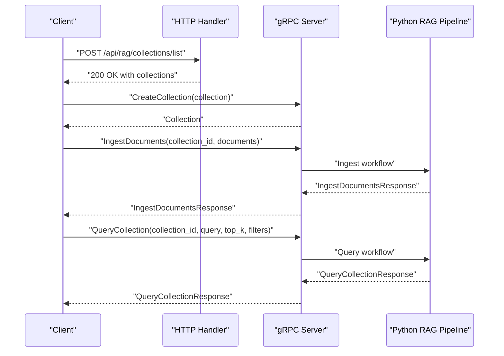
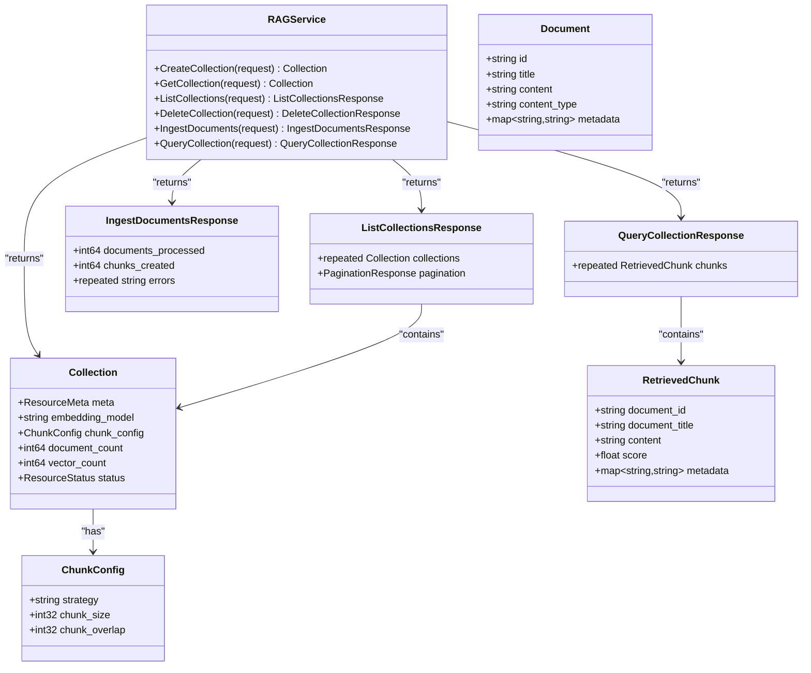
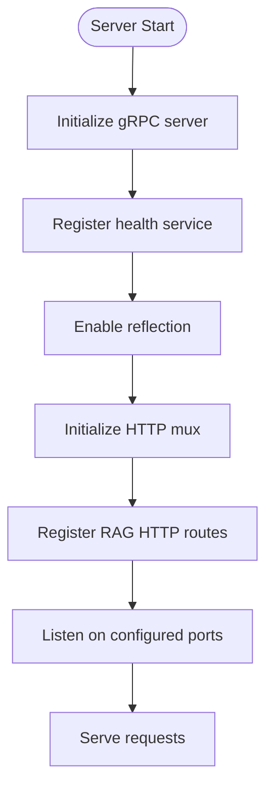
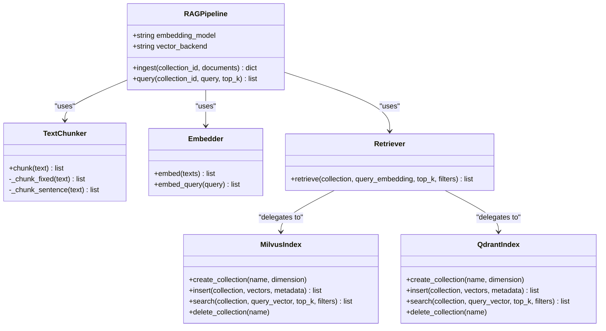
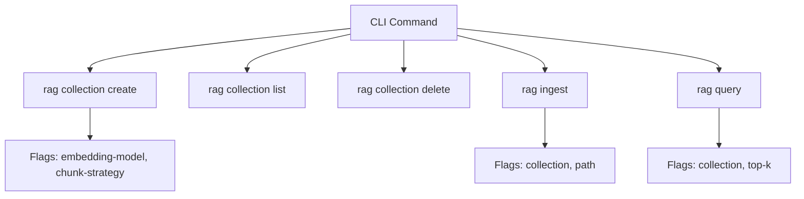
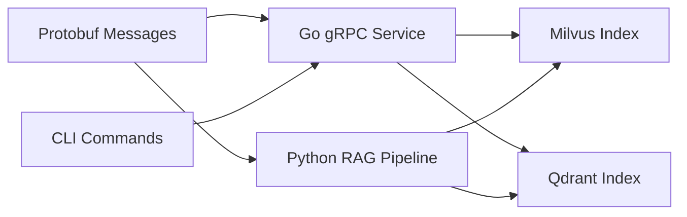

# RAG Pipeline API

<cite>
**Referenced Files in This Document**
- [rag.proto](file://api/proto/resolvenet/v1/rag.proto)
- [common.proto](file://api/proto/resolvenet/v1/common.proto)
- [collection.go](file://internal/cli/rag/collection.go)
- [ingest.go](file://internal/cli/rag/ingest.go)
- [query.go](file://internal/cli/rag/query.go)
- [pipeline.py](file://python/src/resolvenet/rag/pipeline.py)
- [milvus.py](file://python/src/resolvenet/rag/index/milvus.py)
- [qdrant.py](file://python/src/resolvenet/rag/index/qdrant.py)
- [chunker.py](file://python/src/resolvenet/rag/ingest/chunker.py)
- [embedder.py](file://python/src/resolvenet/rag/ingest/embedder.py)
- [retriever.py](file://python/src/resolvenet/rag/retrieve/retriever.py)
- [router.go](file://pkg/server/router.go)
- [server.go](file://pkg/server/server.go)
</cite>

## Table of Contents
1. [Introduction](#introduction)
2. [Project Structure](#project-structure)
3. [Core Components](#core-components)
4. [Architecture Overview](#architecture-overview)
5. [Detailed Component Analysis](#detailed-component-analysis)
6. [Dependency Analysis](#dependency-analysis)
7. [Performance Considerations](#performance-considerations)
8. [Troubleshooting Guide](#troubleshooting-guide)
9. [Conclusion](#conclusion)
10. [Appendices](#appendices)

## Introduction
This document describes the RAG Pipeline API that manages Retrieval-Augmented Generation (RAG) document collections, ingestion, and retrieval operations. It covers:
- Collection management RPCs: creation, retrieval, listing, and deletion
- Document ingestion workflows: parsing, chunking, embedding, and vector indexing
- Search functionality RPCs: semantic retrieval with optional filters
- Protobuf-defined messages for collections and documents
- Integration points with vector databases (Milvus and Qdrant)
- Client implementation guidance and performance optimization tips

## Project Structure
The RAG API is defined in Protocol Buffers and consumed by a Go server with HTTP/gRPC endpoints, and a Python RAG pipeline that orchestrates ingestion and retrieval. CLI commands provide operational controls for collections, ingestion, and queries.

```mermaid
graph TB
subgraph "Protocol Buffers"
RP["api/proto/resolvenet/v1/rag.proto"]
RC["api/proto/resolvenet/v1/common.proto"]
end
subgraph "Go Server"
SRV["pkg/server/server.go"]
RT["pkg/server/router.go"]
end
subgraph "Python RAG Pipeline"
PP["python/src/resolvenet/rag/pipeline.py"]
CH["python/src/resolvenet/rag/ingest/chunker.py"]
EB["python/src/resolvenet/rag/ingest/embedder.py"]
RV["python/src/resolvenet/rag/retrieve/retriever.py"]
MI["python/src/resolvenet/rag/index/milvus.py"]
QD["python/src/resolvenet/rag/index/qdrant.py"]
end
subgraph "CLI"
CLC["internal/cli/rag/collection.go"]
CLI["internal/cli/rag/ingest.go"]
CLQ["internal/cli/rag/query.go"]
end
RP --> SRV
RC --> SRV
SRV --> RT
CLC --> SRV
CLI --> SRV
CLQ --> SRV
PP --> CH
PP --> EB
PP --> RV
RV --> MI
RV --> QD
```

**Diagram sources**
- [rag.proto:1-99](file://api/proto/resolvenet/v1/rag.proto#L1-L99)
- [common.proto:1-49](file://api/proto/resolvenet/v1/common.proto#L1-L49)
- [server.go:1-104](file://pkg/server/server.go#L1-L104)
- [router.go:142-160](file://pkg/server/router.go#L142-L160)
- [pipeline.py:1-75](file://python/src/resolvenet/rag/pipeline.py#L1-L75)
- [chunker.py:1-73](file://python/src/resolvenet/rag/ingest/chunker.py#L1-L73)
- [embedder.py:1-49](file://python/src/resolvenet/rag/ingest/embedder.py#L1-L49)
- [retriever.py:1-42](file://python/src/resolvenet/rag/retrieve/retriever.py#L1-L42)
- [milvus.py:1-54](file://python/src/resolvenet/rag/index/milvus.py#L1-L54)
- [qdrant.py:1-52](file://python/src/resolvenet/rag/index/qdrant.py#L1-L52)
- [collection.go:1-80](file://internal/cli/rag/collection.go#L1-L80)
- [ingest.go:1-28](file://internal/cli/rag/ingest.go#L1-L28)
- [query.go:1-30](file://internal/cli/rag/query.go#L1-L30)

**Section sources**
- [rag.proto:1-99](file://api/proto/resolvenet/v1/rag.proto#L1-L99)
- [common.proto:1-49](file://api/proto/resolvenet/v1/common.proto#L1-L49)
- [server.go:1-104](file://pkg/server/server.go#L1-L104)
- [router.go:142-160](file://pkg/server/router.go#L142-L160)
- [pipeline.py:1-75](file://python/src/resolvenet/rag/pipeline.py#L1-L75)
- [collection.go:1-80](file://internal/cli/rag/collection.go#L1-L80)
- [ingest.go:1-28](file://internal/cli/rag/ingest.go#L1-L28)
- [query.go:1-30](file://internal/cli/rag/query.go#L1-L30)

## Core Components
- RAGService: gRPC service exposing collection and document operations
- Collection: RAG collection metadata, chunking configuration, and statistics
- Document: ingestion payload with content, type, and metadata
- RetrievedChunk: search result with document identity, content, score, and metadata
- Query filters: structured filters passed to vector search
- Pagination: standardized pagination for listing collections

Key RPCs:
- CreateCollection
- GetCollection
- ListCollections
- DeleteCollection
- IngestDocuments
- QueryCollection

**Section sources**
- [rag.proto:10-18](file://api/proto/resolvenet/v1/rag.proto#L10-L18)
- [rag.proto:20-28](file://api/proto/resolvenet/v1/rag.proto#L20-L28)
- [rag.proto:36-43](file://api/proto/resolvenet/v1/rag.proto#L36-L43)
- [rag.proto:45-52](file://api/proto/resolvenet/v1/rag.proto#L45-L52)
- [rag.proto:54-99](file://api/proto/resolvenet/v1/rag.proto#L54-L99)
- [common.proto:9-19](file://api/proto/resolvenet/v1/common.proto#L9-L19)

## Architecture Overview
The system exposes a gRPC service with HTTP handlers for RAG operations. The Python RAG pipeline encapsulates ingestion and retrieval logic and integrates with Milvus or Qdrant for vector storage and search.



**Diagram sources**
- [server.go:34-52](file://pkg/server/server.go#L34-L52)
- [router.go:142-160](file://pkg/server/router.go#L142-L160)
- [rag.proto:10-18](file://api/proto/resolvenet/v1/rag.proto#L10-L18)
- [pipeline.py:28-75](file://python/src/resolvenet/rag/pipeline.py#L28-L75)

## Detailed Component Analysis

### Protocol Buffer Messages and RPCs
- RAGService: collection lifecycle and document operations
- Collection: includes resource metadata, embedding model, chunking config, counts, and status
- ChunkConfig: chunking strategy and parameters
- Document: id, title, content, content type, and metadata
- RetrievedChunk: document identity, content, score, and metadata
- Query filters: Struct for flexible filter expressions
- Pagination: page size and token for listing



**Diagram sources**
- [rag.proto:10-18](file://api/proto/resolvenet/v1/rag.proto#L10-L18)
- [rag.proto:20-28](file://api/proto/resolvenet/v1/rag.proto#L20-L28)
- [rag.proto:30-34](file://api/proto/resolvenet/v1/rag.proto#L30-L34)
- [rag.proto:36-43](file://api/proto/resolvenet/v1/rag.proto#L36-L43)
- [rag.proto:45-52](file://api/proto/resolvenet/v1/rag.proto#L45-L52)
- [rag.proto:67-70](file://api/proto/resolvenet/v1/rag.proto#L67-L70)
- [rag.proto:83-87](file://api/proto/resolvenet/v1/rag.proto#L83-L87)
- [rag.proto:96-98](file://api/proto/resolvenet/v1/rag.proto#L96-L98)

**Section sources**
- [rag.proto:10-18](file://api/proto/resolvenet/v1/rag.proto#L10-L18)
- [rag.proto:20-28](file://api/proto/resolvenet/v1/rag.proto#L20-L28)
- [rag.proto:30-34](file://api/proto/resolvenet/v1/rag.proto#L30-L34)
- [rag.proto:36-43](file://api/proto/resolvenet/v1/rag.proto#L36-L43)
- [rag.proto:45-52](file://api/proto/resolvenet/v1/rag.proto#L45-L52)
- [rag.proto:54-99](file://api/proto/resolvenet/v1/rag.proto#L54-L99)
- [common.proto:9-19](file://api/proto/resolvenet/v1/common.proto#L9-L19)

### Go Server and HTTP Handlers
- gRPC server initialization and health reflection
- HTTP routes for RAG operations currently return placeholders
- Future implementation will wire HTTP handlers to gRPC service



**Diagram sources**
- [server.go:34-52](file://pkg/server/server.go#L34-L52)
- [server.go:54-103](file://pkg/server/server.go#L54-L103)
- [router.go:142-160](file://pkg/server/router.go#L142-L160)

**Section sources**
- [server.go:1-104](file://pkg/server/server.go#L1-L104)
- [router.go:142-160](file://pkg/server/router.go#L142-L160)

### Python RAG Pipeline Orchestration
- RAGPipeline orchestrates ingestion and retrieval
- Supports configurable embedding model and vector backend
- Placeholder implementations indicate future integration points



**Diagram sources**
- [pipeline.py:11-75](file://python/src/resolvenet/rag/pipeline.py#L11-L75)
- [milvus.py:11-54](file://python/src/resolvenet/rag/index/milvus.py#L11-L54)
- [qdrant.py:11-52](file://python/src/resolvenet/rag/index/qdrant.py#L11-L52)
- [chunker.py:6-73](file://python/src/resolvenet/rag/ingest/chunker.py#L6-L73)
- [embedder.py:11-49](file://python/src/resolvenet/rag/ingest/embedder.py#L11-L49)
- [retriever.py:11-42](file://python/src/resolvenet/rag/retrieve/retriever.py#L11-L42)

**Section sources**
- [pipeline.py:11-75](file://python/src/resolvenet/rag/pipeline.py#L11-L75)
- [milvus.py:11-54](file://python/src/resolvenet/rag/index/milvus.py#L11-L54)
- [qdrant.py:11-52](file://python/src/resolvenet/rag/index/qdrant.py#L11-L52)
- [chunker.py:6-73](file://python/src/resolvenet/rag/ingest/chunker.py#L6-L73)
- [embedder.py:11-49](file://python/src/resolvenet/rag/ingest/embedder.py#L11-L49)
- [retriever.py:11-42](file://python/src/resolvenet/rag/retrieve/retriever.py#L11-L42)

### CLI Commands for RAG Operations
- rag collection: create, list, delete
- rag ingest: upload and ingest documents into a collection
- rag query: search a collection with top-k results and filters



**Diagram sources**
- [collection.go:33-49](file://internal/cli/rag/collection.go#L33-L49)
- [collection.go:52-64](file://internal/cli/rag/collection.go#L52-L64)
- [collection.go:67-79](file://internal/cli/rag/collection.go#L67-L79)
- [ingest.go:9-27](file://internal/cli/rag/ingest.go#L9-L27)
- [query.go:9-29](file://internal/cli/rag/query.go#L9-L29)

**Section sources**
- [collection.go:1-80](file://internal/cli/rag/collection.go#L1-L80)
- [ingest.go:1-28](file://internal/cli/rag/ingest.go#L1-L28)
- [query.go:1-30](file://internal/cli/rag/query.go#L1-L30)

## Dependency Analysis
- Protobuf messages define the API contract and are consumed by both Go server and Python pipeline
- Go server registers gRPC service and HTTP handlers; HTTP handlers currently return placeholders
- Python pipeline depends on Milvus or Qdrant for vector operations
- CLI commands are placeholders and intended to call the API



**Diagram sources**
- [rag.proto:10-18](file://api/proto/resolvenet/v1/rag.proto#L10-L18)
- [milvus.py:11-54](file://python/src/resolvenet/rag/index/milvus.py#L11-L54)
- [qdrant.py:11-52](file://python/src/resolvenet/rag/index/qdrant.py#L11-L52)
- [collection.go:1-80](file://internal/cli/rag/collection.go#L1-L80)

**Section sources**
- [rag.proto:10-18](file://api/proto/resolvenet/v1/rag.proto#L10-L18)
- [milvus.py:11-54](file://python/src/resolvenet/rag/index/milvus.py#L11-L54)
- [qdrant.py:11-52](file://python/src/resolvenet/rag/index/qdrant.py#L11-L52)
- [collection.go:1-80](file://internal/cli/rag/collection.go#L1-L80)

## Performance Considerations
- Chunking strategy: choose sentence-based chunking for natural boundaries; adjust chunk size and overlap to balance recall and latency
- Embedding model: larger models produce higher-quality embeddings but increase compute cost; select based on workload
- Vector backend selection: Milvus excels in dense vector similarity search; Qdrant offers rich filtering and payload management
- Batch operations: process documents in batches during ingestion to improve throughput
- Top-k tuning: start with small top-k and increase gradually to balance relevance and latency
- Filters: apply metadata filters judiciously to reduce search space
- Caching: cache frequent queries and embeddings where applicable

## Troubleshooting Guide
Common issues and resolutions:
- HTTP handlers return placeholders: implement HTTP handlers to delegate to gRPC service
- Vector backend connectivity: verify host and port configuration for Milvus/Qdrant
- Embedding model availability: ensure the selected model is supported and reachable
- Chunking failures: validate text preprocessing and chunk sizes
- Query accuracy: adjust chunking strategy and top-k; refine filters

**Section sources**
- [router.go:142-160](file://pkg/server/router.go#L142-L160)
- [milvus.py:18-21](file://python/src/resolvenet/rag/index/milvus.py#L18-L21)
- [qdrant.py:18-21](file://python/src/resolvenet/rag/index/qdrant.py#L18-L21)
- [embedder.py:20-22](file://python/src/resolvenet/rag/ingest/embedder.py#L20-L22)
- [chunker.py:15-24](file://python/src/resolvenet/rag/ingest/chunker.py#L15-L24)

## Conclusion
The RAG Pipeline API provides a clear contract for managing collections, ingesting documents, and performing semantic retrieval. The Go server exposes gRPC endpoints with HTTP handlers, while the Python RAG pipeline orchestrates ingestion and retrieval with pluggable vector backends. CLI commands offer operational controls, and the protobuf definitions ensure consistent data structures across the stack.

## Appendices

### API Reference

- RAGService RPCs
  - CreateCollection: Creates a collection with specified embedding model and chunking configuration
  - GetCollection: Retrieves a collection by ID
  - ListCollections: Lists collections with pagination
  - DeleteCollection: Deletes a collection by ID
  - IngestDocuments: Ingests documents into a collection; returns processed count, created chunks, and errors
  - QueryCollection: Searches a collection with filters and returns top-k retrieved chunks

- Messages
  - Collection: Includes metadata, embedding model, chunk config, counts, and status
  - ChunkConfig: Strategy and parameters for chunking
  - Document: Content, type, and metadata
  - RetrievedChunk: Content, score, and metadata
  - Query filters: Struct-based filters for retrieval

- Pagination
  - PaginationRequest: page_size and page_token
  - PaginationResponse: next_page_token and total_count

**Section sources**
- [rag.proto:10-18](file://api/proto/resolvenet/v1/rag.proto#L10-L18)
- [rag.proto:20-28](file://api/proto/resolvenet/v1/rag.proto#L20-L28)
- [rag.proto:30-34](file://api/proto/resolvenet/v1/rag.proto#L30-L34)
- [rag.proto:36-43](file://api/proto/resolvenet/v1/rag.proto#L36-L43)
- [rag.proto:45-52](file://api/proto/resolvenet/v1/rag.proto#L45-L52)
- [rag.proto:54-99](file://api/proto/resolvenet/v1/rag.proto#L54-L99)
- [common.proto:9-19](file://api/proto/resolvenet/v1/common.proto#L9-L19)

### Client Implementation Examples

- Collection Management
  - Create a collection with an embedding model and chunking strategy
  - List collections with pagination
  - Delete a collection by ID

- Document Ingestion
  - Prepare documents with content and metadata
  - Ingest into a target collection
  - Monitor processed count and errors

- Retrieval Queries
  - Query with a text and top-k limit
  - Apply filters via Struct
  - Iterate over retrieved chunks

- Performance Optimization
  - Tune chunk size and overlap
  - Adjust top-k and filters
  - Select appropriate vector backend

**Section sources**
- [collection.go:33-49](file://internal/cli/rag/collection.go#L33-L49)
- [collection.go:52-64](file://internal/cli/rag/collection.go#L52-L64)
- [collection.go:67-79](file://internal/cli/rag/collection.go#L67-L79)
- [ingest.go:9-27](file://internal/cli/rag/ingest.go#L9-L27)
- [query.go:9-29](file://internal/cli/rag/query.go#L9-L29)
- [pipeline.py:28-75](file://python/src/resolvenet/rag/pipeline.py#L28-L75)