# Selector Routing API

<cite>
**Referenced Files in This Document**
- [selector.proto](file://api/proto/resolvenet/v1/selector.proto)
- [selector.py](file://python/src/resolvenet/selector/selector.py)
- [router.py](file://python/src/resolvenet/selector/router.py)
- [intent.py](file://python/src/resolvenet/selector/intent.py)
- [llm_strategy.py](file://python/src/resolvenet/selector/strategies/llm_strategy.py)
- [rule_strategy.py](file://python/src/resolvenet/selector/strategies/rule_strategy.py)
- [hybrid_strategy.py](file://python/src/resolvenet/selector/strategies/hybrid_strategy.py)
- [server.go](file://pkg/server/server.go)
- [router.go](file://pkg/server/router.go)
- [main.go](file://cmd/resolvenet-server/main.go)
- [mega.py](file://python/src/resolvenet/agent/mega.py)
</cite>

## Table of Contents
1. [Introduction](#introduction)
2. [Project Structure](#project-structure)
3. [Core Components](#core-components)
4. [Architecture Overview](#architecture-overview)
5. [Detailed Component Analysis](#detailed-component-analysis)
6. [Dependency Analysis](#dependency-analysis)
7. [Performance Considerations](#performance-considerations)
8. [Troubleshooting Guide](#troubleshooting-guide)
9. [Conclusion](#conclusion)
10. [Appendices](#appendices)

## Introduction
This document describes the Selector Routing API responsible for intelligent routing decisions and strategy selection. It covers:
- Routing decision RPCs and messages
- Strategy configuration and execution context
- RouteDecision structure including confidence scores and reasoning traces
- Integration with LLM, Rule, and Hybrid strategies
- Examples of routing decision schemas and multi-route execution patterns
- Relationship with the intelligent selector engine and performance optimization techniques
- Client implementation guidance for custom routing strategies and decision analysis

## Project Structure
The Selector Routing API spans protocol definitions and Python-based routing logic:
- Protocol buffer service and messages define the RPC contract
- Python selector orchestrates strategies and produces RouteDecision
- Strategies implement LLM, Rule, and Hybrid routing approaches
- Server hosts the platform services and exposes gRPC/HTTP endpoints

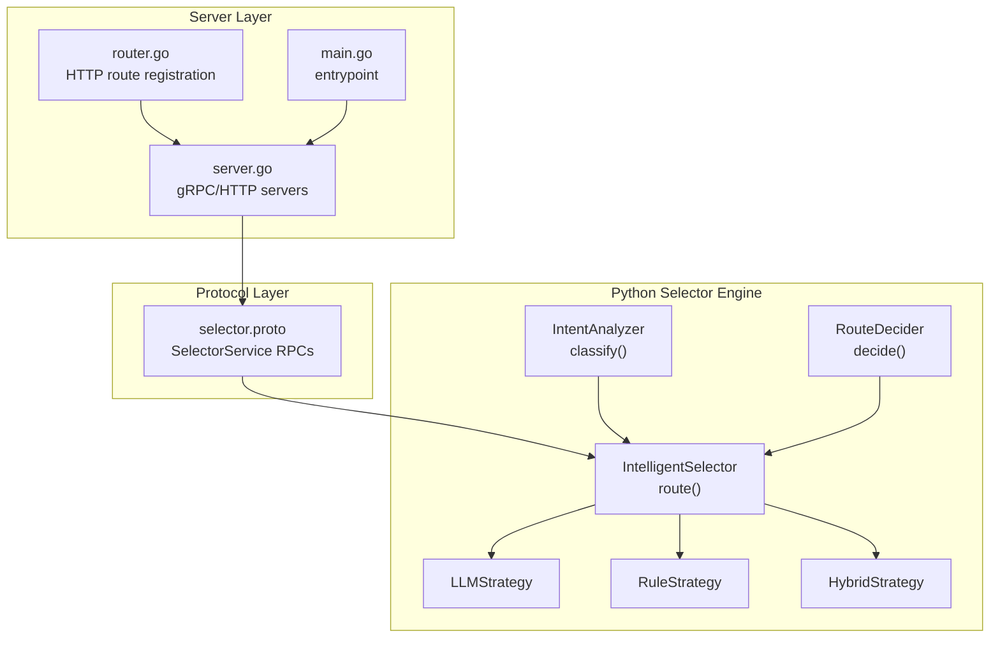

**Diagram sources**
- [selector.proto:10-39](file://api/proto/resolvenet/v1/selector.proto#L10-L39)
- [selector.py:24-100](file://python/src/resolvenet/selector/selector.py#L24-L100)
- [router.py:10-40](file://python/src/resolvenet/selector/router.py#L10-L40)
- [intent.py:17-39](file://python/src/resolvenet/selector/intent.py#L17-L39)
- [llm_strategy.py:10-44](file://python/src/resolvenet/selector/strategies/llm_strategy.py#L10-L44)
- [rule_strategy.py:11-77](file://python/src/resolvenet/selector/strategies/rule_strategy.py#L11-L77)
- [hybrid_strategy.py:12-42](file://python/src/resolvenet/selector/strategies/hybrid_strategy.py#L12-L42)
- [server.go:19-103](file://pkg/server/server.go#L19-L103)
- [router.go:10-55](file://pkg/server/router.go#L10-L55)
- [main.go:16-56](file://cmd/resolvenet-server/main.go#L16-L56)

**Section sources**
- [selector.proto:10-39](file://api/proto/resolvenet/v1/selector.proto#L10-L39)
- [selector.py:24-100](file://python/src/resolvenet/selector/selector.py#L24-L100)
- [server.go:19-103](file://pkg/server/server.go#L19-L103)
- [router.go:10-55](file://pkg/server/router.go#L10-L55)
- [main.go:16-56](file://cmd/resolvenet-server/main.go#L16-L56)

## Core Components
- SelectorService RPCs:
  - ClassifyIntent(ClassifyIntentRequest) returns ClassifyIntentResponse
  - Route(RouteRequest) returns RouteResponse
- RouteDecision model:
  - route_type: destination category ("fta", "skill", "rag", "direct", "multi")
  - route_target: optional identifier for the target resource
  - confidence: numeric score representing decision certainty
  - parameters: strategy-specific configuration and runtime parameters
  - reasoning: textual explanation of the decision
  - chain: ordered list of RouteDecision for multi-route execution
- Strategy configuration:
  - Strategy selection via IntelligentSelector(strategy="llm"|"rule"|"hybrid")
  - HybridStrategy uses RuleStrategy first; falls back to LLMStrategy when confidence threshold is not met
- Execution context:
  - Context enrichment occurs prior to routing decisions
  - RouteDecider consumes intent_type, confidence, and context to produce final routing

**Section sources**
- [selector.proto:16-39](file://api/proto/resolvenet/v1/selector.proto#L16-L39)
- [selector.py:13-72](file://python/src/resolvenet/selector/selector.py#L13-L72)
- [router.py:10-39](file://python/src/resolvenet/selector/router.py#L10-L39)
- [hybrid_strategy.py:21-41](file://python/src/resolvenet/selector/strategies/hybrid_strategy.py#L21-L41)

## Architecture Overview
The Selector Routing API integrates intent classification, context enrichment, and strategy-driven routing into a cohesive engine. The server exposes gRPC/HTTP endpoints, while the selector orchestrates strategy execution and returns a structured RouteDecision.

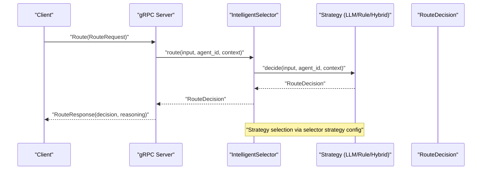

**Diagram sources**
- [selector.proto:11-14](file://api/proto/resolvenet/v1/selector.proto#L11-L14)
- [selector.py:43-72](file://python/src/resolvenet/selector/selector.py#L43-L72)
- [llm_strategy.py:33-43](file://python/src/resolvenet/selector/strategies/llm_strategy.py#L33-L43)
- [rule_strategy.py:35-76](file://python/src/resolvenet/selector/strategies/rule_strategy.py#L35-L76)
- [hybrid_strategy.py:27-41](file://python/src/resolvenet/selector/strategies/hybrid_strategy.py#L27-L41)

## Detailed Component Analysis

### SelectorService RPC Contract
- ClassifyIntentRequest
  - Fields: input, conversation_id, context
- ClassifyIntentResponse
  - Fields: intent_type, confidence, entities, metadata
- RouteRequest
  - Fields: input, intent_type, agent_id, context
- RouteResponse
  - Fields: decision (RouteDecision), reasoning

These messages define the canonical schema for routing decisions and intent classification.

**Section sources**
- [selector.proto:16-39](file://api/proto/resolvenet/v1/selector.proto#L16-L39)

### RouteDecision Model
RouteDecision encapsulates the outcome of routing decisions:
- route_type: "fta" | "skill" | "rag" | "direct" | "multi"
- route_target: optional string identifier
- confidence: float score
- parameters: dict for strategy-specific configuration
- reasoning: human-readable explanation
- chain: list of RouteDecision for multi-route execution

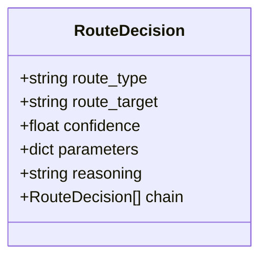

**Diagram sources**
- [selector.py:13-22](file://python/src/resolvenet/selector/selector.py#L13-L22)

**Section sources**
- [selector.py:13-22](file://python/src/resolvenet/selector/selector.py#L13-L22)

### IntelligentSelector Orchestration
- Strategy selection:
  - strategy="llm"|"rule"|"hybrid"
  - Defaults to hybrid if unknown strategy is provided
- route() method:
  - Accepts input_text, agent_id, context
  - Invokes selected strategy and logs decision metadata

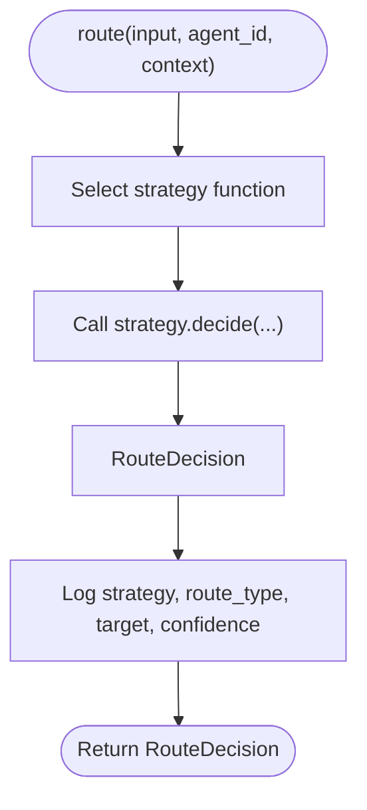

**Diagram sources**
- [selector.py:43-72](file://python/src/resolvenet/selector/selector.py#L43-L72)

**Section sources**
- [selector.py:24-100](file://python/src/resolvenet/selector/selector.py#L24-L100)

### Strategy Implementations

#### LLMStrategy
- Purpose: Use an LLM to classify and route requests
- Behavior: Generates a structured decision with route_type, route_target, confidence, reasoning
- Current state: Placeholder returning a default decision; intended to call an LLM with a routing prompt

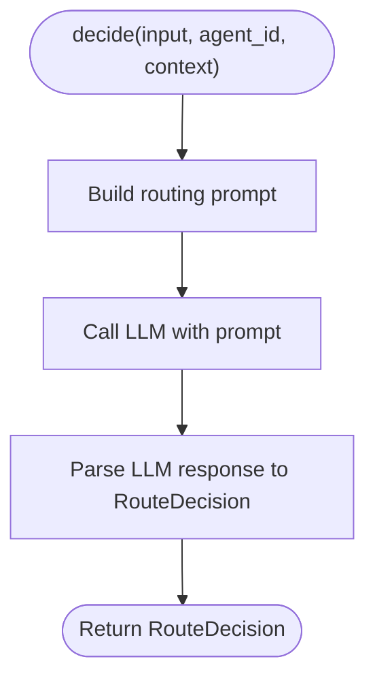

**Diagram sources**
- [llm_strategy.py:17-31](file://python/src/resolvenet/selector/strategies/llm_strategy.py#L17-L31)
- [llm_strategy.py:33-43](file://python/src/resolvenet/selector/strategies/llm_strategy.py#L33-L43)

**Section sources**
- [llm_strategy.py:10-44](file://python/src/resolvenet/selector/strategies/llm_strategy.py#L10-L44)

#### RuleStrategy
- Purpose: Pattern-matching rules for fast, deterministic routing
- Patterns:
  - Skill patterns for tool execution (e.g., web search, code execution, file operations)
  - RAG patterns for knowledge retrieval
  - FTA patterns for structured diagnostics
- Behavior: Returns RouteDecision with high/medium confidence depending on match; otherwise defaults to direct

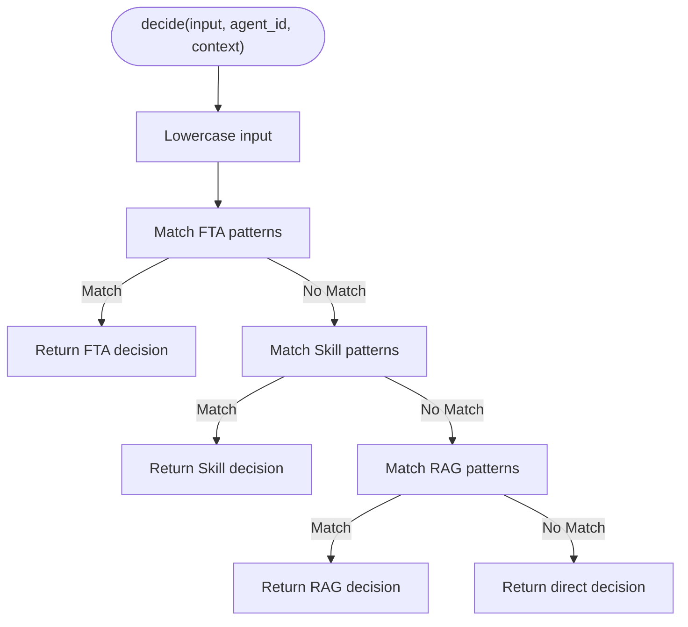

**Diagram sources**
- [rule_strategy.py:35-76](file://python/src/resolvenet/selector/strategies/rule_strategy.py#L35-L76)

**Section sources**
- [rule_strategy.py:11-77](file://python/src/resolvenet/selector/strategies/rule_strategy.py#L11-L77)

#### HybridStrategy
- Purpose: Combine rule-based fast-path with LLM fallback
- Logic:
  - Invoke RuleStrategy.decide
  - If confidence >= threshold, return rule decision
  - Else invoke LLMStrategy.decide and return LLM decision
- Threshold: 0.7

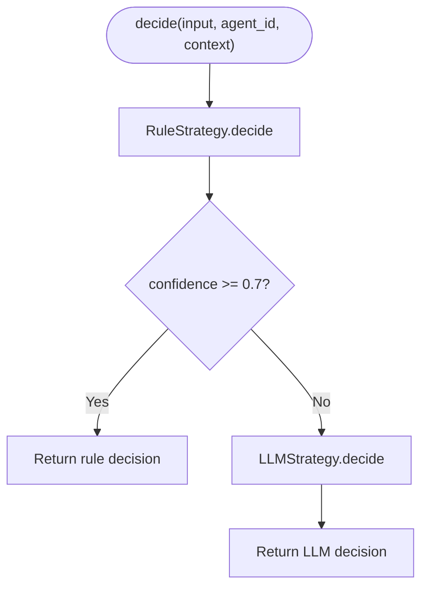

**Diagram sources**
- [hybrid_strategy.py:27-41](file://python/src/resolvenet/selector/strategies/hybrid_strategy.py#L27-L41)

**Section sources**
- [hybrid_strategy.py:12-42](file://python/src/resolvenet/selector/strategies/hybrid_strategy.py#L12-L42)

### Intent Classification
- IntentAnalyzer.classify(input_text) returns IntentClassification with intent_type and confidence
- Current state: Placeholder returning a default classification; intended to use LLM or rule-based classification

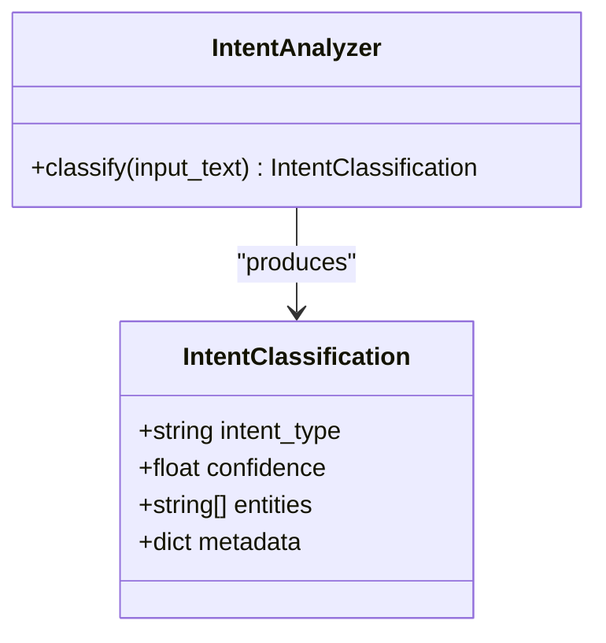

**Diagram sources**
- [intent.py:8-38](file://python/src/resolvenet/selector/intent.py#L8-L38)

**Section sources**
- [intent.py:17-39](file://python/src/resolvenet/selector/intent.py#L17-L39)

### RouteDecider
- RouteDecider.decide(intent_type, confidence, context) produces a RouteDecision
- Current state: Placeholder returning a default "direct" decision; intended to integrate intent and context for routing

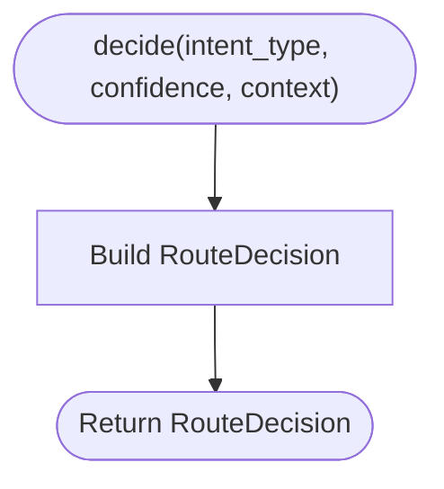

**Diagram sources**
- [router.py:17-39](file://python/src/resolvenet/selector/router.py#L17-L39)

**Section sources**
- [router.py:10-39](file://python/src/resolvenet/selector/router.py#L10-L39)

### Server Integration
- gRPC server initialization and health service registration
- HTTP server with REST route stubs
- Combined startup and graceful shutdown

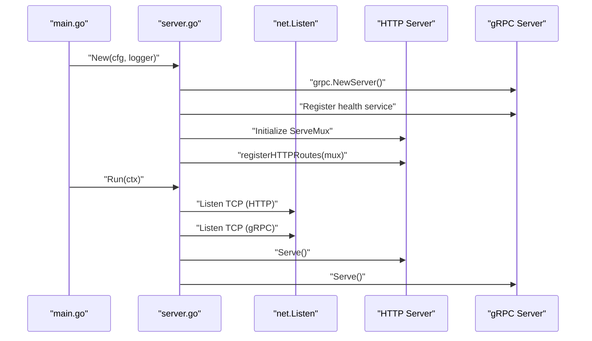

**Diagram sources**
- [main.go:16-56](file://cmd/resolvenet-server/main.go#L16-L56)
- [server.go:28-103](file://pkg/server/server.go#L28-L103)
- [router.go:11-55](file://pkg/server/router.go#L11-L55)

**Section sources**
- [main.go:16-56](file://cmd/resolvenet-server/main.go#L16-L56)
- [server.go:19-103](file://pkg/server/server.go#L19-L103)
- [router.go:10-55](file://pkg/server/router.go#L10-L55)

### Multi-Route Execution Pattern
- RouteDecision.chain enables chaining multiple decisions for complex workflows
- Example pattern:
  - First decision routes to a skill executor
  - Second decision routes to a RAG pipeline
  - Final decision returns to direct LLM for synthesis

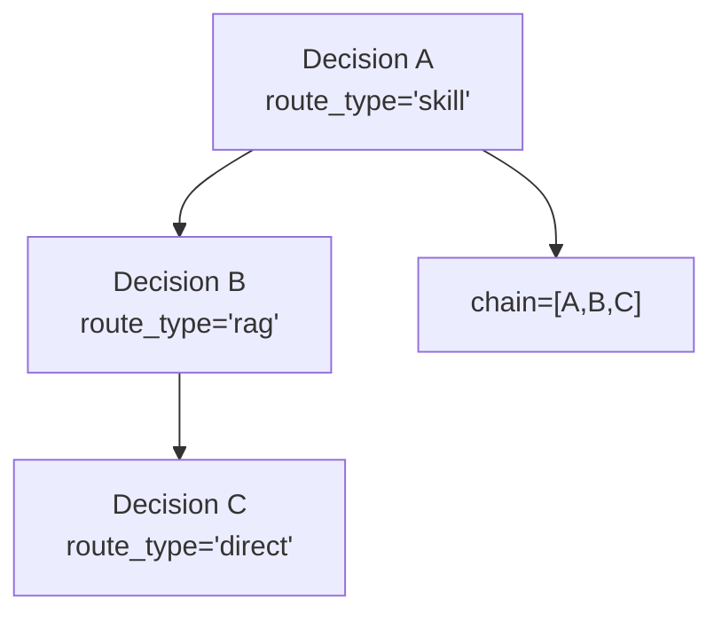

**Diagram sources**
- [selector.py](file://python/src/resolvenet/selector/selector.py#L21)

**Section sources**
- [selector.py:13-22](file://python/src/resolvenet/selector/selector.py#L13-L22)

### Client Implementation Examples
- Basic selector usage:
  - Instantiate IntelligentSelector with desired strategy
  - Call route(input_text, agent_id, context)
  - Inspect decision.route_type, decision.confidence, decision.reasoning
- Custom strategy:
  - Implement a new strategy class with a decide method returning RouteDecision
  - Register strategy in IntelligentSelector._strategies
- Decision analysis:
  - Use decision.parameters to pass strategy-specific configuration
  - Use decision.chain for multi-step routing workflows

**Section sources**
- [selector.py:35-41](file://python/src/resolvenet/selector/selector.py#L35-L41)
- [llm_strategy.py:33-43](file://python/src/resolvenet/selector/strategies/llm_strategy.py#L33-L43)
- [rule_strategy.py:35-76](file://python/src/resolvenet/selector/strategies/rule_strategy.py#L35-L76)
- [hybrid_strategy.py:27-41](file://python/src/resolvenet/selector/strategies/hybrid_strategy.py#L27-L41)

## Dependency Analysis
- SelectorService depends on protobuf-defined messages for RPC contracts
- IntelligentSelector depends on strategy implementations
- Strategies depend on RouteDecision for outputs
- Server depends on SelectorService for routing decisions
- Agent integration logs selector decisions and metadata

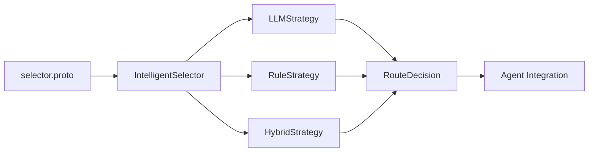

**Diagram sources**
- [selector.proto:10-39](file://api/proto/resolvenet/v1/selector.proto#L10-L39)
- [selector.py:35-100](file://python/src/resolvenet/selector/selector.py#L35-L100)
- [llm_strategy.py:10-44](file://python/src/resolvenet/selector/strategies/llm_strategy.py#L10-L44)
- [rule_strategy.py:11-77](file://python/src/resolvenet/selector/strategies/rule_strategy.py#L11-L77)
- [hybrid_strategy.py:12-42](file://python/src/resolvenet/selector/strategies/hybrid_strategy.py#L12-L42)
- [mega.py:49-73](file://python/src/resolvenet/agent/mega.py#L49-L73)

**Section sources**
- [selector.py:35-100](file://python/src/resolvenet/selector/selector.py#L35-L100)
- [mega.py:49-73](file://python/src/resolvenet/agent/mega.py#L49-L73)

## Performance Considerations
- Prefer RuleStrategy for high-confidence, deterministic patterns to minimize latency
- Use HybridStrategy to balance speed and accuracy; tune confidence threshold to reduce LLM calls
- Cache and reuse context to avoid repeated enrichment overhead
- Limit RouteDecision.chain length for multi-route execution to prevent deep nesting
- Monitor selector logs for strategy performance and adjust configurations accordingly

## Troubleshooting Guide
- Strategy not found:
  - Ensure strategy name is one of "llm", "rule", or "hybrid"
  - IntelligentSelector defaults to hybrid if an invalid strategy is provided
- Low confidence decisions:
  - Verify RuleStrategy patterns and confidence thresholds
  - Consider enabling LLM fallback in HybridStrategy
- Missing context:
  - Confirm context enrichment occurs before routing
  - Validate that context is passed to route() and strategy.decide()
- Decision analysis:
  - Inspect decision.reasoning for explanations
  - Use decision.parameters for strategy-specific tuning

**Section sources**
- [selector.py:59-70](file://python/src/resolvenet/selector/selector.py#L59-L70)
- [hybrid_strategy.py:34-41](file://python/src/resolvenet/selector/strategies/hybrid_strategy.py#L34-L41)

## Conclusion
The Selector Routing API provides a flexible, extensible framework for intelligent routing decisions. By combining intent classification, context enrichment, and pluggable strategies, it supports diverse execution patterns from direct LLM responses to complex multi-route workflows. The hybrid approach optimizes performance while maintaining accuracy, and the structured RouteDecision model enables transparent decision analysis and future enhancements.

## Appendices

### API Definitions Summary
- SelectorService
  - ClassifyIntent: input, conversation_id, context → intent_type, confidence, entities, metadata
  - Route: input, intent_type, agent_id, context → decision (RouteDecision), reasoning

**Section sources**
- [selector.proto:11-14](file://api/proto/resolvenet/v1/selector.proto#L11-L14)
- [selector.proto:16-39](file://api/proto/resolvenet/v1/selector.proto#L16-L39)

### RouteDecision Schema Examples
- Single route:
  - route_type: "skill"
  - route_target: "web-search"
  - confidence: 0.85
  - reasoning: "Rule match: ... "
  - parameters: {}
- Multi-route chain:
  - route_type: "skill"
  - route_target: "code-exec"
  - confidence: 0.8
  - chain: [{"route_type":"rag","route_target":"docs","confidence":0.7}, {"route_type":"direct","route_target":"","confidence":0.9}]

**Section sources**
- [rule_strategy.py:44-69](file://python/src/resolvenet/selector/strategies/rule_strategy.py#L44-L69)
- [selector.py](file://python/src/resolvenet/selector/selector.py#L21)

### Strategy Evaluation Results
- RuleStrategy:
  - High confidence for known patterns
  - Deterministic and fast
- LLMStrategy:
  - Suitable for ambiguous or open-ended requests
  - Placeholder implementation pending LLM integration
- HybridStrategy:
  - Recommended default
  - Balances speed and accuracy via rule-first, LLM-fallback

**Section sources**
- [rule_strategy.py:11-16](file://python/src/resolvenet/selector/strategies/rule_strategy.py#L11-L16)
- [llm_strategy.py:10-15](file://python/src/resolvenet/selector/strategies/llm_strategy.py#L10-L15)
- [hybrid_strategy.py:12-19](file://python/src/resolvenet/selector/strategies/hybrid_strategy.py#L12-L19)

### Server Endpoints Reference
- gRPC server with health service and reflection enabled
- HTTP server with REST route stubs registered

**Section sources**
- [server.go:34-51](file://pkg/server/server.go#L34-L51)
- [router.go:11-55](file://pkg/server/router.go#L11-L55)