# Skill Operations API

<cite>
**Referenced Files in This Document**
- [skill.proto](file://api/proto/resolvenet/v1/skill.proto)
- [skill-manifest.schema.json](file://api/jsonschema/skill-manifest.schema.json)
- [manifest.py](file://python/src/resolvenet/skills/manifest.py)
- [loader.py](file://python/src/resolvenet/skills/loader.py)
- [executor.py](file://python/src/resolvenet/skills/executor.py)
- [sandbox.py](file://python/src/resolvenet/skills/sandbox.py)
- [engine.py](file://python/src/resolvenet/runtime/engine.py)
- [router.go](file://pkg/server/router.go)
- [skill.go](file://pkg/registry/skill.go)
- [install.go](file://internal/cli/skill/install.go)
- [remove.go](file://internal/cli/skill/remove.go)
- [list.go](file://internal/cli/skill/list.go)
- [info.go](file://internal/cli/skill/info.go)
- [test.go](file://internal/cli/skill/test.go)
- [manifest.yaml](file://skills/examples/hello-world/manifest.yaml)
- [skill.py](file://skills/examples/hello-world/skill.py)
- [skill-example.yaml](file://configs/examples/skill-example.yaml)
</cite>

## Table of Contents
1. [Introduction](#introduction)
2. [Project Structure](#project-structure)
3. [Core Components](#core-components)
4. [Architecture Overview](#architecture-overview)
5. [Detailed Component Analysis](#detailed-component-analysis)
6. [Dependency Analysis](#dependency-analysis)
7. [Performance Considerations](#performance-considerations)
8. [Troubleshooting Guide](#troubleshooting-guide)
9. [Conclusion](#conclusion)
10. [Appendices](#appendices)

## Introduction
This document describes the Skill Operations API that manages skill lifecycle operations: registration, retrieval, listing, removal, and testing. It also documents the skill message structure, manifest parsing, execution permissions, sandbox configuration, execution request handling, parameter passing, result reporting, and integration with the Python skill execution engine. Practical examples illustrate manifest schemas, execution contexts, and error propagation. Client implementation guidance is included for development, testing, and deployment workflows.

## Project Structure
The Skill Operations API spans protocol definitions, JSON schema validation, Go server endpoints, Python skill loader and executor, and CLI commands.

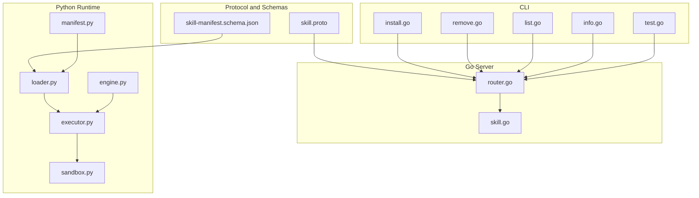

**Diagram sources**
- [skill.proto:1-101](file://api/proto/resolvenet/v1/skill.proto#L1-L101)
- [skill-manifest.schema.json:1-74](file://api/jsonschema/skill-manifest.schema.json#L1-L74)
- [router.go:1-183](file://pkg/server/router.go#L1-L183)
- [skill.go:1-80](file://pkg/registry/skill.go#L1-L80)
- [loader.py:1-90](file://python/src/resolvenet/skills/loader.py#L1-L90)
- [executor.py:1-85](file://python/src/resolvenet/skills/executor.py#L1-L85)
- [sandbox.py:1-56](file://python/src/resolvenet/skills/sandbox.py#L1-L56)
- [manifest.py:1-59](file://python/src/resolvenet/skills/manifest.py#L1-L59)
- [engine.py:1-89](file://python/src/resolvenet/runtime/engine.py#L1-L89)
- [install.go:1-41](file://internal/cli/skill/install.go#L1-L41)
- [remove.go:1-22](file://internal/cli/skill/remove.go#L1-L22)
- [list.go:1-23](file://internal/cli/skill/list.go#L1-L23)
- [info.go:1-22](file://internal/cli/skill/info.go#L1-L22)
- [test.go:1-21](file://internal/cli/skill/test.go#L1-L21)

**Section sources**
- [skill.proto:1-101](file://api/proto/resolvenet/v1/skill.proto#L1-L101)
- [router.go:1-183](file://pkg/server/router.go#L1-L183)

## Core Components
- SkillService Protocol: Defines RPCs for registering, retrieving, listing, unregistering, and testing skills.
- Skill Message: Carries metadata, version, author, manifest, source type/URI, and status.
- SkillManifest: Declares entry point, inputs/outputs, dependencies, and permissions.
- Skill Parameter and Permissions: Typed parameters with defaults and permission controls for network, FS access, and resource limits.
- Go Server Endpoints: HTTP handlers for skills (currently stubbed).
- Python Loader/Executor: Loads skills from directories, validates manifests, executes functions, and reports results.
- Sandbox: Provides isolation configuration (placeholder implementation).
- Registry: In-memory storage for skill definitions.

**Section sources**
- [skill.proto:10-101](file://api/proto/resolvenet/v1/skill.proto#L10-L101)
- [router.go:26-31](file://pkg/server/router.go#L26-L31)
- [loader.py:15-90](file://python/src/resolvenet/skills/loader.py#L15-L90)
- [executor.py:14-85](file://python/src/resolvenet/skills/executor.py#L14-L85)
- [sandbox.py:11-56](file://python/src/resolvenet/skills/sandbox.py#L11-L56)
- [skill.go:9-80](file://pkg/registry/skill.go#L9-L80)

## Architecture Overview
The Skill Operations API integrates client-side CLI and HTTP clients with a Go server exposing REST endpoints mapped to the SkillService RPCs. Skills are represented by manifests and executed via a Python runtime with optional sandboxing.

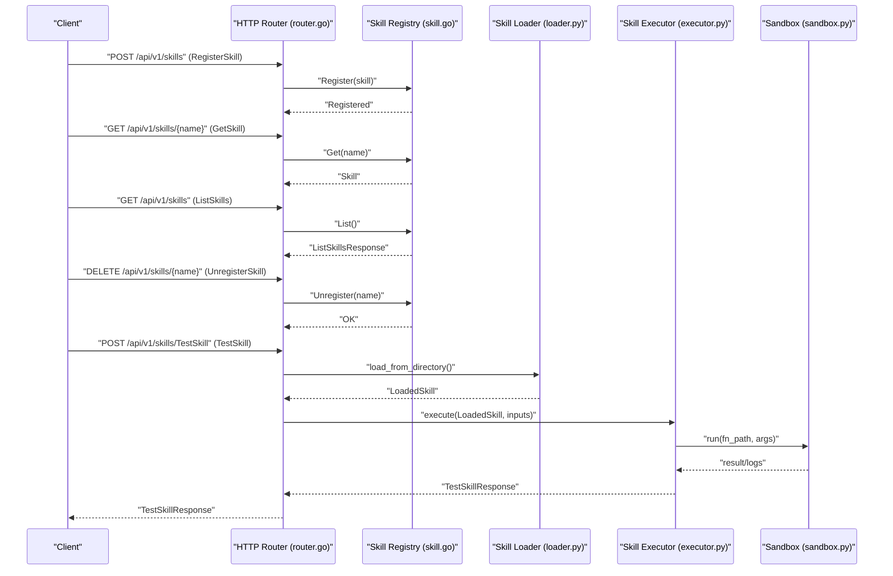

**Diagram sources**
- [router.go:26-31](file://pkg/server/router.go#L26-L31)
- [skill.go:22-28](file://pkg/registry/skill.go#L22-L28)
- [loader.py:27-57](file://python/src/resolvenet/skills/loader.py#L27-L57)
- [executor.py:20-66](file://python/src/resolvenet/skills/executor.py#L20-L66)
- [sandbox.py:35-55](file://python/src/resolvenet/skills/sandbox.py#L35-L55)

## Detailed Component Analysis

### Skill Message and Manifest Schema
- Skill message fields include metadata, version, author, manifest, source type, source URI, and status.
- SkillManifest defines entry_point, inputs, outputs, dependencies, and permissions.
- SkillParameter supports typed parameters with description, required flag, and default value.
- SkillPermissions define network access, file system read/write, allowed hosts, and resource limits (memory, CPU seconds, timeout).
- JSON Schema enforces manifest structure and defaults for permissions.

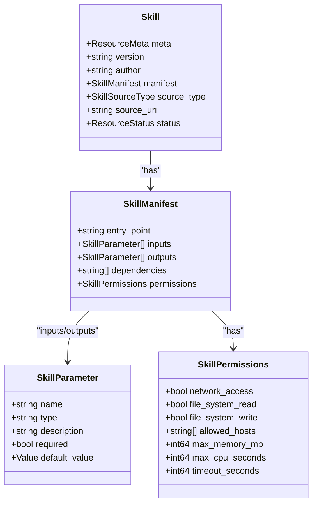

**Diagram sources**
- [skill.proto:19-63](file://api/proto/resolvenet/v1/skill.proto#L19-L63)

**Section sources**
- [skill.proto:19-63](file://api/proto/resolvenet/v1/skill.proto#L19-L63)
- [skill-manifest.schema.json:1-74](file://api/jsonschema/skill-manifest.schema.json#L1-L74)

### Python Manifest Parsing and Validation
- Pydantic models mirror the manifest schema for validation and defaults.
- load_manifest reads YAML and constructs a validated SkillManifest.

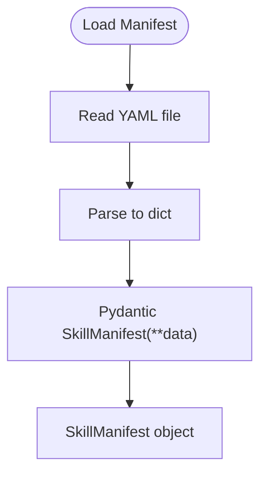

**Diagram sources**
- [manifest.py:47-59](file://python/src/resolvenet/skills/manifest.py#L47-L59)

**Section sources**
- [manifest.py:11-59](file://python/src/resolvenet/skills/manifest.py#L11-L59)

### Skill Discovery and Loading
- SkillLoader discovers skills from local directories, parses manifest, imports entry point, and caches LoadedSkill instances.
- LoadedSkill resolves the callable function lazily.

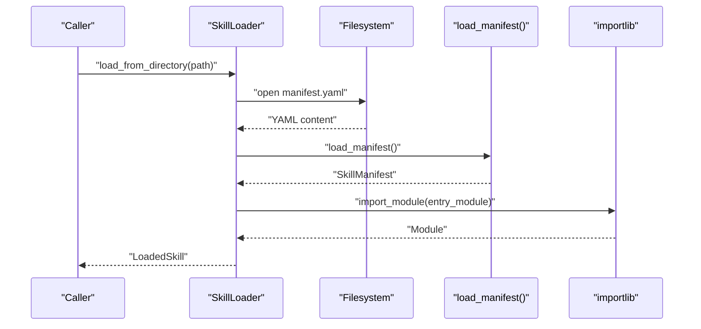

**Diagram sources**
- [loader.py:27-57](file://python/src/resolvenet/skills/loader.py#L27-L57)

**Section sources**
- [loader.py:15-90](file://python/src/resolvenet/skills/loader.py#L15-L90)

### Skill Execution Engine and Sandbox
- SkillExecutor orchestrates input validation, sandbox setup, and execution, returning structured results with timing and success flags.
- SandboxConfig encapsulates resource and network constraints; current implementation logs but does not enforce isolation.

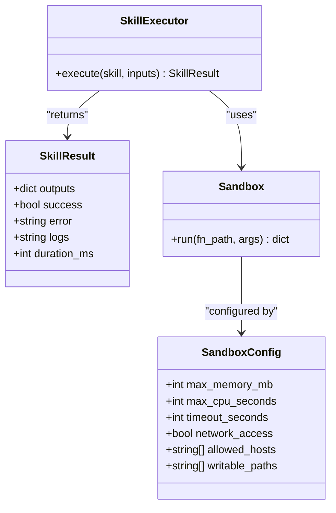

**Diagram sources**
- [executor.py:14-85](file://python/src/resolvenet/skills/executor.py#L14-L85)
- [sandbox.py:11-56](file://python/src/resolvenet/skills/sandbox.py#L11-L56)

**Section sources**
- [executor.py:14-85](file://python/src/resolvenet/skills/executor.py#L14-L85)
- [sandbox.py:11-56](file://python/src/resolvenet/skills/sandbox.py#L11-L56)

### Execution Context and Runtime Orchestration
- ExecutionEngine builds an execution context and yields events and content during agent execution.
- The engine is designed to route to subsystems (FTA, Skills, RAG) after selector decisions.

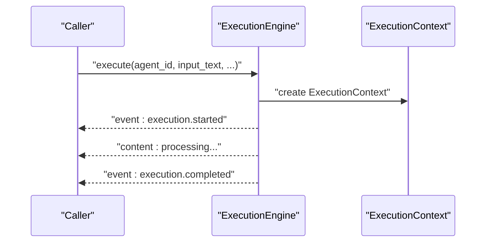

**Diagram sources**
- [engine.py:22-89](file://python/src/resolvenet/runtime/engine.py#L22-L89)

**Section sources**
- [engine.py:14-89](file://python/src/resolvenet/runtime/engine.py#L14-L89)

### API Endpoints and Server Integration
- HTTP routes for skills are defined and mapped to handler stubs.
- Current handlers return NotImplemented or NotFound, indicating implementation work remaining.

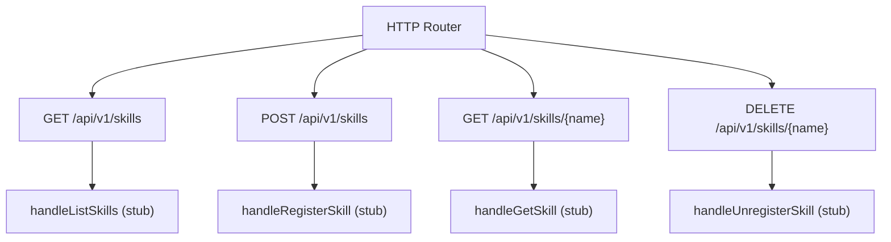

**Diagram sources**
- [router.go:26-31](file://pkg/server/router.go#L26-L31)
- [router.go:96-111](file://pkg/server/router.go#L96-L111)

**Section sources**
- [router.go:1-183](file://pkg/server/router.go#L1-L183)

### Registry Management
- InMemorySkillRegistry provides thread-safe register/get/list/unregister operations for skill definitions.

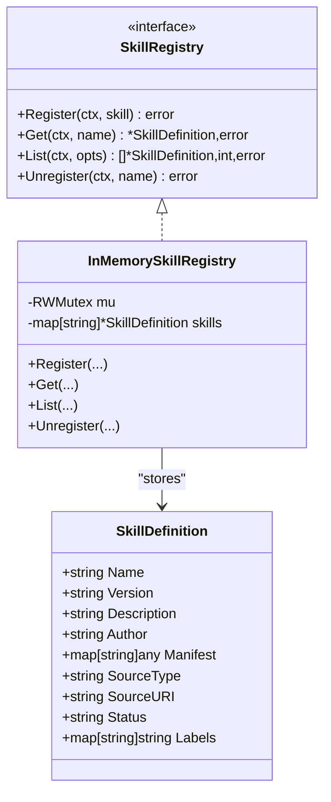

**Diagram sources**
- [skill.go:22-80](file://pkg/registry/skill.go#L22-L80)

**Section sources**
- [skill.go:9-80](file://pkg/registry/skill.go#L9-L80)

### CLI Commands for Skill Lifecycle
- skill install: Install a skill from a source (local path, git, registry).
- skill list: List installed skills.
- skill info: Show details for a named skill.
- skill test: Test a skill in isolation.
- skill remove: Uninstall a skill by name.

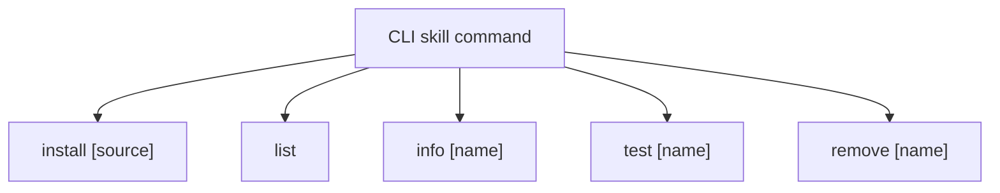

**Diagram sources**
- [install.go:26-40](file://internal/cli/skill/install.go#L26-L40)
- [list.go:9-22](file://internal/cli/skill/list.go#L9-L22)
- [info.go:9-21](file://internal/cli/skill/info.go#L9-L21)
- [test.go:9-21](file://internal/cli/skill/test.go#L9-L21)
- [remove.go:9-21](file://internal/cli/skill/remove.go#L9-L21)

**Section sources**
- [install.go:1-41](file://internal/cli/skill/install.go#L1-L41)
- [list.go:1-23](file://internal/cli/skill/list.go#L1-L23)
- [info.go:1-22](file://internal/cli/skill/info.go#L1-L22)
- [test.go:1-21](file://internal/cli/skill/test.go#L1-L21)
- [remove.go:1-22](file://internal/cli/skill/remove.go#L1-L22)

## Dependency Analysis
- Protocol buffers define the API surface and data contracts.
- Python loader depends on manifest parsing and importlib to resolve entry points.
- Executor depends on loader and sandbox for execution.
- Server routes depend on registry for persistence.
- CLI commands depend on server endpoints for remote operations.

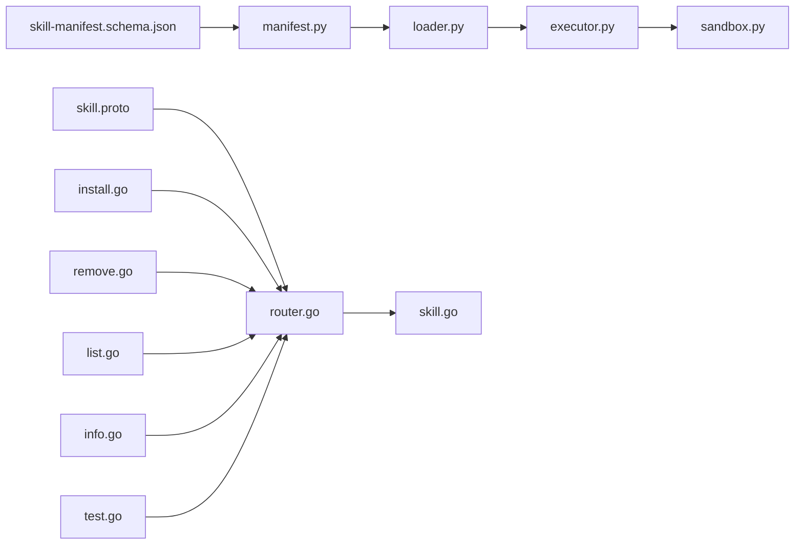

**Diagram sources**
- [skill.proto:1-101](file://api/proto/resolvenet/v1/skill.proto#L1-L101)
- [skill-manifest.schema.json:1-74](file://api/jsonschema/skill-manifest.schema.json#L1-L74)
- [manifest.py:1-59](file://python/src/resolvenet/skills/manifest.py#L1-L59)
- [loader.py:1-90](file://python/src/resolvenet/skills/loader.py#L1-L90)
- [executor.py:1-85](file://python/src/resolvenet/skills/executor.py#L1-L85)
- [sandbox.py:1-56](file://python/src/resolvenet/skills/sandbox.py#L1-L56)
- [router.go:1-183](file://pkg/server/router.go#L1-L183)
- [skill.go:1-80](file://pkg/registry/skill.go#L1-L80)
- [install.go:1-41](file://internal/cli/skill/install.go#L1-L41)
- [remove.go:1-22](file://internal/cli/skill/remove.go#L1-L22)
- [list.go:1-23](file://internal/cli/skill/list.go#L1-L23)
- [info.go:1-22](file://internal/cli/skill/info.go#L1-L22)
- [test.go:1-21](file://internal/cli/skill/test.go#L1-L21)

**Section sources**
- [router.go:1-183](file://pkg/server/router.go#L1-L183)
- [loader.py:1-90](file://python/src/resolvenet/skills/loader.py#L1-L90)
- [executor.py:1-85](file://python/src/resolvenet/skills/executor.py#L1-L85)
- [sandbox.py:1-56](file://python/src/resolvenet/skills/sandbox.py#L1-L56)
- [skill.go:1-80](file://pkg/registry/skill.go#L1-L80)

## Performance Considerations
- Resource limits: Enforce max_memory_mb, max_cpu_seconds, and timeout_seconds to prevent resource exhaustion.
- Network restrictions: Allow-list allowed_hosts to minimize outbound traffic.
- File system isolation: Mount skill directories read-only and provide a temporary writable workspace.
- Sandboxing: Implement OS-level isolation (subprocess limits, seccomp/AppArmor, network namespaces) to harden execution boundaries.
- Caching: Cache loaded skills and callable functions to avoid repeated imports.

[No sources needed since this section provides general guidance]

## Troubleshooting Guide
- Manifest validation errors: Ensure required fields (name, version, entry_point) are present and typed parameters conform to schema.
- Execution failures: Review SkillResult.error and logs; confirm function signature matches manifest inputs.
- Sandbox not implemented: Expect placeholder behavior until sandbox enforcement is enabled.
- Server endpoints not implemented: Current handlers return NotImplemented or NotFound; implement handlers to enable full functionality.

**Section sources**
- [executor.py:57-66](file://python/src/resolvenet/skills/executor.py#L57-L66)
- [sandbox.py:45-55](file://python/src/resolvenet/skills/sandbox.py#L45-L55)
- [router.go:100-111](file://pkg/server/router.go#L100-L111)

## Conclusion
The Skill Operations API defines a clear contract for skill lifecycle management and execution. While the protocol and Python runtime components are largely implemented, the Go server endpoints are currently stubs. Completing server handlers, enabling sandbox enforcement, and integrating CLI commands will deliver a robust skill platform supporting secure, isolated execution.

[No sources needed since this section summarizes without analyzing specific files]

## Appendices

### API Reference: SkillService RPCs
- RegisterSkill(RegisterSkillRequest) returns (Skill)
- GetSkill(GetSkillRequest) returns (Skill)
- ListSkills(ListSkillsRequest) returns (ListSkillsResponse)
- UnregisterSkill(UnregisterSkillRequest) returns (UnregisterSkillResponse)
- TestSkill(TestSkillRequest) returns (TestSkillResponse)

Request/Response fields:
- RegisterSkillRequest.skill
- GetSkillRequest.name
- ListSkillsRequest.pagination
- ListSkillsResponse.skills, pagination
- UnregisterSkillRequest.name
- UnregisterSkillResponse
- TestSkillRequest.name, inputs
- TestSkillResponse.outputs, logs, duration_ms, success, error_message

**Section sources**
- [skill.proto:10-101](file://api/proto/resolvenet/v1/skill.proto#L10-L101)

### Example Manifest Schema
- Required fields: name, version, entry_point
- Inputs/Outputs: array of parameters with name, type, description, required, default
- Permissions: network_access, file_system_read, file_system_write, allowed_hosts, max_memory_mb, max_cpu_seconds, timeout_seconds

**Section sources**
- [skill-manifest.schema.json:6-72](file://api/jsonschema/skill-manifest.schema.json#L6-L72)

### Example Skill Manifest and Implementation
- Example manifest demonstrates inputs, outputs, and permissions.
- Example skill module exports a run function returning a dictionary.

**Section sources**
- [manifest.yaml:1-21](file://skills/examples/hello-world/manifest.yaml#L1-L21)
- [skill.py:4-14](file://skills/examples/hello-world/skill.py#L4-L14)

### Example Skill Configuration
- Example YAML shows skill name, version, source_type, source_uri, and embedded manifest with inputs and permissions.

**Section sources**
- [skill-example.yaml:1-23](file://configs/examples/skill-example.yaml#L1-L23)