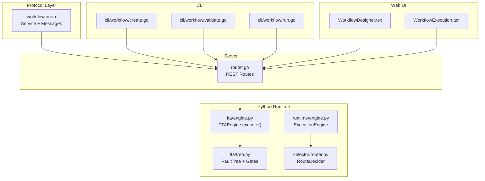
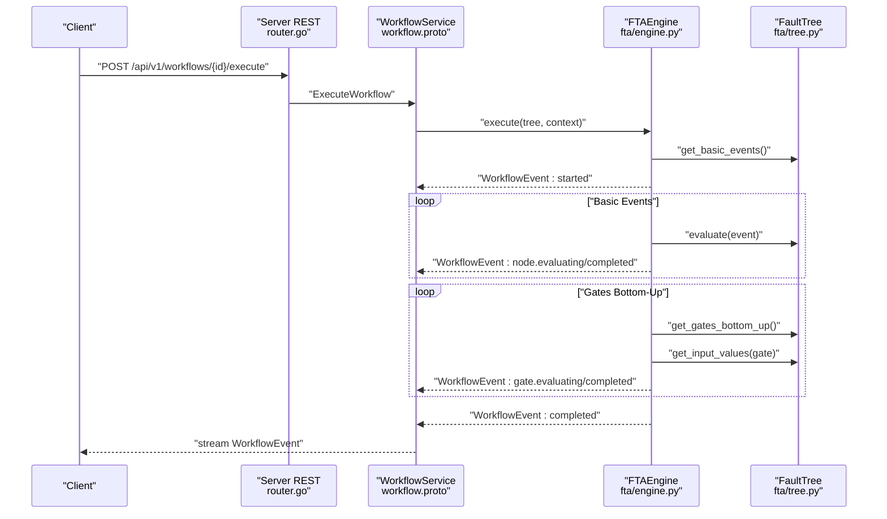
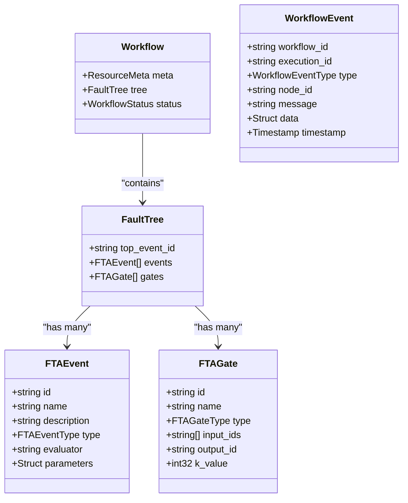
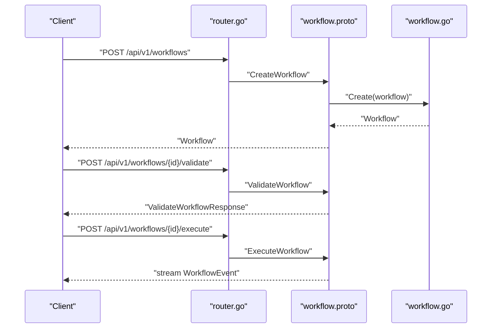
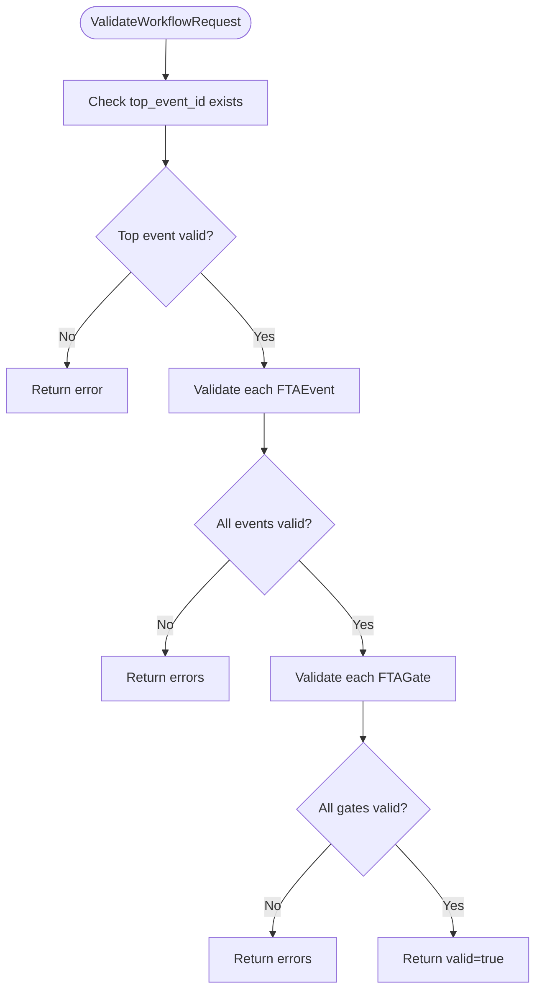
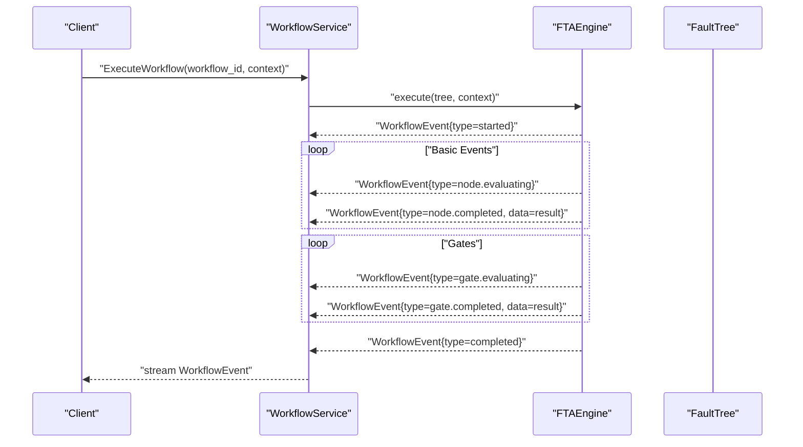
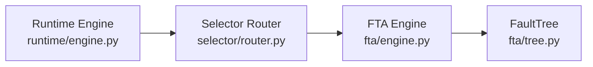
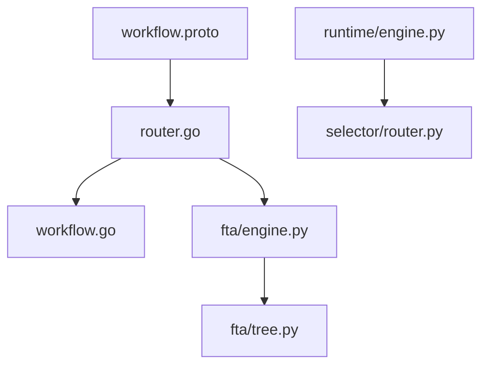

# Workflow Execution API

<cite>
**Referenced Files in This Document**
- [workflow.proto](file://api/proto/resolvenet/v1/workflow.proto)
- [router.go](file://pkg/server/router.go)
- [workflow.go](file://pkg/registry/workflow.go)
- [engine.py](file://python/src/resolvenet/fta/engine.py)
- [tree.py](file://python/src/resolvenet/fta/tree.py)
- [router.py](file://python/src/resolvenet/selector/router.py)
- [engine.py](file://python/src/resolvenet/runtime/engine.py)
- [workflow-fta-example.yaml](file://configs/examples/workflow-fta-example.yaml)
- [WorkflowDesigner.tsx](file://web/src/pages/Workflows/WorkflowDesigner.tsx)
- [WorkflowExecution.tsx](file://web/src/pages/Workflows/WorkflowExecution.tsx)
- [create.go](file://internal/cli/workflow/create.go)
- [validate.go](file://internal/cli/workflow/validate.go)
- [run.go](file://internal/cli/workflow/run.go)
- [workflow_execution_test.go](file://test/e2e/workflow_execution_test.go)
</cite>

## Table of Contents
1. [Introduction](#introduction)
2. [Project Structure](#project-structure)
3. [Core Components](#core-components)
4. [Architecture Overview](#architecture-overview)
5. [Detailed Component Analysis](#detailed-component-analysis)
6. [Dependency Analysis](#dependency-analysis)
7. [Performance Considerations](#performance-considerations)
8. [Troubleshooting Guide](#troubleshooting-guide)
9. [Conclusion](#conclusion)
10. [Appendices](#appendices)

## Introduction
This document describes the Workflow Execution API for Fault Tree Analysis (FTA) workflows. It covers workflow design, validation, execution, and monitoring. It documents the RPCs for creating, validating, executing, and retrieving results for workflows, details the Workflow message structure (including nodes, edges, and execution parameters), explains validation rules and dependency resolution, and outlines execution context management. It also describes integration with the FTA engine and the Intelligent Selector components, and provides client implementation guidance for workflow design tools, execution monitoring, and troubleshooting.

## Project Structure
The Workflow Execution API spans protocol definitions, server-side HTTP handlers, Python-based execution engines, CLI tools, and frontend components:
- Protocol buffer definitions define the service and message contracts.
- Server routes expose REST endpoints that currently return stub responses.
- Python FTA engine executes fault trees and emits progress events.
- Registry stores workflow definitions in memory for development.
- CLI commands provide workflow lifecycle operations (creation, validation, execution).
- Web UI pages visualize workflow design and execution.

**Diagram sources**
- [workflow.proto:11-20](file://api/proto/resolvenet/v1/workflow.proto#L11-L20)
- [router.go:32-39](file://pkg/server/router.go#L32-L39)
- [engine.py:24-82](file://python/src/resolvenet/fta/engine.py#L24-L82)
- [tree.py:81-120](file://python/src/resolvenet/fta/tree.py#L81-L120)
- [router.py:17-39](file://python/src/resolvenet/selector/router.py#L17-L39)
- [engine.py:25-89](file://python/src/resolvenet/runtime/engine.py#L25-L89)
- [create.go:26-44](file://internal/cli/workflow/create.go#L26-L44)
- [validate.go:9-22](file://internal/cli/workflow/validate.go#L9-L22)
- [run.go:9-21](file://internal/cli/workflow/run.go#L9-L21)
- [WorkflowDesigner.tsx:3-24](file://web/src/pages/Workflows/WorkflowDesigner.tsx#L3-L24)
- [WorkflowExecution.tsx:3-16](file://web/src/pages/Workflows/WorkflowExecution.tsx#L3-L16)

**Section sources**
- [workflow.proto:11-20](file://api/proto/resolvenet/v1/workflow.proto#L11-L20)
- [router.go:32-39](file://pkg/server/router.go#L32-L39)

## Core Components
- WorkflowService: Defines RPCs for workflow lifecycle and execution.
- Workflow message: Encapsulates metadata, fault tree, and status.
- FaultTree: Contains top-level event identifier, event list, and gate list.
- FTAEvent: Node representing an event with type, evaluator, and parameters.
- FTAGate: Logical connector with inputs, output, and optional k-value.
- WorkflowEvent: Streaming event for execution progress.
- Validation and execution requests: ValidateWorkflowRequest, ExecuteWorkflowRequest.

Key message relationships:
- Workflow contains FaultTree.
- FaultTree contains FTAEvent and FTAGate lists.
- ExecuteWorkflowRequest carries workflow_id and execution context.

**Section sources**
- [workflow.proto:22-144](file://api/proto/resolvenet/v1/workflow.proto#L22-L144)

## Architecture Overview
The Workflow Execution API uses a streaming gRPC service to emit execution events. The server exposes REST endpoints for workflow operations, while the Python FTA engine performs bottom-up evaluation of events and gates. The runtime engine orchestrates execution context and integrates with the Intelligent Selector for routing decisions.

**Diagram sources**
- [router.go:38-39](file://pkg/server/router.go#L38-L39)
- [workflow.proto:19-20](file://api/proto/resolvenet/v1/workflow.proto#L19-L20)
- [engine.py:24-82](file://python/src/resolvenet/fta/engine.py#L24-L82)
- [tree.py:92-120](file://python/src/resolvenet/fta/tree.py#L92-L120)

## Detailed Component Analysis

### Workflow Message Structure
- Workflow: Includes ResourceMeta, FaultTree, and WorkflowStatus.
- FaultTree: Top-level event identifier and lists of events and gates.
- FTAEvent: Identifier, name, description, type, evaluator, and parameters.
- FTAGate: Identifier, name, type, input_ids, output_id, and k_value for voting gates.
- WorkflowStatus: Draft, Active, Archived.
- FTAEventType: Top, Intermediate, Basic, Undeveloped, Conditioning.
- FTAGateType: And, Or, Voting, Inhibit, PriorityAnd.

**Diagram sources**
- [workflow.proto:22-101](file://api/proto/resolvenet/v1/workflow.proto#L22-L101)

**Section sources**
- [workflow.proto:22-101](file://api/proto/resolvenet/v1/workflow.proto#L22-L101)

### Workflow Lifecycle RPCs
- CreateWorkflow: Creates a new workflow definition.
- GetWorkflow: Retrieves a workflow by ID.
- ListWorkflows: Lists workflows with pagination.
- UpdateWorkflow: Updates an existing workflow.
- DeleteWorkflow: Deletes a workflow.
- ValidateWorkflow: Validates a FaultTree for correctness and completeness.
- ExecuteWorkflow: Streams WorkflowEvent updates for a workflow execution.

**Diagram sources**
- [router.go:32-39](file://pkg/server/router.go#L32-L39)
- [workflow.proto:104-144](file://api/proto/resolvenet/v1/workflow.proto#L104-L144)
- [workflow.go:19-26](file://pkg/registry/workflow.go#L19-L26)

**Section sources**
- [workflow.proto:11-20](file://api/proto/resolvenet/v1/workflow.proto#L11-L20)
- [router.go:32-39](file://pkg/server/router.go#L32-L39)
- [workflow.go:19-26](file://pkg/registry/workflow.go#L19-L26)

### Workflow Validation Rules and Dependency Resolution
Validation ensures:
- FaultTree has a valid top_event_id present among events.
- All gates reference existing event IDs in input_ids and output_id.
- Event types are valid.
- Gate types are valid.
- Voting gates have a sensible k_value.

Dependency resolution:
- Basic events are evaluated first.
- Gates are evaluated bottom-up using input values propagated from child nodes.
- The FaultTree provides helper methods to retrieve basic events, gates in bottom-up order, and input values for a gate.

**Diagram sources**
- [workflow.proto:131-139](file://api/proto/resolvenet/v1/workflow.proto#L131-L139)
- [tree.py:92-120](file://python/src/resolvenet/fta/tree.py#L92-L120)

**Section sources**
- [workflow.proto:131-139](file://api/proto/resolvenet/v1/workflow.proto#L131-L139)
- [tree.py:92-120](file://python/src/resolvenet/fta/tree.py#L92-L120)

### Execution Context Management and Progress Tracking
Execution context:
- ExecuteWorkflowRequest includes workflow_id and a Struct context for runtime data.
- The FTAEngine streams WorkflowEvent updates with type, node_id, message, and optional data.

Progress tracking:
- WorkflowEventType includes started, node.evaluating, node.completed, gate.evaluating, gate.completed, completed, failed.

**Diagram sources**
- [workflow.proto:141-144](file://api/proto/resolvenet/v1/workflow.proto#L141-L144)
- [engine.py:24-82](file://python/src/resolvenet/fta/engine.py#L24-L82)

**Section sources**
- [workflow.proto:81-101](file://api/proto/resolvenet/v1/workflow.proto#L81-L101)
- [engine.py:24-82](file://python/src/resolvenet/fta/engine.py#L24-L82)

### Integration with FTA Engine and Intelligent Selector
- FTA Engine: Executes fault trees asynchronously, yielding progress events for nodes and gates.
- FaultTree: Provides traversal helpers for basic events and gates, and computes input values for gate evaluation.
- Intelligent Selector: RouteDecider determines routing decisions; current implementation is a placeholder and will be integrated into the runtime engine orchestration.

**Diagram sources**
- [engine.py:25-89](file://python/src/resolvenet/runtime/engine.py#L25-L89)
- [router.py:17-39](file://python/src/resolvenet/selector/router.py#L17-L39)
- [engine.py:24-82](file://python/src/resolvenet/fta/engine.py#L24-L82)
- [tree.py:81-120](file://python/src/resolvenet/fta/tree.py#L81-L120)

**Section sources**
- [engine.py:25-89](file://python/src/resolvenet/runtime/engine.py#L25-L89)
- [router.py:17-39](file://python/src/resolvenet/selector/router.py#L17-L39)
- [engine.py:24-82](file://python/src/resolvenet/fta/engine.py#L24-L82)
- [tree.py:81-120](file://python/src/resolvenet/fta/tree.py#L81-L120)

### Client Implementation Examples
- Workflow Design Tool: Use the designer page to render and edit the fault tree graphically. The designer integrates with the backend via REST endpoints and supports drag-and-drop editing.
- Execution Monitoring: Use the execution page to monitor live progress with highlighted nodes and event streaming.
- CLI Tools: The CLI provides commands for creating, validating, and running workflows. These commands are placeholders and will wire into the REST endpoints.

Example references:
- Designer page: [WorkflowDesigner.tsx:3-24](file://web/src/pages/Workflows/WorkflowDesigner.tsx#L3-L24)
- Execution page: [WorkflowExecution.tsx:3-16](file://web/src/pages/Workflows/WorkflowExecution.tsx#L3-L16)
- CLI create: [create.go:26-44](file://internal/cli/workflow/create.go#L26-L44)
- CLI validate: [validate.go:9-22](file://internal/cli/workflow/validate.go#L9-L22)
- CLI run: [run.go:9-21](file://internal/cli/workflow/run.go#L9-L21)

**Section sources**
- [WorkflowDesigner.tsx:3-24](file://web/src/pages/Workflows/WorkflowDesigner.tsx#L3-L24)
- [WorkflowExecution.tsx:3-16](file://web/src/pages/Workflows/WorkflowExecution.tsx#L3-L16)
- [create.go:26-44](file://internal/cli/workflow/create.go#L26-L44)
- [validate.go:9-22](file://internal/cli/workflow/validate.go#L9-L22)
- [run.go:9-21](file://internal/cli/workflow/run.go#L9-L21)

## Dependency Analysis
- Protocol buffer service depends on common and protobuf struct/timestamp imports.
- Server routes depend on the WorkflowService RPCs and currently return stub responses.
- Registry provides in-memory storage for workflow definitions.
- FTA engine depends on FaultTree and NodeEvaluator to compute results.
- Runtime engine orchestrates execution context and integrates with the selector.

**Diagram sources**
- [workflow.proto:7-9](file://api/proto/resolvenet/v1/workflow.proto#L7-L9)
- [router.go:32-39](file://pkg/server/router.go#L32-L39)
- [workflow.go:19-26](file://pkg/registry/workflow.go#L19-L26)
- [engine.py:24-82](file://python/src/resolvenet/fta/engine.py#L24-L82)
- [tree.py:81-120](file://python/src/resolvenet/fta/tree.py#L81-L120)
- [engine.py:25-89](file://python/src/resolvenet/runtime/engine.py#L25-L89)
- [router.py:17-39](file://python/src/resolvenet/selector/router.py#L17-L39)

**Section sources**
- [workflow.proto:7-9](file://api/proto/resolvenet/v1/workflow.proto#L7-L9)
- [router.go:32-39](file://pkg/server/router.go#L32-L39)
- [workflow.go:19-26](file://pkg/registry/workflow.go#L19-L26)
- [engine.py:24-82](file://python/src/resolvenet/fta/engine.py#L24-L82)
- [tree.py:81-120](file://python/src/resolvenet/fta/tree.py#L81-L120)
- [engine.py:25-89](file://python/src/resolvenet/runtime/engine.py#L25-L89)
- [router.py:17-39](file://python/src/resolvenet/selector/router.py#L17-L39)

## Performance Considerations
- Streaming execution events allows real-time progress updates without blocking.
- Bottom-up gate evaluation minimizes redundant computations by leveraging previously computed event values.
- Using a structured context enables passing minimal execution data, reducing overhead.
- Consider caching frequently accessed workflows and pre-validating during creation to reduce runtime validation costs.

## Troubleshooting Guide
Common issues and resolutions:
- Workflow not found: Ensure the workflow_id exists and is correctly passed in ExecuteWorkflowRequest.
- Validation failures: Review ValidateWorkflowResponse errors and warnings to fix invalid event types, missing top_event_id, or invalid gate references.
- Execution stalls: Verify that all basic events have evaluators and parameters configured; confirm FaultTree has correct input/output relationships.
- Streaming interruptions: Confirm the client handles stream reconnections and processes WorkflowEvent timestamps for progress continuity.

**Section sources**
- [workflow.proto:131-139](file://api/proto/resolvenet/v1/workflow.proto#L131-L139)
- [engine.py:24-82](file://python/src/resolvenet/fta/engine.py#L24-L82)

## Conclusion
The Workflow Execution API defines a robust contract for designing, validating, executing, and monitoring FTA workflows. The protocol-centric design, combined with the Python-based FTA engine and planned runtime orchestration, provides a scalable foundation for intelligent fault tree analysis. The REST endpoints and CLI/Web UI components offer flexible client integrations for diverse operational needs.

## Appendices

### Example Workflow Definition Schema
Use the YAML example to define a fault tree with top-level event, intermediate and basic events, and logical gates.

- Example schema reference: [workflow-fta-example.yaml:1-50](file://configs/examples/workflow-fta-example.yaml#L1-L50)

**Section sources**
- [workflow-fta-example.yaml:1-50](file://configs/examples/workflow-fta-example.yaml#L1-L50)

### End-to-End Test Outline
- Create a workflow via REST or CLI.
- Validate the workflow definition.
- Execute the workflow and consume streamed events.
- Assert completion and results.

Reference: [workflow_execution_test.go:9-12](file://test/e2e/workflow_execution_test.go#L9-L12)

**Section sources**
- [workflow_execution_test.go:9-12](file://test/e2e/workflow_execution_test.go#L9-L12)