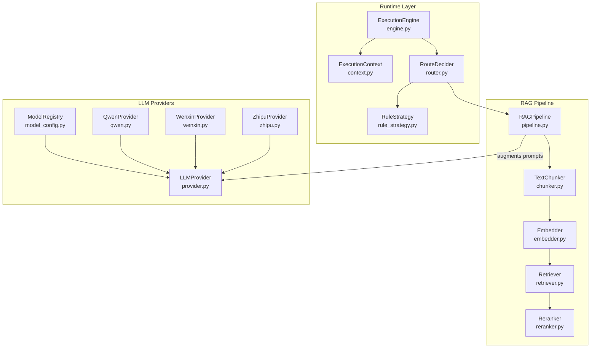
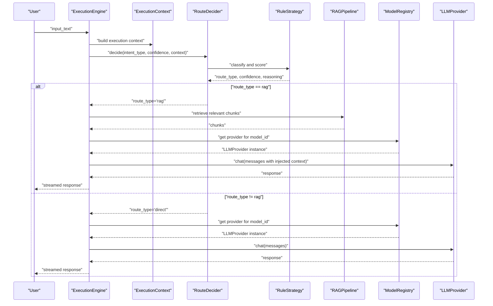
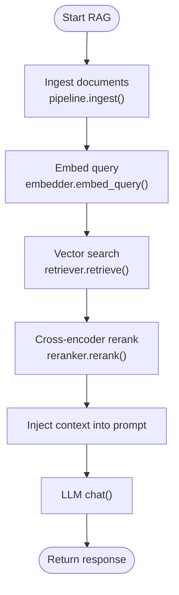
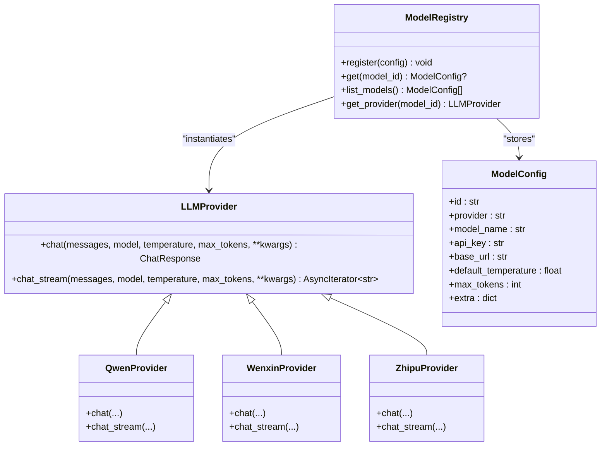
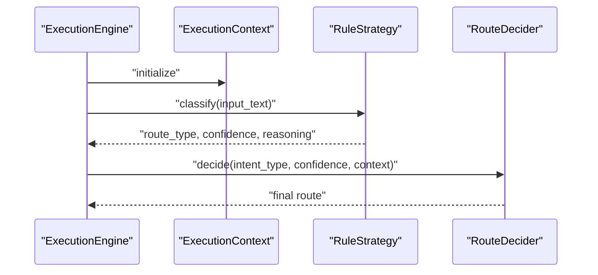
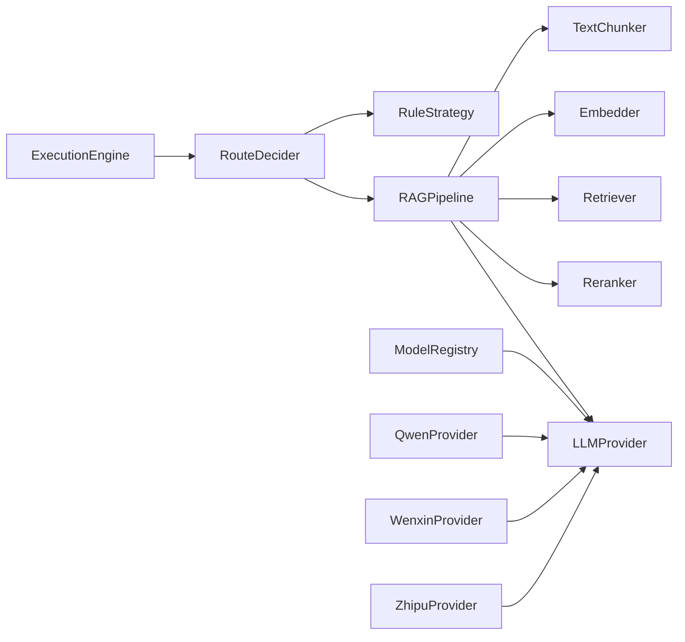

# Augmented Generation

<cite>
**Referenced Files in This Document**
- [engine.py](file://python/src/resolvenet/runtime/engine.py)
- [context.py](file://python/src/resolvenet/runtime/context.py)
- [router.py](file://python/src/resolvenet/selector/router.py)
- [rule_strategy.py](file://python/src/resolvenet/selector/strategies/rule_strategy.py)
- [provider.py](file://python/src/resolvenet/llm/provider.py)
- [model_config.py](file://python/src/resolvenet/llm/model_config.py)
- [qwen.py](file://python/src/resolvenet/llm/qwen.py)
- [wenxin.py](file://python/src/resolvenet/llm/wenxin.py)
- [zhipu.py](file://python/src/resolvenet/llm/zhipu.py)
- [pipeline.py](file://python/src/resolvenet/rag/pipeline.py)
- [chunker.py](file://python/src/resolvenet/rag/ingest/chunker.py)
- [embedder.py](file://python/src/resolvenet/rag/ingest/embedder.py)
- [retriever.py](file://python/src/resolvenet/rag/retrieve/retriever.py)
- [reranker.py](file://python/src/resolvenet/rag/retrieve/reranker.py)
- [models.yaml](file://configs/models.yaml)
- [configuration.md](file://docs/zh/configuration.md)
- [architecture.md](file://docs/zh/architecture.md)
- [rag-pipeline.md](file://docs/zh/rag-pipeline.md)
- [index.tsx](file://web/src/pages/Settings/index.tsx)
</cite>

## Table of Contents
1. [Introduction](#introduction)
2. [Project Structure](#project-structure)
3. [Core Components](#core-components)
4. [Architecture Overview](#architecture-overview)
5. [Detailed Component Analysis](#detailed-component-analysis)
6. [Dependency Analysis](#dependency-analysis)
7. [Performance Considerations](#performance-considerations)
8. [Troubleshooting Guide](#troubleshooting-guide)
9. [Conclusion](#conclusion)
10. [Appendices](#appendices)

## Introduction
This document explains the augmented generation workflow in the system, focusing on how retrieved context is injected into LLM prompts to improve response quality and factual grounding. It covers context formatting strategies, prompt engineering techniques, safety measures against hallucinations, provider integrations, response synthesis, quality control, performance optimization, and troubleshooting.

## Project Structure
The augmented generation spans three major layers:
- Runtime orchestration and context management
- Retrieval-Augmented Generation (RAG) pipeline
- LLM provider abstraction and model registry

**Diagram sources**
- [engine.py:14-89](file://python/src/resolvenet/runtime/engine.py#L14-L89)
- [context.py:9-35](file://python/src/resolvenet/runtime/context.py#L9-L35)
- [router.py:10-40](file://python/src/resolvenet/selector/router.py#L10-L40)
- [rule_strategy.py:41-76](file://python/src/resolvenet/selector/strategies/rule_strategy.py#L41-L76)
- [pipeline.py:11-75](file://python/src/resolvenet/rag/pipeline.py#L11-L75)
- [chunker.py:6-73](file://python/src/resolvenet/rag/ingest/chunker.py#L6-L73)
- [embedder.py:11-49](file://python/src/resolvenet/rag/ingest/embedder.py#L11-L49)
- [retriever.py:11-42](file://python/src/resolvenet/rag/retrieve/retriever.py#L11-L42)
- [reranker.py:11-41](file://python/src/resolvenet/rag/retrieve/reranker.py#L11-L41)
- [provider.py:27-77](file://python/src/resolvenet/llm/provider.py#L27-L77)
- [model_config.py:23-69](file://python/src/resolvenet/llm/model_config.py#L23-L69)
- [qwen.py:13-57](file://python/src/resolvenet/llm/qwen.py#L13-L57)
- [wenxin.py:13-52](file://python/src/resolvenet/llm/wenxin.py#L13-L52)
- [zhipu.py:13-51](file://python/src/resolvenet/llm/zhipu.py#L13-L51)

**Section sources**
- [architecture.md:32-116](file://docs/zh/architecture.md#L32-L116)
- [rag-pipeline.md:26-61](file://docs/zh/rag-pipeline.md#L26-L61)

## Core Components
- ExecutionEngine orchestrates agent runs, builds ExecutionContext, and emits lifecycle events and content chunks. It currently routes to a placeholder processing step and is intended to integrate with the Intelligent Selector and RAG pipeline.
- ExecutionContext holds execution_id, agent_id, conversation_id, input_text, and mutable context/metadata for cross-component sharing.
- RouteDecider and RuleStrategy classify intent and decide routing to FTA, Skills, RAG, or direct LLM response.
- RAGPipeline orchestrates ingestion, indexing, retrieval, and augmented generation. Current implementation stubs out ingestion and retrieval steps.
- TextChunker, Embedder, Retriever, and Reranker define the ingestion and retrieval stages.
- LLMProvider defines a unified interface for chat and streaming chat, with concrete providers for Qwen, Wenxin, and Zhipu. ModelRegistry resolves provider instances from model configurations.

**Section sources**
- [engine.py:14-89](file://python/src/resolvenet/runtime/engine.py#L14-L89)
- [context.py:9-35](file://python/src/resolvenet/runtime/context.py#L9-L35)
- [router.py:10-40](file://python/src/resolvenet/selector/router.py#L10-L40)
- [rule_strategy.py:41-76](file://python/src/resolvenet/selector/strategies/rule_strategy.py#L41-L76)
- [pipeline.py:11-75](file://python/src/resolvenet/rag/pipeline.py#L11-L75)
- [chunker.py:6-73](file://python/src/resolvenet/rag/ingest/chunker.py#L6-L73)
- [embedder.py:11-49](file://python/src/resolvenet/rag/ingest/embedder.py#L11-L49)
- [retriever.py:11-42](file://python/src/resolvenet/rag/retrieve/retriever.py#L11-L42)
- [reranker.py:11-41](file://python/src/resolvenet/rag/retrieve/reranker.py#L11-L41)
- [provider.py:27-77](file://python/src/resolvenet/llm/provider.py#L27-L77)
- [model_config.py:23-69](file://python/src/resolvenet/llm/model_config.py#L23-L69)

## Architecture Overview
The augmented generation workflow integrates runtime orchestration, RAG retrieval, and LLM providers. The system routes user queries through the Intelligent Selector to determine whether to use RAG or direct generation. When RAG is selected, the pipeline retrieves relevant chunks, synthesizes a prompt with context, and generates a response via the chosen provider.

**Diagram sources**
- [engine.py:25-89](file://python/src/resolvenet/runtime/engine.py#L25-L89)
- [router.py:17-40](file://python/src/resolvenet/selector/router.py#L17-L40)
- [rule_strategy.py:41-76](file://python/src/resolvenet/selector/strategies/rule_strategy.py#L41-L76)
- [pipeline.py:53-75](file://python/src/resolvenet/rag/pipeline.py#L53-L75)
- [model_config.py:41-69](file://python/src/resolvenet/llm/model_config.py#L41-L69)
- [provider.py:34-77](file://python/src/resolvenet/llm/provider.py#L34-L77)

## Detailed Component Analysis

### Context Injection and Prompt Engineering
- Context formatting: The ExecutionContext carries context and metadata that can be passed into the RAG pipeline and LLM calls. The prompt should include a dedicated context section followed by the user query, ensuring the model can distinguish grounded facts from generation.
- Prompt engineering techniques:
  - Zero-shot and few-shot examples can be embedded in the system’s prompt template to guide grounded reasoning.
  - Explicit instruction to “stick to the provided context” and “say I do not know if uncertain” reduces hallucinations.
  - Structured citations can be included alongside context to support verifiability.
- Safety measures:
  - Guardrails: detect and block unsafe topics or instructions.
  - Confidence-aware synthesis: suppress or rephrase when confidence in retrieved context is low.
  - Post-hoc fact-checking against retrieved chunks for high-stakes domains.

[No sources needed since this section provides general guidance]

### RAG Pipeline Orchestration
- Ingestion: Parse, chunk, embed, and index documents. The pipeline exposes an ingest method with placeholders for future implementation.
- Retrieval: Embed the query, search the vector store, and rerank results to improve precision.
- Augmented generation: Inject the top-k retrieved chunks into the LLM prompt along with the user query.

**Diagram sources**
- [pipeline.py:28-75](file://python/src/resolvenet/rag/pipeline.py#L28-L75)
- [embedder.py:38-49](file://python/src/resolvenet/rag/ingest/embedder.py#L38-L49)
- [retriever.py:21-42](file://python/src/resolvenet/rag/retrieve/retriever.py#L21-L42)
- [reranker.py:21-41](file://python/src/resolvenet/rag/retrieve/reranker.py#L21-L41)

**Section sources**
- [pipeline.py:11-75](file://python/src/resolvenet/rag/pipeline.py#L11-L75)
- [chunker.py:25-73](file://python/src/resolvenet/rag/ingest/chunker.py#L25-L73)
- [embedder.py:23-49](file://python/src/resolvenet/rag/ingest/embedder.py#L23-L49)
- [retriever.py:21-42](file://python/src/resolvenet/rag/retrieve/retriever.py#L21-L42)
- [reranker.py:21-41](file://python/src/resolvenet/rag/retrieve/reranker.py#L21-L41)

### LLM Provider Integration and Model Registry
- Unified interface: LLMProvider defines chat and chat_stream methods for all providers.
- Concrete providers: QwenProvider, WenxinProvider, and ZhipuProvider implement provider-specific logic.
- Model registry: ModelRegistry maps model_id to provider instances, resolving configuration such as api_key, base_url, and default model.

**Diagram sources**
- [provider.py:27-77](file://python/src/resolvenet/llm/provider.py#L27-L77)
- [model_config.py:10-69](file://python/src/resolvenet/llm/model_config.py#L10-L69)
- [qwen.py:13-57](file://python/src/resolvenet/llm/qwen.py#L13-L57)
- [wenxin.py:13-52](file://python/src/resolvenet/llm/wenxin.py#L13-L52)
- [zhipu.py:13-51](file://python/src/resolvenet/llm/zhipu.py#L13-L51)

**Section sources**
- [provider.py:27-77](file://python/src/resolvenet/llm/provider.py#L27-L77)
- [model_config.py:10-69](file://python/src/resolvenet/llm/model_config.py#L10-L69)
- [qwen.py:13-57](file://python/src/resolvenet/llm/qwen.py#L13-L57)
- [wenxin.py:13-52](file://python/src/resolvenet/llm/wenxin.py#L13-L52)
- [zhipu.py:13-51](file://python/src/resolvenet/llm/zhipu.py#L13-L51)

### Runtime Orchestration and Routing
- ExecutionEngine builds ExecutionContext and emits lifecycle events. It is designed to integrate the Intelligent Selector and route to FTA, Skills, or RAG.
- RouteDecider makes the final routing decision based on intent classification and confidence.
- RuleStrategy provides pattern-based routing decisions including RAG, Skills, and FTA with confidence scores.

**Diagram sources**
- [engine.py:25-89](file://python/src/resolvenet/runtime/engine.py#L25-L89)
- [router.py:17-40](file://python/src/resolvenet/selector/router.py#L17-L40)
- [rule_strategy.py:41-76](file://python/src/resolvenet/selector/strategies/rule_strategy.py#L41-L76)

**Section sources**
- [engine.py:14-89](file://python/src/resolvenet/runtime/engine.py#L14-L89)
- [router.py:10-40](file://python/src/resolvenet/selector/router.py#L10-L40)
- [rule_strategy.py:41-76](file://python/src/resolvenet/selector/strategies/rule_strategy.py#L41-L76)

### Response Synthesis Methods
- Prompt construction: Combine user query with top-k retrieved chunks. Include explicit instructions to cite sources and avoid unsupported claims.
- Streaming synthesis: Use chat_stream to progressively yield tokens, enabling real-time feedback and early termination.
- Confidence-aware synthesis: If the top-ranked chunk relevance is below a threshold, augment with disclaimers or switch to a “I do not know” response.

[No sources needed since this section provides general guidance]

### Quality Control Mechanisms
- Fact verification: Cross-check model answers against top-ranked chunks; flag mismatches.
- Citation tracking: Maintain chunk metadata (source, page, URL) and include them in the response.
- Confidence scoring: Use reranker scores and retrieval scores to compute a composite confidence; suppress low-confidence answers.
- Audit trails: Record execution_id, trace_id, and model usage for reproducibility and debugging.

[No sources needed since this section provides general guidance]

## Dependency Analysis
The system exhibits layered dependencies:
- Runtime depends on selector and RAG pipeline abstractions.
- RAG pipeline depends on ingestion and retrieval components.
- LLM providers depend on the unified LLMProvider interface and are resolved via ModelRegistry.

**Diagram sources**
- [engine.py:25-89](file://python/src/resolvenet/runtime/engine.py#L25-L89)
- [router.py:17-40](file://python/src/resolvenet/selector/router.py#L17-L40)
- [rule_strategy.py:41-76](file://python/src/resolvenet/selector/strategies/rule_strategy.py#L41-L76)
- [pipeline.py:28-75](file://python/src/resolvenet/rag/pipeline.py#L28-L75)
- [chunker.py:25-73](file://python/src/resolvenet/rag/ingest/chunker.py#L25-L73)
- [embedder.py:23-49](file://python/src/resolvenet/rag/ingest/embedder.py#L23-L49)
- [retriever.py:21-42](file://python/src/resolvenet/rag/retrieve/retriever.py#L21-L42)
- [reranker.py:21-41](file://python/src/resolvenet/rag/retrieve/reranker.py#L21-L41)
- [provider.py:27-77](file://python/src/resolvenet/llm/provider.py#L27-L77)
- [model_config.py:41-69](file://python/src/resolvenet/llm/model_config.py#L41-L69)
- [qwen.py:13-57](file://python/src/resolvenet/llm/qwen.py#L13-L57)
- [wenxin.py:13-52](file://python/src/resolvenet/llm/wenxin.py#L13-L52)
- [zhipu.py:13-51](file://python/src/resolvenet/llm/zhipu.py#L13-L51)

**Section sources**
- [engine.py:14-89](file://python/src/resolvenet/runtime/engine.py#L14-L89)
- [pipeline.py:11-75](file://python/src/resolvenet/rag/pipeline.py#L11-L75)
- [model_config.py:23-69](file://python/src/resolvenet/llm/model_config.py#L23-L69)

## Performance Considerations
- Latency optimization:
  - Use streaming chat_stream to reduce perceived latency.
  - Tune top_k and rerank window to balance quality and speed.
  - Cache embeddings and frequently accessed chunks.
- Cost management:
  - Select smaller models for routine tasks; reserve larger models for complex queries.
  - Monitor token usage via provider usage fields and cap generations.
  - Prefer local rerankers judiciously due to higher latency.
- Throughput:
  - Batch embedding requests where supported.
  - Use connection pooling and retry/backoff for provider calls.

[No sources needed since this section provides general guidance]

## Troubleshooting Guide
- No results from retrieval:
  - Verify collection_id and vector backend connectivity.
  - Check chunker strategy and embedding dimension alignment.
- Hallucinations:
  - Strengthen prompt instructions to cite context.
  - Lower temperature and enable strict guardrails.
- Provider errors:
  - Confirm api_key and base_url in configuration.
  - Validate model_id exists in ModelRegistry.
- Slow responses:
  - Reduce top_k or disable rerank temporarily.
  - Enable streaming and optimize chunk sizes.

**Section sources**
- [models.yaml:1-30](file://configs/models.yaml#L1-L30)
- [configuration.md:385-470](file://docs/zh/configuration.md#L385-L470)
- [model_config.py:41-69](file://python/src/resolvenet/llm/model_config.py#L41-L69)
- [qwen.py:23-25](file://python/src/resolvenet/llm/qwen.py#L23-L25)
- [wenxin.py:21-23](file://python/src/resolvenet/llm/wenxin.py#L21-L23)
- [zhipu.py:21-23](file://python/src/resolvenet/llm/zhipu.py#L21-L23)

## Conclusion
The augmented generation workflow integrates runtime orchestration, a modular RAG pipeline, and provider-agnostic LLM interfaces. By carefully formatting context, engineering robust prompts, and applying confidence-aware synthesis, the system can significantly improve factual grounding and reduce hallucinations. Provider configuration and model registry enable flexible deployment across multiple LLMs, while streaming and batching help manage latency and cost.

## Appendices

### Configuration Examples
- Model registry entries for Qwen, Wenxin, Zhipu, and OpenAI-compatible providers are defined in YAML and loaded into ModelRegistry.
- The Web UI Settings page surfaces platform configuration and model provider settings.

**Section sources**
- [models.yaml:1-30](file://configs/models.yaml#L1-L30)
- [configuration.md:385-470](file://docs/zh/configuration.md#L385-L470)
- [index.tsx:1-36](file://web/src/pages/Settings/index.tsx#L1-L36)