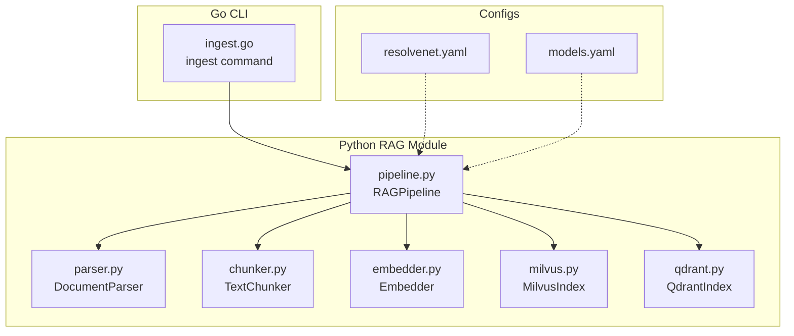
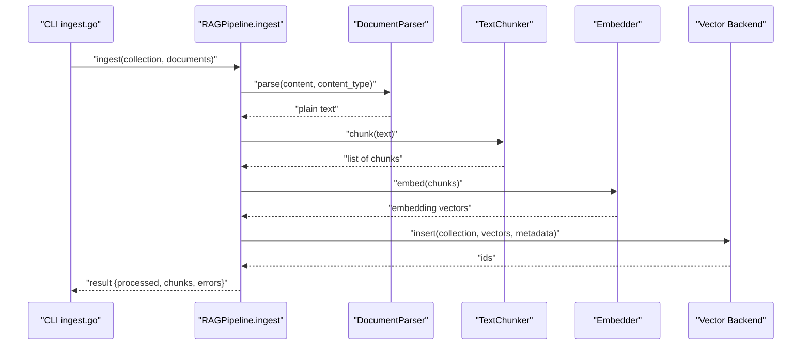
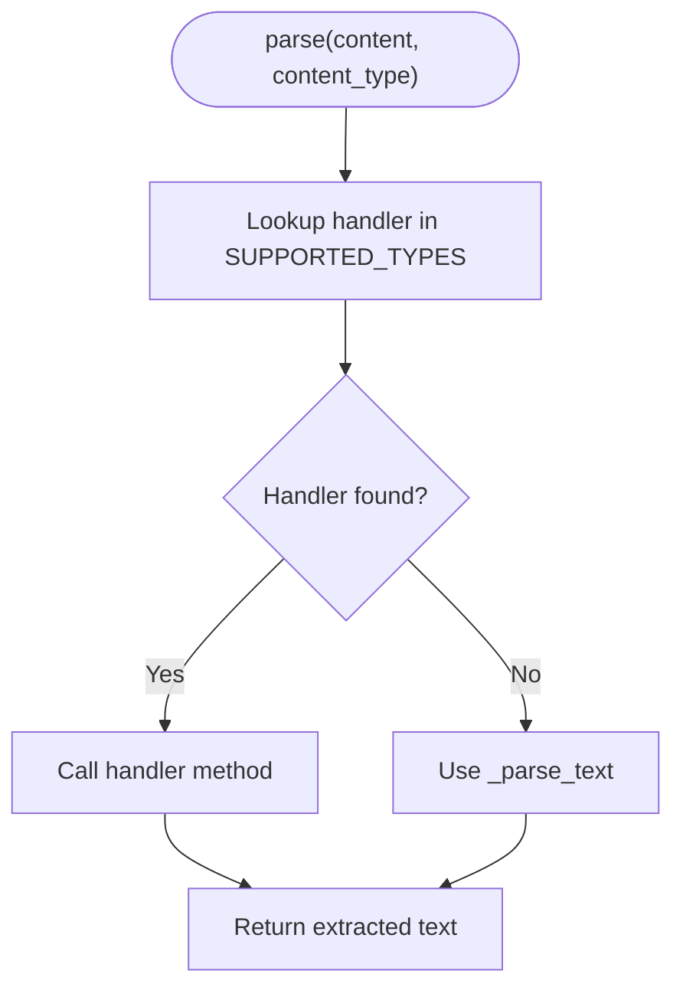
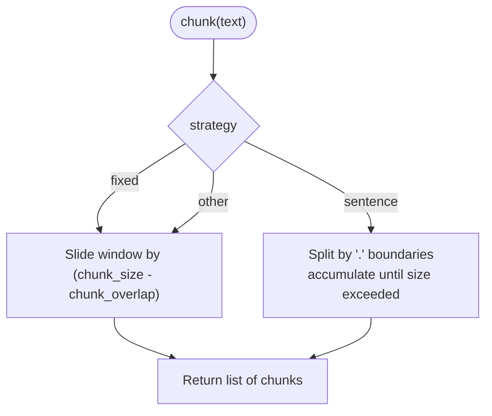
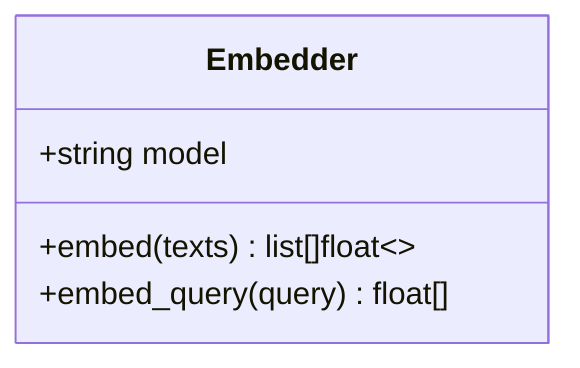
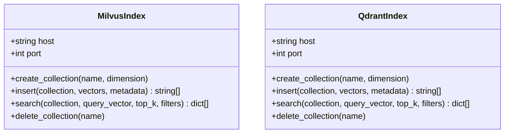
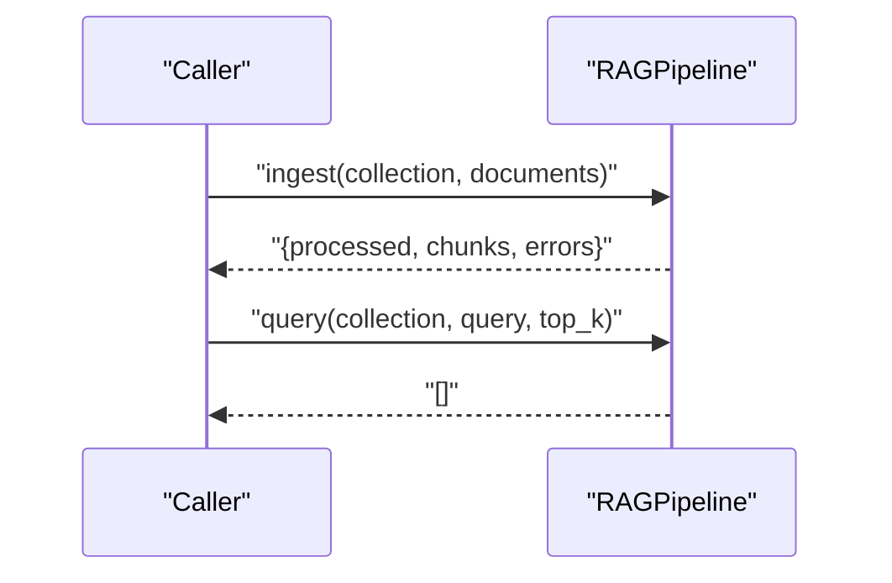
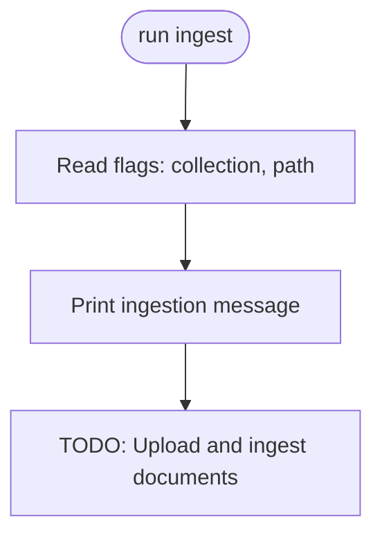
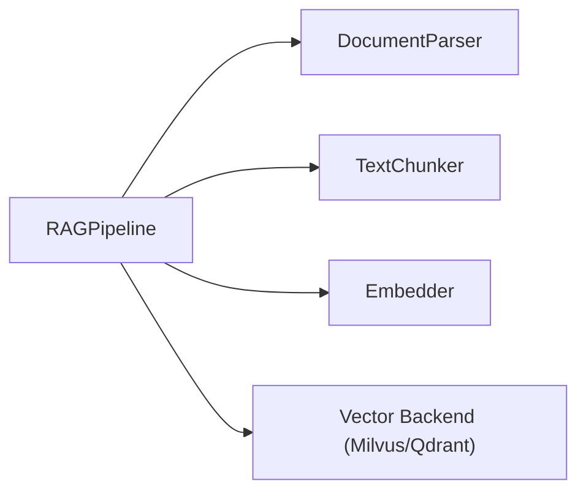

# Document Ingestion

<cite>
**Referenced Files in This Document**
- [parser.py](file://python/src/resolvenet/rag/ingest/parser.py)
- [chunker.py](file://python/src/resolvenet/rag/ingest/chunker.py)
- [embedder.py](file://python/src/resolvenet/rag/ingest/embedder.py)
- [pipeline.py](file://python/src/resolvenet/rag/pipeline.py)
- [milvus.py](file://python/src/resolvenet/rag/index/milvus.py)
- [qdrant.py](file://python/src/resolvenet/rag/index/qdrant.py)
- [ingest.go](file://internal/cli/rag/ingest.go)
- [resolvenet.yaml](file://configs/resolvenet.yaml)
- [models.yaml](file://configs/models.yaml)
</cite>

## Table of Contents
1. [Introduction](#introduction)
2. [Project Structure](#project-structure)
3. [Core Components](#core-components)
4. [Architecture Overview](#architecture-overview)
5. [Detailed Component Analysis](#detailed-component-analysis)
6. [Dependency Analysis](#dependency-analysis)
7. [Performance Considerations](#performance-considerations)
8. [Troubleshooting Guide](#troubleshooting-guide)
9. [Conclusion](#conclusion)
10. [Appendices](#appendices)

## Introduction
This document describes the document ingestion system for the platform, focusing on how documents are parsed, chunked, embedded, and indexed for retrieval-augmented generation (RAG). It covers supported formats, chunking strategies, embedding model support, configuration options, error handling, performance optimization, and metadata handling. The ingestion pipeline orchestrates parsing, chunking, embedding, and indexing, and exposes a CLI command to trigger ingestion against a target collection.

## Project Structure
The ingestion capability is implemented in the Python RAG module and integrated with Go-based CLI and configuration files.

**Diagram sources**
- [parser.py:1-49](file://python/src/resolvenet/rag/ingest/parser.py#L1-L49)
- [chunker.py:1-73](file://python/src/resolvenet/rag/ingest/chunker.py#L1-L73)
- [embedder.py:1-49](file://python/src/resolvenet/rag/ingest/embedder.py#L1-L49)
- [pipeline.py:1-75](file://python/src/resolvenet/rag/pipeline.py#L1-L75)
- [milvus.py:1-54](file://python/src/resolvenet/rag/index/milvus.py#L1-L54)
- [qdrant.py:1-52](file://python/src/resolvenet/rag/index/qdrant.py#L1-L52)
- [ingest.go:1-28](file://internal/cli/rag/ingest.go#L1-L28)
- [resolvenet.yaml:1-34](file://configs/resolvenet.yaml#L1-L34)
- [models.yaml:1-31](file://configs/models.yaml#L1-L31)

**Section sources**
- [parser.py:1-49](file://python/src/resolvenet/rag/ingest/parser.py#L1-L49)
- [chunker.py:1-73](file://python/src/resolvenet/rag/ingest/chunker.py#L1-L73)
- [embedder.py:1-49](file://python/src/resolvenet/rag/ingest/embedder.py#L1-L49)
- [pipeline.py:1-75](file://python/src/resolvenet/rag/pipeline.py#L1-L75)
- [milvus.py:1-54](file://python/src/resolvenet/rag/index/milvus.py#L1-L54)
- [qdrant.py:1-52](file://python/src/resolvenet/rag/index/qdrant.py#L1-L52)
- [ingest.go:1-28](file://internal/cli/rag/ingest.go#L1-L28)
- [resolvenet.yaml:1-34](file://configs/resolvenet.yaml#L1-L34)
- [models.yaml:1-31](file://configs/models.yaml#L1-L31)

## Core Components
- DocumentParser: Converts raw content of supported MIME types into plain text. Supported types include text/plain, text/markdown, text/html, and application/pdf. The parser delegates to dedicated methods per type and falls back to text parsing for unknown types.
- TextChunker: Splits text into overlapping chunks using strategies:
  - fixed: Fixed-size character windows with configurable overlap
  - sentence: Sentence-boundary splitting with rolling concatenation respecting chunk size
  - semantic: Placeholder for future semantic segmentation
- Embedder: Generates dense vector embeddings for lists of texts and single queries. It currently logs and returns zero vectors as placeholders, with model selection and dimensionality noted in comments.
- RAGPipeline: Orchestrates ingestion and querying. The ingestion method accepts document dictionaries containing content and metadata, and returns counts and errors. Querying is a placeholder for embedding the query, performing vector search, and reranking.
- Vector Backends: MilvusIndex and QdrantIndex define the interface for creating collections, inserting vectors with metadata, searching, and deleting collections. Both are placeholders in the current implementation.

**Section sources**
- [parser.py:8-49](file://python/src/resolvenet/rag/ingest/parser.py#L8-L49)
- [chunker.py:6-73](file://python/src/resolvenet/rag/ingest/chunker.py#L6-L73)
- [embedder.py:11-49](file://python/src/resolvenet/rag/ingest/embedder.py#L11-L49)
- [pipeline.py:11-75](file://python/src/resolvenet/rag/pipeline.py#L11-L75)
- [milvus.py:11-54](file://python/src/resolvenet/rag/index/milvus.py#L11-L54)
- [qdrant.py:11-52](file://python/src/resolvenet/rag/index/qdrant.py#L11-L52)

## Architecture Overview
The ingestion pipeline follows a staged flow: parse → chunk → embed → index. The CLI command triggers ingestion against a named collection, passing documents with content and metadata. Vector backends are selectable via configuration.

**Diagram sources**
- [ingest.go:9-27](file://internal/cli/rag/ingest.go#L9-L27)
- [pipeline.py:28-51](file://python/src/resolvenet/rag/pipeline.py#L28-L51)
- [parser.py:21-32](file://python/src/resolvenet/rag/ingest/parser.py#L21-L32)
- [chunker.py:25-39](file://python/src/resolvenet/rag/ingest/chunker.py#L25-L39)
- [embedder.py:23-36](file://python/src/resolvenet/rag/ingest/embedder.py#L23-L36)
- [milvus.py:30-36](file://python/src/resolvenet/rag/index/milvus.py#L30-L36)
- [qdrant.py:29-35](file://python/src/resolvenet/rag/index/qdrant.py#L29-L35)

## Detailed Component Analysis

### Document Parsing
- Supported types and delegation:
  - text/plain and text/markdown: parsed as text
  - text/html: parsed as text (placeholder for BeautifulSoup-based extraction)
  - application/pdf: parsed as text (placeholder for pdfplumber-based extraction)
- Fallback behavior: Unknown content types fall back to text parsing.
- Notes:
  - HTML and PDF parsing are marked as TODO and currently return minimal text extraction.
  - Byte decoding uses UTF-8 with replacement for invalid sequences.

**Diagram sources**
- [parser.py:14-32](file://python/src/resolvenet/rag/ingest/parser.py#L14-L32)
- [parser.py:34-48](file://python/src/resolvenet/rag/ingest/parser.py#L34-L48)

**Section sources**
- [parser.py:8-49](file://python/src/resolvenet/rag/ingest/parser.py#L8-L49)

### Text Chunking
- Strategies:
  - fixed: Sliding window with overlap controlled by chunk_size and chunk_overlap
  - sentence: Splits on sentence boundaries and aggregates until chunk_size exceeded
  - semantic: Default fallback to fixed strategy
- Overlap management: Overlap reduces boundary artifacts by reusing part of the previous chunk’s end in the next chunk’s start.
- Complexity:
  - fixed: O(n) over the length of the text
  - sentence: O(n) plus overhead for sentence splitting and aggregation

**Diagram sources**
- [chunker.py:15-73](file://python/src/resolvenet/rag/ingest/chunker.py#L15-L73)

**Section sources**
- [chunker.py:6-73](file://python/src/resolvenet/rag/ingest/chunker.py#L6-L73)

### Embedding Process
- Model selection: Constructor accepts a model identifier; placeholder implementation logs and returns zero vectors.
- Dimensionality: The placeholder uses a fixed dimension suitable for BGE-like models.
- Batch vs. single:
  - embed: Processes a list of texts and returns a list of vectors
  - embed_query: Wraps a single query into a list and returns a single vector
- Integration note: Embeddings are intended to be sent to an embedding model endpoint via a gateway; current implementation returns zeros.

**Diagram sources**
- [embedder.py:11-49](file://python/src/resolvenet/rag/ingest/embedder.py#L11-L49)

**Section sources**
- [embedder.py:11-49](file://python/src/resolvenet/rag/ingest/embedder.py#L11-L49)

### Vector Index Backends
- MilvusIndex:
  - Methods: create_collection, insert, search, delete_collection
  - Logging: emits structured logs for operations
  - Implementation: placeholders for actual Milvus client calls
- QdrantIndex:
  - Methods: create_collection, insert, search, delete_collection
  - Logging: emits structured logs for operations
  - Implementation: placeholders for actual Qdrant client calls

**Diagram sources**
- [milvus.py:11-54](file://python/src/resolvenet/rag/index/milvus.py#L11-L54)
- [qdrant.py:11-52](file://python/src/resolvenet/rag/index/qdrant.py#L11-L52)

**Section sources**
- [milvus.py:11-54](file://python/src/resolvenet/rag/index/milvus.py#L11-L54)
- [qdrant.py:11-52](file://python/src/resolvenet/rag/index/qdrant.py#L11-L52)

### Pipeline Orchestration
- Ingestion:
  - Accepts collection_id and a list of document dicts with content and metadata
  - Logs ingestion activity and returns counts and an errors list
  - TODO: Implements parse → chunk → embed → index
- Querying:
  - Accepts collection_id, query text, and top_k
  - Logs query activity and returns an empty list (placeholder)
- Configuration:
  - embedding_model and vector_backend are constructor parameters
  - Vector backend selection influences which index client is used downstream

**Diagram sources**
- [pipeline.py:28-75](file://python/src/resolvenet/rag/pipeline.py#L28-L75)

**Section sources**
- [pipeline.py:11-75](file://python/src/resolvenet/rag/pipeline.py#L11-L75)

### CLI Integration
- Command: ingest
  - Flags: collection (required), path (default current directory)
  - Behavior: prints a message indicating ingestion initiation; upload and ingestion are placeholders
- Integration: The CLI invokes the ingestion flow and passes the collection and path arguments to the pipeline

**Diagram sources**
- [ingest.go:9-27](file://internal/cli/rag/ingest.go#L9-L27)

**Section sources**
- [ingest.go:1-28](file://internal/cli/rag/ingest.go#L1-L28)

## Dependency Analysis
- Internal dependencies:
  - RAGPipeline depends on DocumentParser, TextChunker, Embedder, and either MilvusIndex or QdrantIndex
  - Embedder and vector backends are placeholders; actual implementations will require external clients
- External dependencies (not yet implemented):
  - PDF parsing: pdfplumber
  - HTML parsing: beautifulsoup4
  - Embedding model API: via gateway
  - Milvus client: pymilvus
  - Qdrant client: qdrant-client
- Coupling and cohesion:
  - Components are cohesive around their responsibilities and loosely coupled via interfaces
  - Vector backend selection is parameterized in the pipeline

**Diagram sources**
- [pipeline.py:20-26](file://python/src/resolvenet/rag/pipeline.py#L20-L26)
- [parser.py:8-12](file://python/src/resolvenet/rag/ingest/parser.py#L8-L12)
- [chunker.py:6-13](file://python/src/resolvenet/rag/ingest/chunker.py#L6-L13)
- [embedder.py:11-18](file://python/src/resolvenet/rag/ingest/embedder.py#L11-L18)
- [milvus.py:11-16](file://python/src/resolvenet/rag/index/milvus.py#L11-L16)
- [qdrant.py:11-16](file://python/src/resolvenet/rag/index/qdrant.py#L11-L16)

**Section sources**
- [pipeline.py:11-26](file://python/src/resolvenet/rag/pipeline.py#L11-L26)
- [parser.py:8-12](file://python/src/resolvenet/rag/ingest/parser.py#L8-L12)
- [chunker.py:6-13](file://python/src/resolvenet/rag/ingest/chunker.py#L6-L13)
- [embedder.py:11-18](file://python/src/resolvenet/rag/ingest/embedder.py#L11-L18)
- [milvus.py:11-16](file://python/src/resolvenet/rag/index/milvus.py#L11-L16)
- [qdrant.py:11-16](file://python/src/resolvenet/rag/index/qdrant.py#L11-L16)

## Performance Considerations
- Chunking:
  - Adjust chunk_size and chunk_overlap to balance recall and storage costs; larger overlaps reduce boundary loss but increase vectors
  - Prefer sentence-based chunking for natural boundaries when language quality is acceptable
- Embedding:
  - Batch embeddings to reduce API overhead; keep batch sizes aligned with provider limits
  - Cache embeddings for repeated ingestion of unchanged documents
- Indexing:
  - Use bulk insert operations when available in Milvus/Qdrant
  - Tune index parameters (e.g., HNSW/Metric type) for target similarity and throughput
- I/O:
  - Stream large files and process incrementally to avoid memory spikes
  - Parallelize independent document ingestion with bounded concurrency
- Network:
  - Place embedding gateway close to ingestion nodes; enable retries and circuit breakers
- Metadata:
  - Store minimal enrichments to reduce vector size; defer heavy enrichment to query-time if needed

[No sources needed since this section provides general guidance]

## Troubleshooting Guide
- Unsupported or unknown content types:
  - The parser falls back to text parsing; verify content_type header and encoding
- Corrupted or unreadable files:
  - PDF and HTML parsing are placeholders; ensure upstream preprocessing validates files before ingestion
- Embedding failures:
  - Current embed returns zero vectors; confirm gateway connectivity and model availability when implemented
- Indexing failures:
  - Vector backends are placeholders; implement actual client calls and handle connection errors
- CLI usage:
  - Ensure collection flag is set; path defaults to current directory

**Section sources**
- [parser.py:14-32](file://python/src/resolvenet/rag/ingest/parser.py#L14-L32)
- [embedder.py:32-36](file://python/src/resolvenet/rag/ingest/embedder.py#L32-L36)
- [milvus.py:23-36](file://python/src/resolvenet/rag/index/milvus.py#L23-L36)
- [qdrant.py:22-35](file://python/src/resolvenet/rag/index/qdrant.py#L22-L35)
- [ingest.go:22-25](file://internal/cli/rag/ingest.go#L22-L25)

## Conclusion
The document ingestion system defines a clear, staged pipeline for transforming raw documents into searchable embeddings. While the ingestion stages are currently placeholders, the modular design enables straightforward integration of robust parsing (PDF/HTML), advanced chunking, real embedding providers, and production-grade vector databases. Configuration supports selecting embedding models and vector backends, and the CLI provides a foundation for operational ingestion.

[No sources needed since this section summarizes without analyzing specific files]

## Appendices

### Configuration Examples
- Platform services configuration (network, database, Redis, NATS, runtime, gateway, telemetry)
  - Example keys: server.http_addr, server.grpc_addr, database.*, redis.*, nats.url, runtime.grpc_addr, gateway.*, telemetry.*
  - Reference: [resolvenet.yaml:1-34](file://configs/resolvenet.yaml#L1-L34)
- Model registry (LLM providers and model metadata)
  - Example entries: id, provider, model_name, max_tokens, default_temperature
  - Reference: [models.yaml:1-31](file://configs/models.yaml#L1-L31)
- RAG ingestion configuration (embedding model and vector backend)
  - Parameters: embedding_model, vector_backend
  - References:
    - [pipeline.py:20-26](file://python/src/resolvenet/rag/pipeline.py#L20-L26)
    - [milvus.py:18-21](file://python/src/resolvenet/rag/index/milvus.py#L18-L21)
    - [qdrant.py:18-21](file://python/src/resolvenet/rag/index/qdrant.py#L18-L21)

**Section sources**
- [resolvenet.yaml:1-34](file://configs/resolvenet.yaml#L1-L34)
- [models.yaml:1-31](file://configs/models.yaml#L1-L31)
- [pipeline.py:20-26](file://python/src/resolvenet/rag/pipeline.py#L20-L26)
- [milvus.py:18-21](file://python/src/resolvenet/rag/index/milvus.py#L18-L21)
- [qdrant.py:18-21](file://python/src/resolvenet/rag/index/qdrant.py#L18-L21)

### Chunking Parameter Guidance
- fixed:
  - chunk_size: tune to balance context retention and cost
  - chunk_overlap: typical range 10–20% of chunk_size
- sentence:
  - chunk_size: align with average sentence length × desired spans
  - chunk_overlap: optional, often smaller than fixed strategy
- semantic:
  - placeholder; consider sentencepiece or sentence-transformers-based segmentation when implemented

**Section sources**
- [chunker.py:15-23](file://python/src/resolvenet/rag/ingest/chunker.py#L15-L23)
- [chunker.py:41-49](file://python/src/resolvenet/rag/ingest/chunker.py#L41-L49)
- [chunker.py:51-72](file://python/src/resolvenet/rag/ingest/chunker.py#L51-L72)

### Metadata Preservation and Enrichment
- Documents are ingested with content and metadata; the pipeline returns counts and errors
- Vector backends accept metadata alongside vectors; enrich metadata during ingestion to improve filtering and retrieval
- Keep metadata compact; defer heavy enrichment to query-time if needed

**Section sources**
- [pipeline.py:30-51](file://python/src/resolvenet/rag/pipeline.py#L30-L51)
- [milvus.py:30-36](file://python/src/resolvenet/rag/index/milvus.py#L30-L36)
- [qdrant.py:29-35](file://python/src/resolvenet/rag/index/qdrant.py#L29-L35)