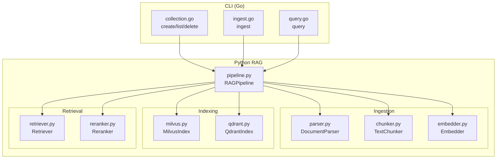
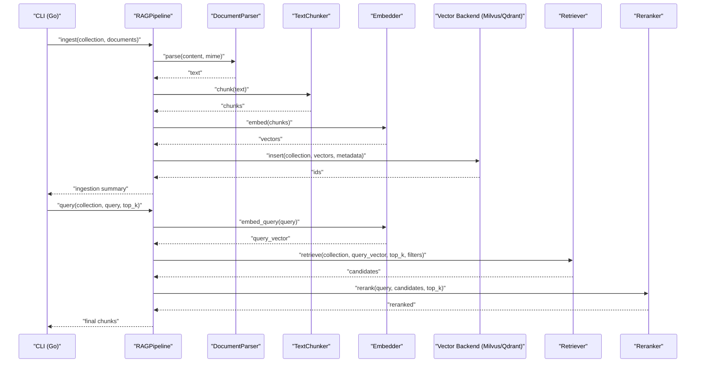
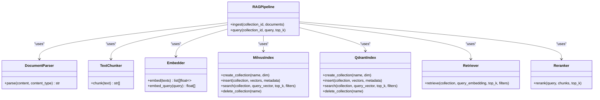

# Pipeline Architecture

<cite>
**Referenced Files in This Document**
- [pipeline.py](file://python/src/resolvenet/rag/pipeline.py)
- [milvus.py](file://python/src/resolvenet/rag/index/milvus.py)
- [qdrant.py](file://python/src/resolvenet/rag/index/qdrant.py)
- [chunker.py](file://python/src/resolvenet/rag/ingest/chunker.py)
- [embedder.py](file://python/src/resolvenet/rag/ingest/embedder.py)
- [parser.py](file://python/src/resolvenet/rag/ingest/parser.py)
- [retriever.py](file://python/src/resolvenet/rag/retrieve/retriever.py)
- [reranker.py](file://python/src/resolvenet/rag/retrieve/reranker.py)
- [ingest.go](file://internal/cli/rag/ingest.go)
- [query.go](file://internal/cli/rag/query.go)
- [collection.go](file://internal/cli/rag/collection.go)
</cite>

## Table of Contents
1. [Introduction](#introduction)
2. [Project Structure](#project-structure)
3. [Core Components](#core-components)
4. [Architecture Overview](#architecture-overview)
5. [Detailed Component Analysis](#detailed-component-analysis)
6. [Dependency Analysis](#dependency-analysis)
7. [Performance Considerations](#performance-considerations)
8. [Troubleshooting Guide](#troubleshooting-guide)
9. [Conclusion](#conclusion)

## Introduction
This document describes the Retrieval-Augmented Generation (RAG) Pipeline architecture in the resolve-net project. It explains the end-to-end workflow from document ingestion to final response generation, details the four main stages, and documents initialization, configuration, asynchronous execution, error handling, extensibility, and performance considerations. The pipeline is organized around a Python-based orchestration layer with pluggable ingestion, indexing, retrieval, and reranking components, and integrates with Go-based CLI commands for collection and ingestion operations.

## Project Structure
The RAG pipeline spans Python modules under the resolvenet package and Go CLI commands under internal/cli/rag. The Python modules implement:
- Orchestration: RAGPipeline
- Ingestion: parser, chunker, embedder
- Indexing: MilvusIndex, QdrantIndex
- Retrieval: Retriever, Reranker

The Go CLI provides commands to manage collections and trigger ingestion and queries.

**Diagram sources**
- [collection.go:10-31](file://internal/cli/rag/collection.go#L10-L31)
- [ingest.go:9-27](file://internal/cli/rag/ingest.go#L9-L27)
- [query.go:9-29](file://internal/cli/rag/query.go#L9-L29)
- [pipeline.py:11-75](file://python/src/resolvenet/rag/pipeline.py#L11-L75)
- [parser.py:8-49](file://python/src/resolvenet/rag/ingest/parser.py#L8-L49)
- [chunker.py:6-73](file://python/src/resolvenet/rag/ingest/chunker.py#L6-L73)
- [embedder.py:11-49](file://python/src/resolvenet/rag/ingest/embedder.py#L11-L49)
- [milvus.py:11-54](file://python/src/resolvenet/rag/index/milvus.py#L11-L54)
- [qdrant.py:11-52](file://python/src/resolvenet/rag/index/qdrant.py#L11-L52)
- [retriever.py:11-42](file://python/src/resolvenet/rag/retrieve/retriever.py#L11-L42)
- [reranker.py:11-41](file://python/src/resolvenet/rag/retrieve/reranker.py#L11-L41)

**Section sources**
- [pipeline.py:11-75](file://python/src/resolvenet/rag/pipeline.py#L11-L75)
- [collection.go:10-31](file://internal/cli/rag/collection.go#L10-L31)
- [ingest.go:9-27](file://internal/cli/rag/ingest.go#L9-L27)
- [query.go:9-29](file://internal/cli/rag/query.go#L9-L29)

## Core Components
- RAGPipeline orchestrates the end-to-end workflow. It exposes async ingest and query methods and holds configuration for embedding model and vector backend selection.
- DocumentParser extracts text from supported content types.
- TextChunker splits text into overlapping chunks using configurable strategies.
- Embedder generates dense vector embeddings for chunks and queries.
- MilvusIndex and QdrantIndex provide vector storage and similarity search.
- Retriever performs vector search against a chosen backend.
- Reranker applies cross-encoder reranking to refine results.

Key configuration options:
- Embedding model selection for the Embedder component.
- Vector backend selection for Milvus or Qdrant.
- Chunking strategy and size/overlap for TextChunker.
- Collection creation flags expose embedding model and chunk strategy for new collections.

**Section sources**
- [pipeline.py:20-27](file://python/src/resolvenet/rag/pipeline.py#L20-L27)
- [embedder.py:20-21](file://python/src/resolvenet/rag/ingest/embedder.py#L20-L21)
- [milvus.py:18-21](file://python/src/resolvenet/rag/index/milvus.py#L18-L21)
- [qdrant.py:18-21](file://python/src/resolvenet/rag/index/qdrant.py#L18-L21)
- [chunker.py:15-23](file://python/src/resolvenet/rag/ingest/chunker.py#L15-L23)
- [collection.go:46-47](file://internal/cli/rag/collection.go#L46-L47)

## Architecture Overview
The pipeline follows an asynchronous, modular design:
- CLI commands delegate to the Python RAG pipeline.
- Ingestion stage parses raw content, chunks text, embeds chunks, and inserts vectors into the selected vector backend.
- Retrieval stage embeds the query, performs vector search, and optionally reranks results.
- Augmented generation is orchestrated by the caller (e.g., an LLM service) using retrieved context.

**Diagram sources**
- [pipeline.py:28-75](file://python/src/resolvenet/rag/pipeline.py#L28-L75)
- [parser.py:21-32](file://python/src/resolvenet/rag/ingest/parser.py#L21-L32)
- [chunker.py:25-73](file://python/src/resolvenet/rag/ingest/chunker.py#L25-L73)
- [embedder.py:23-48](file://python/src/resolvenet/rag/ingest/embedder.py#L23-L48)
- [milvus.py:23-54](file://python/src/resolvenet/rag/index/milvus.py#L23-L54)
- [qdrant.py:22-52](file://python/src/resolvenet/rag/index/qdrant.py#L22-L52)
- [retriever.py:21-41](file://python/src/resolvenet/rag/retrieve/retriever.py#L21-L41)
- [reranker.py:21-40](file://python/src/resolvenet/rag/retrieve/reranker.py#L21-L40)
- [ingest.go:13-19](file://internal/cli/rag/ingest.go#L13-L19)
- [query.go:14-21](file://internal/cli/rag/query.go#L14-L21)

## Detailed Component Analysis

### RAGPipeline Orchestration
- Initialization accepts embedding_model and vector_backend identifiers.
- ingest(collection_id, documents) logs and returns placeholders; the full pipeline is marked as TODO in the implementation.
- query(collection_id, query, top_k) logs and returns empty results; the full retrieval pipeline is marked as TODO.

Extensibility:
- Add concrete ingestion steps (parse → chunk → embed → index) and retrieval steps (embed query → search → rerank) by implementing missing logic in the pipeline methods.

Asynchronous execution:
- Methods are declared async, enabling non-blocking IO during embedding and vector operations.

Error handling:
- Current implementation logs informational messages and returns placeholder results; production-grade handling should capture exceptions and propagate structured errors.

**Section sources**
- [pipeline.py:11-75](file://python/src/resolvenet/rag/pipeline.py#L11-L75)

### Document Parsing
- Supported content types include plain text, markdown, HTML, and PDF.
- The parser selects a method based on content type and falls back to text parsing for unsupported types.
- HTML and PDF parsing are currently marked as TODO.

**Section sources**
- [parser.py:8-49](file://python/src/resolvenet/rag/ingest/parser.py#L8-L49)

### Text Chunking
- Strategies include fixed-size chunks with overlap, sentence-based segmentation, and a placeholder for semantic chunking.
- Sentence-based chunking aggregates sentences until a size threshold is reached, maintaining grammatical boundaries.

**Section sources**
- [chunker.py:6-73](file://python/src/resolvenet/rag/ingest/chunker.py#L6-L73)

### Embedding Generation
- Embedder initializes with a model identifier and generates embeddings for lists of texts and single queries.
- The implementation logs and returns placeholder vectors; production requires integrating with an embedding API or local model.

**Section sources**
- [embedder.py:11-49](file://python/src/resolvenet/rag/ingest/embedder.py#L11-L49)

### Vector Backends (Indexing)
- MilvusIndex and QdrantIndex define async interfaces for collection lifecycle and vector operations.
- Both support creating/deleting collections, inserting vectors with metadata, and searching with optional filters.
- Implementations are marked as TODO pending integration with respective clients.

**Section sources**
- [milvus.py:11-54](file://python/src/resolvenet/rag/index/milvus.py#L11-L54)
- [qdrant.py:11-52](file://python/src/resolvenet/rag/index/qdrant.py#L11-L52)

### Retrieval and Reranking
- Retriever accepts a query embedding and retrieves candidate chunks from the configured vector backend.
- Reranker applies cross-encoder reranking to improve precision, returning top-k results.

**Section sources**
- [retriever.py:11-42](file://python/src/resolvenet/rag/retrieve/retriever.py#L11-L42)
- [reranker.py:11-41](file://python/src/resolvenet/rag/retrieve/reranker.py#L11-L41)

### CLI Integration
- collection subcommands create, list, and delete collections; creation flags include embedding model and chunk strategy.
- ingest triggers ingestion from a path into a target collection.
- query executes a semantic search against a collection with configurable top-k.

**Section sources**
- [collection.go:33-80](file://internal/cli/rag/collection.go#L33-L80)
- [ingest.go:9-27](file://internal/cli/rag/ingest.go#L9-L27)
- [query.go:9-29](file://internal/cli/rag/query.go#L9-L29)

## Dependency Analysis
The pipeline composes ingestion, indexing, retrieval, and reranking components. The RAGPipeline depends on:
- Parser for content extraction
- Chunker for segmentation
- Embedder for dense vectors
- Vector backend (Milvus or Qdrant) for storage and search
- Retriever for vector search
- Reranker for cross-encoder refinement

**Diagram sources**
- [pipeline.py:11-75](file://python/src/resolvenet/rag/pipeline.py#L11-L75)
- [parser.py:8-49](file://python/src/resolvenet/rag/ingest/parser.py#L8-L49)
- [chunker.py:6-73](file://python/src/resolvenet/rag/ingest/chunker.py#L6-L73)
- [embedder.py:11-49](file://python/src/resolvenet/rag/ingest/embedder.py#L11-L49)
- [milvus.py:11-54](file://python/src/resolvenet/rag/index/milvus.py#L11-L54)
- [qdrant.py:11-52](file://python/src/resolvenet/rag/index/qdrant.py#L11-L52)
- [retriever.py:11-42](file://python/src/resolvenet/rag/retrieve/retriever.py#L11-L42)
- [reranker.py:11-41](file://python/src/resolvenet/rag/retrieve/reranker.py#L11-L41)

## Performance Considerations
- Asynchronous design: All major operations (embedding, vector insert/search, reranking) are async, enabling concurrency and reduced latency under I/O-bound workloads.
- Batch embeddings: Prefer batching chunk embeddings to reduce overhead and leverage vectorized operations.
- Chunking strategy: Sentence-based chunking balances semantic coherence and size; tune chunk_size and chunk_overlap to balance recall and context length.
- Vector backend selection: Choose Milvus or Qdrant based on deployment needs; ensure proper indexing parameters and resource allocation.
- Reranking cost: Cross-encoder reranking improves accuracy at higher latency; limit rerank top_k to reduce compute.
- Memory management: Stream large document sets through chunking and pagination; avoid loading entire corpora into memory.
- Scalability: Horizontal scaling of vector databases and embedding services; consider sharding and caching strategies for high-throughput deployments.

## Troubleshooting Guide
Common issues and mitigations:
- Missing vector backend integration: Implement Milvus/Qdrant client calls in the index components to enable insert/search operations.
- Empty retrieval results: Verify collection creation, successful vector insertion, and correct query embedding dimensionality.
- Slow reranking: Reduce top_k for rerank or pre-filter candidates using metadata filters.
- Parser failures: Ensure content_type matches supported types; implement HTML/PDF parsing to expand coverage.
- CLI command stubs: Complete CLI commands to call the Python pipeline and surface errors to users.

**Section sources**
- [milvus.py:23-54](file://python/src/resolvenet/rag/index/milvus.py#L23-L54)
- [qdrant.py:22-52](file://python/src/resolvenet/rag/index/qdrant.py#L22-L52)
- [reranker.py:21-40](file://python/src/resolvenet/rag/retrieve/reranker.py#L21-L40)
- [parser.py:21-32](file://python/src/resolvenet/rag/ingest/parser.py#L21-L32)
- [ingest.go:13-19](file://internal/cli/rag/ingest.go#L13-L19)
- [query.go:14-21](file://internal/cli/rag/query.go#L14-L21)

## Conclusion
The RAG Pipeline architecture in resolve-net provides a modular, asynchronous foundation for ingestion, indexing, retrieval, and reranking. While many components are currently placeholders, the design cleanly separates concerns and exposes clear extension points. By implementing the missing ingestion and retrieval logic, integrating vector backends, and optimizing chunking and reranking, the system can achieve robust, scalable, and high-performance retrieval-augmented generation.