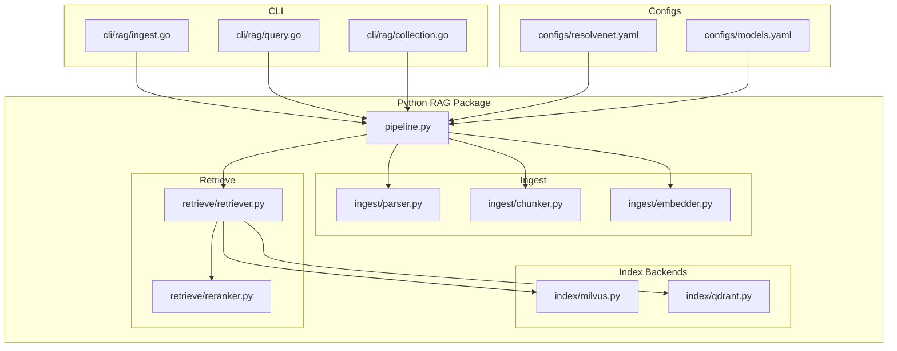
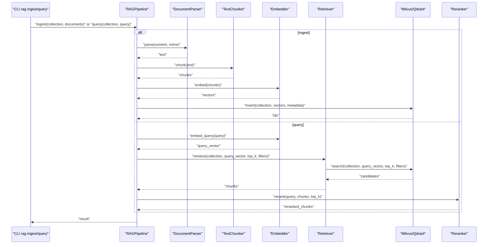
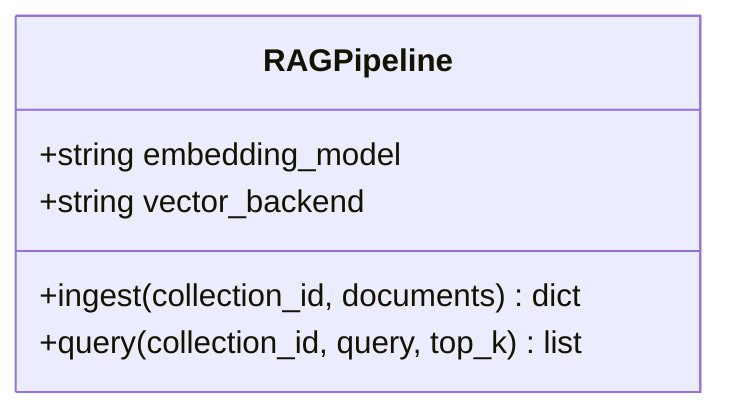
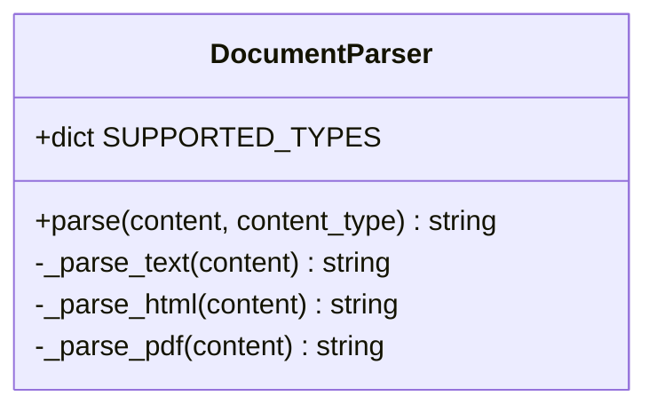
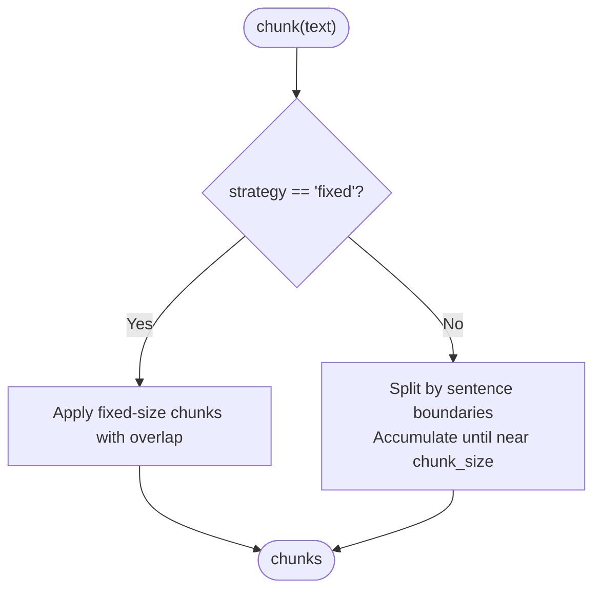
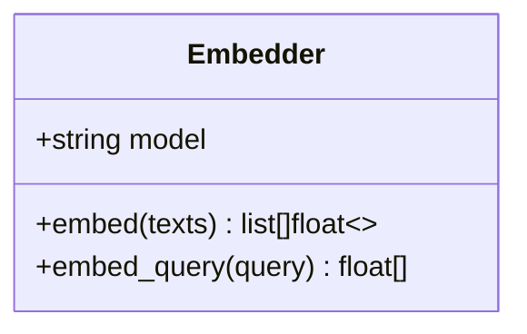
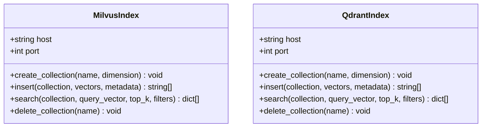
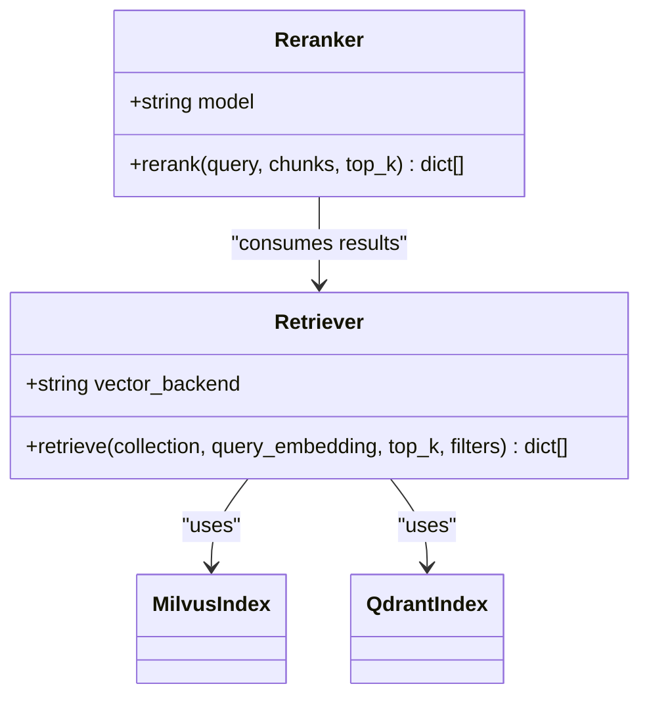
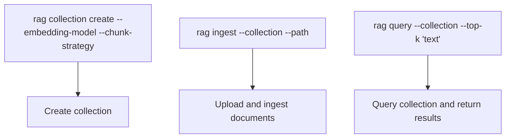
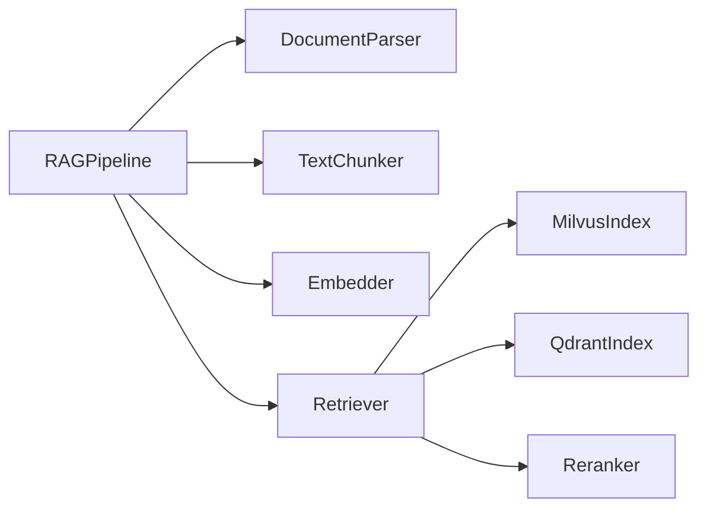

# RAG Pipeline

<cite>
**Referenced Files in This Document**
- [pipeline.py](file://python/src/resolvenet/rag/pipeline.py)
- [parser.py](file://python/src/resolvenet/rag/ingest/parser.py)
- [chunker.py](file://python/src/resolvenet/rag/ingest/chunker.py)
- [embedder.py](file://python/src/resolvenet/rag/ingest/embedder.py)
- [milvus.py](file://python/src/resolvenet/rag/index/milvus.py)
- [qdrant.py](file://python/src/resolvenet/rag/index/qdrant.py)
- [retriever.py](file://python/src/resolvenet/rag/retrieve/retriever.py)
- [reranker.py](file://python/src/resolvenet/rag/retrieve/reranker.py)
- [ingest.go](file://internal/cli/rag/ingest.go)
- [query.go](file://internal/cli/rag/query.go)
- [collection.go](file://internal/cli/rag/collection.go)
- [resolvenet.yaml](file://configs/resolvenet.yaml)
- [models.yaml](file://configs/models.yaml)
- [test_rag_pipeline.py](file://python/tests/unit/test_rag_pipeline.py)
</cite>

## Table of Contents
1. [Introduction](#introduction)
2. [Project Structure](#project-structure)
3. [Core Components](#core-components)
4. [Architecture Overview](#architecture-overview)
5. [Detailed Component Analysis](#detailed-component-analysis)
6. [Dependency Analysis](#dependency-analysis)
7. [Performance Considerations](#performance-considerations)
8. [Troubleshooting Guide](#troubleshooting-guide)
9. [Conclusion](#conclusion)
10. [Appendices](#appendices)

## Introduction
This document describes the Retrieval-Augmented Generation (RAG) Pipeline implemented in the repository. It covers the end-to-end flow from document ingestion through final response generation, including parsing, chunking, embedding, vector indexing, semantic retrieval, and reranking. It also outlines configuration options, performance tuning guidelines, and troubleshooting strategies for ingestion and retrieval tasks.

## Project Structure
The RAG implementation is primarily located under the Python package resolvenet/rag, with supporting CLI commands under internal/cli/rag and configuration files under configs.

**Diagram sources**
- [pipeline.py:11-75](file://python/src/resolvenet/rag/pipeline.py#L11-L75)
- [parser.py:8-49](file://python/src/resolvenet/rag/ingest/parser.py#L8-L49)
- [chunker.py:6-73](file://python/src/resolvenet/rag/ingest/chunker.py#L6-L73)
- [embedder.py:11-49](file://python/src/resolvenet/rag/ingest/embedder.py#L11-L49)
- [milvus.py:11-54](file://python/src/resolvenet/rag/index/milvus.py#L11-L54)
- [qdrant.py:11-52](file://python/src/resolvenet/rag/index/qdrant.py#L11-L52)
- [retriever.py:11-42](file://python/src/resolvenet/rag/retrieve/retriever.py#L11-L42)
- [reranker.py:11-41](file://python/src/resolvenet/rag/retrieve/reranker.py#L11-L41)
- [ingest.go:9-28](file://internal/cli/rag/ingest.go#L9-L28)
- [query.go:9-30](file://internal/cli/rag/query.go#L9-L30)
- [collection.go:9-80](file://internal/cli/rag/collection.go#L9-L80)
- [resolvenet.yaml:1-34](file://configs/resolvenet.yaml#L1-L34)
- [models.yaml:1-31](file://configs/models.yaml#L1-L31)

**Section sources**
- [pipeline.py:11-75](file://python/src/resolvenet/rag/pipeline.py#L11-L75)
- [resolvenet.yaml:1-34](file://configs/resolvenet.yaml#L1-L34)
- [models.yaml:1-31](file://configs/models.yaml#L1-L31)

## Core Components
- RAGPipeline orchestrates ingestion, indexing, retrieval, and generation. It exposes async ingest and query methods and holds configuration for embedding model and vector backend selection.
- DocumentParser extracts text from supported MIME types (plain text, markdown, HTML, PDF).
- TextChunker applies configurable chunking strategies (fixed-size with overlap, sentence-based).
- Embedder generates dense vectors for chunks and queries using a pluggable model interface.
- MilvusIndex and QdrantIndex provide asynchronous vector storage interfaces for collection creation, insertion, search, and deletion.
- Retriever performs vector search against the selected backend and supports optional metadata filters.
- Reranker improves final relevance using a cross-encoder model as a second-pass ranking step.
- CLI commands rag collection, rag ingest, and rag query expose operational controls for collection lifecycle, ingestion, and querying.

**Section sources**
- [pipeline.py:11-75](file://python/src/resolvenet/rag/pipeline.py#L11-L75)
- [parser.py:8-49](file://python/src/resolvenet/rag/ingest/parser.py#L8-L49)
- [chunker.py:6-73](file://python/src/resolvenet/rag/ingest/chunker.py#L6-L73)
- [embedder.py:11-49](file://python/src/resolvenet/rag/ingest/embedder.py#L11-L49)
- [milvus.py:11-54](file://python/src/resolvenet/rag/index/milvus.py#L11-L54)
- [qdrant.py:11-52](file://python/src/resolvenet/rag/index/qdrant.py#L11-L52)
- [retriever.py:11-42](file://python/src/resolvenet/rag/retrieve/retriever.py#L11-L42)
- [reranker.py:11-41](file://python/src/resolvenet/rag/retrieve/reranker.py#L11-L41)
- [ingest.go:9-28](file://internal/cli/rag/ingest.go#L9-L28)
- [query.go:9-30](file://internal/cli/rag/query.go#L9-L30)
- [collection.go:9-80](file://internal/cli/rag/collection.go#L9-L80)

## Architecture Overview
The RAG pipeline follows a modular, asynchronous design. At a high level:
- Ingestion: Parse raw content, split into chunks, embed chunks, and index vectors with metadata.
- Retrieval: Embed the query, search the vector store, and rerank results.
- Generation: Inject top-ranked chunks into an LLM prompt to produce a final response.

**Diagram sources**
- [pipeline.py:28-75](file://python/src/resolvenet/rag/pipeline.py#L28-L75)
- [parser.py:21-32](file://python/src/resolvenet/rag/ingest/parser.py#L21-L32)
- [chunker.py:25-39](file://python/src/resolvenet/rag/ingest/chunker.py#L25-L39)
- [embedder.py:23-48](file://python/src/resolvenet/rag/ingest/embedder.py#L23-L48)
- [retriever.py:21-41](file://python/src/resolvenet/rag/retrieve/retriever.py#L21-L41)
- [milvus.py:23-48](file://python/src/resolvenet/rag/index/milvus.py#L23-L48)
- [qdrant.py:22-47](file://python/src/resolvenet/rag/index/qdrant.py#L22-L47)
- [reranker.py:21-40](file://python/src/resolvenet/rag/retrieve/reranker.py#L21-L40)

## Detailed Component Analysis

### RAGPipeline Orchestration
- Responsibilities:
  - Ingest: Accepts document batches and returns processing stats.
  - Query: Embeds the query, retrieves candidates, and reranks results.
- Configuration:
  - embedding_model: Selects the embedder model identifier.
  - vector_backend: Selects Milvus or Qdrant.
- Extensibility:
  - Methods are async to support IO-bound steps (vector DB, embedding API).
  - Logging provides observability for ingestion and querying.

**Diagram sources**
- [pipeline.py:20-75](file://python/src/resolvenet/rag/pipeline.py#L20-L75)

**Section sources**
- [pipeline.py:11-75](file://python/src/resolvenet/rag/pipeline.py#L11-L75)

### Document Parsing System
- Supported types: text/plain, text/markdown, text/html, application/pdf.
- Behavior:
  - Dispatches to a parser method based on content-type.
  - Plain text/markdown passthrough.
  - HTML and PDF are placeholders for future implementations.
- Notes:
  - Future implementations may leverage libraries such as beautifulsoup4 for HTML and pdfplumber for PDF.

**Diagram sources**
- [parser.py:8-49](file://python/src/resolvenet/rag/ingest/parser.py#L8-L49)

**Section sources**
- [parser.py:8-49](file://python/src/resolvenet/rag/ingest/parser.py#L8-L49)

### Chunking Strategies
- Strategies:
  - fixed: Fixed-length chunks with configurable overlap.
  - sentence: Sentence boundary splitting with rolling window to respect size limits.
- Parameters:
  - strategy: "fixed" or "sentence".
  - chunk_size: Target size per chunk.
  - chunk_overlap: Overlap between adjacent chunks.
- Complexity:
  - Linear in input length for both strategies.
- Tests:
  - Unit tests validate fixed and sentence chunking behavior.

**Diagram sources**
- [chunker.py:25-73](file://python/src/resolvenet/rag/ingest/chunker.py#L25-L73)

**Section sources**
- [chunker.py:6-73](file://python/src/resolvenet/rag/ingest/chunker.py#L6-L73)
- [test_rag_pipeline.py:6-19](file://python/tests/unit/test_rag_pipeline.py#L6-L19)

### Embedding System
- Model support:
  - BGE (BAAI General Embedding) variants (e.g., bge-large-zh).
  - text2vec Chinese embeddings.
  - OpenAI-compatible embedding APIs.
- Interface:
  - embed(texts): batch embeddings.
  - embed_query(query): single query embedding.
- Dimensionality:
  - Placeholder returns a fixed dimension (e.g., 1024) for BGE-large; production would align with the chosen model.
- Integration:
  - Embeddings are consumed by vector backends and retrievers.

**Diagram sources**
- [embedder.py:11-49](file://python/src/resolvenet/rag/ingest/embedder.py#L11-L49)

**Section sources**
- [embedder.py:11-49](file://python/src/resolvenet/rag/ingest/embedder.py#L11-L49)

### Vector Indexing Backends
- MilvusIndex:
  - create_collection(name, dimension)
  - insert(collection, vectors, metadata)
  - search(collection, query_vector, top_k, filters)
  - delete_collection(name)
- QdrantIndex:
  - create_collection(name, dimension)
  - insert(collection, vectors, metadata)
  - search(collection, query_vector, top_k, filters)
  - delete_collection(name)
- Both backends are designed for asynchronous operations and logging.

**Diagram sources**
- [milvus.py:11-54](file://python/src/resolvenet/rag/index/milvus.py#L11-L54)
- [qdrant.py:11-52](file://python/src/resolvenet/rag/index/qdrant.py#L11-L52)

**Section sources**
- [milvus.py:11-54](file://python/src/resolvenet/rag/index/milvus.py#L11-L54)
- [qdrant.py:11-52](file://python/src/resolvenet/rag/index/qdrant.py#L11-L52)

### Semantic Retrieval and Reranking
- Retriever:
  - retrieve(collection, query_embedding, top_k, filters)
  - Delegates to the configured vector backend.
- Reranker:
  - rerank(query, chunks, top_k)
  - Applies cross-encoder reranking as a second pass to improve precision.
- Hybrid retrieval:
  - Combines dense vector search with metadata filters.

**Diagram sources**
- [retriever.py:11-42](file://python/src/resolvenet/rag/retrieve/retriever.py#L11-L42)
- [reranker.py:11-41](file://python/src/resolvenet/rag/retrieve/reranker.py#L11-L41)
- [milvus.py:11-54](file://python/src/resolvenet/rag/index/milvus.py#L11-L54)
- [qdrant.py:11-52](file://python/src/resolvenet/rag/index/qdrant.py#L11-L52)

**Section sources**
- [retriever.py:11-42](file://python/src/resolvenet/rag/retrieve/retriever.py#L11-L42)
- [reranker.py:11-41](file://python/src/resolvenet/rag/retrieve/reranker.py#L11-L41)

### CLI Commands for RAG Operations
- rag collection:
  - create: Creates a collection with flags for embedding model and chunk strategy.
  - list: Lists collections.
  - delete: Deletes a collection.
- rag ingest:
  - Ingests documents into a collection from a path.
- rag query:
  - Queries a collection with a given text and top-k count.

**Diagram sources**
- [collection.go:33-80](file://internal/cli/rag/collection.go#L33-L80)
- [ingest.go:9-28](file://internal/cli/rag/ingest.go#L9-L28)
- [query.go:9-30](file://internal/cli/rag/query.go#L9-L30)

**Section sources**
- [collection.go:9-80](file://internal/cli/rag/collection.go#L9-L80)
- [ingest.go:9-28](file://internal/cli/rag/ingest.go#L9-L28)
- [query.go:9-30](file://internal/cli/rag/query.go#L9-L30)

## Dependency Analysis
- Cohesion:
  - Each module encapsulates a distinct stage: parsing, chunking, embedding, indexing, retrieval, reranking.
- Coupling:
  - RAGPipeline depends on parser, chunker, embedder, retriever, and reranker.
  - Retriever depends on MilvusIndex or QdrantIndex.
  - Embedder is a black box for now; production would integrate with an embedding API.
- External integrations:
  - Vector backends (Milvus, Qdrant) are currently placeholders awaiting implementation.
  - Embedding calls are placeholders and should route through the gateway or provider SDKs.

**Diagram sources**
- [pipeline.py:11-75](file://python/src/resolvenet/rag/pipeline.py#L11-L75)
- [parser.py:8-49](file://python/src/resolvenet/rag/ingest/parser.py#L8-L49)
- [chunker.py:6-73](file://python/src/resolvenet/rag/ingest/chunker.py#L6-L73)
- [embedder.py:11-49](file://python/src/resolvenet/rag/ingest/embedder.py#L11-L49)
- [retriever.py:11-42](file://python/src/resolvenet/rag/retrieve/retriever.py#L11-L42)
- [milvus.py:11-54](file://python/src/resolvenet/rag/index/milvus.py#L11-L54)
- [qdrant.py:11-52](file://python/src/resolvenet/rag/index/qdrant.py#L11-L52)
- [reranker.py:11-41](file://python/src/resolvenet/rag/retrieve/reranker.py#L11-L41)

**Section sources**
- [pipeline.py:11-75](file://python/src/resolvenet/rag/pipeline.py#L11-L75)
- [retriever.py:11-42](file://python/src/resolvenet/rag/retrieve/retriever.py#L11-L42)
- [milvus.py:11-54](file://python/src/resolvenet/rag/index/milvus.py#L11-L54)
- [qdrant.py:11-52](file://python/src/resolvenet/rag/index/qdrant.py#L11-L52)

## Performance Considerations
- Chunking
  - Choose sentence-based chunking for semantic coherence; adjust chunk_size to balance recall and context length for downstream LLMs.
  - Use moderate overlap to preserve sentence-local context across boundaries.
- Embedding
  - Align embedding model dimensionality with the vector backend’s expectations.
  - Batch embed texts to reduce overhead; avoid per-token calls.
- Vector Search
  - Tune top_k to balance precision and latency; larger k increases reranker cost.
  - Use metadata filters to reduce candidate sets early.
- Reranking
  - Apply reranking only to the top-k candidates to limit compute.
  - Prefer cross-encoder rerankers judiciously due to higher latency.
- Backend Selection
  - Milvus and Qdrant offer different strengths; select based on deployment needs (e.g., filtering, payload management).
- Throughput
  - Asynchronous design enables concurrent operations; ensure embedding and vector DB clients are configured for concurrency.

[No sources needed since this section provides general guidance]

## Troubleshooting Guide
- Ingestion Issues
  - Unsupported content-type: Ensure content_type matches supported types; otherwise, fallback to text parsing.
  - Empty or minimal chunks: Adjust chunk_size and overlap; verify sentence splitter behavior.
  - Missing embeddings: Confirm embedding model configuration and connectivity to the embedding provider.
- Retrieval Issues
  - No results: Increase top_k or relax filters; verify collection exists and contains indexed vectors.
  - Low relevance: Enable reranking; consider switching to a stronger cross-encoder model.
  - Backend connectivity: Verify host/port configuration and network access to Milvus or Qdrant.
- CLI Operations
  - Missing required flags: collection is mandatory for ingest and query; ensure flags are set.
  - Empty collection listing: Confirm collection creation and indexing steps were executed.

**Section sources**
- [parser.py:14-32](file://python/src/resolvenet/rag/ingest/parser.py#L14-L32)
- [chunker.py:15-23](file://python/src/resolvenet/rag/ingest/chunker.py#L15-L23)
- [embedder.py:20-21](file://python/src/resolvenet/rag/ingest/embedder.py#L20-L21)
- [milvus.py:18-21](file://python/src/resolvenet/rag/index/milvus.py#L18-L21)
- [qdrant.py:18-21](file://python/src/resolvenet/rag/index/qdrant.py#L18-L21)
- [ingest.go:22-25](file://internal/cli/rag/ingest.go#L22-L25)
- [query.go:24-26](file://internal/cli/rag/query.go#L24-L26)

## Conclusion
The RAG Pipeline provides a modular, extensible foundation for ingestion, retrieval, and generation. While several components are placeholders for external integrations (parsing, embedding, vector backends), the architecture clearly separates concerns and supports asynchronous operations. By tuning chunking, embedding, and retrieval parameters, and by leveraging reranking, teams can achieve strong retrieval performance across diverse document collections.

[No sources needed since this section summarizes without analyzing specific files]

## Appendices

### Configuration Examples and Tuning Guidelines
- Platform and Runtime
  - Configure server addresses, database, Redis, NATS, and telemetry in the platform configuration file.
  - Reference: [resolvenet.yaml:1-34](file://configs/resolvenet.yaml#L1-L34)
- LLM Models
  - Define model registry entries for providers and defaults.
  - Reference: [models.yaml:1-31](file://configs/models.yaml#L1-L31)
- RAG Collection Creation
  - Use CLI to create collections with desired embedding model and chunking strategy.
  - Reference: [collection.go:33-49](file://internal/cli/rag/collection.go#L33-L49)
- Ingestion and Query CLI
  - Use rag ingest and rag query to operate the pipeline from the command line.
  - References:
    - [ingest.go:9-28](file://internal/cli/rag/ingest.go#L9-L28)
    - [query.go:9-30](file://internal/cli/rag/query.go#L9-L30)

**Section sources**
- [resolvenet.yaml:1-34](file://configs/resolvenet.yaml#L1-L34)
- [models.yaml:1-31](file://configs/models.yaml#L1-L31)
- [collection.go:33-49](file://internal/cli/rag/collection.go#L33-L49)
- [ingest.go:9-28](file://internal/cli/rag/ingest.go#L9-L28)
- [query.go:9-30](file://internal/cli/rag/query.go#L9-L30)