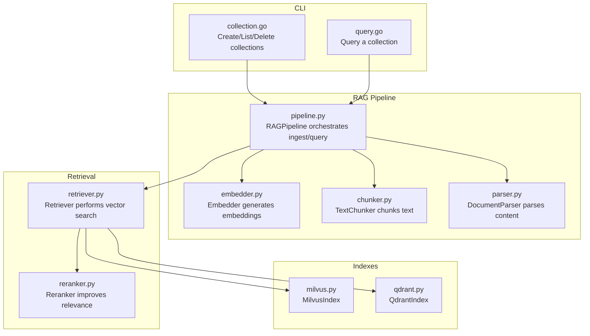
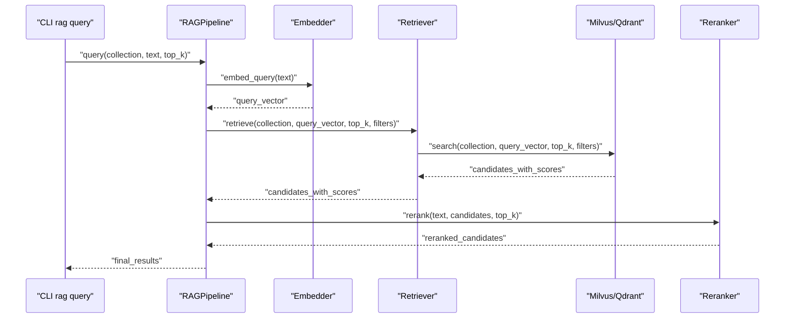
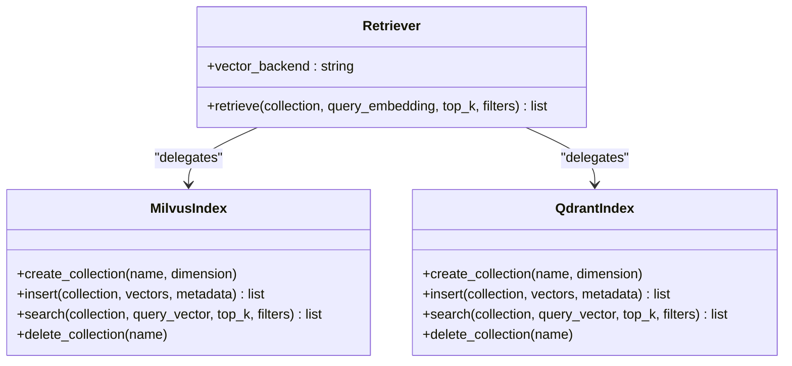
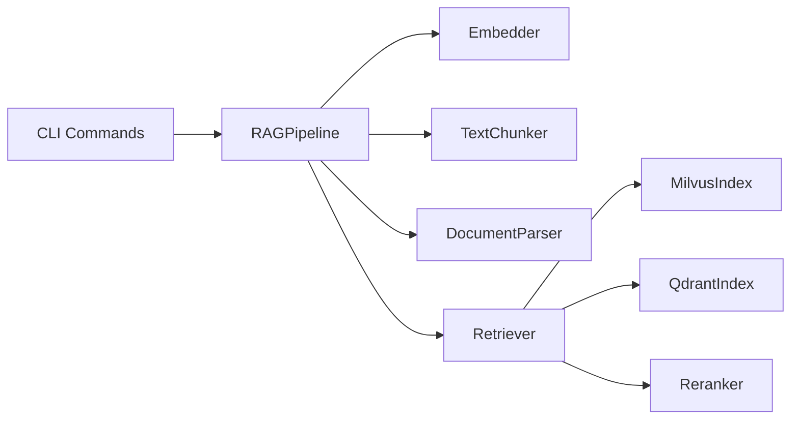

# Semantic Retrieval

<cite>
**Referenced Files in This Document**
- [pipeline.py](file://python/src/resolvenet/rag/pipeline.py)
- [retriever.py](file://python/src/resolvenet/rag/retrieve/retriever.py)
- [reranker.py](file://python/src/resolvenet/rag/retrieve/reranker.py)
- [milvus.py](file://python/src/resolvenet/rag/index/milvus.py)
- [qdrant.py](file://python/src/resolvenet/rag/index/qdrant.py)
- [embedder.py](file://python/src/resolvenet/rag/ingest/embedder.py)
- [chunker.py](file://python/src/resolvenet/rag/ingest/chunker.py)
- [parser.py](file://python/src/resolvenet/rag/ingest/parser.py)
- [collection.go](file://internal/cli/rag/collection.go)
- [query.go](file://internal/cli/rag/query.go)
- [resolvenet.yaml](file://configs/resolvenet.yaml)
- [models.yaml](file://configs/models.yaml)
</cite>

## Table of Contents
1. [Introduction](#introduction)
2. [Project Structure](#project-structure)
3. [Core Components](#core-components)
4. [Architecture Overview](#architecture-overview)
5. [Detailed Component Analysis](#detailed-component-analysis)
6. [Dependency Analysis](#dependency-analysis)
7. [Performance Considerations](#performance-considerations)
8. [Troubleshooting Guide](#troubleshooting-guide)
9. [Conclusion](#conclusion)
10. [Appendices](#appendices)

## Introduction
This document describes the semantic retrieval system implemented in the repository. It covers the end-to-end RAG pipeline, vector similarity search, distance metrics, the retriever’s role in embedding queries and searching the index, cross-encoder reranking, hybrid retrieval, configuration options, performance optimization strategies, and evaluation guidance. The system is designed around pluggable components for ingestion, indexing, retrieval, and reranking, with extensibility for vector backends such as Milvus and Qdrant.

## Project Structure
The semantic retrieval capability is primarily implemented in Python under the RAG module, with supporting ingestion, indexing, and retrieval components. CLI commands expose collection management and querying. Configuration files define runtime and model registries.

**Diagram sources**
- [collection.go:1-80](file://internal/cli/rag/collection.go#L1-L80)
- [query.go:1-30](file://internal/cli/rag/query.go#L1-L30)
- [pipeline.py:11-75](file://python/src/resolvenet/rag/pipeline.py#L11-L75)
- [embedder.py:11-49](file://python/src/resolvenet/rag/ingest/embedder.py#L11-L49)
- [chunker.py:6-73](file://python/src/resolvenet/rag/ingest/chunker.py#L6-L73)
- [parser.py:8-49](file://python/src/resolvenet/rag/ingest/parser.py#L8-L49)
- [retriever.py:11-42](file://python/src/resolvenet/rag/retrieve/retriever.py#L11-L42)
- [reranker.py:11-41](file://python/src/resolvenet/rag/retrieve/reranker.py#L11-L41)
- [milvus.py:11-54](file://python/src/resolvenet/rag/index/milvus.py#L11-L54)
- [qdrant.py:11-52](file://python/src/resolvenet/rag/index/qdrant.py#L11-L52)

**Section sources**
- [pipeline.py:11-75](file://python/src/resolvenet/rag/pipeline.py#L11-L75)
- [collection.go:9-31](file://internal/cli/rag/collection.go#L9-L31)
- [query.go:9-29](file://internal/cli/rag/query.go#L9-L29)

## Core Components
- RAGPipeline: Orchestrates ingestion and querying. It initializes embedding and index backend choices and exposes async ingest and query methods.
- Embedder: Generates dense vector embeddings for text chunks and queries using configurable models.
- TextChunker: Splits raw text into chunks using fixed-size, sentence-boundary, or fallback strategies.
- DocumentParser: Converts supported document formats into plain text.
- Retriever: Performs vector similarity search against a chosen backend (Milvus or Qdrant) with optional metadata filters.
- Reranker: Improves retrieval precision using a cross-encoder model on the initial candidates.
- MilvusIndex and QdrantIndex: Backends implementing collection creation, insertion, search, and deletion.

**Section sources**
- [pipeline.py:20-75](file://python/src/resolvenet/rag/pipeline.py#L20-L75)
- [embedder.py:11-49](file://python/src/resolvenet/rag/ingest/embedder.py#L11-L49)
- [chunker.py:6-73](file://python/src/resolvenet/rag/ingest/chunker.py#L6-L73)
- [parser.py:8-49](file://python/src/resolvenet/rag/ingest/parser.py#L8-L49)
- [retriever.py:11-42](file://python/src/resolvenet/rag/retrieve/retriever.py#L11-L42)
- [reranker.py:11-41](file://python/src/resolvenet/rag/retrieve/reranker.py#L11-L41)
- [milvus.py:11-54](file://python/src/resolvenet/rag/index/milvus.py#L11-L54)
- [qdrant.py:11-52](file://python/src/resolvenet/rag/index/qdrant.py#L11-L52)

## Architecture Overview
The semantic retrieval pipeline follows a staged process:
1. Ingestion: Parse documents, split into chunks, embed chunks, and insert into the vector index.
2. Query: Embed the user query, search the index for nearest neighbors, and rerank the results.
3. Hybrid retrieval: Optionally combine vector search with metadata filters.
4. Reranking: Apply a cross-encoder to refine relevance.

**Diagram sources**
- [query.go:14-21](file://internal/cli/rag/query.go#L14-L21)
- [pipeline.py:53-74](file://python/src/resolvenet/rag/pipeline.py#L53-L74)
- [embedder.py:38-49](file://python/src/resolvenet/rag/ingest/embedder.py#L38-L49)
- [retriever.py:21-41](file://python/src/resolvenet/rag/retrieve/retriever.py#L21-L41)
- [milvus.py:38-48](file://python/src/resolvenet/rag/index/milvus.py#L38-L48)
- [qdrant.py:37-47](file://python/src/resolvenet/rag/index/qdrant.py#L37-L47)
- [reranker.py:21-40](file://python/src/resolvenet/rag/retrieve/reranker.py#L21-L40)

## Detailed Component Analysis

### RAGPipeline
- Responsibilities: Orchestrate ingestion and querying; initialize embedding model and vector backend.
- Methods:
  - ingest(collection_id, documents): Processes documents and returns counts.
  - query(collection_id, query, top_k): Executes the full retrieval workflow.
- Notes: Current implementation contains placeholders; production-ready code will wire ingestion stages and retrieval chain.

**Section sources**
- [pipeline.py:20-75](file://python/src/resolvenet/rag/pipeline.py#L20-L75)

### Embedder
- Purpose: Generate dense embeddings for text chunks and queries.
- Configuration: Model selection via constructor argument.
- Behavior: Returns zero vectors as placeholders; production will call embedding APIs.

**Section sources**
- [embedder.py:11-49](file://python/src/resolvenet/rag/ingest/embedder.py#L11-L49)

### TextChunker
- Strategies: fixed-size with overlap, sentence boundary, and a fallback strategy.
- Parameters: strategy, chunk_size, chunk_overlap.
- Output: List of chunk strings.

**Section sources**
- [chunker.py:6-73](file://python/src/resolvenet/rag/ingest/chunker.py#L6-L73)

### DocumentParser
- Supported types: text/plain, text/markdown, text/html, application/pdf.
- Behavior: Dispatches to parser methods based on content type; placeholders for HTML/PDF parsing.

**Section sources**
- [parser.py:8-49](file://python/src/resolvenet/rag/ingest/parser.py#L8-L49)

### Retriever
- Role: Perform vector similarity search against a selected backend.
- Inputs: collection, query_embedding, top_k, filters.
- Hybrid support: Filters enable metadata-driven pruning prior to similarity search.
- Backend abstraction: Delegates to MilvusIndex or QdrantIndex.

**Diagram sources**
- [retriever.py:11-42](file://python/src/resolvenet/rag/retrieve/retriever.py#L11-L42)
- [milvus.py:11-54](file://python/src/resolvenet/rag/index/milvus.py#L11-L54)
- [qdrant.py:11-52](file://python/src/resolvenet/rag/index/qdrant.py#L11-L52)

**Section sources**
- [retriever.py:11-42](file://python/src/resolvenet/rag/retrieve/retriever.py#L11-L42)
- [milvus.py:11-54](file://python/src/resolvenet/rag/index/milvus.py#L11-L54)
- [qdrant.py:11-52](file://python/src/resolvenet/rag/index/qdrant.py#L11-L52)

### Reranker
- Purpose: Improve retrieval precision using a cross-encoder model on candidate chunks.
- Inputs: query, chunks, top_k.
- Behavior: Placeholder returns top_k unchanged; production will apply cross-encoder scoring.

**Section sources**
- [reranker.py:11-41](file://python/src/resolvenet/rag/retrieve/reranker.py#L11-L41)

### Vector Backends
- MilvusIndex: Manages collection lifecycle and vector search with optional filters.
- QdrantIndex: Rich filtering and payload management; mirrors MilvusIndex interface.

**Section sources**
- [milvus.py:11-54](file://python/src/resolvenet/rag/index/milvus.py#L11-L54)
- [qdrant.py:11-52](file://python/src/resolvenet/rag/index/qdrant.py#L11-L52)

### Hybrid Retrieval
- Combines dense vector search with metadata filters to narrow the candidate set before similarity computation.
- Filters are passed to the backend search method to leverage index capabilities.

**Section sources**
- [retriever.py:21-41](file://python/src/resolvenet/rag/retrieve/retriever.py#L21-L41)
- [milvus.py:38-48](file://python/src/resolvenet/rag/index/milvus.py#L38-L48)
- [qdrant.py:37-47](file://python/src/resolvenet/rag/index/qdrant.py#L37-L47)

### Distance Metrics and Similarity Search
- Implemented via vector backends: Milvus and Qdrant provide optimized similarity search on dense vectors.
- Distance metric defaults and configurations are controlled by the backend clients; the Python layer delegates search semantics to the backend.

**Section sources**
- [milvus.py:11-54](file://python/src/resolvenet/rag/index/milvus.py#L11-L54)
- [qdrant.py:11-52](file://python/src/resolvenet/rag/index/qdrant.py#L11-L52)

### Cross-Encoder Reranking
- Applies a cross-encoder model to re-score the top candidates returned by the vector search.
- Improves relevance by modeling query-chunk interactions contextually.

**Section sources**
- [reranker.py:11-41](file://python/src/resolvenet/rag/retrieve/reranker.py#L11-L41)

## Dependency Analysis
The retrieval system exhibits clear separation of concerns:
- CLI commands drive orchestration.
- RAGPipeline coordinates ingestion and querying.
- Embedder and chunker/parser form the ingestion stage.
- Retriever depends on Milvus or Qdrant for vector search.
- Reranker operates on the candidate set produced by Retriever.

**Diagram sources**
- [collection.go:1-80](file://internal/cli/rag/collection.go#L1-L80)
- [query.go:1-30](file://internal/cli/rag/query.go#L1-L30)
- [pipeline.py:11-75](file://python/src/resolvenet/rag/pipeline.py#L11-L75)
- [embedder.py:11-49](file://python/src/resolvenet/rag/ingest/embedder.py#L11-L49)
- [chunker.py:6-73](file://python/src/resolvenet/rag/ingest/chunker.py#L6-L73)
- [parser.py:8-49](file://python/src/resolvenet/rag/ingest/parser.py#L8-L49)
- [retriever.py:11-42](file://python/src/resolvenet/rag/retrieve/retriever.py#L11-L42)
- [milvus.py:11-54](file://python/src/resolvenet/rag/index/milvus.py#L11-L54)
- [qdrant.py:11-52](file://python/src/resolvenet/rag/index/qdrant.py#L11-L52)
- [reranker.py:11-41](file://python/src/resolvenet/rag/retrieve/reranker.py#L11-L41)

**Section sources**
- [pipeline.py:11-75](file://python/src/resolvenet/rag/pipeline.py#L11-L75)
- [retriever.py:11-42](file://python/src/resolvenet/rag/retrieve/retriever.py#L11-L42)
- [reranker.py:11-41](file://python/src/resolvenet/rag/retrieve/reranker.py#L11-L41)
- [milvus.py:11-54](file://python/src/resolvenet/rag/index/milvus.py#L11-L54)
- [qdrant.py:11-52](file://python/src/resolvenet/rag/index/qdrant.py#L11-L52)

## Performance Considerations
- Index pruning and maintenance:
  - Use metadata filters in Retriever to reduce the search space before similarity computation.
  - Periodically compact and optimize the vector index to maintain search performance.
- Caching strategies:
  - Cache frequent query embeddings and/or recent search results where applicable.
  - Cache cross-encoder reranking results for repeated queries on static corpora.
- Parallel processing:
  - Embedding generation and vector insertion can be parallelized across chunks.
  - Batch vector search requests to backends to amortize network overhead.
- Backend tuning:
  - Configure index parameters (e.g., number of beams for HNSW) per backend.
  - Adjust top_k for initial retrieval to balance recall and latency.
- Model inference:
  - Prefer bi-encoder for initial retrieval and reserve cross-encoder for reranking to minimize latency.

[No sources needed since this section provides general guidance]

## Troubleshooting Guide
- Empty results:
  - Verify collection exists and contains inserted vectors.
  - Confirm embedding dimension matches backend expectations.
- Slow queries:
  - Increase top_k for initial retrieval to capture stronger signals; rely on reranking to trim.
  - Enable metadata filters to constrain search scope.
- Misalignment between chunking and retrieval:
  - Adjust chunk_size and chunk_overlap to improve semantic coherence.
- Backend connectivity:
  - Ensure Milvus or Qdrant is reachable at configured host/port.
- CLI usage:
  - Provide required flags: collection ID and top-k value.

**Section sources**
- [milvus.py:18-21](file://python/src/resolvenet/rag/index/milvus.py#L18-L21)
- [qdrant.py:18-21](file://python/src/resolvenet/rag/index/qdrant.py#L18-L21)
- [query.go:14-26](file://internal/cli/rag/query.go#L14-L26)
- [collection.go:33-48](file://internal/cli/rag/collection.go#L33-L48)

## Conclusion
The semantic retrieval system is structured around a modular RAG pipeline with clear ingestion, indexing, retrieval, and reranking stages. While current implementations are placeholders, the architecture supports pluggable backends, hybrid retrieval, and cross-encoder reranking. By tuning chunking, embeddings, index parameters, and reranking, teams can achieve strong retrieval quality with controlled latency.

[No sources needed since this section summarizes without analyzing specific files]

## Appendices

### Configuration Options
- Runtime and services:
  - HTTP/gRPC addresses, database, Redis, NATS, runtime gRPC address, telemetry settings.
- Model registry:
  - Provider-specific model entries with token limits and default temperatures.
- CLI:
  - rag collection create supports embedding model and chunk strategy flags.

**Section sources**
- [resolvenet.yaml:3-34](file://configs/resolvenet.yaml#L3-L34)
- [models.yaml:3-31](file://configs/models.yaml#L3-L31)
- [collection.go:33-48](file://internal/cli/rag/collection.go#L33-L48)

### Evaluation Metrics and Baselines
- Recommended metrics:
  - Precision at k, Recall at k, Mean Reciprocal Rank, Normalized Discounted Cumulative Gain.
- Baseline comparison:
  - Compare bi-encoder only vs. bi-encoder + cross-encoder reranking.
  - Compare fixed vs. sentence chunking strategies.
- Measurement approach:
  - Use held-out query sets with human-annotated relevance judgments.
  - Track latency and throughput alongside accuracy.

[No sources needed since this section provides general guidance]