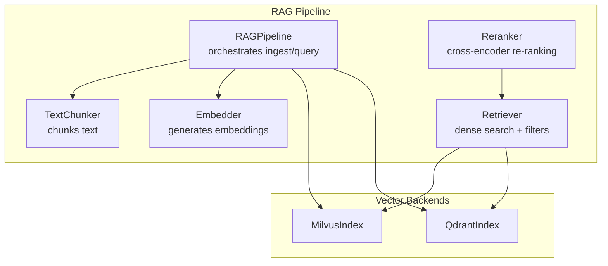
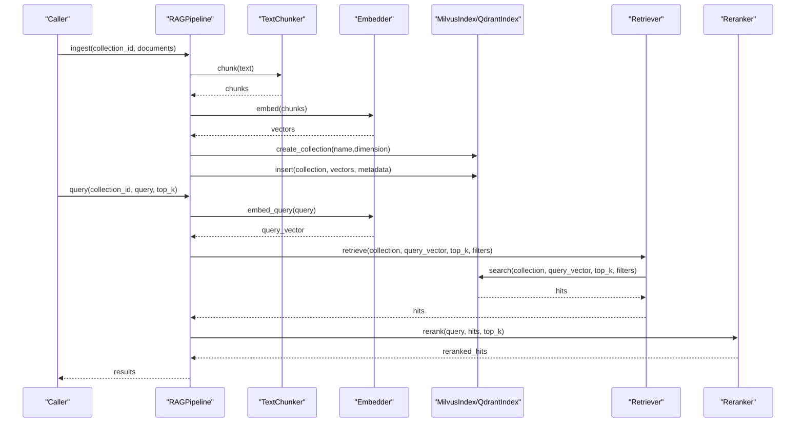
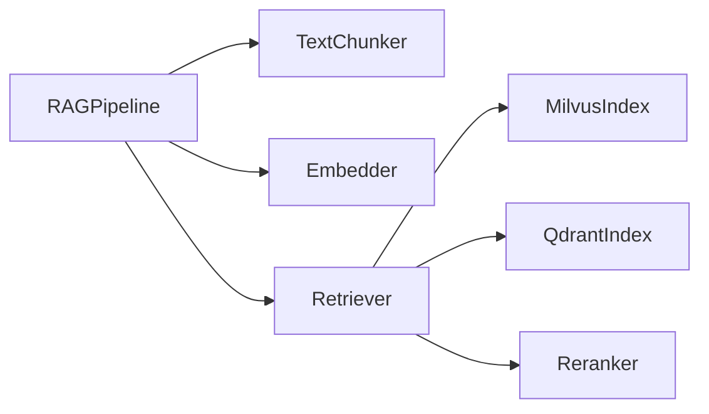

# Vector Indexing

<cite>
**Referenced Files in This Document**
- [milvus.py](file://python/src/resolvenet/rag/index/milvus.py)
- [qdrant.py](file://python/src/resolvenet/rag/index/qdrant.py)
- [pipeline.py](file://python/src/resolvenet/rag/pipeline.py)
- [retriever.py](file://python/src/resolvenet/rag/retrieve/retriever.py)
- [reranker.py](file://python/src/resolvenet/rag/retrieve/reranker.py)
- [embedder.py](file://python/src/resolvenet/rag/ingest/embedder.py)
- [chunker.py](file://python/src/resolvenet/rag/ingest/chunker.py)
- [resolvenet.yaml](file://configs/resolvenet.yaml)
- [runtime.yaml](file://configs/runtime.yaml)
</cite>

## Table of Contents
1. [Introduction](#introduction)
2. [Project Structure](#project-structure)
3. [Core Components](#core-components)
4. [Architecture Overview](#architecture-overview)
5. [Detailed Component Analysis](#detailed-component-analysis)
6. [Dependency Analysis](#dependency-analysis)
7. [Performance Considerations](#performance-considerations)
8. [Troubleshooting Guide](#troubleshooting-guide)
9. [Conclusion](#conclusion)
10. [Appendices](#appendices)

## Introduction
This document describes the vector indexing system for the RAG (Retrieval-Augmented Generation) pipeline. It focuses on the dual backend support for Milvus and Qdrant, the ingestion and retrieval pipeline, and operational guidance for configuration, performance tuning, scalability, monitoring, and troubleshooting. The current Python implementation exposes interfaces for Milvus and Qdrant vector backends and orchestrates ingestion, embedding, indexing, retrieval, and reranking.

## Project Structure
The vector indexing system is implemented in the Python package under the RAG module. Key areas:
- Index backends: Milvus and Qdrant classes define the interface for collection management, insert, search, and delete operations.
- Pipeline: Orchestration of ingestion and querying.
- Retrieval: Vector search and reranking components.
- Ingestion: Text chunking and embedding generation.

**Diagram sources**
- [pipeline.py:11-75](file://python/src/resolvenet/rag/pipeline.py#L11-L75)
- [embedder.py:11-49](file://python/src/resolvenet/rag/ingest/embedder.py#L11-L49)
- [chunker.py:6-73](file://python/src/resolvenet/rag/ingest/chunker.py#L6-L73)
- [retriever.py:11-42](file://python/src/resolvenet/rag/retrieve/retriever.py#L11-L42)
- [reranker.py:11-41](file://python/src/resolvenet/rag/retrieve/reranker.py#L11-L41)
- [milvus.py:11-54](file://python/src/resolvenet/rag/index/milvus.py#L11-L54)
- [qdrant.py:11-52](file://python/src/resolvenet/rag/index/qdrant.py#L11-L52)

**Section sources**
- [milvus.py:11-54](file://python/src/resolvenet/rag/index/milvus.py#L11-L54)
- [qdrant.py:11-52](file://python/src/resolvenet/rag/index/qdrant.py#L11-L52)
- [pipeline.py:11-75](file://python/src/resolvenet/rag/pipeline.py#L11-L75)
- [retriever.py:11-42](file://python/src/resolvenet/rag/retrieve/retriever.py#L11-L42)
- [reranker.py:11-41](file://python/src/resolvenet/rag/retrieve/reranker.py#L11-L41)
- [embedder.py:11-49](file://python/src/resolvenet/rag/ingest/embedder.py#L11-L49)
- [chunker.py:6-73](file://python/src/resolvenet/rag/ingest/chunker.py#L6-L73)

## Core Components
- MilvusIndex: Defines async methods for collection creation, vector insert, search, and delete. It is initialized with host and port defaults suitable for local development.
- QdrantIndex: Mirrors MilvusIndex with the same method signatures for collection management, insert, search, and delete.
- RAGPipeline: Orchestrates ingestion (parse, chunk, embed, index) and querying (embed query, search, rerank). It accepts a vector_backend parameter to select the backend.
- Retriever: Performs dense vector search against the selected backend with optional metadata filters.
- Reranker: Applies cross-encoder reranking to refine retrieval results.
- Embedder: Generates embeddings for texts and queries; currently returns placeholder vectors.
- TextChunker: Implements fixed-size and sentence-based chunking strategies.

Key implementation references:
- [MilvusIndex.__init__:18-22](file://python/src/resolvenet/rag/index/milvus.py#L18-L22)
- [QdrantIndex.__init__:18-21](file://python/src/resolvenet/rag/index/qdrant.py#L18-L21)
- [RAGPipeline.__init__:20-27](file://python/src/resolvenet/rag/pipeline.py#L20-L27)
- [Retriever.retrieve:21-41](file://python/src/resolvenet/rag/retrieve/retriever.py#L21-L41)
- [Reranker.rerank:21-40](file://python/src/resolvenet/rag/retrieve/reranker.py#L21-L40)
- [Embedder.embed:23-36](file://python/src/resolvenet/rag/ingest/embedder.py#L23-L36)
- [TextChunker.chunk:25-39](file://python/src/resolvenet/rag/ingest/chunker.py#L25-L39)

**Section sources**
- [milvus.py:11-54](file://python/src/resolvenet/rag/index/milvus.py#L11-L54)
- [qdrant.py:11-52](file://python/src/resolvenet/rag/index/qdrant.py#L11-L52)
- [pipeline.py:11-75](file://python/src/resolvenet/rag/pipeline.py#L11-L75)
- [retriever.py:11-42](file://python/src/resolvenet/rag/retrieve/retriever.py#L11-L42)
- [reranker.py:11-41](file://python/src/resolvenet/rag/retrieve/reranker.py#L11-L41)
- [embedder.py:11-49](file://python/src/resolvenet/rag/ingest/embedder.py#L11-L49)
- [chunker.py:6-73](file://python/src/resolvenet/rag/ingest/chunker.py#L6-L73)

## Architecture Overview
The RAG pipeline integrates ingestion and retrieval with pluggable vector backends. The pipeline stages:
- Ingestion: Parse → Chunk → Embed → Index
- Retrieval: Embed Query → Vector Search → Rerank
- Index backends: Milvus and Qdrant expose identical method signatures for collection lifecycle and vector operations.

**Diagram sources**
- [pipeline.py:28-75](file://python/src/resolvenet/rag/pipeline.py#L28-L75)
- [chunker.py:25-73](file://python/src/resolvenet/rag/ingest/chunker.py#L25-L73)
- [embedder.py:23-49](file://python/src/resolvenet/rag/ingest/embedder.py#L23-L49)
- [milvus.py:23-54](file://python/src/resolvenet/rag/index/milvus.py#L23-L54)
- [qdrant.py:22-52](file://python/src/resolvenet/rag/index/qdrant.py#L22-L52)
- [retriever.py:21-41](file://python/src/resolvenet/rag/retrieve/retriever.py#L21-L41)
- [reranker.py:21-40](file://python/src/resolvenet/rag/retrieve/reranker.py#L21-L40)

## Detailed Component Analysis

### MilvusIndex
- Purpose: Provide Milvus-backed vector operations with async methods for collection lifecycle and vector operations.
- Methods:
  - create_collection(name, dimension, **kwargs): Create a collection with a given vector dimension.
  - insert(collection, vectors, metadata): Insert vectors with associated metadata.
  - search(collection, query_vector, top_k=5, filters=None): Perform similarity search with optional filters.
  - delete_collection(name): Drop a collection.
- Initialization: Accepts host and port with defaults suitable for local deployment.

Implementation references:
- [MilvusIndex.__init__:18-22](file://python/src/resolvenet/rag/index/milvus.py#L18-L22)
- [MilvusIndex.create_collection:23-28](file://python/src/resolvenet/rag/index/milvus.py#L23-L28)
- [MilvusIndex.insert:30-36](file://python/src/resolvenet/rag/index/milvus.py#L30-L36)
- [MilvusIndex.search:38-48](file://python/src/resolvenet/rag/index/milvus.py#L38-L48)
- [MilvusIndex.delete_collection:50-54](file://python/src/resolvenet/rag/index/milvus.py#L50-L54)

**Section sources**
- [milvus.py:11-54](file://python/src/resolvenet/rag/index/milvus.py#L11-L54)

### QdrantIndex
- Purpose: Provide Qdrant-backed vector operations with the same method signatures as MilvusIndex.
- Methods:
  - create_collection(name, dimension, **kwargs)
  - insert(collection, vectors, metadata)
  - search(collection, query_vector, top_k=5, filters=None)
  - delete_collection(name)
- Initialization: Accepts host and port with defaults suitable for local deployment.

Implementation references:
- [QdrantIndex.__init__:18-21](file://python/src/resolvenet/rag/index/qdrant.py#L18-L21)
- [QdrantIndex.create_collection:22-27](file://python/src/resolvenet/rag/index/qdrant.py#L22-L27)
- [QdrantIndex.insert:29-35](file://python/src/resolvenet/rag/index/qdrant.py#L29-L35)
- [QdrantIndex.search:37-46](file://python/src/resolvenet/rag/index/qdrant.py#L37-L46)
- [QdrantIndex.delete_collection:49-52](file://python/src/resolvenet/rag/index/qdrant.py#L49-L52)

**Section sources**
- [qdrant.py:11-52](file://python/src/resolvenet/rag/index/qdrant.py#L11-L52)

### RAGPipeline
- Purpose: Orchestrate the full RAG workflow with configurable vector backend selection.
- Key behaviors:
  - ingest(collection_id, documents): Logs ingestion and returns counts; placeholders for parse/chunk/embed/index.
  - query(collection_id, query, top_k): Logs query and returns empty results; placeholders for embed/search/rerank.
- Backend selection: vector_backend parameter selects the backend used by downstream components.

Implementation references:
- [RAGPipeline.__init__:20-27](file://python/src/resolvenet/rag/pipeline.py#L20-L27)
- [RAGPipeline.ingest:28-51](file://python/src/resolvenet/rag/pipeline.py#L28-L51)
- [RAGPipeline.query:53-75](file://python/src/resolvenet/rag/pipeline.py#L53-L75)

**Section sources**
- [pipeline.py:11-75](file://python/src/resolvenet/rag/pipeline.py#L11-L75)

### Retriever
- Purpose: Dense vector search against the configured backend with optional metadata filters.
- retrieve(collection, query_embedding, top_k, filters=None): Placeholder that logs and returns empty results.

Implementation references:
- [Retriever.__init__:18-19](file://python/src/resolvenet/rag/retrieve/retriever.py#L18-L19)
- [Retriever.retrieve:21-41](file://python/src/resolvenet/rag/retrieve/retriever.py#L21-L41)

**Section sources**
- [retriever.py:11-42](file://python/src/resolvenet/rag/retrieve/retriever.py#L11-L42)

### Reranker
- Purpose: Cross-encoder reranking to improve retrieval precision.
- rerank(query, chunks, top_k): Placeholder that logs and returns top-k chunks.

Implementation references:
- [Reranker.__init__:18-19](file://python/src/resolvenet/rag/retrieve/reranker.py#L18-L19)
- [Reranker.rerank:21-40](file://python/src/resolvenet/rag/retrieve/reranker.py#L21-L40)

**Section sources**
- [reranker.py:11-41](file://python/src/resolvenet/rag/retrieve/reranker.py#L11-L41)

### Embedder
- Purpose: Generate embeddings for texts and queries.
- embed(texts): Returns placeholder vectors with a fixed dimension.
- embed_query(query): Generates a single query embedding.

Implementation references:
- [Embedder.__init__:20-21](file://python/src/resolvenet/rag/ingest/embedder.py#L20-L21)
- [Embedder.embed:23-36](file://python/src/resolvenet/rag/ingest/embedder.py#L23-L36)
- [Embedder.embed_query:38-48](file://python/src/resolvenet/rag/ingest/embedder.py#L38-L48)

**Section sources**
- [embedder.py:11-49](file://python/src/resolvenet/rag/ingest/embedder.py#L11-L49)

### TextChunker
- Purpose: Split text into overlapping chunks using fixed-size or sentence-based strategies.
- chunk(text): Dispatches to strategy-specific chunkers.
- Strategies:
  - fixed: Fixed-size with overlap.
  - sentence: Sentence boundary splitting.

Implementation references:
- [TextChunker.__init__:15-23](file://python/src/resolvenet/rag/ingest/chunker.py#L15-L23)
- [TextChunker.chunk:25-39](file://python/src/resolvenet/rag/ingest/chunker.py#L25-L39)
- [TextChunker._chunk_fixed:41-49](file://python/src/resolvenet/rag/ingest/chunker.py#L41-L49)
- [TextChunker._chunk_sentence:51-72](file://python/src/resolvenet/rag/ingest/chunker.py#L51-L72)

**Section sources**
- [chunker.py:6-73](file://python/src/resolvenet/rag/ingest/chunker.py#L6-L73)

## Dependency Analysis
- RAGPipeline depends on TextChunker and Embedder for ingestion and on Retriever for querying.
- Retriever depends on the selected vector backend (MilvusIndex or QdrantIndex).
- Reranker depends on Retriever’s output.
- Configuration files define service addresses and telemetry settings that indirectly impact vector operations via the broader platform.

**Diagram sources**
- [pipeline.py:20-27](file://python/src/resolvenet/rag/pipeline.py#L20-L27)
- [retriever.py:18-19](file://python/src/resolvenet/rag/retrieve/retriever.py#L18-L19)
- [milvus.py:11-54](file://python/src/resolvenet/rag/index/milvus.py#L11-L54)
- [qdrant.py:11-52](file://python/src/resolvenet/rag/index/qdrant.py#L11-L52)
- [reranker.py:11-41](file://python/src/resolvenet/rag/retrieve/reranker.py#L11-L41)

**Section sources**
- [pipeline.py:11-75](file://python/src/resolvenet/rag/pipeline.py#L11-L75)
- [retriever.py:11-42](file://python/src/resolvenet/rag/retrieve/retriever.py#L11-L42)
- [reranker.py:11-41](file://python/src/resolvenet/rag/retrieve/reranker.py#L11-L41)
- [milvus.py:11-54](file://python/src/resolvenet/rag/index/milvus.py#L11-L54)
- [qdrant.py:11-52](file://python/src/resolvenet/rag/index/qdrant.py#L11-L52)

## Performance Considerations
- Embedding cost: Embedder currently returns placeholder vectors; production deployments should configure a real embedding model and batch requests to reduce latency.
- Chunking strategy: Sentence-based chunking often improves retrieval quality for long-form text; tune chunk_size and chunk_overlap per domain.
- Backend selection:
  - Milvus: Strong performance for dense vector similarity search; good for large-scale vector workloads.
  - Qdrant: Rich filtering and payload management; beneficial when metadata filtering is frequent.
- Query-time filters: Use filters in search to narrow candidate sets and reduce compute.
- Reranking: Cross-encoder reranking improves precision but is computationally expensive; apply only to top-k candidates.

[No sources needed since this section provides general guidance]

## Troubleshooting Guide
Common issues and remedies:
- Empty results from search:
  - Verify collection exists and contains vectors.
  - Confirm embeddings are generated and inserted successfully.
  - Check backend connectivity (host/port) and credentials.
- Slow queries:
  - Reduce top_k or apply filters to limit result set.
  - Ensure chunk_size and overlap are tuned for the domain.
  - Consider backend-specific index parameters and hardware resources.
- Backend connectivity errors:
  - Validate backend host and port configuration.
  - Confirm firewall and network policies allow connections.
- Telemetry and logging:
  - Enable telemetry to capture metrics and traces for diagnostics.
  - Review logs emitted by MilvusIndex and QdrantIndex for detailed operation insights.

Operational configuration references:
- [resolvenet.yaml:1-34](file://configs/resolvenet.yaml#L1-L34)
- [runtime.yaml:1-18](file://configs/runtime.yaml#L1-L18)

**Section sources**
- [resolvenet.yaml:1-34](file://configs/resolvenet.yaml#L1-L34)
- [runtime.yaml:1-18](file://configs/runtime.yaml#L1-L18)

## Conclusion
The vector indexing system defines a clean separation between ingestion, embedding, indexing, retrieval, and reranking. Milvus and Qdrant backends share the same interface, enabling seamless switching. Production readiness requires implementing the backend operations, configuring embeddings, optimizing chunking, and leveraging telemetry for monitoring and troubleshooting.

## Appendices

### Index Operations Reference
- Collection lifecycle:
  - create_collection(name, dimension, **kwargs)
  - delete_collection(name)
- Vector operations:
  - insert(collection, vectors, metadata)
  - search(collection, query_vector, top_k=5, filters=None)

Implementation references:
- [MilvusIndex.create_collection:23-28](file://python/src/resolvenet/rag/index/milvus.py#L23-L28)
- [MilvusIndex.insert:30-36](file://python/src/resolvenet/rag/index/milvus.py#L30-L36)
- [MilvusIndex.search:38-48](file://python/src/resolvenet/rag/index/milvus.py#L38-L48)
- [MilvusIndex.delete_collection:50-54](file://python/src/resolvenet/rag/index/milvus.py#L50-L54)
- [QdrantIndex.create_collection:22-27](file://python/src/resolvenet/rag/index/qdrant.py#L22-L27)
- [QdrantIndex.insert:29-35](file://python/src/resolvenet/rag/index/qdrant.py#L29-L35)
- [QdrantIndex.search:37-46](file://python/src/resolvenet/rag/index/qdrant.py#L37-L46)
- [QdrantIndex.delete_collection:49-52](file://python/src/resolvenet/rag/index/qdrant.py#L49-L52)

### Configuration Parameters
- Platform services and telemetry:
  - server.http_addr, server.grpc_addr
  - database.* (host, port, user, password, dbname, sslmode)
  - redis.addr, redis.db
  - nats.url
  - runtime.grpc_addr
  - gateway.admin_url, gateway.enabled
  - telemetry.enabled, telemetry.otlp_endpoint, telemetry.service_name, telemetry.metrics_enabled
- Runtime:
  - server.host, server.port
  - agent_pool.max_size, agent_pool.eviction_policy
  - selector.default_strategy, selector.confidence_threshold
  - telemetry.enabled, telemetry.service_name

References:
- [resolvenet.yaml:1-34](file://configs/resolvenet.yaml#L1-L34)
- [runtime.yaml:1-18](file://configs/runtime.yaml#L1-L18)