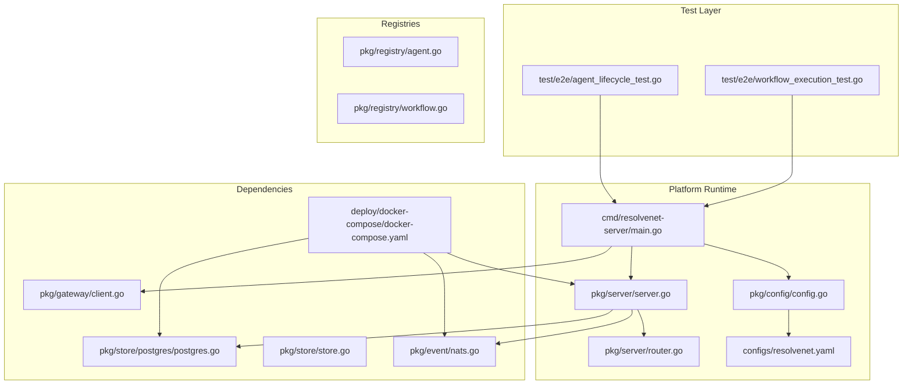
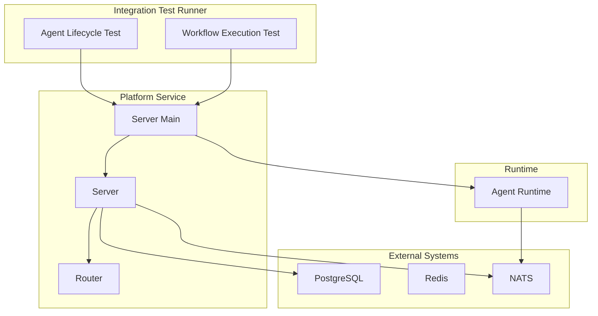
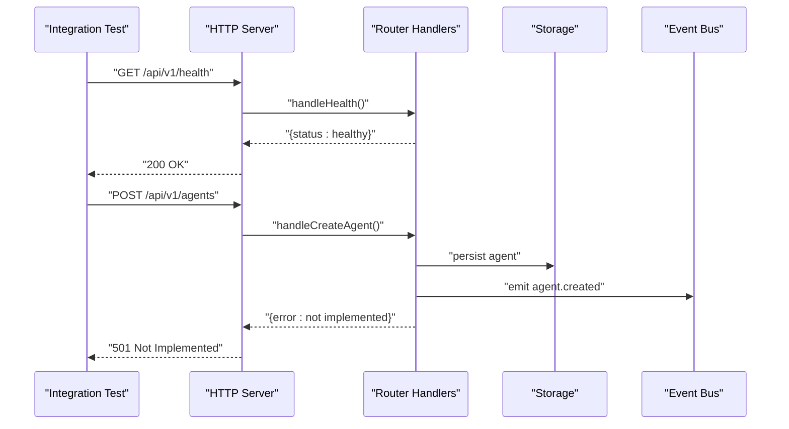
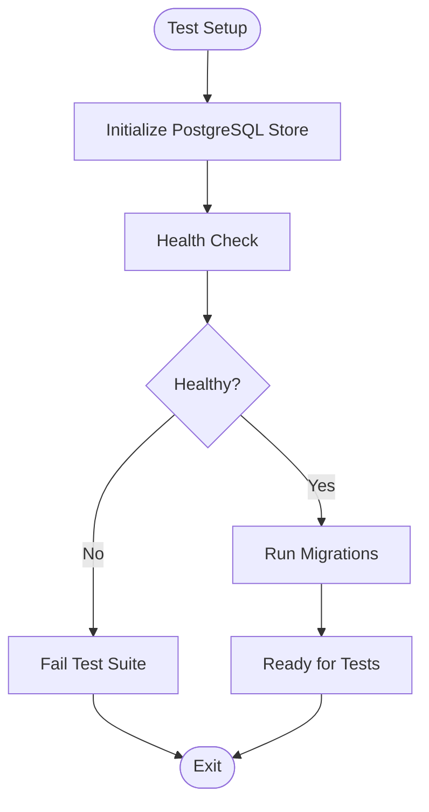
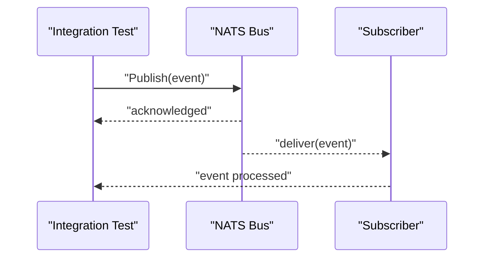
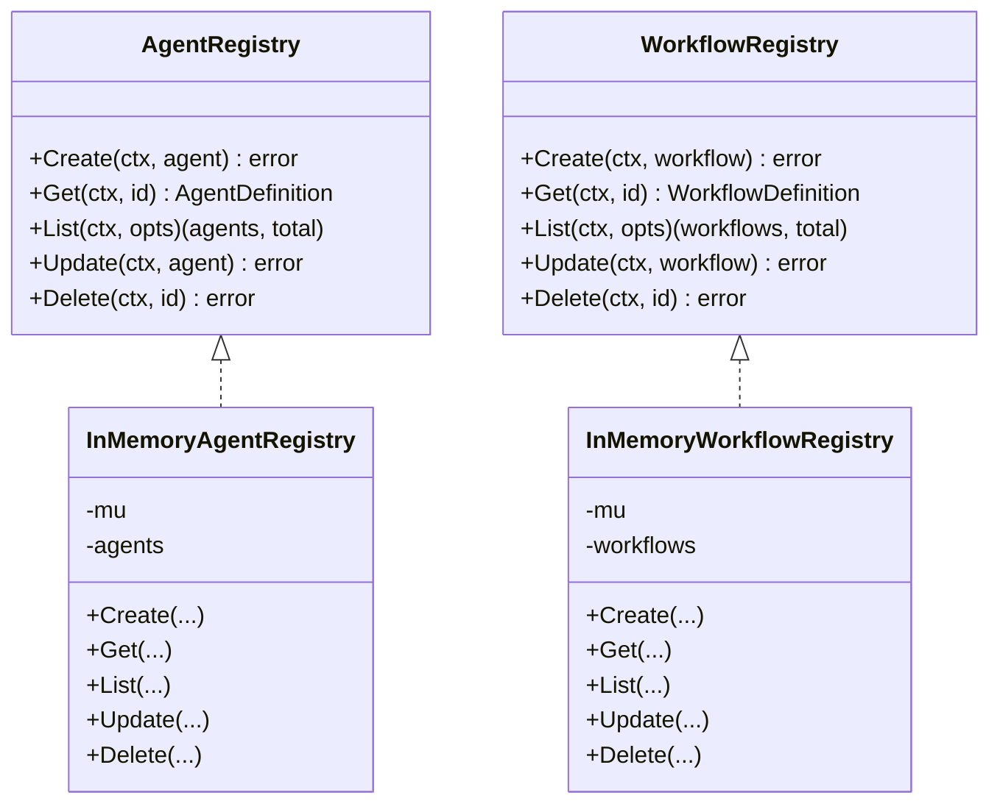
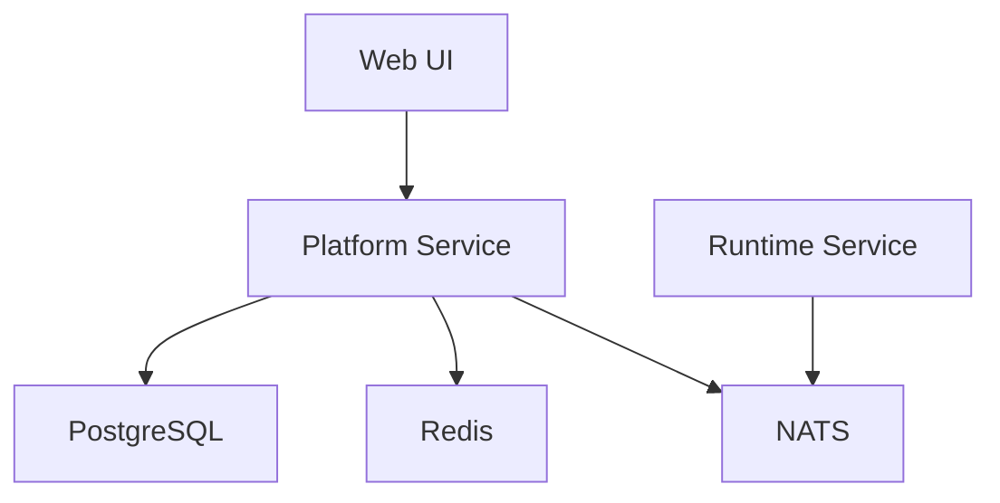

# Integration Testing

<cite>
**Referenced Files in This Document**
- [agent_lifecycle_test.go](file://test/e2e/agent_lifecycle_test.go)
- [workflow_execution_test.go](file://test/e2e/workflow_execution_test.go)
- [main.go](file://cmd/resolvenet-server/main.go)
- [server.go](file://pkg/server/server.go)
- [router.go](file://pkg/server/router.go)
- [config.go](file://pkg/config/config.go)
- [resolvenet.yaml](file://configs/resolvenet.yaml)
- [docker-compose.yaml](file://deploy/docker-compose/docker-compose.yaml)
- [postgres.go](file://pkg/store/postgres/postgres.go)
- [store.go](file://pkg/store/store.go)
- [nats.go](file://pkg/event/nats.go)
- [client.go](file://pkg/gateway/client.go)
- [root.go](file://internal/cli/root.go)
- [agent.go](file://pkg/registry/agent.go)
- [workflow.go](file://pkg/registry/workflow.go)
</cite>

## Table of Contents
1. [Introduction](#introduction)
2. [Project Structure](#project-structure)
3. [Core Components](#core-components)
4. [Architecture Overview](#architecture-overview)
5. [Detailed Component Analysis](#detailed-component-analysis)
6. [Dependency Analysis](#dependency-analysis)
7. [Performance Considerations](#performance-considerations)
8. [Troubleshooting Guide](#troubleshooting-guide)
9. [Conclusion](#conclusion)
10. [Appendices](#appendices)

## Introduction
This document defines ResolveNet’s integration testing strategy for end-to-end validation of complete system workflows. It focuses on:
- Agent lifecycle management and workflow execution
- Service communication between platform services and agent runtime components
- API endpoint coverage, database interactions, and event-driven communication
- Cross-component workflows and data persistence
- Realistic test environments using Docker Compose with PostgreSQL, Redis, NATS, and the platform/runtime services
- Error scenarios, timeouts, and concurrency
- Best practices for reliable and maintainable integration tests

## Project Structure
The integration testing effort centers around:
- End-to-end tests under test/e2e
- Platform server exposing REST/gRPC APIs
- Configuration and environment variables controlling service addresses
- Docker Compose for spinning up dependencies
- Registry abstractions for agent and workflow definitions
- Storage and event bus abstractions for persistence and messaging
- Gateway client for optional Higress integration

**Diagram sources**
- [agent_lifecycle_test.go:1-13](file://test/e2e/agent_lifecycle_test.go#L1-L13)
- [workflow_execution_test.go:1-13](file://test/e2e/workflow_execution_test.go#L1-L13)
- [main.go:1-56](file://cmd/resolvenet-server/main.go#L1-L56)
- [server.go:1-104](file://pkg/server/server.go#L1-L104)
- [router.go:1-183](file://pkg/server/router.go#L1-L183)
- [config.go:1-63](file://pkg/config/config.go#L1-L63)
- [resolvenet.yaml:1-34](file://configs/resolvenet.yaml#L1-L34)
- [postgres.go:1-45](file://pkg/store/postgres/postgres.go#L1-L45)
- [store.go:1-14](file://pkg/store/store.go#L1-L14)
- [nats.go:1-46](file://pkg/event/nats.go#L1-L46)
- [client.go:1-31](file://pkg/gateway/client.go#L1-L31)
- [docker-compose.yaml:1-65](file://deploy/docker-compose/docker-compose.yaml#L1-L65)
- [agent.go:1-103](file://pkg/registry/agent.go#L1-L103)
- [workflow.go:1-94](file://pkg/registry/workflow.go#L1-L94)

**Section sources**
- [agent_lifecycle_test.go:1-13](file://test/e2e/agent_lifecycle_test.go#L1-L13)
- [workflow_execution_test.go:1-13](file://test/e2e/workflow_execution_test.go#L1-L13)
- [main.go:1-56](file://cmd/resolvenet-server/main.go#L1-L56)
- [server.go:1-104](file://pkg/server/server.go#L1-L104)
- [router.go:1-183](file://pkg/server/router.go#L1-L183)
- [config.go:1-63](file://pkg/config/config.go#L1-L63)
- [resolvenet.yaml:1-34](file://configs/resolvenet.yaml#L1-L34)
- [docker-compose.yaml:1-65](file://deploy/docker-compose/docker-compose.yaml#L1-L65)
- [postgres.go:1-45](file://pkg/store/postgres/postgres.go#L1-L45)
- [store.go:1-14](file://pkg/store/store.go#L1-L14)
- [nats.go:1-46](file://pkg/event/nats.go#L1-L46)
- [client.go:1-31](file://pkg/gateway/client.go#L1-L31)
- [agent.go:1-103](file://pkg/registry/agent.go#L1-L103)
- [workflow.go:1-94](file://pkg/registry/workflow.go#L1-L94)

## Core Components
- Platform server: Initializes gRPC and HTTP servers, registers REST routes, and handles graceful shutdown.
- Configuration: Loads defaults and environment overrides for database, Redis, NATS, runtime, gateway, and telemetry.
- API surface: REST endpoints for agents, skills, workflows, RAG, models, and configuration.
- Storage: Abstraction for health checks and migrations; current implementation is stubbed.
- Events: Abstraction for NATS JetStream publishing/subscribing; current implementation is stubbed.
- Registries: In-memory registries for agents and workflows used during development and testing.
- Gateway: Optional client for Higress admin API health checks.
- Docker Compose: Provides PostgreSQL, Redis, NATS, platform, runtime, and web UI services.

**Section sources**
- [server.go:1-104](file://pkg/server/server.go#L1-L104)
- [router.go:1-183](file://pkg/server/router.go#L1-L183)
- [config.go:1-63](file://pkg/config/config.go#L1-L63)
- [resolvenet.yaml:1-34](file://configs/resolvenet.yaml#L1-L34)
- [postgres.go:1-45](file://pkg/store/postgres/postgres.go#L1-L45)
- [store.go:1-14](file://pkg/store/store.go#L1-L14)
- [nats.go:1-46](file://pkg/event/nats.go#L1-L46)
- [agent.go:1-103](file://pkg/registry/agent.go#L1-L103)
- [workflow.go:1-94](file://pkg/registry/workflow.go#L1-L94)
- [client.go:1-31](file://pkg/gateway/client.go#L1-L31)
- [docker-compose.yaml:1-65](file://deploy/docker-compose/docker-compose.yaml#L1-L65)

## Architecture Overview
The integration test suite validates end-to-end flows by exercising platform services and runtime components together with external systems (PostgreSQL, Redis, NATS).

**Diagram sources**
- [main.go:1-56](file://cmd/resolvenet-server/main.go#L1-L56)
- [server.go:1-104](file://pkg/server/server.go#L1-L104)
- [router.go:1-183](file://pkg/server/router.go#L1-L183)
- [postgres.go:1-45](file://pkg/store/postgres/postgres.go#L1-L45)
- [nats.go:1-46](file://pkg/event/nats.go#L1-L46)
- [docker-compose.yaml:1-65](file://deploy/docker-compose/docker-compose.yaml#L1-L65)

## Detailed Component Analysis

### End-to-End Test Strategy
- Agent lifecycle: Create, run, and delete agents through REST endpoints; validate state transitions and persistence.
- Workflow execution: Create, validate, and execute workflows; observe results via runtime and event bus.
- Infrastructure: Tests are marked as E2E and skipped by default; they require running platform, runtime, and external dependencies.

Recommended test structure:
- Use a shared test harness to provision and tear down dependencies per suite.
- Parameterize tests with different configurations (e.g., DB vs. in-memory registries).
- Assert on HTTP responses, database records, and event emissions.

**Section sources**
- [agent_lifecycle_test.go:1-13](file://test/e2e/agent_lifecycle_test.go#L1-L13)
- [workflow_execution_test.go:1-13](file://test/e2e/workflow_execution_test.go#L1-L13)

### Platform Server and API Coverage
- REST endpoints: Health, system info, agents, skills, workflows, RAG collections, models, and configuration.
- gRPC: Health service and reflection enabled.
- Graceful shutdown: Both HTTP and gRPC servers are shut down gracefully on context cancellation.

Testing approach:
- Verify HTTP status codes and JSON payloads for each endpoint.
- For endpoints returning “not implemented,” assert appropriate status codes and messages.
- Validate path templating and query parameters.

**Diagram sources**
- [server.go:54-103](file://pkg/server/server.go#L54-L103)
- [router.go:11-55](file://pkg/server/router.go#L11-L55)
- [router.go:75-94](file://pkg/server/router.go#L75-L94)
- [postgres.go:1-45](file://pkg/store/postgres/postgres.go#L1-L45)
- [nats.go:1-46](file://pkg/event/nats.go#L1-L46)

**Section sources**
- [server.go:1-104](file://pkg/server/server.go#L1-L104)
- [router.go:1-183](file://pkg/server/router.go#L1-L183)

### Configuration and Environment Setup
- Defaults for HTTP/gRPC addresses, database credentials, Redis, NATS, runtime gRPC, gateway, and telemetry.
- Environment variables override configuration via Viper with dot-to-underscore replacement.
- Example configuration file demonstrates expected keys and values.

Testing guidance:
- Override environment variables in CI to point to ephemeral containers.
- Use separate configuration files per environment (dev, staging, CI).
- Validate that missing config produces clear errors.

**Section sources**
- [config.go:1-63](file://pkg/config/config.go#L1-L63)
- [resolvenet.yaml:1-34](file://configs/resolvenet.yaml#L1-L34)

### Storage and Database Interactions
- Store interface defines Health and Close.
- PostgreSQL store stubs:
  - Health check placeholder
  - Migration placeholder returning a not-implemented error
  - Connection initialization placeholder

Testing guidance:
- For integration tests, connect to a real PostgreSQL container managed by Docker Compose.
- Implement and run migrations prior to tests.
- Use transactions or database snapshots to isolate tests.

**Diagram sources**
- [postgres.go:27-44](file://pkg/store/postgres/postgres.go#L27-L44)
- [store.go:7-13](file://pkg/store/store.go#L7-L13)

**Section sources**
- [postgres.go:1-45](file://pkg/store/postgres/postgres.go#L1-L45)
- [store.go:1-14](file://pkg/store/store.go#L1-L14)

### Event-Driven Communication (NATS)
- NATSBus abstraction supports publishing and subscribing to events.
- Current implementation logs but does not connect to NATS.

Testing guidance:
- For integration tests, connect to a NATS container managed by Docker Compose.
- Subscribe to specific subjects and assert emitted events after triggering actions.
- Simulate network partitions or slow consumers to test resilience.

**Diagram sources**
- [nats.go:27-39](file://pkg/event/nats.go#L27-L39)

**Section sources**
- [nats.go:1-46](file://pkg/event/nats.go#L1-L46)

### Registry-Based Workflows (Agents and Workflows)
- In-memory registries for agents and workflows support CRUD operations with concurrency protection.
- These are suitable for development and lightweight integration tests.

Testing guidance:
- Use in-memory registries for fast tests that do not require persistent storage.
- For persistence tests, combine in-memory registries with a real database backend.

**Diagram sources**
- [agent.go:21-102](file://pkg/registry/agent.go#L21-L102)
- [workflow.go:19-93](file://pkg/registry/workflow.go#L19-L93)

**Section sources**
- [agent.go:1-103](file://pkg/registry/agent.go#L1-L103)
- [workflow.go:1-94](file://pkg/registry/workflow.go#L1-L94)

### Runtime and Gateway Integration
- Runtime service listens on a gRPC address configured in environment variables.
- Gateway client can check Higress admin API health when enabled.

Testing guidance:
- Validate that platform can discover and communicate with the runtime.
- When gateway is enabled, assert successful health checks and route updates.

**Section sources**
- [resolvenet.yaml:22-27](file://configs/resolvenet.yaml#L22-L27)
- [client.go:25-30](file://pkg/gateway/client.go#L25-L30)

### CLI and Test Orchestration
- CLI exposes commands for agents, skills, workflows, RAG, config, dashboard, serve, version.
- Tests can drive the platform via HTTP requests while the CLI remains useful for manual verification.

Testing guidance:
- Prefer HTTP-based tests for automation; use CLI for local debugging.

**Section sources**
- [root.go:19-72](file://internal/cli/root.go#L19-L72)

## Dependency Analysis
The platform relies on external systems orchestrated by Docker Compose. Integration tests must ensure these dependencies are available and properly configured.

**Diagram sources**
- [docker-compose.yaml:3-65](file://deploy/docker-compose/docker-compose.yaml#L3-L65)

**Section sources**
- [docker-compose.yaml:1-65](file://deploy/docker-compose/docker-compose.yaml#L1-L65)

## Performance Considerations
- Use connection pooling for PostgreSQL and Redis in tests where applicable.
- Minimize cross-process communication by reusing server instances across tests.
- Prefer in-memory registries for fast tests; reserve database-backed tests for critical paths.
- Apply timeouts and retries for external service calls (HTTP, NATS, gRPC).

## Troubleshooting Guide
Common issues and resolutions:
- Tests skip by default: Ensure the E2E build tag is used and dependencies are running.
- Configuration mismatches: Verify environment variables align with Docker Compose service names and ports.
- NATS connectivity: Confirm NATS is started with JetStream enabled.
- Database migrations: Implement and run migrations before integration tests.
- Gateway disabled: Expect gateway health checks to return informational logs rather than errors.

Operational tips:
- Use Docker Compose profiles or separate compose files for different environments.
- Capture logs from platform, runtime, and external services during test runs.
- Implement deterministic cleanup routines to avoid resource leaks.

**Section sources**
- [agent_lifecycle_test.go:9-12](file://test/e2e/agent_lifecycle_test.go#L9-L12)
- [workflow_execution_test.go:9-12](file://test/e2e/workflow_execution_test.go#L9-L12)
- [config.go:44-47](file://pkg/config/config.go#L44-L47)
- [postgres.go:40-44](file://pkg/store/postgres/postgres.go#L40-L44)
- [nats.go:16-25](file://pkg/event/nats.go#L16-L25)

## Conclusion
ResolveNet’s integration testing strategy leverages a real platform server, runtime, and external systems to validate end-to-end workflows. By combining HTTP API tests, database assertions, and event bus validations, teams can ensure reliable agent lifecycle and workflow execution. The provided Docker Compose setup, configuration flexibility, and modular abstractions enable robust, maintainable integration suites.

## Appendices

### Test Environment Setup Checklist
- Start dependencies: PostgreSQL, Redis, NATS via Docker Compose.
- Launch platform and runtime services.
- Configure environment variables to match service addresses.
- Run tests with the E2E build tag and appropriate timeouts.

### Example Test Scenarios
- Agent lifecycle: Create agent via REST → verify persisted record → trigger execution → delete agent → confirm cleanup.
- Workflow execution: Create workflow via REST → validate structure → execute workflow → observe runtime and event bus activity → assert results.
- Error handling: Trigger invalid requests and timeouts; assert appropriate HTTP status codes and error messages.
- Concurrency: Run multiple agents/workflows concurrently; validate isolation and resource limits.

### Cleanup Procedures
- Stop platform and runtime services.
- Remove Docker Compose services and volumes.
- Reset database state if needed (drop/create or rollback migrations).
- Clear NATS streams and consumers if required.