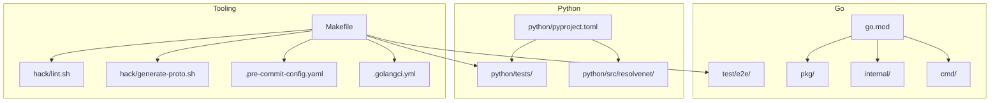
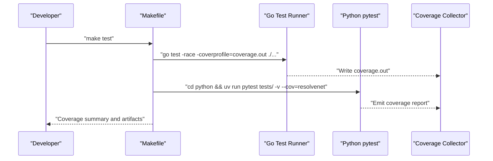
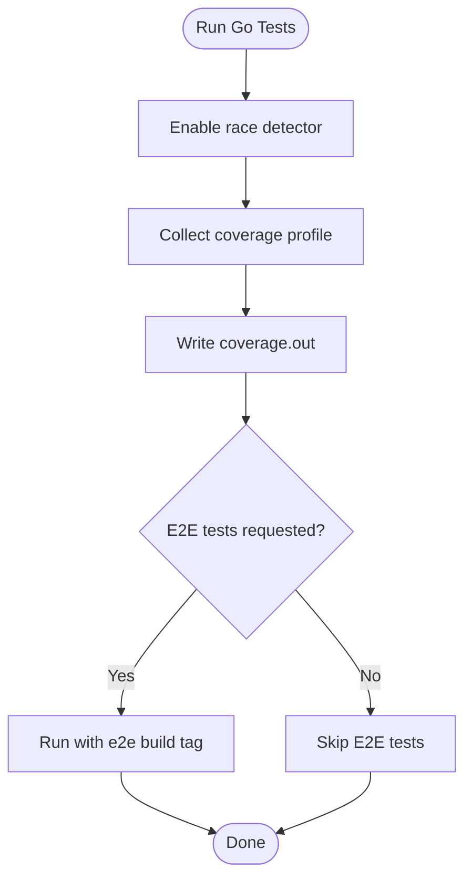
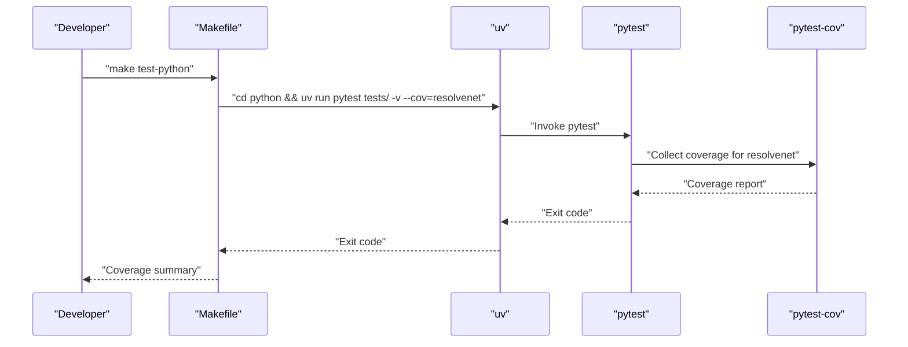
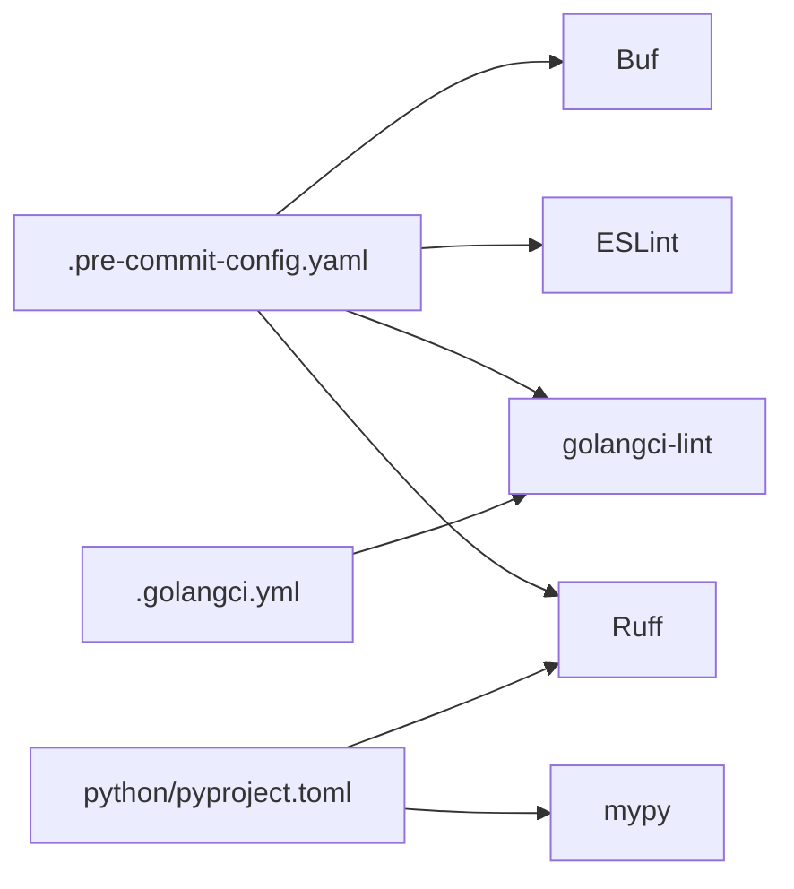
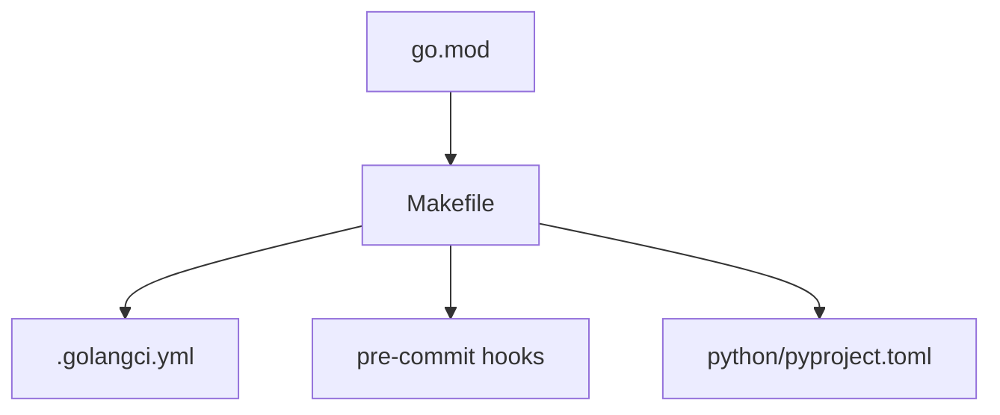

# Test Coverage and Analysis

<cite>
**Referenced Files in This Document**
- [.golangci.yml](file://.golangci.yml)
- [.pre-commit-config.yaml](file://.pre-commit-config.yaml)
- [go.mod](file://go.mod)
- [Makefile](file://Makefile)
- [hack/generate-proto.sh](file://hack/generate-proto.sh)
- [hack/lint.sh](file://hack/lint.sh)
- [python/pyproject.toml](file://python/pyproject.toml)
- [python/tests/conftest.py](file://python/tests/conftest.py)
- [python/tests/unit/test_fta_engine.py](file://python/tests/unit/test_fta_engine.py)
- [python/tests/unit/test_rag_pipeline.py](file://python/tests/unit/test_rag_pipeline.py)
- [python/tests/unit/test_selector.py](file://python/tests/unit/test_selector.py)
- [test/e2e/agent_lifecycle_test.go](file://test/e2e/agent_lifecycle_test.go)
- [test/e2e/workflow_execution_test.go](file://test/e2e/workflow_execution_test.go)
</cite>

## Table of Contents
1. [Introduction](#introduction)
2. [Project Structure](#project-structure)
3. [Core Components](#core-components)
4. [Architecture Overview](#architecture-overview)
5. [Detailed Component Analysis](#detailed-component-analysis)
6. [Dependency Analysis](#dependency-analysis)
7. [Performance Considerations](#performance-considerations)
8. [Troubleshooting Guide](#troubleshooting-guide)
9. [Conclusion](#conclusion)
10. [Appendices](#appendices)

## Introduction
This document provides a comprehensive guide to ResolveNet’s test coverage analysis and quality assurance processes. It covers coverage reporting tools and configuration for Python and Go, how to measure and interpret coverage metrics, continuous integration testing via Make targets, static analysis integration, and practical strategies to improve coverage and maintain high code quality.

## Project Structure
ResolveNet is a multi-language project with:
- Go backend services and CLI under cmd/, internal/, pkg/, and test/e2e/.
- Python runtime and libraries under python/src/resolvenet/ with unit tests under python/tests/.
- Shared developer tooling under hack/, linters under .golangci.yml and .pre-commit-config.yaml, and a unified build/test orchestration via Makefile.

**Diagram sources**
- [Makefile:69-117](file://Makefile#L69-L117)
- [go.mod:1-52](file://go.mod#L1-L52)
- [python/pyproject.toml:1-66](file://python/pyproject.toml#L1-L66)
- [.golangci.yml:1-69](file://.golangci.yml#L1-L69)
- [.pre-commit-config.yaml:1-44](file://.pre-commit-config.yaml#L1-L44)
- [hack/generate-proto.sh:1-17](file://hack/generate-proto.sh#L1-L17)
- [hack/lint.sh:1-21](file://hack/lint.sh#L1-L21)

**Section sources**
- [Makefile:69-117](file://Makefile#L69-L117)
- [go.mod:1-52](file://go.mod#L1-L52)
- [python/pyproject.toml:1-66](file://python/pyproject.toml#L1-L66)
- [.golangci.yml:1-69](file://.golangci.yml#L1-L69)
- [.pre-commit-config.yaml:1-44](file://.pre-commit-config.yaml#L1-L44)
- [hack/generate-proto.sh:1-17](file://hack/generate-proto.sh#L1-L17)
- [hack/lint.sh:1-21](file://hack/lint.sh#L1-L21)

## Core Components
- Go coverage and tests:
  - Coverage profile generation is configured via the Makefile target that runs go test with race detection and coverage profiling.
  - End-to-end tests are gated behind a build tag and currently skipped pending infrastructure.
- Python coverage and tests:
  - Tests are executed with pytest and coverage is collected for the resolvenet package.
  - Fixtures are centralized in python/tests/conftest.py to support reusable test scaffolding.
- Static analysis:
  - Go linting uses golangci-lint with a curated set of linters.
  - Pre-commit integrates golangci-lint, Ruff, ESLint, and Buf for consistent local enforcement.
  - Python linting and type checking are configured in pyproject.toml (Ruff, mypy).

**Section sources**
- [Makefile:76-90](file://Makefile#L76-L90)
- [test/e2e/agent_lifecycle_test.go:1-13](file://test/e2e/agent_lifecycle_test.go#L1-L13)
- [test/e2e/workflow_execution_test.go:1-13](file://test/e2e/workflow_execution_test.go#L1-L13)
- [python/pyproject.toml:36-66](file://python/pyproject.toml#L36-L66)
- [python/tests/conftest.py:1-44](file://python/tests/conftest.py#L1-L44)
- [.golangci.yml:5-30](file://.golangci.yml#L5-L30)
- [.pre-commit-config.yaml:15-44](file://.pre-commit-config.yaml#L15-L44)

## Architecture Overview
The testing and coverage pipeline is orchestrated by Makefile targets that invoke language-specific runners and tools. The diagram below maps the primary flows for Go and Python coverage.

**Diagram sources**
- [Makefile:74-82](file://Makefile#L74-L82)

## Detailed Component Analysis

### Go Coverage and Testing
- Coverage configuration:
  - The Makefile invokes go test with race detection and writes a coverage profile to coverage.out.
  - The target runs tests across all packages in the Go module.
- E2E testing:
  - E2E tests are tagged and executed separately; they are currently skipped pending infrastructure.
- Static analysis:
  - golangci-lint is configured with a broad set of linters and tuned settings for diagnostics, security, performance, and style.

**Diagram sources**
- [Makefile:76-90](file://Makefile#L76-L90)
- [test/e2e/agent_lifecycle_test.go:1-13](file://test/e2e/agent_lifecycle_test.go#L1-L13)
- [test/e2e/workflow_execution_test.go:1-13](file://test/e2e/workflow_execution_test.go#L1-L13)

**Section sources**
- [Makefile:76-90](file://Makefile#L76-L90)
- [.golangci.yml:5-30](file://.golangci.yml#L5-L30)

### Python Coverage and Testing
- Coverage configuration:
  - Tests are executed via pytest with coverage enabled for the resolvenet package.
  - Fixtures are centralized to support reusable test scaffolding for FTA trees and related components.
- Unit tests:
  - Example suites include FTA gates and evaluation, selector routing strategies, and RAG pipeline chunking behavior.

**Diagram sources**
- [Makefile:80-82](file://Makefile#L80-L82)
- [python/pyproject.toml:36-42](file://python/pyproject.toml#L36-L42)
- [python/tests/conftest.py:8-44](file://python/tests/conftest.py#L8-L44)
- [python/tests/unit/test_fta_engine.py:1-40](file://python/tests/unit/test_fta_engine.py#L1-L40)
- [python/tests/unit/test_selector.py:1-30](file://python/tests/unit/test_selector.py#L1-L30)
- [python/tests/unit/test_rag_pipeline.py:1-19](file://python/tests/unit/test_rag_pipeline.py#L1-L19)

**Section sources**
- [Makefile:80-82](file://Makefile#L80-L82)
- [python/pyproject.toml:36-66](file://python/pyproject.toml#L36-L66)
- [python/tests/conftest.py:1-44](file://python/tests/conftest.py#L1-L44)
- [python/tests/unit/test_fta_engine.py:1-40](file://python/tests/unit/test_fta_engine.py#L1-L40)
- [python/tests/unit/test_selector.py:1-30](file://python/tests/unit/test_selector.py#L1-L30)
- [python/tests/unit/test_rag_pipeline.py:1-19](file://python/tests/unit/test_rag_pipeline.py#L1-L19)

### Static Analysis Integration
- Go:
  - golangci-lint is configured with a comprehensive set of linters and tuned settings for shadow checking, error handling, security, and style.
- Pre-commit:
  - Hooks enforce golangci-lint, Ruff, ESLint, and Buf linting on supported files.
- Python:
  - Ruff and mypy are configured in pyproject.toml for linting and type checking.

**Diagram sources**
- [.pre-commit-config.yaml:15-44](file://.pre-commit-config.yaml#L15-L44)
- [.golangci.yml:5-30](file://.golangci.yml#L5-L30)
- [python/pyproject.toml:51-62](file://python/pyproject.toml#L51-L62)

**Section sources**
- [.pre-commit-config.yaml:15-44](file://.pre-commit-config.yaml#L15-L44)
- [.golangci.yml:5-30](file://.golangci.yml#L5-L30)
- [python/pyproject.toml:51-62](file://python/pyproject.toml#L51-L62)

## Dependency Analysis
- Go module dependencies are declared in go.mod and influence test discovery and coverage scope.
- Makefile targets depend on external tools (golangci-lint, buf, uv) and coordinate coverage output.
- Python coverage depends on pytest and pytest-cov as optional dev dependencies.

**Diagram sources**
- [Makefile:69-117](file://Makefile#L69-L117)
- [go.mod:1-52](file://go.mod#L1-L52)
- [.golangci.yml:1-69](file://.golangci.yml#L1-L69)
- [.pre-commit-config.yaml:1-44](file://.pre-commit-config.yaml#L1-L44)
- [python/pyproject.toml:36-42](file://python/pyproject.toml#L36-L42)

**Section sources**
- [go.mod:1-52](file://go.mod#L1-L52)
- [Makefile:69-117](file://Makefile#L69-L117)
- [python/pyproject.toml:36-42](file://python/pyproject.toml#L36-L42)

## Performance Considerations
- Parallelism:
  - Go tests can leverage multiple CPUs; the race detector adds overhead but is essential for correctness.
  - Python tests can be parallelized with pytest-xdist if needed; configure via pyproject.toml or pytest.ini.
- Resource management:
  - Use Makefile targets to avoid redundant installations and ensure deterministic environments (e.g., uv sync).
  - Keep coverage profiles scoped to relevant packages to reduce report size and processing time.
- Caching:
  - Pre-commit caches can speed up local iterations; ensure hooks are installed and up to date.

[No sources needed since this section provides general guidance]

## Troubleshooting Guide
- Go coverage not generated:
  - Verify the Makefile target executes go test with -coverprofile and that the working directory is correct.
- Python coverage missing:
  - Confirm pytest-cov is present in dev dependencies and that the package name matches the coverage target.
- E2E tests skipped:
  - E2E tests are intentionally skipped until infrastructure is available; remove skip markers after setting up dependencies.
- Local lint failures:
  - Run pre-commit install and execute hooks locally; fix issues flagged by golangci-lint, Ruff, or ESLint.

**Section sources**
- [Makefile:76-90](file://Makefile#L76-L90)
- [python/pyproject.toml:36-42](file://python/pyproject.toml#L36-L42)
- [test/e2e/agent_lifecycle_test.go:10-12](file://test/e2e/agent_lifecycle_test.go#L10-L12)
- [test/e2e/workflow_execution_test.go:10-12](file://test/e2e/workflow_execution_test.go#L10-L12)
- [.pre-commit-config.yaml:15-44](file://.pre-commit-config.yaml#L15-L44)

## Conclusion
ResolveNet’s testing and coverage infrastructure combines Makefile-driven orchestration with language-specific tools. Go coverage is produced via go test with race detection, while Python coverage leverages pytest and pytest-cov. Static analysis is enforced locally via pre-commit and golangci-lint/Ruff/myPy. To maintain high quality, keep tests focused, expand coverage systematically, and integrate coverage thresholds in CI when available.

[No sources needed since this section summarizes without analyzing specific files]

## Appendices

### Measuring and Interpreting Coverage Metrics
- Go:
  - Coverage profile is written to coverage.out; use go tool cover to generate human-readable reports and HTML summaries.
  - Scope coverage to packages under test to avoid noise from dependencies.
- Python:
  - Coverage is collected per package; use pytest-cov to produce console and HTML reports.
  - Focus on branch coverage for complex logic paths (e.g., selector strategies, FTA gates).

**Section sources**
- [Makefile:76-82](file://Makefile#L76-L82)
- [python/pyproject.toml:36-42](file://python/pyproject.toml#L36-L42)

### Continuous Integration Testing Pipeline
- Automated execution:
  - Use Makefile targets to run unit tests for Go and Python, and to lint across languages.
- Quality gates:
  - Enforce linters locally via pre-commit; consider gating lint and tests in CI workflows.
- Coverage thresholds:
  - Define minimum coverage percentages in CI to prevent regressions; adjust thresholds as coverage improves.

**Section sources**
- [Makefile:74-117](file://Makefile#L74-L117)
- [.pre-commit-config.yaml:15-44](file://.pre-commit-config.yaml#L15-L44)
- [.golangci.yml:5-30](file://.golangci.yml#L5-L30)
- [python/pyproject.toml:51-62](file://python/pyproject.toml#L51-L62)

### Identifying Untested Code Paths and Improving Coverage
- Use coverage reports to locate untested functions, branches, and edges.
- Add targeted unit tests for:
  - Edge cases in selector strategies and routing decisions.
  - Boundary conditions in RAG chunking and retrieval.
  - FTA gate logic and tree traversal helpers.
- Improve fixtures to simplify test setup and increase repeatability.

**Section sources**
- [python/tests/conftest.py:8-44](file://python/tests/conftest.py#L8-L44)
- [python/tests/unit/test_selector.py:8-29](file://python/tests/unit/test_selector.py#L8-L29)
- [python/tests/unit/test_rag_pipeline.py:6-19](file://python/tests/unit/test_rag_pipeline.py#L6-L19)
- [python/tests/unit/test_fta_engine.py:7-39](file://python/tests/unit/test_fta_engine.py#L7-L39)

### Static Analysis Tools Integration
- Go:
  - Configure golangci-lint rules and severity; run via Makefile or pre-commit.
- Python:
  - Use Ruff for linting and formatting; use mypy for type checking.
- Pre-commit:
  - Install hooks to run linters automatically on commit.

**Section sources**
- [.golangci.yml:5-30](file://.golangci.yml#L5-L30)
- [.pre-commit-config.yaml:15-44](file://.pre-commit-config.yaml#L15-L44)
- [python/pyproject.toml:51-62](file://python/pyproject.toml#L51-L62)

### Test Performance Optimization and Parallel Execution
- Parallelize Python tests using pytest-xdist if CPU resources allow.
- Limit scope of coverage to active packages to reduce overhead.
- Use caching and deterministic environments (e.g., uv) to speed up repeated runs.

**Section sources**
- [python/pyproject.toml:36-42](file://python/pyproject.toml#L36-L42)
- [Makefile:204-211](file://Makefile#L204-L211)

### Maintaining High Code Quality and Preventing Regression Failures
- Enforce linters and formatters via pre-commit to catch issues early.
- Keep tests focused and maintainable; refactor to improve testability.
- Periodically review coverage reports and prioritize high-risk paths.

**Section sources**
- [.pre-commit-config.yaml:15-44](file://.pre-commit-config.yaml#L15-L44)
- [python/pyproject.toml:51-62](file://python/pyproject.toml#L51-L62)