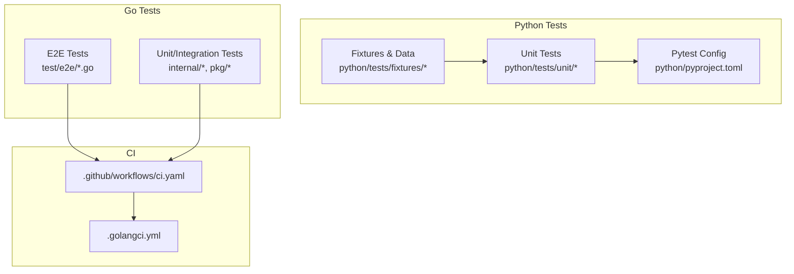
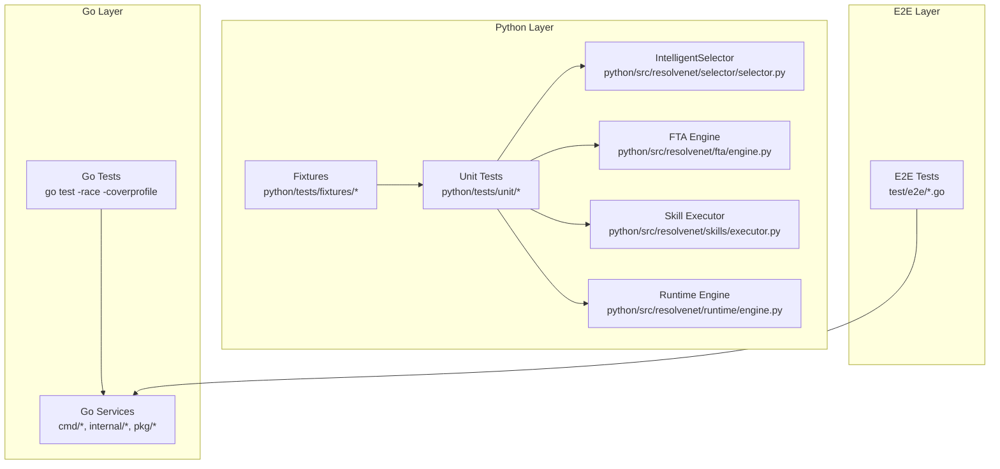
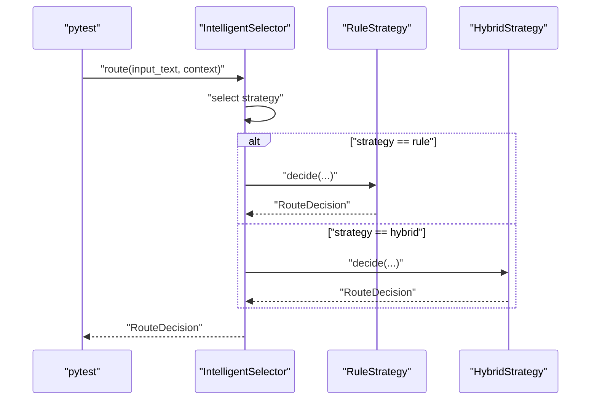
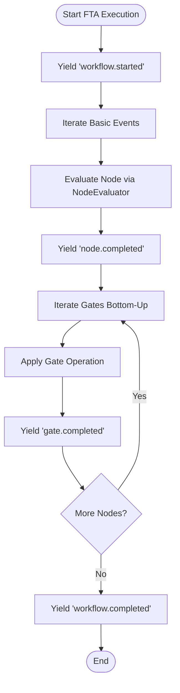
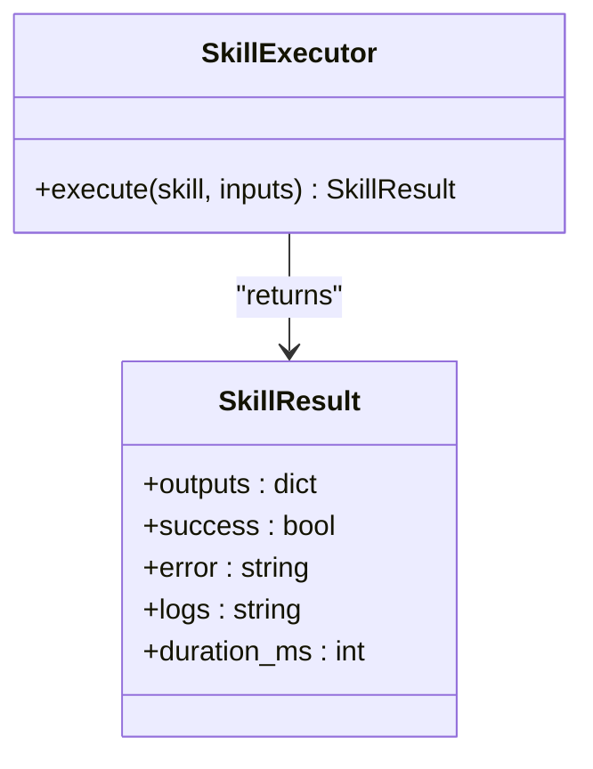
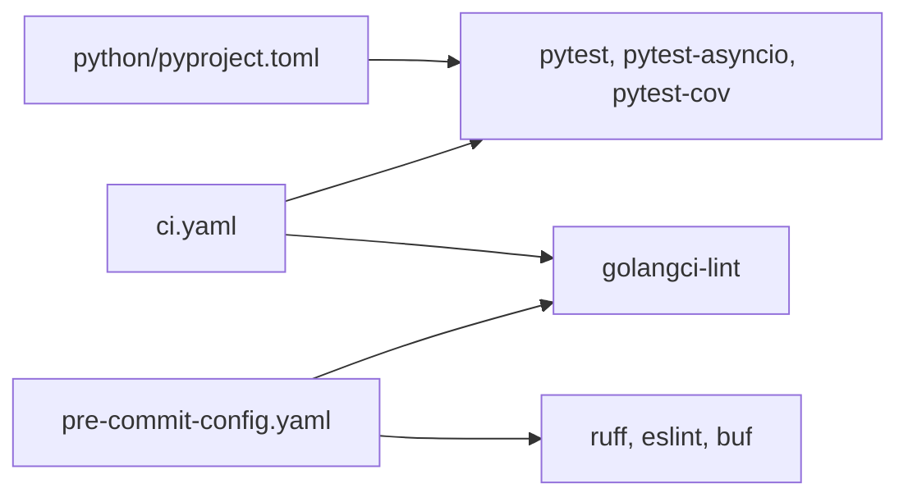

# Testing Strategy

<cite>
**Referenced Files in This Document**
- [pyproject.toml](file://python/pyproject.toml)
- [conftest.py](file://python/tests/conftest.py)
- [sample_fta_tree.yaml](file://python/tests/fixtures/sample_fta_tree.yaml)
- [test_fta_engine.py](file://python/tests/unit/test_fta_engine.py)
- [test_selector.py](file://python/tests/unit/test_selector.py)
- [test_rag_pipeline.py](file://python/tests/unit/test_rag_pipeline.py)
- [test_skill_loader.py](file://python/tests/unit/test_skill_loader.py)
- [ci.yaml](file://.github/workflows/ci.yaml)
- [.golangci.yml](file://.golangci.yml)
- [.pre-commit-config.yaml](file://.pre-commit-config.yaml)
- [selector.py](file://python/src/resolvenet/selector/selector.py)
- [engine.py](file://python/src/resolvenet/fta/engine.py)
- [executor.py](file://python/src/resolvenet/skills/executor.py)
- [engine.py](file://python/src/resolvenet/runtime/engine.py)
- [agent_lifecycle_test.go](file://test/e2e/agent_lifecycle_test.go)
- [workflow_execution_test.go](file://test/e2e/workflow_execution_test.go)
- [go.mod](file://go.mod)
</cite>

## Table of Contents
1. [Introduction](#introduction)
2. [Project Structure](#project-structure)
3. [Core Components](#core-components)
4. [Architecture Overview](#architecture-overview)
5. [Detailed Component Analysis](#detailed-component-analysis)
6. [Dependency Analysis](#dependency-analysis)
7. [Performance Considerations](#performance-considerations)
8. [Troubleshooting Guide](#troubleshooting-guide)
9. [Conclusion](#conclusion)
10. [Appendices](#appendices)

## Introduction
This document describes ResolveNet’s multi-layered testing strategy across Python units, Go backend services, and end-to-end workflows. It covers the testing frameworks, test organization, fixtures and data management, mocking strategies, continuous integration pipeline, and best practices for asynchronous operations, external dependencies, and performance testing. It also provides practical guidance for writing effective tests for selectors, FTA engines, skill executors, and API endpoints, along with debugging, coverage analysis, and maintaining test reliability.

## Project Structure
The repository organizes tests by language and scope:
- Python tests live under python/tests with unit tests and shared fixtures.
- Go end-to-end tests live under test/e2e.
- Continuous integration is defined in .github/workflows/ci.yaml.
- Linters and pre-commit hooks define quality gates for Go and Python.

**Diagram sources**
- [ci.yaml:1-89](file://.github/workflows/ci.yaml#L1-L89)
- [pyproject.toml:63-66](file://python/pyproject.toml#L63-L66)
- [agent_lifecycle_test.go:1-13](file://test/e2e/agent_lifecycle_test.go#L1-L13)
- [workflow_execution_test.go:1-13](file://test/e2e/workflow_execution_test.go#L1-L13)
- [.golangci.yml:1-69](file://.golangci.yml#L1-L69)

**Section sources**
- [ci.yaml:1-89](file://.github/workflows/ci.yaml#L1-L89)
- [pyproject.toml:63-66](file://python/pyproject.toml#L63-L66)
- [conftest.py:1-44](file://python/tests/conftest.py#L1-L44)
- [sample_fta_tree.yaml:1-23](file://python/tests/fixtures/sample_fta_tree.yaml#L1-L23)
- [agent_lifecycle_test.go:1-13](file://test/e2e/agent_lifecycle_test.go#L1-L13)
- [workflow_execution_test.go:1-13](file://test/e2e/workflow_execution_test.go#L1-L13)

## Core Components
- Python unit tests use pytest with asyncio support and coverage reporting.
- Shared fixtures provide reusable test data (e.g., fault trees).
- Go tests leverage the standard testing package with race detection and coverage.
- CI orchestrates linting, unit tests, and builds across languages.

Key configuration highlights:
- Python pytest configuration sets testpaths and asyncio_mode.
- Python optional dev dependencies include pytest, pytest-asyncio, and pytest-cov.
- CI installs Python dependencies via uv and runs pytest with coverage.
- Go tests run with race detection and upload coverage to Codecov.

**Section sources**
- [pyproject.toml:31-42](file://python/pyproject.toml#L31-L42)
- [pyproject.toml:63-66](file://python/pyproject.toml#L63-L66)
- [ci.yaml:51-62](file://.github/workflows/ci.yaml#L51-L62)
- [ci.yaml:38-50](file://.github/workflows/ci.yaml#L38-L50)

## Architecture Overview
The testing architecture spans three layers:
- Unit tests for Python components (selectors, FTA engine, RAG pipeline, skill loader).
- Go-based service tests (unit/integration) for backend services.
- End-to-end tests for complete workflows (agent lifecycle and workflow execution).

**Diagram sources**
- [selector.py:24-100](file://python/src/resolvenet/selector/selector.py#L24-L100)
- [engine.py:14-83](file://python/src/resolvenet/fta/engine.py#L14-L83)
- [executor.py:14-85](file://python/src/resolvenet/skills/executor.py#L14-L85)
- [engine.py:14-89](file://python/src/resolvenet/runtime/engine.py#L14-L89)
- [agent_lifecycle_test.go:1-13](file://test/e2e/agent_lifecycle_test.go#L1-L13)
- [workflow_execution_test.go:1-13](file://test/e2e/workflow_execution_test.go#L1-L13)

## Detailed Component Analysis

### Python Unit Tests Organization
- Test discovery is configured via pytest.ini_options to use tests/ as the test directory and asyncio_mode set to auto.
- Fixtures provide reusable data for tests, such as a sample fault tree used across multiple test modules.
- Test data is stored as YAML fixtures for structured inputs.

Recommended patterns:
- Use pytest fixtures to encapsulate setup and teardown for complex objects (e.g., fault trees).
- Keep tests deterministic by avoiding external randomness; inject mocks for external dependencies.
- Prefer parametrized tests for boundary conditions and cross-strategy validations.

**Section sources**
- [pyproject.toml:63-66](file://python/pyproject.toml#L63-L66)
- [conftest.py:8-44](file://python/tests/conftest.py#L8-L44)
- [sample_fta_tree.yaml:1-23](file://python/tests/fixtures/sample_fta_tree.yaml#L1-L23)

### Selectors
Selectors are asynchronous and support multiple routing strategies. Effective tests should:
- Validate route decisions and confidence bounds for rule, hybrid, and default strategies.
- Mock external LLM or rule evaluation to isolate selector logic.
- Verify that default strategy is hybrid.

**Diagram sources**
- [selector.py:43-100](file://python/src/resolvenet/selector/selector.py#L43-L100)
- [test_selector.py:8-30](file://python/tests/unit/test_selector.py#L8-L30)

**Section sources**
- [selector.py:24-100](file://python/src/resolvenet/selector/selector.py#L24-L100)
- [test_selector.py:8-30](file://python/tests/unit/test_selector.py#L8-L30)

### FTA Engines
FTA engines evaluate fault trees asynchronously and stream intermediate events. Effective tests should:
- Validate gate logic (AND, OR, voting) with various input combinations.
- Use the shared fault tree fixture to test traversal and evaluation order.
- Assert emitted events and their types during execution.

**Diagram sources**
- [engine.py:24-83](file://python/src/resolvenet/fta/engine.py#L24-L83)
- [test_fta_engine.py:7-40](file://python/tests/unit/test_fta_engine.py#L7-L40)
- [conftest.py:8-44](file://python/tests/conftest.py#L8-L44)

**Section sources**
- [engine.py:14-83](file://python/src/resolvenet/fta/engine.py#L14-L83)
- [test_fta_engine.py:7-40](file://python/tests/unit/test_fta_engine.py#L7-L40)
- [conftest.py:8-44](file://python/tests/conftest.py#L8-L44)

### Skill Executors
Skill executors run skills in a controlled environment and return structured results. Effective tests should:
- Validate successful execution paths and error handling.
- Assert result shape and metadata (success flag, duration, outputs).
- Mock skill callables to avoid external side effects.

**Diagram sources**
- [executor.py:14-85](file://python/src/resolvenet/skills/executor.py#L14-L85)

**Section sources**
- [executor.py:14-85](file://python/src/resolvenet/skills/executor.py#L14-L85)

### RAG Pipelines
RAG pipeline tests focus on chunking strategies and correctness of chunk boundaries. Effective tests should:
- Validate chunk sizes and overlaps for fixed and sentence strategies.
- Ensure robustness across varied input texts.

**Section sources**
- [test_rag_pipeline.py:6-19](file://python/tests/unit/test_rag_pipeline.py#L6-L19)

### Skill Manifests and Permissions
Tests validate default permissions and manifest creation. Effective tests should:
- Confirm default resource limits and permission flags.
- Verify manifest fields and defaults.

**Section sources**
- [test_skill_loader.py:6-24](file://python/tests/unit/test_skill_loader.py#L6-L24)

### API Endpoints
While API endpoint tests are not present in the repository, recommended patterns include:
- Using HTTP clients to send requests and assert response codes and JSON bodies.
- Mocking backend services to isolate endpoint logic.
- Parameterizing tests for different request shapes and error scenarios.

[No sources needed since this section provides general guidance]

### Go Backend Services
Go tests use the standard testing package with race detection and coverage. Effective patterns include:
- Using table-driven tests for gate logic and routing decisions.
- Mocking external dependencies (e.g., gRPC, databases) via interfaces.
- Running tests with -race to detect concurrency issues.

**Section sources**
- [ci.yaml:38-50](file://.github/workflows/ci.yaml#L38-L50)
- [.golangci.yml:1-69](file://.golangci.yml#L1-L69)
- [go.mod:1-52](file://go.mod#L1-L52)

### End-to-End Tests
Current E2E tests are placeholders that skip until infrastructure is available. Effective patterns include:
- Provisioning required services (databases, queues, model servers) via Docker Compose or Helm.
- Writing tests that validate full agent lifecycle and workflow execution flows.
- Capturing and asserting streaming events and final outcomes.

**Section sources**
- [agent_lifecycle_test.go:9-12](file://test/e2e/agent_lifecycle_test.go#L9-L12)
- [workflow_execution_test.go:9-12](file://test/e2e/workflow_execution_test.go#L9-L12)

## Dependency Analysis
Testing dependencies and integrations:
- Python pytest configuration depends on optional dev dependencies for async and coverage.
- CI depends on Go and Python toolchains, plus linters and coverage upload.
- Pre-commit enforces formatting and linting across Go, Python, and frontend code.

**Diagram sources**
- [pyproject.toml:31-42](file://python/pyproject.toml#L31-L42)
- [ci.yaml:13-37](file://.github/workflows/ci.yaml#L13-L37)
- [.golangci.yml:1-69](file://.golangci.yml#L1-L69)
- [.pre-commit-config.yaml:1-44](file://.pre-commit-config.yaml#L1-L44)

**Section sources**
- [pyproject.toml:31-42](file://python/pyproject.toml#L31-L42)
- [ci.yaml:13-37](file://.github/workflows/ci.yaml#L13-L37)
- [.golangci.yml:1-69](file://.golangci.yml#L1-L69)
- [.pre-commit-config.yaml:1-44](file://.pre-commit-config.yaml#L1-L44)

## Performance Considerations
- Asynchronous tests: Use pytest-asyncio to run async tests efficiently; avoid blocking calls in test fixtures.
- External dependencies: Mock expensive or slow services (LLMs, embeddings, databases) to keep tests fast and deterministic.
- Streaming components: For components that emit events (FTA engine, runtime engine), assert event sequences without consuming full streams unless necessary.
- Coverage: Enable coverage per language to identify hotspots and regressions; maintain thresholds in CI.

[No sources needed since this section provides general guidance]

## Troubleshooting Guide
Common issues and resolutions:
- Async test failures: Ensure asyncio_mode is set and use pytest.mark.asyncio for async tests.
- Fixture scope issues: Define fixtures with appropriate scopes (session/module/function) to avoid shared mutable state.
- External service flakiness: Use local mocks or in-memory backends; parameterize tests to simulate failure modes.
- Coverage gaps: Add targeted tests for low-coverage branches and edge cases; integrate coverage reporting in CI.
- Go race conditions: Run tests with -race and fix data races promptly; prefer immutable shared state.

**Section sources**
- [pyproject.toml:63-66](file://python/pyproject.toml#L63-L66)
- [ci.yaml:38-50](file://.github/workflows/ci.yaml#L38-L50)

## Conclusion
ResolveNet’s testing strategy combines robust Python unit tests with Go service tests and planned end-to-end workflows. The CI pipeline enforces quality through linting, unit tests, and coverage. By leveraging fixtures, mocks, and structured event assertions, teams can write reliable, maintainable tests across asynchronous operations and external dependencies while keeping performance and coverage in focus.

[No sources needed since this section summarizes without analyzing specific files]

## Appendices

### Writing Effective Tests: Checklist
- Selectors: Validate route types, confidence bounds, and default strategy.
- FTA Engines: Assert event types and evaluation order; test gate logic comprehensively.
- Skill Executors: Verify success/error paths, result shape, and timing metadata.
- RAG Pipelines: Check chunk boundaries and overlap for different strategies.
- API Endpoints: Use HTTP clients, mock backends, and parameterize error cases.
- Asynchronous Operations: Use pytest-asyncio; avoid blocking calls in fixtures.
- External Dependencies: Prefer mocks and in-memory backends; simulate failures.
- Performance: Measure durations; optimize heavy fixtures; avoid unnecessary network calls.
- Debugging: Capture logs and event streams; add targeted assertions for intermediate states.
- Coverage: Monitor per-language coverage; enforce minimum thresholds in CI.

[No sources needed since this section provides general guidance]