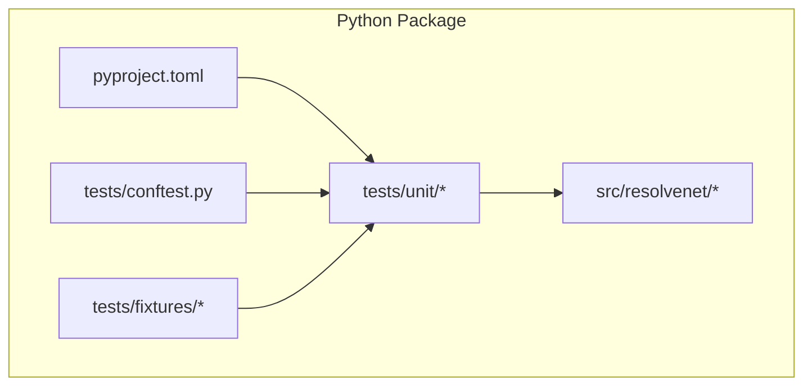
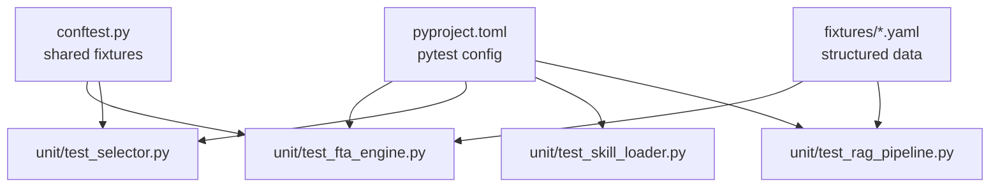
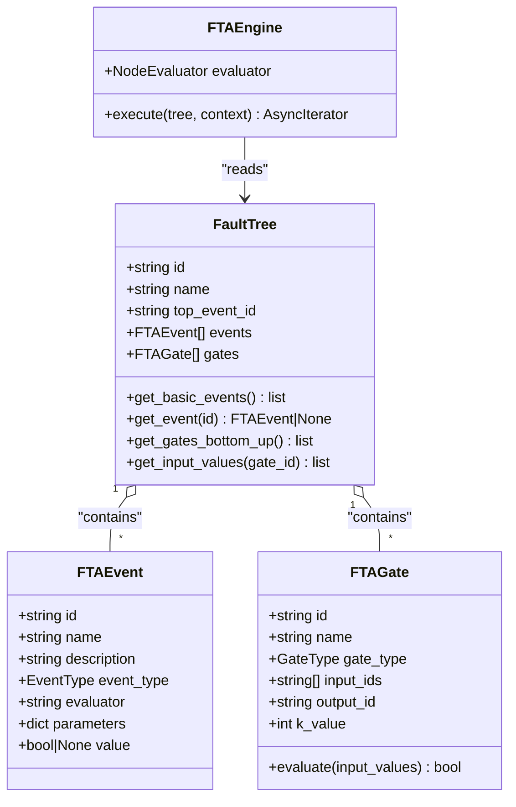
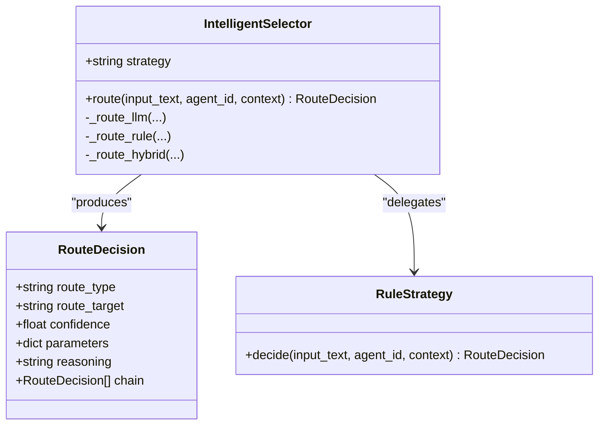
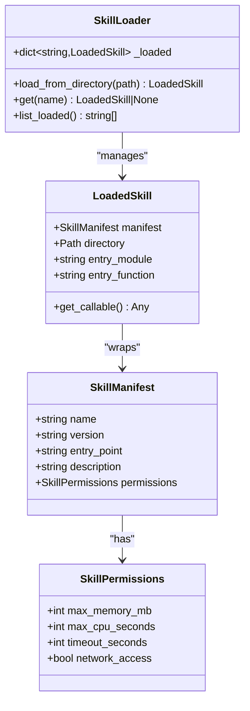
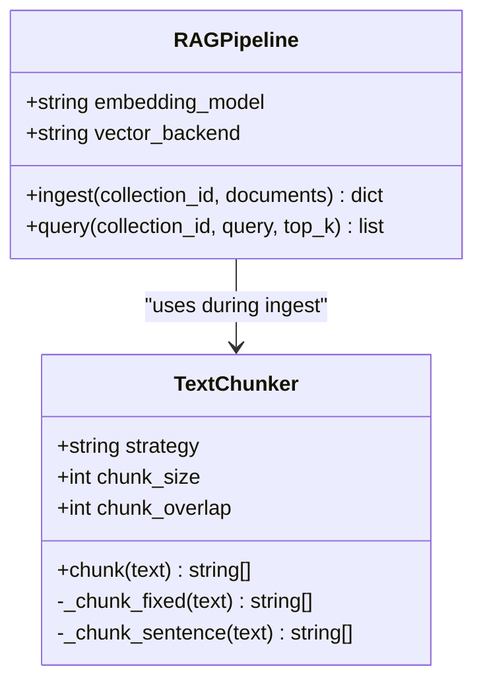
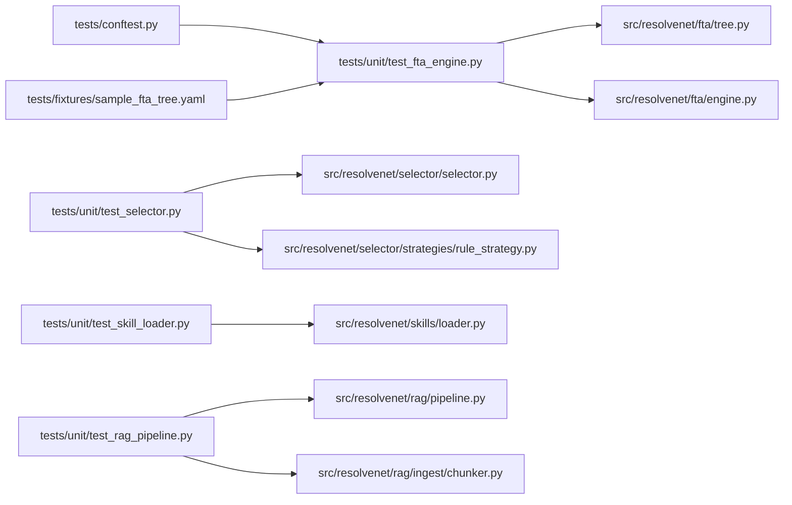

# Unit Testing

<cite>
**Referenced Files in This Document**
- [pyproject.toml](file://python/pyproject.toml)
- [conftest.py](file://python/tests/conftest.py)
- [sample_fta_tree.yaml](file://python/tests/fixtures/sample_fta_tree.yaml)
- [test_fta_engine.py](file://python/tests/unit/test_fta_engine.py)
- [test_selector.py](file://python/tests/unit/test_selector.py)
- [test_skill_loader.py](file://python/tests/unit/test_skill_loader.py)
- [test_rag_pipeline.py](file://python/tests/unit/test_rag_pipeline.py)
- [engine.py](file://python/src/resolvenet/fta/engine.py)
- [tree.py](file://python/src/resolvenet/fta/tree.py)
- [selector.py](file://python/src/resolvenet/selector/selector.py)
- [rule_strategy.py](file://python/src/resolvenet/selector/strategies/rule_strategy.py)
- [loader.py](file://python/src/resolvenet/skills/loader.py)
- [pipeline.py](file://python/src/resolvenet/rag/pipeline.py)
- [chunker.py](file://python/src/resolvenet/rag/ingest/chunker.py)
</cite>

## Table of Contents
1. [Introduction](#introduction)
2. [Project Structure](#project-structure)
3. [Core Components](#core-components)
4. [Architecture Overview](#architecture-overview)
5. [Detailed Component Analysis](#detailed-component-analysis)
6. [Dependency Analysis](#dependency-analysis)
7. [Performance Considerations](#performance-considerations)
8. [Troubleshooting Guide](#troubleshooting-guide)
9. [Conclusion](#conclusion)
10. [Appendices](#appendices)

## Introduction
This document describes ResolveNet’s unit testing approach using pytest. It covers the testing configuration, test organization, fixtures, and practical guidance for writing robust unit tests across FTA engines, selectors, skill loaders, and RAG pipelines. It also includes strategies for mocking external dependencies, handling asynchronous operations, ensuring test isolation, managing test data, and maintaining high test coverage.

## Project Structure
The Python testing stack is organized under the Python package with:
- pytest configuration via pyproject.toml
- Shared fixtures in conftest.py
- YAML fixtures for structured data
- Unit tests grouped by functional area under tests/unit

**Diagram sources**
- [pyproject.toml:63-66](file://python/pyproject.toml#L63-L66)
- [conftest.py:1-44](file://python/tests/conftest.py#L1-L44)
- [sample_fta_tree.yaml:1-23](file://python/tests/fixtures/sample_fta_tree.yaml#L1-L23)

**Section sources**
- [pyproject.toml:63-66](file://python/pyproject.toml#L63-L66)
- [conftest.py:1-44](file://python/tests/conftest.py#L1-L44)
- [sample_fta_tree.yaml:1-23](file://python/tests/fixtures/sample_fta_tree.yaml#L1-L23)

## Core Components
- pytest configuration: test discovery path and asyncio mode are configured centrally.
- Shared fixtures: reusable factories and data for tests.
- Test organization: focused per-feature modules under tests/unit.
- Optional RAG dependencies: declared for environments needing vector backends.

Key configuration highlights:
- Test discovery path set to tests
- Asyncio mode enabled for async-native tests
- Optional RAG extras and dev dependencies for testing and linting

**Section sources**
- [pyproject.toml:63-66](file://python/pyproject.toml#L63-L66)
- [pyproject.toml:31-42](file://python/pyproject.toml#L31-L42)

## Architecture Overview
The unit testing architecture centers on pytest with shared fixtures and targeted unit tests. Tests import production modules and assert behavior, often using fixtures to supply deterministic inputs.

**Diagram sources**
- [pyproject.toml:63-66](file://python/pyproject.toml#L63-L66)
- [conftest.py:8-44](file://python/tests/conftest.py#L8-L44)
- [sample_fta_tree.yaml:1-23](file://python/tests/fixtures/sample_fta_tree.yaml#L1-L23)
- [test_fta_engine.py:1-40](file://python/tests/unit/test_fta_engine.py#L1-L40)
- [test_selector.py:1-30](file://python/tests/unit/test_selector.py#L1-L30)
- [test_skill_loader.py:1-24](file://python/tests/unit/test_skill_loader.py#L1-L24)
- [test_rag_pipeline.py:1-19](file://python/tests/unit/test_rag_pipeline.py#L1-L19)

## Detailed Component Analysis

### FTA Engine and Tree
The FTA engine executes a fault tree asynchronously, yielding progress events and computing outcomes through gates. Tests validate gate logic and tree traversal helpers.

**Diagram sources**
- [tree.py:30-120](file://python/src/resolvenet/fta/tree.py#L30-L120)
- [engine.py:14-83](file://python/src/resolvenet/fta/engine.py#L14-L83)

Key testing patterns:
- Gate evaluation assertions for AND/OR/Voting logic
- Tree traversal helpers: get_basic_events, get_event, get_input_values
- Fixture-driven construction of FaultTree instances

**Section sources**
- [test_fta_engine.py:1-40](file://python/tests/unit/test_fta_engine.py#L1-L40)
- [tree.py:30-120](file://python/src/resolvenet/fta/tree.py#L30-L120)
- [engine.py:14-83](file://python/src/resolvenet/fta/engine.py#L14-L83)

### Selector and Routing Strategies
The IntelligentSelector routes inputs using pluggable strategies (rule, hybrid, llm). Tests validate async routing decisions and strategy selection.

**Diagram sources**
- [selector.py:13-100](file://python/src/resolvenet/selector/selector.py#L13-L100)
- [rule_strategy.py:11-77](file://python/src/resolvenet/selector/strategies/rule_strategy.py#L11-L77)

Asynchronous routing tests:
- Use pytest-asyncio markers to run async tests
- Assert route_type and confidence ranges
- Verify default strategy is hybrid

**Section sources**
- [test_selector.py:1-30](file://python/tests/unit/test_selector.py#L1-L30)
- [selector.py:24-100](file://python/src/resolvenet/selector/selector.py#L24-L100)
- [rule_strategy.py:35-77](file://python/src/resolvenet/selector/strategies/rule_strategy.py#L35-L77)

### Skill Loader and Manifests
The SkillLoader discovers and loads skills from directories, parsing manifests and importing entry points. Tests validate manifest defaults and loader behavior.

**Diagram sources**
- [loader.py:15-90](file://python/src/resolvenet/skills/loader.py#L15-L90)

Testing guidance:
- Validate default permission values
- Validate manifest creation and defaults
- Ensure loader imports entry points safely

**Section sources**
- [test_skill_loader.py:1-24](file://python/tests/unit/test_skill_loader.py#L1-L24)
- [loader.py:15-90](file://python/src/resolvenet/skills/loader.py#L15-L90)

### RAG Pipeline and Chunking
The RAG pipeline orchestrates ingestion and querying. Tests focus on chunking strategies and pipeline stubs.

**Diagram sources**
- [pipeline.py:11-75](file://python/src/resolvenet/rag/pipeline.py#L11-L75)
- [chunker.py:6-73](file://python/src/resolvenet/rag/ingest/chunker.py#L6-L73)

Testing guidance:
- Parameterized chunking tests for fixed and sentence strategies
- Validate chunk sizes and overlaps
- Stub pipeline methods for controlled assertions

**Section sources**
- [test_rag_pipeline.py:1-19](file://python/tests/unit/test_rag_pipeline.py#L1-L19)
- [pipeline.py:20-75](file://python/src/resolvenet/rag/pipeline.py#L20-L75)
- [chunker.py:25-73](file://python/src/resolvenet/rag/ingest/chunker.py#L25-L73)

## Dependency Analysis
Testing dependencies and coupling:
- Tests import production modules directly, keeping tests close to implementation
- Fixtures encapsulate shared setup (e.g., FaultTree) to reduce duplication
- YAML fixtures provide structured inputs for complex scenarios

**Diagram sources**
- [test_fta_engine.py:1-40](file://python/tests/unit/test_fta_engine.py#L1-L40)
- [test_selector.py:1-30](file://python/tests/unit/test_selector.py#L1-L30)
- [test_skill_loader.py:1-24](file://python/tests/unit/test_skill_loader.py#L1-L24)
- [test_rag_pipeline.py:1-19](file://python/tests/unit/test_rag_pipeline.py#L1-L19)
- [tree.py:82-120](file://python/src/resolvenet/fta/tree.py#L82-L120)
- [engine.py:24-83](file://python/src/resolvenet/fta/engine.py#L24-L83)
- [selector.py:24-100](file://python/src/resolvenet/selector/selector.py#L24-L100)
- [rule_strategy.py:35-77](file://python/src/resolvenet/selector/strategies/rule_strategy.py#L35-L77)
- [loader.py:15-90](file://python/src/resolvenet/skills/loader.py#L15-L90)
- [pipeline.py:20-75](file://python/src/resolvenet/rag/pipeline.py#L20-L75)
- [chunker.py:25-73](file://python/src/resolvenet/rag/ingest/chunker.py#L25-L73)
- [conftest.py:8-44](file://python/tests/conftest.py#L8-L44)
- [sample_fta_tree.yaml:1-23](file://python/tests/fixtures/sample_fta_tree.yaml#L1-L23)

**Section sources**
- [conftest.py:8-44](file://python/tests/conftest.py#L8-L44)
- [sample_fta_tree.yaml:1-23](file://python/tests/fixtures/sample_fta_tree.yaml#L1-L23)

## Performance Considerations
- Keep tests synchronous where possible; use async only for truly async components
- Prefer small, focused fixtures to minimize setup overhead
- Avoid heavy I/O in unit tests; mock external systems (LLMs, vector stores, filesystem)
- Use parameterized tests to cover multiple inputs efficiently

## Troubleshooting Guide
Common issues and remedies:
- Async test failures: ensure tests are marked appropriately and asyncio_mode is enabled
- Fixture scope mismatches: define session/module/class-scoped fixtures explicitly when needed
- External dependency errors: mock third-party integrations (e.g., LLM providers, Milvus/Qdrant) using patch decorators
- YAML fixture parsing: validate schema and handle missing keys gracefully in tests

**Section sources**
- [pyproject.toml:63-66](file://python/pyproject.toml#L63-L66)
- [conftest.py:8-44](file://python/tests/conftest.py#L8-L44)

## Conclusion
ResolveNet’s unit tests leverage pytest with centralized configuration, shared fixtures, and targeted modules. By focusing on deterministic fixtures, clear assertions, and strategic mocking, teams can maintain reliable tests across evolving components. Prioritize async-aware tests, isolate external dependencies, and continuously expand coverage for new features.

## Appendices

### Writing Effective Unit Tests
- Functions and Gates: assert truth tables and edge cases (empty inputs)
- Classes and Methods: instantiate with minimal required state; assert outputs and side effects
- Asynchronous Operations: mark tests with pytest-asyncio; await coroutines and assert yielded events
- Edge Cases: empty lists, None values, invalid enums, boundary conditions

### Mocking Strategies
- Replace external integrations with patch decorators around imports or method calls
- For selectors, mock strategy modules to return deterministic decisions
- For RAG pipelines, stub ingestion/query methods and return controlled results
- For skill loading, mock importlib to avoid real filesystem loads

### Test Isolation and Cleanup
- Use module-scoped fixtures for expensive resources; prefer function-scoped for isolation
- Avoid global mutable state; pass explicit parameters to functions
- Clean up temporary files or mocked state after tests if necessary

### Coverage and Reliability
- Run coverage reports periodically to identify untested paths
- Keep tests independent; avoid cross-test state sharing
- Review breaking changes against related tests to prevent regressions