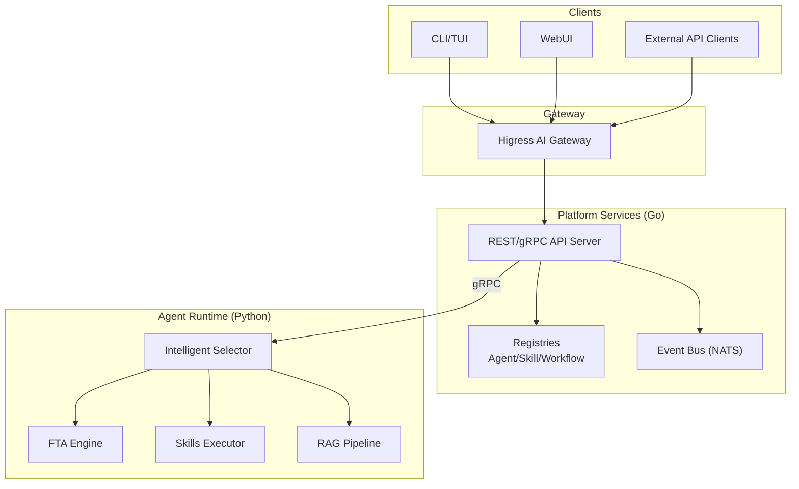
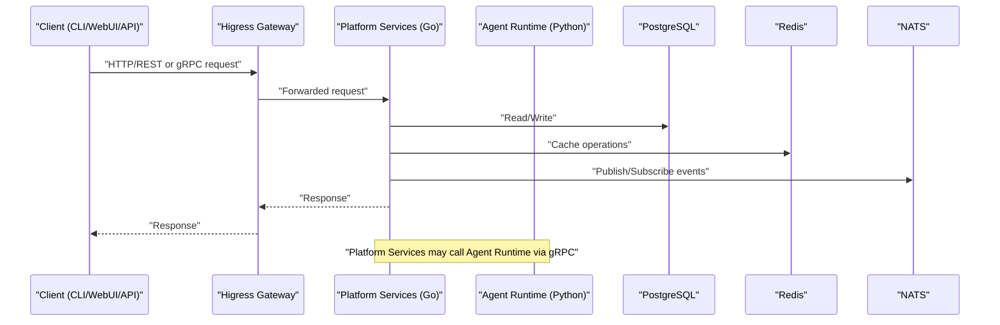
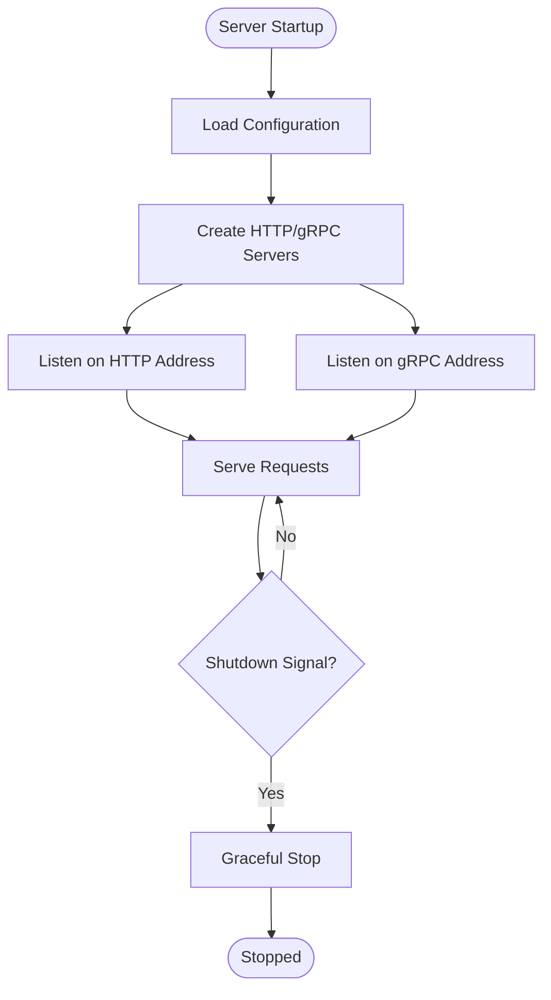
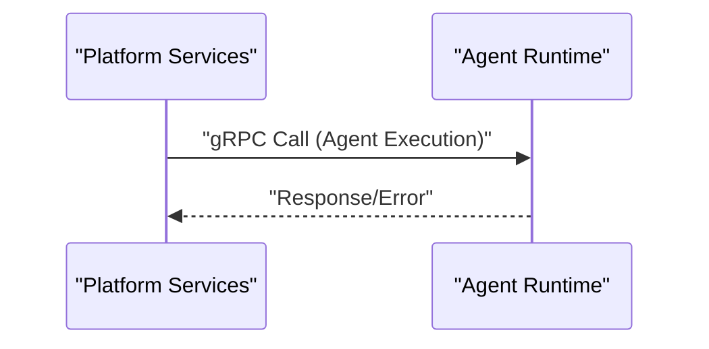
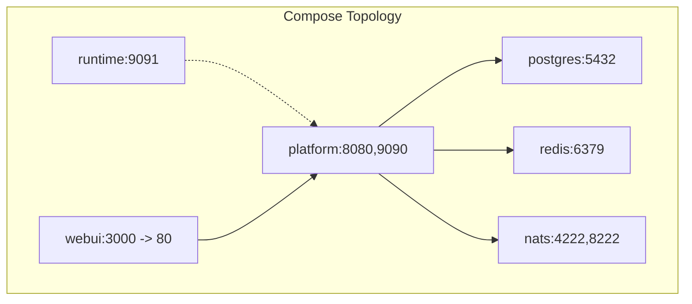

# Troubleshooting and FAQ

<cite>
**Referenced Files in This Document**
- [README.md](file://README.md)
- [resolvenet.yaml](file://configs/resolvenet.yaml)
- [runtime.yaml](file://configs/runtime.yaml)
- [docker-compose.yaml](file://deploy/docker-compose/docker-compose.yaml)
- [docker-compose.deps.yaml](file://deploy/docker-compose/docker-compose.deps.yaml)
- [main.go (server entrypoint)](file://cmd/resolvenet-server/main.go)
- [main.go (CLI entrypoint)](file://cmd/resolvenet-cli/main.go)
- [config.go](file://pkg/config/config.go)
- [server.go](file://pkg/server/server.go)
- [postgres.go](file://pkg/store/postgres/postgres.go)
- [redis.go](file://pkg/store/redis/redis.go)
- [nats.go](file://pkg/event/nats.go)
- [root.go](file://internal/cli/root.go)
- [logger.go](file://pkg/telemetry/logger.go)
- [metrics.go](file://pkg/telemetry/metrics.go)
- [tracer.go](file://pkg/telemetry/tracer.go)
- [SECURITY.md](file://SECURITY.md)
- [CONTRIBUTING.md](file://CONTRIBUTING.md)
</cite>

## Table of Contents
1. [Introduction](#introduction)
2. [Project Structure](#project-structure)
3. [Core Components](#core-components)
4. [Architecture Overview](#architecture-overview)
5. [Detailed Component Analysis](#detailed-component-analysis)
6. [Dependency Analysis](#dependency-analysis)
7. [Performance Considerations](#performance-considerations)
8. [Troubleshooting Guide](#troubleshooting-guide)
9. [Conclusion](#conclusion)
10. [Appendices](#appendices)

## Introduction
This document provides a comprehensive troubleshooting and FAQ guide for ResolveNet. It covers installation and setup issues, debugging techniques across platform services, agent runtime, and WebUI, performance tuning, integration challenges with external systems, authentication and connectivity diagnostics, deployment pitfalls, security-related troubleshooting, and frequently asked questions about architecture, feature limitations, and best practices. It also documents migration and upgrade considerations grounded in the repository’s configuration and deployment artifacts.

## Project Structure
ResolveNet is a cloud-native, multi-language platform composed of:
- Platform Services (Go): REST/gRPC API server, registries, event bus, and configuration management
- Agent Runtime (Python): Agent execution, Intelligent Selector, FTA/Skills/RAG
- CLI/TUI (Go): Command-line interface and terminal dashboard
- WebUI (React+TS): Management console and visual FTA editor
- Gateway (Higress): AI gateway for auth, rate limiting, and model routing

**Diagram sources**
- [README.md:14-46](file://README.md#L14-L46)
- [docker-compose.yaml:3-65](file://deploy/docker-compose/docker-compose.yaml#L3-L65)

**Section sources**
- [README.md:10-184](file://README.md#L10-L184)
- [docker-compose.yaml:1-65](file://deploy/docker-compose/docker-compose.yaml#L1-L65)

## Core Components
- Platform Services (Go): HTTP and gRPC servers, health checks, and reflection for debugging
- Agent Runtime (Python): Hosts gRPC server for agent execution and selector decisions
- CLI/TUI (Go): Cobra-based CLI with persistent configuration and subcommands
- WebUI (React+TS): Frontend that communicates with the Platform Services REST/gRPC
- Configuration: YAML files and environment variables with Viper precedence
- Telemetry: Structured logging, metrics, and tracing placeholders

Key configuration files:
- Platform configuration: [resolvenet.yaml](file://configs/resolvenet.yaml)
- Runtime configuration: [runtime.yaml](file://configs/runtime.yaml)
- Platform defaults and env overrides: [config.go](file://pkg/config/config.go)
- Deployment composition: [docker-compose.yaml](file://deploy/docker-compose/docker-compose.yaml), [docker-compose.deps.yaml](file://deploy/docker-compose/docker-compose.deps.yaml)

**Section sources**
- [resolvenet.yaml:1-34](file://configs/resolvenet.yaml#L1-L34)
- [runtime.yaml:1-18](file://configs/runtime.yaml#L1-L18)
- [config.go:10-62](file://pkg/config/config.go#L10-L62)
- [docker-compose.yaml:1-65](file://deploy/docker-compose/docker-compose.yaml#L1-L65)
- [docker-compose.deps.yaml:1-37](file://deploy/docker-compose/docker-compose.deps.yaml#L1-L37)

## Architecture Overview
ResolveNet’s runtime architecture separates concerns:
- Platform Services expose REST and gRPC APIs and manage registries and events
- Agent Runtime exposes a gRPC endpoint for agent execution and selector decisions
- Gateway handles authentication, rate limiting, and model routing
- WebUI and CLI/TUI consume Platform Services APIs

**Diagram sources**
- [README.md:22-46](file://README.md#L22-L46)
- [resolvenet.yaml:7-23](file://configs/resolvenet.yaml#L7-L23)
- [runtime.yaml:3-5](file://configs/runtime.yaml#L3-L5)

## Detailed Component Analysis

### Platform Services (Go)
- Entry point: [main.go (server entrypoint):16-55](file://cmd/resolvenet-server/main.go#L16-L55)
- Server initialization and startup: [server.go:27-52](file://pkg/server/server.go#L27-L52)
- HTTP/gRPC server lifecycle and graceful shutdown: [server.go:54-103](file://pkg/server/server.go#L54-L103)
- Configuration loading and defaults: [config.go:10-62](file://pkg/config/config.go#L10-L62)

Common issues and resolutions:
- Port binding conflicts: Verify HTTP and gRPC addresses in [resolvenet.yaml:3-6](file://configs/resolvenet.yaml#L3-L6) and environment overrides. Confirm host machine ports are free or adjust configuration.
- Configuration precedence: Environment variables override YAML via [config.go:44-47](file://pkg/config/config.go#L44-L47). Ensure RESOLVENET_* variables match expected keys.
- Graceful shutdown: The server listens for SIGINT/SIGTERM and shuts down gracefully; confirm signals are not intercepted by parent processes.

**Diagram sources**
- [main.go (server entrypoint):16-55](file://cmd/resolvenet-server/main.go#L16-L55)
- [server.go:54-103](file://pkg/server/server.go#L54-L103)

**Section sources**
- [main.go (server entrypoint):16-55](file://cmd/resolvenet-server/main.go#L16-L55)
- [server.go:27-103](file://pkg/server/server.go#L27-L103)
- [config.go:10-62](file://pkg/config/config.go#L10-L62)
- [resolvenet.yaml:3-6](file://configs/resolvenet.yaml#L3-L6)

### Agent Runtime (Python)
- Runtime gRPC address: [runtime.yaml:3-5](file://configs/runtime.yaml#L3-L5)
- Platform Services runtime gRPC address: [resolvenet.yaml:22-23](file://configs/resolvenet.yaml#L22-L23)
- Deployment exposure: [docker-compose.yaml:21-29](file://deploy/docker-compose/docker-compose.yaml#L21-L29)

Common issues and resolutions:
- gRPC connectivity failures: Ensure runtime address matches between [runtime.yaml:3-5](file://configs/runtime.yaml#L3-L5) and [resolvenet.yaml:22-23](file://configs/resolvenet.yaml#L22-L23). Confirm container networking in [docker-compose.yaml:14-15](file://deploy/docker-compose/docker-compose.yaml#L14-L15).
- Port conflicts: Change runtime port in [runtime.yaml:4-5](file://configs/runtime.yaml#L4-L5) and expose it accordingly in [docker-compose.yaml:25-29](file://deploy/docker-compose/docker-compose.yaml#L25-L29).

**Diagram sources**
- [resolvenet.yaml:22-23](file://configs/resolvenet.yaml#L22-L23)
- [runtime.yaml:3-5](file://configs/runtime.yaml#L3-L5)
- [docker-compose.yaml:21-29](file://deploy/docker-compose/docker-compose.yaml#L21-L29)

**Section sources**
- [runtime.yaml:1-18](file://configs/runtime.yaml#L1-L18)
- [resolvenet.yaml:22-23](file://configs/resolvenet.yaml#L22-L23)
- [docker-compose.yaml:21-29](file://deploy/docker-compose/docker-compose.yaml#L21-L29)

### CLI/TUI (Go)
- Entry point: [main.go (CLI entrypoint):9-13](file://cmd/resolvenet-cli/main.go#L9-L13)
- Root command and configuration: [root.go:19-71](file://internal/cli/root.go#L19-L71)

Common issues and resolutions:
- Config file location: CLI searches `$HOME/.resolvenet/config.yaml` by default; specify with --config if using a custom path.
- Server address override: Use --server flag to target a non-default platform address.

**Section sources**
- [main.go (CLI entrypoint):9-13](file://cmd/resolvenet-cli/main.go#L9-L13)
- [root.go:19-71](file://internal/cli/root.go#L19-L71)

### WebUI
- Exposed port mapping: [docker-compose.yaml:31-38](file://deploy/docker-compose/docker-compose.yaml#L31-L38)
- Communication: WebUI calls Platform Services REST/gRPC endpoints exposed by the platform container.

Common issues and resolutions:
- Port conflicts: Adjust host port mapping in [docker-compose.yaml:35-36](file://deploy/docker-compose/docker-compose.yaml#L35-L36) if port 3000 is busy.
- Connectivity: Ensure the WebUI can reach the platform service at the configured address.

**Section sources**
- [docker-compose.yaml:31-38](file://deploy/docker-compose/docker-compose.yaml#L31-L38)

### Configuration Loading and Defaults
- Viper precedence: Environment variables override YAML; defaults are set in [config.go:14-31](file://pkg/config/config.go#L14-L31)
- Configuration files searched: [config.go:33-42](file://pkg/config/config.go#L33-L42)
- Example platform config: [resolvenet.yaml:1-34](file://configs/resolvenet.yaml#L1-L34)
- Example runtime config: [runtime.yaml:1-18](file://configs/runtime.yaml#L1-L18)

Common issues and resolutions:
- Missing config file: Viper ignores missing files; ensure the correct path or environment variables are set.
- Wrong environment variable names: Keys are transformed by replacing dots with underscores (e.g., server.http_addr becomes RESOLVENET_SERVER_HTTP_ADDR).

**Section sources**
- [config.go:10-62](file://pkg/config/config.go#L10-L62)
- [resolvenet.yaml:1-34](file://configs/resolvenet.yaml#L1-L34)
- [runtime.yaml:1-18](file://configs/runtime.yaml#L1-L18)

### Telemetry and Logging
- Logger creation supports JSON/text formats and levels: [logger.go:8-35](file://pkg/telemetry/logger.go#L8-L35)
- Metrics and tracer are placeholders; enablement controlled by configuration flags: [metrics.go:7-12](file://pkg/telemetry/metrics.go#L7-L12), [tracer.go:8-21](file://pkg/telemetry/tracer.go#L8-L21)

Common issues and resolutions:
- Logs not visible: Ensure logger level and format are set appropriately.
- Telemetry disabled: Enable telemetry flags in [resolvenet.yaml:29-33](file://configs/resolvenet.yaml#L29-L33) and configure OTLP endpoints.

**Section sources**
- [logger.go:8-35](file://pkg/telemetry/logger.go#L8-L35)
- [metrics.go:7-12](file://pkg/telemetry/metrics.go#L7-L12)
- [tracer.go:8-21](file://pkg/telemetry/tracer.go#L8-L21)
- [resolvenet.yaml:29-33](file://configs/resolvenet.yaml#L29-L33)

## Dependency Analysis
ResolveNet relies on several external services. The deployment composes them with explicit port mappings and environment overrides.

**Diagram sources**
- [docker-compose.yaml:3-65](file://deploy/docker-compose/docker-compose.yaml#L3-L65)

**Section sources**
- [docker-compose.yaml:3-65](file://deploy/docker-compose/docker-compose.yaml#L3-L65)
- [docker-compose.deps.yaml:1-37](file://deploy/docker-compose/docker-compose.deps.yaml#L1-L37)

## Performance Considerations
- CPU and memory: Tune agent pool sizing and selector thresholds in [runtime.yaml:7-13](file://configs/runtime.yaml#L7-L13). Increase max_size cautiously and monitor resource usage.
- Database performance: Ensure PostgreSQL is tuned for concurrent connections and query patterns. Use connection pooling in production (placeholder exists in [postgres.go](file://pkg/store/postgres/postgres.go#L13)).
- Cache performance: Redis is used for caching; validate latency and hit rates. Confirm address and DB selection in [resolvenet.yaml:15-17](file://configs/resolvenet.yaml#L15-L17).
- Event bus throughput: NATS JetStream is used for events; ensure NATS is healthy and not overloaded. See [nats.go:8-45](file://pkg/event/nats.go#L8-L45).
- Gateway overhead: Higress adds latency; profile end-to-end paths and consider enabling compression and connection reuse.

[No sources needed since this section provides general guidance]

## Troubleshooting Guide

### Installation and Setup
- Dependency conflicts:
  - Ensure Go >= 1.22, Python >= 3.11, Node.js >= 20, and Docker/Docker Compose are installed as per [README.md:61-66](file://README.md#L61-L66).
  - Use uv for Python and pnpm for Node as recommended in [README.md:63-66](file://README.md#L63-L66).
- Port binding problems:
  - Platform HTTP/gRPC ports: [resolvenet.yaml:3-6](file://configs/resolvenet.yaml#L3-L6)
  - Runtime gRPC port: [runtime.yaml:4-5](file://configs/runtime.yaml#L4-L5)
  - WebUI port mapping: [docker-compose.yaml:35-36](file://deploy/docker-compose/docker-compose.yaml#L35-L36)
  - NATS/JetStream ports: [docker-compose.yaml:56-61](file://deploy/docker-compose/docker-compose.yaml#L56-L61)
- Configuration errors:
  - Verify YAML syntax and paths; Viper searches multiple locations as per [config.go:33-42](file://pkg/config/config.go#L33-L42).
  - Use environment variables with RESOLVENET_ prefix; dot keys become underscored (see [config.go:44-47](file://pkg/config/config.go#L44-L47)).

**Section sources**
- [README.md:61-66](file://README.md#L61-L66)
- [resolvenet.yaml:3-6](file://configs/resolvenet.yaml#L3-L6)
- [runtime.yaml:3-5](file://configs/runtime.yaml#L3-L5)
- [docker-compose.yaml:35-61](file://deploy/docker-compose/docker-compose.yaml#L35-L61)
- [config.go:33-47](file://pkg/config/config.go#L33-L47)

### Debugging Techniques
- Platform Services:
  - Inspect logs emitted during startup and shutdown in [main.go (server entrypoint):16-55](file://cmd/resolvenet-server/main.go#L16-L55) and [server.go:54-103](file://pkg/server/server.go#L54-L103).
  - Enable gRPC reflection and health checks for easier inspection (see [server.go:34-42](file://pkg/server/server.go#L34-L42)).
- Agent Runtime:
  - Confirm runtime gRPC address alignment with [resolvenet.yaml:22-23](file://configs/resolvenet.yaml#L22-L23) and [runtime.yaml:3-5](file://configs/runtime.yaml#L3-L5).
  - Check container logs and network connectivity in [docker-compose.yaml:21-29](file://deploy/docker-compose/docker-compose.yaml#L21-L29).
- WebUI:
  - Validate frontend can reach the platform service; inspect browser network tab and console logs.
  - Adjust port mapping if needed in [docker-compose.yaml:31-38](file://deploy/docker-compose/docker-compose.yaml#L31-L38).

**Section sources**
- [main.go (server entrypoint):16-55](file://cmd/resolvenet-server/main.go#L16-L55)
- [server.go:34-42](file://pkg/server/server.go#L34-L42)
- [resolvenet.yaml:22-23](file://configs/resolvenet.yaml#L22-L23)
- [runtime.yaml:3-5](file://configs/runtime.yaml#L3-L5)
- [docker-compose.yaml:21-38](file://deploy/docker-compose/docker-compose.yaml#L21-L38)

### Performance Troubleshooting
- Slow queries:
  - Review database configuration and workload in [resolvenet.yaml:7-13](file://configs/resolvenet.yaml#L7-L13).
  - Implement connection pooling and migrations as indicated by [postgres.go:13-44](file://pkg/store/postgres/postgres.go#L13-L44).
- Memory usage:
  - Adjust agent pool size in [runtime.yaml:7-9](file://configs/runtime.yaml#L7-L9).
- CPU bottlenecks:
  - Reduce selector confidence threshold or strategy complexity in [runtime.yaml:11-13](file://configs/runtime.yaml#L11-L13).
  - Scale out runtime replicas and tune NATS throughput in [docker-compose.yaml:56-61](file://deploy/docker-compose/docker-compose.yaml#L56-L61).

**Section sources**
- [runtime.yaml:7-13](file://configs/runtime.yaml#L7-L13)
- [resolvenet.yaml:7-13](file://configs/resolvenet.yaml#L7-L13)
- [postgres.go:13-44](file://pkg/store/postgres/postgres.go#L13-L44)
- [docker-compose.yaml:56-61](file://deploy/docker-compose/docker-compose.yaml#L56-L61)

### Integration Issues
- Databases:
  - PostgreSQL host/port/user/password/dbname/sslmode in [resolvenet.yaml:7-13](file://configs/resolvenet.yaml#L7-L13).
  - Health checks and migrations are placeholders; implement in [postgres.go:27-44](file://pkg/store/postgres/postgres.go#L27-L44).
- Message brokers:
  - NATS URL in [resolvenet.yaml:19-20](file://configs/resolvenet.yaml#L19-L20); JetStream enabled in [docker-compose.deps.yaml](file://deploy/docker-compose/docker-compose.deps.yaml#L61).
  - Event bus operations are placeholders; implement in [nats.go:27-39](file://pkg/event/nats.go#L27-L39).
- LLM providers:
  - Provider abstractions exist in Python; ensure credentials and endpoints are configured in the Python runtime layer.

**Section sources**
- [resolvenet.yaml:7-20](file://configs/resolvenet.yaml#L7-L20)
- [docker-compose.deps.yaml:27-34](file://deploy/docker-compose/docker-compose.deps.yaml#L27-L34)
- [postgres.go:27-44](file://pkg/store/postgres/postgres.go#L27-L44)
- [nats.go:27-39](file://pkg/event/nats.go#L27-L39)

### Authentication and API Connectivity
- Authentication failures:
  - Higress gateway handles auth; verify admin URL and enablement in [resolvenet.yaml:25-27](file://configs/resolvenet.yaml#L25-L27).
  - Ensure clients use proper tokens and headers when calling the gateway.
- API connectivity problems:
  - Confirm platform HTTP/gRPC addresses in [resolvenet.yaml:3-6](file://configs/resolvenet.yaml#L3-L6).
  - Use CLI --server flag to target a non-default platform address as per [root.go:36-41](file://internal/cli/root.go#L36-L41).

**Section sources**
- [resolvenet.yaml:25-27](file://configs/resolvenet.yaml#L25-L27)
- [resolvenet.yaml:3-6](file://configs/resolvenet.yaml#L3-L6)
- [root.go:36-41](file://internal/cli/root.go#L36-L41)

### Deployment Issues
- Docker Compose:
  - Dependencies: [docker-compose.deps.yaml:1-37](file://deploy/docker-compose/docker-compose.deps.yaml#L1-L37)
  - Full stack: [docker-compose.yaml:1-65](file://deploy/docker-compose/docker-compose.yaml#L1-L65)
- Helm/Kubernetes:
  - Charts and templates are available under [deploy/helm/resolvenet](file://deploy/helm/resolvenet/Chart.yaml).

Common fixes:
- Network connectivity: Ensure service names align with DNS resolution inside containers (e.g., RESOLVENET_DATABASE_HOST=postgres).
- Port conflicts: Adjust host port mappings in compose files.

**Section sources**
- [docker-compose.deps.yaml:1-37](file://deploy/docker-compose/docker-compose.deps.yaml#L1-L37)
- [docker-compose.yaml:1-65](file://deploy/docker-compose/docker-compose.yaml#L1-L65)

### System Health Assessment
- Platform Services health:
  - gRPC health service registered in [server.go:37-39](file://pkg/server/server.go#L37-L39).
  - Use reflection for introspection in [server.go:41-42](file://pkg/server/server.go#L41-L42).
- External dependencies:
  - PostgreSQL/Redis/NATS health checks are placeholders; implement in [postgres.go:27-30](file://pkg/store/postgres/postgres.go#L27-L30), [redis.go:26-30](file://pkg/store/redis/redis.go#L26-L30), [nats.go:26-30](file://pkg/event/nats.go#L26-L30).

Diagnostic commands:
- Check platform service logs and readiness via health checks.
- Verify container connectivity using docker exec and curl/netstat inside containers.
- Confirm environment variable overrides are applied using echo or env inside containers.

**Section sources**
- [server.go:37-42](file://pkg/server/server.go#L37-L42)
- [postgres.go:27-30](file://pkg/store/postgres/postgres.go#L27-L30)
- [redis.go:26-30](file://pkg/store/redis/redis.go#L26-L30)
- [nats.go:26-30](file://pkg/event/nats.go#L26-L30)

### Security-Related Troubleshooting
- Permission issues:
  - Follow least privilege and keep dependencies updated as advised in [SECURITY.md:30-39](file://SECURITY.md#L30-L39).
- Certificate problems:
  - Configure SSL/TLS for PostgreSQL and gateway according to your environment; review [resolvenet.yaml:13-13](file://configs/resolvenet.yaml#L13-L13) and gateway settings in [resolvenet.yaml:25-27](file://configs/resolvenet.yaml#L25-L27).
- Access control:
  - Use Higress for authentication and RBAC; ensure policies are aligned with your deployment.

**Section sources**
- [SECURITY.md:30-39](file://SECURITY.md#L30-L39)
- [resolvenet.yaml:13-13](file://configs/resolvenet.yaml#L13-L13)
- [resolvenet.yaml:25-27](file://configs/resolvenet.yaml#L25-L27)

### Frequently Asked Questions (FAQ)
- Why does the platform fail to start?
  - Check configuration loading and port availability; see [config.go:33-62](file://pkg/config/config.go#L33-L62) and [server.go:54-103](file://pkg/server/server.go#L54-L103).
- Why can’t the WebUI connect to the backend?
  - Verify platform address and port mapping in [docker-compose.yaml:31-38](file://deploy/docker-compose/docker-compose.yaml#L31-L38) and [resolvenet.yaml:3-6](file://configs/resolvenet.yaml#L3-L6).
- Why does the agent runtime fail to respond?
  - Confirm runtime gRPC address alignment in [resolvenet.yaml:22-23](file://configs/resolvenet.yaml#L22-L23) and [runtime.yaml:3-5](file://configs/runtime.yaml#L3-L5).
- How do I scale the system?
  - Scale runtime replicas and ensure NATS/JetStream can handle increased load as per [docker-compose.deps.yaml:27-34](file://deploy/docker-compose/docker-compose.deps.yaml#L27-L34).
- What telemetry is supported?
  - Metrics and tracing are placeholders; enable in [resolvenet.yaml:29-33](file://configs/resolvenet.yaml#L29-L33) and implement in [metrics.go:7-12](file://pkg/telemetry/metrics.go#L7-L12) and [tracer.go:8-21](file://pkg/telemetry/tracer.go#L8-L21).

**Section sources**
- [config.go:33-62](file://pkg/config/config.go#L33-L62)
- [server.go:54-103](file://pkg/server/server.go#L54-L103)
- [docker-compose.yaml:31-38](file://deploy/docker-compose/docker-compose.yaml#L31-L38)
- [resolvenet.yaml:3-6](file://configs/resolvenet.yaml#L3-L6)
- [resolvenet.yaml:22-23](file://configs/resolvenet.yaml#L22-L23)
- [runtime.yaml:3-5](file://configs/runtime.yaml#L3-L5)
- [docker-compose.deps.yaml:27-34](file://deploy/docker-compose/docker-compose.deps.yaml#L27-L34)
- [resolvenet.yaml:29-33](file://configs/resolvenet.yaml#L29-L33)
- [metrics.go:7-12](file://pkg/telemetry/metrics.go#L7-L12)
- [tracer.go:8-21](file://pkg/telemetry/tracer.go#L8-L21)

### Migration and Compatibility
- Upgrading dependencies:
  - Review prerequisites and toolchain versions in [README.md:61-66](file://README.md#L61-L66).
- Configuration migrations:
  - Use Viper’s automatic environment mapping as per [config.go:44-47](file://pkg/config/config.go#L44-L47) to minimize breaking changes.
- Database schema changes:
  - Implement migrations in [postgres.go:39-44](file://pkg/store/postgres/postgres.go#L39-L44) and coordinate with deployments.
- Breaking changes:
  - Follow contribution guidelines and RFC process described in [CONTRIBUTING.md:81-88](file://CONTRIBUTING.md#L81-L88).

**Section sources**
- [README.md:61-66](file://README.md#L61-L66)
- [config.go:44-47](file://pkg/config/config.go#L44-L47)
- [postgres.go:39-44](file://pkg/store/postgres/postgres.go#L39-L44)
- [CONTRIBUTING.md:81-88](file://CONTRIBUTING.md#L81-L88)

## Conclusion
This guide consolidates practical troubleshooting steps and FAQs for ResolveNet across installation, configuration, debugging, performance, integrations, deployment, and security. Use the referenced files and diagrams to quickly diagnose and resolve issues, and consult the FAQ for architecture and operational best practices.

## Appendices
- Development and testing commands are documented in [README.md:68-86](file://README.md#L68-L86) and [CONTRIBUTING.md:25-43](file://CONTRIBUTING.md#L25-L43).
- Security reporting and best practices are outlined in [SECURITY.md:9-39](file://SECURITY.md#L9-L39).