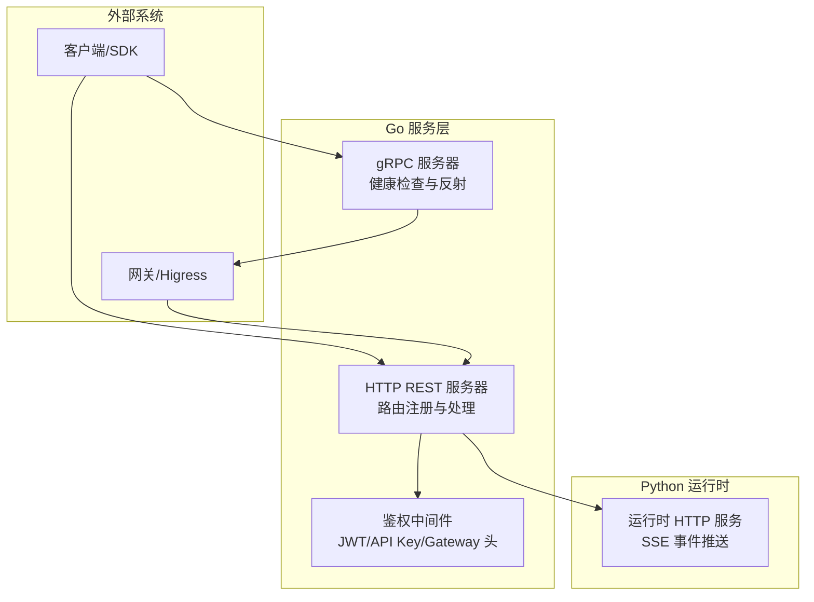
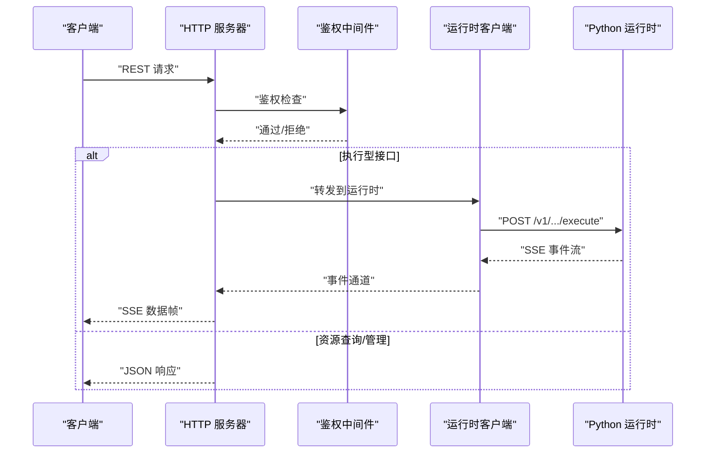
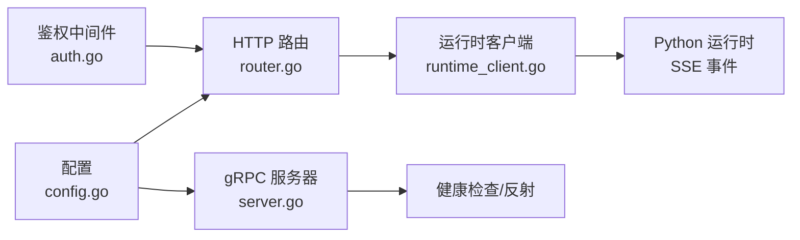

# API 参考文档

<cite>
**本文档引用的文件**
- [resolveagent.yaml](file://api/openapi/v1/resolveagent.yaml)
- [agent.proto](file://api/proto/resolveagent/v1/agent.proto)
- [common.proto](file://api/proto/resolveagent/v1/common.proto)
- [platform.proto](file://api/proto/resolveagent/v1/platform.proto)
- [rag.proto](file://api/proto/resolveagent/v1/rag.proto)
- [registry.proto](file://api/proto/resolveagent/v1/registry.proto)
- [selector.proto](file://api/proto/resolveagent/v1/selector.proto)
- [skill.proto](file://api/proto/resolveagent/v1/skill.proto)
- [workflow.proto](file://api/proto/resolveagent/v1/workflow.proto)
- [router.go](file://pkg/server/router.go)
- [server.go](file://pkg/server/server.go)
- [runtime_client.go](file://pkg/server/runtime_client.go)
- [corpus_handler.go](file://pkg/server/corpus_handler.go)
- [solution_handler.go](file://pkg/server/solution_handler.go)
- [auth.go](file://pkg/server/middleware/auth.go)
- [config.go](file://pkg/config/config.go)
</cite>

## 目录
1. [简介](#简介)
2. [项目结构](#项目结构)
3. [核心组件](#核心组件)
4. [架构总览](#架构总览)
5. [详细组件分析](#详细组件分析)
6. [依赖关系分析](#依赖关系分析)
7. [性能与扩展性](#性能与扩展性)
8. [故障排查指南](#故障排查指南)
9. [结论](#结论)
10. [附录](#附录)

## 简介
本参考文档面向 ResolveAgent 平台的开发者与集成方，系统性地梳理平台提供的 API 能力，包括：
- HTTP REST API：覆盖健康检查、系统信息、代理（Agent）、技能（Skill）、工作流（Workflow）、RAG、模型路由、配置、钩子、文档、内存、解决方案、调用图、流量采集与图谱等资源的管理与执行接口。
- gRPC 接口：基于 Protocol Buffers 定义的服务，涵盖代理服务、平台服务、RAG 服务、注册表服务、选择器服务、技能服务、工作流服务等。
- WebSocket/Server-Sent Events（SSE）流式接口：通过 HTTP SSE 将 Python 运行时的执行事件与进度事件实时推送到客户端。

文档同时给出认证方式、错误码说明、速率限制策略、版本控制与安全建议，并提供典型使用场景与请求/响应示例路径，帮助快速集成与排障。

## 项目结构
ResolveAgent 平台采用“Go 服务 + Python 运行时”的双层架构：
- Go 层提供 HTTP REST 与 gRPC 服务，负责路由、鉴权、资源编排与与 Python 运行时的桥接。
- Python 运行时负责具体业务执行（如代理执行、工作流执行、RAG 查询/导入、解决方案语义检索等），并通过 HTTP SSE 向 Go 层回传事件。

图表来源
- [server.go:20-81](file://pkg/server/server.go#L20-L81)
- [router.go:19-149](file://pkg/server/router.go#L19-L149)
- [runtime_client.go:16-36](file://pkg/server/runtime_client.go#L16-L36)

章节来源
- [server.go:20-81](file://pkg/server/server.go#L20-L81)
- [router.go:19-149](file://pkg/server/router.go#L19-L149)
- [config.go:14-38](file://pkg/config/config.go#L14-L38)

## 核心组件
- HTTP REST API：由 Go 服务注册路由并处理，部分执行类接口通过运行时客户端转发到 Python 运行时，再以 SSE 推送事件。
- gRPC 接口：由 Go 服务启动 gRPC 服务器，注册健康检查与反射，供内部或外部客户端直连。
- 鉴权中间件：支持 JWT、API Key 与网关透传头，可按路径白名单跳过鉴权。
- 运行时客户端：封装对 Python 运行时的 HTTP 调用，解析 SSE 事件流，统一返回通道。

章节来源
- [router.go:19-149](file://pkg/server/router.go#L19-L149)
- [runtime_client.go:16-36](file://pkg/server/runtime_client.go#L16-L36)
- [auth.go:34-103](file://pkg/server/middleware/auth.go#L34-L103)

## 架构总览
下图展示 HTTP REST 与 gRPC 的关键交互，以及与运行时的桥接关系：

图表来源
- [router.go:273-393](file://pkg/server/router.go#L273-L393)
- [runtime_client.go:67-139](file://pkg/server/runtime_client.go#L67-L139)

章节来源
- [router.go:273-393](file://pkg/server/router.go#L273-L393)
- [runtime_client.go:67-139](file://pkg/server/runtime_client.go#L67-L139)

## 详细组件分析

### HTTP REST API 参考

- 通用约定
  - 基础地址：默认 http://localhost:8080（可通过配置调整）
  - 认证：可选，支持 JWT、API Key 或网关透传头；健康/就绪探针等路径可跳过鉴权
  - 错误响应：统一为 JSON 对象，包含错误描述
  - 分页：列表接口通常返回数组与总数字段
  - 时间格式：遵循 RFC3339

- 健康与系统信息
  - GET /api/v1/health
    - 返回：状态对象（含状态与时间戳）
    - 示例路径：[handleHealth:151-156](file://pkg/server/router.go#L151-L156)
  - GET /api/v1/system/info
    - 返回：版本、提交、构建时间、服务器时间等
    - 示例路径：[handleSystemInfo:158-165](file://pkg/server/router.go#L158-L165)

- 代理（Agent）管理与执行
  - GET /api/v1/agents
    - 查询参数：type、status
    - 返回：agents 数组与 total
    - 示例路径：[handleListAgents:169-181](file://pkg/server/router.go#L169-L181)
  - POST /api/v1/agents
    - 请求体：代理定义（含 ID、名称、类型、状态、配置等）
    - 返回：创建的代理对象
    - 示例路径：[handleCreateAgent:183-220](file://pkg/server/router.go#L183-L220)
  - GET /api/v1/agents/{id}
    - 返回：指定代理详情
    - 示例路径：[handleGetAgent:222-233](file://pkg/server/router.go#L222-L233)
  - PUT /api/v1/agents/{id}
    - 请求体：更新后的代理定义
    - 返回：更新后的代理对象
    - 示例路径：[handleUpdateAgent:235-259](file://pkg/server/router.go#L235-L259)
  - DELETE /api/v1/agents/{id}
    - 返回：删除结果
    - 示例路径：[handleDeleteAgent:261-271](file://pkg/server/router.go#L261-L271)
  - POST /api/v1/agents/{id}/execute
    - 请求体：message、context、conversation_id、stream
    - 返回：SSE 事件流（内容片段、事件、错误、完成标记）
    - 示例路径：[handleExecuteAgent:273-393](file://pkg/server/router.go#L273-L393)
    - 运行时客户端：[ExecuteAgent:67-139](file://pkg/server/runtime_client.go#L67-L139)

- 技能（Skill）管理
  - GET /api/v1/skills
    - 返回：skills 数组与 total
    - 示例路径：[handleListSkills:397-409](file://pkg/server/router.go#L397-L409)
  - POST /api/v1/skills
    - 请求体：技能定义
    - 返回：创建的技能对象
    - 示例路径：[handleRegisterSkill:411-440](file://pkg/server/router.go#L411-L440)
  - GET /api/v1/skills/{name}
    - 返回：指定技能详情
    - 示例路径：[handleGetSkill:442-453](file://pkg/server/router.go#L442-L453)
  - DELETE /api/v1/skills/{name}
    - 返回：取消注册结果
    - 示例路径：[handleUnregisterSkill:455-465](file://pkg/server/router.go#L455-L465)

- 工作流（Workflow）管理与执行
  - GET /api/v1/workflows
    - 返回：workflows 数组与 total
    - 示例路径：[handleListWorkflows:469-481](file://pkg/server/router.go#L469-L481)
  - POST /api/v1/workflows
    - 请求体：工作流定义
    - 返回：创建的工作流对象
    - 示例路径：[handleCreateWorkflow:483-516](file://pkg/server/router.go#L483-L516)
  - GET /api/v1/workflows/{id}
    - 返回：指定工作流详情
    - 示例路径：[handleGetWorkflow:518-529](file://pkg/server/router.go#L518-L529)
  - PUT /api/v1/workflows/{id}
    - 返回：更新后的工作流对象
    - 示例路径：[handleUpdateWorkflow:531-555](file://pkg/server/router.go#L531-L555)
  - DELETE /api/v1/workflows/{id}
    - 返回：删除结果
    - 示例路径：[handleDeleteWorkflow:557-567](file://pkg/server/router.go#L557-L567)
  - POST /api/v1/workflows/{id}/validate
    - 返回：valid、errors 列表
    - 示例路径：[handleValidateWorkflow:569-683](file://pkg/server/router.go#L569-L683)
  - POST /api/v1/workflows/{id}/execute
    - 请求体：input、context
    - 返回：SSE 事件流（节点/门事件、完成/失败等）
    - 示例路径：[handleExecuteWorkflow:685-800](file://pkg/server/router.go#L685-L800)
    - 运行时客户端：[ExecuteWorkflow:147-219](file://pkg/server/runtime_client.go#L147-L219)

- RAG 管理
  - GET /api/v1/rag/collections
    - 返回：collections 数组与分页元数据
    - 示例路径：[handleListCollections:51-55](file://pkg/server/router.go#L51-L55)
  - POST /api/v1/rag/collections
    - 返回：创建的集合
    - 示例路径：[handleCreateCollection:51-55](file://pkg/server/router.go#L51-L55)
  - DELETE /api/v1/rag/collections/{id}
    - 返回：删除结果
    - 示例路径：[handleDeleteCollection:51-55](file://pkg/server/router.go#L51-L55)
  - POST /api/v1/rag/collections/{id}/ingest
    - 请求体：documents[]
    - 返回：处理统计与错误列表
    - 示例路径：[handleIngestDocuments:51-55](file://pkg/server/router.go#L51-L55)
  - POST /api/v1/rag/collections/{id}/query
    - 请求体：query、top_k、filters
    - 返回：检索块列表
    - 示例路径：[handleQueryCollection:51-55](file://pkg/server/router.go#L51-L55)

- 模型路由与配置
  - GET /api/v1/models
    - 返回：模型路由列表
    - 示例路径：[handleListModels:57-59](file://pkg/server/router.go#L57-L59)
  - POST /api/v1/models
    - 返回：新增模型路由
    - 示例路径：[handleAddModel:57-59](file://pkg/server/router.go#L57-L59)
  - GET /api/v1/config
    - 返回：当前配置
    - 示例路径：[handleGetConfig:61-63](file://pkg/server/router.go#L61-L63)
  - PUT /api/v1/config
    - 返回：更新后的配置
    - 示例路径：[handleUpdateConfig:61-63](file://pkg/server/router.go#L61-L63)

- 钩子（Hook）管理
  - GET /api/v1/hooks
  - POST /api/v1/hooks
  - GET /api/v1/hooks/{id}
  - PUT /api/v1/hooks/{id}
  - DELETE /api/v1/hooks/{id}
  - GET /api/v1/hooks/{id}/executions
  - 示例路径：[handleListHooks ~ handleListHookExecutions:65-71](file://pkg/server/router.go#L65-L71)

- 文档与知识库
  - RAG 文档：/api/v1/rag/collections/{id}/documents, /api/v1/rag/documents/{id}, /api/v1/rag/collections/{id}/ingestions
  - FTA 文档：/api/v1/fta/documents, /api/v1/fta/documents/{id}, /api/v1/fta/documents/{id}/results
  - 示例路径：[handleListRAGDocuments ~ handleListFTAResults:73-88](file://pkg/server/router.go#L73-L88)

- 内存与长程记忆
  - 会话：/api/v1/memory/agents/{agent_id}/conversations, /api/v1/memory/conversations/{id}, /api/v1/memory/conversations/{id}/messages, /api/v1/memory/prune
  - 长程记忆：/api/v1/memory/agents/{agent_id}/long-term, /api/v1/memory/long-term, /api/v1/memory/long-term/{id}
  - 示例路径：[handleListConversations ~ handlePruneMemories:102-113](file://pkg/server/router.go#L102-L113)

- 解决方案（Troubleshooting Solutions）
  - CRUD：/api/v1/solutions
  - 搜索：/api/v1/solutions/search
  - 批量导入：/api/v1/solutions/bulk
  - 执行记录：/api/v1/solutions/{id}/executions, /api/v1/solutions/{id}/executions
  - 示例路径：[solution_handler.go:15-247](file://pkg/server/solution_handler.go#L15-L247)

- 代码分析与流量分析
  - 代码分析：/api/v1/analyses, /api/v1/analyses/{id}, /api/v1/analyses/{id}/findings
  - 流量采集与图谱：/api/v1/traffic/captures, /api/v1/traffic/graphs
  - 示例路径：[handleListAnalyses ~ handleAnalyzeTrafficGraph:90-148](file://pkg/server/router.go#L90-L148)

- 调用图（Call Graph）
  - /api/v1/call-graphs, /api/v1/call-graphs/{id}, /api/v1/call-graphs/{id}/nodes, /api/v1/call-graphs/{id}/edges, /api/v1/call-graphs/{id}/subgraph
  - 示例路径：[handleListCallGraphs ~ handleGetCallGraphSubgraph:125-133](file://pkg/server/router.go#L125-L133)

- 语料导入（Corpus Import）
  - POST /api/v1/corpus/import
  - 请求体：source、import_types、rag_collection_id、profile、force_clone、dry_run
  - 返回：SSE 事件流
  - 示例路径：[handleCorpusImport:10-114](file://pkg/server/corpus_handler.go#L10-L114)
  - 运行时客户端：[ImportCorpus:396-471](file://pkg/server/runtime_client.go#L396-L471)

- SSE 事件格式
  - 内容片段：type=content/content_chunk，携带 content
  - 事件：type=event，携带 event.type、event.message、event.data、event.timestamp
  - 错误：type=error，携带 code、message
  - 完成：data: [DONE]
  - 示例路径：[handleExecuteAgent:340-387](file://pkg/server/router.go#L340-L387), [handleExecuteWorkflow:748-795](file://pkg/server/router.go#L748-L795)

章节来源
- [router.go:21-149](file://pkg/server/router.go#L21-L149)
- [solution_handler.go:15-247](file://pkg/server/solution_handler.go#L15-L247)
- [corpus_handler.go:10-114](file://pkg/server/corpus_handler.go#L10-L114)
- [runtime_client.go:67-139](file://pkg/server/runtime_client.go#L67-L139)

### gRPC 接口参考

- 服务概览
  - AgentService：代理生命周期与执行（含流式返回）
  - PlatformService：健康检查、系统信息、配置读取与更新
  - RAGService：RAG 集合与文档的增删查改、导入与检索
  - RegistryService：Go 注册表的查询、模型路由、服务端点发现、变更事件流
  - SelectorService：意图分类与路由决策
  - SkillService：技能注册、查询、测试
  - WorkflowService：FTA 工作流定义、校验、执行（流式）

- 关键消息与枚举
  - 公共消息：PaginationRequest/PaginationResponse、ResourceMeta、ResourceStatus、ErrorDetail
  - 执行消息：Execution、ExecutionStatus、RouteDecision、RouteType
  - RAG 消息：Collection、ChunkConfig、Document、RetrievedChunk
  - 注册表消息：RegistryAgent、RegistrySkill、RegistryWorkflow、ModelRouteInfo、ServiceEndpoint、RegistryEvent、EventType、ResourceType
  - 选择器消息：ClassifyIntentRequest/Response、RouteRequest/Response
  - 技能消息：Skill、SkillManifest、SkillParameter、SkillPermissions
  - 工作流消息：Workflow、FaultTree、FTAEvent、FTAGate、WorkflowEvent、WorkflowEventType

- 服务定义与方法
  - AgentService：CreateAgent、GetAgent、ListAgents、UpdateAgent、DeleteAgent、ExecuteAgent(stream)、GetExecution、ListExecutions
  - PlatformService：HealthCheck、GetConfig、UpdateConfig、GetSystemInfo
  - RAGService：CreateCollection、GetCollection、ListCollections、DeleteCollection、IngestDocuments、QueryCollection
  - RegistryService：GetAgent、ListAgents、GetSkill、ListSkills、GetModelRoute、ListModelRoutes、GetWorkflow、ListWorkflows、GetServiceEndpoint、WatchRegistry(stream)
  - SelectorService：ClassifyIntent、Route
  - SkillService：RegisterSkill、GetSkill、ListSkills、UnregisterSkill、TestSkill
  - WorkflowService：CreateWorkflow、GetWorkflow、ListWorkflows、UpdateWorkflow、DeleteWorkflow、ValidateWorkflow、ExecuteWorkflow(stream)

- 客户端实现要点
  - 使用标准 gRPC 客户端连接 Go 服务的 gRPC 地址
  - 对于流式 RPC，正确处理接收通道与上下文取消
  - 可启用反射用于调试

章节来源
- [agent.proto:11-29](file://api/proto/resolveagent/v1/agent.proto#L11-L29)
- [platform.proto:9-15](file://api/proto/resolveagent/v1/platform.proto#L9-L15)
- [rag.proto:10-18](file://api/proto/resolveagent/v1/rag.proto#L10-L18)
- [registry.proto:11-46](file://api/proto/resolveagent/v1/registry.proto#L11-L46)
- [selector.proto:10-14](file://api/proto/resolveagent/v1/selector.proto#L10-L14)
- [skill.proto:10-17](file://api/proto/resolveagent/v1/skill.proto#L10-L17)
- [workflow.proto:11-20](file://api/proto/resolveagent/v1/workflow.proto#L11-L20)

### WebSocket/Server-Sent Events（SSE）流式接口

- 适用场景
  - 代理执行流式输出
  - 工作流执行事件流
  - 语料导入进度事件流

- 协议细节
  - Content-Type: text/event-stream
  - Cache-Control: no-cache
  - Connection: keep-alive
  - 事件帧：data: {...}\n\n
  - 完成标记：data: [DONE]\n\n

- 事件类型
  - content/content_chunk：内容片段
  - event：执行/工作流事件（含类型、消息、数据、时间戳）
  - error：错误信息（code、message）

- 超时与断开
  - 上层 HTTP 层设置长超时（运行时客户端对某些操作使用无超时客户端）
  - 客户端需处理连接中断与重连逻辑

章节来源
- [router.go:318-393](file://pkg/server/router.go#L318-L393)
- [router.go:727-800](file://pkg/server/router.go#L727-L800)
- [corpus_handler.go:65-114](file://pkg/server/corpus_handler.go#L65-L114)
- [runtime_client.go:108-139](file://pkg/server/runtime_client.go#L108-L139)

### OpenAPI 规范（REST API）

- 版本：0.3.0
- 服务器：http://localhost:8080（开发环境）
- 标签：Agents、Skills、Workflows、Models、Health
- 路径与响应：详见 resolveagent.yaml 中的 paths 与 components.schemas

章节来源
- [resolveagent.yaml:1-163](file://api/openapi/v1/resolveagent.yaml#L1-L163)

## 依赖关系分析

图表来源
- [router.go:19-149](file://pkg/server/router.go#L19-L149)
- [runtime_client.go:16-36](file://pkg/server/runtime_client.go#L16-L36)
- [server.go:63-81](file://pkg/server/server.go#L63-L81)
- [auth.go:34-103](file://pkg/server/middleware/auth.go#L34-L103)
- [config.go:14-38](file://pkg/config/config.go#L14-L38)

章节来源
- [router.go:19-149](file://pkg/server/router.go#L19-L149)
- [server.go:63-81](file://pkg/server/server.go#L63-L81)
- [auth.go:34-103](file://pkg/server/middleware/auth.go#L34-L103)
- [config.go:14-38](file://pkg/config/config.go#L14-L38)

## 性能与扩展性
- 流式传输
  - SSE 事件逐帧推送，适合长耗时任务的进度反馈
  - 运行时客户端对导入等长时间任务使用无超时 HTTP 客户端
- 并发与队列
  - SSE 结果通道与错误通道使用带缓冲通道，避免阻塞
- 超时与取消
  - 上下文取消触发请求终止，客户端应妥善处理
- gRPC
  - 适合高吞吐、低延迟的内部通信；可结合负载均衡与健康检查

章节来源
- [runtime_client.go:32-36](file://pkg/server/runtime_client.go#L32-L36)
- [runtime_client.go:400-471](file://pkg/server/runtime_client.go#L400-L471)

## 故障排查指南
- 常见错误码与含义
  - 400：请求体解析失败、必填字段缺失
  - 401：未认证或认证失败
  - 404：资源不存在
  - 409：资源冲突（如重复创建）
  - 413：请求体过大（取决于服务器配置）
  - 500：服务器内部错误
  - 503：服务不可用（就绪检查失败）
- 健康检查
  - GET /api/v1/health：确认服务存活
  - GET /api/v1/system/info：确认版本与构建信息
- 鉴权问题
  - 确认是否启用了 JWT/API Key 或网关透传头
  - 检查跳过路径配置
- SSE 断流
  - 检查客户端是否正确处理 data: 行与 [DONE] 标记
  - 网络波动导致的连接中断需重连
- 运行时异常
  - 查看运行时健康端点与日志
  - 确认运行时地址与端口配置

章节来源
- [router.go:151-165](file://pkg/server/router.go#L151-L165)
- [auth.go:114-132](file://pkg/server/middleware/auth.go#L114-L132)
- [runtime_client.go:473-492](file://pkg/server/runtime_client.go#L473-L492)

## 结论
ResolveAgent 提供了完善的 REST API 与 gRPC 接口，配合运行时的 SSE 事件流，能够满足从资源管理到复杂执行流程的全栈需求。通过统一的鉴权中间件与清晰的错误处理，平台在安全性与可观测性方面具备良好基础。建议在生产环境中启用鉴权、配置合理的速率限制与超时策略，并结合网关进行访问控制与限流。

## 附录

### 认证与安全
- 支持方式
  - JWT：通过 Authorization: Bearer <token> 传递
  - API Key：通过 X-API-Key 或 Authorization: Bearer <key> 传递
  - 网关透传：X-Auth-User、X-Auth-Roles
- 配置项
  - 是否启用鉴权、JWT Issuer、API Key 名称、跳过路径
- 速率限制
  - 鉴权中间件支持为 API Key 设置速率限制（字段存在但具体实现需结合部署侧策略）

章节来源
- [auth.go:15-32](file://pkg/server/middleware/auth.go#L15-L32)
- [auth.go:114-132](file://pkg/server/middleware/auth.go#L114-L132)
- [auth.go:209-228](file://pkg/server/middleware/auth.go#L209-L228)

### 版本控制与兼容性
- REST API：OpenAPI 规范中声明版本号，建议客户端在请求头中携带版本信息
- gRPC：服务版本随 proto 文件版本演进，建议客户端与服务端保持一致的 proto 版本

章节来源
- [resolveagent.yaml:8-8](file://api/openapi/v1/resolveagent.yaml#L8-L8)
- [agent.proto:1-10](file://api/proto/resolveagent/v1/agent.proto#L1-L10)

### 常见用例与示例路径
- 创建并执行一个代理
  - POST /api/v1/agents → POST /api/v1/agents/{id}/execute
  - 示例路径：[handleCreateAgent:183-220](file://pkg/server/router.go#L183-L220), [handleExecuteAgent:273-393](file://pkg/server/router.go#L273-L393)
- 校验并执行工作流
  - POST /api/v1/workflows/{id}/validate → POST /api/v1/workflows/{id}/execute
  - 示例路径：[handleValidateWorkflow:569-683](file://pkg/server/router.go#L569-L683), [handleExecuteWorkflow:685-800](file://pkg/server/router.go#L685-L800)
- 导入语料并观察进度
  - POST /api/v1/corpus/import
  - 示例路径：[handleCorpusImport:10-114](file://pkg/server/corpus_handler.go#L10-L114), [ImportCorpus:396-471](file://pkg/server/runtime_client.go#L396-L471)
- 查询 RAG 文档
  - POST /api/v1/rag/collections/{id}/query
  - 示例路径：[handleQueryCollection:51-55](file://pkg/server/router.go#L51-L55), [QueryRAG:244-278](file://pkg/server/runtime_client.go#L244-L278)