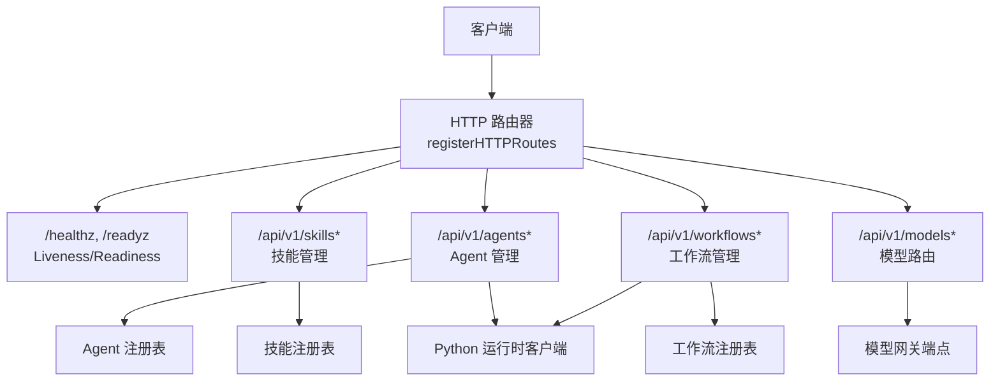
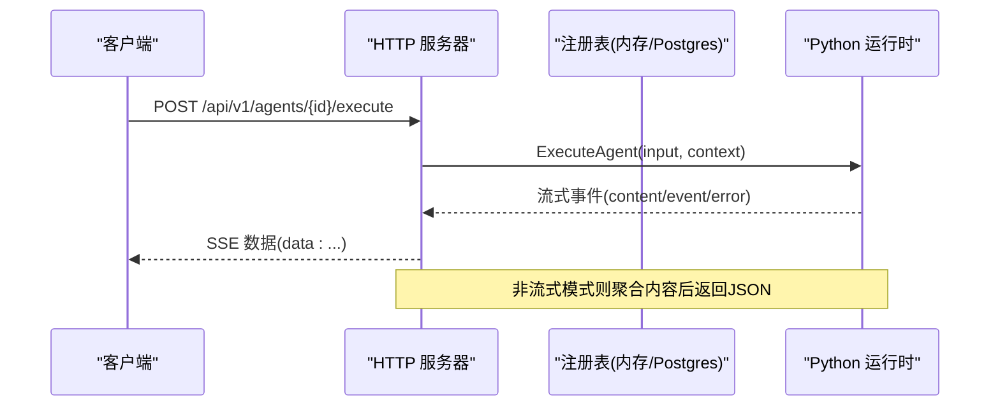
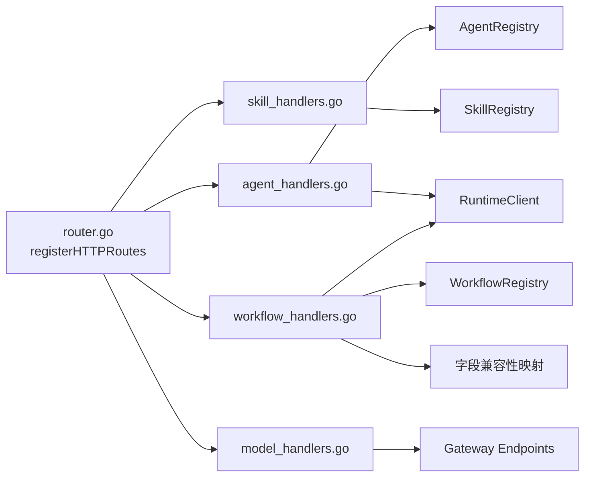
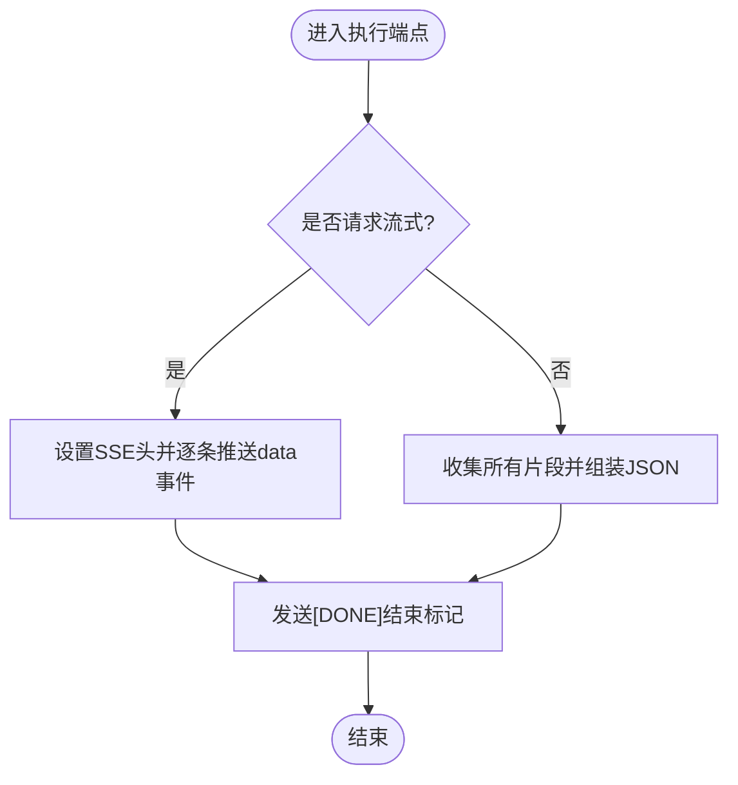

# REST API

<cite>
**本文引用的文件**
- [resolveagent.yaml](file://api/openapi/v1/resolveagent.yaml)
- [router.go](file://pkg/server/router.go)
- [server.go](file://pkg/server/server.go)
- [health.go](file://pkg/health/health.go)
- [agent_handlers.go](file://pkg/server/agent_handlers.go)
- [skill_handlers.go](file://pkg/server/skill_handlers.go)
- [workflow_handlers.go](file://pkg/server/workflow_handlers.go)
- [model_handlers.go](file://pkg/server/model_handlers.go)
- [auth.go](file://pkg/server/middleware/auth.go)
- [response.go](file://pkg/server/response.go)
- [error_mapping.go](file://pkg/server/error_mapping.go)
- [workflow.go](file://pkg/registry/workflow.go)
</cite>

## 更新摘要
**所做更改**
- 更新了工作流管理端点部分，添加了向后兼容性说明
- 新增了工作流定义字段映射的详细说明
- 更新了请求体示例以展示新旧字段格式
- 增强了错误处理和兼容性行为的描述

## 目录
1. [简介](#简介)
2. [项目结构](#项目结构)
3. [核心组件](#核心组件)
4. [架构总览](#架构总览)
5. [详细端点参考](#详细端点参考)
6. [依赖关系分析](#依赖关系分析)
7. [性能与流式处理](#性能与流式处理)
8. [故障排查指南](#故障排查指南)
9. [结论](#结论)
10. [附录](#附录)

## 简介
本参考文档基于 OpenAPI 3.1.0 规范，系统化记录 ResolveAgent 平台的 REST API，涵盖健康检查、Agent 管理、技能管理、工作流管理、模型路由等端点。文档包含每个端点的操作 ID、标签分类、业务用途、请求参数、响应格式、HTTP 状态码与认证方式，并提供示例路径以便快速定位实现代码。

**重要更新**：工作流 API 现已支持向后兼容性，服务器会自动将 'definition' 字段映射到 'Tree' 字段，确保使用旧版字段命名约定的客户端能够无缝集成。

## 项目结构
REST API 由 HTTP 服务器统一暴露，路由在注册阶段集中绑定到处理器函数；健康检查通过专用包提供 Liveness/Readiness 能力；认证中间件对请求进行鉴权并注入上下文；各业务处理器调用注册表（Registry）或运行时客户端完成具体逻辑。



**图示来源**
- [router.go:6-136](file://pkg/server/router.go#L6-L136)
- [server.go:108-118](file://pkg/server/server.go#L108-L118)
- [health.go:116-139](file://pkg/health/health.go#L116-L139)

**章节来源**
- [router.go:6-136](file://pkg/server/router.go#L6-L136)
- [server.go:108-118](file://pkg/server/server.go#L108-L118)

## 核心组件
- 路由注册：集中定义所有 REST 路径与方法，映射到处理器函数。
- 健康检查：提供进程存活与服务就绪探测。
- 认证中间件：支持 JWT、API Key、网关透传头，默认跳过健康相关路径。
- 响应封装：统一的 JSON 写入与错误响应格式。
- 错误映射：将 Python 运行时错误码映射为内部错误类型。
- **向后兼容性**：工作流 API 自动处理 'definition' 到 'Tree' 字段的映射。

**章节来源**
- [router.go:6-136](file://pkg/server/router.go#L6-L136)
- [health.go:116-139](file://pkg/health/health.go#L116-L139)
- [auth.go:15-32](file://pkg/server/middleware/auth.go#L15-L32)
- [response.go:8-16](file://pkg/server/response.go#L8-L16)
- [error_mapping.go:7-32](file://pkg/server/error_mapping.go#L7-L32)

## 架构总览
平台同时启动 HTTP 与 gRPC 服务，HTTP 层承载 REST API，gRPC 层用于内部服务通信与调试反射。注册表后端可选择 PostgreSQL 或内存实现，运行时通过 HTTP 与 Python 侧交互以执行 Agent/工作流。



**图示来源**
- [agent_handlers.go:117-273](file://pkg/server/agent_handlers.go#L117-L273)
- [workflow_handlers.go:230-347](file://pkg/server/workflow_handlers.go#L230-L347)
- [server.go:123-173](file://pkg/server/server.go#L123-L173)

## 详细端点参考

### 健康检查
- GET /healthz
  - 标签: Health
  - 操作ID: getLiveness
  - 用途: 进程存活探针
  - 响应: 200 OK，JSON 包含 status=UP
  - 认证: 跳过（默认配置）
  - 示例路径: [health.go:116-124](file://pkg/health/health.go#L116-L124)

- GET /readyz
  - 标签: Health
  - 操作ID: getReadiness
  - 用途: 服务就绪探针
  - 响应: 200 OK（就绪）或 503 Service Unavailable（未就绪），JSON 包含整体状态与各组件状态
  - 认证: 跳过（默认配置）
  - 示例路径: [health.go:126-139](file://pkg/health/health.go#L126-L139)

- GET /api/v1/health
  - 说明: 与 /healthz 同义，便于统一前缀访问
  - 示例路径: [router.go:8-9](file://pkg/server/router.go#L8-L9)

**章节来源**
- [health.go:116-139](file://pkg/health/health.go#L116-L139)
- [router.go:8-9](file://pkg/server/router.go#L8-L9)
- [auth.go:24-32](file://pkg/server/middleware/auth.go#L24-L32)

### Agent 管理
- GET /api/v1/agents
  - 标签: Agents
  - 操作ID: listAgents
  - 查询参数:
    - type: 字符串，可选
    - status: 字符串，可选
  - 响应: 200 OK，JSON 包含 agents 数组与 total 计数
  - 示例路径: [agent_handlers.go:14-26](file://pkg/server/agent_handlers.go#L14-L26)

- POST /api/v1/agents
  - 标签: Agents
  - 操作ID: createAgent
  - 请求体: AgentDefinition（必填 name；type/status 有默认值；id 可省略由服务端生成）
  - 响应: 201 Created，返回创建的 Agent
  - 错误: 400（无效 JSON/缺少必填字段）、409（冲突）
  - 示例路径: [agent_handlers.go:28-64](file://pkg/server/agent_handlers.go#L28-L64)

- GET /api/v1/agents/{id}
  - 标签: Agents
  - 操作ID: getAgent
  - 路径参数: id（UUID）
  - 响应: 200 OK，返回 Agent 详情；404 未找到
  - 示例路径: [agent_handlers.go:66-77](file://pkg/server/agent_handlers.go#L66-L77)

- PUT /api/v1/agents/{id}
  - 标签: Agents
  - 操作ID: updateAgent
  - 路径参数: id（UUID）
  - 请求体: AgentDefinition（id 需与路径一致）
  - 响应: 200 OK，返回更新后的 Agent；404 未找到
  - 示例路径: [agent_handlers.go:79-103](file://pkg/server/agent_handlers.go#L79-L103)

- DELETE /api/v1/agents/{id}
  - 标签: Agents
  - 操作ID: deleteAgent
  - 路径参数: id（UUID）
  - 响应: 200 OK，返回删除确认消息
  - 示例路径: [agent_handlers.go:105-115](file://pkg/server/agent_handlers.go#L105-L115)

- POST /api/v1/agents/{id}/execute
  - 标签: Agents
  - 操作ID: executeAgent
  - 路径参数: id（UUID）
  - 请求体:
    - message: 字符串
    - context: 对象，可选
    - conversation_id: 字符串，可选
    - stream: 布尔，可选；或设置 Accept: text/event-stream 启用流式
  - 响应:
    - 非流式: 200 OK，JSON 包含 agent_id、content、metadata
    - 流式: 200 OK，SSE 事件 data: {...}，结束时发送 data: [DONE]
  - 错误: 400（无效 JSON）、500（执行失败）、408（超时）
  - 示例路径: [agent_handlers.go:117-273](file://pkg/server/agent_handlers.go#L117-L273)

**章节来源**
- [agent_handlers.go:14-273](file://pkg/server/agent_handlers.go#L14-L273)
- [router.go:14-20](file://pkg/server/router.go#L14-L20)

### 技能管理
- GET /api/v1/skills
  - 标签: Skills
  - 操作ID: listSkills
  - 响应: 200 OK，JSON 包含 skills 数组与 total 计数
  - 示例路径: [skill_handlers.go:11-23](file://pkg/server/skill_handlers.go#L11-L23)

- POST /api/v1/skills
  - 标签: Skills
  - 操作ID: registerSkill
  - 请求体: SkillDefinition（必填 name；status 默认 active）
  - 响应: 201 Created，返回注册的 Skill；400（无效 JSON/缺少必填字段）、409（冲突）
  - 示例路径: [skill_handlers.go:25-54](file://pkg/server/skill_handlers.go#L25-L54)

- GET /api/v1/skills/{name}
  - 标签: Skills
  - 操作ID: getSkill
  - 路径参数: name
  - 响应: 200 OK，返回 Skill 详情；404 未找到
  - 示例路径: [skill_handlers.go:56-67](file://pkg/server/skill_handlers.go#L56-L67)

- DELETE /api/v1/skills/{name}
  - 标签: Skills
  - 操作ID: unregisterSkill
  - 路径参数: name
  - 响应: 200 OK，返回注销确认消息
  - 示例路径: [skill_handlers.go:69-79](file://pkg/server/skill_handlers.go#L69-L79)

**章节来源**
- [skill_handlers.go:11-79](file://pkg/server/skill_handlers.go#L11-L79)
- [router.go:22-26](file://pkg/server/router.go#L22-L26)

### 工作流管理
- GET /api/v1/workflows
  - 标签: Workflows
  - 操作ID: listWorkflows
  - 响应: 200 OK，JSON 包含 workflows 数组与 total 计数
  - 示例路径: [workflow_handlers.go:14-26](file://pkg/server/workflow_handlers.go#L14-L26)

- POST /api/v1/workflows
  - 标签: Workflows
  - 操作ID: createWorkflow
  - 请求体: WorkflowDefinition（必填 name；status 默认 draft；id 可省略由服务端生成）
  - **向后兼容性增强**: 服务器自动将 'definition' 字段映射到 'Tree' 字段，如果 Tree 为空且存在 definition 字段
  - 响应: 201 Created，返回创建的工作流；400（无效 JSON/缺少必填字段）、409（冲突）
  - 示例路径: [workflow_handlers.go:28-71](file://pkg/server/workflow_handlers.go#L28-L71)

- GET /api/v1/workflows/{id}
  - 标签: Workflows
  - 操作ID: getWorkflow
  - 路径参数: id
  - 响应: 200 OK，返回工作流详情；404 未找到
  - 示例路径: [workflow_handlers.go:73-84](file://pkg/server/workflow_handlers.go#L73-L84)

- PUT /api/v1/workflows/{id}
  - 标签: Workflows
  - 操作ID: updateWorkflow
  - 路径参数: id
  - 请求体: WorkflowDefinition（id 需与路径一致）
  - 响应: 200 OK，返回更新后的工作流；404 未找到
  - 示例路径: [workflow_handlers.go:86-110](file://pkg/server/workflow_handlers.go#L86-L110)

- DELETE /api/v1/workflows/{id}
  - 标签: Workflows
  - 操作ID: deleteWorkflow
  - 路径参数: id
  - 响应: 200 OK，返回删除确认消息
  - 示例路径: [workflow_handlers.go:112-122](file://pkg/server/workflow_handlers.go#L112-L122)

- POST /api/v1/workflows/{id}/validate
  - 标签: Workflows
  - 操作ID: validateWorkflow
  - 路径参数: id
  - 响应: 200 OK，JSON 包含 workflow_id、valid、errors
  - 校验规则: 名称必填；节点至少一个且含 start/end；节点类型合法；边引用节点存在
  - 示例路径: [workflow_handlers.go:124-238](file://pkg/server/workflow_handlers.go#L124-L238)

- POST /api/v1/workflows/{id}/execute
  - 标签: Workflows
  - 操作ID: executeWorkflow
  - 路径参数: id
  - 请求体:
    - input: 对象
    - context: 对象，可选
  - 响应: 200 OK，SSE 事件 data: {...}，结束时发送 data: [DONE]
  - 错误: 400（无效 JSON）、500（执行失败）、408（超时）
  - 示例路径: [workflow_handlers.go:240-357](file://pkg/server/workflow_handlers.go#L240-L357)

**向后兼容性说明**
工作流创建端点现在支持两种请求格式：

1. **新格式（推荐）**：使用 `tree` 字段
   ```json
   {
     "name": "my-workflow",
     "description": "工作流描述",
     "tree": {
       "nodes": [...],
       "edges": [...]
     }
   }
   ```

2. **旧格式（兼容）**：使用 `definition` 字段
   ```json
   {
     "name": "my-workflow", 
     "description": "工作流描述",
     "definition": {
       "nodes": [...],
       "edges": [...]
     }
   }
   ```

当客户端使用旧的 `definition` 字段时，服务器会自动将其映射到内部的 `Tree` 字段，确保现有客户端无需修改即可正常工作。

**章节来源**
- [workflow_handlers.go:28-71](file://pkg/server/workflow_handlers.go#L28-L71)
- [workflow_handlers.go:73-122](file://pkg/server/workflow_handlers.go#L73-L122)
- [workflow_handlers.go:124-238](file://pkg/server/workflow_handlers.go#L124-L238)
- [workflow_handlers.go:240-357](file://pkg/server/workflow_handlers.go#L240-L357)
- [router.go:28-35](file://pkg/server/router.go#L28-L35)

### 模型路由
- GET /api/v1/models
  - 标签: Models
  - 操作ID: listModelRoutes
  - 响应: 200 OK，JSON 包含 models 数组与 total 计数；当前返回固定列表，每项包含 id、provider、gateway_endpoint、enabled
  - 示例路径: [model_handlers.go:4-31](file://pkg/server/model_handlers.go#L4-L31)

- POST /api/v1/models
  - 标签: Models
  - 操作ID: addModel
  - 说明: 尚未实现，返回 501 Not Implemented
  - 示例路径: [model_handlers.go:33-35](file://pkg/server/model_handlers.go#L33-L35)

**章节来源**
- [model_handlers.go:4-35](file://pkg/server/model_handlers.go#L4-L35)
- [router.go:44-46](file://pkg/server/router.go#L44-L46)

### 认证方式
- 支持的认证方式:
  - Bearer JWT：Authorization: Bearer <token>
  - API Key：X-API-Key 或 Authorization（根据配置）
  - 网关透传：X-Auth-User、X-Auth-Roles
- 默认跳过路径: /health、/ready、/metrics、/healthz、/readyz、/api/v1/health
- 未认证或未授权时返回 401 Unauthorized
- 示例路径: [auth.go:15-32](file://pkg/server/middleware/auth.go#L15-L32), [auth.go:77-103](file://pkg/server/middleware/auth.go#L77-L103), [auth.go:114-132](file://pkg/server/middleware/auth.go#L114-L132)

**章节来源**
- [auth.go:15-32](file://pkg/server/middleware/auth.go#L15-L32)
- [auth.go:77-132](file://pkg/server/middleware/auth.go#L77-L132)

## 依赖关系分析
- 路由到处理器：所有 REST 路径在 router.go 中集中注册，分别指向对应处理器。
- 处理器到注册表：Agent/Skill/Workflow 等处理器通过各自的 Registry 接口进行 CRUD。
- 处理器到运行时：Agent/工作流执行通过 RuntimeClient 转发至 Python 运行时，采用流式事件。
- 健康检查：/healthz 直接返回 UP；/readyz 聚合组件健康状态。
- 认证中间件：对请求进行鉴权并注入用户上下文，默认跳过健康相关路径。
- **向后兼容性**：工作流处理器在创建时自动处理字段映射。



**图示来源**
- [router.go:6-136](file://pkg/server/router.go#L6-L136)
- [agent_handlers.go:14-273](file://pkg/server/agent_handlers.go#L14-L273)
- [skill_handlers.go:11-79](file://pkg/server/skill_handlers.go#L11-L79)
- [workflow_handlers.go:28-71](file://pkg/server/workflow_handlers.go#L28-L71)
- [model_handlers.go:4-35](file://pkg/server/model_handlers.go#L4-L35)

**章节来源**
- [router.go:6-136](file://pkg/server/router.go#L6-L136)
- [server.go:51-96](file://pkg/server/server.go#L51-L96)

## 性能与流式处理
- 流式响应：Agent 与工作流执行支持 SSE 流式输出，减少首字节延迟，适合长耗时任务。
- 非流式模式：当未请求流式时，服务端聚合内容后一次性返回 JSON。
- 超时控制：请求上下文取消时返回 408 Request Timeout。
- 并发与连接：HTTP Server 配置了读写超时与空闲超时，避免资源泄露。



**图示来源**
- [agent_handlers.go:137-273](file://pkg/server/agent_handlers.go#L137-L273)
- [workflow_handlers.go:272-347](file://pkg/server/workflow_handlers.go#L272-L347)

## 故障排查指南
- 常见错误码与含义:
  - 400 Bad Request：请求体无效或缺少必填字段
  - 401 Unauthorized：未提供有效认证信息
  - 404 Not Found：资源不存在
  - 408 Request Timeout：请求超时
  - 409 Conflict：资源已存在
  - 500 Internal Server Error：服务端内部错误
  - 501 Not Implemented：功能尚未实现
- 错误响应格式: 统一 JSON 包含 error 字段
- 错误映射：Python 运行时错误码会映射为内部错误类型，便于统一处理
- **兼容性提示**：如果使用旧的 `definition` 字段，服务器会自动映射到 `Tree` 字段，但建议迁移到新格式以获得更好的性能
- 示例路径: [response.go:8-16](file://pkg/server/response.go#L8-L16), [error_mapping.go:7-32](file://pkg/server/error_mapping.go#L7-L32)

**章节来源**
- [response.go:8-16](file://pkg/server/response.go#L8-L16)
- [error_mapping.go:7-32](file://pkg/server/error_mapping.go#L7-L32)

## 结论
ResolveAgent 的 REST API 提供了完整的 Agent、技能、工作流与模型管理能力，并通过健康检查与认证中间件保障服务的可观测性与安全性。执行类端点支持流式响应以提升用户体验。**新增的向后兼容性功能**确保了从旧版 API 格式的平滑迁移，使现有客户端无需修改即可继续使用。建议在生产环境启用认证并合理配置超时与限流策略。

## 附录
- OpenAPI 规范位置: [resolveagent.yaml](file://api/openapi/v1/resolveagent.yaml)
- 路由注册位置: [router.go](file://pkg/server/router.go)
- 健康检查实现: [health.go](file://pkg/health/health.go)
- 认证中间件: [auth.go](file://pkg/server/middleware/auth.go)
- 响应与错误封装: [response.go](file://pkg/server/response.go), [error_mapping.go](file://pkg/server/error_mapping.go)
- 工作流定义结构: [workflow.go](file://pkg/registry/workflow.go)
- 工作流处理器（含兼容性逻辑）: [workflow_handlers.go](file://pkg/server/workflow_handlers.go)