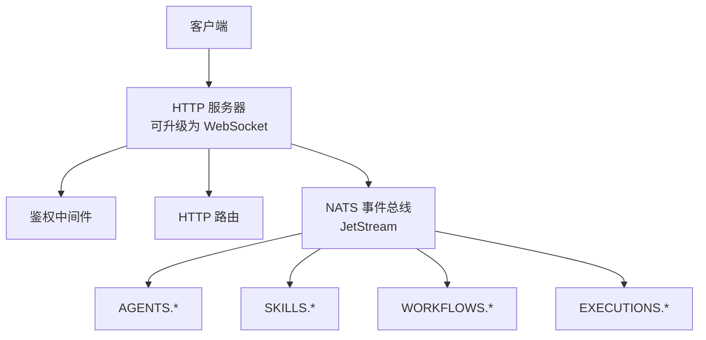
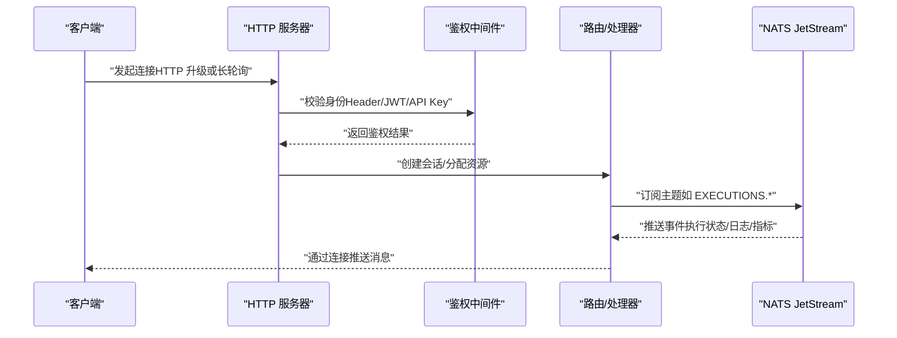
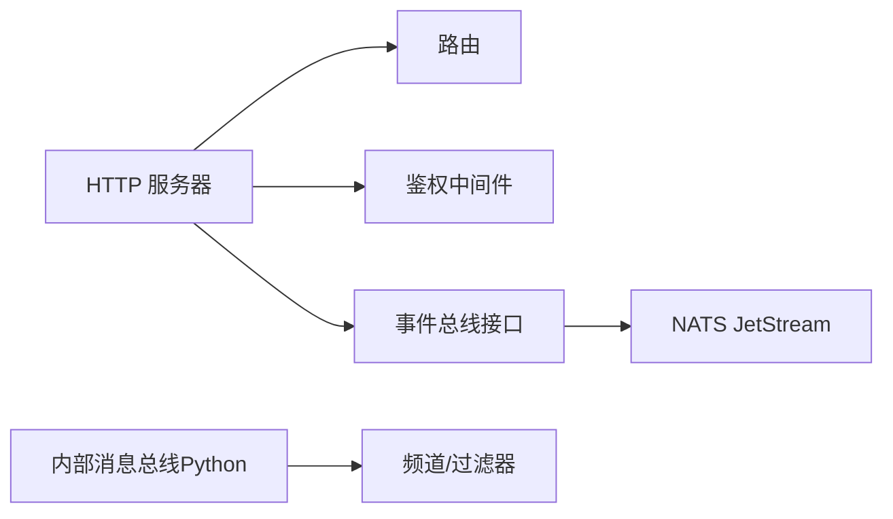

# WebSocket API

<cite>
**本文引用的文件**
- [pkg/server/server.go](file://pkg/server/server.go)
- [pkg/server/router.go](file://pkg/server/router.go)
- [pkg/event/event.go](file://pkg/event/event.go)
- [pkg/event/nats.go](file://pkg/event/nats.go)
- [pkg/server/middleware/auth.go](file://pkg/server/middleware/auth.go)
- [internal/cli/agent/logs.go](file://internal/cli/agent/logs.go)
- [python/src/resolveagent/message_bus.py](file://python/src/resolveagent/message_bus.py)
</cite>

## 目录
1. [简介](#简介)
2. [项目结构](#项目结构)
3. [核心组件](#核心组件)
4. [架构总览](#架构总览)
5. [详细组件分析](#详细组件分析)
6. [依赖关系分析](#依赖关系分析)
7. [性能考虑](#性能考虑)
8. [故障排查指南](#故障排查指南)
9. [结论](#结论)
10. [附录](#附录)

## 简介
本参考文档面向 ResolveAgent 项目的 WebSocket 接口，聚焦于实时通信的连接建立、握手与认证、会话管理、消息类型与格式、订阅模式、错误处理与重连策略，以及与 NATS 事件总线的集成和消息路由机制。当前代码库已提供完整的 HTTP/gRPC 服务、NATS 事件总线（JetStream）以及内部消息总线抽象；WebSocket 服务端点尚未实现，但可通过现有组件快速扩展。本文在严格依据源码的基础上，给出可落地的设计与对接规范，帮助客户端正确接入并稳定运行。

## 项目结构
ResolveAgent 的运行时由以下关键部分组成：
- HTTP 服务器与路由：负责 REST API 与健康检查，可作为 WebSocket 升级入口。
- 事件总线（NATS JetStream）：用于跨进程的事件发布/订阅与持久化。
- 中间件：提供鉴权、日志、遥测等横切能力。
- 内部消息总线（Python）：用于 Agent 间消息传递，支持通道、优先级、过滤与请求-响应关联。

图表来源
- [pkg/server/server.go:108-118](file://pkg/server/server.go#L108-L118)
- [pkg/server/router.go:5-136](file://pkg/server/router.go#L5-L136)
- [pkg/event/nats.go:69-96](file://pkg/event/nats.go#L69-L96)

章节来源
- [pkg/server/server.go:22-121](file://pkg/server/server.go#L22-L121)
- [pkg/server/router.go:5-136](file://pkg/server/router.go#L5-L136)

## 核心组件
- 事件模型与总线接口：定义统一的事件结构与发布/订阅契约，便于替换不同后端。
- NATS 事件总线：基于 JetStream 的持久化消息流，提供可靠投递、手动确认与消费者持久化。
- 鉴权中间件：支持网关头、JWT、API Key 等多种认证方式，并将上下文注入后续处理器。
- 内部消息总线（Python）：提供 Agent 间的发布-订阅、请求-响应、优先级与过滤能力。

章节来源
- [pkg/event/event.go:7-22](file://pkg/event/event.go#L7-L22)
- [pkg/event/nats.go:13-67](file://pkg/event/nats.go#L13-L67)
- [pkg/server/middleware/auth.go:62-132](file://pkg/server/middleware/auth.go#L62-L132)
- [python/src/resolveagent/message_bus.py:16-62](file://python/src/resolveagent/message_bus.py#L16-L62)

## 架构总览
下图展示了从客户端到服务端的完整链路，包括连接建立、鉴权、消息路由与 NATS 事件总线交互。

图表来源
- [pkg/server/server.go:108-118](file://pkg/server/server.go#L108-L118)
- [pkg/server/middleware/auth.go:77-132](file://pkg/server/middleware/auth.go#L77-L132)
- [pkg/event/nats.go:98-178](file://pkg/event/nats.go#L98-L178)

## 详细组件分析

### 连接建立与握手
- 建议采用标准 HTTP 升级至 WebSocket 的方式，复用现有 HTTP 服务器与鉴权中间件。
- 握手阶段需完成：
  - 身份验证：优先读取网关头（X-Auth-User/X-Auth-Roles），其次 Bearer JWT，最后 API Key。
  - 会话初始化：为每个连接分配唯一会话 ID，绑定用户上下文与权限。
  - 资源准备：根据角色与目标范围，预注册 NATS 订阅（例如 EXECUTIONS.agent-xxx）。
- 若暂不支持 WebSocket 升级，可使用 SSE 或长轮询作为过渡方案。

章节来源
- [pkg/server/middleware/auth.go:114-132](file://pkg/server/middleware/auth.go#L114-L132)
- [pkg/server/server.go:108-118](file://pkg/server/server.go#L108-L118)

### 认证机制与会话管理
- 支持的认证方式：
  - 网关头：X-Auth-User、X-Auth-Roles
  - JWT：Authorization: Bearer <token>，支持签发者校验与过期时间
  - API Key：自定义 Header，支持过期时间与常量时间比较校验
- 会话管理要点：
  - 将鉴权上下文注入请求上下文，供后续处理器使用。
  - 维护连接到用户/角色的映射，控制订阅范围与消息可见性。
  - 支持按 Agent/工作流维度进行细粒度订阅隔离。

章节来源
- [pkg/server/middleware/auth.go:62-228](file://pkg/server/middleware/auth.go#L62-L228)

### 消息类型与数据格式
- 事件总线事件（NATS）：
  - 字段：type、subject、data
  - 用途：跨模块事件（如 AGENTS、SKILLS、WORKFLOWS、EXECUTIONS）
- 内部消息总线（Python）：
  - 字段：id、channel、sender、message_type、content、priority、correlation_id、reply_to、timestamp、ttl_seconds、metadata
  - 用途：Agent 间通信，支持请求-响应、优先级队列与过滤

章节来源
- [pkg/event/event.go:7-22](file://pkg/event/event.go#L7-L22)
- [python/src/resolveagent/message_bus.py:16-62](file://python/src/resolveagent/message_bus.py#L16-L62)

### 订阅模式与消息路由
- NATS 主题模式：
  - 使用 {TYPE}.{SUBJECT} 形式，如 EXECUTIONS.agent-001
  - 支持通配符订阅，如 EXECUTIONS.*
- 持久化与可靠性：
  - JetStream 提供至少一次投递、手动确认（Ack/Nak）、消费者持久化（Durable Consumer）
  - 自动创建预定义 Stream（AGENTS、SKILLS、WORKFLOWS、EXECUTIONS），保留 24 小时
- 内部消息总线：
  - 支持频道订阅与可选过滤器函数
  - 支持异步回调与请求-响应关联（correlation_id）

章节来源
- [pkg/event/nats.go:69-96](file://pkg/event/nats.go#L69-L96)
- [pkg/event/nats.go:98-178](file://pkg/event/nats.go#L98-L178)
- [python/src/resolveagent/message_bus.py:145-219](file://python/src/resolveagent/message_bus.py#L145-L219)

### 错误处理与重连策略
- NATS 连接：
  - 重连间隔 1 秒，最多 10 次重连尝试
  - 反序列化失败时记录错误并 Nak 消息，避免毒消息阻塞
- 客户端重连建议：
  - 指数退避 + 抖动
  - 心跳检测与断线恢复
  - 订阅恢复：重新订阅所需主题，确保不丢消息
- 服务端错误：
  - 鉴权失败返回未授权
  - 处理异常时记录上下文（主题、消息 ID、订阅者）

章节来源
- [pkg/event/nats.go:37-67](file://pkg/event/nats.go#L37-L67)
- [pkg/event/nats.go:135-178](file://pkg/event/nats.go#L135-L178)
- [pkg/server/middleware/auth.go:77-132](file://pkg/server/middleware/auth.go#L77-L132)

### 与 NATS 事件总线的集成
- 发布：
  - Publish：封装 Event 结构体，序列化为 JSON 后发布
  - PublishData：便捷方法，直接发布任意数据载荷
- 订阅：
  - Subscribe：异步回调，手动确认，Context 驱动取消
  - SubscribeSync：同步拉取
- Stream 管理：
  - 启动时幂等创建四个 Stream，使用文件存储与 24 小时保留策略

章节来源
- [pkg/event/nats.go:98-178](file://pkg/event/nats.go#L98-L178)
- [pkg/event/nats.go:69-96](file://pkg/event/nats.go#L69-L96)

### 客户端连接示例与订阅模式
- 连接示例（概念流程）：
  - 客户端携带鉴权信息发起连接
  - 服务端完成鉴权并创建会话
  - 客户端订阅所需主题（如 EXECUTIONS.agent-xxx）
  - 服务端通过连接推送事件
- 订阅模式：
  - 精确订阅：EXECUTIONS.agent-001
  - 通配订阅：EXECUTIONS.*
  - 多主题订阅：AGENTS.*、WORKFLOWS.*
- 过渡方案：
  - 若暂不支持 WebSocket，可使用 SSE 或周期性轮询获取日志与状态

章节来源
- [internal/cli/agent/logs.go:72-79](file://internal/cli/agent/logs.go#L72-L79)

## 依赖关系分析
- HTTP 服务器依赖路由与中间件，提供统一的接入面。
- 事件总线抽象（Bus）解耦了具体实现，当前以 NATS JetStream 为主。
- 内部消息总线（Python）与 NATS 事件总线互补：前者侧重 Agent 间通信，后者侧重系统级事件。

图表来源
- [pkg/server/server.go:108-118](file://pkg/server/server.go#L108-L118)
- [pkg/event/event.go:14-22](file://pkg/event/event.go#L14-L22)
- [pkg/event/nats.go:98-178](file://pkg/event/nats.go#L98-L178)
- [python/src/resolveagent/message_bus.py:145-219](file://python/src/resolveagent/message_bus.py#L145-L219)

章节来源
- [pkg/server/server.go:22-121](file://pkg/server/server.go#L22-L121)
- [pkg/event/event.go:7-22](file://pkg/event/event.go#L7-L22)
- [pkg/event/nats.go:98-178](file://pkg/event/nats.go#L98-L178)
- [python/src/resolveagent/message_bus.py:145-219](file://python/src/resolveagent/message_bus.py#L145-L219)

## 性能考虑
- 连接与鉴权：
  - 复用 HTTP 服务器与中间件，减少额外开销
  - 鉴权失败快速返回，避免无效连接占用资源
- 事件处理：
  - 使用 JetStream 的持久化与手动确认，保证可靠性
  - 合理设置 Stream 保留策略，避免数据膨胀
- 客户端侧：
  - 批量订阅与合并处理，降低网络与 CPU 开销
  - 本地缓存热点数据，减少重复请求

## 故障排查指南
- 鉴权失败：
  - 检查请求头是否包含正确的 X-Auth-User/X-Auth-Roles、Authorization 或 API Key
  - 确认 JWT 签发者与有效期配置
- 消息丢失：
  - 确认 NATS 连接健康与 Stream 存在
  - 检查消费者是否成功 Ack，失败时是否触发重投
- 日志流式输出：
  - 当前 CLI 日志流式功能占位，待实现 WebSocket/SSE 后可启用

章节来源
- [pkg/server/middleware/auth.go:114-228](file://pkg/server/middleware/auth.go#L114-L228)
- [pkg/event/nats.go:135-178](file://pkg/event/nats.go#L135-L178)
- [internal/cli/agent/logs.go:72-79](file://internal/cli/agent/logs.go#L72-L79)

## 结论
ResolveAgent 已具备稳定的 HTTP/gRPC 服务与基于 NATS JetStream 的事件总线，为 WebSocket 实时通信提供了坚实基础。通过复用鉴权中间件与事件总线，可快速实现低延迟、高可靠的实时消息推送。建议在实现 WebSocket 端点时，遵循本文的连接握手、认证与会话管理建议，并结合 NATS 的主题模式与持久化特性，构建健壮的实时通信体系。

## 附录
- 事件类型与主题建议：
  - AGENTS.*：Agent 生命周期事件
  - SKILLS.*：Skill 注册/注销事件
  - WORKFLOWS.*：工作流执行事件
  - EXECUTIONS.*：Agent 执行结果事件
- 客户端最佳实践：
  - 使用指数退避与抖动进行重连
  - 订阅最小必要主题，避免广播风暴
  - 对关键消息实现本地去重与重试