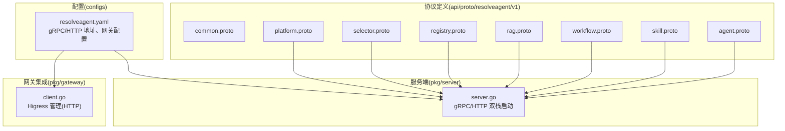
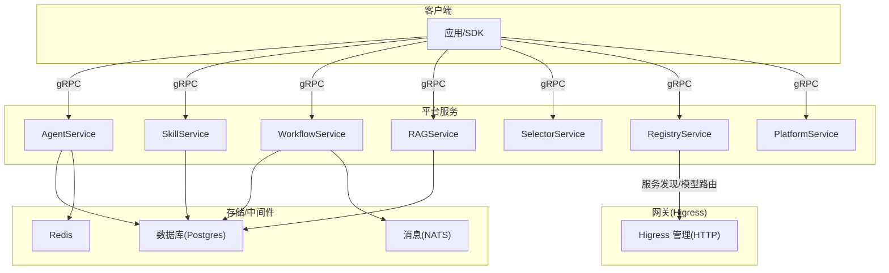
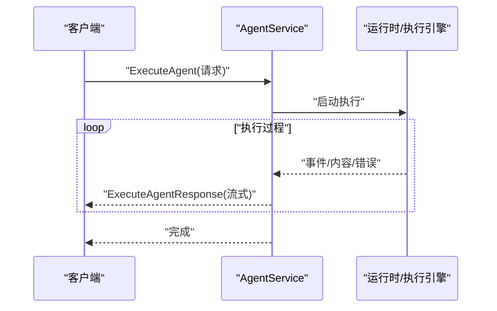
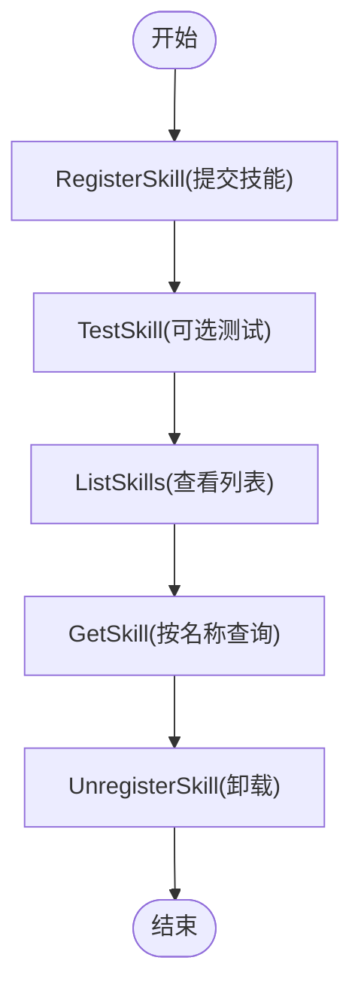
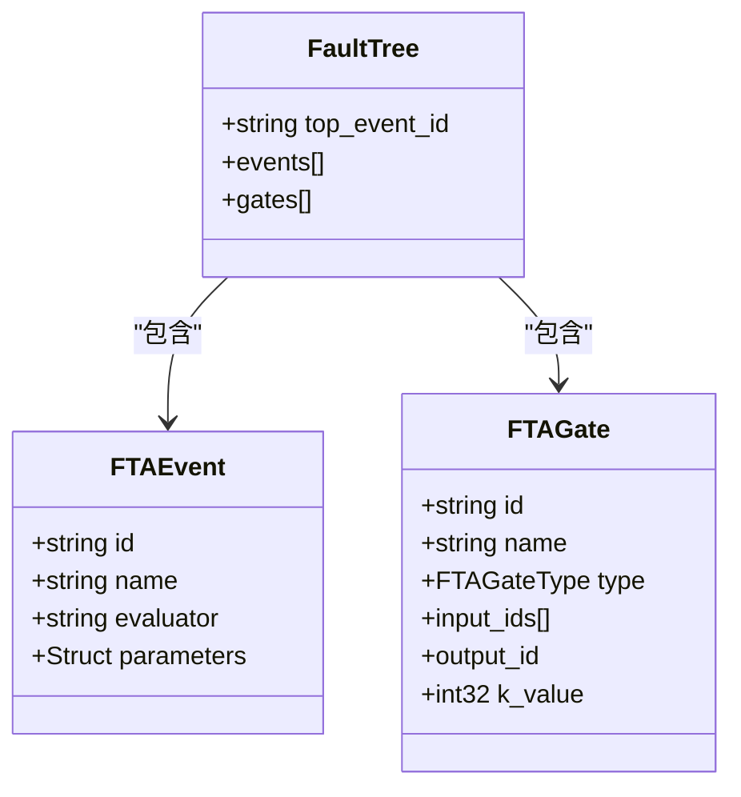
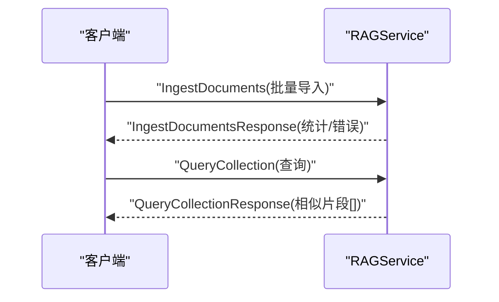
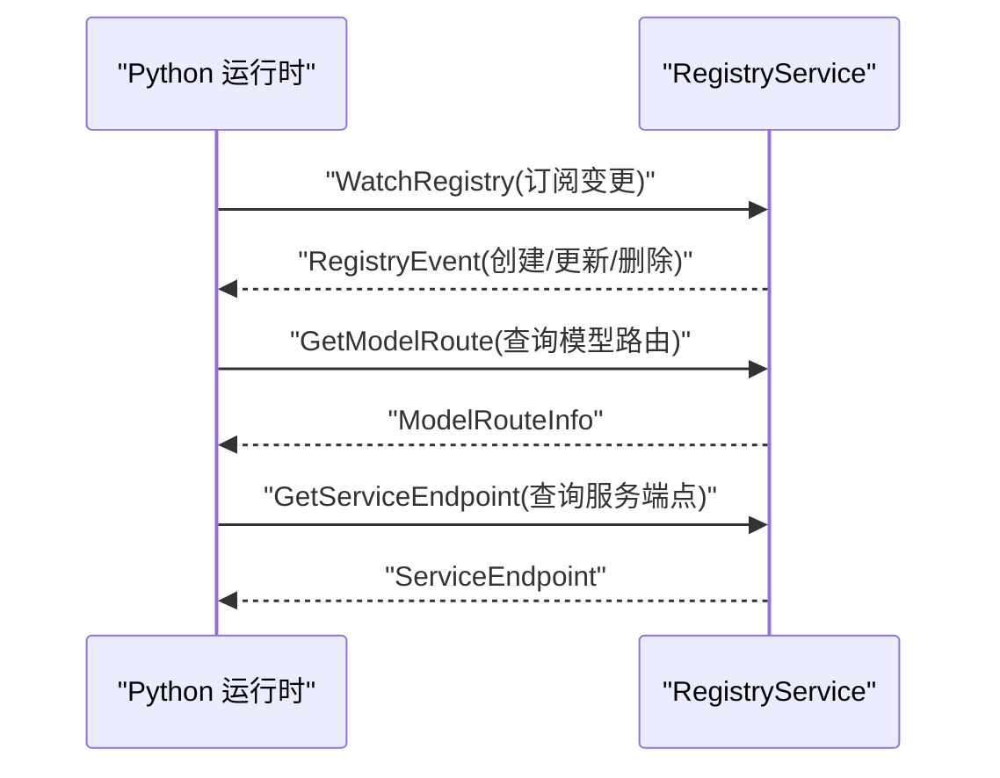
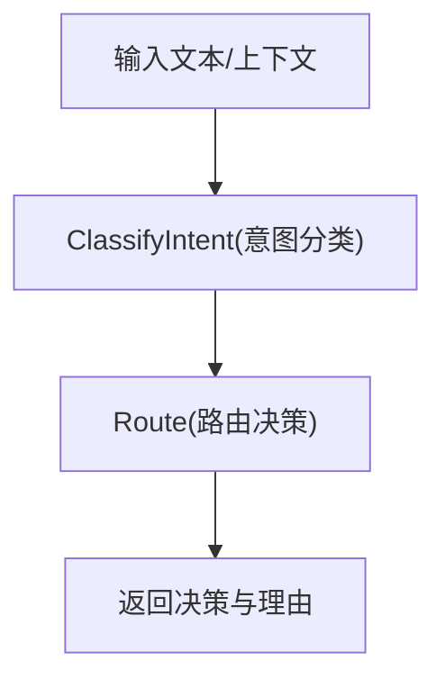
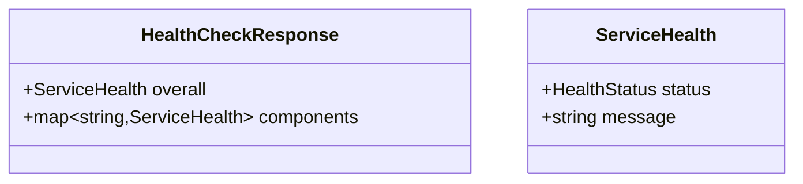
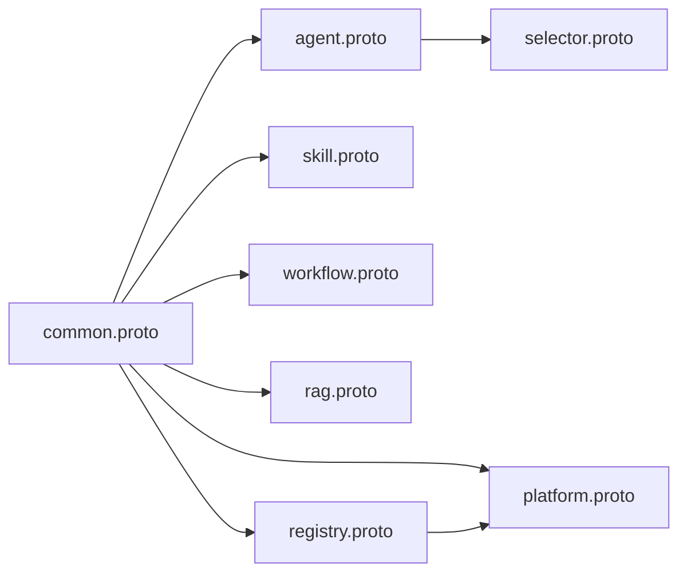

# gRPC API

<cite>
**本文引用的文件**
- [agent.proto](file://api/proto/resolveagent/v1/agent.proto)
- [skill.proto](file://api/proto/resolveagent/v1/skill.proto)
- [workflow.proto](file://api/proto/resolveagent/v1/workflow.proto)
- [rag.proto](file://api/proto/resolveagent/v1/rag.proto)
- [common.proto](file://api/proto/resolveagent/v1/common.proto)
- [platform.proto](file://api/proto/resolveagent/v1/platform.proto)
- [registry.proto](file://api/proto/resolveagent/v1/registry.proto)
- [selector.proto](file://api/proto/resolveagent/v1/selector.proto)
- [server.go](file://pkg/server/server.go)
- [client.go](file://pkg/gateway/client.go)
- [resolveagent.yaml](file://configs/resolveagent.yaml)
</cite>

## 目录
1. [简介](#简介)
2. [项目结构](#项目结构)
3. [核心组件](#核心组件)
4. [架构总览](#架构总览)
5. [详细组件分析](#详细组件分析)
6. [依赖关系分析](#依赖关系分析)
7. [性能考虑](#性能考虑)
8. [故障排查指南](#故障排查指南)
9. [结论](#结论)
10. [附录](#附录)

## 简介
本文件为 ResolveAgent 平台的 gRPC API 参考文档，覆盖以下核心服务与协议定义：
- AgentService：代理生命周期与执行管理（含流式输出）
- SkillService：技能注册与测试调用
- WorkflowService：FTA 工作流定义与执行（含流式事件）
- RAGService：向量知识库集合管理与检索
- RegistryService：服务发现与模型路由信息查询（Python 运行时对接）
- SelectorService：意图分类与路由决策
- PlatformService：健康检查、系统配置与版本信息

文档内容包括：
- 服务方法、请求/响应消息、字段说明与数据类型
- gRPC 客户端连接示例与流式 RPC 处理要点
- 错误处理策略与性能优化建议
- 服务发现、负载均衡与安全传输机制说明

## 项目结构
ResolveAgent 的 gRPC 协议位于 api/proto/resolveagent/v1 目录，按功能模块拆分多个 .proto 文件；平台服务端在 pkg/server 中启动 gRPC/HTTP 双栈服务，并通过 pkg/gateway 集成 Higress 网关进行路由与负载均衡。

**图表来源**
- [agent.proto:1-177](file://api/proto/resolveagent/v1/agent.proto#L1-L177)
- [skill.proto:1-101](file://api/proto/resolveagent/v1/skill.proto#L1-L101)
- [workflow.proto:1-145](file://api/proto/resolveagent/v1/workflow.proto#L1-L145)
- [rag.proto:1-99](file://api/proto/resolveagent/v1/rag.proto#L1-L99)
- [registry.proto:1-254](file://api/proto/resolveagent/v1/registry.proto#L1-L254)
- [selector.proto:1-40](file://api/proto/resolveagent/v1/selector.proto#L1-L40)
- [platform.proto:1-61](file://api/proto/resolveagent/v1/platform.proto#L1-L61)
- [server.go:1-132](file://pkg/server/server.go#L1-L132)
- [client.go:1-274](file://pkg/gateway/client.go#L1-L274)
- [resolveagent.yaml:1-90](file://configs/resolveagent.yaml#L1-L90)

**章节来源**
- [server.go:1-132](file://pkg/server/server.go#L1-L132)
- [resolveagent.yaml:1-90](file://configs/resolveagent.yaml#L1-L90)

## 核心组件
本节概述各服务提供的能力与典型使用场景：
- AgentService：创建/查询/更新/删除代理；执行代理并流式返回内容、事件或错误；查询执行历史
- SkillService：注册/查询/列出技能；卸载技能；测试技能输入输出
- WorkflowService：创建/查询/更新/删除工作流；校验工作流合法性；执行工作流并流式返回节点/门级事件
- RAGService：创建/查询/列出集合；删除集合；批量导入文档；基于查询词检索相似片段
- RegistryService：面向 Python 运行时的服务发现与模型路由查询；支持变更事件订阅
- SelectorService：意图分类与路由决策，辅助智能选择器进行分流
- PlatformService：健康检查、系统配置读取/更新、系统信息查询

**章节来源**
- [agent.proto:11-29](file://api/proto/resolveagent/v1/agent.proto#L11-L29)
- [skill.proto:10-17](file://api/proto/resolveagent/v1/skill.proto#L10-L17)
- [workflow.proto:11-20](file://api/proto/resolveagent/v1/workflow.proto#L11-L20)
- [rag.proto:10-18](file://api/proto/resolveagent/v1/rag.proto#L10-L18)
- [registry.proto:11-46](file://api/proto/resolveagent/v1/registry.proto#L11-L46)
- [selector.proto:10-14](file://api/proto/resolveagent/v1/selector.proto#L10-L14)
- [platform.proto:9-15](file://api/proto/resolveagent/v1/platform.proto#L9-L15)

## 架构总览
下图展示 gRPC 服务在平台中的部署位置与外部集成点（Higress 网关）：

**图表来源**
- [server.go:63-81](file://pkg/server/server.go#L63-L81)
- [client.go:14-32](file://pkg/gateway/client.go#L14-L32)
- [resolveagent.yaml:27-62](file://configs/resolveagent.yaml#L27-L62)

## 详细组件分析

### AgentService（代理服务）
- 服务职责：代理生命周期管理、执行与历史查询
- 关键 RPC
  - CreateAgent / GetAgent / ListAgents / UpdateAgent / DeleteAgent
  - ExecuteAgent（流式返回内容/事件/错误）
  - GetExecution / ListExecutions
- 流式输出类型
  - ExecuteAgentResponse.response：oneof 包含字符串内容、执行事件、执行错误
- 执行状态与路由决策
  - Execution.status：执行状态枚举
  - RouteDecision：路由类型、目标、置信度、参数链等

**图表来源**
- [agent.proto:23-28](file://api/proto/resolveagent/v1/agent.proto#L23-L28)
- [agent.proto:104-122](file://api/proto/resolveagent/v1/agent.proto#L104-L122)

**章节来源**
- [agent.proto:11-29](file://api/proto/resolveagent/v1/agent.proto#L11-L29)
- [agent.proto:124-177](file://api/proto/resolveagent/v1/agent.proto#L124-L177)

### SkillService（技能服务）
- 服务职责：技能注册、查询、列表、卸载、测试
- 关键 RPC：RegisterSkill / GetSkill / ListSkills / UnregisterSkill / TestSkill
- 技能清单与权限
  - SkillManifest：入口、输入输出参数、依赖、权限
  - SkillPermissions：网络访问、文件系统读写、超时与资源限制

**图表来源**
- [skill.proto:11-17](file://api/proto/resolveagent/v1/skill.proto#L11-L17)
- [skill.proto:38-63](file://api/proto/resolveagent/v1/skill.proto#L38-L63)

**章节来源**
- [skill.proto:10-101](file://api/proto/resolveagent/v1/skill.proto#L10-L101)

### WorkflowService（工作流服务）
- 服务职责：FTA 工作流定义、校验、执行与历史管理
- 关键 RPC：CreateWorkflow / GetWorkflow / ListWorkflows / UpdateWorkflow / DeleteWorkflow / ValidateWorkflow / ExecuteWorkflow
- 故障树结构
  - FaultTree：顶层事件、事件列表、逻辑门列表
  - FTAEvent / FTAGate：事件与门的类型、参数、阈值等
- 执行事件流
  - WorkflowEvent：节点评估/完成、门评估/完成、开始/完成/失败等

**图表来源**
- [workflow.proto:36-80](file://api/proto/resolveagent/v1/workflow.proto#L36-L80)

**章节来源**
- [workflow.proto:11-20](file://api/proto/resolveagent/v1/workflow.proto#L11-L20)
- [workflow.proto:22-145](file://api/proto/resolveagent/v1/workflow.proto#L22-L145)

### RAGService（RAG 服务）
- 服务职责：向量知识库集合管理与检索
- 关键 RPC：CreateCollection / GetCollection / ListCollections / DeleteCollection / IngestDocuments / QueryCollection
- 文档与检索
  - Document：文档元数据与内容
  - RetrievedChunk：检索到的片段与分数
  - QueryCollectionRequest：查询词、TopK、过滤条件

**图表来源**
- [rag.proto:11-18](file://api/proto/resolveagent/v1/rag.proto#L11-L18)
- [rag.proto:78-99](file://api/proto/resolveagent/v1/rag.proto#L78-L99)

**章节来源**
- [rag.proto:10-99](file://api/proto/resolveagent/v1/rag.proto#L10-L99)

### RegistryService（注册中心服务）
- 服务职责：为 Python 运行时提供统一的服务发现与模型路由信息
- 关键 RPC：GetAgent / ListAgents / GetSkill / ListSkills / GetModelRoute / ListModelRoutes / GetWorkflow / ListWorkflows / GetServiceEndpoint / WatchRegistry
- 数据模型
  - RegistryAgent / RegistrySkill / RegistryWorkflow
  - ModelRouteInfo / ServiceEndpoint / RegistryEvent
- 使用场景：Python 侧通过该服务查询可用代理、技能、工作流及模型路由，实现无侵入的服务发现与动态路由

**图表来源**
- [registry.proto:15-46](file://api/proto/resolveagent/v1/registry.proto#L15-L46)
- [registry.proto:149-157](file://api/proto/resolveagent/v1/registry.proto#L149-L157)

**章节来源**
- [registry.proto:11-254](file://api/proto/resolveagent/v1/registry.proto#L11-L254)

### SelectorService（选择器服务）
- 服务职责：意图分类与路由决策
- 关键 RPC：ClassifyIntent / Route
- 输入输出
  - ClassifyIntentRequest：输入、会话、上下文
  - ClassifyIntentResponse：意图类型、置信度、实体、元数据
  - RouteRequest / RouteResponse：结合意图与上下文给出路由决策与推理

**图表来源**
- [selector.proto:16-39](file://api/proto/resolveagent/v1/selector.proto#L16-L39)

**章节来源**
- [selector.proto:10-40](file://api/proto/resolveagent/v1/selector.proto#L10-L40)

### PlatformService（平台服务）
- 服务职责：健康检查、系统配置读取/更新、系统信息查询
- 关键 RPC：HealthCheck / GetConfig / UpdateConfig / GetSystemInfo
- 健康状态：整体健康与组件健康映射

**图表来源**
- [platform.proto:19-34](file://api/proto/resolveagent/v1/platform.proto#L19-L34)

**章节来源**
- [platform.proto:9-61](file://api/proto/resolveagent/v1/platform.proto#L9-L61)

## 依赖关系分析
- 通用模型复用：common.proto 提供分页、错误详情、资源元数据与状态枚举，被多服务复用
- 服务间耦合：AgentService 与 WorkflowService 在执行阶段存在协作（路由决策），SelectorService 为智能分流提供前置能力
- 外部依赖：Higress 网关用于服务发现与模型路由；配置文件中启用网关集成与认证策略

**图表来源**
- [common.proto:1-49](file://api/proto/resolveagent/v1/common.proto#L1-L49)
- [agent.proto:7-10](file://api/proto/resolveagent/v1/agent.proto#L7-L10)
- [skill.proto:7-9](file://api/proto/resolveagent/v1/skill.proto#L7-L9)
- [workflow.proto:7-9](file://api/proto/resolveagent/v1/workflow.proto#L7-L9)
- [rag.proto:7-9](file://api/proto/resolveagent/v1/rag.proto#L7-L9)
- [registry.proto:7-9](file://api/proto/resolveagent/v1/registry.proto#L7-L9)
- [platform.proto:7-8](file://api/proto/resolveagent/v1/platform.proto#L7-L8)
- [selector.proto:7-8](file://api/proto/resolveagent/v1/selector.proto#L7-L8)

**章节来源**
- [common.proto:1-49](file://api/proto/resolveagent/v1/common.proto#L1-L49)

## 性能考虑
- 流式 RPC：AgentService.ExecuteAgent 与 WorkflowService.ExecuteWorkflow 返回流式事件，建议客户端采用异步/背压策略消费，避免阻塞
- 分页查询：ListAgents/ListSkills/ListWorkflows/ListCollections 等均支持分页，建议设置合理的 page_size 并使用 next_page_token 实现游标翻页
- 超时与重试：针对长耗时操作（如 IngestDocuments、ExecuteWorkflow），建议在客户端配置合理超时与指数退避重试
- 负载均衡：通过 Higress 网关进行外部负载均衡与健康检查，内部 gRPC 服务可通过客户端侧负载均衡策略配合
- 缓存与批处理：对高频查询（如 GetSkill/GetAgent）可引入本地缓存，批量导入文档时合并请求以减少网络开销

## 故障排查指南
- 健康检查
  - 使用 PlatformService.HealthCheck 快速判断平台整体健康状态
  - 若返回异常，检查各组件健康映射与日志
- 网关集成
  - 若启用 Higress 网关，确认 admin_url 可达且路由同步正常
  - 如需模型路由，确保 model_routing.enabled 与 base_path 正确
- 错误处理
  - 请求参数校验失败或业务异常时，服务端返回标准错误详情（参考 common.proto 中的 ErrorDetail 字段语义）
  - 客户端应解析响应中的错误码与消息，区分可重试与不可重试错误
- 日志与追踪
  - 服务端已启用反射与健康检查，便于调试
  - 建议在客户端开启 gRPC 拦截器记录请求/响应与耗时

**章节来源**
- [platform.proto:17-22](file://api/proto/resolveagent/v1/platform.proto#L17-L22)
- [common.proto:21-26](file://api/proto/resolveagent/v1/common.proto#L21-L26)
- [server.go:66-71](file://pkg/server/server.go#L66-L71)
- [resolveagent.yaml:27-62](file://configs/resolveagent.yaml#L27-L62)

## 结论
ResolveAgent 的 gRPC API 以模块化协议定义为核心，覆盖代理、技能、工作流、RAG、服务发现与选择器等关键能力。通过 Higress 网关实现服务发现与模型路由，结合流式 RPC 与分页查询，满足高并发与低延迟场景需求。建议在生产环境中启用网关集成、配置合理的超时与重试策略，并结合监控与日志完善可观测性。

## 附录

### gRPC 客户端连接与使用要点
- 服务器地址
  - gRPC 默认监听地址由配置决定，可在运行时通过环境变量或配置文件覆盖
- 连接建立
  - 建议使用 TLS 与认证（如 JWT 或 API Key）保护 gRPC 通道
  - 对于 Python 运行时，可通过 RegistryService 获取服务端点与模型路由信息
- 流式 RPC
  - ExecuteAgent / ExecuteWorkflow 返回流式事件，客户端应逐条消费并处理不同类型的消息
- 错误处理
  - 统一解析服务端返回的错误码与消息，结合业务语义决定是否重试或降级

**章节来源**
- [server.go:88-116](file://pkg/server/server.go#L88-L116)
- [resolveagent.yaml:5-7](file://configs/resolveagent.yaml#L5-L7)
- [registry.proto:40-46](file://api/proto/resolveagent/v1/registry.proto#L40-L46)