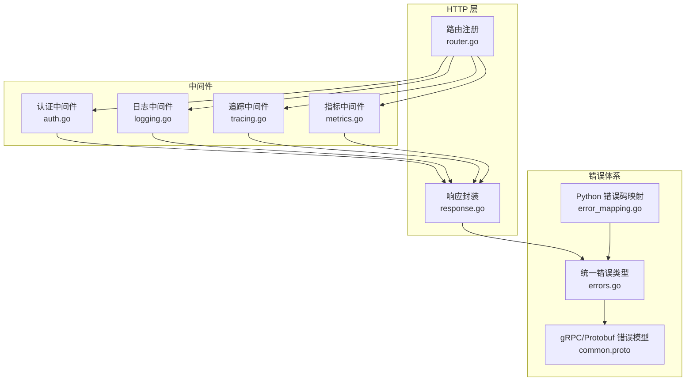
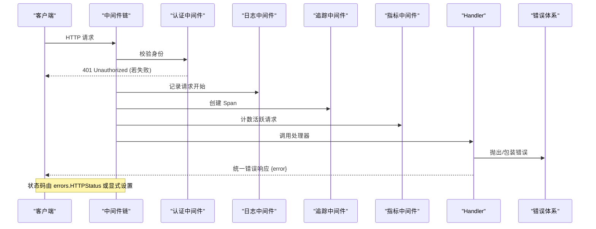
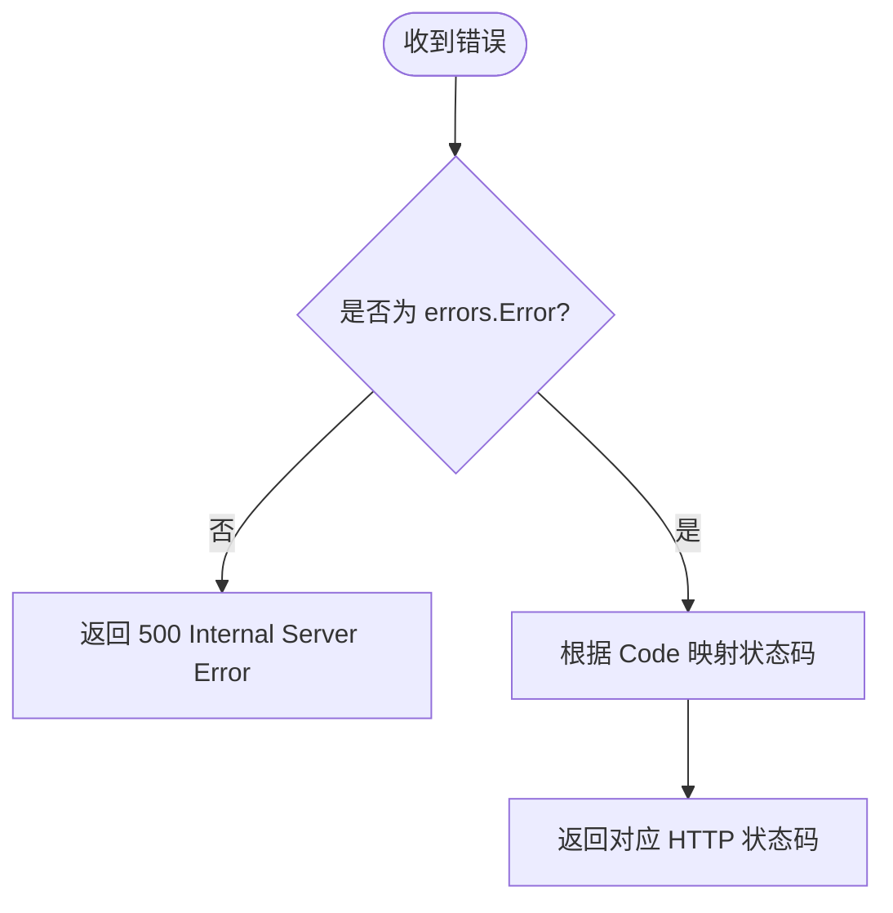
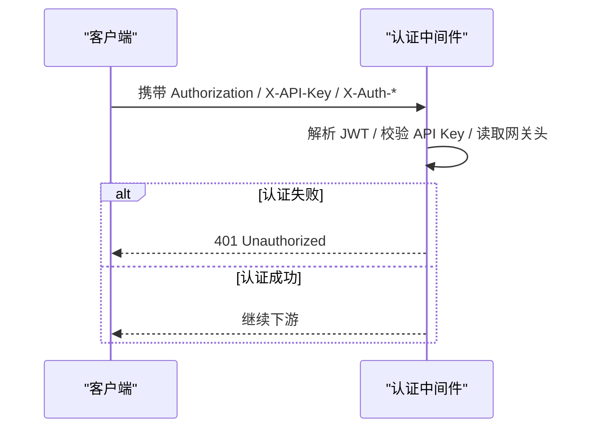
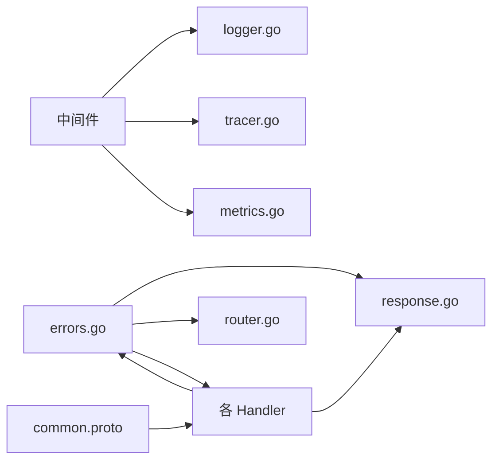

# 错误码与异常

<cite>
**本文引用的文件**
- [pkg/errors/errors.go](file://pkg/errors/errors.go)
- [pkg/server/response.go](file://pkg/server/response.go)
- [pkg/server/middleware/auth.go](file://pkg/server/middleware/auth.go)
- [pkg/server/middleware/logging.go](file://pkg/server/middleware/logging.go)
- [pkg/server/middleware/tracing.go](file://pkg/server/middleware/tracing.go)
- [pkg/telemetry/logger.go](file://pkg/telemetry/logger.go)
- [pkg/telemetry/tracer.go](file://pkg/telemetry/tracer.go)
- [pkg/telemetry/metrics.go](file://pkg/telemetry/metrics.go)
- [api/proto/resolveagent/v1/common.proto](file://api/proto/resolveagent/v1/common.proto)
- [pkg/server/error_mapping.go](file://pkg/server/error_mapping.go)
- [pkg/server/router.go](file://pkg/server/router.go)
- [pkg/server/solution_handler.go](file://pkg/server/solution_handler.go)
</cite>

## 目录
1. [简介](#简介)
2. [项目结构](#项目结构)
3. [核心组件](#核心组件)
4. [架构总览](#架构总览)
5. [详细组件分析](#详细组件分析)
6. [依赖关系分析](#依赖关系分析)
7. [性能考量](#性能考量)
8. [故障排查指南](#故障排查指南)
9. [结论](#结论)
10. [附录](#附录)

## 简介
本参考文档聚焦 ResolveAgent 的错误码与异常处理，覆盖：
- HTTP 状态码映射规则
- gRPC/Protobuf 错误模型（ErrorDetail）
- 自定义错误类型与统一错误响应格式
- 认证失败、权限不足、资源不存在、参数验证错误、服务内部错误等场景
- 中间件错误处理机制、日志记录策略与调试信息
- 常见错误排查指南与最佳实践

## 项目结构
错误相关能力分布在以下模块：
- 统一错误定义与 HTTP 状态码映射：pkg/errors
- HTTP 响应封装与写错函数：pkg/server/response.go
- 认证与鉴权中间件：pkg/server/middleware/auth.go
- 请求日志与指标采集中间件：pkg/server/middleware/logging.go, pkg/telemetry/metrics.go
- 链路追踪中间件：pkg/server/middleware/tracing.go, pkg/telemetry/tracer.go
- Protobuf 通用错误模型：api/proto/resolveagent/v1/common.proto
- Python 运行时错误码到 Go 错误码的映射：pkg/server/error_mapping.go
- Handler 层示例错误处理：pkg/server/solution_handler.go

**图表来源**
- [pkg/server/router.go:5-137](file://pkg/server/router.go#L5-L137)
- [pkg/server/response.go:8-16](file://pkg/server/response.go#L8-L16)
- [pkg/server/middleware/auth.go:76-103](file://pkg/server/middleware/auth.go#L76-L103)
- [pkg/server/middleware/logging.go:19-37](file://pkg/server/middleware/logging.go#L19-L37)
- [pkg/server/middleware/tracing.go:49-66](file://pkg/server/middleware/tracing.go#L49-L66)
- [pkg/telemetry/metrics.go:259-291](file://pkg/telemetry/metrics.go#L259-L291)
- [pkg/errors/errors.go:26-122](file://pkg/errors/errors.go#L26-L122)
- [pkg/server/error_mapping.go:7-32](file://pkg/server/error_mapping.go#L7-L32)
- [api/proto/resolveagent/v1/common.proto:21-26](file://api/proto/resolveagent/v1/common.proto#L21-L26)

**章节来源**
- [pkg/server/router.go:5-137](file://pkg/server/router.go#L5-L137)
- [pkg/server/response.go:8-16](file://pkg/server/response.go#L8-L16)

## 核心组件
- 统一错误类型与错误码：提供结构化错误 Error、错误码 Code、便捷构造器 NotFound/AlreadyExists/InvalidArgument、以及 HTTPStatus 映射。
- HTTP 响应封装：writeJSON/writeError 统一返回 JSON 格式错误体。
- 认证中间件：支持网关头、JWT、API Key 三种认证方式；认证失败返回 401。
- 日志与指标：记录请求方法、路径、状态码、耗时；统计成功/失败请求。
- 链路追踪：基于 OpenTelemetry，自动标记错误 Span。
- Protobuf 错误模型：ErrorDetail 包含 code/message/metadata，用于跨语言一致的错误描述。
- Python 错误码映射：将 Python 运行时错误码映射为 Go errors.Code，未知默认 INTERNAL。

**章节来源**
- [pkg/errors/errors.go:26-122](file://pkg/errors/errors.go#L26-L122)
- [pkg/server/response.go:8-16](file://pkg/server/response.go#L8-L16)
- [pkg/server/middleware/auth.go:76-103](file://pkg/server/middleware/auth.go#L76-L103)
- [pkg/server/middleware/logging.go:19-37](file://pkg/server/middleware/logging.go#L19-L37)
- [pkg/telemetry/metrics.go:259-291](file://pkg/telemetry/metrics.go#L259-L291)
- [pkg/server/middleware/tracing.go:49-66](file://pkg/server/middleware/tracing.go#L49-L66)
- [api/proto/resolveagent/v1/common.proto:21-26](file://api/proto/resolveagent/v1/common.proto#L21-L26)
- [pkg/server/error_mapping.go:7-32](file://pkg/server/error_mapping.go#L7-L32)

## 架构总览
请求进入服务器后，依次经过认证、日志、追踪、指标等中间件，最终到达具体 Handler。Handler 使用 writeError/writeJSON 输出统一格式的响应。错误在业务层通过 errors.Error 表达，并在需要时映射为 HTTP 状态码或 gRPC 错误模型。

**图表来源**
- [pkg/server/middleware/auth.go:76-103](file://pkg/server/middleware/auth.go#L76-L103)
- [pkg/server/middleware/logging.go:19-37](file://pkg/server/middleware/logging.go#L19-L37)
- [pkg/server/middleware/tracing.go:49-66](file://pkg/server/middleware/tracing.go#L49-L66)
- [pkg/telemetry/metrics.go:259-291](file://pkg/telemetry/metrics.go#L259-L291)
- [pkg/errors/errors.go:96-122](file://pkg/errors/errors.go#L96-L122)
- [pkg/server/response.go:14-16](file://pkg/server/response.go#L14-L16)

## 详细组件分析

### 统一错误类型与 HTTP 状态码映射
- 错误码集合：NOT_FOUND、ALREADY_EXISTS、INVALID_ARGUMENT、UNAUTHORIZED、FORBIDDEN、INTERNAL、UNAVAILABLE、TIMEOUT、CONFLICT、RATE_LIMITED。
- HTTPStatus 映射：
  - NOT_FOUND → 404
  - ALREADY_EXISTS → 409
  - INVALID_ARGUMENT → 400
  - UNAUTHORIZED → 401
  - FORBIDDEN → 403
  - UNAVAILABLE → 503
  - TIMEOUT → 504
  - CONFLICT → 409
  - RATE_LIMITED → 429
  - 其他未识别错误 → 500
- 便捷构造器：NotFound(entity,id)、AlreadyExists(entity,id)、InvalidArgument(field,reason)。
- 错误链：Error 支持 Cause 包装，便于定位根因。

**图表来源**
- [pkg/errors/errors.go:26-122](file://pkg/errors/errors.go#L26-L122)

**章节来源**
- [pkg/errors/errors.go:26-122](file://pkg/errors/errors.go#L26-L122)

### HTTP 错误响应格式
- 统一错误体：{ "error": "消息" }
- 由 writeError 生成，确保所有 API 错误响应格式一致。
- Handler 中常见错误场景：
  - 读取请求体失败 → 400
  - JSON 解析失败 → 400
  - 必填字段缺失 → 400
  - 资源已存在 → 409
  - 资源不存在 → 404
  - 执行失败 → 500

**章节来源**
- [pkg/server/response.go:14-16](file://pkg/server/response.go#L14-L16)
- [pkg/server/solution_handler.go:50-88](file://pkg/server/solution_handler.go#L50-L88)

### 认证与鉴权错误
- 认证失败（无有效凭据、JWT 无效、API Key 过期/无效）→ 401 Unauthorized
- 鉴权失败（缺少角色）→ 403 Forbidden（可在后续鉴权逻辑中使用 HasRole）
- 中间件会记录警告日志并直接返回 401。

**图表来源**
- [pkg/server/middleware/auth.go:76-103](file://pkg/server/middleware/auth.go#L76-L103)
- [pkg/server/middleware/auth.go:114-132](file://pkg/server/middleware/auth.go#L114-L132)
- [pkg/server/middleware/auth.go:153-207](file://pkg/server/middleware/auth.go#L153-L207)
- [pkg/server/middleware/auth.go:209-228](file://pkg/server/middleware/auth.go#L209-L228)

**章节来源**
- [pkg/server/middleware/auth.go:76-103](file://pkg/server/middleware/auth.go#L76-L103)
- [pkg/server/middleware/auth.go:114-132](file://pkg/server/middleware/auth.go#L114-L132)
- [pkg/server/middleware/auth.go:153-207](file://pkg/server/middleware/auth.go#L153-L207)
- [pkg/server/middleware/auth.go:209-228](file://pkg/server/middleware/auth.go#L209-L228)

### 参数验证错误
- 典型场景：
  - 请求体读取失败 → 400
  - JSON 解析失败 → 400
  - 必填字段缺失 → 400
- 建议：在 Handler 入口处进行参数校验，使用 InvalidArgument 构造错误并通过 writeError 返回。

**章节来源**
- [pkg/server/solution_handler.go:50-88](file://pkg/server/solution_handler.go#L50-L88)

### 资源不存在与冲突
- 资源不存在 → 404 Not Found
- 资源已存在 → 409 Conflict
- 通用冲突 → 409 Conflict

**章节来源**
- [pkg/server/solution_handler.go:83-88](file://pkg/server/solution_handler.go#L83-L88)
- [pkg/server/solution_handler.go:90-100](file://pkg/server/solution_handler.go#L90-L100)

### 服务不可用与超时
- 服务不可用（如 RAG 服务不可达）→ 503 Service Unavailable
- 操作超时 → 504 Gateway Timeout
- 请求上下文超时（Handler 层）→ 408 Request Timeout

**章节来源**
- [pkg/errors/errors.go:96-122](file://pkg/errors/errors.go#L96-L122)

### gRPC/Protobuf 错误模型
- ErrorDetail：包含 code、message、metadata，用于跨语言一致的错误描述。
- 适用于 gRPC 或跨服务通信时的错误传递。

**章节来源**
- [api/proto/resolveagent/v1/common.proto:21-26](file://api/proto/resolveagent/v1/common.proto#L21-L26)

### Python 运行时错误码映射
- mapPythonErrorCode 将 Python 运行时报错字符串映射为 Go errors.Code。
- 未知代码默认映射为 INTERNAL，保证系统稳定性。

**章节来源**
- [pkg/server/error_mapping.go:7-32](file://pkg/server/error_mapping.go#L7-L32)

### 日志、指标与追踪
- 日志中间件：记录 method、path、status、duration、remote_addr。
- 指标中间件：统计活跃请求数、请求耗时、成功/失败分类。
- 追踪中间件：基于 OpenTelemetry，自动记录 Span，并在状态码≥400 时标记 error。

**章节来源**
- [pkg/server/middleware/logging.go:19-37](file://pkg/server/middleware/logging.go#L19-L37)
- [pkg/telemetry/metrics.go:259-291](file://pkg/telemetry/metrics.go#L259-L291)
- [pkg/server/middleware/tracing.go:49-66](file://pkg/server/middleware/tracing.go#L49-L66)
- [pkg/telemetry/tracer.go:185-199](file://pkg/telemetry/tracer.go#L185-L199)

## 依赖关系分析
- 错误体系（errors）被 server 层广泛引用，用于统一错误表达与状态码映射。
- 中间件依赖 logger、tracer、metrics 以完成可观测性。
- Handler 依赖 response 工具函数输出统一错误格式。
- Protobuf 错误模型为跨语言错误传递提供契约。

**图表来源**
- [pkg/errors/errors.go:26-122](file://pkg/errors/errors.go#L26-L122)
- [pkg/server/response.go:8-16](file://pkg/server/response.go#L8-L16)
- [pkg/server/router.go:5-137](file://pkg/server/router.go#L5-L137)
- [pkg/server/middleware/logging.go:19-37](file://pkg/server/middleware/logging.go#L19-L37)
- [pkg/telemetry/logger.go:8-35](file://pkg/telemetry/logger.go#L8-L35)
- [pkg/telemetry/tracer.go:185-199](file://pkg/telemetry/tracer.go#L185-L199)
- [pkg/telemetry/metrics.go:259-291](file://pkg/telemetry/metrics.go#L259-L291)
- [api/proto/resolveagent/v1/common.proto:21-26](file://api/proto/resolveagent/v1/common.proto#L21-L26)

**章节来源**
- [pkg/errors/errors.go:26-122](file://pkg/errors/errors.go#L26-L122)
- [pkg/server/response.go:8-16](file://pkg/server/response.go#L8-L16)
- [pkg/server/router.go:5-137](file://pkg/server/router.go#L5-L137)

## 性能考量
- 中间件开销：日志、指标、追踪均会增加少量 CPU 与内存开销，建议在非生产环境关闭或降低采样率。
- 错误包装：避免过度嵌套错误链，保持错误信息简洁明确，减少序列化与传输成本。
- 状态码选择：合理选择状态码有助于前端快速重试或降级，减少无效请求。

[本节为通用指导，不直接分析具体文件]

## 故障排查指南
- 认证失败（401）
  - 检查 Authorization/Bearer Token、X-API-Key、网关头是否配置正确。
  - 查看认证中间件日志中的警告信息。
  - 参考：[认证中间件:76-103](file://pkg/server/middleware/auth.go#L76-L103)
- 参数验证错误（400）
  - 检查请求体 JSON 结构与必填字段。
  - 参考：[解决方案创建处理器:50-88](file://pkg/server/solution_handler.go#L50-L88)
- 资源不存在（404）
  - 确认 ID 是否正确，资源是否已被删除。
  - 参考：[解决方案获取处理器:90-100](file://pkg/server/solution_handler.go#L90-L100)
- 资源冲突（409）
  - 检查重复创建或并发写入导致的冲突。
  - 参考：[解决方案创建处理器:83-88](file://pkg/server/solution_handler.go#L83-L88)
- 服务不可用（503）
  - 检查下游服务（如 RAG）健康状态与连接。
  - 参考：[HTTP 状态码映射:96-122](file://pkg/errors/errors.go#L96-L122)
- 超时（408/504）
  - 检查请求上下文超时配置与下游响应时间。
  - 参考：[HTTP 状态码映射:96-122](file://pkg/errors/errors.go#L96-L122)
- 内部错误（500）
  - 查看日志与追踪，定位根因。
  - 参考：[指标中间件:259-291](file://pkg/telemetry/metrics.go#L259-L291)、[追踪中间件:49-66](file://pkg/server/middleware/tracing.go#L49-L66)

**章节来源**
- [pkg/server/middleware/auth.go:76-103](file://pkg/server/middleware/auth.go#L76-L103)
- [pkg/server/solution_handler.go:50-100](file://pkg/server/solution_handler.go#L50-L100)
- [pkg/errors/errors.go:96-122](file://pkg/errors/errors.go#L96-L122)
- [pkg/telemetry/metrics.go:259-291](file://pkg/telemetry/metrics.go#L259-L291)
- [pkg/server/middleware/tracing.go:49-66](file://pkg/server/middleware/tracing.go#L49-L66)

## 结论
ResolveAgent 通过统一的错误类型、明确的 HTTP 状态码映射、一致的 JSON 错误响应格式，以及完善的中间件可观测性（日志、指标、追踪），构建了健壮的错误处理体系。结合 Protobuf 错误模型，可实现跨语言一致的错误传递。遵循本文档的最佳实践，可有效提升系统的可维护性与可诊断性。

[本节为总结，不直接分析具体文件]

## 附录

### HTTP 状态码与错误码对照表
- NOT_FOUND → 404
- ALREADY_EXISTS → 409
- INVALID_ARGUMENT → 400
- UNAUTHORIZED → 401
- FORBIDDEN → 403
- INTERNAL → 500
- UNAVAILABLE → 503
- TIMEOUT → 504
- CONFLICT → 409
- RATE_LIMITED → 429

**章节来源**
- [pkg/errors/errors.go:96-122](file://pkg/errors/errors.go#L96-L122)

### gRPC/Protobuf 错误模型
- ErrorDetail：code、message、metadata

**章节来源**
- [api/proto/resolveagent/v1/common.proto:21-26](file://api/proto/resolveagent/v1/common.proto#L21-L26)

### 中间件错误处理要点
- 认证失败直接返回 401，并记录警告日志。
- 日志中间件记录请求方法与状态码，便于审计。
- 追踪中间件在状态码≥400 时标记错误 Span。
- 指标中间件统计成功/失败请求，辅助容量规划。

**章节来源**
- [pkg/server/middleware/auth.go:76-103](file://pkg/server/middleware/auth.go#L76-L103)
- [pkg/server/middleware/logging.go:19-37](file://pkg/server/middleware/logging.go#L19-L37)
- [pkg/server/middleware/tracing.go:49-66](file://pkg/server/middleware/tracing.go#L49-L66)
- [pkg/telemetry/metrics.go:259-291](file://pkg/telemetry/metrics.go#L259-L291)