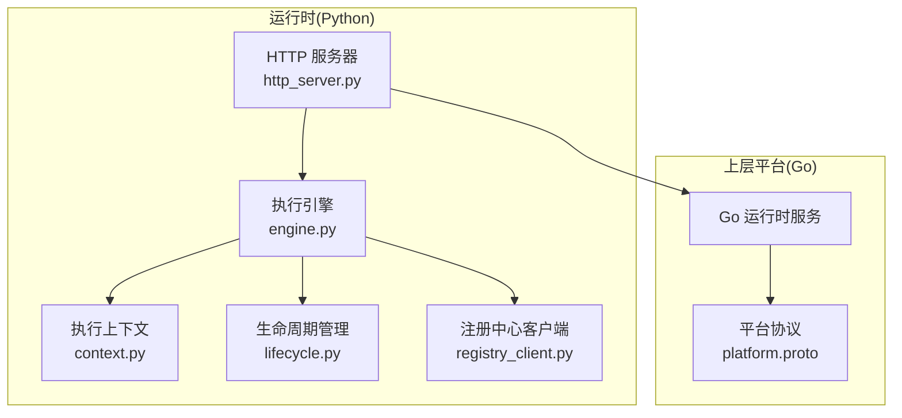
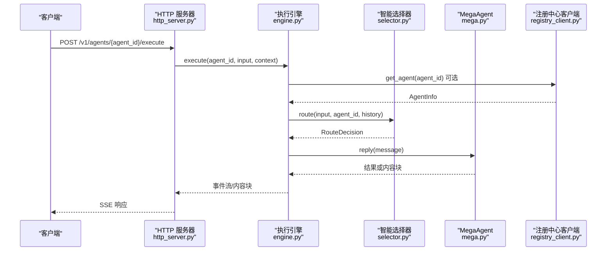
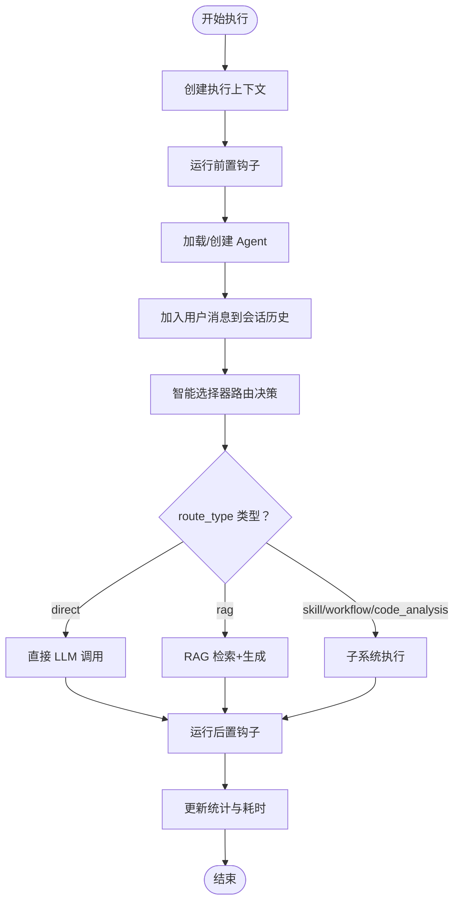
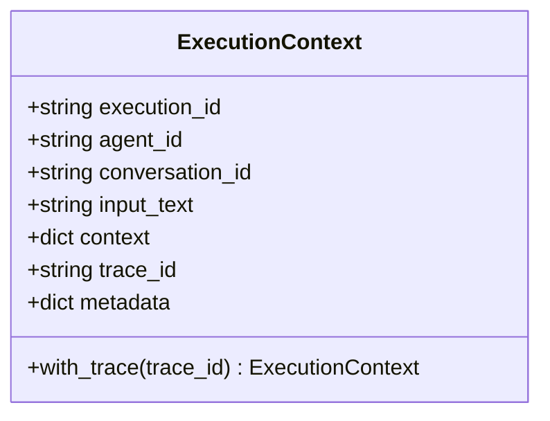
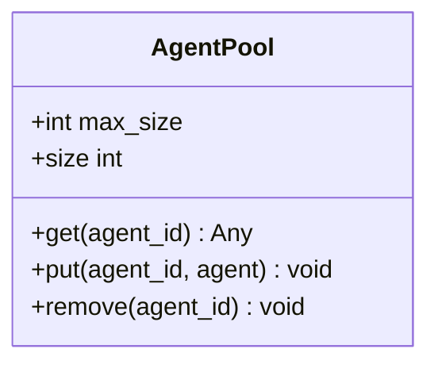
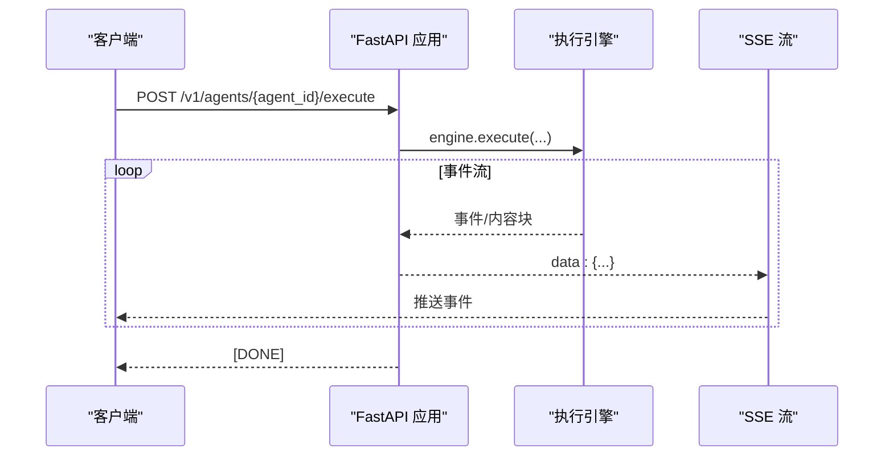
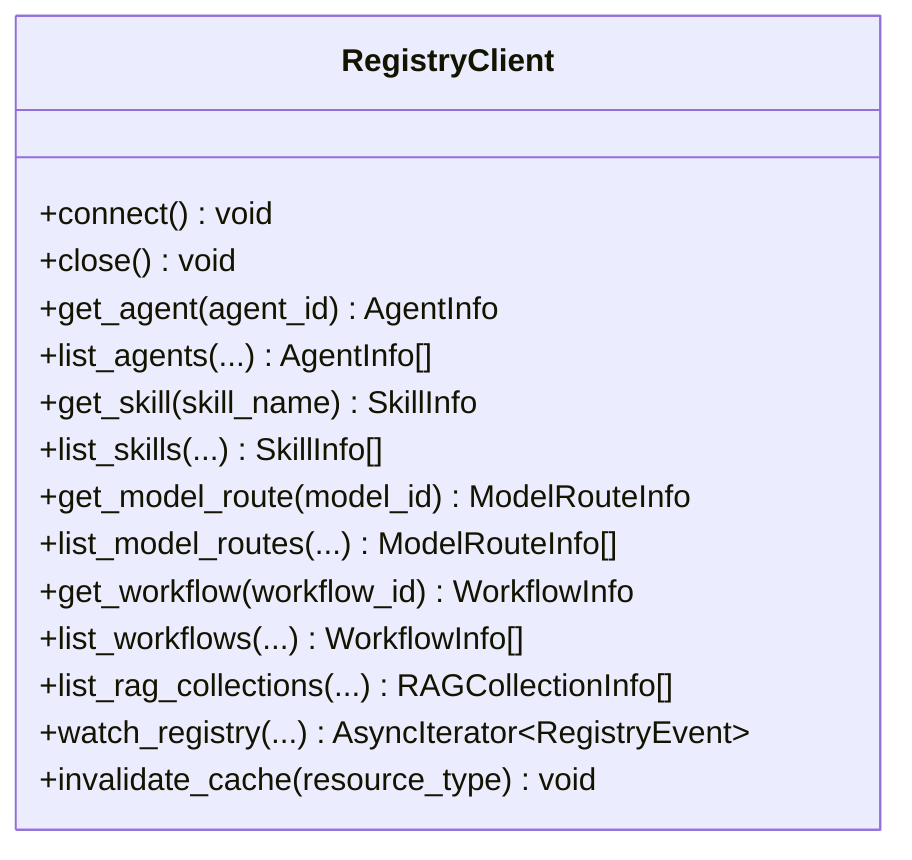
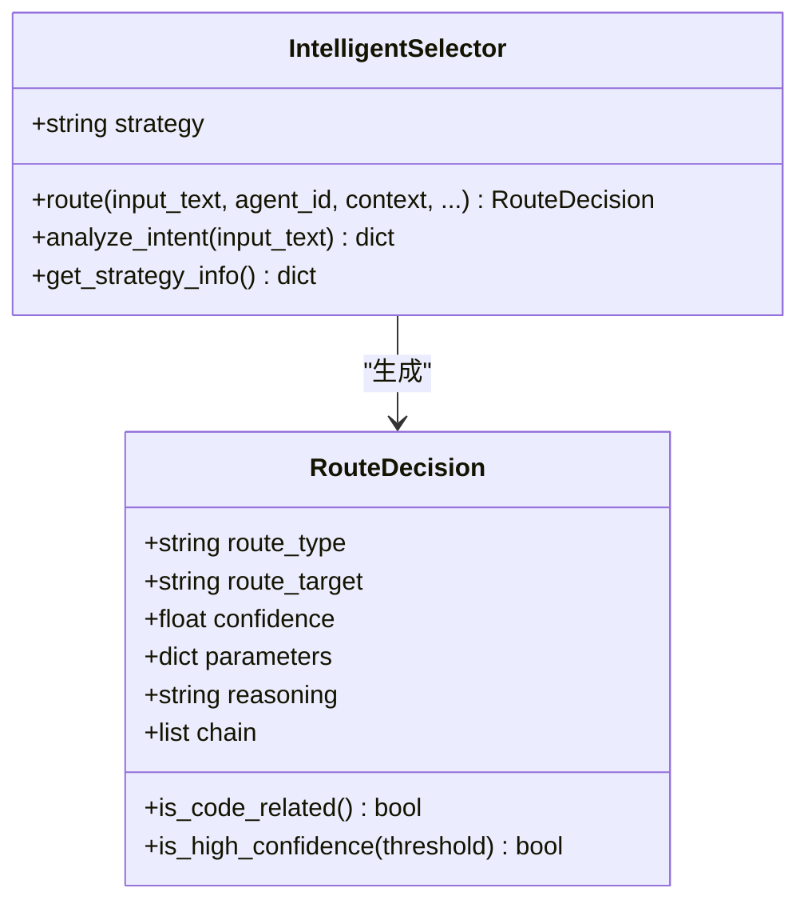
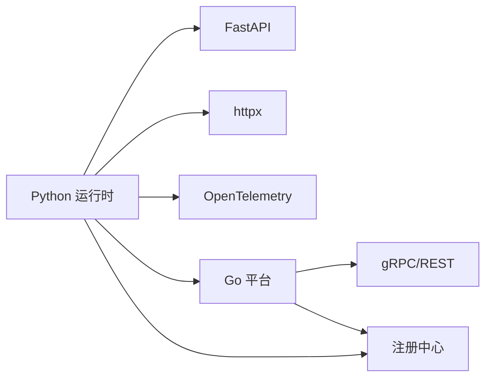

# Agent 运行时

<cite>
**本文引用的文件**
- [engine.py](file://python/src/resolveagent/runtime/engine.py)
- [context.py](file://python/src/resolveagent/runtime/context.py)
- [lifecycle.py](file://python/src/resolveagent/runtime/lifecycle.py)
- [http_server.py](file://python/src/resolveagent/runtime/http_server.py)
- [server.py](file://python/src/resolveagent/runtime/server.py)
- [registry_client.py](file://python/src/resolveagent/runtime/registry_client.py)
- [mega.py](file://python/src/resolveagent/agent/mega.py)
- [selector.py](file://python/src/resolveagent/selector/selector.py)
- [runtime.yaml](file://configs/runtime.yaml)
- [resolveagent.yaml](file://configs/resolveagent.yaml)
- [platform.proto](file://api/proto/resolveagent/v1/platform.proto)
- [pyproject.toml](file://python/pyproject.toml)
- [models.py](file://python/src/resolveagent/hooks/models.py)
</cite>

## 目录
1. [简介](#简介)
2. [项目结构](#项目结构)
3. [核心组件](#核心组件)
4. [架构总览](#架构总览)
5. [详细组件分析](#详细组件分析)
6. [依赖分析](#依赖分析)
7. [性能考虑](#性能考虑)
8. [故障排查指南](#故障排查指南)
9. [结论](#结论)
10. [附录](#附录)

## 简介
本文件面向 ResolveAgent 项目的 Agent 运行时系统，聚焦 Python 运行时的架构设计与实现细节，涵盖执行引擎、上下文管理、生命周期管理、HTTP 服务器、平台服务通信、任务调度、资源分配与容错机制，并提供配置管理、性能优化与扩展开发指南及使用示例与最佳实践。

## 项目结构
运行时相关的核心代码位于 python/src/resolveagent/runtime 下，配合 selector、agent、rag、code_analysis、traffic 等子模块协同工作；配置位于 configs 目录；API 协议定义在 api/proto/resolveagent/v1。

图表来源
- [http_server.py:28-615](file://python/src/resolveagent/runtime/http_server.py#L28-L615)
- [engine.py:18-717](file://python/src/resolveagent/runtime/engine.py#L18-L717)
- [context.py:9-35](file://python/src/resolveagent/runtime/context.py#L9-L35)
- [lifecycle.py:12-52](file://python/src/resolveagent/runtime/lifecycle.py#L12-L52)
- [registry_client.py:115-628](file://python/src/resolveagent/runtime/registry_client.py#L115-L628)
- [platform.proto:1-61](file://api/proto/resolveagent/v1/platform.proto#L1-L61)

章节来源
- [http_server.py:28-615](file://python/src/resolveagent/runtime/http_server.py#L28-L615)
- [engine.py:18-717](file://python/src/resolveagent/runtime/engine.py#L18-L717)
- [context.py:9-35](file://python/src/resolveagent/runtime/context.py#L9-L35)
- [lifecycle.py:12-52](file://python/src/resolveagent/runtime/lifecycle.py#L12-L52)
- [registry_client.py:115-628](file://python/src/resolveagent/runtime/registry_client.py#L115-L628)
- [platform.proto:1-61](file://api/proto/resolveagent/v1/platform.proto#L1-L61)

## 核心组件
- 执行引擎：负责创建执行上下文、加载/缓存 Agent、调用智能选择器进行路由决策、分发到不同子系统（直接 LLM、RAG、技能、工作流、代码分析等），并支持事件流输出与钩子前后置处理。
- 上下文管理：以数据类形式封装单次执行的标识、对话会话、输入文本、附加上下文、追踪 ID 与元数据。
- 生命周期管理：提供 Agent 池（LRU）与生命周期管理器，用于实例缓存与优雅启停。
- HTTP 服务器：FastAPI 实现的 REST API，映射到 gRPC/平台服务语义，提供代理执行、工作流执行、RAG 查询/导入、技能执行、知识库同步、代码分析、流量分析等接口。
- 注册中心客户端：通过 HTTP/REST 访问 Go 平台注册中心，作为“单一真实来源”，提供 Agent、技能、模型路由、工作流、RAG 集合等信息查询与缓存。
- 智能选择器：根据意图分析、上下文增强与策略（LLM/规则/Hybrid）生成路由决策，支持缓存与置信度评估。
- MegaAgent：顶层编排器，依据选择器决策调用对应子系统并聚合结果。

章节来源
- [engine.py:18-717](file://python/src/resolveagent/runtime/engine.py#L18-L717)
- [context.py:9-35](file://python/src/resolveagent/runtime/context.py#L9-L35)
- [lifecycle.py:12-52](file://python/src/resolveagent/runtime/lifecycle.py#L12-L52)
- [http_server.py:28-615](file://python/src/resolveagent/runtime/http_server.py#L28-L615)
- [registry_client.py:115-628](file://python/src/resolveagent/runtime/registry_client.py#L115-L628)
- [selector.py:80-308](file://python/src/resolveagent/selector/selector.py#L80-L308)
- [mega.py:20-668](file://python/src/resolveagent/agent/mega.py#L20-L668)

## 架构总览
运行时采用“HTTP 网关 + 执行引擎 + 子系统”的分层架构。Go 平台通过 HTTP/REST 或 gRPC 提供统一入口，Python 运行时负责具体执行与编排；注册中心作为单一真实来源，提供资源发现与配置；智能选择器贯穿请求路由，结合缓存与上下文增强提升准确性与性能。

图表来源
- [http_server.py:79-115](file://python/src/resolveagent/runtime/http_server.py#L79-L115)
- [engine.py:53-250](file://python/src/resolveagent/runtime/engine.py#L53-L250)
- [selector.py:162-215](file://python/src/resolveagent/selector/selector.py#L162-L215)
- [mega.py:76-124](file://python/src/resolveagent/agent/mega.py#L76-L124)
- [registry_client.py:194-224](file://python/src/resolveagent/runtime/registry_client.py#L194-L224)

## 详细组件分析

### 执行引擎（ExecutionEngine）
- 职责
  - 创建并维护执行上下文，记录会话历史，支持事件流输出。
  - 加载/缓存 Agent（优先来自注册中心配置，否则使用默认配置）。
  - 调用智能选择器进行路由决策，按类型分派到直接 LLM、RAG、技能、工作流或代码分析。
  - 支持同步与流式两种执行模式，流式模式逐段产出内容块。
  - 在执行前后运行生命周期钩子，支持错误事件与统计上报。
- 关键流程
  - 会话管理：自动为新会话生成 ID，维护最近 N 条消息。
  - 路由决策：从最近对话中截取上下文，返回 RouteDecision。
  - 子系统执行：根据 route_type 分派至不同子系统；RAG 流程先检索再生成最终回复。
  - 钩子：在 pre/post 触发点注入 HookContext，允许修改输入数据。
- 容错与可观测性
  - 统一异常捕获，输出 execution.failed 事件与错误内容块。
  - 记录执行耗时、累计执行次数、活跃会话数等指标。
- 复杂度
  - 路由决策受策略影响，复杂度取决于策略实现；典型为 O(n) 到 O(n log n)，其中 n 为规则/候选集规模。
  - RAG 流程包含检索与生成两阶段，整体复杂度与 top_k、向量库性能相关。

图表来源
- [engine.py:53-250](file://python/src/resolveagent/runtime/engine.py#L53-L250)
- [engine.py:303-505](file://python/src/resolveagent/runtime/engine.py#L303-L505)
- [engine.py:531-703](file://python/src/resolveagent/runtime/engine.py#L531-L703)

章节来源
- [engine.py:18-717](file://python/src/resolveagent/runtime/engine.py#L18-L717)

### 执行上下文（ExecutionContext）
- 作用：承载一次执行的唯一标识、所属 Agent、会话 ID、输入文本、附加上下文、追踪 ID 与可变元数据。
- 特性：提供 with_trace 方法复制上下文并设置追踪 ID，便于跨组件传递。

图表来源
- [context.py:9-35](file://python/src/resolveagent/runtime/context.py#L9-L35)

章节来源
- [context.py:9-35](file://python/src/resolveagent/runtime/context.py#L9-L35)

### 生命周期管理（AgentPool 与生命周期管理器）
- AgentPool：基于有序字典实现 LRU 缓存，容量满时淘汰最久未使用项；支持获取、放入、移除与尺寸查询。
- 生命周期管理器：在 HTTP 服务器生命周期内初始化与关闭，连接/断开技能存储客户端，确保资源正确释放。

图表来源
- [lifecycle.py:12-52](file://python/src/resolveagent/runtime/lifecycle.py#L12-L52)

章节来源
- [lifecycle.py:12-52](file://python/src/resolveagent/runtime/lifecycle.py#L12-L52)
- [http_server.py:48-65](file://python/src/resolveagent/runtime/http_server.py#L48-L65)

### HTTP 服务器（RuntimeHTTPServer）
- 功能
  - 提供健康检查、代理执行、工作流执行、RAG 查询/导入、技能执行、知识库同步、代码分析、流量分析等端点。
  - 使用 FastAPI + Uvicorn，SSE 输出事件流，便于前端实时渲染。
  - 在应用生命周期内连接注册中心客户端与技能存储客户端，启动/停止时清理资源。
- 端点概览
  - GET /health：健康检查
  - POST /v1/agents/{agent_id}/execute：代理执行（SSE）
  - POST /v1/workflows/{workflow_id}/execute：工作流执行（SSE）
  - POST /v1/rag/query：RAG 查询
  - POST /v1/rag/ingest：RAG 导入
  - POST /v1/skills/{skill_name}/execute：技能执行
  - POST /v1/solutions/sync-rag：解决方案同步到 RAG
  - POST /v1/solutions/semantic-search：解决方案语义检索
  - POST /v1/code-analysis/static：静态代码分析（SSE）
  - POST /v1/code-analysis/traffic：动态流量分析（SSE）
  - POST /v1/code-analysis/errors/parse：错误解析
  - POST /v1/code-analysis/traffic/graphs/{graph_id}/analyze：流量图分析

图表来源
- [http_server.py:79-115](file://python/src/resolveagent/runtime/http_server.py#L79-L115)
- [http_server.py:88-110](file://python/src/resolveagent/runtime/http_server.py#L88-L110)

章节来源
- [http_server.py:28-615](file://python/src/resolveagent/runtime/http_server.py#L28-L615)

### 注册中心客户端（RegistryClient）
- 作用：通过 HTTP/REST 查询 Go 平台注册中心，作为“单一真实来源”提供 Agent、技能、模型路由、工作流、RAG 集合等信息。
- 特性
  - 异步 HTTP 客户端，带超时与连接管理。
  - 内置缓存（TTL）减少重复查询。
  - 提供多种查询方法与占位的变更监听接口。
- 与运行时集成：执行引擎在加载 Agent 时可从注册中心获取配置，智能选择器可查询可用资源。

图表来源
- [registry_client.py:115-628](file://python/src/resolveagent/runtime/registry_client.py#L115-L628)

章节来源
- [registry_client.py:115-628](file://python/src/resolveagent/runtime/registry_client.py#L115-L628)

### 智能选择器（IntelligentSelector）
- 作用：对用户输入进行意图分析、上下文增强与路由决策，支持 LLM、规则与混合策略。
- 特性
  - 决策模型 RouteDecision 包含 route_type、route_target、confidence、parameters、reasoning、chain 等字段。
  - 支持缓存（实例级/全局级），降低重复计算。
  - 提供 intent 分析与上下文增强能力。
- 与执行引擎协作：执行引擎在每次执行前调用 selector.route 获取决策，再按类型分派。

图表来源
- [selector.py:80-308](file://python/src/resolveagent/selector/selector.py#L80-L308)

章节来源
- [selector.py:80-308](file://python/src/resolveagent/selector/selector.py#L80-L308)

### MegaAgent
- 作用：顶层编排器，接收消息并通过智能选择器决定路由，调用对应子系统（直接 LLM、RAG、技能、工作流、代码分析、多路由链）并聚合结果。
- 特性
  - 支持多种选择器模式（selector、hooks、skills）。
  - 对 RAG 结果格式化后拼接提示词，再调用 LLM 生成最终回复。
  - 对代码分析提供静态分析、动态流量分析与 LLM 回退三种子类型。

章节来源
- [mega.py:20-668](file://python/src/resolveagent/agent/mega.py#L20-L668)

### gRPC 服务器（AgentExecutionServer）
- 说明：当前为占位实现，未来将通过生成的服务桩与 Go 平台建立 gRPC 通道，接收 ExecuteAgent 请求并委托给执行引擎。

章节来源
- [server.py:11-61](file://python/src/resolveagent/runtime/server.py#L11-L61)

## 依赖分析
- 运行时依赖
  - FastAPI/Uvicorn：HTTP 服务器与 SSE。
  - httpx：异步 HTTP 客户端，用于访问注册中心与平台服务。
  - Pydantic：数据模型校验与序列化。
  - OpenTelemetry：遥测（在配置启用时使用）。
  - Agentscope/grpcio/protobuf：预留扩展与兼容。
- 运行时与平台交互
  - HTTP 服务器通过环境变量或配置读取平台地址，默认连接 Go 平台服务。
  - 注册中心客户端通过 HTTP/REST 查询注册表，作为单一真实来源。
  - 平台协议（platform.proto）定义了健康检查、配置获取/更新、系统信息等 RPC。

图表来源
- [pyproject.toml:19-29](file://python/pyproject.toml#L19-L29)
- [http_server.py:23-25](file://python/src/resolveagent/runtime/http_server.py#L23-L25)
- [registry_client.py:123-144](file://python/src/resolveagent/runtime/registry_client.py#L123-L144)
- [platform.proto:10-15](file://api/proto/resolveagent/v1/platform.proto#L10-L15)

章节来源
- [pyproject.toml:19-29](file://python/pyproject.toml#L19-L29)
- [http_server.py:23-25](file://python/src/resolveagent/runtime/http_server.py#L23-L25)
- [registry_client.py:123-144](file://python/src/resolveagent/runtime/registry_client.py#L123-L144)
- [platform.proto:10-15](file://api/proto/resolveagent/v1/platform.proto#L10-L15)

## 性能考虑
- 缓存策略
  - 智能选择器内置路由决策缓存（实例级/全局级），可通过配置调整最大条目与 TTL。
  - 注册中心客户端对 Agent、技能、模型路由等进行本地缓存，减少网络往返。
  - AgentPool 使用 LRU，避免频繁创建销毁带来的开销。
- I/O 与并发
  - 所有外部调用（注册中心、LLM、RAG、技能执行）均为异步，HTTP 层使用 SSE 流式推送，降低前端等待时间。
  - RAG 检索与生成分离，先检索再生成，避免一次性大负载。
- 资源限制
  - 通过配置控制会话历史长度、内存与长短期记忆策略，防止无界增长。
- 配置建议
  - 合理设置 selector.confidence_threshold 与 cache_ttl_seconds，平衡准确度与性能。
  - 控制 agent_pool.max_size，避免内存占用过高。
  - 在高并发场景下，适当增加平台与运行时的副本数与连接池参数。

章节来源
- [selector.py:152-161](file://python/src/resolveagent/selector/selector.py#L152-L161)
- [registry_client.py:140-144](file://python/src/resolveagent/runtime/registry_client.py#L140-L144)
- [lifecycle.py:19-42](file://python/src/resolveagent/runtime/lifecycle.py#L19-L42)
- [runtime.yaml:11-35](file://configs/runtime.yaml#L11-L35)

## 故障排查指南
- 常见问题定位
  - HTTP 500：检查运行时日志，确认执行引擎是否抛出异常；关注 execution.failed 事件与错误内容块。
  - 无法连接注册中心：确认环境变量 RESOLVEAGENT_PLATFORM_ADDR 或配置中的 platform_url 是否正确；检查网络连通性与超时设置。
  - 选择器命中率低：调整 selector.default_strategy 与 confidence_threshold；必要时禁用缓存验证策略效果。
  - RAG 无结果：确认 collection_id 与 filters；检查向量库可用性与嵌入模型一致性。
- 日志与监控
  - 启用遥测（telemetry.enabled）后，收集 OpenTelemetry 数据，定位慢调用与错误路径。
  - 关注执行耗时、执行次数、活跃会话数与 Agent 池大小等指标。
- 容错与回退
  - LLM 流式失败时自动回退到非流式；RAG 检索失败时记录警告并返回空结果。
  - 钩子执行失败不影响主流程，但可记录 HookResult.error 与 skip_remaining 标记。

章节来源
- [engine.py:219-248](file://python/src/resolveagent/runtime/engine.py#L219-L248)
- [http_server.py:100-101](file://python/src/resolveagent/runtime/http_server.py#L100-L101)
- [registry_client.py:146-164](file://python/src/resolveagent/runtime/registry_client.py#L146-L164)
- [models.py:26-35](file://python/src/resolveagent/hooks/models.py#L26-L35)

## 结论
ResolveAgent 的 Python 运行时以执行引擎为核心，结合智能选择器、上下文管理与生命周期管理，构建了高扩展、可观测且具备容错能力的 Agent 执行平台。通过注册中心作为单一真实来源，运行时与 Go 平台实现松耦合集成；HTTP 服务器提供丰富的 REST API 与 SSE 流式输出，满足多样化业务场景。配合合理的配置与缓存策略，可在保证性能的同时提升稳定性与可维护性。

## 附录

### 配置管理
- 运行时配置（runtime.yaml）
  - server：主机与端口
  - agent_pool：最大容量与驱逐策略
  - selector：默认策略与置信度阈值
  - telemetry：服务名与开关
  - store：平台地址、超时、重试次数与延迟
  - memory：短期与长期记忆策略
- 平台配置（resolveagent.yaml）
  - server：HTTP/gRPC 地址
  - database/redis/nats：基础依赖
  - runtime：运行时 gRPC 地址
  - gateway：网关集成、模型路由、鉴权与负载均衡
  - telemetry：OTLP 端点与指标开关
  - store：后端类型与内存存储参数

章节来源
- [runtime.yaml:1-35](file://configs/runtime.yaml#L1-L35)
- [resolveagent.yaml:1-90](file://configs/resolveagent.yaml#L1-L90)

### 使用示例与最佳实践
- 示例
  - 代理执行：POST /v1/agents/{agent_id}/execute，携带 input、conversation_id、context，接收 SSE 事件流。
  - 工作流执行：POST /v1/workflows/{workflow_id}/execute，输入 input 与 context，逐步产出内容块。
  - RAG 查询：POST /v1/rag/query，传入 collection_id、query、top_k、filters。
  - 技能执行：POST /v1/skills/{skill_name}/execute，传入 parameters 与 context。
- 最佳实践
  - 将 conversation_id 传入以复用上下文，减少重复提示词。
  - 对高频路由决策开启全局缓存，缩短响应时间。
  - 在生产环境启用遥测与日志分级，便于问题定位。
  - 对外部依赖（注册中心、向量库、LLM）设置合理超时与重试策略。
  - 使用钩子在 pre/post 阶段进行输入清洗、鉴权与输出归档。

章节来源
- [http_server.py:79-151](file://python/src/resolveagent/runtime/http_server.py#L79-L151)
- [http_server.py:153-238](file://python/src/resolveagent/runtime/http_server.py#L153-L238)
- [http_server.py:239-399](file://python/src/resolveagent/runtime/http_server.py#L239-L399)
- [http_server.py:404-581](file://python/src/resolveagent/runtime/http_server.py#L404-L581)