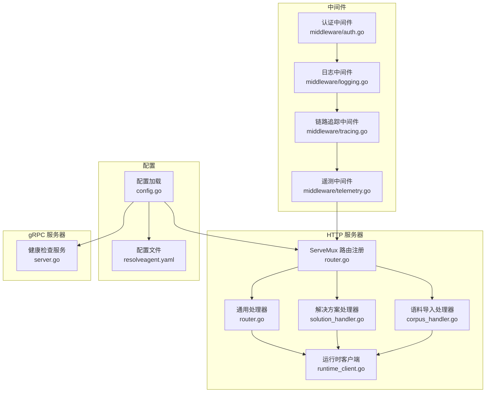
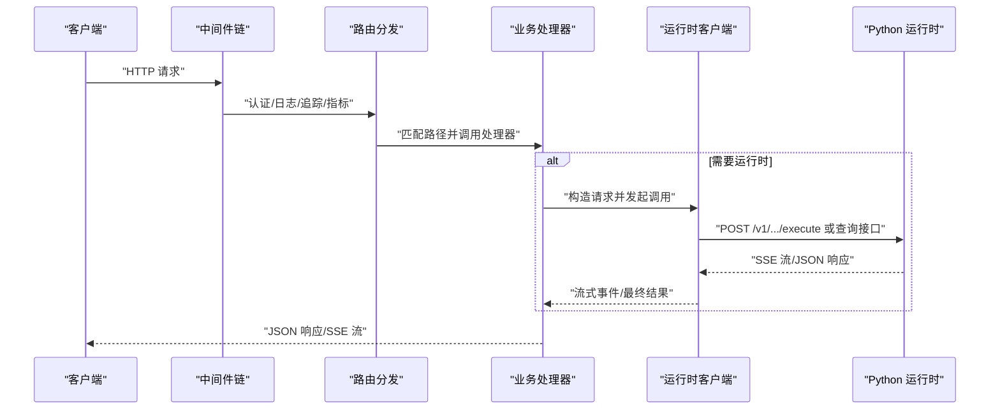
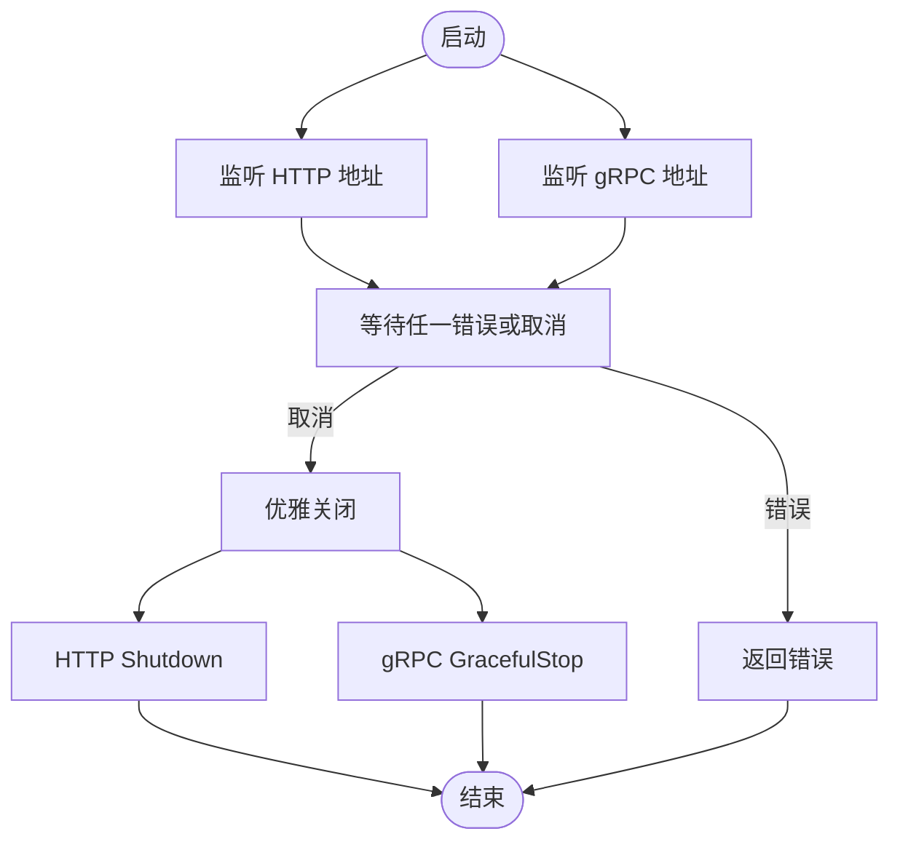
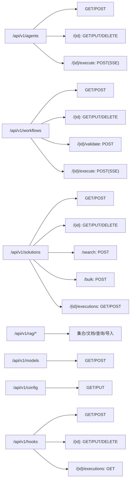
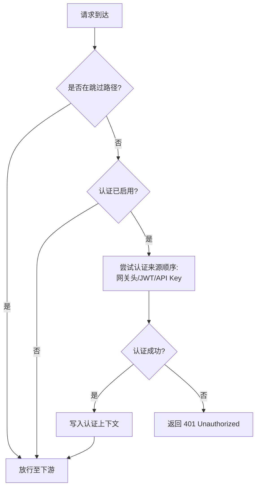
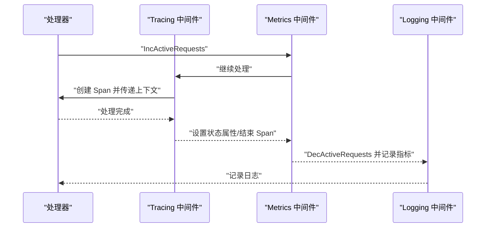
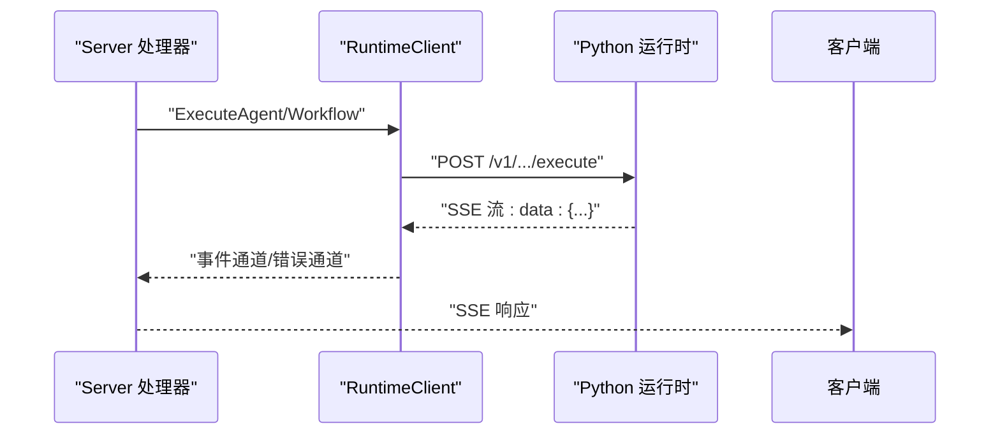
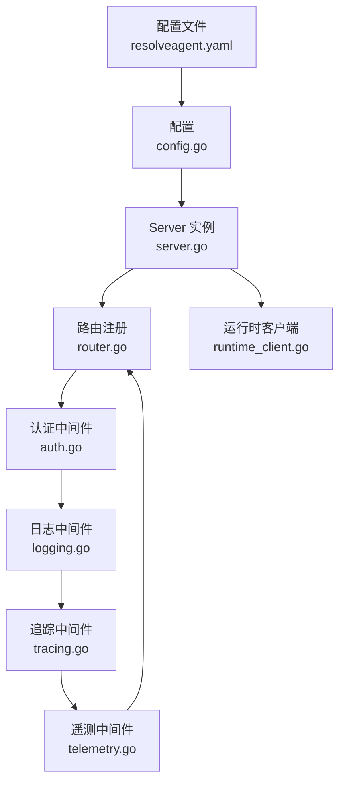

# API 服务器

<cite>
**本文引用的文件**
- [pkg/server/server.go](file://pkg/server/server.go)
- [pkg/server/router.go](file://pkg/server/router.go)
- [pkg/server/middleware/auth.go](file://pkg/server/middleware/auth.go)
- [pkg/server/middleware/logging.go](file://pkg/server/middleware/logging.go)
- [pkg/server/middleware/telemetry.go](file://pkg/server/middleware/telemetry.go)
- [pkg/server/middleware/tracing.go](file://pkg/server/middleware/tracing.go)
- [pkg/server/runtime_client.go](file://pkg/server/runtime_client.go)
- [pkg/server/corpus_handler.go](file://pkg/server/corpus_handler.go)
- [pkg/server/solution_handler.go](file://pkg/server/solution_handler.go)
- [pkg/config/config.go](file://pkg/config/config.go)
- [configs/resolveagent.yaml](file://configs/resolveagent.yaml)
</cite>

## 目录
1. [简介](#简介)
2. [项目结构](#项目结构)
3. [核心组件](#核心组件)
4. [架构总览](#架构总览)
5. [详细组件分析](#详细组件分析)
6. [依赖分析](#依赖分析)
7. [性能考虑](#性能考虑)
8. [故障排除指南](#故障排除指南)
9. [结论](#结论)
10. [附录](#附录)

## 简介
本文件面向 ResolveAgent 平台的 API 服务器，系统性阐述基于 Go 实现的 HTTP 服务器架构与运行机制。内容涵盖路由设计、中间件体系（认证、日志、遥测、链路追踪）、RESTful API 接口设计、请求处理流程、错误处理策略、性能优化、启动配置、健康检查、连接池管理与并发控制，并提供使用示例、最佳实践与故障排除建议。

## 项目结构
API 服务器位于 Go 包 pkg/server 下，采用“单进程双栈”模式：同时提供 HTTP REST API 与 gRPC 健康检查服务；HTTP 路由在 pkg/server/router.go 中集中注册；请求处理通过各资源处理器完成，部分长耗时或外部依赖操作通过 pkg/server/runtime_client.go 代理到 Python 运行时；中间件位于 pkg/server/middleware 目录，统一注入到 HTTP 处理链中；配置由 pkg/config/config.go 与 configs/resolveagent.yaml 提供。

**图表来源**
- [pkg/server/router.go:19-149](file://pkg/server/router.go#L19-L149)
- [pkg/server/server.go:74-78](file://pkg/server/server.go#L74-L78)
- [pkg/server/middleware/auth.go:77-103](file://pkg/server/middleware/auth.go#L77-L103)
- [pkg/server/middleware/logging.go:20-37](file://pkg/server/middleware/logging.go#L20-L37)
- [pkg/server/middleware/tracing.go:14-55](file://pkg/server/middleware/tracing.go#L14-L55)
- [pkg/server/middleware/telemetry.go:12-41](file://pkg/server/middleware/telemetry.go#L12-L41)
- [pkg/server/runtime_client.go:22-36](file://pkg/server/runtime_client.go#L22-L36)
- [pkg/config/config.go:11-72](file://pkg/config/config.go#L11-L72)
- [configs/resolveagent.yaml:5-26](file://configs/resolveagent.yaml#L5-L26)

**章节来源**
- [pkg/server/server.go:20-81](file://pkg/server/server.go#L20-L81)
- [pkg/server/router.go:19-149](file://pkg/server/router.go#L19-L149)
- [pkg/config/config.go:11-72](file://pkg/config/config.go#L11-L72)
- [configs/resolveagent.yaml:5-26](file://configs/resolveagent.yaml#L5-L26)

## 核心组件
- 服务器实例：包含 HTTP 与 gRPC 服务器、日志器、配置对象以及各类注册表（内存实现）。
- 路由注册：集中于 registerHTTPRoutes，定义所有 REST API 资源端点。
- 运行时客户端：封装对 Python 运行时的 HTTP 调用，支持 SSE 流式返回。
- 中间件：认证、日志、链路追踪、指标采集四类中间件按序组合。
- 配置系统：默认值、文件与环境变量合并，支持多路径查找。

**章节来源**
- [pkg/server/server.go:21-40](file://pkg/server/server.go#L21-L40)
- [pkg/server/router.go:19-149](file://pkg/server/router.go#L19-L149)
- [pkg/server/runtime_client.go:16-36](file://pkg/server/runtime_client.go#L16-L36)
- [pkg/server/middleware/auth.go:34-103](file://pkg/server/middleware/auth.go#L34-L103)
- [pkg/config/config.go:11-72](file://pkg/config/config.go#L11-L72)

## 架构总览
HTTP 服务器以 ServeMux 为核心，将不同资源的 CRUD 与执行接口映射到对应处理器；处理器内部可直接访问内存注册表或通过运行时客户端调用 Python 运行时。请求在进入业务逻辑前依次经过认证、日志、链路追踪与遥测中间件；响应返回后由日志与遥测中间件记录状态码与耗时等信息。gRPC 服务器仅用于健康检查与反射调试，不承载业务 API。

**图表来源**
- [pkg/server/router.go:19-149](file://pkg/server/router.go#L19-L149)
- [pkg/server/middleware/auth.go:77-103](file://pkg/server/middleware/auth.go#L77-L103)
- [pkg/server/middleware/logging.go:20-37](file://pkg/server/middleware/logging.go#L20-L37)
- [pkg/server/middleware/tracing.go:14-55](file://pkg/server/middleware/tracing.go#L14-L55)
- [pkg/server/middleware/telemetry.go:12-41](file://pkg/server/middleware/telemetry.go#L12-L41)
- [pkg/server/runtime_client.go:67-139](file://pkg/server/runtime_client.go#L67-L139)

**章节来源**
- [pkg/server/server.go:74-132](file://pkg/server/server.go#L74-L132)
- [pkg/server/router.go:19-149](file://pkg/server/router.go#L19-L149)

## 详细组件分析

### 服务器生命周期与并发模型
- 同时启动 HTTP 与 gRPC 两个监听器，使用 WaitGroup 并发等待任一失败或收到上下文取消信号后优雅关闭。
- HTTP 服务器在 Shutdown 时停止接受新连接，但允许现有连接在合理时间内完成。
- gRPC 服务器通过 GracefulStop 优雅停机。

**图表来源**
- [pkg/server/server.go:84-132](file://pkg/server/server.go#L84-L132)

**章节来源**
- [pkg/server/server.go:84-132](file://pkg/server/server.go#L84-L132)

### 路由设计与 RESTful API
- 版本化路径：/api/v1/...
- 资源覆盖：Agent、Skill、Workflow、RAG、模型、配置、Hook、RAG 文档、FTA 文档、代码分析、语料导入、记忆体、解决方案、调用图、流量捕获与图。
- 执行类接口：支持流式返回（SSE），典型场景为 Agent 执行与 Workflow 执行。
- 查询参数：列表接口普遍支持 limit、offset、过滤字段（如 domain、severity、status）。

**图表来源**
- [pkg/server/router.go:27-149](file://pkg/server/router.go#L27-L149)

**章节来源**
- [pkg/server/router.go:19-149](file://pkg/server/router.go#L19-L149)

### 认证与授权机制
- 支持多种认证方式：网关转发头（X-Auth-User/X-Auth-Roles）、Bearer JWT、API Key（可配置头部名）。
- 可配置跳过路径（如健康检查、就绪探针、指标端点）。
- JWT 解析包含签名校验、issuer 校验、过期时间校验；API Key 支持过期时间与常量时间比较。
- 提供角色判断工具函数，便于在处理器内进行细粒度授权。

**图表来源**
- [pkg/server/middleware/auth.go:77-132](file://pkg/server/middleware/auth.go#L77-L132)
- [pkg/server/middleware/auth.go:114-228](file://pkg/server/middleware/auth.go#L114-L228)

**章节来源**
- [pkg/server/middleware/auth.go:15-32](file://pkg/server/middleware/auth.go#L15-L32)
- [pkg/server/middleware/auth.go:77-132](file://pkg/server/middleware/auth.go#L77-L132)
- [pkg/server/middleware/auth.go:114-228](file://pkg/server/middleware/auth.go#L114-L228)

### 日志与遥测追踪
- 日志中间件：包装 ResponseWriter 捕获状态码，记录方法、路径、状态、耗时与远端地址。
- 链路追踪中间件：基于 OpenTelemetry 创建 Span，记录 HTTP 属性与状态码，错误状态设置 error 标签。
- 遥测中间件：统计活跃请求数、记录请求总量、时延分布与状态分类。

**图表来源**
- [pkg/server/middleware/logging.go:20-37](file://pkg/server/middleware/logging.go#L20-L37)
- [pkg/server/middleware/tracing.go:14-55](file://pkg/server/middleware/tracing.go#L14-L55)
- [pkg/server/middleware/telemetry.go:12-41](file://pkg/server/middleware/telemetry.go#L12-L41)

**章节来源**
- [pkg/server/middleware/logging.go:19-37](file://pkg/server/middleware/logging.go#L19-L37)
- [pkg/server/middleware/tracing.go:13-55](file://pkg/server/middleware/tracing.go#L13-L55)
- [pkg/server/middleware/telemetry.go:11-41](file://pkg/server/middleware/telemetry.go#L11-L41)

### 运行时客户端与长连接流
- 默认运行时地址可从配置读取，否则回退到本地端口。
- 对 Agent/Workflow 的执行采用 POST + Accept: text/event-stream，解析 SSE 数据帧，直至 [DONE] 结束。
- 对 RAG 查询/导入、技能执行、解决方案同步与语义检索等接口提供非流式 JSON 响应。
- 客户端超时策略：常规接口使用短超时，长任务（如语料导入）使用无超时客户端。

**图表来源**
- [pkg/server/runtime_client.go:67-139](file://pkg/server/runtime_client.go#L67-L139)
- [pkg/server/runtime_client.go:396-471](file://pkg/server/runtime_client.go#L396-L471)

**章节来源**
- [pkg/server/runtime_client.go:16-36](file://pkg/server/runtime_client.go#L16-L36)
- [pkg/server/runtime_client.go:67-139](file://pkg/server/runtime_client.go#L67-L139)
- [pkg/server/runtime_client.go:396-471](file://pkg/server/runtime_client.go#L396-L471)

### 错误处理策略
- 统一错误响应：处理器在读取请求体失败、JSON 解析失败、业务层返回错误时，返回标准错误格式与合适的状态码。
- 流式场景：当上游运行时返回非 200 或扫描 SSE 出错时，将错误事件推送到客户端。
- 超时处理：若客户端取消或超时，发送错误事件并终止流。

**章节来源**
- [pkg/server/router.go:151-165](file://pkg/server/router.go#L151-L165)
- [pkg/server/router.go:183-220](file://pkg/server/router.go#L183-L220)
- [pkg/server/corpus_handler.go:50-113](file://pkg/server/corpus_handler.go#L50-L113)

### 启动配置与健康检查
- 配置加载：默认值、配置文件与环境变量合并；支持多配置路径与环境变量前缀替换。
- 服务器地址：HTTP 与 gRPC 地址分别来自配置；运行时地址亦可配置。
- 健康检查：HTTP 提供 /api/v1/health；gRPC 注册健康服务，可用于外部探活。

**章节来源**
- [pkg/config/config.go:11-72](file://pkg/config/config.go#L11-L72)
- [configs/resolveagent.yaml:5-26](file://configs/resolveagent.yaml#L5-L26)
- [pkg/server/server.go:151-156](file://pkg/server/server.go#L151-L156)

## 依赖分析
- 服务器对配置、注册表与运行时客户端存在直接依赖；注册表当前为内存实现，可通过配置切换持久化后端。
- 中间件之间无直接耦合，形成清晰的职责边界；认证中间件可独立启用/禁用与跳过路径配置。
- gRPC 仅用于健康检查与反射，不承载业务 API，降低耦合度。

**图表来源**
- [pkg/server/server.go:43-81](file://pkg/server/server.go#L43-L81)
- [pkg/server/middleware/auth.go:63-103](file://pkg/server/middleware/auth.go#L63-L103)
- [pkg/server/middleware/logging.go:20-37](file://pkg/server/middleware/logging.go#L20-L37)
- [pkg/server/middleware/tracing.go:14-55](file://pkg/server/middleware/tracing.go#L14-L55)
- [pkg/server/middleware/telemetry.go:12-41](file://pkg/server/middleware/telemetry.go#L12-L41)
- [pkg/server/router.go:19-149](file://pkg/server/router.go#L19-L149)
- [pkg/server/runtime_client.go:22-36](file://pkg/server/runtime_client.go#L22-L36)

**章节来源**
- [pkg/server/server.go:43-81](file://pkg/server/server.go#L43-L81)
- [pkg/server/router.go:19-149](file://pkg/server/router.go#L19-L149)

## 性能考虑
- 中间件顺序：日志与遥测应置于下游，避免重复计算；认证前置，尽早拒绝无效请求。
- 流式处理：SSE 流需及时 flush，避免缓冲积压；对大事件场景适当增大扫描缓冲。
- 超时策略：长任务使用无超时客户端或自定义长超时；短任务保持默认超时。
- 并发控制：WaitGroup 控制并发启动；活跃请求数指标有助于容量规划。
- 连接池：HTTP 客户端复用连接，减少握手开销；gRPC 客户端按需创建。

[本节为通用指导，无需特定文件来源]

## 故障排除指南
- 认证失败：检查网关头、JWT 密钥与签发者、API Key 是否过期；确认跳过路径配置。
- 流式无输出：确认运行时可达且返回 200；检查客户端是否正确设置 Accept: text/event-stream。
- 超时问题：检查客户端取消信号与服务端超时设置；长任务使用无超时客户端。
- 健康检查异常：确认 gRPC 健康服务已注册；检查网络连通性与端口占用。
- 配置未生效：核对配置文件路径、环境变量前缀替换规则与 Viper 自动化环境变量注入。

**章节来源**
- [pkg/server/middleware/auth.go:114-228](file://pkg/server/middleware/auth.go#L114-L228)
- [pkg/server/runtime_client.go:474-492](file://pkg/server/runtime_client.go#L474-L492)
- [pkg/server/server.go:84-132](file://pkg/server/server.go#L84-L132)
- [pkg/config/config.go:54-72](file://pkg/config/config.go#L54-L72)

## 结论
ResolveAgent 的 API 服务器以简洁的中间件链与清晰的路由分层实现了高内聚低耦合的架构。通过认证、日志、追踪与遥测的组合，既保证了可观测性，也提升了安全性与可维护性。结合运行时客户端的 SSE 流式能力，满足复杂工作流与实时交互需求。建议在生产环境中启用认证与遥测，合理配置超时与缓冲，并通过健康检查与指标监控保障稳定性。

[本节为总结性内容，无需特定文件来源]

## 附录

### API 使用示例（路径级）
- 获取系统健康状态
  - 方法与路径：GET /api/v1/health
  - 返回：包含状态与时间戳的对象
- 列举与创建智能体
  - 方法与路径：GET /api/v1/agents；POST /api/v1/agents
  - 请求体：AgentDefinition（含 ID、名称、类型、状态等）
  - 返回：列表与总数或创建后的对象
- 执行智能体（流式）
  - 方法与路径：POST /api/v1/agents/{id}/execute
  - 请求体：{ message, context?, conversation_id?, stream?: true }
  - 返回：SSE 流，事件类型包含 content、event、error，结束标记 [DONE]
- 列举与创建工作流
  - 方法与路径：GET /api/v1/workflows；POST /api/v1/workflows
  - 请求体：WorkflowDefinition（含 ID、名称、状态、树形定义等）
  - 返回：列表与总数或创建后的对象
- 执行工作流（流式）
  - 方法与路径：POST /api/v1/workflows/{id}/execute
  - 请求体：{ input, context? }
  - 返回：SSE 流，事件类型包含 content、event、error，结束标记 [DONE]
- 语料导入（流式）
  - 方法与路径：POST /api/v1/corpus/import
  - 请求体：{ source, import_types?, rag_collection_id?, profile?, force_clone?, dry_run? }
  - 返回：SSE 流，事件类型包含进度与错误，结束标记 [DONE]
- 解决方案搜索与批量导入
  - 方法与路径：POST /api/v1/solutions/search；POST /api/v1/solutions/bulk
  - 返回：搜索结果或批量创建计数

**章节来源**
- [pkg/server/router.go:27-149](file://pkg/server/router.go#L27-L149)
- [pkg/server/corpus_handler.go:10-113](file://pkg/server/corpus_handler.go#L10-L113)
- [pkg/server/solution_handler.go:139-204](file://pkg/server/solution_handler.go#L139-L204)

### 最佳实践
- 在开发环境启用认证与遥测，在生产环境按需开启并配置密钥与端点。
- 对长耗时任务使用流式返回，确保客户端具备断线重连与进度展示能力。
- 合理设置活跃请求上限与超时阈值，避免资源枯竭。
- 将静态资源与 API 分离部署，利用 CDN 与反向代理提升吞吐。

[本节为通用指导，无需特定文件来源]