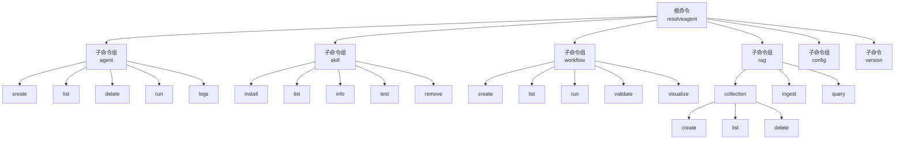
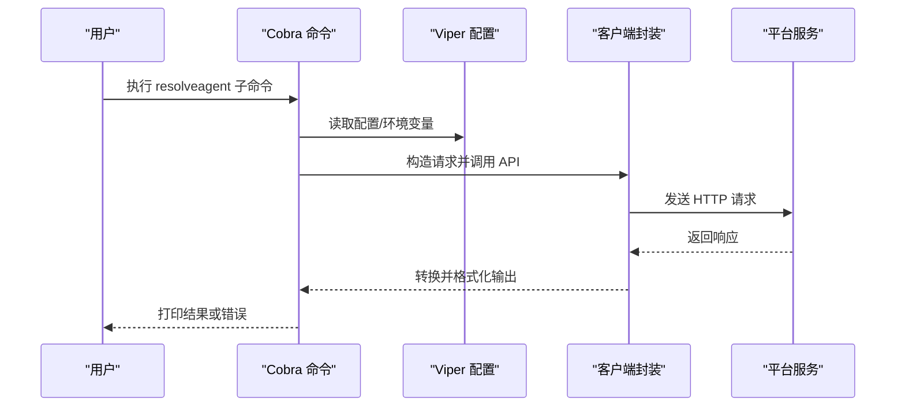
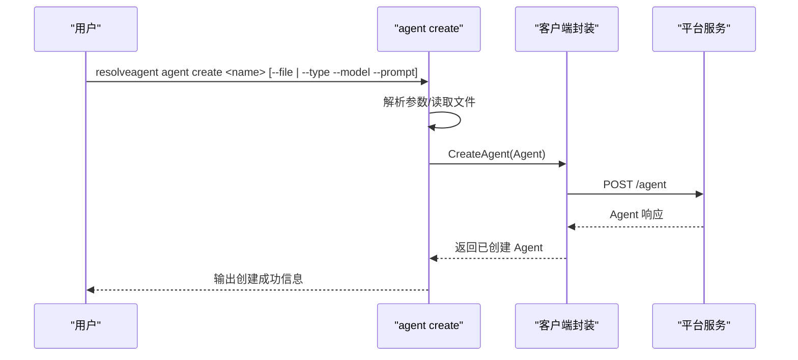
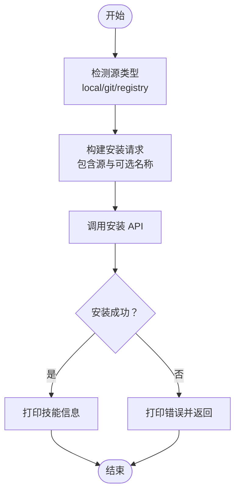
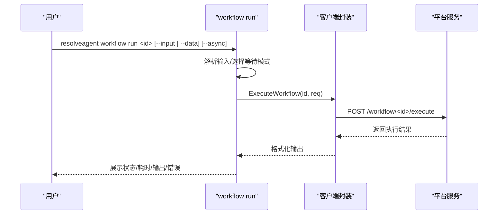
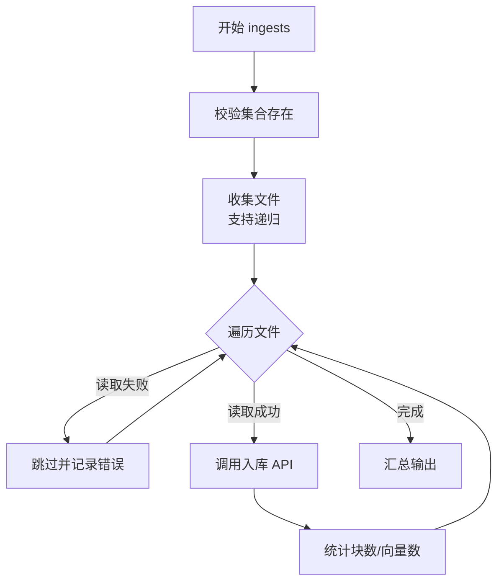
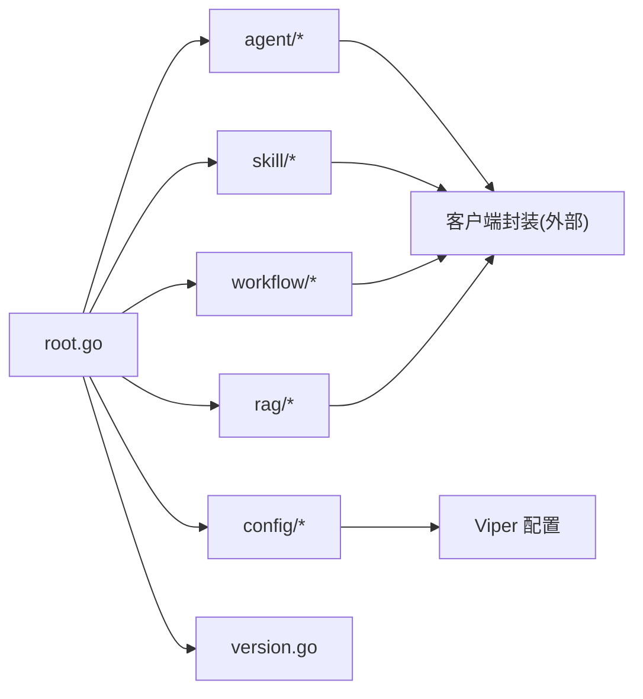

# CLI 工具

<cite>
**本文引用的文件**
- [internal/cli/root.go](file://internal/cli/root.go)
- [internal/cli/agent/create.go](file://internal/cli/agent/create.go)
- [internal/cli/agent/list.go](file://internal/cli/agent/list.go)
- [internal/cli/agent/delete.go](file://internal/cli/agent/delete.go)
- [internal/cli/agent/run.go](file://internal/cli/agent/run.go)
- [internal/cli/agent/logs.go](file://internal/cli/agent/logs.go)
- [internal/cli/skill/install.go](file://internal/cli/skill/install.go)
- [internal/cli/skill/test.go](file://internal/cli/skill/test.go)
- [internal/cli/workflow/create.go](file://internal/cli/workflow/create.go)
- [internal/cli/workflow/run.go](file://internal/cli/workflow/run.go)
- [internal/cli/rag/collection.go](file://internal/cli/rag/collection.go)
- [internal/cli/rag/ingest.go](file://internal/cli/rag/ingest.go)
- [internal/cli/rag/query.go](file://internal/cli/rag/query.go)
- [internal/cli/config/config.go](file://internal/cli/config/config.go)
- [internal/cli/version.go](file://internal/cli/version.go)
</cite>

## 目录
1. [简介](#简介)
2. [项目结构](#项目结构)
3. [核心组件](#核心组件)
4. [架构总览](#架构总览)
5. [详细组件分析](#详细组件分析)
6. [依赖分析](#依赖分析)
7. [性能考虑](#性能考虑)
8. [故障排除指南](#故障排除指南)
9. [结论](#结论)
10. [附录](#附录)

## 简介
本文件面向 ResolveAgent 项目的 CLI 工具，系统性说明基于 Cobra 的命令行接口设计与实现。内容涵盖根命令与持久化参数、子命令组织、配置管理（Viper）、服务交互（HTTP 客户端封装）、命令行参数解析、配置文件加载与环境变量绑定、以及错误处理策略。同时提供 Agent 管理、技能安装与测试、工作流创建与执行、RAG 知识库管理与查询、配置操作等常用命令的使用说明与示例。

## 项目结构
CLI 模块位于 internal/cli 下，采用“按功能分组”的目录组织方式：
- 根命令与初始化：root.go
- 子命令模块：
  - agent：Agent 创建、列出、删除、运行、日志查看
  - skill：技能安装、列表、信息、测试、移除
  - workflow：FTA 工作流创建、列出、运行、校验、可视化
  - rag：RAG 集合管理、文档入库、查询
  - config：配置设置、获取、查看、初始化
  - version：版本打印
- 客户端封装：internal/cli/client（在各子命令中被调用）

图表来源
- [internal/cli/root.go:20-54](file://internal/cli/root.go#L20-L54)
- [internal/cli/agent/create.go:13-74](file://internal/cli/agent/create.go#L13-L74)
- [internal/cli/skill/install.go:14-28](file://internal/cli/skill/install.go#L14-L28)
- [internal/cli/workflow/create.go:13-28](file://internal/cli/workflow/create.go#L13-L28)
- [internal/cli/rag/collection.go:13-35](file://internal/cli/rag/collection.go#L13-L35)
- [internal/cli/config/config.go:12-25](file://internal/cli/config/config.go#L12-L25)
- [internal/cli/version.go:10-18](file://internal/cli/version.go#L10-L18)

章节来源
- [internal/cli/root.go:20-54](file://internal/cli/root.go#L20-L54)

## 核心组件
- 根命令与持久化参数
  - 使用名称与简短/长描述定义根命令，注册子命令并设置持久化标志（如 --config、--server）。
  - 初始化阶段通过 Viper 绑定环境变量前缀，自动读取配置文件。
- 配置管理（Viper）
  - 默认从用户主目录下的 .resolveagent/config.yaml 加载；支持环境变量覆盖。
  - 提供 config 子命令进行设置、获取、查看与初始化。
- 子命令组织
  - 每个功能域（agent/skill/workflow/rag/config）以独立包实现，统一通过根命令聚合。
  - 子命令内部使用 Cobra 的 Flags 解析参数，结合客户端封装调用后端服务。

章节来源
- [internal/cli/root.go:34-74](file://internal/cli/root.go#L34-L74)
- [internal/cli/config/config.go:27-119](file://internal/cli/config/config.go#L27-L119)

## 架构总览
CLI 通过根命令统一入口，子命令各自负责参数解析与业务流程，最终通过客户端封装调用平台服务。配置由 Viper 在初始化时加载，支持文件与环境变量。

图表来源
- [internal/cli/root.go:56-74](file://internal/cli/root.go#L56-L74)
- [internal/cli/agent/run.go:35-82](file://internal/cli/agent/run.go#L35-L82)
- [internal/cli/workflow/run.go:42-96](file://internal/cli/workflow/run.go#L42-L96)
- [internal/cli/rag/ingest.go:32-106](file://internal/cli/rag/ingest.go#L32-L106)

## 详细组件分析

### 根命令与初始化
- 功能要点
  - 定义根命令名称、短/长描述。
  - 注册子命令：agent、skill、workflow、rag、corpus、config、version、dashboard、serve。
  - 设置持久化标志：--config（指定配置文件路径）、--server（平台地址），并绑定到 Viper。
  - 初始化逻辑：若未指定配置文件，则默认在用户主目录下查找 .resolveagent/config.yaml；设置环境变量前缀 RESOLVEAGENT，自动读取环境变量。
- 参数解析与配置绑定
  - 通过 viper.BindPFlag 将命令行标志与配置键关联，便于后续 viper.Get 访问。
- 错误处理
  - 初始化失败时直接退出进程，避免后续流程异常。

章节来源
- [internal/cli/root.go:20-74](file://internal/cli/root.go#L20-L74)

### Agent 管理命令
- 子命令与用途
  - create：从标志或 YAML 文件创建 Agent。
  - list：列出所有 Agent，并支持 JSON/YAML 表格输出。
  - delete：删除指定 Agent，支持强制删除与交互确认。
  - run：执行 Agent，支持消息输入、流式/等待模式、显示耗时与 Token 使用。
  - logs：查看执行日志，支持限制条数与跟随输出（当前提示未实现）。
- 关键流程与参数
  - create：--type/--model/--prompt/--file；支持从文件反序列化为 Agent 对象。
  - list：--type/--status/--output；表格、JSON、YAML 三种输出。
  - delete：--force；交互确认或强制删除。
  - run：--message/-m、--stream/-s、--wait/-w；必要时从标准输入读取消息。
  - logs：--limit/-n、--follow/-f、--execution/-e。
- 错误处理
  - 失败时返回包装后的错误，便于上层统一处理。

图表来源
- [internal/cli/agent/create.go:18-66](file://internal/cli/agent/create.go#L18-L66)

章节来源
- [internal/cli/agent/create.go:13-89](file://internal/cli/agent/create.go#L13-L89)
- [internal/cli/agent/list.go:15-91](file://internal/cli/agent/list.go#L15-L91)
- [internal/cli/agent/delete.go:11-55](file://internal/cli/agent/delete.go#L11-L55)
- [internal/cli/agent/run.go:13-116](file://internal/cli/agent/run.go#L13-L116)
- [internal/cli/agent/logs.go:13-80](file://internal/cli/agent/logs.go#L13-L80)

### 技能管理命令
- 子命令与用途
  - install：从本地路径、Git 仓库或注册表安装技能；自动推断源类型；可选重命名。
  - test：对指定技能进行隔离测试，支持从文件或内联 JSON 输入；输出耗时与结果或错误。
  - 其他：list/info/remove（在对应文件中定义）。
- 关键流程与参数
  - install：--type/-t（local/git/registry）、--name/-n；自动识别 Git/本地/注册表。
  - test：--input/-i（输入文件）、--data/-d（内联 JSON）。
- 错误处理
  - 文件读取、JSON 解析、API 调用失败均返回带上下文的错误。

图表来源
- [internal/cli/skill/install.go:30-88](file://internal/cli/skill/install.go#L30-L88)

章节来源
- [internal/cli/skill/install.go:14-103](file://internal/cli/skill/install.go#L14-L103)
- [internal/cli/skill/test.go:13-80](file://internal/cli/skill/test.go#L13-L80)

### 工作流管理命令
- 子命令与用途
  - create：从 YAML 文件创建 FTA 工作流，支持描述与版本。
  - run：执行工作流，支持异步/同步、输入数据（文件或内联 JSON）、输出状态与耗时。
  - 其他：list/validate/visualize（在对应文件中定义）。
- 关键流程与参数
  - create：--file/-f（必需）、--description/-d、--version/-v。
  - run：--input/-i、--data/-d、--async/-a；异步时返回执行 ID 与状态。
- 错误处理
  - 文件读取、YAML 解析、API 调用失败均返回带上下文的错误。

图表来源
- [internal/cli/workflow/run.go:18-96](file://internal/cli/workflow/run.go#L18-L96)

章节来源
- [internal/cli/workflow/create.go:30-99](file://internal/cli/workflow/create.go#L30-L99)
- [internal/cli/workflow/run.go:13-97](file://internal/cli/workflow/run.go#L13-L97)

### RAG 知识库管理命令
- 子命令与用途
  - rag collection：集合管理（创建、列出、删除）。
  - rag ingest：向集合批量导入文档（支持递归目录扫描与多种文件类型）。
  - rag query：对集合进行检索查询，返回 Top-K 结果与耗时。
- 关键流程与参数
  - collection create：--embedding-model、--chunk-strategy、--description。
  - collection delete：--force；交互确认或强制删除。
  - ingest：--collection/-c（必需）、--path/-p、--recursive/-r；仅支持特定扩展名。
  - query：--collection/-c（必需）、--top-k/-k。
- 错误处理
  - 路径不存在、集合不存在、API 调用失败均返回带上下文的错误。

图表来源
- [internal/cli/rag/ingest.go:17-106](file://internal/cli/rag/ingest.go#L17-L106)

章节来源
- [internal/cli/rag/collection.go:37-169](file://internal/cli/rag/collection.go#L37-L169)
- [internal/cli/rag/ingest.go:13-153](file://internal/cli/rag/ingest.go#L13-L153)
- [internal/cli/rag/query.go:11-79](file://internal/cli/rag/query.go#L11-L79)

### 配置管理命令
- 子命令与用途
  - set：设置配置键值并写回配置文件。
  - get：获取配置键值。
  - view：打印全部配置键值。
  - init：初始化默认配置目录与文件，并写入默认键值。
- 关键流程与参数
  - init：创建 ~/.resolveagent 目录，写入默认 server 与 api_version。
  - set/get/view：基于 Viper 的读写能力。
- 错误处理
  - 写入配置失败时返回错误；未设置的键以占位形式输出。

章节来源
- [internal/cli/config/config.go:12-120](file://internal/cli/config/config.go#L12-L120)

### 版本命令
- 功能要点
  - 打印版本信息，来源于版本包。
- 使用场景
  - 诊断与问题定位时展示 CLI 版本。

章节来源
- [internal/cli/version.go:10-18](file://internal/cli/version.go#L10-L18)

## 依赖分析
- 组件耦合
  - 根命令仅负责聚合与初始化，子命令之间低耦合，职责清晰。
  - 子命令通过客户端封装与平台服务交互，避免直接依赖具体协议细节。
- 外部依赖
  - Cobra：命令定义与参数解析。
  - Viper：配置文件读取、环境变量绑定与写入。
- 可能的循环依赖
  - 未见直接循环导入；子命令通过包导入方式组织，符合 Go 模块化规范。

图表来源
- [internal/cli/root.go:44-54](file://internal/cli/root.go#L44-L54)
- [internal/cli/config/config.go:34-38](file://internal/cli/config/config.go#L34-L38)

章节来源
- [internal/cli/root.go:44-54](file://internal/cli/root.go#L44-L54)
- [internal/cli/config/config.go:34-38](file://internal/cli/config/config.go#L34-L38)

## 性能考虑
- 日志与输出
  - 列表与集合展示使用制表符对齐输出，适合终端阅读；大规模数据建议使用 JSON/YAML 输出以便程序消费。
- 流式与等待
  - run 支持流式输出与等待模式，可根据网络与模型延迟调整参数。
- 批量入库
  - ingest 支持递归扫描与多文件处理，注意磁盘 IO 与内存占用；建议分批处理大目录。
- 查询性能
  - query 的 Top-K 参数影响召回数量与响应时间，合理设置以平衡精度与性能。

## 故障排除指南
- 配置相关
  - 无法加载配置：检查 --config 指定路径是否存在；确认 ~/.resolveagent/config.yaml 权限正确。
  - 环境变量未生效：确认环境变量前缀 RESOLVEAGENT 与键名一致；使用 config view 查看实际生效值。
- 服务器连接
  - 无法连接平台：使用 --server 指定正确地址；确认服务端口开放与网络连通。
- Agent 操作
  - 创建失败：检查 YAML 文件格式与字段；确认必填项完整。
  - 运行报错：确认 Agent 存在且状态正常；检查消息输入是否为空。
- 技能安装
  - 源类型识别失败：显式指定 --type；确保路径或 URL 正确。
  - 测试失败：核对输入 JSON 格式；查看返回的错误信息。
- 工作流执行
  - 输入解析失败：检查输入文件或内联 JSON 格式；确认键名与类型匹配。
- RAG 操作
  - 集合不存在：先创建集合再执行入库/查询；使用 collection list 查看集合。
  - 入库无文件：确认路径与扩展名支持；开启 --recursive 递归扫描。
  - 查询无结果：降低 Top-K 或调整查询语句；确认集合已成功入库。

章节来源
- [internal/cli/root.go:56-74](file://internal/cli/root.go#L56-L74)
- [internal/cli/agent/create.go:76-88](file://internal/cli/agent/create.go#L76-L88)
- [internal/cli/skill/install.go:42-51](file://internal/cli/skill/install.go#L42-L51)
- [internal/cli/workflow/run.go:24-39](file://internal/cli/workflow/run.go#L24-L39)
- [internal/cli/rag/ingest.go:26-41](file://internal/cli/rag/ingest.go#L26-L41)
- [internal/cli/rag/query.go:21-33](file://internal/cli/rag/query.go#L21-L33)

## 结论
ResolveAgent CLI 以 Cobra 为核心，围绕 Agent、技能、工作流、RAG 与配置五大领域提供完整的命令行工具链。通过 Viper 实现灵活的配置管理，配合客户端封装实现与平台服务的稳定交互。命令设计遵循“最小参数集 + 明确输出格式”的原则，既满足开发者日常运维需求，也便于自动化集成。

## 附录
- 常用命令示例（路径参考）
  - 初始化配置：[internal/cli/config/config.go:75-119](file://internal/cli/config/config.go#L75-L119)
  - 设置服务器地址：[internal/cli/config/config.go:27-42](file://internal/cli/config/config.go#L27-L42)
  - 创建 Agent（文件）：[internal/cli/agent/create.go:28-34](file://internal/cli/agent/create.go#L28-L34)
  - 创建 Agent（标志）：[internal/cli/agent/create.go:35-47](file://internal/cli/agent/create.go#L35-L47)
  - 列出 Agent 并筛选：[internal/cli/agent/list.go:20-42](file://internal/cli/agent/list.go#L20-L42)
  - 删除 Agent（强制）：[internal/cli/agent/delete.go:17-49](file://internal/cli/agent/delete.go#L17-L49)
  - 运行 Agent（流式）：[internal/cli/agent/run.go:18-82](file://internal/cli/agent/run.go#L18-L82)
  - 安装技能（Git）：[internal/cli/skill/install.go:42-51](file://internal/cli/skill/install.go#L42-L51)
  - 测试技能（内联输入）：[internal/cli/skill/test.go:33-39](file://internal/cli/skill/test.go#L33-L39)
  - 创建工作流：[internal/cli/workflow/create.go:39-72](file://internal/cli/workflow/create.go#L39-L72)
  - 执行工作流（异步）：[internal/cli/workflow/run.go:59-64](file://internal/cli/workflow/run.go#L59-L64)
  - 创建 RAG 集合：[internal/cli/rag/collection.go:54-74](file://internal/cli/rag/collection.go#L54-L74)
  - 导入文档（递归）：[internal/cli/rag/ingest.go:44-51](file://internal/cli/rag/ingest.go#L44-L51)
  - 查询集合：[internal/cli/rag/query.go:38-44](file://internal/cli/rag/query.go#L38-L44)
  - 查看版本：[internal/cli/version.go:14-16](file://internal/cli/version.go#L14-L16)