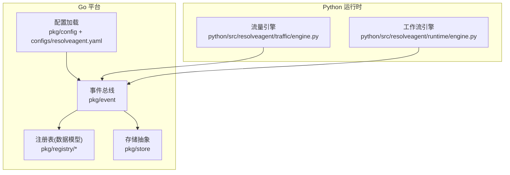
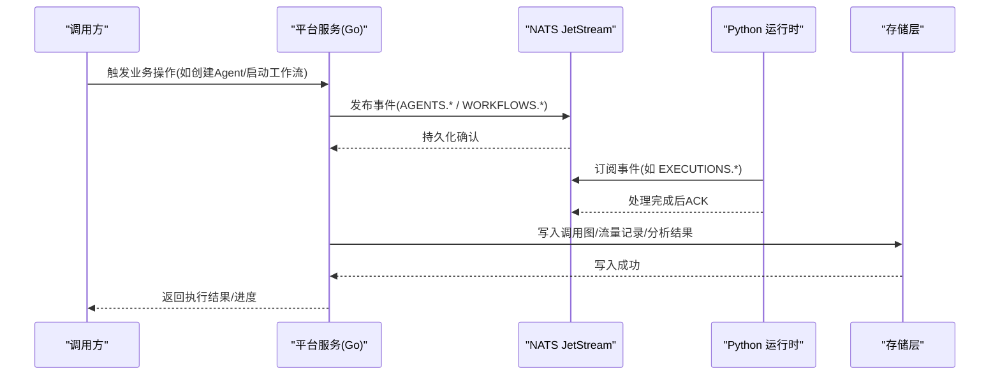
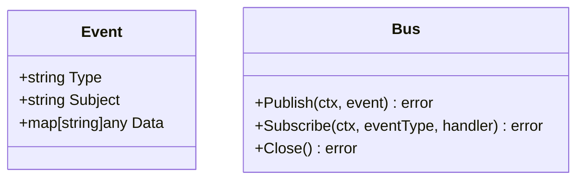
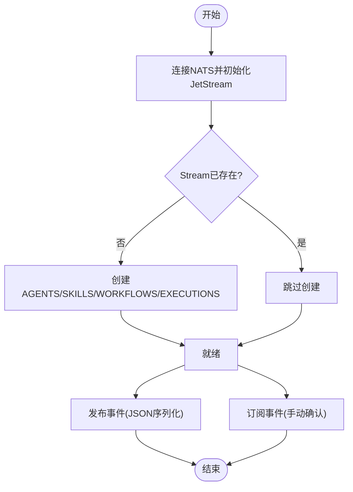
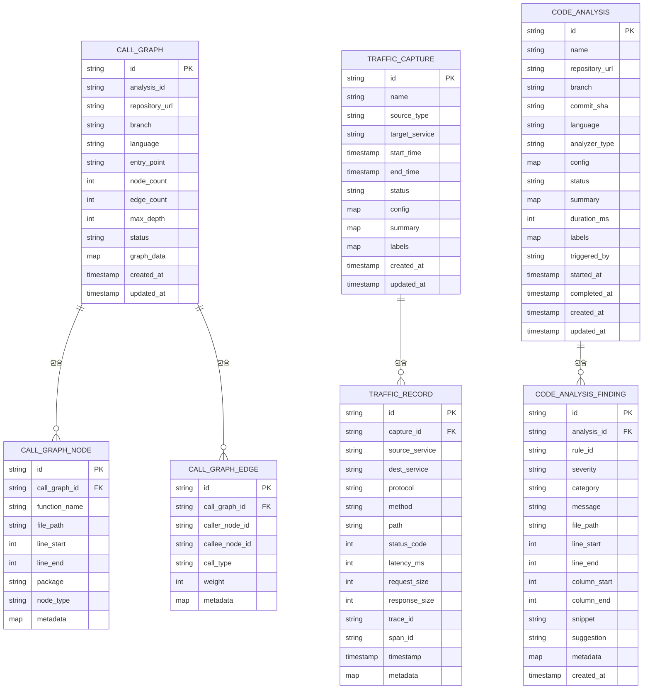
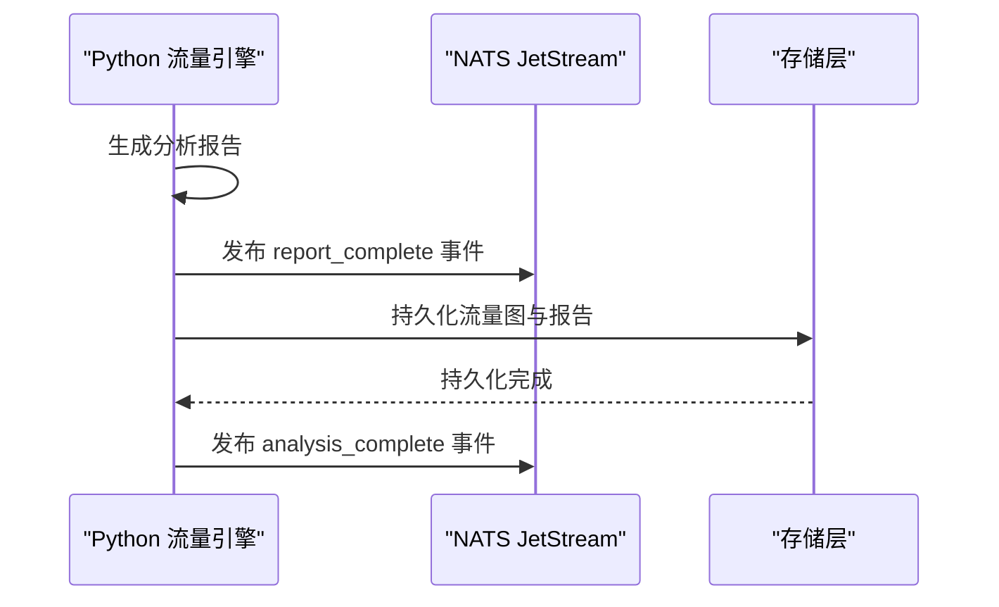
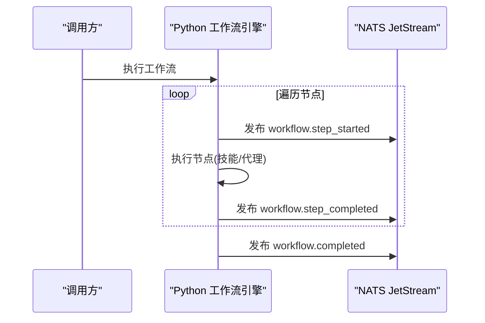
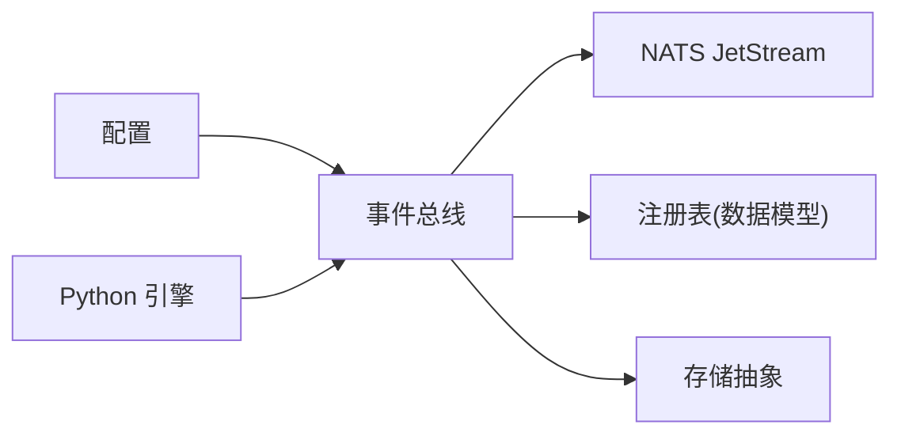

# 事件总线

<cite>
**本文引用的文件**
- [pkg/event/event.go](file://pkg/event/event.go)
- [pkg/event/nats.go](file://pkg/event/nats.go)
- [pkg/config/config.go](file://pkg/config/config.go)
- [configs/resolveagent.yaml](file://configs/resolveagent.yaml)
- [pkg/registry/call_graph.go](file://pkg/registry/call_graph.go)
- [pkg/registry/traffic_capture.go](file://pkg/registry/traffic_capture.go)
- [pkg/registry/code_analysis.go](file://pkg/registry/code_analysis.go)
- [pkg/store/store.go](file://pkg/store/store.go)
- [python/src/resolveagent/traffic/engine.py](file://python/src/resolveagent/traffic/engine.py)
- [python/src/resolveagent/runtime/engine.py](file://python/src/resolveagent/runtime/engine.py)
</cite>

## 目录
1. [简介](#简介)
2. [项目结构](#项目结构)
3. [核心组件](#核心组件)
4. [架构总览](#架构总览)
5. [详细组件分析](#详细组件分析)
6. [依赖关系分析](#依赖关系分析)
7. [性能与可靠性](#性能与可靠性)
8. [故障排查指南](#故障排查指南)
9. [结论](#结论)
10. [附录：事件定义、处理器开发与监控](#附录事件定义处理器开发与监控)

## 简介
本文件为 ResolveAgent 的事件总线系统提供完整技术文档。系统基于 NATS JetStream 构建，采用发布/订阅模式实现跨模块解耦通信，覆盖 Agent、Skill、工作流与执行结果等关键业务域。文档涵盖事件模型、消息传递模式、序列化与可靠性保证、事件过滤与路由机制，并结合流量捕获、调用图生成、代码分析等业务场景说明事件处理流程。同时提供事件定义示例、处理器开发指南与事件监控方法。

## 项目结构
事件总线位于 pkg/event 包，包含统一事件抽象 Bus 接口与 NATS 实现；配置通过 pkg/config 与 configs/resolveagent.yaml 管理；业务数据模型（如调用图、流量捕获、代码分析）在 pkg/registry 中定义；存储抽象在 pkg/store 中定义；Python 侧的流量与工作流引擎通过事件流式输出与持久化协同。

图表来源
- [pkg/event/nats.go:13-19](file://pkg/event/nats.go#L13-L19)
- [pkg/config/config.go:11-31](file://pkg/config/config.go#L11-L31)
- [configs/resolveagent.yaml:22-24](file://configs/resolveagent.yaml#L22-L24)
- [pkg/registry/call_graph.go:10-63](file://pkg/registry/call_graph.go#L10-L63)
- [pkg/registry/traffic_capture.go:10-55](file://pkg/registry/traffic_capture.go#L10-L55)
- [pkg/store/store.go:7-13](file://pkg/store/store.go#L7-L13)
- [python/src/resolveagent/traffic/engine.py:161-200](file://python/src/resolveagent/traffic/engine.py#L161-L200)
- [python/src/resolveagent/runtime/engine.py:637-753](file://python/src/resolveagent/runtime/engine.py#L637-L753)

章节来源
- [pkg/event/event.go:7-22](file://pkg/event/event.go#L7-L22)
- [pkg/event/nats.go:13-201](file://pkg/event/nats.go#L13-L201)
- [pkg/config/config.go:11-96](file://pkg/config/config.go#L11-L96)
- [configs/resolveagent.yaml:22-24](file://configs/resolveagent.yaml#L22-L24)

## 核心组件
- 事件模型与总线接口
  - Event：包含类型、主题与任意载荷，用于跨进程/语言广播。
  - Bus：定义 Publish、Subscribe、Close 契约，便于替换实现或测试。
- NATS 事件总线实现
  - 使用 NATS JetStream 提供持久化、重放与至少一次投递。
  - 自动创建并维护四个 Stream：AGENTS、SKILLS、WORKFLOWS、EXECUTIONS。
  - 支持异步回调订阅与同步拉取，手动确认消息，上下文驱动取消。
- 配置与连接
  - 默认 NATS URL 来自配置，支持环境变量覆盖。
  - 连接具备重连策略与名称标识，便于运维观测。
- 业务数据模型
  - 调用图、流量捕获、代码分析等实体由注册表定义，供事件载荷与持久化使用。
- 存储抽象
  - Store 接口提供健康检查与资源释放能力，便于扩展不同后端。

章节来源
- [pkg/event/event.go:7-22](file://pkg/event/event.go#L7-L22)
- [pkg/event/nats.go:13-201](file://pkg/event/nats.go#L13-L201)
- [pkg/config/config.go:11-31](file://pkg/config/config.go#L11-L31)
- [pkg/registry/call_graph.go:10-63](file://pkg/registry/call_graph.go#L10-L63)
- [pkg/registry/traffic_capture.go:10-55](file://pkg/registry/traffic_capture.go#L10-L55)
- [pkg/registry/code_analysis.go:10-61](file://pkg/registry/code_analysis.go#L10-L61)
- [pkg/store/store.go:7-13](file://pkg/store/store.go#L7-L13)

## 架构总览
NATS 事件总线作为中心枢纽，将 Go 平台服务与 Python 运行时解耦。Go 端负责事件发布与订阅、数据建模与持久化；Python 端在工作流与流量分析过程中产生事件流，并通过事件总线进行状态上报与结果回传。

图表来源
- [pkg/event/nats.go:98-178](file://pkg/event/nats.go#L98-L178)
- [python/src/resolveagent/runtime/engine.py:637-753](file://python/src/resolveagent/runtime/engine.py#L637-L753)
- [python/src/resolveagent/traffic/engine.py:161-200](file://python/src/resolveagent/traffic/engine.py#L161-L200)
- [pkg/store/store.go:7-13](file://pkg/store/store.go#L7-L13)

## 详细组件分析

### 事件模型与总线接口
- Event 结构体承载事件类型、主题与数据载荷，支持 JSON 序列化。
- Bus 接口定义发布、订阅与关闭生命周期，便于单元测试替换为内存实现。

图表来源
- [pkg/event/event.go:7-22](file://pkg/event/event.go#L7-L22)

章节来源
- [pkg/event/event.go:7-22](file://pkg/event/event.go#L7-L22)

### NATS 事件总线实现
- 连接与初始化
  - 建立 NATS 连接，启用 JetStream，自动创建四个预定义 Stream。
  - 连接选项包括命名、重连等待时间与最大重连次数。
- 发布
  - Publish 将 Event 序列化为 JSON，组合 Subject 后通过 JetStream 发布。
  - PublishData 提供便捷发布接口，直接发送类型与数据。
- 订阅
  - Subscribe 创建 Durable Consumer，支持手动确认；反序列化失败时 Nak 消息避免毒消息阻塞。
  - 通过 goroutine 监听 Context 取消信号，优雅退出订阅。
- 同步拉取
  - SubscribeSync 提供同步订阅能力，适用于批处理或调试场景。

图表来源
- [pkg/event/nats.go:36-96](file://pkg/event/nats.go#L36-L96)
- [pkg/event/nats.go:98-178](file://pkg/event/nats.go#L98-L178)

章节来源
- [pkg/event/nats.go:13-201](file://pkg/event/nats.go#L13-L201)

### 配置与连接管理
- 默认 NATS URL 从配置文件读取，支持环境变量覆盖。
- 敏感字段校验与告警提示，确保生产环境安全。
- 反馈回路可配置通过 NATS 发送信号，便于闭环治理。

章节来源
- [pkg/config/config.go:11-96](file://pkg/config/config.go#L11-L96)
- [configs/resolveagent.yaml:22-24](file://configs/resolveagent.yaml#L22-L24)
- [configs/resolveagent.yaml:119-133](file://configs/resolveagent.yaml#L119-L133)

### 业务数据模型与事件载荷
- 调用图：节点与边描述函数调用关系，支持子图查询与深度限制。
- 流量捕获：会话与记录描述网络请求元数据，支持按服务过滤。
- 代码分析：分析任务与发现项，支持严重级别筛选。

图表来源
- [pkg/registry/call_graph.go:10-63](file://pkg/registry/call_graph.go#L10-L63)
- [pkg/registry/traffic_capture.go:10-55](file://pkg/registry/traffic_capture.go#L10-L55)
- [pkg/registry/code_analysis.go:10-61](file://pkg/registry/code_analysis.go#L10-L61)

章节来源
- [pkg/registry/call_graph.go:10-324](file://pkg/registry/call_graph.go#L10-L324)
- [pkg/registry/traffic_capture.go:10-220](file://pkg/registry/traffic_capture.go#L10-L220)
- [pkg/registry/code_analysis.go:10-244](file://pkg/registry/code_analysis.go#L10-L244)

### 事件处理流程：流量捕获与分析
- 流量引擎生成报告并产出阶段性事件，随后持久化图与报告。
- 最终事件携带分析结果与统计信息，供前端或下游消费。

图表来源
- [python/src/resolveagent/traffic/engine.py:161-200](file://python/src/resolveagent/traffic/engine.py#L161-L200)

章节来源
- [python/src/resolveagent/traffic/engine.py:161-200](file://python/src/resolveagent/traffic/engine.py#L161-L200)

### 事件处理流程：工作流执行
- 工作流引擎在执行每个步骤时发出 step_started 与 step_completed 事件。
- 执行结束时发出 workflow.completed 事件，包含耗时与执行ID。

图表来源
- [python/src/resolveagent/runtime/engine.py:637-753](file://python/src/resolveagent/runtime/engine.py#L637-L753)

章节来源
- [python/src/resolveagent/runtime/engine.py:637-753](file://python/src/resolveagent/runtime/engine.py#L637-L753)

### 事件过滤与路由机制
- 主题路由：Subject 采用“类型.主体”格式，例如 AGENTS.agent-001，便于细粒度订阅。
- 通配符订阅：支持 TYPE.* 模式，聚合同一类型的所有事件。
- 消费者隔离：每个类型使用独立 Durable Consumer，避免竞争消费。
- 错误容错：反序列化失败时 Nak 消息，防止毒消息阻塞队列。

章节来源
- [pkg/event/nats.go:98-178](file://pkg/event/nats.go#L98-L178)

## 依赖关系分析
- 事件总线依赖 NATS JetStream，提供持久化与可靠投递。
- 配置模块注入 NATS URL，支撑总线初始化。
- 注册表模块定义业务数据模型，事件载荷与之对齐。
- 存储抽象为事件持久化提供可扩展后端。

图表来源
- [pkg/config/config.go:11-31](file://pkg/config/config.go#L11-L31)
- [pkg/event/nats.go:13-201](file://pkg/event/nats.go#L13-L201)
- [pkg/registry/call_graph.go:10-63](file://pkg/registry/call_graph.go#L10-L63)
- [pkg/store/store.go:7-13](file://pkg/store/store.go#L7-L13)

章节来源
- [pkg/config/config.go:11-96](file://pkg/config/config.go#L11-L96)
- [pkg/event/nats.go:13-201](file://pkg/event/nats.go#L13-L201)
- [pkg/registry/call_graph.go:10-324](file://pkg/registry/call_graph.go#L10-L324)
- [pkg/store/store.go:7-13](file://pkg/store/store.go#L7-L13)

## 性能与可靠性
- 持久化与重放：JetStream 提供文件存储与消息保留策略，支持进程重启恢复。
- 至少一次投递：手动确认机制确保消息处理成功后才 ACK，失败则重投。
- 弹性连接：重连等待与最大重连次数提升容器化环境下的可用性。
- 流式处理：Python 引擎以事件流形式输出进度与结果，降低端到端延迟。
- 资源清理：Context 驱动取消订阅，避免资源泄漏。

章节来源
- [pkg/event/nats.go:36-96](file://pkg/event/nats.go#L36-L96)
- [pkg/event/nats.go:98-178](file://pkg/event/nats.go#L98-L178)
- [python/src/resolveagent/runtime/engine.py:637-753](file://python/src/resolveagent/runtime/engine.py#L637-L753)

## 故障排查指南
- 连接问题
  - 检查 NATS URL 配置是否正确，服务是否可达。
  - 查看连接日志与健康检查接口，确认连接状态。
- 消息丢失或重复
  - 确认消费者是否为 Durable，是否手动 ACK。
  - 检查反序列化逻辑，避免毒消息阻塞。
- 性能瓶颈
  - 评估批量发布与订阅吞吐，必要时分片主题或增加消费者实例。
  - 调整 JetStream 保留策略与存储后端。
- 业务异常
  - 检查工作流与流量分析事件流，定位失败阶段。
  - 结合存储层写入结果，验证数据一致性。

章节来源
- [pkg/event/nats.go:98-178](file://pkg/event/nats.go#L98-L178)
- [python/src/resolveagent/traffic/engine.py:161-200](file://python/src/resolveagent/traffic/engine.py#L161-L200)
- [python/src/resolveagent/runtime/engine.py:637-753](file://python/src/resolveagent/runtime/engine.py#L637-L753)

## 结论
ResolveAgent 的事件总线以 NATS JetStream 为核心，提供了高可靠、可扩展的消息基础设施。通过统一的事件模型与清晰的发布/订阅契约，平台服务与 Python 运行时实现了松耦合协作。结合注册表数据模型与存储抽象，系统在流量捕获、调用图生成与代码分析等场景中具备良好的一致性与可观测性。未来可进一步引入优先级队列、死信队列与更丰富的过滤器，以满足复杂业务需求。

## 附录：事件定义、处理器开发与监控

### 事件定义示例
- 类型与主题
  - 类型：AGENTS、SKILLS、WORKFLOWS、EXECUTIONS
  - 主题：具体实体标识，如 agent ID、workflow ID
- 载荷结构
  - 使用 Event.Data 承载业务对象，建议与注册表模型保持一致
- 示例路径
  - 事件模型定义参考：[pkg/event/event.go:7-22](file://pkg/event/event.go#L7-L22)
  - 发布与订阅实现参考：[pkg/event/nats.go:98-178](file://pkg/event/nats.go#L98-L178)

### 处理器开发指南
- 订阅事件
  - 使用 Bus.Subscribe 注册处理器，指定事件类型与回调函数
  - 在回调中解析 Event.Data，执行业务逻辑
  - 处理成功后显式 ACK，失败时 Nak 以触发重投
- 发布事件
  - 使用 Bus.Publish 或 PublishData 发布事件
  - 确保 Subject 符合“类型.主体”约定
- 示例路径
  - 订阅与发布参考：[pkg/event/nats.go:98-178](file://pkg/event/nats.go#L98-L178)
  - Python 侧事件流输出参考：[python/src/resolveagent/runtime/engine.py:637-753](file://python/src/resolveagent/runtime/engine.py#L637-L753)

### 事件监控方法
- 连接与健康检查
  - 使用 Health 接口检查 NATS 连接状态
  - 观察连接日志与重连行为
- 指标与追踪
  - 结合 Telemetry 与 Prometheus 暴露关键指标
  - 在工作流与流量分析中注入追踪上下文
- 示例路径
  - 健康检查参考：[pkg/event/nats.go:195-201](file://pkg/event/nats.go#L195-L201)
  - 配置与指标参考：[pkg/config/config.go:11-96](file://pkg/config/config.go#L11-L96)