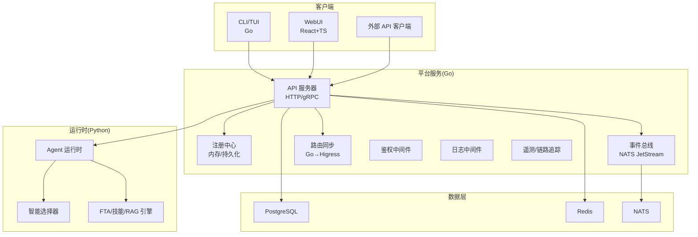
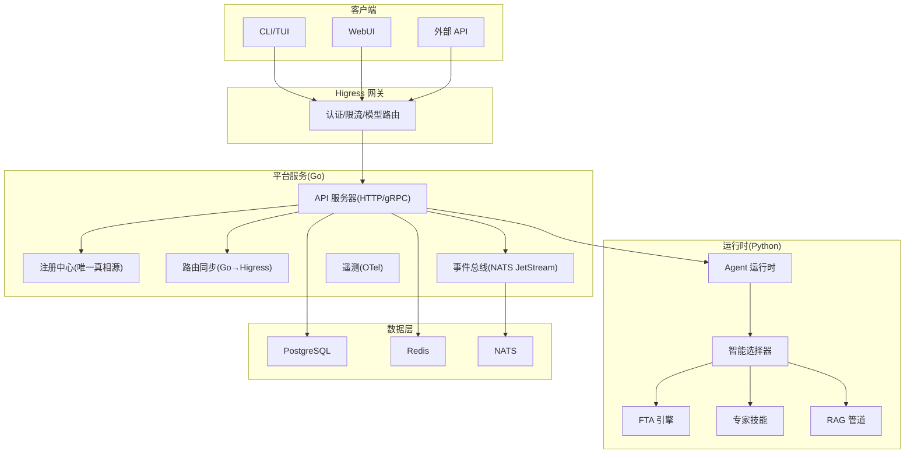
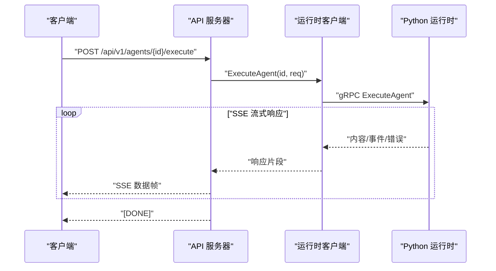
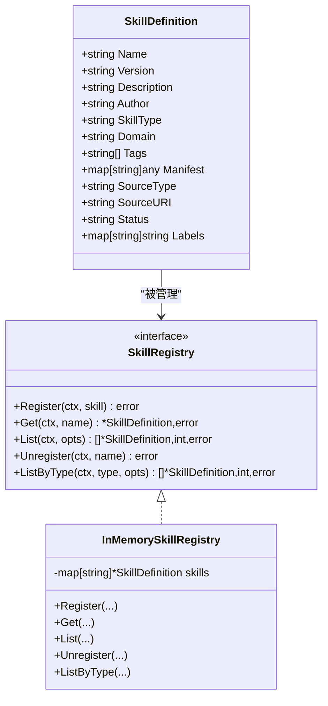
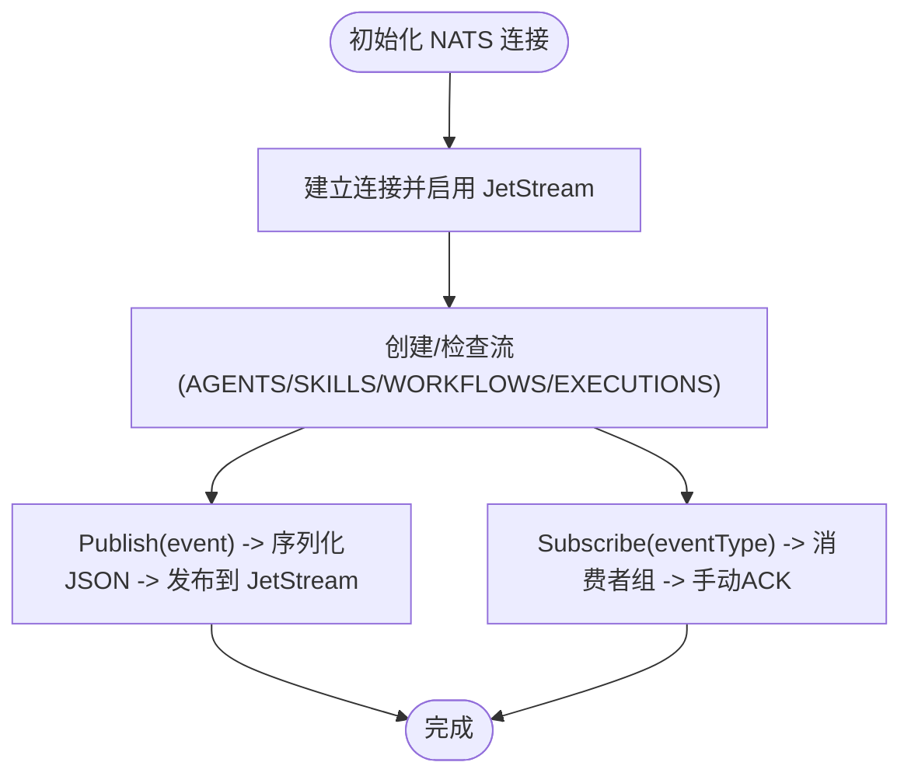
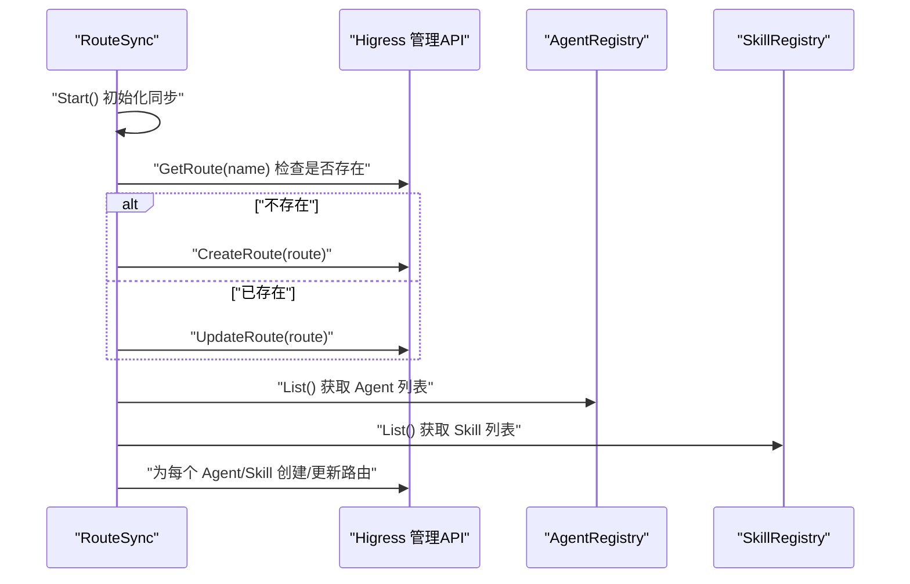
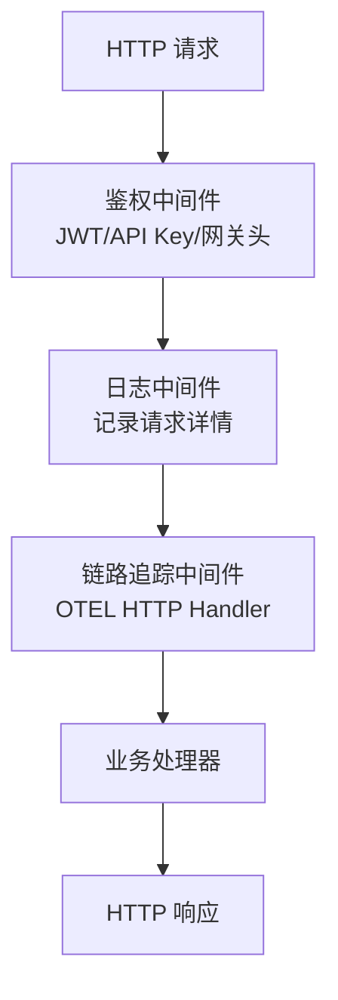
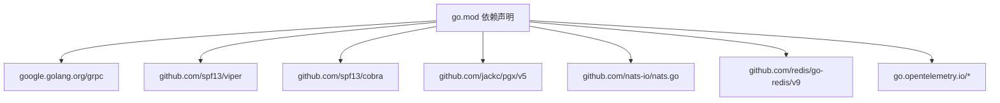

# 平台服务

<cite>
**本文引用的文件**
- [README.md](file://README.md)
- [go.mod](file://go.mod)
- [internal/cli/root.go](file://internal/cli/root.go)
- [pkg/server/server.go](file://pkg/server/server.go)
- [pkg/server/router.go](file://pkg/server/router.go)
- [configs/resolveagent.yaml](file://configs/resolveagent.yaml)
- [pkg/event/nats.go](file://pkg/event/nats.go)
- [pkg/gateway/route_sync.go](file://pkg/gateway/route_sync.go)
- [pkg/server/middleware/auth.go](file://pkg/server/middleware/auth.go)
- [pkg/server/middleware/logging.go](file://pkg/server/middleware/logging.go)
- [pkg/telemetry/tracer.go](file://pkg/telemetry/tracer.go)
- [pkg/store/postgres/postgres.go](file://pkg/store/postgres/postgres.go)
- [deploy/docker-compose/docker-compose.yaml](file://deploy/docker-compose/docker-compose.yaml)
- [internal/cli/agent/agent.go](file://internal/cli/agent/agent.go)
- [pkg/registry/skill.go](file://pkg/registry/skill.go)
</cite>

## 目录
1. [简介](#简介)
2. [项目结构](#项目结构)
3. [核心组件](#核心组件)
4. [架构总览](#架构总览)
5. [详细组件分析](#详细组件分析)
6. [依赖关系分析](#依赖关系分析)
7. [性能考量](#性能考量)
8. [故障排除指南](#故障排除指南)
9. [结论](#结论)
10. [附录](#附录)

## 简介
ResolveAgent 是一个面向问题解决的 AIOps 智能体平台，采用 CNCF 级别架构，融合专家技能、FTA 工作流、RAG 知识库与代码分析能力。平台服务（Go 实现）提供统一的 API 服务器、注册中心、事件总线、网关集成与配置管理，支撑 CLI/TUI 工具、WebUI 以及 Python Agent 运行时之间的协作。

## 项目结构
平台服务位于 Go 代码库中，主要包含以下层次：
- CLI 层：基于 cobra 的命令行工具，提供 agent、skill、workflow、rag、corpus、config 等子命令。
- 服务层：HTTP/gRPC 双栈 API 服务器，注册中心（内存/持久化），路由同步至 Higress 网关。
- 中间件层：鉴权、日志、遥测等横切关注点。
- 基础设施层：NATS JetStream 事件总线、PostgreSQL 存储、OpenTelemetry 链路追踪。
- 配置层：集中式 YAML 配置，支持环境变量覆盖与 Helm/Kubernetes 部署。

图表来源
- [pkg/server/server.go:20-81](file://pkg/server/server.go#L20-L81)
- [pkg/gateway/route_sync.go:13-63](file://pkg/gateway/route_sync.go#L13-L63)
- [pkg/event/nats.go:13-34](file://pkg/event/nats.go#L13-L34)
- [pkg/store/postgres/postgres.go:12-32](file://pkg/store/postgres/postgres.go#L12-L32)

章节来源
- [README.md:440-510](file://README.md#L440-L510)
- [go.mod:1-90](file://go.mod#L1-L90)

## 核心组件
- API 服务器：同时提供 HTTP REST 与 gRPC 服务，内置健康检查与反射调试。
- 注册中心：统一管理 Agent、Skill、Workflow、RAG 文档、Hook、代码分析、内存、解决方案、调用图、流量捕获与图等实体的注册与查询。
- 事件总线：基于 NATS JetStream，提供事件发布/订阅、持久化流与消费者组。
- 路由同步：将 Go Registry 的服务与路由信息同步到 Higress 网关，实现统一入口与模型路由。
- 中间件：鉴权（JWT/API Key/网关透传头）、日志、链路追踪。
- 配置管理：集中式 YAML 配置，支持环境变量注入与 Helm/Kubernetes 部署。
- 存储：PostgreSQL 连接池与迁移脚本，支持多表结构与索引。
- CLI 工具：命令分组与参数解析，支持服务器地址与配置文件指定。

章节来源
- [pkg/server/server.go:20-81](file://pkg/server/server.go#L20-L81)
- [pkg/server/router.go:19-149](file://pkg/server/router.go#L19-L149)
- [pkg/event/nats.go:13-96](file://pkg/event/nats.go#L13-L96)
- [pkg/gateway/route_sync.go:13-63](file://pkg/gateway/route_sync.go#L13-L63)
- [pkg/server/middleware/auth.go:15-32](file://pkg/server/middleware/auth.go#L15-L32)
- [pkg/server/middleware/logging.go:19-37](file://pkg/server/middleware/logging.go#L19-L37)
- [pkg/telemetry/tracer.go:33-41](file://pkg/telemetry/tracer.go#L33-L41)
- [pkg/store/postgres/postgres.go:12-32](file://pkg/store/postgres/postgres.go#L12-L32)
- [configs/resolveagent.yaml:1-90](file://configs/resolveagent.yaml#L1-L90)
- [internal/cli/root.go:18-54](file://internal/cli/root.go#L18-L54)

## 架构总览
平台服务采用“注册中心作为单一真相源”的设计，结合 Higress 网关进行外部认证、限流与模型路由；内部通过智能选择器与运行时引擎完成 FTA、技能与 RAG 的编排。

图表来源
- [README.md:440-510](file://README.md#L440-L510)
- [pkg/gateway/route_sync.go:108-130](file://pkg/gateway/route_sync.go#L108-L130)
- [pkg/server/server.go:63-71](file://pkg/server/server.go#L63-L71)

## 详细组件分析

### API 服务器与路由
- 服务器初始化：创建 gRPC 与 HTTP 服务器实例，注册健康检查与反射，绑定路由。
- HTTP 路由：覆盖 Agent、Skill、Workflow、RAG、模型、配置、Hook、文档、分析、记忆、解决方案、调用图、流量捕获与图等全量 REST 接口。
- gRPC 服务：内置健康检查与反射，便于调试与跨语言互操作。
- 执行代理：对 Agent/Workflow 执行请求，转发至 Python 运行时并通过 SSE 流式返回结果。

图表来源
- [pkg/server/router.go:273-393](file://pkg/server/router.go#L273-L393)
- [pkg/server/server.go:84-132](file://pkg/server/server.go#L84-L132)

章节来源
- [pkg/server/server.go:20-81](file://pkg/server/server.go#L20-L81)
- [pkg/server/router.go:19-149](file://pkg/server/router.go#L19-L149)

### 注册中心与存储
- 注册中心接口：统一的注册、查询、列表与按类型过滤能力，支持内存与持久化后端切换。
- 技能注册：技能定义包含名称、版本、描述、作者、类型、域、标签、清单、来源类型与 URI、状态与标签等字段。
- 存储实现：PostgreSQL 连接池、健康检查、迁移脚本与多表结构（agents、skills、workflows、hooks、rag_documents、fta_documents、code_analyses、memory_*、schema_migrations 等）。

图表来源
- [pkg/registry/skill.go:9-32](file://pkg/registry/skill.go#L9-L32)
- [pkg/registry/skill.go:34-97](file://pkg/registry/skill.go#L34-L97)

章节来源
- [pkg/registry/skill.go:9-97](file://pkg/registry/skill.go#L9-L97)
- [pkg/store/postgres/postgres.go:108-470](file://pkg/store/postgres/postgres.go#L108-L470)

### 事件总线（NATS JetStream）
- 连接与初始化：自动重连、最大重连次数、JetStream 上下文创建。
- 流创建：自动创建 AGENTS、SKILLS、WORKFLOWS、EXECUTIONS 等流，保留 24 小时。
- 发布/订阅：事件序列化为 JSON，发布到 TYPE.SUBJECT 主题；订阅使用手动确认与持久化消费者。

图表来源
- [pkg/event/nats.go:36-96](file://pkg/event/nats.go#L36-L96)
- [pkg/event/nats.go:98-178](file://pkg/event/nats.go#L98-L178)

章节来源
- [pkg/event/nats.go:13-202](file://pkg/event/nats.go#L13-L202)

### 路由同步（Higress 网关）
- 同步周期：默认 30 秒，支持配置调整。
- 同步内容：平台静态 API 路由、Agent 动态执行路由、Skill 执行路由。
- 一致性：根据现有路由存在性决定创建或更新；支持服务注册与路由删除。

图表来源
- [pkg/gateway/route_sync.go:70-130](file://pkg/gateway/route_sync.go#L70-L130)
- [pkg/gateway/route_sync.go:280-291](file://pkg/gateway/route_sync.go#L280-L291)

章节来源
- [pkg/gateway/route_sync.go:13-310](file://pkg/gateway/route_sync.go#L13-L310)

### 中间件：鉴权、日志与链路追踪
- 鉴权中间件：支持网关透传头（X-Auth-User/X-Auth-Roles）、JWT 与 API Key；可配置跳过路径与密钥过期校验。
- 日志中间件：记录方法、路径、状态码、耗时与远端地址。
- 链路追踪：全局 TracerProvider，支持 OTLP gRPC 导出器与采样率配置。

图表来源
- [pkg/server/middleware/auth.go:76-103](file://pkg/server/middleware/auth.go#L76-L103)
- [pkg/server/middleware/logging.go:19-37](file://pkg/server/middleware/logging.go#L19-L37)
- [pkg/telemetry/tracer.go:210-214](file://pkg/telemetry/tracer.go#L210-L214)

章节来源
- [pkg/server/middleware/auth.go:15-275](file://pkg/server/middleware/auth.go#L15-L275)
- [pkg/server/middleware/logging.go:1-38](file://pkg/server/middleware/logging.go#L1-L38)
- [pkg/telemetry/tracer.go:33-132](file://pkg/telemetry/tracer.go#L33-L132)

### 配置管理与部署
- 配置文件：resolveagent.yaml 支持 server、database、redis、nats、runtime、gateway、telemetry、store 等模块配置。
- 环境变量：通过 viper 自动注入，支持 RESOLVEAGENT 前缀。
- Docker Compose：一键启动平台、运行时、WebUI、PostgreSQL、Redis、NATS 等服务，并暴露端口与健康检查。
- Helm/Kubernetes：Helm Chart 提供生产级部署模板与资源配额、自动伸缩等能力。

章节来源
- [configs/resolveagent.yaml:1-90](file://configs/resolveagent.yaml#L1-L90)
- [internal/cli/root.go:56-73](file://internal/cli/root.go#L56-L73)
- [deploy/docker-compose/docker-compose.yaml:1-232](file://deploy/docker-compose/docker-compose.yaml#L1-L232)

### CLI 工具设计与命令
- 根命令：设置配置文件路径与服务器地址，注册 agent、skill、workflow、rag、corpus、config、version、dashboard、serve 等子命令。
- Agent 子命令：创建、列出、删除、运行、查看日志等。
- 其他子命令：技能安装/卸载/列表/测试，工作流创建/运行/验证/可视化，RAG 文档导入/查询，配置读取/更新等。

章节来源
- [internal/cli/root.go:18-54](file://internal/cli/root.go#L18-L54)
- [internal/cli/agent/agent.go:7-22](file://internal/cli/agent/agent.go#L7-L22)

## 依赖关系分析
- 语言与框架：Go 1.25+，gRPC、gRPC-Gateway、Cobra、Viper、pgx、nats.go、redis/go-redis、OpenTelemetry。
- 服务依赖：PostgreSQL（连接池与迁移）、Redis（缓存/会话）、NATS（消息总线）、Higress（外部网关）。
- 部署依赖：Docker Compose/Kubernetes，Prometheus/OpenTelemetry。

图表来源
- [go.mod:5-89](file://go.mod#L5-L89)

章节来源
- [go.mod:1-90](file://go.mod#L1-L90)

## 性能考量
- 连接池与超时：PostgreSQL 连接池大小、最大空闲时间、最大生命周期；HTTP 读写超时、gRPC 最大消息尺寸。
- 路由同步：合理设置同步间隔，避免频繁创建/更新路由导致网关压力。
- 鉴权与日志：在高并发场景下注意鉴权与日志开销，必要时降低日志级别或启用异步日志。
- 链路追踪：生产环境建议开启采样率控制，避免过多追踪数据影响性能。
- 存储索引：PostgreSQL 迁移脚本包含大量索引，确保查询性能与并发写入稳定性。

章节来源
- [configs/resolveagent.yaml:64-89](file://configs/resolveagent.yaml#L64-L89)
- [pkg/store/postgres/postgres.go:43-48](file://pkg/store/postgres/postgres.go#L43-L48)
- [pkg/telemetry/tracer.go:100-101](file://pkg/telemetry/tracer.go#L100-L101)

## 故障排除指南
- 服务无法启动
  - 检查端口占用与容器健康状态（Compose/K8s）。
  - 确认数据库、Redis、NATS 是否就绪。
- API 500 错误
  - 查看平台服务日志，定位具体处理器异常。
  - 检查运行时是否可达（gRPC 地址配置）。
- 路由未生效
  - 确认路由同步是否成功，检查 Higress 管理 API 可达性与凭据。
  - 查看 RouteSync 日志与错误信息。
- 事件未消费
  - 检查 NATS JetStream 流与消费者状态，确认手动 ACK 是否正确处理。
- 鉴权失败
  - 确认网关透传头或 JWT/API Key 是否正确配置与传递。
  - 检查密钥过期与签发者匹配。
- 链路追踪无数据
  - 检查 OTLP 导出器端点与网络连通性。
  - 确认采样率与服务名配置。

章节来源
- [pkg/gateway/route_sync.go:70-106](file://pkg/gateway/route_sync.go#L70-L106)
- [pkg/event/nats.go:135-178](file://pkg/event/nats.go#L135-L178)
- [pkg/server/middleware/auth.go:114-132](file://pkg/server/middleware/auth.go#L114-L132)
- [pkg/telemetry/tracer.go:134-153](file://pkg/telemetry/tracer.go#L134-L153)

## 结论
ResolveAgent 平台服务以 Go 实现，围绕“注册中心作为单一真相源”与“Higress 网关统一出口”的架构，提供了完整的 API 服务器、注册中心、事件总线、路由同步、中间件与配置管理能力。配合 CLI/TUI 工具与 Python 运行时，形成从开发、部署到运维的闭环。通过 PostgreSQL、Redis、NATS 与 OpenTelemetry 等基础设施，平台具备良好的扩展性与可观测性，适合在生产环境中落地。

## 附录
- 快速启动与访问点：HTTP API、gRPC、WebUI 端口与依赖服务启动顺序。
- 环境变量与配置优先级：YAML 文件、环境变量（RESOLVEAGENT 前缀）、默认值。
- 生产部署建议：Helm Chart、资源配额、自动伸缩、密钥管理与轮换。

章节来源
- [README.md:119-123](file://README.md#L119-L123)
- [README.md:598-648](file://README.md#L598-L648)
- [README.md:536-596](file://README.md#L536-L596)
- [deploy/docker-compose/docker-compose.yaml:70-83](file://deploy/docker-compose/docker-compose.yaml#L70-L83)