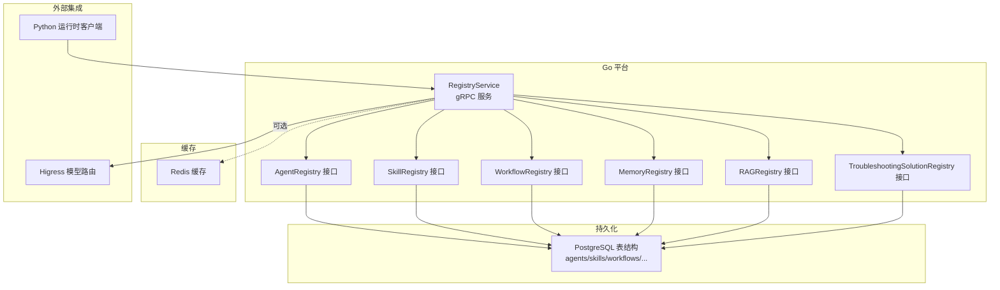
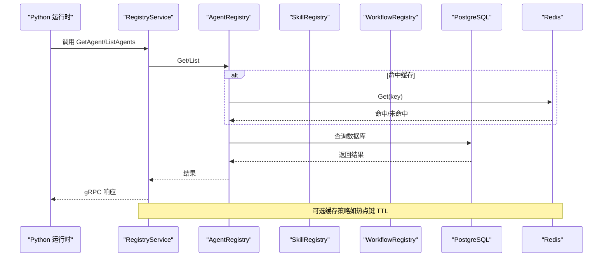
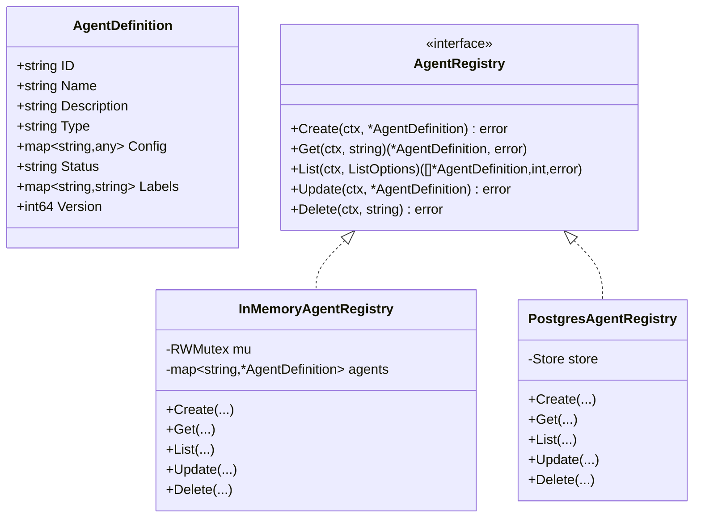
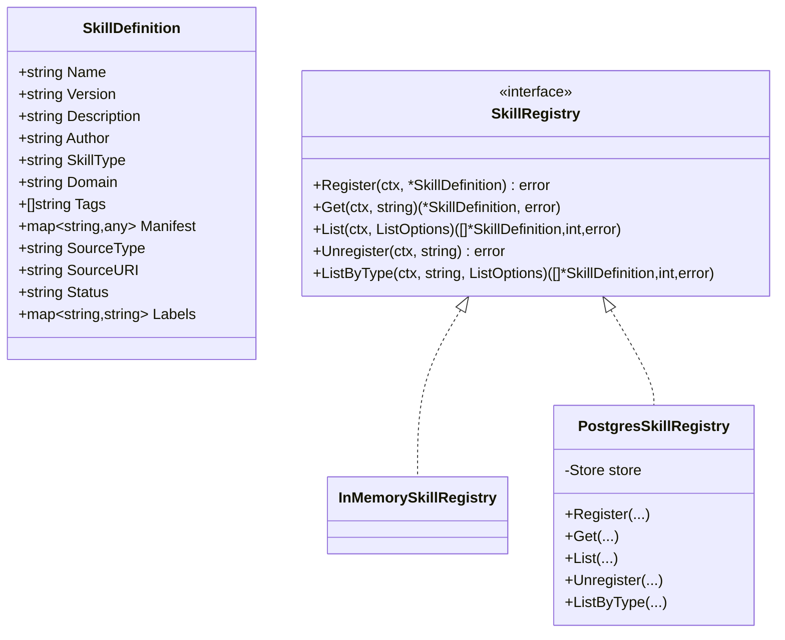
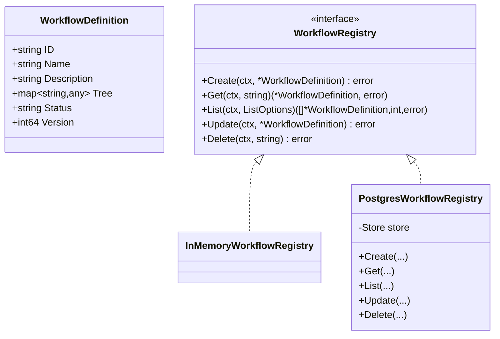
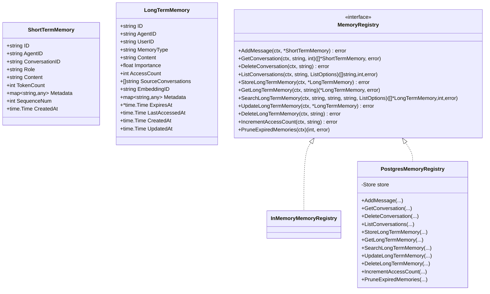
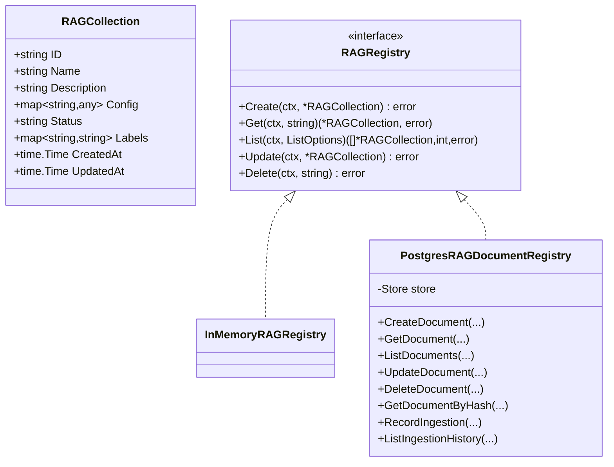
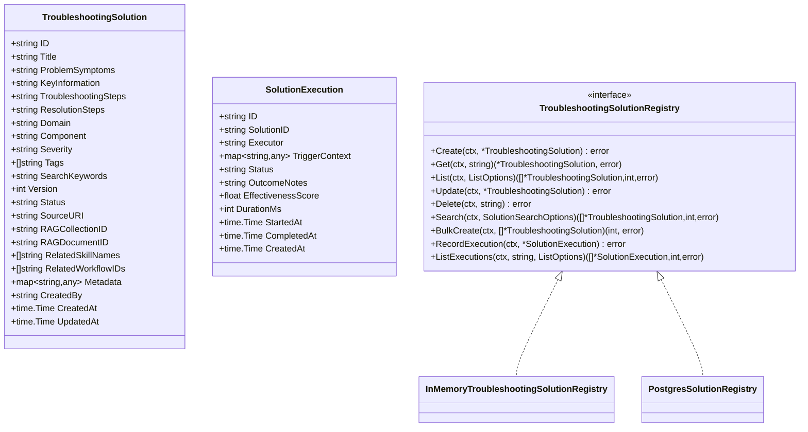
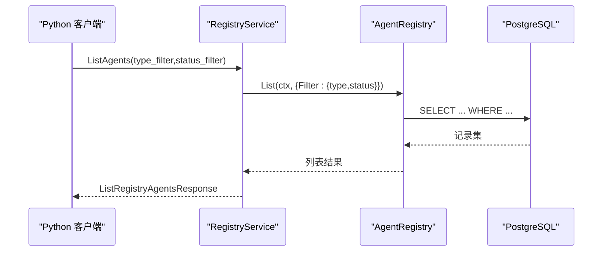
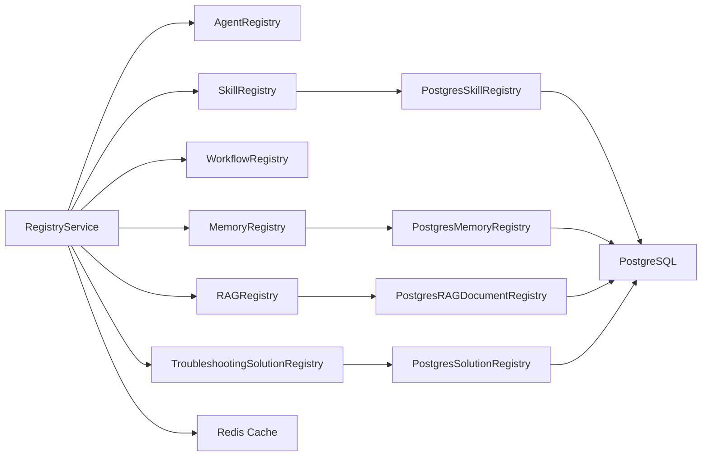

# 注册中心

<cite>
**本文引用的文件**
- [pkg/service/registry_service.go](file://pkg/service/registry_service.go)
- [pkg/registry/agent.go](file://pkg/registry/agent.go)
- [pkg/registry/skill.go](file://pkg/registry/skill.go)
- [pkg/registry/workflow.go](file://pkg/registry/workflow.go)
- [pkg/registry/memory.go](file://pkg/registry/memory.go)
- [pkg/registry/rag.go](file://pkg/registry/rag.go)
- [pkg/registry/solution.go](file://pkg/registry/solution.go)
- [pkg/store/postgres/postgres.go](file://pkg/store/postgres/postgres.go)
- [pkg/store/postgres/skill_store.go](file://pkg/store/postgres/skill_store.go)
- [pkg/store/postgres/memory_store.go](file://pkg/store/postgres/memory_store.go)
- [pkg/store/postgres/rag_document_store.go](file://pkg/store/postgres/rag_document_store.go)
- [pkg/store/redis/redis.go](file://pkg/store/redis/redis.go)
- [api/proto/resolveagent/v1/registry.proto](file://api/proto/resolveagent/v1/registry.proto)
</cite>

## 目录
1. [简介](#简介)
2. [项目结构](#项目结构)
3. [核心组件](#核心组件)
4. [架构总览](#架构总览)
5. [详细组件分析](#详细组件分析)
6. [依赖分析](#依赖分析)
7. [性能考虑](#性能考虑)
8. [故障排查指南](#故障排查指南)
9. [结论](#结论)
10. [附录](#附录)

## 简介
本文件系统性阐述 ResolveAgent 项目的注册中心体系，覆盖基于 PostgreSQL 与 Redis 的注册与缓存架构，统一管理 Agent、Skill、Workflow、Memory、RAG 文档与 Troubleshooting Solution 等资源。内容包含：
- 服务发现与 gRPC 接口定义
- 元数据存储模型与索引设计
- 版本控制与生命周期管理
- 查询接口与分页过滤
- 缓存策略与一致性保障
- 注册流程示例、配置管理与运维建议

## 项目结构
注册中心相关代码主要分布在以下模块：
- Go 平台服务层：提供 gRPC 服务，封装内部注册表访问
- 注册表接口与内存实现：抽象能力，便于替换持久化后端
- PostgreSQL 存储层：提供强一致的持久化能力
- Redis 缓存层：提供高性能读取与会话级缓存
- Proto 定义：统一跨语言的服务发现契约

图表来源
- [pkg/service/registry_service.go:11-35](file://pkg/service/registry_service.go#L11-L35)
- [pkg/registry/agent.go:21-28](file://pkg/registry/agent.go#L21-L28)
- [pkg/registry/skill.go:25-32](file://pkg/registry/skill.go#L25-L32)
- [pkg/registry/workflow.go:19-26](file://pkg/registry/workflow.go#L19-L26)
- [pkg/registry/memory.go:42-60](file://pkg/registry/memory.go#L42-L60)
- [pkg/registry/rag.go:22-29](file://pkg/registry/rag.go#L22-L29)
- [pkg/registry/solution.go:63-74](file://pkg/registry/solution.go#L63-L74)
- [pkg/store/postgres/postgres.go:12-17](file://pkg/store/postgres/postgres.go#L12-L17)
- [pkg/store/redis/redis.go:13-20](file://pkg/store/redis/redis.go#L13-L20)

章节来源
- [pkg/service/registry_service.go:11-35](file://pkg/service/registry_service.go#L11-L35)
- [pkg/store/postgres/postgres.go:12-17](file://pkg/store/postgres/postgres.go#L12-L17)
- [pkg/store/redis/redis.go:13-20](file://pkg/store/redis/redis.go#L13-L20)

## 核心组件
- RegistryService：gRPC 服务端，面向 Python 运行时提供统一查询入口（Agent/Skill/Workflow/模型路由），并支持变更事件流式推送。
- 注册表接口族：AgentRegistry、SkillRegistry、WorkflowRegistry、MemoryRegistry、RAGRegistry、TroubleshootingSolutionRegistry，定义 CRUD、列表、过滤、分页等能力。
- PostgreSQL 实现：各注册表的持久化实现，负责数据写入、更新、查询与迁移。
- Redis 缓存：提供键值缓存能力，用于热点数据加速与会话状态存储。
- Proto 定义：统一的 gRPC 协议，规范请求/响应字段与事件类型。

章节来源
- [pkg/service/registry_service.go:11-35](file://pkg/service/registry_service.go#L11-L35)
- [pkg/registry/agent.go:21-28](file://pkg/registry/agent.go#L21-L28)
- [pkg/registry/skill.go:25-32](file://pkg/registry/skill.go#L25-L32)
- [pkg/registry/workflow.go:19-26](file://pkg/registry/workflow.go#L19-L26)
- [pkg/registry/memory.go:42-60](file://pkg/registry/memory.go#L42-L60)
- [pkg/registry/rag.go:22-29](file://pkg/registry/rag.go#L22-L29)
- [pkg/registry/solution.go:63-74](file://pkg/registry/solution.go#L63-L74)
- [pkg/store/postgres/postgres.go:12-17](file://pkg/store/postgres/postgres.go#L12-L17)
- [pkg/store/redis/redis.go:13-20](file://pkg/store/redis/redis.go#L13-L20)
- [api/proto/resolveagent/v1/registry.proto:11-46](file://api/proto/resolveagent/v1/registry.proto#L11-L46)

## 架构总览
注册中心采用“接口 + 多后端”的分层设计：
- 服务层：RegistryService 将 Python 客户端请求映射到具体注册表，并可选地通过 Redis 提供缓存。
- 数据层：PostgreSQL 作为主存储，提供 ACID 事务、索引与迁移；Redis 作为二级缓存，提升读取性能。
- 集成层：通过 Higress 模型路由与服务发现，向运行时暴露统一的网关路径与端点信息。

图表来源
- [pkg/service/registry_service.go:100-144](file://pkg/service/registry_service.go#L100-L144)
- [pkg/store/postgres/postgres.go:472-504](file://pkg/store/postgres/postgres.go#L472-L504)
- [pkg/store/redis/redis.go:81-116](file://pkg/store/redis/redis.go#L81-L116)

## 详细组件分析

### Agent 注册与查询
- 数据模型：包含标识、名称、描述、类型、配置、状态、标签、版本与时间戳。
- 接口能力：Create/Get/List/Update/Delete，支持按类型与状态过滤。
- 持久化：PostgreSQL 表结构与迁移脚本定义，含索引优化。
- gRPC 映射：RegistryService.GetAgent/ListAgents 将内部结构转换为响应消息。

图表来源
- [pkg/registry/agent.go:9-28](file://pkg/registry/agent.go#L9-L28)
- [pkg/registry/agent.go:30-95](file://pkg/registry/agent.go#L30-L95)
- [pkg/store/postgres/postgres.go:472-504](file://pkg/store/postgres/postgres.go#L472-L504)

章节来源
- [pkg/registry/agent.go:9-28](file://pkg/registry/agent.go#L9-L28)
- [pkg/registry/agent.go:30-95](file://pkg/registry/agent.go#L30-L95)
- [pkg/store/postgres/postgres.go:130-141](file://pkg/store/postgres/postgres.go#L130-L141)
- [pkg/service/registry_service.go:100-144](file://pkg/service/registry_service.go#L100-L144)

### Skill 注册与查询
- 数据模型：名称、版本、描述、作者、技能类型、领域、标签、清单、来源类型/URI、状态、标签。
- 接口能力：Register/Get/List/Unregister/ListByType，支持按类型过滤。
- 持久化：PostgreSQL 表结构与 upsert 更新逻辑，含索引优化。

图表来源
- [pkg/registry/skill.go:9-32](file://pkg/registry/skill.go#L9-L32)
- [pkg/registry/skill.go:34-96](file://pkg/registry/skill.go#L34-L96)
- [pkg/store/postgres/skill_store.go:11-102](file://pkg/store/postgres/skill_store.go#L11-L102)

章节来源
- [pkg/registry/skill.go:9-32](file://pkg/registry/skill.go#L9-L32)
- [pkg/registry/skill.go:34-96](file://pkg/registry/skill.go#L34-L96)
- [pkg/store/postgres/skill_store.go:21-102](file://pkg/store/postgres/skill_store.go#L21-L102)
- [pkg/store/postgres/postgres.go:147-159](file://pkg/store/postgres/postgres.go#L147-L159)

### Workflow 注册与查询
- 数据模型：ID、名称、描述、树形定义、状态、版本。
- 接口能力：Create/Get/List/Update/Delete，支持按类型过滤。
- 持久化：PostgreSQL 表结构与迁移脚本，含索引优化。

图表来源
- [pkg/registry/workflow.go:9-26](file://pkg/registry/workflow.go#L9-L26)
- [pkg/registry/workflow.go:28-93](file://pkg/registry/workflow.go#L28-L93)
- [pkg/store/postgres/postgres.go:165-175](file://pkg/store/postgres/postgres.go#L165-L175)

章节来源
- [pkg/registry/workflow.go:9-26](file://pkg/registry/workflow.go#L9-L26)
- [pkg/registry/workflow.go:28-93](file://pkg/registry/workflow.go#L28-L93)
- [pkg/service/registry_service.go:249-285](file://pkg/service/registry_service.go#L249-L285)

### Memory 注册与查询
- 数据模型：短期记忆（对话消息）与长期记忆（跨会话知识）。
- 接口能力：短期消息增删查、会话列表；长期记忆增删改查、检索、过期清理。
- 持久化：PostgreSQL 表结构与查询，含动态 WHERE 与排序。

图表来源
- [pkg/registry/memory.go:11-60](file://pkg/registry/memory.go#L11-L60)
- [pkg/registry/memory.go:62-274](file://pkg/registry/memory.go#L62-L274)
- [pkg/store/postgres/memory_store.go:12-272](file://pkg/store/postgres/memory_store.go#L12-L272)

章节来源
- [pkg/registry/memory.go:11-60](file://pkg/registry/memory.go#L11-L60)
- [pkg/registry/memory.go:62-274](file://pkg/registry/memory.go#L62-L274)
- [pkg/store/postgres/memory_store.go:24-272](file://pkg/store/postgres/memory_store.go#L24-L272)
- [pkg/store/postgres/postgres.go:368-404](file://pkg/store/postgres/postgres.go#L368-L404)

### RAG 文档注册与查询
- 数据模型：集合 ID、标题、来源 URI、内容哈希、类型、块数、向量 ID、元数据、状态、大小。
- 接口能力：Create/Get/List/Update/Delete；按内容哈希去重；记录入库历史。
- 持久化：PostgreSQL 表结构与查询，含索引优化。

图表来源
- [pkg/registry/rag.go:10-29](file://pkg/registry/rag.go#L10-L29)
- [pkg/registry/rag.go:31-144](file://pkg/registry/rag.go#L31-L144)
- [pkg/store/postgres/rag_document_store.go:11-195](file://pkg/store/postgres/rag_document_store.go#L11-L195)

章节来源
- [pkg/registry/rag.go:10-29](file://pkg/registry/rag.go#L10-L29)
- [pkg/registry/rag.go:31-144](file://pkg/registry/rag.go#L31-L144)
- [pkg/store/postgres/rag_document_store.go:21-195](file://pkg/store/postgres/rag_document_store.go#L21-L195)
- [pkg/store/postgres/postgres.go:251-280](file://pkg/store/postgres/postgres.go#L251-L280)

### Troubleshooting Solution 注册与查询
- 数据模型：问题症状、关键信息、排障步骤、解决步骤、域/组件/严重度/标签、版本、状态、来源 URI、关联技能/工作流、元数据、执行记录与评分。
- 接口能力：Create/Get/List/Update/Delete/Search/BulkCreate/RecordExecution/ListExecutions。
- 持久化：PostgreSQL 表结构与查询，含关键词搜索与标签匹配。

图表来源
- [pkg/registry/solution.go:11-74](file://pkg/registry/solution.go#L11-L74)
- [pkg/registry/solution.go:76-309](file://pkg/registry/solution.go#L76-L309)

章节来源
- [pkg/registry/solution.go:11-74](file://pkg/registry/solution.go#L11-L74)
- [pkg/registry/solution.go:76-309](file://pkg/registry/solution.go#L76-L309)
- [pkg/store/postgres/postgres.go:287-316](file://pkg/store/postgres/postgres.go#L287-L316)

### 服务发现与 gRPC 接口
- 服务：RegistryService 提供 GetAgent/ListAgents、GetSkill/ListSkills、GetModelRoute/ListModelRoutes、GetWorkflow/ListWorkflows、WatchRegistry 等 RPC。
- 事件流：RegistryEvent 支持 CREATED/UPDATED/DELETED 事件，ResourceType 区分 Agent/Skill/Workflow/Model。
- 模型路由：可选集成 Higress，返回网关路径与优先级。

图表来源
- [api/proto/resolveagent/v1/registry.proto:15-46](file://api/proto/resolveagent/v1/registry.proto#L15-L46)
- [pkg/service/registry_service.go:118-144](file://pkg/service/registry_service.go#L118-L144)

章节来源
- [api/proto/resolveagent/v1/registry.proto:11-46](file://api/proto/resolveagent/v1/registry.proto#L11-L46)
- [pkg/service/registry_service.go:100-299](file://pkg/service/registry_service.go#L100-L299)

## 依赖分析
- 组件耦合：RegistryService 仅依赖注册表接口，不直接依赖 PostgreSQL/Redis，便于替换实现。
- 直接依赖：PostgresSkillRegistry/PostgresMemoryRegistry/PostgresRAGDocumentRegistry 依赖 Store；Redis Cache 提供独立连接池。
- 外部集成：Higress 模型路由通过 RegistryService.GetModelRoute/Li stModelRoutes 返回网关端点。

图表来源
- [pkg/service/registry_service.go:35-58](file://pkg/service/registry_service.go#L35-L58)
- [pkg/store/postgres/skill_store.go:11-19](file://pkg/store/postgres/skill_store.go#L11-L19)
- [pkg/store/postgres/memory_store.go:12-20](file://pkg/store/postgres/memory_store.go#L12-L20)
- [pkg/store/postgres/rag_document_store.go:11-19](file://pkg/store/postgres/rag_document_store.go#L11-L19)
- [pkg/store/postgres/postgres.go:12-17](file://pkg/store/postgres/postgres.go#L12-L17)
- [pkg/store/redis/redis.go:13-20](file://pkg/store/redis/redis.go#L13-L20)

章节来源
- [pkg/service/registry_service.go:35-58](file://pkg/service/registry_service.go#L35-L58)
- [pkg/store/postgres/skill_store.go:11-19](file://pkg/store/postgres/skill_store.go#L11-L19)
- [pkg/store/postgres/memory_store.go:12-20](file://pkg/store/postgres/memory_store.go#L12-L20)
- [pkg/store/postgres/rag_document_store.go:11-19](file://pkg/store/postgres/rag_document_store.go#L11-L19)
- [pkg/store/postgres/postgres.go:12-17](file://pkg/store/postgres/postgres.go#L12-L17)
- [pkg/store/redis/redis.go:13-20](file://pkg/store/redis/redis.go#L13-L20)

## 性能考虑
- 连接池与健康检查
  - PostgreSQL：最大连接数、最小连接数、存活时间配置；Ping 健康检查。
  - Redis：连接池大小、Ping 健康检查。
- 索引与查询
  - PostgreSQL 为高频过滤字段建立索引（如 agents.status/type、skills.status、workflows.status、hooks.trigger、rag_documents.collection/status/hash 等）。
  - 内存检索按需排序（如长期记忆按重要度降序）。
- 分页与限制
  - 默认分页限制与偏移处理，避免超大结果集。
- 缓存策略
  - Redis 提供键值缓存与 JSON 序列化/反序列化；可对热点键设置 TTL，降低数据库压力。
- 事务与一致性
  - 使用事务保证多表写入一致性；upsert 语句确保幂等更新。

章节来源
- [pkg/store/postgres/postgres.go:34-84](file://pkg/store/postgres/postgres.go#L34-L84)
- [pkg/store/postgres/postgres.go:196-433](file://pkg/store/postgres/postgres.go#L196-L433)
- [pkg/store/redis/redis.go:39-79](file://pkg/store/redis/redis.go#L39-L79)
- [pkg/store/postgres/skill_store.go:21-40](file://pkg/store/postgres/skill_store.go#L21-L40)
- [pkg/registry/memory.go:182-224](file://pkg/registry/memory.go#L182-L224)

## 故障排查指南
- 连接失败
  - PostgreSQL：检查 DSN、连接池配置与 Ping 失败日志。
  - Redis：检查地址、密码、DB 索引与 Ping 失败日志。
- 查询异常
  - 确认表结构与索引是否存在；检查过滤条件与分页参数。
- 数据不一致
  - 使用事务包裹写操作；确认 upsert 逻辑是否正确。
- 缓存失效
  - 检查键是否存在、TTL 是否过期、JSON 反序列化错误。
- 事件流异常
  - 确认 WatchRegistry 请求参数与事件类型过滤。

章节来源
- [pkg/store/postgres/postgres.go:64-84](file://pkg/store/postgres/postgres.go#L64-L84)
- [pkg/store/redis/redis.go:57-79](file://pkg/store/redis/redis.go#L57-L79)
- [pkg/registry/skill.go:47-63](file://pkg/registry/skill.go#L47-L63)
- [pkg/registry/memory.go:171-180](file://pkg/registry/memory.go#L171-L180)

## 结论
ResolveAgent 的注册中心以清晰的接口分层与可替换的持久化实现为核心，结合 PostgreSQL 的强一致存储与 Redis 的高性能缓存，为 Agent、Skill、Workflow、Memory、RAG 文档与 Troubleshooting Solution 提供了统一的注册与查询能力。通过 gRPC 与 Proto 定义，Python 运行时能够稳定地进行服务发现与资源编排。建议在生产环境中启用索引、连接池与缓存策略，并配合监控与告警完善运维体系。

## 附录

### 数据模型与表结构概览
- agents：Agent 定义与元数据
- skills：Skill 清单与来源
- workflows：FTA 工作流定义
- model_routes：LLM 模型路由与网关
- hooks/hook_executions：钩子与执行记录
- rag_documents/rag_ingestion_history：RAG 文档与入库历史
- fta_documents/fta_analysis_results：FTA 文档与分析结果
- code_analyses/code_analysis_findings：静态分析与发现
- memory_short_term/memory_long_term：短期/长期记忆

章节来源
- [pkg/store/postgres/postgres.go:129-433](file://pkg/store/postgres/postgres.go#L129-L433)

### 查询接口与过滤参数
- 列表与分页：Limit/Offset/PaginationRequest/PaginationResponse
- 过滤：Filter 字典（如 status、type、name、domain、severity、tags、keyword 等）
- 排序：按重要度、时间戳等字段排序

章节来源
- [pkg/registry/agent.go:97-104](file://pkg/registry/agent.go#L97-L104)
- [pkg/registry/skill.go:85-96](file://pkg/registry/skill.go#L85-L96)
- [pkg/registry/workflow.go:64-72](file://pkg/registry/workflow.go#L64-L72)
- [pkg/registry/memory.go:121-153](file://pkg/registry/memory.go#L121-L153)
- [pkg/registry/rag.go:75-123](file://pkg/registry/rag.go#L75-L123)
- [pkg/registry/solution.go:121-167](file://pkg/registry/solution.go#L121-L167)

### 缓存策略与一致性
- 热点键缓存：对频繁查询的资源 ID 设置 TTL，减少数据库压力
- JSON 序列化：统一使用 JSON 缓存复杂对象
- 一致性：写操作先更新数据库，再更新或删除缓存；读取优先缓存，未命中回源数据库

章节来源
- [pkg/store/redis/redis.go:81-140](file://pkg/store/redis/redis.go#L81-L140)
- [pkg/service/registry_service.go:100-144](file://pkg/service/registry_service.go#L100-L144)