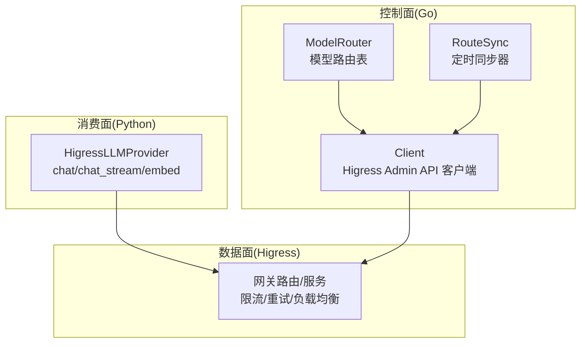
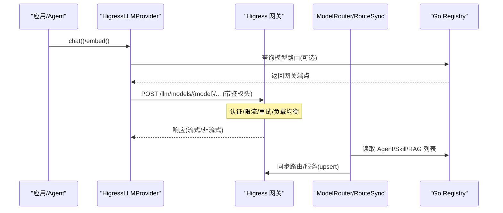
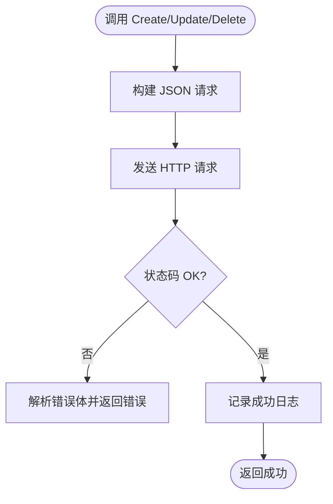
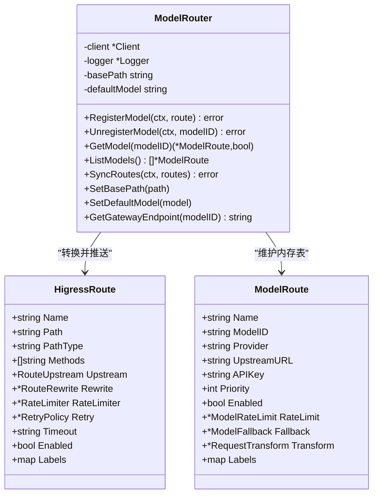
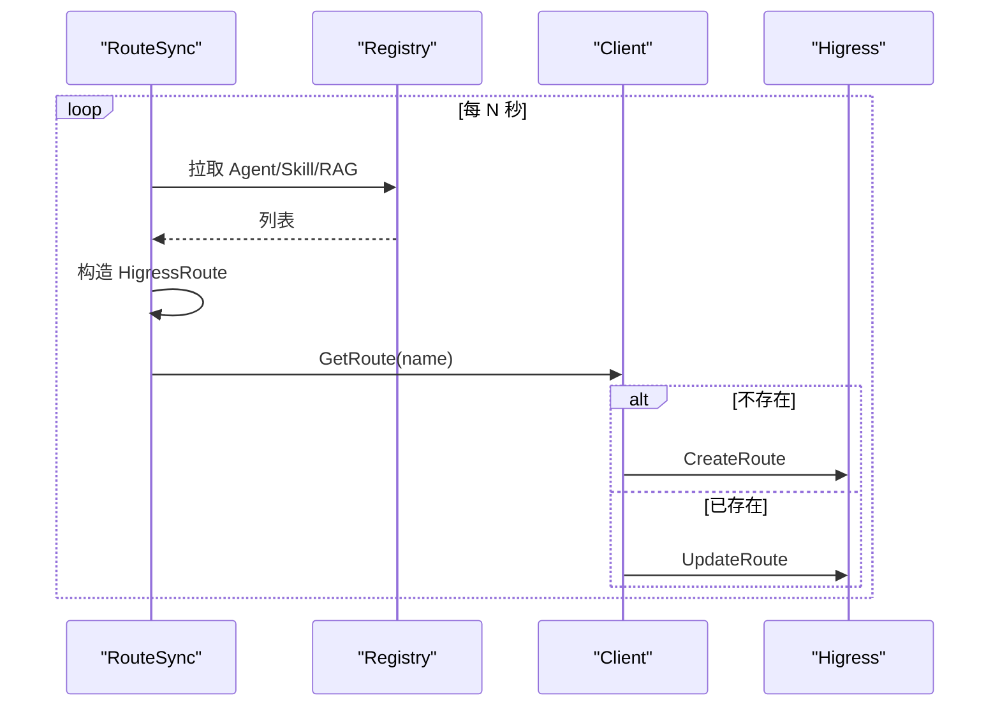
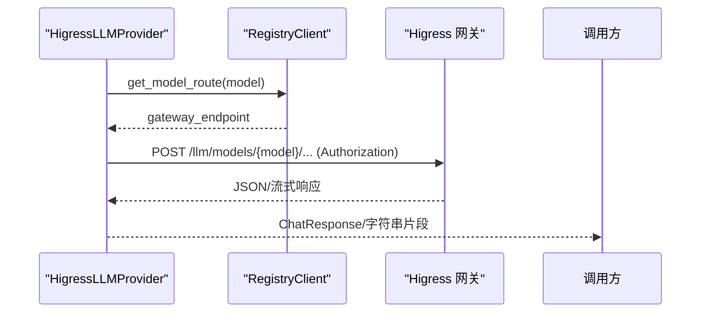
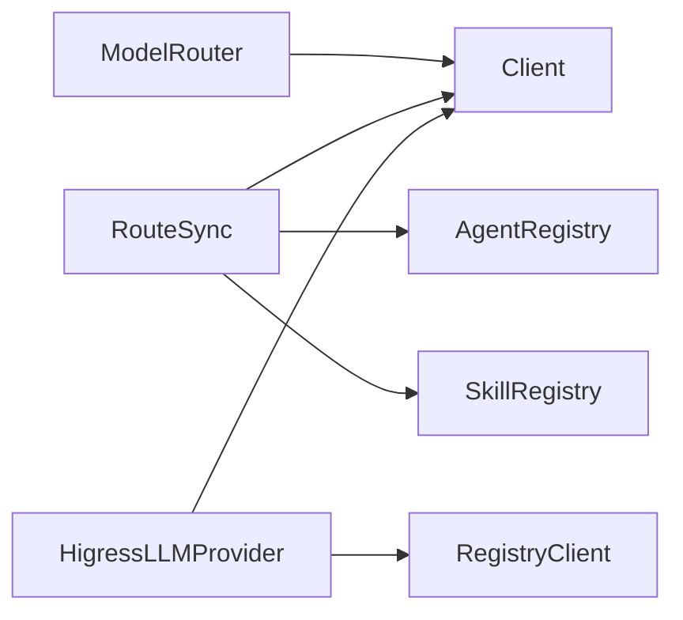

# 网关集成

<cite>
**本文引用的文件**
- [pkg/gateway/client.go](file://pkg/gateway/client.go)
- [pkg/gateway/model_router.go](file://pkg/gateway/model_router.go)
- [pkg/gateway/route_sync.go](file://pkg/gateway/route_sync.go)
- [python/src/resolveagent/llm/higress_provider.py](file://python/src/resolveagent/llm/higress_provider.py)
- [configs/resolveagent.yaml](file://configs/resolveagent.yaml)
- [configs/models.yaml](file://configs/models.yaml)
- [deploy/helm/resolveagent/values.yaml](file://deploy/helm/resolveagent/values.yaml)
- [pkg/circuitbreaker/breaker.go](file://pkg/circuitbreaker/breaker.go)
- [docs/architecture/security.md](file://docs/architecture/security.md)
</cite>

## 目录
1. [简介](#简介)
2. [项目结构](#项目结构)
3. [核心组件](#核心组件)
4. [架构总览](#架构总览)
5. [详细组件分析](#详细组件分析)
6. [依赖关系分析](#依赖关系分析)
7. [性能与容量规划](#性能与容量规划)
8. [故障排查指南](#故障排查指南)
9. [结论](#结论)
10. [附录：部署与配置示例](#附录部署与配置示例)

## 简介
本文件面向 ResolveAgent 的 Higress AI 网关集成，系统性阐述控制面（Go 平台）与数据面（Higress 网关）、消费面（Python 运行时）之间的协作方式。重点覆盖模型路由器实现、路由同步机制、负载均衡策略、流量控制、动态路由更新、故障转移、安全策略、限流规则、监控指标以及部署运维实践。目标是帮助读者在生产环境中正确设计、部署和运维基于 Higress 的 AI 网关。

## 项目结构
ResolveAgent 将网关集成拆分为清晰的三层：
- 控制面（Go 平台）：负责路由注册、服务发现、模型路由表维护、与 Higress 管理 API 同步。
- 数据面（Higress 网关）：负责认证、限流、重试、转发、负载均衡、可观测性。
- 消费面（Python 运行时）：通过 HigressLLMProvider 统一访问 LLM/Embedding 能力，走网关进行治理。

图表来源
- [pkg/gateway/model_router.go:52-85](file://pkg/gateway/model_router.go#L52-L85)
- [pkg/gateway/route_sync.go:13-63](file://pkg/gateway/route_sync.go#L13-L63)
- [pkg/gateway/client.go:14-32](file://pkg/gateway/client.go#L14-L32)
- [python/src/resolveagent/llm/higress_provider.py:24-113](file://python/src/resolveagent/llm/higress_provider.py#L24-L113)

章节来源
- [pkg/gateway/model_router.go:52-85](file://pkg/gateway/model_router.go#L52-L85)
- [pkg/gateway/route_sync.go:13-63](file://pkg/gateway/route_sync.go#L13-L63)
- [pkg/gateway/client.go:14-32](file://pkg/gateway/client.go#L14-L32)
- [python/src/resolveagent/llm/higress_provider.py:24-113](file://python/src/resolveagent/llm/higress_provider.py#L24-L113)

## 核心组件
- 网关客户端 Client：封装对 Higress 管理 API 的 HTTP 调用，提供健康检查、路由/服务的增删改查、错误解析等能力。
- 模型路由器 ModelRouter：维护内存中的模型路由表，将 ModelRoute 转换为 HigressRoute 并推送到网关；支持默认模型、基础路径、提供者基路由同步。
- 路由同步器 RouteSync：周期性从 Go Registry 拉取 Agent/Skill/RAG 等路由信息，生成 HigressRoute 并 upsert 到网关，保证“单一真相源”。
- Python 侧 HigressLLMProvider：统一通过网关发起 LLM/Embedding 请求，支持非流式与流式响应，自动注入鉴权头，按模型查询网关端点。

章节来源
- [pkg/gateway/client.go:14-32](file://pkg/gateway/client.go#L14-L32)
- [pkg/gateway/model_router.go:52-85](file://pkg/gateway/model_router.go#L52-L85)
- [pkg/gateway/route_sync.go:13-63](file://pkg/gateway/route_sync.go#L13-L63)
- [python/src/resolveagent/llm/higress_provider.py:24-113](file://python/src/resolveagent/llm/higress_provider.py#L24-L113)

## 架构总览
整体遵循“单一真相源”原则：Go Registry 作为路由与服务配置的唯一中心，通过 RouteSync 定时同步至 Higress；Python 运行时通过 HigressLLMProvider 访问网关，由网关完成认证、限流、重试、负载均衡与转发。

图表来源
- [python/src/resolveagent/llm/higress_provider.py:125-149](file://python/src/resolveagent/llm/higress_provider.py#L125-L149)
- [python/src/resolveagent/llm/higress_provider.py:151-219](file://python/src/resolveagent/llm/higress_provider.py#L151-L219)
- [pkg/gateway/route_sync.go:70-130](file://pkg/gateway/route_sync.go#L70-L130)
- [pkg/gateway/model_router.go:87-163](file://pkg/gateway/model_router.go#L87-L163)

## 详细组件分析

### 网关客户端 Client
职责
- 健康检查：定期探测 Higress 管理接口可用性。
- 路由管理：创建/更新/删除/获取/列出路由。
- 服务管理：注册/注销上游服务。
- 错误处理：统一解析网关返回的错误体。

关键行为
- 所有写操作统一经 doRouteRequest 发送 JSON 请求，校验状态码并记录日志。
- GetRoute 在 404 时返回空结果而非错误，便于上层做 upsert 模式判断。

图表来源
- [pkg/gateway/client.go:101-184](file://pkg/gateway/client.go#L101-L184)
- [pkg/gateway/client.go:196-242](file://pkg/gateway/client.go#L196-L242)
- [pkg/gateway/client.go:244-273](file://pkg/gateway/client.go#L244-L273)

章节来源
- [pkg/gateway/client.go:14-54](file://pkg/gateway/client.go#L14-L54)
- [pkg/gateway/client.go:101-184](file://pkg/gateway/client.go#L101-L184)
- [pkg/gateway/client.go:196-242](file://pkg/gateway/client.go#L196-L242)
- [pkg/gateway/client.go:244-273](file://pkg/gateway/client.go#L244-L273)

### 模型路由器 ModelRouter
职责
- 维护内存中的模型路由表（按 ModelID）。
- 将 ModelRoute 转换为 HigressRoute 并推送至网关。
- 同步已知提供者的基础路由，保持 API 兼容。
- 暴露默认模型与网关端点生成方法。

转换要点
- 路径：/llm/models/{ModelID}，固定 prefix 匹配，仅 POST。
- 上游：端口固定 443，Host 来自 UpstreamURL。
- 限流：RequestsPerMinute 折算为 RequestsPerSecond，Key 使用 Authorization 头。
- 重试：当启用 Fallback 时，设置 RetryOn=5xx,reset,connect-failure，每次尝试超时 30s。
- 变换：支持 PathRewrite 与 AddHeaders。

图表来源
- [pkg/gateway/model_router.go:52-85](file://pkg/gateway/model_router.go#L52-L85)
- [pkg/gateway/model_router.go:87-163](file://pkg/gateway/model_router.go#L87-L163)
- [pkg/gateway/model_router.go:205-250](file://pkg/gateway/model_router.go#L205-L250)

章节来源
- [pkg/gateway/model_router.go:52-85](file://pkg/gateway/model_router.go#L52-L85)
- [pkg/gateway/model_router.go:87-163](file://pkg/gateway/model_router.go#L87-L163)
- [pkg/gateway/model_router.go:165-203](file://pkg/gateway/model_router.go#L165-L203)
- [pkg/gateway/model_router.go:205-250](file://pkg/gateway/model_router.go#L205-L250)

### 路由同步器 RouteSync
职责
- 周期性地从 Go Registry 拉取 Agent/Skill/RAG 路由，生成 HigressRoute 并 upsert 到网关。
- 同步平台静态路由（API、健康检查等）。
- 提供 Service 注册/删除能力，供外部系统扩展。

同步流程
- 启动后执行一次初始同步，随后按间隔循环。
- 分别同步平台路由、Agent 路由、Skill 路由。
- 对每条路由先查询是否存在，不存在则创建，存在则更新。

图表来源
- [pkg/gateway/route_sync.go:70-130](file://pkg/gateway/route_sync.go#L70-L130)
- [pkg/gateway/route_sync.go:132-204](file://pkg/gateway/route_sync.go#L132-L204)
- [pkg/gateway/route_sync.go:206-291](file://pkg/gateway/route_sync.go#L206-L291)

章节来源
- [pkg/gateway/route_sync.go:13-63](file://pkg/gateway/route_sync.go#L13-L63)
- [pkg/gateway/route_sync.go:70-130](file://pkg/gateway/route_sync.go#L70-L130)
- [pkg/gateway/route_sync.go:132-204](file://pkg/gateway/route_sync.go#L132-L204)
- [pkg/gateway/route_sync.go:206-291](file://pkg/gateway/route_sync.go#L206-L291)

### Python 侧 HigressLLMProvider
职责
- 统一通过 Higress 网关发起 LLM/Embedding 请求。
- 自动注入鉴权头（Bearer Token），支持流式与非流式响应。
- 优先从 Registry 查询模型网关端点，回退到默认路径结构。

调用序列
- chat：组装消息与参数，POST 到网关，解析 choices 与 usage。
- chat_stream：SSE 流式读取 data: 行，解析 delta.content 增量输出。
- embed：批量或单条文本向量化，返回向量数组。

图表来源
- [python/src/resolveagent/llm/higress_provider.py:125-149](file://python/src/resolveagent/llm/higress_provider.py#L125-L149)
- [python/src/resolveagent/llm/higress_provider.py:151-219](file://python/src/resolveagent/llm/higress_provider.py#L151-L219)
- [python/src/resolveagent/llm/higress_provider.py:221-292](file://python/src/resolveagent/llm/higress_provider.py#L221-L292)
- [python/src/resolveagent/llm/higress_provider.py:299-399](file://python/src/resolveagent/llm/higress_provider.py#L299-L399)

章节来源
- [python/src/resolveagent/llm/higress_provider.py:24-113](file://python/src/resolveagent/llm/higress_provider.py#L24-L113)
- [python/src/resolveagent/llm/higress_provider.py:125-149](file://python/src/resolveagent/llm/higress_provider.py#L125-L149)
- [python/src/resolveagent/llm/higress_provider.py:151-219](file://python/src/resolveagent/llm/higress_provider.py#L151-L219)
- [python/src/resolveagent/llm/higress_provider.py:221-292](file://python/src/resolveagent/llm/higress_provider.py#L221-L292)
- [python/src/resolveagent/llm/higress_provider.py:299-399](file://python/src/resolveagent/llm/higress_provider.py#L299-L399)

## 依赖关系分析
- ModelRouter 依赖 Client 与 Logger，并通过 syncProviderRoutes 内置 qwen/wenxin/zhipu 的基础路由映射。
- RouteSync 依赖 Client、AgentRegistry、SkillRegistry，周期性驱动路由同步。
- Python HigressLLMProvider 依赖 httpx 异步客户端与 RegistryClient，用于获取网关端点。
- 配置集中来源于 resolveagent.yaml 与 models.yaml，决定网关开关、同步间隔、默认模型、负载均衡策略等。

图表来源
- [pkg/gateway/model_router.go:52-85](file://pkg/gateway/model_router.go#L52-L85)
- [pkg/gateway/route_sync.go:13-63](file://pkg/gateway/route_sync.go#L13-L63)
- [python/src/resolveagent/llm/higress_provider.py:125-149](file://python/src/resolveagent/llm/higress_provider.py#L125-L149)

章节来源
- [pkg/gateway/model_router.go:52-85](file://pkg/gateway/model_router.go#L52-L85)
- [pkg/gateway/route_sync.go:13-63](file://pkg/gateway/route_sync.go#L13-L63)
- [python/src/resolveagent/llm/higress_provider.py:125-149](file://python/src/resolveagent/llm/higress_provider.py#L125-L149)

## 性能与容量规划
- 同步频率：默认 30 秒，可根据环境调整，避免频繁写网关造成压力。
- 限流策略：按 Authorization 头维度限流，建议结合租户/用户维度拆分 Key。
- 重试策略：仅在启用 Fallback 时开启，注意重试风暴风险，合理设置 per_try_timeout 与条件。
- 负载均衡：上游服务建议使用 round_robin，配合健康检查与不健康判定阈值。
- 资源配额：参考 Helm values 中 platform/runtime/webui 的资源 requests/limits，按需扩容。

章节来源
- [pkg/gateway/route_sync.go:37-45](file://pkg/gateway/route_sync.go#L37-L45)
- [pkg/gateway/model_router.go:223-239](file://pkg/gateway/model_router.go#L223-L239)
- [pkg/gateway/client.go:72-78](file://pkg/gateway/client.go#L72-L78)
- [deploy/helm/resolveagent/values.yaml:3-35](file://deploy/helm/resolveagent/values.yaml#L3-L35)

## 故障排查指南
常见问题与定位思路
- 网关不可达：检查 Client.Health 是否通过，确认 admin_url 可达性与网络连通。
- 路由未生效：核对 RouteSync 是否运行、sync_interval 是否合理；查看 GetRoute 是否存在；确认名称与路径匹配。
- 限流过严：检查 RateLimiter 的 RequestsPerSecond 与 Key 是否正确；必要时放宽 Burst。
- 重试风暴：若 Fallback 启用且条件过宽，可能导致级联重试；收紧 RetryOn 条件或降低 Attempts。
- 鉴权失败：确认 Authorization 头注入与网关侧认证策略一致；平台层可透传 X-Auth-User/X-Auth-Roles。

可观测性与自愈
- 熔断器：Breaker 提供 CLOSED/OPEN/HALF_OPEN 三态切换，保护下游服务，避免雪崩。
- 健康检查：平台与健康探针暴露 /health 与 /ready，便于编排层探测。
- 日志与指标：建议在网关与平台侧开启指标导出，结合告警阈值触发自动恢复动作。

章节来源
- [pkg/gateway/client.go:34-54](file://pkg/gateway/client.go#L34-L54)
- [pkg/gateway/route_sync.go:70-130](file://pkg/gateway/route_sync.go#L70-L130)
- [pkg/gateway/model_router.go:223-239](file://pkg/gateway/model_router.go#L223-L239)
- [pkg/circuitbreaker/breaker.go:1-122](file://pkg/circuitbreaker/breaker.go#L1-L122)
- [docs/architecture/security.md:1-38](file://docs/architecture/security.md#L1-L38)

## 结论
ResolveAgent 的 Higress 网关集成以“单一真相源”为核心，通过 Go 控制面集中管理路由与服务，Python 消费面统一接入，借助网关实现认证、限流、重试与负载均衡。该架构具备高内聚、低耦合、易扩展的特点，适合生产环境的规模化 AI 流量治理。建议在生产中结合熔断、指标与告警形成闭环自愈，持续优化限流与重试策略，保障稳定性与性能。

## 附录：部署与配置示例
- 启用网关集成：在 resolveagent.yaml 中设置 gateway.enabled=true，配置 admin_url、sync_interval、model_routing.base_path 与 default_model。
- 模型清单：在 models.yaml 中声明可用模型及 provider、base_url、max_tokens 等元信息。
- 负载均衡与健康检查：在 resolveagent.yaml 的 load_balancer 中配置策略、健康检查间隔与不健康计数。
- Helm 部署：参考 values.yaml 配置 platform/runtime/webui 的副本数、镜像、端口与资源限制；如需 Ingress，启用 ingress 并配置 hosts 与 paths。
- 安全策略：平台层支持 JWT、API Key、网关透传模式；确保 Authorization 头与网关认证策略一致。

章节来源
- [configs/resolveagent.yaml:28-64](file://configs/resolveagent.yaml#L28-L64)
- [configs/models.yaml:1-66](file://configs/models.yaml#L1-L66)
- [deploy/helm/resolveagent/values.yaml:1-66](file://deploy/helm/resolveagent/values.yaml#L1-L66)
- [docs/architecture/security.md:1-38](file://docs/architecture/security.md#L1-L38)