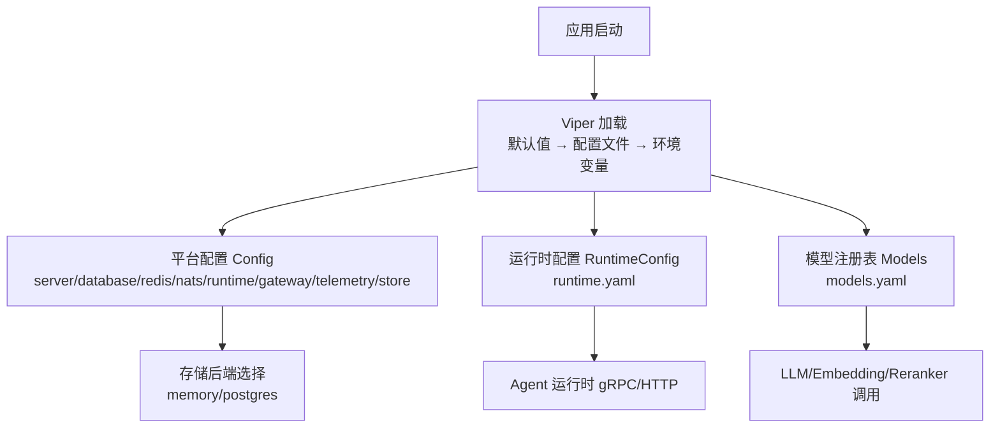
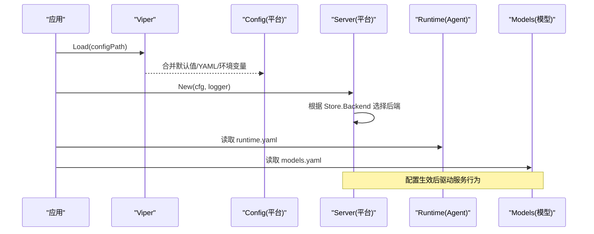
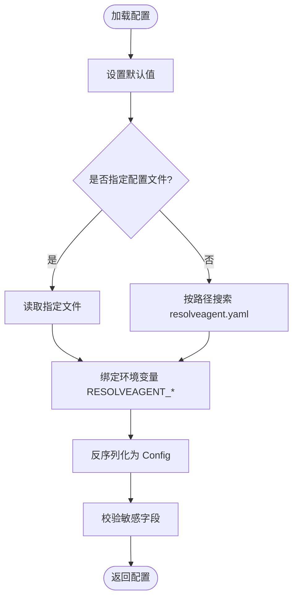
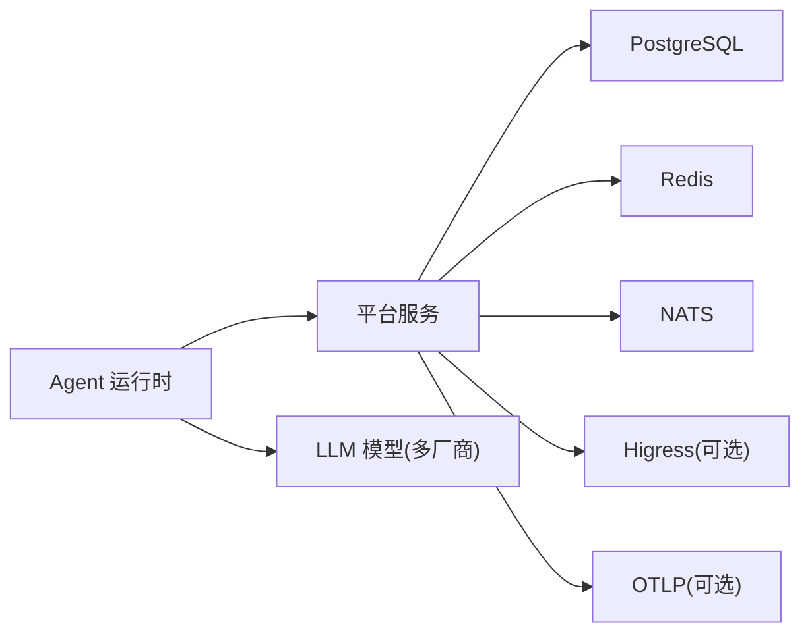

# 配置管理

<cite>
**本文引用的文件**
- [pkg/config/config.go](file://pkg/config/config.go)
- [pkg/config/types.go](file://pkg/config/types.go)
- [configs/resolveagent.yaml](file://configs/resolveagent.yaml)
- [configs/runtime.yaml](file://configs/runtime.yaml)
- [configs/models.yaml](file://configs/models.yaml)
- [configs/examples/agent-example.yaml](file://configs/examples/agent-example.yaml)
- [configs/examples/skill-example.yaml](file://configs/examples/skill-example.yaml)
- [deploy/docker-compose/docker-compose.yaml](file://deploy/docker-compose/docker-compose.yaml)
- [deploy/helm/resolveagent/values.yaml](file://deploy/helm/resolveagent/values.yaml)
- [python/src/resolveagent/mcp/config.py](file://python/src/resolveagent/mcp/config.py)
- [pkg/server/server.go](file://pkg/server/server.go)
- [docs/zh/configuration.md](file://docs/zh/configuration.md)
</cite>

## 目录
1. [简介](#简介)
2. [项目结构](#项目结构)
3. [核心组件](#核心组件)
4. [架构总览](#架构总览)
5. [详细组件分析](#详细组件分析)
6. [依赖关系分析](#依赖关系分析)
7. [性能考量](#性能考量)
8. [故障排查指南](#故障排查指南)
9. [结论](#结论)
10. [附录](#附录)

## 简介
本章节面向 ResolveAgent 项目的配置管理体系，系统阐述基于 Viper 的配置加载机制、配置文件格式、环境变量绑定、默认值设置与基础校验；分层说明平台配置、运行时配置与模型配置的职责与使用方式；并给出配置热更新、加密与备份恢复的实践建议、示例与迁移指南。

## 项目结构
ResolveAgent 的配置由三部分构成：
- 平台服务配置（Go 侧）：通过 Viper 统一加载，支持 YAML 与 RESOLVEAGENT_* 环境变量覆盖。
- Agent 运行时配置（Python 侧）：独立 runtime.yaml，控制 Agent 池、选择器、反馈循环等。
- 模型注册表（models.yaml）：集中声明 LLM/Embedding/Reranker 等模型能力与参数。

图表来源
- [pkg/config/config.go:11-74](file://pkg/config/config.go#L11-L74)
- [pkg/config/types.go:5-115](file://pkg/config/types.go#L5-L115)
- [configs/resolveagent.yaml:1-156](file://configs/resolveagent.yaml#L1-L156)
- [configs/runtime.yaml:1-74](file://configs/runtime.yaml#L1-L74)
- [configs/models.yaml:1-66](file://configs/models.yaml#L1-L66)

章节来源
- [pkg/config/config.go:11-74](file://pkg/config/config.go#L11-L74)
- [pkg/config/types.go:5-115](file://pkg/config/types.go#L5-L115)
- [configs/resolveagent.yaml:1-156](file://configs/resolveagent.yaml#L1-L156)
- [configs/runtime.yaml:1-74](file://configs/runtime.yaml#L1-L74)
- [configs/models.yaml:1-66](file://configs/models.yaml#L1-L66)

## 核心组件
- 配置加载器（Viper）：负责默认值、配置文件读取、环境变量合并、反序列化为 Go 结构体。
- 配置类型定义：以结构化类型表达各子系统配置项，提供便捷方法（如数据库 DSN）。
- 敏感字段校验：在加载后对关键安全字段进行空值或弱默认值告警。
- 运行时配置：Python 侧的 Agent 运行时独立配置，包含选择器、反馈循环、熔断器等。
- 模型注册表：集中声明多厂商 LLM 及嵌入/重排序模型，便于路由与复用。

章节来源
- [pkg/config/config.go:11-95](file://pkg/config/config.go#L11-L95)
- [pkg/config/types.go:5-115](file://pkg/config/types.go#L5-L115)
- [configs/runtime.yaml:1-74](file://configs/runtime.yaml#L1-L74)
- [configs/models.yaml:1-66](file://configs/models.yaml#L1-L66)

## 架构总览
下图展示配置从加载到生效的关键路径：Viper 将默认值、YAML 与环境变量合并为统一的 Config 对象；平台服务根据 StoreConfig 选择内存或 PostgreSQL 后端；Agent 运行时通过独立的 runtime.yaml 运行；模型注册表被 Python 侧消费用于 LLM 路由。

图表来源
- [pkg/config/config.go:11-74](file://pkg/config/config.go#L11-L74)
- [pkg/server/server.go:44-86](file://pkg/server/server.go#L44-L86)
- [configs/runtime.yaml:1-74](file://configs/runtime.yaml#L1-L74)
- [configs/models.yaml:1-66](file://configs/models.yaml#L1-L66)

## 详细组件分析

### 平台配置（resolveagent.yaml + Viper）
- 配置文件位置与优先级：命令行指定 > 当前目录 > $HOME/.resolveagent > /etc/resolveagent。
- 环境变量覆盖：前缀 RESOLVEAGENT_，键中点替换为下划线（例如 server.http_addr → RESOLVEAGENT_SERVER_HTTP_ADDR）。
- 默认值：在代码中集中声明，保证无配置文件时仍可启动。
- 敏感字段校验：数据库密码、网关 JWT Secret、Redis 密码为空时输出警告。
- 存储后端：Store.Backend 支持 memory/postgres；可按注册表名覆盖。

图表来源
- [pkg/config/config.go:11-74](file://pkg/config/config.go#L11-L74)
- [pkg/config/config.go:83-95](file://pkg/config/config.go#L83-L95)
- [docs/zh/configuration.md:7-31](file://docs/zh/configuration.md#L7-L31)

章节来源
- [pkg/config/config.go:11-95](file://pkg/config/config.go#L11-L95)
- [pkg/config/types.go:5-115](file://pkg/config/types.go#L5-L115)
- [configs/resolveagent.yaml:1-156](file://configs/resolveagent.yaml#L1-L156)
- [docs/zh/configuration.md:7-31](file://docs/zh/configuration.md#L7-L31)

### 运行时配置（runtime.yaml）
- 服务器与 Agent 池：监听地址、最大实例数、驱逐策略。
- 选择器：默认策略、置信度阈值、缓存与规则。
- 反馈循环与熔断：周期性反馈、自适应权重、熔断阈值与恢复时间。
- 遥测：服务名与 OTLP 端点。

章节来源
- [configs/runtime.yaml:1-74](file://configs/runtime.yaml#L1-L74)
- [docs/zh/configuration.md:234-377](file://docs/zh/configuration.md#L234-L377)

### 模型配置（models.yaml）
- 模型条目：id、provider、model_name、max_tokens、temperature、base_url 等。
- 多厂商支持：通义千问、文心一言、智谱清言、Moonshot、Mimo 等。
- 用途：供 Python 运行时进行 LLM 路由与调用。

章节来源
- [configs/models.yaml:1-66](file://configs/models.yaml#L1-L66)
- [docs/zh/configuration.md:381-436](file://docs/zh/configuration.md#L381-L436)

### MCP 配置（Python 侧）
- 支持 stdio/http/sse 传输，命令/URL/Headers/Env 可解析环境变量。
- 提供启用开关与超时控制，便于集成外部工具。

章节来源
- [python/src/resolveagent/mcp/config.py:25-86](file://python/src/resolveagent/mcp/config.py#L25-L86)

### 存储后端选择（PostgreSQL vs 内存）
- 当 Store.Backend 为 postgres 时，平台服务连接数据库并执行迁移，随后初始化各注册表的 Postgres 实现。
- 否则使用内存实现，适合本地开发与测试。

章节来源
- [pkg/server/server.go:44-86](file://pkg/server/server.go#L44-L86)
- [pkg/config/types.go:17-29](file://pkg/config/types.go#L17-L29)

## 依赖关系分析
- 平台服务依赖：数据库（PostgreSQL）、缓存（Redis）、消息总线（NATS）、可选网关（Higress）、遥测（OTLP）。
- 运行时依赖：平台 REST API（store.platform_url）、可选 LLM 网关。
- 模型依赖：各 LLM 提供商 API。

图表来源
- [configs/resolveagent.yaml:5-156](file://configs/resolveagent.yaml#L5-L156)
- [configs/runtime.yaml:1-74](file://configs/runtime.yaml#L1-L74)
- [configs/models.yaml:1-66](file://configs/models.yaml#L1-L66)

章节来源
- [configs/resolveagent.yaml:5-156](file://configs/resolveagent.yaml#L5-L156)
- [configs/runtime.yaml:1-74](file://configs/runtime.yaml#L1-L74)
- [configs/models.yaml:1-66](file://configs/models.yaml#L1-L66)

## 性能考量
- 连接与超时：合理设置数据库连接池、Redis/NATS 超时与重试，避免雪崩。
- 存储后端：高频读写的注册表建议使用 PostgreSQL；低频场景可用内存提升吞吐。
- 网关同步：Higress 路由同步间隔需权衡一致性与开销。
- 反馈循环：聚合窗口与缓冲区大小影响 CPU 与内存占用。

[本节为通用指导，不直接分析具体文件]

## 故障排查指南
- 启动失败：检查配置文件路径与权限、环境变量是否正确注入。
- 数据库连接：确认 host/port/user/password/dbname/sslmode；生产环境务必设置密码。
- 网关鉴权：开启 gateway.auth.enabled 时必须设置 jwt_secret。
- Redis 认证：若启用密码，请确保 RESOLVEAGENT_REDIS_PASSWORD 已配置。
- 日志定位：关注加载阶段的敏感字段告警信息。

章节来源
- [pkg/config/config.go:83-95](file://pkg/config/config.go#L83-L95)
- [deploy/docker-compose/docker-compose.yaml:39-69](file://deploy/docker-compose/docker-compose.yaml#L39-L69)

## 结论
ResolveAgent 采用“默认值 + 配置文件 + 环境变量”的分层配置体系，结合结构化类型与敏感字段校验，既保证了开箱即用，又满足生产环境的灵活与安全需求。平台与运行时解耦，模型注册表集中管理，便于扩展与维护。配合容器编排与 Helm 值文件，可实现跨环境的一致部署。

[本节为总结性内容，不直接分析具体文件]

## 附录

### 配置热更新
- 现状：当前配置加载在启动阶段完成，未内置热更新机制。
- 建议：
  - 通过进程外管理器（如 Kubernetes ConfigMap/Secret 滚动更新）触发 Pod 重启。
  - 或在关键模块（如网关路由、反馈循环）引入 Watch 机制，按需重载局部配置。
  - 对于敏感字段变更，应强制重启以确保安全上下文刷新。

[本节为概念性建议，不直接分析具体文件]

### 配置加密
- 现状：配置文件中明文存放敏感信息（如数据库密码、JWT Secret），但可通过环境变量注入。
- 建议：
  - 在生产环境中使用密钥管理服务（如 KMS、Vault）注入敏感字段。
  - 结合容器编排的 Secret 机制，避免将明文写入镜像或仓库。
  - 对静态配置文件进行最小化暴露，仅保留非敏感项。

[本节为概念性建议，不直接分析具体文件]

### 配置备份与恢复
- 建议：
  - 将 resolveagent.yaml、runtime.yaml、models.yaml 纳入版本库与发布制品管理。
  - 对运行时产生的动态配置（如模型路由、技能清单）定期快照至对象存储或数据库。
  - 恢复流程：回滚配置版本 → 重启服务 → 验证健康检查与关键指标。

[本节为概念性建议，不直接分析具体文件]

### 配置示例与最佳实践
- 示例文件：
  - 平台服务：configs/resolveagent.yaml
  - 运行时：configs/runtime.yaml
  - 模型注册表：configs/models.yaml
  - Agent/技能示例：configs/examples/agent-example.yaml、configs/examples/skill-example.yaml
- 最佳实践：
  - 使用环境变量覆盖敏感项，避免硬编码。
  - 通过 Helm values.yaml 或 docker-compose 环境变量集中管理多环境差异。
  - 保持配置最小化，拆分关注点（平台/运行时/模型）。
  - 为新配置项补充默认值与文档注释。

章节来源
- [configs/resolveagent.yaml:1-156](file://configs/resolveagent.yaml#L1-L156)
- [configs/runtime.yaml:1-74](file://configs/runtime.yaml#L1-L74)
- [configs/models.yaml:1-66](file://configs/models.yaml#L1-L66)
- [configs/examples/agent-example.yaml:1-18](file://configs/examples/agent-example.yaml#L1-L18)
- [configs/examples/skill-example.yaml:1-23](file://configs/examples/skill-example.yaml#L1-L23)
- [deploy/helm/resolveagent/values.yaml:1-66](file://deploy/helm/resolveagent/values.yaml#L1-L66)
- [deploy/docker-compose/docker-compose.yaml:39-69](file://deploy/docker-compose/docker-compose.yaml#L39-L69)

### 配置迁移指南
- 升级步骤：
  - 阅读变更日志，识别新增/废弃字段。
  - 在 staging 环境更新配置文件与 Helm values，逐步切换环境变量。
  - 运行单元测试与集成测试，验证配置生效。
  - 灰度发布，观察指标与告警。
- 回滚策略：
  - 保留上一版本配置文件与镜像标签。
  - 一键回滚配置与镜像，快速恢复服务。

[本节为通用操作指南，不直接分析具体文件]