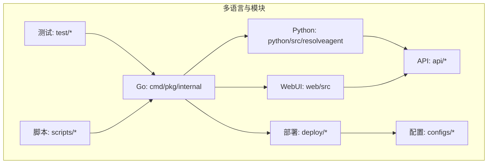
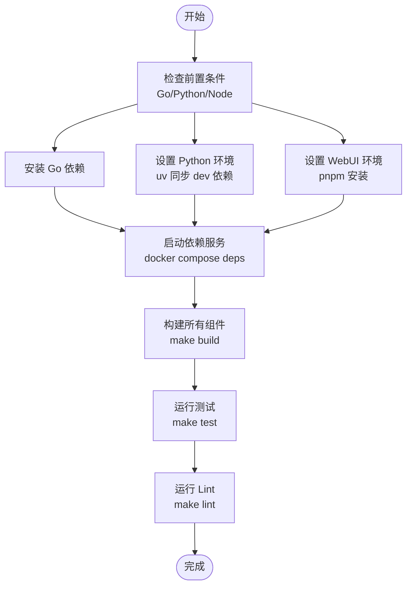
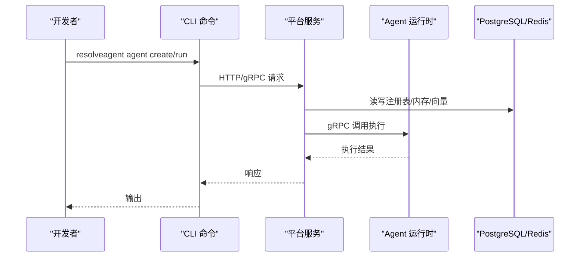
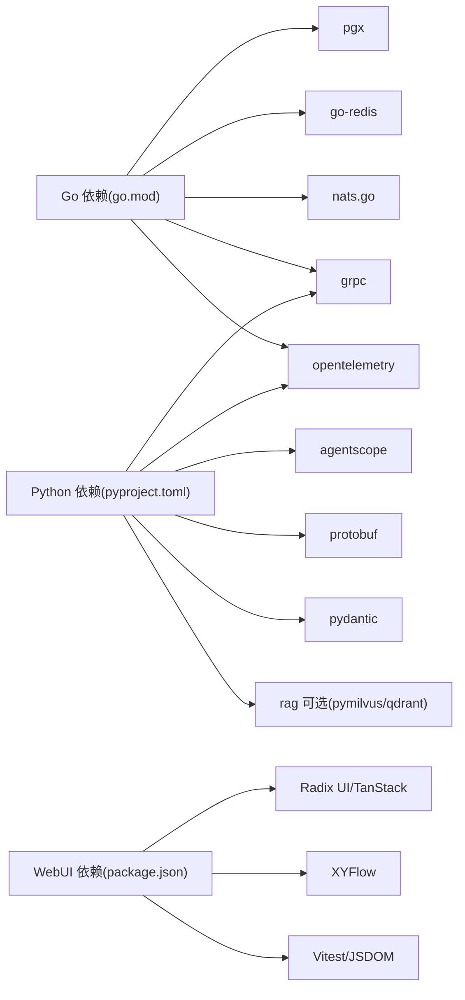

# 开发者指南

<cite>
**本文引用的文件**   
- [README.md](file://README.md)
- [.github/CONTRIBUTING.md](file://.github/CONTRIBUTING.md)
- [.github/CODE_OF_CONDUCT.md](file://.github/CODE_OF_CONDUCT.md)
- [MAINTAINERS.md](file://MAINTAINERS.md)
- [Makefile](file://Makefile)
- [hack/setup-dev.sh](file://hack/setup-dev.sh)
- [hack/lint.sh](file://hack/lint.sh)
- [hack/generate-proto.sh](file://hack/generate-proto.sh)
- [.golangci.yml](file://.golangci.yml)
- [.github/PULL_REQUEST_TEMPLATE.md](file://.github/PULL_REQUEST_TEMPLATE.md)
- [configs/resolveagent.yaml](file://configs/resolveagent.yaml)
- [configs/runtime.yaml](file://configs/runtime.yaml)
- [go.mod](file://go.mod)
- [python/pyproject.toml](file://python/pyproject.toml)
- [web/package.json](file://web/package.json)
- [deploy/docker-compose/docker-compose.deps.yaml](file://deploy/docker-compose/docker-compose.deps.yaml)
- [deploy/docker-compose/docker-compose.yaml](file://deploy/docker-compose/docker-compose.yaml)
- [deploy/helm/resolveagent/values.yaml](file://deploy/helm/resolveagent/values.yaml)
- [deploy/helm/resolveagent/Chart.yaml](file://deploy/helm/resolveagent/Chart.yaml)
- [scripts/start-local.sh](file://scripts/start-local.sh)
- [scripts/migration/001_init.up.sql](file://scripts/migration/001_init.up.sql)
- [scripts/seed/seed.sql](file://scripts/seed/seed.sql)
- [tools/buf/buf.yaml](file://tools/buf/buf.yaml)
- [tools/buf/buf.gen.yaml](file://tools/buf/buf.gen.yaml)
- [api/proto/resolveagent/v1/agent.proto](file://api/proto/resolveagent/v1/agent.proto)
- [api/proto/resolveagent/v1/skill.proto](file://api/proto/resolveagent/v1/skill.proto)
- [api/proto/resolveagent/v1/workflow.proto](file://api/proto/resolveagent/v1/workflow.proto)
- [api/proto/resolveagent/v1/registry.proto](file://api/proto/resolveagent/v1/registry.proto)
- [api/proto/resolveagent/v1/common.proto](file://api/proto/resolveagent/v1/common.proto)
- [api/proto/resolveagent/v1/platform.proto](file://api/proto/resolveagent/v1/platform.proto)
- [api/proto/resolveagent/v1/rag.proto](file://api/proto/resolveagent/v1/rag.proto)
- [api/proto/resolveagent/v1/selector.proto](file://api/proto/resolveagent/v1/selector.proto)
- [api/proto/resolveagent/v1/agent.proto](file://api/proto/resolveagent/v1/agent.proto)
- [api/openapi/v1/resolveagent.yaml](file://api/openapi/v1/resolveagent.yaml)
- [api/jsonschema/skill-manifest.schema.json](file://api/jsonschema/skill-manifest.schema.json)
- [internal/cli/root.go](file://internal/cli/root.go)
- [internal/cli/serve.go](file://internal/cli/serve.go)
- [internal/cli/agent/create.go](file://internal/cli/agent/create.go)
- [internal/cli/agent/run.go](file://internal/cli/agent/run.go)
- [internal/cli/workflow/create.go](file://internal/cli/workflow/create.go)
- [internal/cli/workflow/run.go](file://internal/cli/workflow/run.go)
- [internal/cli/skill/list.go](file://internal/cli/skill/list.go)
- [internal/cli/skill/test.go](file://internal/cli/skill/test.go)
- [pkg/config/config.go](file://pkg/config/config.go)
- [pkg/logger/logger.go](file://pkg/logger/logger.go)
- [pkg/telemetry/tracer.go](file://pkg/telemetry/tracer.go)
- [pkg/store/postgres/postgres.go](file://pkg/store/postgres/postgres.go)
- [pkg/store/redis/redis.go](file://pkg/store/redis/redis.go)
- [pkg/event/nats.go](file://pkg/event/nats.go)
- [pkg/gateway/client.go](file://pkg/gateway/client.go)
- [pkg/server/router.go](file://pkg/server/router.go)
- [pkg/server/server.go](file://pkg/server/server.go)
- [pkg/registry/agent.go](file://pkg/registry/agent.go)
- [pkg/registry/skill.go](file://pkg/registry/skill.go)
- [pkg/registry/workflow.go](file://pkg/registry/workflow.go)
- [pkg/registry/rag.go](file://pkg/registry/rag.go)
- [pkg/registry/memory.go](file://pkg/registry/memory.go)
- [pkg/registry/hook.go](file://pkg/registry/hook.go)
- [pkg/registry/solution.go](file://pkg/registry/solution.go)
- [pkg/registry/traffic_capture.go](file://pkg/registry/traffic_capture.go)
- [pkg/registry/traffic_graph.go](file://pkg/registry/traffic_graph.go)
- [pkg/registry/code_analysis.go](file://pkg/registry/code_analysis.go)
- [pkg/registry/cta](file://pkg/registry/cta)
- [pkg/registry/cta](file://pkg/registry/cta)
- [pkg/registry/cta](file://pkg/registry/cta)
- [pkg/registry/cta](file://pkg/registry/cta)
- [pkg/registry/cta](file://pkg/registry/cta)
- [pkg/registry/cta](file://pkg/registry/cta)
- [pkg/registry/cta](file://pkg/registry/cta)
- [pkg/registry/cta](file://pkg/registry/cta)
- [pkg/registry/cta](file://pkg/registry/cta)
- [pkg/registry/cta](file://pkg/registry/cta)
- [pkg/registry/cta](file://pkg/registry/cta)
- [pkg/registry/cta](file://pkg/registry/cta)
- [pkg/registry/cta](file://pkg/registry/cta)
- [pkg/registry/cta](file://pkg/registry/cta)
- [pkg/registry/cta](file://pkg/registry/cta)
- [pkg/registry/cta](file://pkg/registry/cta)
- [pkg/registry/cta](file://pkg/registry/cta)
- [pkg/registry/cta](file://pkg/registry/cta)
- [pkg/registry/cta](file://pkg/registry/cta)
- [pkg/registry/cta](file://pkg/registry/cta)
- [pkg/registry/cta](file://pkg/registry/cta)
- [pkg/registry/cta](file://pkg/registry/cta)
- [pkg/registry/cta](file://pkg/registry/cta)
- [pkg/registry/cta](file://pkg/registry/cta)
- [pkg/registry/cta](file://pkg/registry/cta)
- [pkg/registry/cta](file://pkg/registry/cta)
- [pkg/registry/cta](file://pkg/registry/cta)
- [pkg/registry/cta](file://pkg/registry/cta)
- [pkg/registry/cta](file://pkg/registry/cta)
- [pkg/registry/cta](file://pkg/registry/cta)
- [pkg/registry/cta](file://pkg/registry/cta)
- [pkg/registry/cta](file://pkg/registry/cta)
-......
</cite>

## 目录
1. [简介](#简介)
2. [项目结构](#项目结构)
3. [核心组件](#核心组件)
4. [架构总览](#架构总览)
5. [详细组件分析](#详细组件分析)
6. [依赖关系分析](#依赖关系分析)
7. [性能考量](#性能考量)
8. [故障排查指南](#故障排查指南)
9. [结论](#结论)
10. [附录](#附录)

## 简介
ResolveAgent 是一个面向问题解决的 AIOps 智能体平台，具备“专家技能”“FTA 工作流”“RAG 知识库”“代码分析”四大核心能力，采用 CNCF 级别架构，支持多语言运行时与容器化部署。项目提供统一的开发工作流、测试与质量保障体系，并通过 CLI、TUI、WebUI 和 API 全栈覆盖。

## 项目结构
项目采用多语言混合架构，按功能域划分目录：
- cmd/：Go 可执行程序入口（平台服务与 CLI）
- internal/：Go 内部包（CLI 子命令、平台服务内部逻辑）
- pkg/：Go 可复用库（配置、日志、遥测、存储、网关、事件等）
- python/：Python Agent 运行时（Selector、FTA、RAG、Skills、LLM Provider、DocSync 等）
- web/：React+TS WebUI
- deploy/：Docker、Docker Compose、Helm、Kubernetes 部署
- configs/：平台与运行时配置模板
- scripts/：数据库迁移、种子数据、本地启动脚本
- api/：OpenAPI、Protocol Buffers、JSON Schema（技能清单）
- docs/、docs-site/：文档与站点
- test/：Go 端到端与集成测试
- tools/buf/：Buf Protobuf 管理
- .github/：贡献、治理、安全等流程文件



**图表来源**
- [Makefile:51-68](file://Makefile#L51-L68)
- [go.mod:1-90](file://go.mod#L1-L90)
- [python/pyproject.toml:1-70](file://python/pyproject.toml#L1-L70)
- [web/package.json:1-60](file://web/package.json#L1-L60)

**章节来源**
- [README.md:438-531](file://README.md#L438-L531)
- [Makefile:1-261](file://Makefile#L1-L261)

## 核心组件
- 平台服务（Go）：REST/gRPC API、注册中心、路由同步、事件总线、可观测性
- Agent 运行时（Python）：智能选择器、FTA 引擎、RAG 管道、专家技能系统、LLM Provider、文档同步
- Higress 网关：鉴权、限流、模型路由
- WebUI：工作流可视化、仪表盘、知识库管理
- 部署与运维：Docker、Docker Compose、Helm、Kubernetes

**章节来源**
- [README.md:438-531](file://README.md#L438-L531)
- [configs/resolveagent.yaml:1-90](file://configs/resolveagent.yaml#L1-L90)
- [configs/runtime.yaml:1-35](file://configs/runtime.yaml#L1-L35)

## 架构总览
系统采用“外部网关 + 内部选择器”的双层路由设计：外部请求经 Higress 完成鉴权与限流，内部请求由智能选择器进行 FTA/Skills/RAG 路由；平台服务与 Agent 运行时通过 gRPC 通信，数据层由 PostgreSQL、Redis、NATS、向量库组成。

```mermaid
graph TB
subgraph "客户端"
CLI["CLI/TUI"]
WEB["WebUI"]
EXT["外部 API"]
end
subgraph "Higress 网关"
GW["鉴权/限流/模型路由"]
end
subgraph "平台服务(Go)"
API["API 服务器(HTTP/gRPC)"]
REG["注册中心(单真相源)"]
SYNC["路由同步"]
BUS["事件总线(NATS)"]
ROUTER["模型路由"]
TELE["遥测"]
end
subgraph "Agent 运行时(Python)"
SEL["智能选择器"]
FTA["FTA 引擎"]
SKL["专家技能"]
RAG["RAG 管道"]
LLM["LLM Provider"]
end
subgraph "数据层"
PG["PostgreSQL"]
RD["Redis"]
NT["NATS"]
VL["向量库(Milvus/Qdrant)"]
end
CLI --> GW --> API
WEB --> GW
EXT --> GW
GW --> API
API --> |gRPC| SEL
SEL --> FTA
SEL --> SKL
SEL --> RAG
API < --> REG
API < --> BUS
API < --> TELE
SEL --> LLM
SEL --> PG
SEL --> RD
SEL --> VL
```

**图表来源**
- [README.md:442-510](file://README.md#L442-L510)
- [configs/resolveagent.yaml:27-63](file://configs/resolveagent.yaml#L27-L63)
- [configs/runtime.yaml:1-35](file://configs/runtime.yaml#L1-L35)

## 详细组件分析

### 开发环境搭建
- 一键初始化：执行开发环境设置脚本，自动安装/校验 Go、Python、Node、uv、pnpm、Buf 等依赖
- 本地依赖：通过 Docker Compose 启动 PostgreSQL、Redis、NATS、Milvus 等
- 构建与测试：统一通过 Makefile 目标完成 Go/Python/WebUI 构建、测试、格式化、Lint
- 文档同步：提供中英双语文档同步与校对工具



**图表来源**
- [hack/setup-dev.sh:8-51](file://hack/setup-dev.sh#L8-L51)
- [Makefile:186-202](file://Makefile#L186-L202)
- [Makefile:51-96](file://Makefile#L51-L96)
- [Makefile:125-146](file://Makefile#L125-L146)

**章节来源**
- [README.md:76-152](file://README.md#L76-L152)
- [hack/setup-dev.sh:1-61](file://hack/setup-dev.sh#L1-L61)
- [Makefile:227-261](file://Makefile#L227-L261)

### 代码规范与约定
- Go：遵循 Effective Go，使用 gofumpt 格式化，golangci-lint 检查，结构化日志与上下文传播
- Python：PEP 8（ruff），类型提示，Pydantic 数据模型，ruff format
- TypeScript/React：严格 TS 配置，函数式组件与 Hooks 约定
- Protocol Buffers：Buf 风格与 lint，统一生成模板

**章节来源**
- [.github/CONTRIBUTING.md:53-80](file://.github/CONTRIBUTING.md#L53-L80)
- [.golangci.yml:1-69](file://.golangci.yml#L1-L69)
- [python/pyproject.toml:55-70](file://python/pyproject.toml#L55-L70)
- [web/package.json:1-60](file://web/package.json#L1-L60)
- [tools/buf/buf.yaml](file://tools/buf/buf.yaml)
- [tools/buf/buf.gen.yaml](file://tools/buf/buf.gen.yaml)

### 开发辅助工具
- Makefile：统一构建、测试、Lint、Docker、Helm、开发辅助（setup-dev、docs-sync、fmt）
- Buf：Protobuf 管理与生成
- Lint 脚本：集中执行各语言 Lint
- 本地启动脚本：一键启动平台与运行时

**章节来源**
- [Makefile:1-261](file://Makefile#L1-L261)
- [hack/lint.sh:1-21](file://hack/lint.sh#L1-L21)
- [hack/generate-proto.sh:1-17](file://hack/generate-proto.sh#L1-L17)
- [scripts/start-local.sh](file://scripts/start-local.sh)

### 测试框架
- Go：单元测试、Race 检测、覆盖率；E2E 与 Integration 测试标签
- Python：pytest + pytest-asyncio + pytest-cov
- WebUI：Vitest 单元测试
- 数据库：迁移脚本与种子数据

**章节来源**
- [Makefile:73-96](file://Makefile#L73-L96)
- [python/pyproject.toml:67-70](file://python/pyproject.toml#L67-L70)
- [web/package.json:12-13](file://web/package.json#L12-L13)
- [scripts/migration/001_init.up.sql](file://scripts/migration/001_init.up.sql)
- [scripts/seed/seed.sql](file://scripts/seed/seed.sql)

### 代码生成工具
- Protobuf：Buf 生成 Go/Python/TypeScript 客户端与消息类型
- OpenAPI/JSON Schema：API 文档与技能清单校验

**章节来源**
- [hack/generate-proto.sh:1-17](file://hack/generate-proto.sh#L1-L17)
- [tools/buf/buf.yaml](file://tools/buf/buf.yaml)
- [tools/buf/buf.gen.yaml](file://tools/buf/buf.gen.yaml)
- [api/openapi/v1/resolveagent.yaml](file://api/openapi/v1/resolveagent.yaml)
- [api/jsonschema/skill-manifest.schema.json](file://api/jsonschema/skill-manifest.schema.json)

### 部署脚本与配置
- Docker：平台、运行时、WebUI 镜像构建
- Docker Compose：本地全栈与依赖服务编排
- Helm：Chart 与 values.yaml，支持生产参数
- Kubernetes：Kustomization 与命名空间

**章节来源**
- [Makefile:163-181](file://Makefile#L163-L181)
- [Makefile:186-202](file://Makefile#L186-L202)
- [deploy/docker-compose/docker-compose.deps.yaml](file://deploy/docker-compose/docker-compose.deps.yaml)
- [deploy/docker-compose/docker-compose.yaml](file://deploy/docker-compose/docker-compose.yaml)
- [deploy/helm/resolveagent/Chart.yaml](file://deploy/helm/resolveagent/Chart.yaml)
- [deploy/helm/resolveagent/values.yaml](file://deploy/helm/resolveagent/values.yaml)

### CLI/TUI 与平台服务
- CLI：agent、skill、workflow、corpus、dashboard、serve、version 等子命令
- TUI：基于 Bubble Tea 的终端界面
- 平台服务：HTTP/gRPC、中间件（鉴权、日志、遥测、链路追踪）、路由与运行时客户端



**图表来源**
- [internal/cli/root.go](file://internal/cli/root.go)
- [internal/cli/agent/create.go](file://internal/cli/agent/create.go)
- [internal/cli/agent/run.go](file://internal/cli/agent/run.go)
- [internal/cli/workflow/create.go](file://internal/cli/workflow/create.go)
- [internal/cli/workflow/run.go](file://internal/cli/workflow/run.go)
- [pkg/server/router.go](file://pkg/server/router.go)
- [pkg/server/server.go](file://pkg/server/server.go)
- [pkg/registry/agent.go](file://pkg/registry/agent.go)
- [pkg/registry/skill.go](file://pkg/registry/skill.go)
- [pkg/registry/workflow.go](file://pkg/registry/workflow.go)

**章节来源**
- [internal/cli/root.go](file://internal/cli/root.go)
- [internal/cli/serve.go](file://internal/cli/serve.go)
- [pkg/server/router.go](file://pkg/server/router.go)
- [pkg/server/server.go](file://pkg/server/server.go)

### 注册中心与存储
- 注册中心：Agent、Skill、Workflow、RAG、Memory、Hook、Solution、Traffic、Code Analysis、FTA 文档
- 存储：PostgreSQL、Redis、内存存储；支持后端切换与 TTL/清理策略
- 事件总线：NATS JetStream

**章节来源**
- [pkg/registry/agent.go](file://pkg/registry/agent.go)
- [pkg/registry/skill.go](file://pkg/registry/skill.go)
- [pkg/registry/workflow.go](file://pkg/registry/workflow.go)
- [pkg/registry/rag.go](file://pkg/registry/rag.go)
- [pkg/registry/memory.go](file://pkg/registry/memory.go)
- [pkg/registry/hook.go](file://pkg/registry/hook.go)
- [pkg/registry/solution.go](file://pkg/registry/solution.go)
- [pkg/registry/traffic_capture.go](file://pkg/registry/traffic_capture.go)
- [pkg/registry/traffic_graph.go](file://pkg/registry/traffic_graph.go)
- [pkg/registry/code_analysis.go](file://pkg/registry/code_analysis.go)
- [pkg/store/postgres/postgres.go](file://pkg/store/postgres/postgres.go)
- [pkg/store/redis/redis.go](file://pkg/store/redis/redis.go)
- [pkg/event/nats.go](file://pkg/event/nats.go)

### 遥测与可观测性
- Tracing：OpenTelemetry，支持 OTLP 导出
- Metrics：Prometheus 指标导出
- 日志：结构化日志，支持 JSON/文本格式

**章节来源**
- [configs/resolveagent.yaml:64-70](file://configs/resolveagent.yaml#L64-L70)
- [configs/runtime.yaml:15-18](file://configs/runtime.yaml#L15-L18)
- [pkg/telemetry/tracer.go](file://pkg/telemetry/tracer.go)

### 质量保证与安全
- 代码质量：golangci-lint、ruff、mypy、ESLint、Buf lint
- 安全：API Key 管理建议使用 Kubernetes Secret，避免硬编码
- 测试：单元、集成、E2E、WebUI 测试全覆盖

**章节来源**
- [.golangci.yml:1-69](file://.golangci.yml#L1-L69)
- [python/pyproject.toml:55-70](file://python/pyproject.toml#L55-L70)
- [web/package.json:39-58](file://web/package.json#L39-L58)
- [README.md:620-662](file://README.md#L620-L662)

## 依赖关系分析
- Go 依赖：PostgreSQL、Redis、NATS、gRPC、OpenTelemetry、Cobra/Viper 等
- Python 依赖：AgentScope、gRPC、Protobuf、Pydantic、OpenTelemetry、RAG 可选 Milvus/Qdrant
- WebUI 依赖：Radix UI、TanStack React Query、XYFlow、TailwindCSS、Vitest 等



**图表来源**
- [go.mod:1-90](file://go.mod#L1-L90)
- [python/pyproject.toml:19-29](file://python/pyproject.toml#L19-L29)
- [web/package.json:15-58](file://web/package.json#L15-L58)

**章节来源**
- [go.mod:1-90](file://go.mod#L1-L90)
- [python/pyproject.toml:1-70](file://python/pyproject.toml#L1-L70)
- [web/package.json:1-60](file://web/package.json#L1-L60)

## 性能考量
- 平台服务：HTTP/GRPC 地址、连接池、消息大小限制
- Agent 运行时：工作进程数、并发任务、任务超时、LLM 请求超时与重试
- RAG：嵌入批大小、检索 Top-K、重排序 Top-K
- 监控：OTLP、Prometheus 指标、采样率

**章节来源**
- [configs/resolveagent.yaml:6-26](file://configs/resolveagent.yaml#L6-L26)
- [configs/resolveagent.yaml:64-70](file://configs/resolveagent.yaml#L64-L70)
- [configs/runtime.yaml:1-35](file://configs/runtime.yaml#L1-L35)

## 故障排查指南
- 环境准备：确认 Go/Python/Node/uv/pnpm/Buf 是否满足版本要求
- 依赖服务：使用 docker compose 启动依赖并等待就绪
- 构建失败：检查 Makefile 目标与缓存清理（make clean）
- Lint 失败：按语言分别修正 gofmt/ruff/ts/eslint/buf lint
- 数据库：使用迁移脚本与种子数据初始化
- 网络连通：检查平台与运行时 gRPC 地址、Higress 网关配置

**章节来源**
- [hack/setup-dev.sh:8-18](file://hack/setup-dev.sh#L8-L18)
- [Makefile:186-202](file://Makefile#L186-L202)
- [Makefile:245-261](file://Makefile#L245-L261)
- [scripts/migration/001_init.up.sql](file://scripts/migration/001_init.up.sql)
- [scripts/seed/seed.sql](file://scripts/seed/seed.sql)

## 结论
ResolveAgent 提供从平台服务到运行时、从 CLI/TUI/WebUI 到部署运维的完整开发与运行闭环。通过统一的 Makefile、Buf、Docker/Helm 与严格的代码规范，团队可以高效协作并确保质量。建议在开发过程中优先使用提供的脚本与模板，配合 CI/CD 与监控体系，持续演进系统能力。

## 附录

### 贡献指南与流程
- 行为准则与贡献流程见贡献文档
- RFC 流程用于重大架构变更讨论
- Pull Request 模板包含变更摘要、类型、测试与检查清单

**章节来源**
- [.github/CONTRIBUTING.md:1-93](file://.github/CONTRIBUTING.md#L1-L93)
- [.github/CODE_OF_CONDUCT.md:1-52](file://.github/CODE_OF_CONDUCT.md#L1-L52)
- [.github/PULL_REQUEST_TEMPLATE.md:1-28](file://.github/PULL_REQUEST_TEMPLATE.md#L1-L28)

### 维护者职责
- 核心维护者负责整体方向与跨组件协调
- 组件负责人覆盖 cmd/pkg/internal、python、web、deploy、docs/docs-site
- 成为维护者需遵循贡献流程

**章节来源**
- [MAINTAINERS.md:1-25](file://MAINTAINERS.md#L1-L25)

### 发布与分支策略
- 版本号来源于 Git Tag，构建信息注入二进制
- 建议采用主干直发（main）+ 标签发布的方式，配合 Helm/镜像版本标签

**章节来源**
- [Makefile:8-12](file://Makefile#L8-L12)