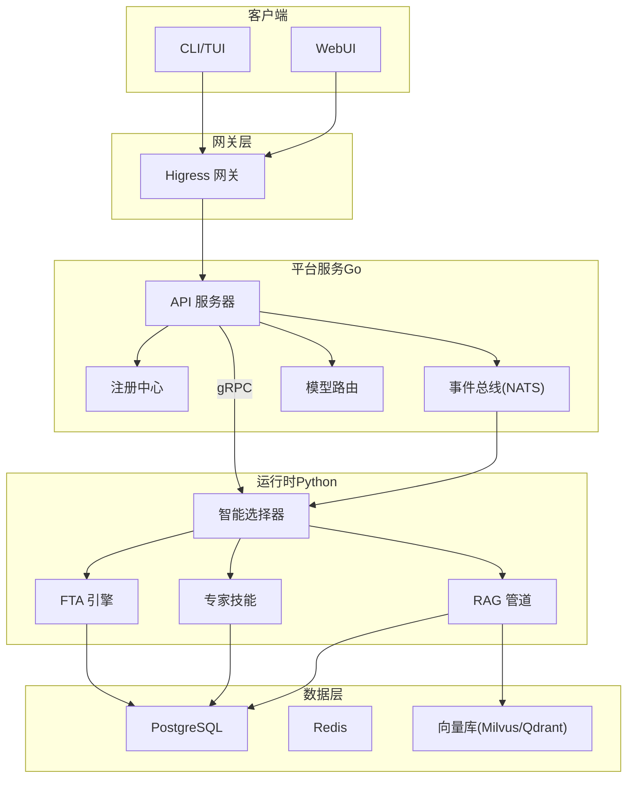
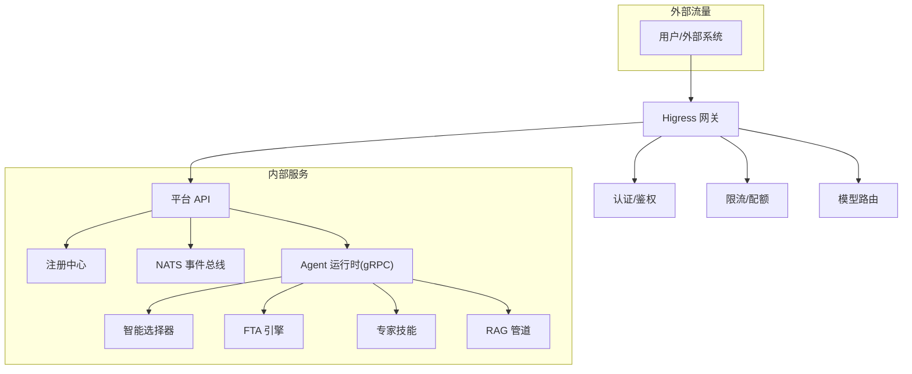
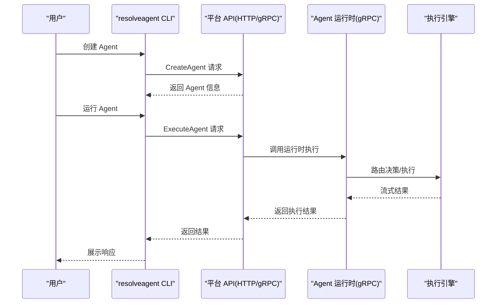
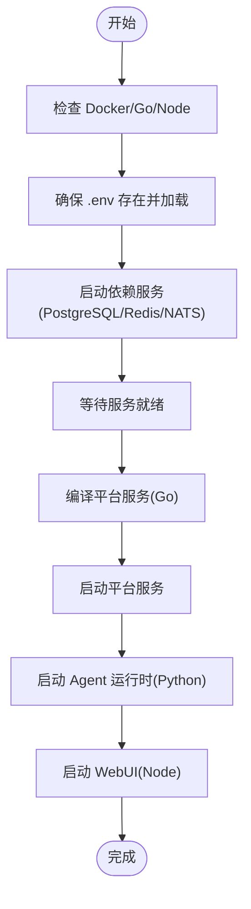
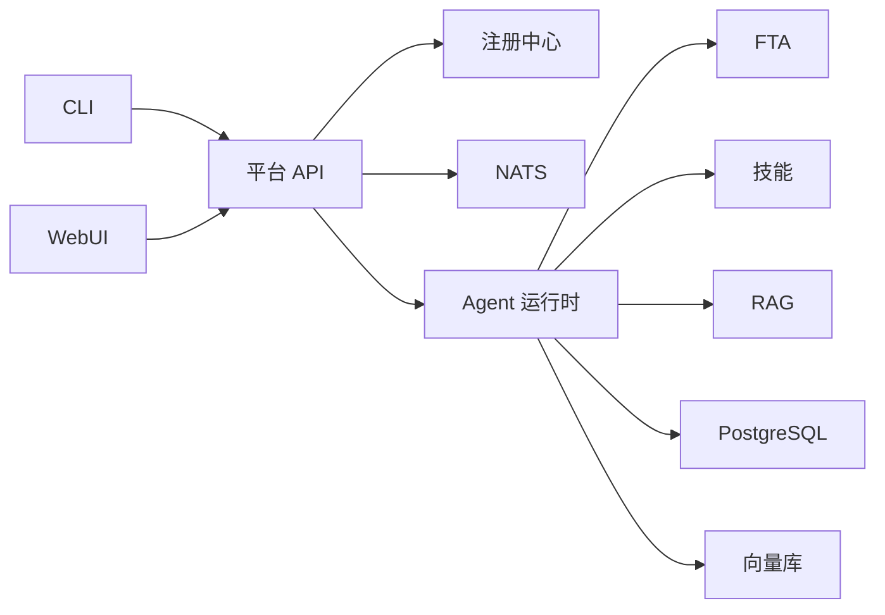

# 快速开始

<cite>
**本文引用的文件**
- [README.md](file://README.md)
- [docs/user-guide/quickstart.md](file://docs/user-guide/quickstart.md)
- [examples/quickstart/README.md](file://examples/quickstart/README.md)
- [configs/resolveagent.yaml](file://configs/resolveagent.yaml)
- [configs/runtime.yaml](file://configs/runtime.yaml)
- [deploy/docker-compose/docker-compose.yaml](file://deploy/docker-compose/docker-compose.yaml)
- [Makefile](file://Makefile)
- [scripts/start-local.sh](file://scripts/start-local.sh)
- [internal/cli/root.go](file://internal/cli/root.go)
- [internal/cli/agent/create.go](file://internal/cli/agent/create.go)
- [cmd/resolveagent-cli/main.go](file://cmd/resolveagent-cli/main.go)
- [python/src/resolveagent/runtime/server.py](file://python/src/resolveagent/runtime/server.py)
- [examples/quickstart/agent.yaml](file://examples/quickstart/agent.yaml)
- [examples/quickstart/workflow.yaml](file://examples/quickstart/workflow.yaml)
</cite>

## 目录
1. [简介](#简介)
2. [项目结构](#项目结构)
3. [核心组件](#核心组件)
4. [架构总览](#架构总览)
5. [详细组件解析](#详细组件解析)
6. [依赖关系分析](#依赖关系分析)
7. [性能考虑](#性能考虑)
8. [故障排查指南](#故障排查指南)
9. [结论](#结论)
10. [附录](#附录)

## 简介
ResolveAgent 是面向问题解决的 AIOps 智能体平台，具备四大核心能力：
- 🔧 专家技能：可插拔技能模块，提供领域专业知识
- 🌳 FTA 工作流：故障树分析（FTA）进行系统性问题诊断
- 📚 RAG 知识库：检索增强生成（RAG）提供知识支撑
- 💻 代码分析：静态代码分析作为底层技术保障

系统采用“平台服务（Go）+ Agent 运行时（Python）+ Higress 网关”的分层架构，支持 Docker Compose 一键本地部署，并提供 CLI/TUI/WebUI 多入口。

## 项目结构
- 平台服务（Go）：提供 REST/gRPC API、注册中心、路由同步、可观测性等
- Agent 运行时（Python）：智能选择器、FTA 引擎、技能系统、RAG 管道
- Higress 网关：外部认证、限流、模型路由
- WebUI：React+TS 管理控制台与工作流可视化编辑器
- 依赖服务：PostgreSQL、Redis、NATS、向量库（Milvus/Qdrant）

图表来源
- [README.md:440-510](file://README.md#L440-L510)
- [deploy/docker-compose/docker-compose.yaml:11-134](file://deploy/docker-compose/docker-compose.yaml#L11-L134)

章节来源
- [README.md:438-532](file://README.md#L438-L532)
- [deploy/docker-compose/docker-compose.yaml:11-134](file://deploy/docker-compose/docker-compose.yaml#L11-L134)

## 核心组件
- 平台服务（Go）
  - API 服务器：HTTP/gRPC 接口，统一对外服务
  - 注册中心：单一真相源，集中管理 Agent/Skill/Workflow
  - 路由同步：将注册中心规则同步至 Higress
  - 事件总线：基于 NATS JetStream 的消息总线
- Agent 运行时（Python）
  - 智能选择器：意图分析、上下文增强、路由决策
  - 执行引擎：FTA、技能、RAG 的统一调度
- Higress 网关：认证、限流、模型路由、负载均衡
- 数据层：PostgreSQL、Redis、NATS、向量库

章节来源
- [README.md:512-520](file://README.md#L512-L520)
- [configs/resolveagent.yaml:5-26](file://configs/resolveagent.yaml#L5-L26)
- [configs/runtime.yaml:3-24](file://configs/runtime.yaml#L3-L24)

## 架构总览
ResolveAgent 的关键设计决策：
- 服务注册：Go 注册中心作为单一真相源，同步到 Higress
- 外部路由：Higress 负责认证、限流、模型路由
- 内部路由：智能选择器负责 FTA/Skills/RAG 的路由
- LLM 调用：所有 LLM 调用通过 Higress 网关

图表来源
- [README.md:521-531](file://README.md#L521-L531)
- [configs/resolveagent.yaml:27-63](file://configs/resolveagent.yaml#L27-L63)

章节来源
- [README.md:521-531](file://README.md#L521-L531)

## 详细组件解析

### 环境要求与安装
- 环境要求
  - Go >= 1.22（平台服务、CLI）
  - Python >= 3.11（Agent 运行时）
  - Docker >= 20.10（容器运行时）
  - Docker Compose >= 2.0（本地开发）
  - Node.js >= 20（WebUI 可选）
- 一键设置开发环境
  - 执行命令：make setup-dev
  - 作用：安装 Go/Python/Node 依赖、生成 Protobuf、配置预提交钩子

章节来源
- [README.md:78-87](file://README.md#L78-L87)
- [docs/user-guide/quickstart.md:9-23](file://docs/user-guide/quickstart.md#L9-L23)
- [Makefile:229-231](file://Makefile#L229-L231)

### 依赖服务启动
- 启动依赖服务
  - make compose-deps 或 docker compose -f deploy/docker-compose/docker-compose.deps.yaml up -d
  - 等待服务就绪：docker compose -f deploy/docker-compose/docker-compose.deps.yaml ps
- 依赖服务清单
  - PostgreSQL、Redis、NATS、向量库（Milvus/Qdrant）

章节来源
- [README.md:100-108](file://README.md#L100-L108)
- [docs/user-guide/quickstart.md:48-59](file://docs/user-guide/quickstart.md#L48-L59)
- [deploy/docker-compose/docker-compose.yaml:139-211](file://deploy/docker-compose/docker-compose.yaml#L139-L211)

### 构建与启动
- 构建
  - make build：构建 Go 二进制、Python 包、WebUI
- 启动
  - make compose-up：启动平台服务、运行时、WebUI、依赖服务
  - 访问点
    - 平台 HTTP API：http://localhost:8080
    - 平台 gRPC：localhost:9090
    - Agent 运行时 gRPC：localhost:9091
    - WebUI：http://localhost:3000

章节来源
- [README.md:110-123](file://README.md#L110-L123)
- [docs/user-guide/quickstart.md:61-80](file://docs/user-guide/quickstart.md#L61-L80)
- [Makefile:53-67](file://Makefile#L53-L67)
- [deploy/docker-compose/docker-compose.yaml:27-134](file://deploy/docker-compose/docker-compose.yaml#L27-L134)

### 第一个智能 Agent 的创建与交互
- 配置 LLM API 密钥（任选其一）
  - Qwen/Wenxin/Zhipu API Key
- 创建 Agent
  - resolveagent agent create my-first-agent --type mega --model qwen-plus --description "My first ResolveAgent"
- 交互式运行
  - resolveagent agent run my-first-agent
- 示例交互
  - 用户输入：分析系统健康状况并提供建议
  - Agent 将结合 FTA、RAG、技能进行智能响应

章节来源
- [README.md:125-140](file://README.md#L125-L140)
- [docs/user-guide/quickstart.md:152-199](file://docs/user-guide/quickstart.md#L152-L199)
- [internal/cli/agent/create.go:13-74](file://internal/cli/agent/create.go#L13-L74)

### CLI 工作流（序列图）

图表来源
- [internal/cli/root.go:20-54](file://internal/cli/root.go#L20-L54)
- [internal/cli/agent/create.go:18-65](file://internal/cli/agent/create.go#L18-L65)
- [python/src/resolveagent/runtime/server.py:23-61](file://python/src/resolveagent/runtime/server.py#L23-L61)

章节来源
- [internal/cli/root.go:20-54](file://internal/cli/root.go#L20-L54)
- [internal/cli/agent/create.go:18-65](file://internal/cli/agent/create.go#L18-L65)
- [python/src/resolveagent/runtime/server.py:23-61](file://python/src/resolveagent/runtime/server.py#L23-L61)

### 本地一键启动脚本（流程图）

图表来源
- [scripts/start-local.sh:56-90](file://scripts/start-local.sh#L56-L90)
- [scripts/start-local.sh:118-157](file://scripts/start-local.sh#L118-L157)
- [scripts/start-local.sh:178-224](file://scripts/start-local.sh#L178-L224)
- [scripts/start-local.sh:226-250](file://scripts/start-local.sh#L226-L250)

章节来源
- [scripts/start-local.sh:56-90](file://scripts/start-local.sh#L56-L90)
- [scripts/start-local.sh:118-157](file://scripts/start-local.sh#L118-L157)
- [scripts/start-local.sh:178-224](file://scripts/start-local.sh#L178-L224)
- [scripts/start-local.sh:226-250](file://scripts/start-local.sh#L226-L250)

### 示例：快速入门（Docker Compose）
- 启动栈
  - docker compose -f deploy/docker-compose/docker-compose.deps.yaml up -d
  - docker compose -f deploy/docker-compose/docker-compose.yaml up -d
- 注册 Agent
  - resolveagent agent create -f examples/quickstart/agent.yaml
- 运行工作流
  - resolveagent workflow run -f examples/quickstart/workflow.yaml

章节来源
- [examples/quickstart/README.md:13-32](file://examples/quickstart/README.md#L13-L32)
- [examples/quickstart/agent.yaml:1-16](file://examples/quickstart/agent.yaml#L1-L16)
- [examples/quickstart/workflow.yaml:1-26](file://examples/quickstart/workflow.yaml#L1-L26)

## 依赖关系分析
- 组件耦合
  - 平台服务与运行时通过 gRPC 通信
  - 运行时依赖注册中心、事件总线、数据存储
  - 网关负责外部接入与内部路由策略
- 外部依赖
  - PostgreSQL、Redis、NATS、向量库
  - LLM 提供商（Qwen、Wenxin、Zhipu 等）

图表来源
- [deploy/docker-compose/docker-compose.yaml:27-134](file://deploy/docker-compose/docker-compose.yaml#L27-L134)
- [configs/resolveagent.yaml:5-26](file://configs/resolveagent.yaml#L5-L26)

章节来源
- [deploy/docker-compose/docker-compose.yaml:27-134](file://deploy/docker-compose/docker-compose.yaml#L27-L134)
- [configs/resolveagent.yaml:5-26](file://configs/resolveagent.yaml#L5-L26)

## 性能考虑
- 平台服务（Go）
  - HTTP/GRPC 地址与超时配置
  - 数据库连接池参数
  - Redis 连接池参数
- Agent 运行时（Python）
  - 工作进程数、并发任务数、任务超时
  - LLM 请求超时、重试次数与延迟
  - RAG 嵌入批次大小、检索 Top-K、重排序 Top-K
- 可观测性
  - OpenTelemetry 链路追踪与指标导出
  - Prometheus 指标端点
  - 结构化日志输出

章节来源
- [README.md:663-757](file://README.md#L663-L757)
- [configs/resolveagent.yaml:64-90](file://configs/resolveagent.yaml#L64-L90)
- [configs/runtime.yaml:15-35](file://configs/runtime.yaml#L15-L35)

## 故障排查指南
- 无法连接服务
  - resolveagent health 查看健康状态
  - docker compose -f deploy/docker-compose/docker-compose.deps.yaml logs 查看依赖日志
- Agent 创建失败
  - resolveagent config get 查看配置
  - resolveagent config get models 检查模型可用性
- 启用调试日志
  - export LOG_LEVEL=debug
  - resolveagent agent run <agent-name>

章节来源
- [docs/user-guide/quickstart.md:253-281](file://docs/user-guide/quickstart.md#L253-L281)
- [README.md:253-281](file://README.md#L253-L281)

## 结论
通过本快速开始指南，您可以在 5 分钟内完成 ResolveAgent 的本地部署与首个智能 Agent 的创建与交互。建议后续深入学习智能选择器、FTA 工作流、RAG 管道与技能系统的使用，并结合生产最佳实践进行优化与部署。

## 附录
- 常用命令参考
  - make setup-dev：设置开发环境
  - make compose-deps：启动依赖服务
  - make build：构建所有组件
  - make compose-up：启动所有服务
  - make compose-down：停止所有服务
  - make test：运行所有测试
  - make lint：运行代码检查
- 配置文件位置
  - 平台配置：configs/resolveagent.yaml
  - 运行时配置：configs/runtime.yaml
- CLI 入口
  - cmd/resolveagent-cli/main.go
  - internal/cli/root.go

章节来源
- [README.md:142-152](file://README.md#L142-L152)
- [Makefile:186-202](file://Makefile#L186-L202)
- [configs/resolveagent.yaml:1-90](file://configs/resolveagent.yaml#L1-L90)
- [configs/runtime.yaml:1-35](file://configs/runtime.yaml#L1-L35)
- [cmd/resolveagent-cli/main.go:1-14](file://cmd/resolveagent-cli/main.go#L1-L14)
- [internal/cli/root.go:20-54](file://internal/cli/root.go#L20-L54)