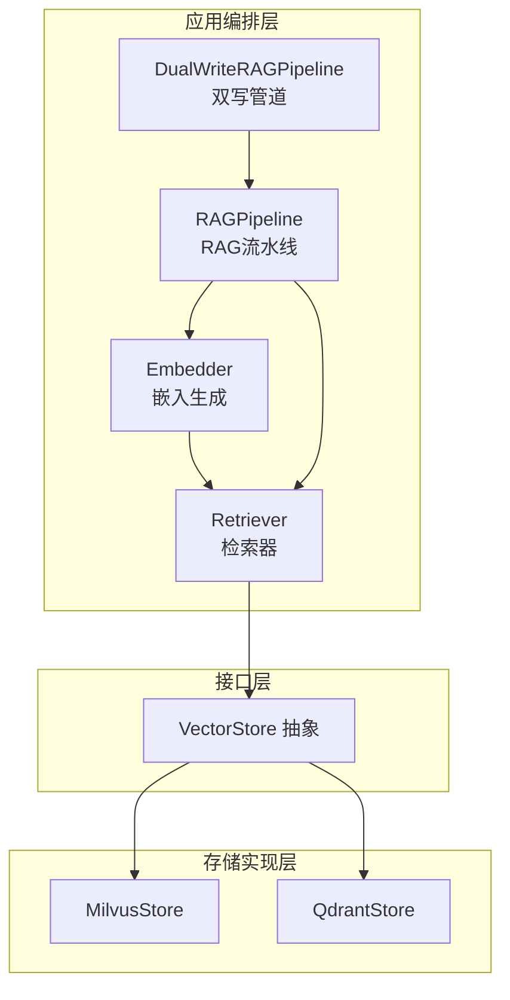
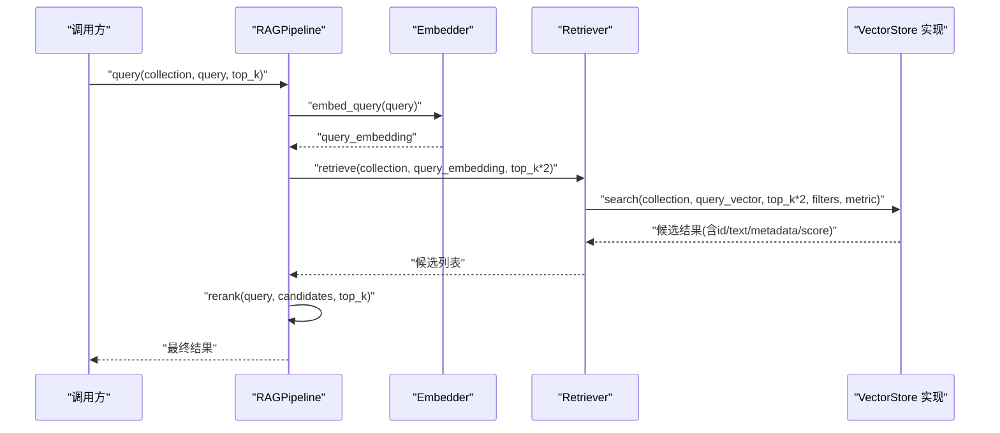
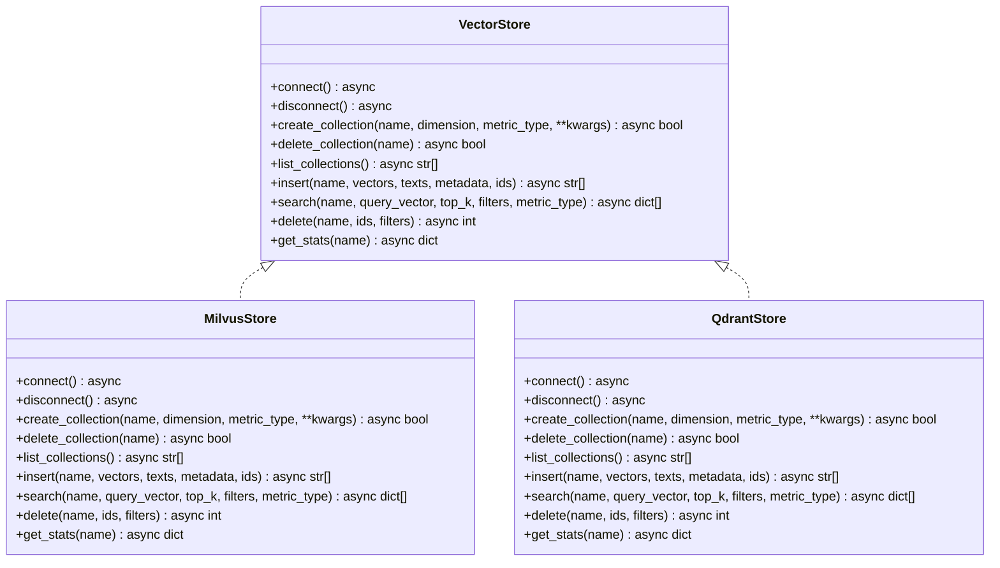
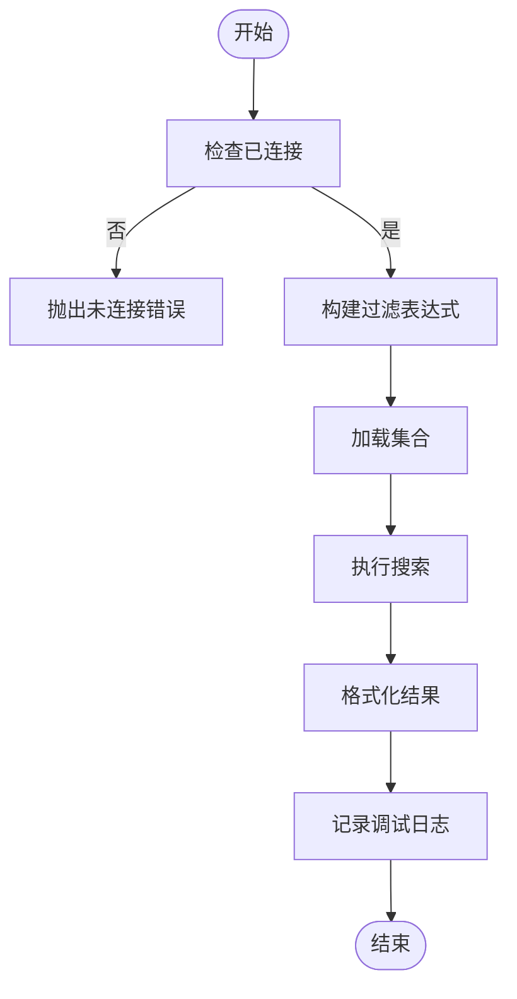
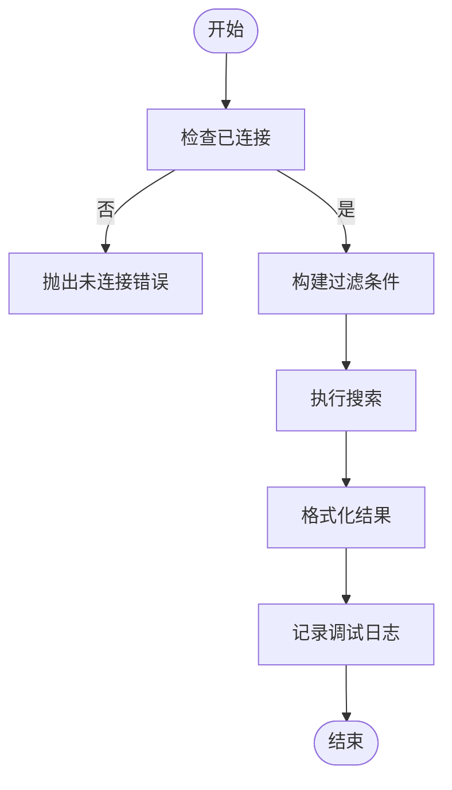
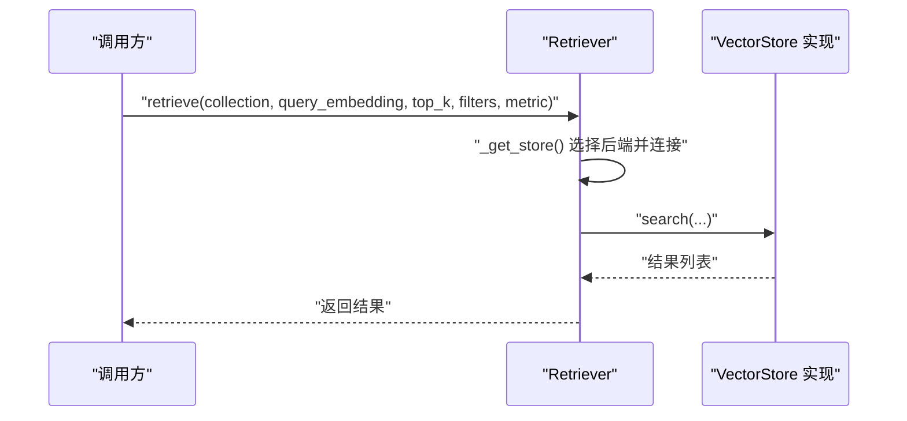
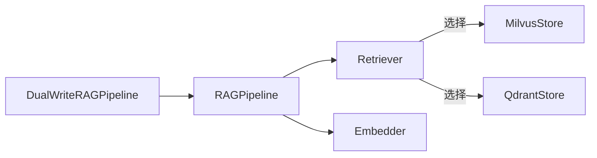

# 向量存储扩展

<cite>
**本文引用的文件**
- [python/src/resolveagent/rag/index/base.py](file://python/src/resolveagent/rag/index/base.py)
- [python/src/resolveagent/rag/index/milvus.py](file://python/src/resolveagent/rag/index/milvus.py)
- [python/src/resolveagent/rag/index/qdrant.py](file://python/src/resolveagent/rag/index/qdrant.py)
- [python/src/resolveagent/rag/retrieve/retriever.py](file://python/src/resolveagent/rag/retrieve/retriever.py)
- [python/src/resolveagent/rag/ingest/embedder.py](file://python/src/resolveagent/rag/ingest/embedder.py)
- [python/src/resolveagent/rag/pipeline.py](file://python/src/resolveagent/rag/pipeline.py)
- [python/src/resolveagent/rag/dual_writer.py](file://python/src/resolveagent/rag/dual_writer.py)
- [docs/zh/configuration.md](file://docs/zh/configuration.md)
- [configs/resolveagent.yaml](file://configs/resolveagent.yaml)
- [scripts/migration/007_indexes.up.sql](file://scripts/migration/007_indexes.up.sql)
- [scripts/migration/007_indexes.down.sql](file://scripts/migration/007_indexes.down.sql)
</cite>

## 目录
1. [简介](#简介)
2. [项目结构](#项目结构)
3. [核心组件](#核心组件)
4. [架构总览](#架构总览)
5. [详细组件分析](#详细组件分析)
6. [依赖分析](#依赖分析)
7. [性能考量](#性能考量)
8. [故障排查指南](#故障排查指南)
9. [结论](#结论)
10. [附录](#附录)

## 简介
本指南面向 ResolveAgent 项目的向量存储扩展，系统讲解向量索引架构、接口抽象与存储后端集成方式，并提供开发自定义向量存储提供器的完整实践路径。文档以 Milvus 与 Qdrant 的现有实现为范例，剖析其接口契约、数据模型、索引策略与检索流程；同时给出从“索引创建、向量嵌入、相似度搜索到批量写入”的端到端示例，覆盖配置、性能调优、扩展性、数据迁移与监控告警等工程化主题。

## 项目结构
ResolveAgent 的向量检索子系统由三层组成：
- 接口层：统一的 VectorStore 抽象，定义集合管理、插入、查询、删除、统计等能力。
- 存储实现层：MilvusStore 与 QdrantStore 分别对接 Milvus 与 Qdrant，实现具体协议交互。
- 应用编排层：Retriever 负责检索编排，Embedder 负责文本嵌入，RAGPipeline 将分块、嵌入、索引、检索串联为完整流水线。

图表来源
- [python/src/resolveagent/rag/index/base.py:9-144](file://python/src/resolveagent/rag/index/base.py#L9-L144)
- [python/src/resolveagent/rag/index/milvus.py:13-383](file://python/src/resolveagent/rag/index/milvus.py#L13-L383)
- [python/src/resolveagent/rag/index/qdrant.py:13-395](file://python/src/resolveagent/rag/index/qdrant.py#L13-L395)
- [python/src/resolveagent/rag/retrieve/retriever.py:14-180](file://python/src/resolveagent/rag/retrieve/retriever.py#L14-L180)
- [python/src/resolveagent/rag/ingest/embedder.py:14-169](file://python/src/resolveagent/rag/ingest/embedder.py#L14-L169)
- [python/src/resolveagent/rag/pipeline.py:18-258](file://python/src/resolveagent/rag/pipeline.py#L18-L258)
- [python/src/resolveagent/rag/dual_writer.py:22-162](file://python/src/resolveagent/rag/dual_writer.py#L22-L162)

章节来源
- [python/src/resolveagent/rag/index/base.py:9-144](file://python/src/resolveagent/rag/index/base.py#L9-L144)
- [python/src/resolveagent/rag/index/milvus.py:13-383](file://python/src/resolveagent/rag/index/milvus.py#L13-L383)
- [python/src/resolveagent/rag/index/qdrant.py:13-395](file://python/src/resolveagent/rag/index/qdrant.py#L13-L395)
- [python/src/resolveagent/rag/retrieve/retriever.py:14-180](file://python/src/resolveagent/rag/retrieve/retriever.py#L14-L180)
- [python/src/resolveagent/rag/ingest/embedder.py:14-169](file://python/src/resolveagent/rag/ingest/embedder.py#L14-L169)
- [python/src/resolveagent/rag/pipeline.py:18-258](file://python/src/resolveagent/rag/pipeline.py#L18-L258)
- [python/src/resolveagent/rag/dual_writer.py:22-162](file://python/src/resolveagent/rag/dual_writer.py#L22-L162)

## 核心组件
- VectorStore 抽象：定义连接、断开、集合管理、批量插入、相似度搜索、按条件删除、统计查询等方法，确保不同后端的一致使用体验。
- MilvusStore：基于 pymilvus 客户端，支持集合模式定义、索引参数配置、按 ID/过滤表达式删除、集合统计等。
- QdrantStore：基于 qdrant-client，支持向量维度与距离映射、批量 upsert、payload 过滤、统计查询等。
- Retriever：根据配置选择 Milvus 或 Qdrant，负责检索入口、日志记录与异常包装。
- Embedder：封装 DashScope 兼容 API，支持批量嵌入、错误处理与降级回退。
- RAGPipeline：串联分块、嵌入、索引与检索，支持与平台侧文档元数据持久化协同。
- 双写管道：在不影响主写入的前提下，将同一份数据写入两个集合，平滑过渡与兼容存量查询。

章节来源
- [python/src/resolveagent/rag/index/base.py:9-144](file://python/src/resolveagent/rag/index/base.py#L9-L144)
- [python/src/resolveagent/rag/index/milvus.py:13-383](file://python/src/resolveagent/rag/index/milvus.py#L13-L383)
- [python/src/resolveagent/rag/index/qdrant.py:13-395](file://python/src/resolveagent/rag/index/qdrant.py#L13-L395)
- [python/src/resolveagent/rag/retrieve/retriever.py:14-180](file://python/src/resolveagent/rag/retrieve/retriever.py#L14-L180)
- [python/src/resolveagent/rag/ingest/embedder.py:14-169](file://python/src/resolveagent/rag/ingest/embedder.py#L14-L169)
- [python/src/resolveagent/rag/pipeline.py:18-258](file://python/src/resolveagent/rag/pipeline.py#L18-L258)
- [python/src/resolveagent/rag/dual_writer.py:22-162](file://python/src/resolveagent/rag/dual_writer.py#L22-L162)

## 架构总览
下图展示从查询到返回的端到端流程，涵盖嵌入生成、向量检索与重排序：

图表来源
- [python/src/resolveagent/rag/pipeline.py:195-257](file://python/src/resolveagent/rag/pipeline.py#L195-L257)
- [python/src/resolveagent/rag/ingest/embedder.py:119-129](file://python/src/resolveagent/rag/ingest/embedder.py#L119-L129)
- [python/src/resolveagent/rag/retrieve/retriever.py:53-113](file://python/src/resolveagent/rag/retrieve/retriever.py#L53-L113)
- [python/src/resolveagent/rag/index/base.py:92-112](file://python/src/resolveagent/rag/index/base.py#L92-L112)

## 详细组件分析

### 接口抽象：VectorStore
- 设计要点
  - 统一生命周期管理：connect/disconnect
  - 集合管理：create_collection/delete_collection/list_collections
  - 数据写入：insert(vectors, texts, metadata, ids)
  - 查询检索：search(collection, query_vector, top_k, filters, metric_type)
  - 删除与统计：delete/collection_stats
- 复杂度与性能
  - 插入与查询复杂度取决于后端索引类型与参数；建议在高并发场景下结合批量写入与连接池。
  - 按 ID 删除通常比按过滤表达式删除更高效。

图表来源
- [python/src/resolveagent/rag/index/base.py:9-144](file://python/src/resolveagent/rag/index/base.py#L9-L144)
- [python/src/resolveagent/rag/index/milvus.py:13-383](file://python/src/resolveagent/rag/index/milvus.py#L13-L383)
- [python/src/resolveagent/rag/index/qdrant.py:13-395](file://python/src/resolveagent/rag/index/qdrant.py#L13-L395)

章节来源
- [python/src/resolveagent/rag/index/base.py:9-144](file://python/src/resolveagent/rag/index/base.py#L9-L144)

### Milvus 实现：MilvusStore
- 连接与认证：支持用户名/密码与数据库名配置，连接失败时抛出异常并记录日志。
- 集合与索引：自动创建带主键、向量字段与 JSON 元数据字段的 schema，并为向量字段创建索引（默认 IVF_FLAT）。
- 批量写入：对齐 vectors 与 texts 长度，生成 UUID 作为默认 ID，支持传入自定义 ID。
- 检索：构建过滤表达式，加载集合后执行搜索，格式化返回结果。
- 删除：支持按 ID 删除；按过滤表达式删除为占位（可扩展）。
- 统计：返回行数统计。

图表来源
- [python/src/resolveagent/rag/index/milvus.py:248-315](file://python/src/resolveagent/rag/index/milvus.py#L248-L315)

章节来源
- [python/src/resolveagent/rag/index/milvus.py:51-383](file://python/src/resolveagent/rag/index/milvus.py#L51-L383)

### Qdrant 实现：QdrantStore
- 连接与认证：支持 HTTP/gRPC、HTTPS、API Key；连接成功后测试可用性。
- 集合与距离映射：将 COSINE/L2/IP 映射为 Qdrant 的 Distance 常量；批量 upsert 写入。
- 过滤：使用 FieldCondition 构建 Filter；支持按 ID 列表与过滤条件删除。
- 检索：构建 Filter 并执行搜索，返回包含 id/text/metadata/score 的结果。
- 统计：返回点数量与向量统计信息。

图表来源
- [python/src/resolveagent/rag/index/qdrant.py:251-319](file://python/src/resolveagent/rag/index/qdrant.py#L251-L319)

章节来源
- [python/src/resolveagent/rag/index/qdrant.py:51-395](file://python/src/resolveagent/rag/index/qdrant.py#L51-L395)

### 检索器：Retriever
- 功能：根据 vector_backend 选择 Milvus 或 Qdrant；封装检索入口，支持按文本生成查询向量后检索。
- 日志：记录检索集合、后端类型、返回条数等关键指标。
- 异常：捕获底层错误并包装为运行时错误，便于上层处理。

图表来源
- [python/src/resolveagent/rag/retrieve/retriever.py:39-113](file://python/src/resolveagent/rag/retrieve/retriever.py#L39-L113)

章节来源
- [python/src/resolveagent/rag/retrieve/retriever.py:14-180](file://python/src/resolveagent/rag/retrieve/retriever.py#L14-L180)

### 嵌入器：Embedder
- 支持模型：内置多模型维度映射；默认通过 DashScope 兼容 API 生成嵌入。
- 批量处理：支持分批请求，避免单次请求过大。
- 错误处理：HTTP 错误与通用异常均记录日志并抛出运行时错误；无 API Key 时返回零向量以保证流程可继续。

章节来源
- [python/src/resolveagent/rag/ingest/embedder.py:14-169](file://python/src/resolveagent/rag/ingest/embedder.py#L14-L169)

### RAG 流水线：RAGPipeline
- 端到端流程：分块 → 嵌入 → 索引 → 检索 → 重排序。
- 文档元数据：可选地与平台侧 rag_document_client 协作，注册文档元数据与状态。
- 索引步骤：动态推断维度，创建集合并写入向量与文本、元数据。

章节来源
- [python/src/resolveagent/rag/pipeline.py:18-258](file://python/src/resolveagent/rag/pipeline.py#L18-L258)

### 双写管道：DualWriteRAGPipeline
- 目标：在不影响主写入的前提下，将相同内容写入两个集合（如 code-analysis 与 kudig-rag），实现存量查询的平滑过渡。
- 行为：主写必须成功；次写为尽力而为，失败仅记录警告。

章节来源
- [python/src/resolveagent/rag/dual_writer.py:22-162](file://python/src/resolveagent/rag/dual_writer.py#L22-L162)

## 依赖分析
- 组件耦合
  - Retriever 与 VectorStore 抽象解耦，通过工厂函数按配置选择 Milvus 或 Qdrant。
  - RAGPipeline 与 Embedder/Retriever 解耦，便于替换嵌入模型或检索后端。
  - 双写管道对 RAGPipeline 进行组合，不改变其内部逻辑。
- 外部依赖
  - MilvusStore 依赖 pymilvus；QdrantStore 依赖 qdrant-client。
  - 嵌入器依赖 HTTP 客户端与 DashScope 兼容服务。

图表来源
- [python/src/resolveagent/rag/retrieve/retriever.py:39-51](file://python/src/resolveagent/rag/retrieve/retriever.py#L39-L51)
- [python/src/resolveagent/rag/pipeline.py:30-42](file://python/src/resolveagent/rag/pipeline.py#L30-L42)
- [python/src/resolveagent/rag/dual_writer.py:35-44](file://python/src/resolveagent/rag/dual_writer.py#L35-L44)

章节来源
- [python/src/resolveagent/rag/retrieve/retriever.py:39-51](file://python/src/resolveagent/rag/retrieve/retriever.py#L39-L51)
- [python/src/resolveagent/rag/pipeline.py:30-42](file://python/src/resolveagent/rag/pipeline.py#L30-L42)
- [python/src/resolveagent/rag/dual_writer.py:35-44](file://python/src/resolveagent/rag/dual_writer.py#L35-L44)

## 性能考量
- 索引与距离度量
  - Milvus 默认使用 IVF_FLAT；可通过索引参数调整 nlist/nprobe 以平衡召回与延迟。
  - Qdrant 将 metric_type 映射为 Distance；合理选择 COSINE/EUCLID/DOT 以匹配嵌入归一化策略。
- 批量写入
  - QdrantStore 对 upsert 使用批处理；建议根据后端吞吐设置合适的批次大小。
  - MilvusStore 在插入前校验 vectors 与 texts 长度，避免无效写入。
- 连接与资源
  - Retriever 与各 Store 提供 connect/disconnect 生命周期管理，建议在进程内复用连接并及时释放。
- 查询参数
  - Retriever 检索时可传入 filters 与 metric_type；Milvus/Qdrant 的过滤与距离计算会影响性能。
- 平台侧索引
  - 数据库层面已有若干业务表索引，有助于平台侧文档元数据查询与关联。

章节来源
- [python/src/resolveagent/rag/index/milvus.py:128-140](file://python/src/resolveagent/rag/index/milvus.py#L128-L140)
- [python/src/resolveagent/rag/index/qdrant.py:109-139](file://python/src/resolveagent/rag/index/qdrant.py#L109-L139)
- [python/src/resolveagent/rag/retrieve/retriever.py:53-113](file://python/src/resolveagent/rag/retrieve/retriever.py#L53-L113)
- [scripts/migration/007_indexes.up.sql:9-49](file://scripts/migration/007_indexes.up.sql#L9-L49)

## 故障排查指南
- 连接失败
  - 检查主机、端口、认证信息是否正确；查看日志中“连接失败”与“导入依赖失败”的提示。
- 查询异常
  - 确认集合存在且已加载；检查 filters 表达式是否合法；核对 metric_type 是否与索引一致。
- 写入异常
  - 校验 vectors 与 texts 长度一致性；确认 ID 生成策略与去重需求。
- 嵌入失败
  - 检查 API Key 与网络连通性；关注 HTTP 状态码与响应体；必要时启用降级返回零向量。
- 统计与可观测性
  - 使用 Retriever.get_collection_stats 获取集合行数；结合日志记录关键事件与耗时。

章节来源
- [python/src/resolveagent/rag/index/milvus.py:51-72](file://python/src/resolveagent/rag/index/milvus.py#L51-L72)
- [python/src/resolveagent/rag/index/qdrant.py:51-78](file://python/src/resolveagent/rag/index/qdrant.py#L51-L78)
- [python/src/resolveagent/rag/retrieve/retriever.py:145-155](file://python/src/resolveagent/rag/retrieve/retriever.py#L145-L155)
- [python/src/resolveagent/rag/ingest/embedder.py:109-117](file://python/src/resolveagent/rag/ingest/embedder.py#L109-L117)

## 结论
ResolveAgent 的向量存储扩展以 VectorStore 抽象为核心，通过 Milvus 与 Qdrant 的实现展示了统一接口下的差异化索引与检索策略。配合嵌入器、检索器与流水线，可快速搭建从“文档入库到语义检索再到重排序”的完整链路。工程实践中应重视索引参数、批量写入、连接管理与日志监控，以获得稳定与高性能的检索体验。

## 附录

### 向量存储配置参考
- Milvus 配置项：主机、端口、用户、密码、索引类型、度量类型、nlist/nprobe、HNSW 参数、连接池大小等。
- Qdrant 配置项：主机、端口、gRPC 端口、优先使用 gRPC、API Key、HNSW 参数、优化器配置等。

章节来源
- [docs/zh/configuration.md:471-534](file://docs/zh/configuration.md#L471-L534)

### 平台配置与存储
- 平台服务地址、数据库、Redis、NATS、网关与遥测等配置位于平台配置文件中。
- 存储后端可按注册表粒度覆盖，默认内存存储，亦可切换至 PostgreSQL。

章节来源
- [configs/resolveagent.yaml:1-90](file://configs/resolveagent.yaml#L1-L90)

### 数据迁移与索引
- 数据库层面已为多类业务表建立索引，提升平台侧查询性能。
- 迁移脚本提供索引创建与回滚，便于在升级过程中保障查询效率。

章节来源
- [scripts/migration/007_indexes.up.sql:9-49](file://scripts/migration/007_indexes.up.sql#L9-L49)
- [scripts/migration/007_indexes.down.sql:7-47](file://scripts/migration/007_indexes.down.sql#L7-L47)