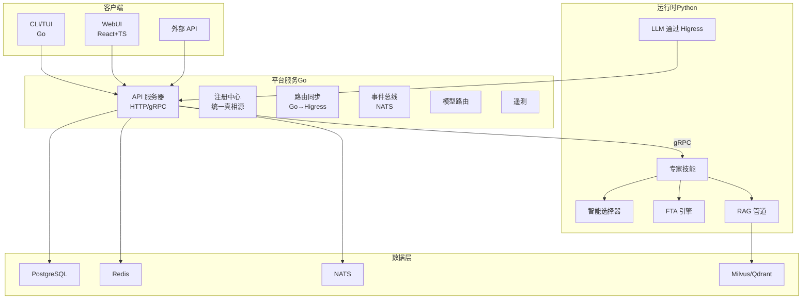
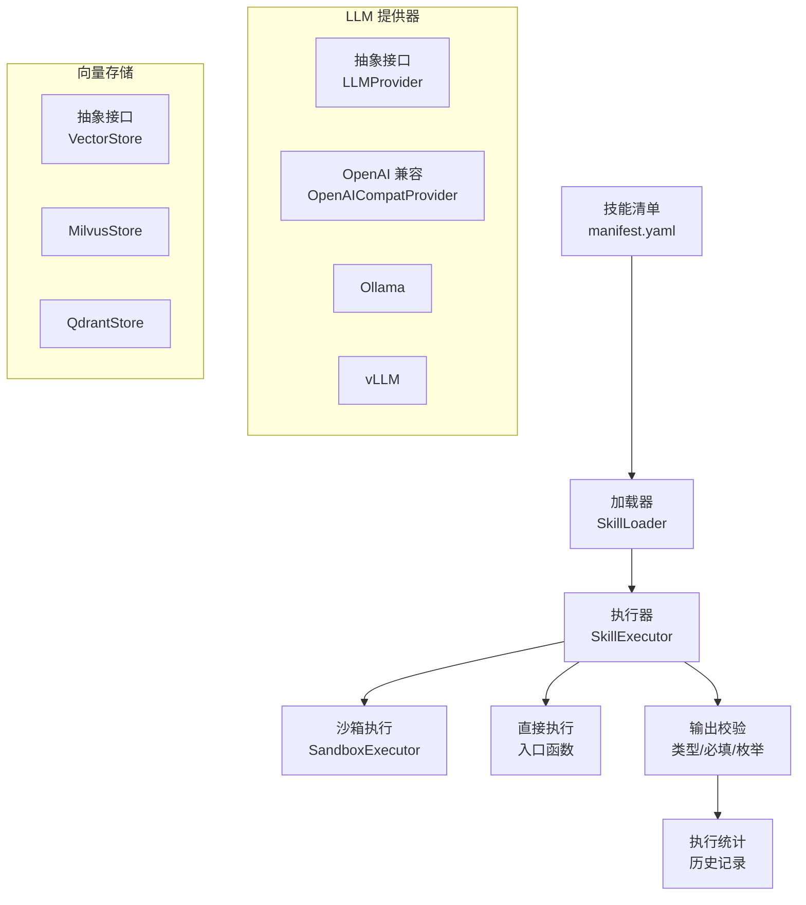
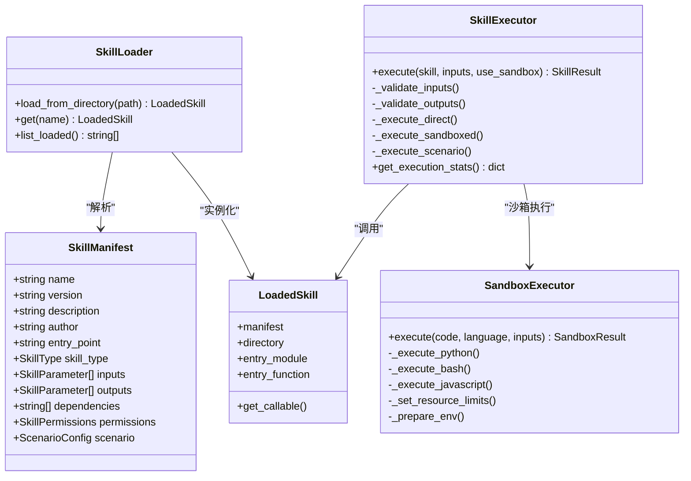
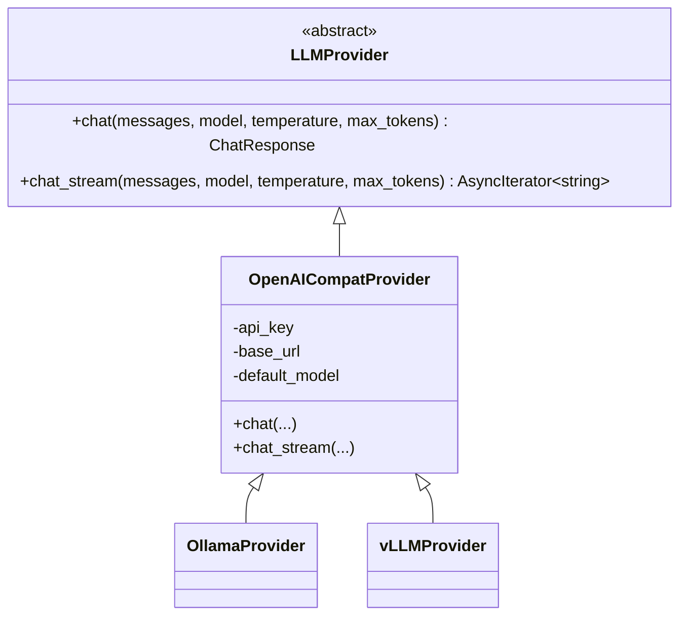
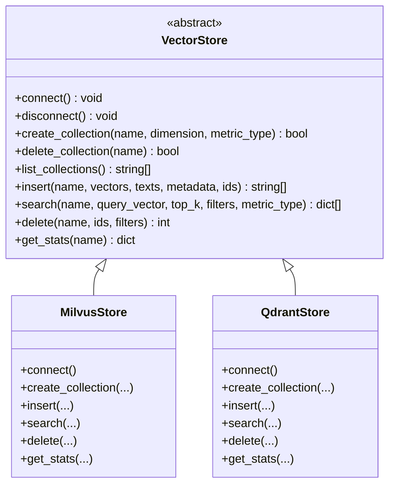
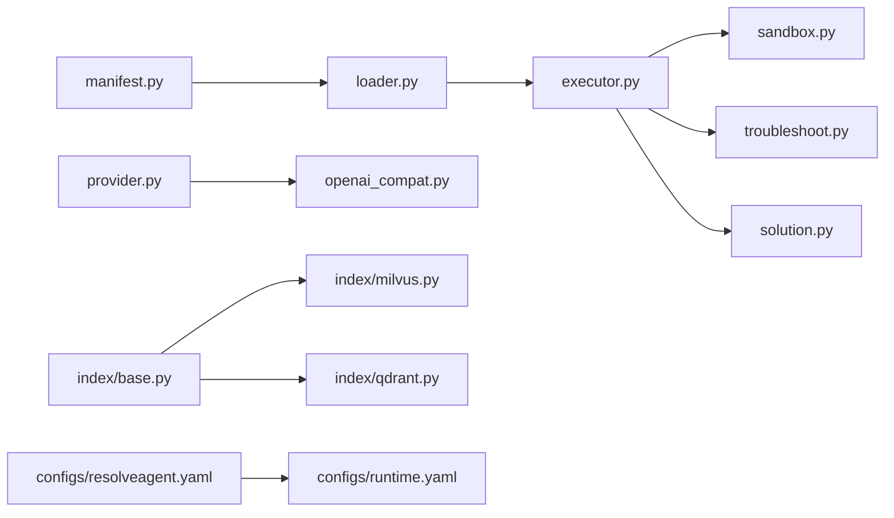

# 扩展开发

<cite>
**本文引用的文件**
- [README.md](file://README.md)
- [configs/resolveagent.yaml](file://configs/resolveagent.yaml)
- [configs/runtime.yaml](file://configs/runtime.yaml)
- [python/src/resolveagent/skills/__init__.py](file://python/src/resolveagent/skills/__init__.py)
- [python/src/resolveagent/skills/manifest.py](file://python/src/resolveagent/skills/manifest.py)
- [python/src/resolveagent/skills/loader.py](file://python/src/resolveagent/skills/loader.py)
- [python/src/resolveagent/skills/executor.py](file://python/src/resolveagent/skills/executor.py)
- [python/src/resolveagent/skills/sandbox.py](file://python/src/resolveagent/skills/sandbox.py)
- [python/src/resolveagent/llm/provider.py](file://python/src/resolveagent/llm/provider.py)
- [python/src/resolveagent/llm/openai_compat.py](file://python/src/resolveagent/llm/openai_compat.py)
- [python/src/resolveagent/rag/index/base.py](file://python/src/resolveagent/rag/index/base.py)
- [python/src/resolveagent/rag/index/milvus.py](file://python/src/resolveagent/rag/index/milvus.py)
- [python/src/resolveagent/rag/index/qdrant.py](file://python/src/resolveagent/rag/index/qdrant.py)
- [skills/examples/hello-world/manifest.yaml](file://skills/examples/hello-world/manifest.yaml)
- [skills/examples/hello-world/skill.py](file://skills/examples/hello-world/skill.py)
- [skills/examples/consulting-qa/manifest.yaml](file://skills/examples/consulting-qa/manifest.yaml)
- [skills/examples/consulting-qa/skill.py](file://skills/examples/consulting-qa/skill.py)
- [skills/examples/k8s-pod-crash/manifest.yaml](file://skills/examples/k8s-pod-crash/manifest.yaml)
- [skills/examples/k8s-pod-crash/skill.py](file://skills/examples/k8s-pod-crash/skill.py)
- [skills/examples/ticket-handler/manifest.yaml](file://skills/examples/ticket-handler/manifest.yaml)
- [deploy/docker-compose/docker-compose.yaml](file://deploy/docker-compose/docker-compose.yaml)
- [deploy/docker-compose/docker-compose.deps.yaml](file://deploy/docker-compose/docker-compose.deps.yaml)
- [deploy/docker/platform.Dockerfile](file://deploy/docker/platform.Dockerfile)
- [deploy/docker/runtime.Dockerfile](file://deploy/docker/runtime.Dockerfile)
- [deploy/helm/resolveagent/values.yaml](file://deploy/helm/resolveagent/values.yaml)
- [deploy/helm/resolveagent/templates/platform-deployment.yaml](file://deploy/helm/resolveagent/templates/platform-deployment.yaml)
- [deploy/helm/resolveagent/templates/runtime-deployment.yaml](file://deploy/helm/resolveagent/templates/runtime-deployment.yaml)
- [docs/zh/skill-system.md](file://docs/zh/skill-system.md)
- [docs/zh/configuration.md](file://docs/zh/configuration.md)
- [docs/zh/deployment.md](file://docs/zh/deployment.md)
- [docs/zh/local-deployment.md](file://docs/zh/local-deployment.md)
- [docs/zh/quickstart.md](file://docs/zh/quickstart.md)
- [docs/zh/skill-development.md](file://docs/zh/skill-development.md)
- [docs/zh/testing.md](file://docs/zh/testing.md)
- [docs/zh/troubleshooting.md](file://docs/zh/troubleshooting.md)
</cite>

## 目录
1. [简介](#简介)
2. [项目结构](#项目结构)
3. [核心组件](#核心组件)
4. [架构总览](#架构总览)
5. [详细组件分析](#详细组件分析)
6. [依赖关系分析](#依赖关系分析)
7. [性能考量](#性能考量)
8. [故障排查指南](#故障排查指南)
9. [结论](#结论)
10. [附录](#附录)

## 简介
本指南面向 ResolveAgent 的扩展开发者，围绕技能系统、自定义提供器、插件开发与 API 扩展进行深入讲解。内容覆盖技能清单机制、沙箱执行环境、多来源支持与技能生命周期管理，并提供完整的技能开发示例、测试方法与部署流程。同时给出自定义 LLM 提供器集成、向量存储后端扩展与第三方服务集成的最佳实践。

## 项目结构
ResolveAgent 采用“平台服务（Go）+ Agent 运行时（Python）”的双层架构，配合 Higress 网关与可观测性栈，形成可扩展的 AIOps 智能体平台。技能系统位于运行时层，提供声明式清单、沙箱执行与多来源加载；LLM 提供器抽象统一多种模型供应商；RAG 管道支持 Milvus/Qdrant 等向量后端。

图表来源
- [README.md:442-510](file://README.md#L442-L510)

章节来源
- [README.md:438-531](file://README.md#L438-L531)

## 核心组件
- 技能系统（Python）：声明式清单、加载器、执行器、沙箱执行、场景化执行与结果校验。
- LLM 提供器（Python）：统一接口与 OpenAI 兼容适配，支持本地与远程模型。
- RAG 管道（Python）：向量存储抽象与 Milvus/Qdrant 实现。
- 平台配置（Go）：HTTP/GRPC 地址、网关集成、遥测、存储后端等。
- 运行时配置（Python）：选择器策略、内存、遥测、存储客户端等。

章节来源
- [python/src/resolveagent/skills/manifest.py:96-132](file://python/src/resolveagent/skills/manifest.py#L96-L132)
- [python/src/resolveagent/skills/loader.py:15-90](file://python/src/resolveagent/skills/loader.py#L15-L90)
- [python/src/resolveagent/skills/executor.py:18-476](file://python/src/resolveagent/skills/executor.py#L18-L476)
- [python/src/resolveagent/skills/sandbox.py:62-455](file://python/src/resolveagent/skills/sandbox.py#L62-L455)
- [python/src/resolveagent/llm/provider.py:27-77](file://python/src/resolveagent/llm/provider.py#L27-L77)
- [python/src/resolveagent/llm/openai_compat.py:25-267](file://python/src/resolveagent/llm/openai_compat.py#L25-L267)
- [python/src/resolveagent/rag/index/base.py:9-144](file://python/src/resolveagent/rag/index/base.py#L9-L144)
- [python/src/resolveagent/rag/index/milvus.py:13-383](file://python/src/resolveagent/rag/index/milvus.py#L13-L383)
- [python/src/resolveagent/rag/index/qdrant.py:13-395](file://python/src/resolveagent/rag/index/qdrant.py#L13-L395)
- [configs/resolveagent.yaml:5-90](file://configs/resolveagent.yaml#L5-L90)
- [configs/runtime.yaml:3-35](file://configs/runtime.yaml#L3-L35)

## 架构总览
ResolveAgent 的扩展开发围绕以下关键点展开：
- 技能清单驱动：通过 manifest.yaml 声明输入/输出、权限、场景化流程与依赖。
- 沙箱执行：默认对不受信任代码启用资源限制、时间限制与最小环境变量集。
- 多来源加载：本地目录、Git、OCI 注册表与市场。
- LLM 提供器：统一抽象 + OpenAI 兼容适配，便于接入国产与开源模型。
- 向量存储：抽象接口 + Milvus/Qdrant 实现，便于替换与扩展。

图表来源
- [python/src/resolveagent/skills/manifest.py:96-132](file://python/src/resolveagent/skills/manifest.py#L96-L132)
- [python/src/resolveagent/skills/loader.py:15-90](file://python/src/resolveagent/skills/loader.py#L15-L90)
- [python/src/resolveagent/skills/executor.py:18-476](file://python/src/resolveagent/skills/executor.py#L18-L476)
- [python/src/resolveagent/skills/sandbox.py:62-455](file://python/src/resolveagent/skills/sandbox.py#L62-L455)
- [python/src/resolveagent/llm/provider.py:27-77](file://python/src/resolveagent/llm/provider.py#L27-L77)
- [python/src/resolveagent/llm/openai_compat.py:25-267](file://python/src/resolveagent/llm/openai_compat.py#L25-L267)
- [python/src/resolveagent/rag/index/base.py:9-144](file://python/src/resolveagent/rag/index/base.py#L9-L144)
- [python/src/resolveagent/rag/index/milvus.py:13-383](file://python/src/resolveagent/rag/index/milvus.py#L13-L383)
- [python/src/resolveagent/rag/index/qdrant.py:13-395](file://python/src/resolveagent/rag/index/qdrant.py#L13-L395)

## 详细组件分析

### 技能系统：清单、加载、执行与沙箱
- 清单模型：支持通用技能与场景化技能，声明输入输出参数、权限、场景步骤与输出模板。
- 加载器：从本地目录加载，解析 manifest.yaml，定位入口模块与函数。
- 执行器：输入/输出校验、场景化路由、沙箱/直连执行、执行记录与统计。
- 沙箱执行：进程隔离、CPU/内存/文件/句柄限制、可选网络隔离、最小环境变量集。

图表来源
- [python/src/resolveagent/skills/manifest.py:96-132](file://python/src/resolveagent/skills/manifest.py#L96-L132)
- [python/src/resolveagent/skills/loader.py:15-90](file://python/src/resolveagent/skills/loader.py#L15-L90)
- [python/src/resolveagent/skills/executor.py:18-476](file://python/src/resolveagent/skills/executor.py#L18-L476)
- [python/src/resolveagent/skills/sandbox.py:62-455](file://python/src/resolveagent/skills/sandbox.py#L62-L455)

章节来源
- [python/src/resolveagent/skills/manifest.py:17-132](file://python/src/resolveagent/skills/manifest.py#L17-L132)
- [python/src/resolveagent/skills/loader.py:15-90](file://python/src/resolveagent/skills/loader.py#L15-L90)
- [python/src/resolveagent/skills/executor.py:18-476](file://python/src/resolveagent/skills/executor.py#L18-L476)
- [python/src/resolveagent/skills/sandbox.py:62-455](file://python/src/resolveagent/skills/sandbox.py#L62-L455)

### LLM 提供器：抽象与自定义集成
- 抽象接口：统一 chat 与 chat_stream，便于扩展不同供应商。
- OpenAI 兼容：支持 OpenAI、vLLM、Ollama、LM Studio、LocalAI 等。
- 自定义扩展：实现 LLMProvider 接口并注入运行时路由。

图表来源
- [python/src/resolveagent/llm/provider.py:27-77](file://python/src/resolveagent/llm/provider.py#L27-L77)
- [python/src/resolveagent/llm/openai_compat.py:25-267](file://python/src/resolveagent/llm/openai_compat.py#L25-L267)

章节来源
- [python/src/resolveagent/llm/provider.py:11-77](file://python/src/resolveagent/llm/provider.py#L11-L77)
- [python/src/resolveagent/llm/openai_compat.py:25-267](file://python/src/resolveagent/llm/openai_compat.py#L25-L267)

### 向量存储后端：抽象与扩展
- 抽象接口：定义连接、集合管理、插入、检索、删除与统计。
- Milvus 实现：支持 schema 定义、索引、近似最近邻搜索与统计。
- Qdrant 实现：支持集合创建、payload 过滤、批量 upsert、统计查询。

图表来源
- [python/src/resolveagent/rag/index/base.py:9-144](file://python/src/resolveagent/rag/index/base.py#L9-L144)
- [python/src/resolveagent/rag/index/milvus.py:13-383](file://python/src/resolveagent/rag/index/milvus.py#L13-L383)
- [python/src/resolveagent/rag/index/qdrant.py:13-395](file://python/src/resolveagent/rag/index/qdrant.py#L13-L395)

章节来源
- [python/src/resolveagent/rag/index/base.py:9-144](file://python/src/resolveagent/rag/index/base.py#L9-L144)
- [python/src/resolveagent/rag/index/milvus.py:13-383](file://python/src/resolveagent/rag/index/milvus.py#L13-L383)
- [python/src/resolveagent/rag/index/qdrant.py:13-395](file://python/src/resolveagent/rag/index/qdrant.py#L13-L395)

### 技能开发示例与测试
- 示例技能：hello-world、consulting-qa、k8s-pod-crash、ticket-handler。
- 清单与入口：每个技能包含 manifest.yaml 与对应入口文件。
- 测试建议：单元测试覆盖输入/输出校验、沙箱执行边界条件、场景化流程与错误处理。

章节来源
- [skills/examples/hello-world/manifest.yaml](file://skills/examples/hello-world/manifest.yaml)
- [skills/examples/hello-world/skill.py](file://skills/examples/hello-world/skill.py)
- [skills/examples/consulting-qa/manifest.yaml](file://skills/examples/consulting-qa/manifest.yaml)
- [skills/examples/consulting-qa/skill.py](file://skills/examples/consulting-qa/skill.py)
- [skills/examples/k8s-pod-crash/manifest.yaml](file://skills/examples/k8s-pod-crash/manifest.yaml)
- [skills/examples/k8s-pod-crash/skill.py](file://skills/examples/k8s-pod-crash/skill.py)
- [skills/examples/ticket-handler/manifest.yaml](file://skills/examples/ticket-handler/manifest.yaml)

### 部署与运行时配置
- Docker Compose：一键启动依赖（PostgreSQL、Redis、NATS、Milvus）与服务。
- Helm Charts：生产级部署模板与 values 配置。
- 运行时配置：选择器策略、内存、遥测、存储客户端等。

章节来源
- [deploy/docker-compose/docker-compose.yaml](file://deploy/docker-compose/docker-compose.yaml)
- [deploy/docker-compose/docker-compose.deps.yaml](file://deploy/docker-compose/docker-compose.deps.yaml)
- [deploy/helm/resolveagent/values.yaml](file://deploy/helm/resolveagent/values.yaml)
- [deploy/helm/resolveagent/templates/platform-deployment.yaml](file://deploy/helm/resolveagent/templates/platform-deployment.yaml)
- [deploy/helm/resolveagent/templates/runtime-deployment.yaml](file://deploy/helm/resolveagent/templates/runtime-deployment.yaml)
- [configs/runtime.yaml:3-35](file://configs/runtime.yaml#L3-L35)

## 依赖关系分析
- 技能系统依赖清单解析、加载器与执行器；执行器依赖沙箱执行器与场景化引擎。
- LLM 提供器依赖统一接口，OpenAI 兼容适配具体供应商差异。
- RAG 管道依赖向量存储抽象，Milvus/Qdrant 实现具体后端。
- 平台服务与运行时通过 gRPC 通信，配置文件控制地址与行为。

图表来源
- [python/src/resolveagent/skills/manifest.py:96-132](file://python/src/resolveagent/skills/manifest.py#L96-L132)
- [python/src/resolveagent/skills/loader.py:15-90](file://python/src/resolveagent/skills/loader.py#L15-L90)
- [python/src/resolveagent/skills/executor.py:18-476](file://python/src/resolveagent/skills/executor.py#L18-L476)
- [python/src/resolveagent/skills/sandbox.py:62-455](file://python/src/resolveagent/skills/sandbox.py#L62-L455)
- [python/src/resolveagent/llm/provider.py:27-77](file://python/src/resolveagent/llm/provider.py#L27-L77)
- [python/src/resolveagent/llm/openai_compat.py:25-267](file://python/src/resolveagent/llm/openai_compat.py#L25-L267)
- [python/src/resolveagent/rag/index/base.py:9-144](file://python/src/resolveagent/rag/index/base.py#L9-L144)
- [python/src/resolveagent/rag/index/milvus.py:13-383](file://python/src/resolveagent/rag/index/milvus.py#L13-L383)
- [python/src/resolveagent/rag/index/qdrant.py:13-395](file://python/src/resolveagent/rag/index/qdrant.py#L13-L395)
- [configs/resolveagent.yaml:5-90](file://configs/resolveagent.yaml#L5-L90)
- [configs/runtime.yaml:3-35](file://configs/runtime.yaml#L3-L35)

## 性能考量
- 平台服务（Go）：合理设置 HTTP/GRPC 超时、消息大小与数据库连接池。
- Agent 运行时（Python）：并发任务数、任务超时、LLM 重试与批处理大小、RAG Top-K。
- LLM 提供器：按需启用流式响应、合理温度与最大 token 数。
- 向量存储：选择合适索引与距离度量、批量写入与分页读取。

章节来源
- [configs/resolveagent.yaml:668-709](file://configs/resolveagent.yaml#L668-L709)
- [configs/runtime.yaml:691-709](file://configs/runtime.yaml#L691-L709)

## 故障排查指南
- 环境变量与密钥：确保数据库、Redis、NATS、向量库与 LLM 密钥正确配置。
- 网关与路由：确认 Higress 网关已启用并同步路由规则。
- 日志与遥测：开启 OpenTelemetry 与结构化日志，结合 Grafana 监控关键指标。
- 常见问题：容器依赖未就绪、模型路由失败、RAG 索引异常、沙箱执行超时。

章节来源
- [README.md:598-757](file://README.md#L598-L757)
- [docs/zh/troubleshooting.md](file://docs/zh/troubleshooting.md)

## 结论
ResolveAgent 的扩展开发以“清单驱动 + 沙箱执行 + 多来源加载 + 抽象接口”为核心，既保证安全性与可移植性，又提供灵活的生态扩展能力。通过遵循本文档的开发、测试与部署流程，开发者可以高效地构建高质量的技能、LLM 提供器与向量存储后端，并将其无缝集成到平台中。

## 附录

### 技能开发最佳实践
- 清单设计：明确输入输出类型、必填字段与枚举值；必要时声明依赖与权限。
- 场景化技能：使用场景配置描述诊断流程，确保步骤顺序与条件表达清晰。
- 执行安全：优先使用沙箱执行，严格限制资源与网络访问；必要时使用直接执行。
- 输出规范：统一输出结构，便于上层编排与展示；必要时生成结构化方案。

章节来源
- [python/src/resolveagent/skills/manifest.py:96-132](file://python/src/resolveagent/skills/manifest.py#L96-L132)
- [python/src/resolveagent/skills/executor.py:18-476](file://python/src/resolveagent/skills/executor.py#L18-L476)
- [docs/zh/skill-development.md](file://docs/zh/skill-development.md)

### 自定义 LLM 提供器集成步骤
- 实现 LLMProvider 接口：提供同步与异步聊天完成与流式输出。
- 配置默认模型与认证：从环境变量读取密钥与基础 URL。
- 注入路由：在运行时或平台侧配置模型路由，确保请求被转发至新提供器。
- 测试与压测：覆盖正常/异常路径、流式输出与超时处理。

章节来源
- [python/src/resolveagent/llm/provider.py:27-77](file://python/src/resolveagent/llm/provider.py#L27-L77)
- [python/src/resolveagent/llm/openai_compat.py:25-267](file://python/src/resolveagent/llm/openai_compat.py#L25-L267)

### 向量存储后端扩展步骤
- 实现 VectorStore 抽象：完成连接、集合管理、插入、检索、删除与统计。
- 参数映射：将距离度量与索引参数映射到具体后端。
- 批量与过滤：支持批量写入与 payload 过滤，优化检索性能。
- 集成测试：覆盖创建/删除集合、插入/检索/删除数据与统计查询。

章节来源
- [python/src/resolveagent/rag/index/base.py:9-144](file://python/src/resolveagent/rag/index/base.py#L9-L144)
- [python/src/resolveagent/rag/index/milvus.py:13-383](file://python/src/resolveagent/rag/index/milvus.py#L13-L383)
- [python/src/resolveagent/rag/index/qdrant.py:13-395](file://python/src/resolveagent/rag/index/qdrant.py#L13-L395)

### 第三方服务集成最佳实践
- 通过技能封装：将第三方 API 封装为技能，统一输入输出与权限声明。
- 网关代理：利用 Higress 网关进行鉴权、限流与路由，避免直接暴露密钥。
- 可观测性：记录调用链、指标与日志，便于问题定位与性能优化。
- 容错与重试：实现指数退避与熔断策略，提升系统韧性。

章节来源
- [README.md:522-531](file://README.md#L522-L531)
- [configs/resolveagent.yaml:27-63](file://configs/resolveagent.yaml#L27-L63)

### 部署与运维
- 本地开发：使用 Docker Compose 启动依赖与服务，快速验证。
- 生产部署：使用 Helm Charts，配置副本数、资源限制与自动伸缩。
- 配置管理：通过环境变量与 Secret 管理密钥与连接信息。
- 监控告警：启用 OpenTelemetry、Prometheus 与 Grafana，建立完善的可观测体系。

章节来源
- [README.md:536-757](file://README.md#L536-L757)
- [deploy/docker-compose/docker-compose.yaml](file://deploy/docker-compose/docker-compose.yaml)
- [deploy/helm/resolveagent/values.yaml](file://deploy/helm/resolveagent/values.yaml)
- [docs/zh/deployment.md](file://docs/zh/deployment.md)
- [docs/zh/local-deployment.md](file://docs/zh/local-deployment.md)