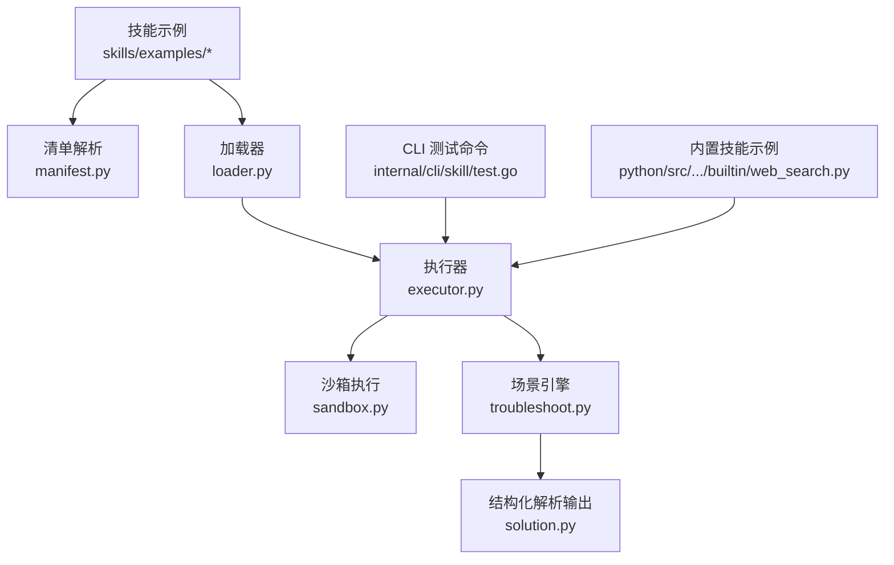
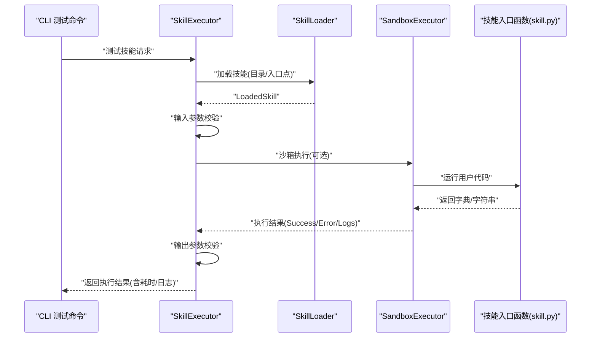
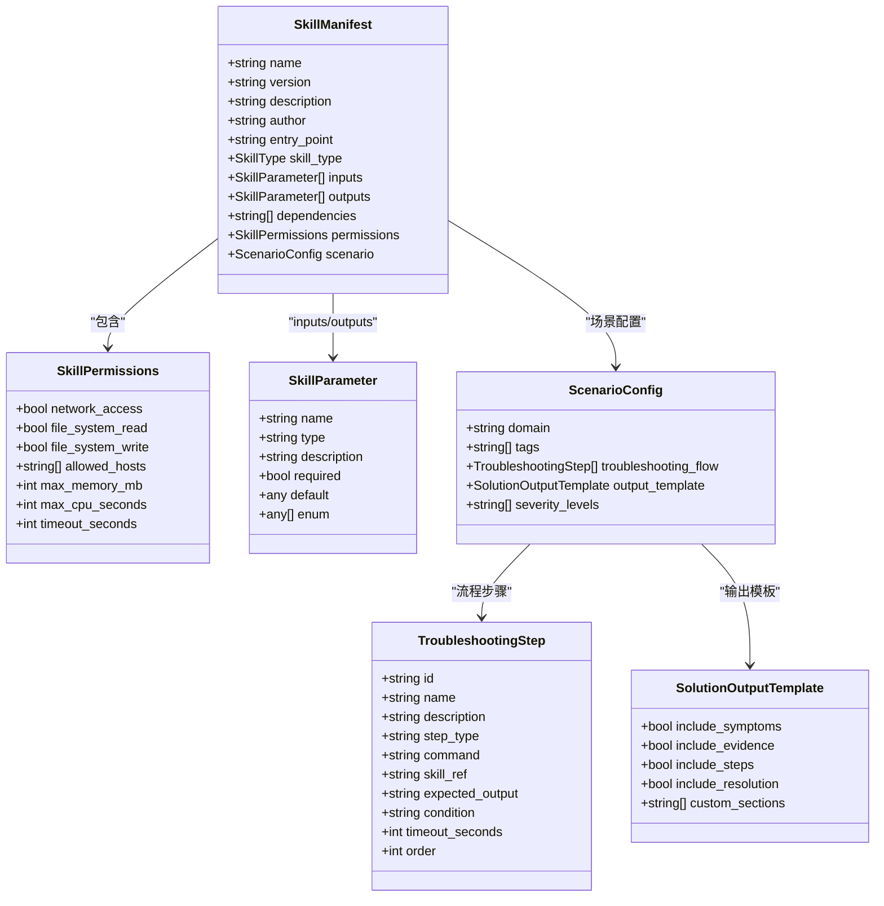
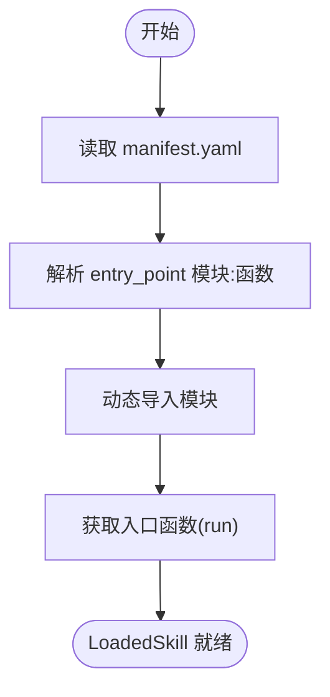
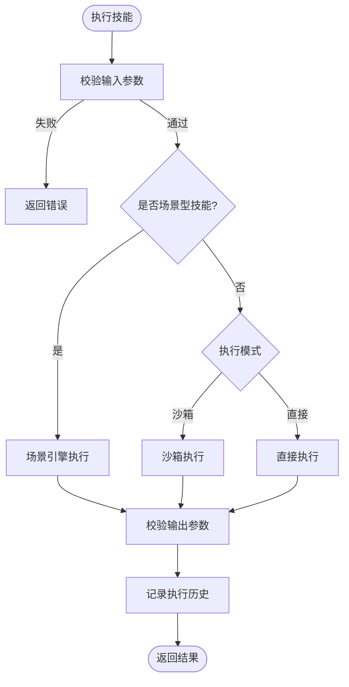
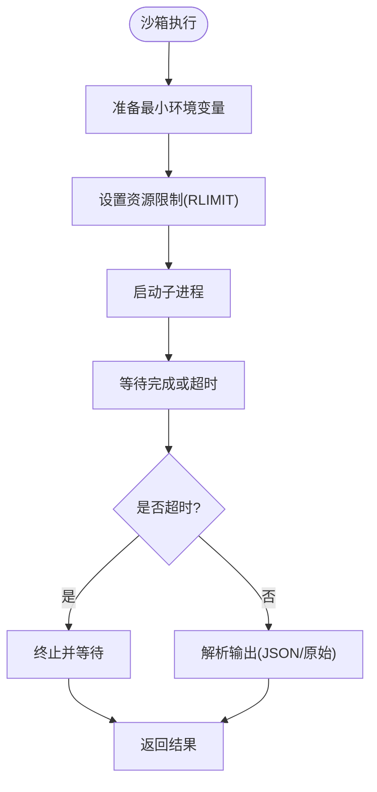
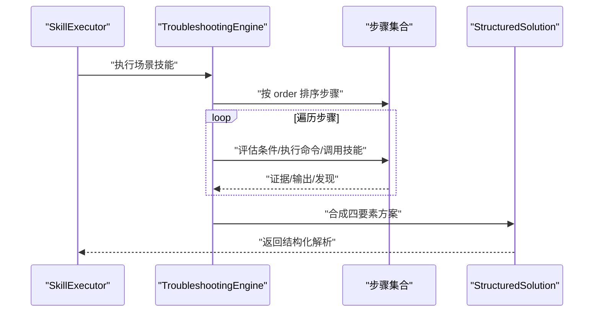
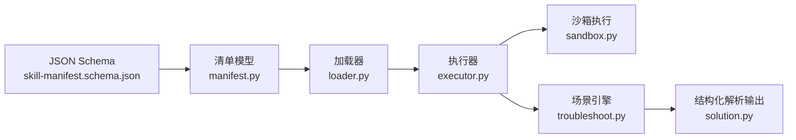

# 技能开发

<cite>
**本文引用的文件**
- [hello-world/manifest.yaml](file://skills/examples/hello-world/manifest.yaml)
- [hello-world/skill.py](file://skills/examples/hello-world/skill.py)
- [consulting-qa/manifest.yaml](file://skills/examples/consulting-qa/manifest.yaml)
- [consulting-qa/skill.py](file://skills/examples/consulting-qa/skill.py)
- [k8s-pod-crash/manifest.yaml](file://skills/examples/k8s-pod-crash/manifest.yaml)
- [skill-system.md](file://docs/zh/skill-system.md)
- [manifest.py](file://python/src/resolveagent/skills/manifest.py)
- [loader.py](file://python/src/resolveagent/skills/loader.py)
- [executor.py](file://python/src/resolveagent/skills/executor.py)
- [sandbox.py](file://python/src/resolveagent/skills/sandbox.py)
- [solution.py](file://python/src/resolveagent/skills/solution.py)
- [troubleshoot.py](file://python/src/resolveagent/skills/troubleshoot.py)
- [skill-example.yaml](file://configs/examples/skill-example.yaml)
- [skill-manifest.schema.json](file://api/jsonschema/skill-manifest.schema.json)
- [test.go](file://internal/cli/skill/test.go)
- [web_search.py](file://python/src/resolveagent/skills/builtin/web_search.py)
</cite>

## 目录
1. [简介](#简介)
2. [项目结构](#项目结构)
3. [核心组件](#核心组件)
4. [架构总览](#架构总览)
5. [详细组件分析](#详细组件分析)
6. [依赖分析](#依赖分析)
7. [性能考虑](#性能考虑)
8. [故障排查指南](#故障排查指南)
9. [结论](#结论)
10. [附录](#附录)

## 简介
本指南面向 ResolveAgent 技能开发者，系统讲解技能清单（Manifest）机制、技能文件结构、权限控制与沙箱执行环境，并提供从入门到进阶的完整开发流程与最佳实践。读者将学会如何编写 manifest.yaml、实现 Python 技能、定义输入输出参数、进行测试与调试、理解生命周期与版本控制，并掌握部署与运维要点。

## 项目结构
ResolveAgent 将“技能”作为可插拔扩展单元，围绕清单（manifest）、入口函数（skill.py）、权限与沙箱执行形成闭环。技能示例位于 skills/examples 下，核心运行时位于 python/src/resolveagent/skills 目录，CLI 提供测试与管理能力，文档提供中文开发指南。

图表来源
- [loader.py:15-90](file://python/src/resolveagent/skills/loader.py#L15-L90)
- [executor.py:18-476](file://python/src/resolveagent/skills/executor.py#L18-L476)
- [sandbox.py:62-455](file://python/src/resolveagent/skills/sandbox.py#L62-L455)
- [troubleshoot.py:47-200](file://python/src/resolveagent/skills/troubleshoot.py#L47-L200)
- [solution.py:31-131](file://python/src/resolveagent/skills/solution.py#L31-L131)
- [test.go:13-80](file://internal/cli/skill/test.go#L13-L80)
- [web_search.py:32-382](file://python/src/resolveagent/skills/builtin/web_search.py#L32-L382)

章节来源
- [skill-system.md:30-158](file://docs/zh/skill-system.md#L30-L158)

## 核心组件
- 清单模型与校验：负责解析 manifest.yaml 并进行类型与必填项校验，支持通用技能与场景型技能两类。
- 加载器：从本地目录加载技能，解析入口点，导入模块并暴露可调用对象。
- 执行器：统一执行入口，支持直接执行与沙箱执行；对输入/输出进行严格校验；记录执行统计。
- 沙箱执行：提供进程隔离、资源限制（CPU/内存/文件大小/打开文件数）、超时控制与最小环境变量。
- 场景引擎：针对场景型技能（scenario），按步骤顺序执行，收集证据，生成四要素结构化解析方案。
- 结构化解析输出：标准化输出格式，支持渲染为 Markdown。

章节来源
- [manifest.py:96-132](file://python/src/resolveagent/skills/manifest.py#L96-L132)
- [loader.py:15-90](file://python/src/resolveagent/skills/loader.py#L15-L90)
- [executor.py:18-476](file://python/src/resolveagent/skills/executor.py#L18-L476)
- [sandbox.py:62-455](file://python/src/resolveagent/skills/sandbox.py#L62-L455)
- [troubleshoot.py:47-200](file://python/src/resolveagent/skills/troubleshoot.py#L47-L200)
- [solution.py:31-131](file://python/src/resolveagent/skills/solution.py#L31-L131)

## 架构总览
下面的序列图展示了从 CLI 到技能执行的完整链路，包括输入校验、沙箱执行与输出校验。

图表来源
- [test.go:13-80](file://internal/cli/skill/test.go#L13-L80)
- [executor.py:50-146](file://python/src/resolveagent/skills/executor.py#L50-L146)
- [loader.py:27-57](file://python/src/resolveagent/skills/loader.py#L27-L57)
- [sandbox.py:82-198](file://python/src/resolveagent/skills/sandbox.py#L82-L198)

## 详细组件分析

### 组件一：清单（Manifest）与权限模型
- 清单字段：name/version/description/author/entry_point/inputs/outputs/dependencies/permissions/skill_type/scenario。
- 参数类型：string/number/boolean/object/array，支持 required/default/enum。
- 权限字段：network_access/file_system_read/file_system_write/allowed_hosts/max_memory_mb/max_cpu_seconds/timeout_seconds。
- 场景型技能：新增 scenario 域、标签、排障流程、输出模板与严重级别。

图表来源
- [manifest.py:29-132](file://python/src/resolveagent/skills/manifest.py#L29-L132)

章节来源
- [manifest.py:96-132](file://python/src/resolveagent/skills/manifest.py#L96-L132)
- [skill-manifest.schema.json:1-128](file://api/jsonschema/skill-manifest.schema.json#L1-L128)

### 组件二：技能加载与入口点解析
- 从本地目录加载技能，读取 manifest.yaml，解析 entry_point（模块:函数）。
- 动态导入模块并获取函数句柄，供后续执行器调用。
- 支持默认函数名 run，若未显式提供。

图表来源
- [loader.py:27-57](file://python/src/resolveagent/skills/loader.py#L27-L57)

章节来源
- [loader.py:15-90](file://python/src/resolveagent/skills/loader.py#L15-L90)

### 组件三：执行器与输入/输出校验
- 输入校验：检查必填参数、类型匹配、枚举约束；记录未知参数警告。
- 输出校验：对输出进行类型一致性检查。
- 执行模式：支持直接执行与沙箱执行；可按技能清单覆盖执行模式。
- 场景型技能：转交场景引擎，生成结构化解析方案。

图表来源
- [executor.py:50-146](file://python/src/resolveagent/skills/executor.py#L50-L146)
- [executor.py:147-244](file://python/src/resolveagent/skills/executor.py#L147-L244)

章节来源
- [executor.py:18-476](file://python/src/resolveagent/skills/executor.py#L18-L476)

### 组件四：沙箱执行与资源限制
- 语言支持：Python/Bash/JavaScript。
- 资源限制：CPU 时间、内存、栈、文件大小、打开文件数、禁用 core dump。
- 环境隔离：最小 PATH/HOME/LANG；可选额外环境变量。
- 超时控制：统一超时阈值；超时后终止子进程。
- 临时文件清理：执行结束后删除临时代码文件。

图表来源
- [sandbox.py:82-198](file://python/src/resolveagent/skills/sandbox.py#L82-L198)
- [sandbox.py:336-388](file://python/src/resolveagent/skills/sandbox.py#L336-L388)

章节来源
- [sandbox.py:62-455](file://python/src/resolveagent/skills/sandbox.py#L62-L455)

### 组件五：场景型技能与结构化解析
- 场景引擎按步骤顺序执行，支持条件分支、命令执行、技能引用与证据收集。
- 生成结构化解析方案：症状、关键信息、排查步骤、解决方案、摘要、置信度、严重程度等。
- 支持将结构化解析方案渲染为 Markdown。

图表来源
- [troubleshoot.py:64-139](file://python/src/resolveagent/skills/troubleshoot.py#L64-L139)
- [solution.py:31-131](file://python/src/resolveagent/skills/solution.py#L31-L131)

章节来源
- [troubleshoot.py:47-200](file://python/src/resolveagent/skills/troubleshoot.py#L47-L200)
- [solution.py:31-131](file://python/src/resolveagent/skills/solution.py#L31-L131)

### 组件六：内置技能示例（网络搜索）
- 提供多种搜索引擎适配（Bing/Google/Searx/DuckDuckGo），支持异步搜索与结果格式化。
- 通过 manifest.yaml 明确输入输出与权限，entry_point 指向内置模块函数。
- 适合学习如何实现网络类技能与权限配置。

章节来源
- [web_search.py:32-382](file://python/src/resolveagent/skills/builtin/web_search.py#L32-L382)
- [skill-example.yaml:1-23](file://configs/examples/skill-example.yaml#L1-L23)

## 依赖分析
- 清单解析依赖 Pydantic 进行数据模型校验；JSON Schema 提供外部校验能力。
- 加载器依赖 Python 动态导入机制，按 entry_point 定位模块与函数。
- 执行器依赖沙箱执行器与场景引擎；对输入/输出进行严格校验。
- 沙箱执行器依赖操作系统资源限制与子进程管理；对超时与异常进行兜底。
- 场景引擎依赖结构化解析模型，生成标准化输出。

图表来源
- [manifest.py:96-132](file://python/src/resolveagent/skills/manifest.py#L96-L132)
- [loader.py:15-90](file://python/src/resolveagent/skills/loader.py#L15-L90)
- [executor.py:18-476](file://python/src/resolveagent/skills/executor.py#L18-L476)
- [sandbox.py:62-455](file://python/src/resolveagent/skills/sandbox.py#L62-L455)
- [troubleshoot.py:47-200](file://python/src/resolveagent/skills/troubleshoot.py#L47-L200)
- [solution.py:31-131](file://python/src/resolveagent/skills/solution.py#L31-L131)
- [skill-manifest.schema.json:1-128](file://api/jsonschema/skill-manifest.schema.json#L1-L128)

## 性能考虑
- 输入/输出校验：在执行前进行，避免无效执行；建议在清单中尽量使用 enum 限定取值范围，减少运行期分支。
- 沙箱超时与资源限制：合理设置 timeout_seconds、max_memory_mb、max_cpu_seconds，防止资源滥用。
- 直接执行 vs 沙箱执行：内部函数可直接执行以降低开销；对外部不可信代码必须启用沙箱。
- 场景型技能：将复杂流程拆分为多个步骤，便于并行与缓存中间证据；必要时使用技能引用复用已有能力。
- 日志与统计：利用执行器的历史记录统计成功率与平均耗时，持续优化。

## 故障排查指南
- 清单校验失败：检查 name/version/entry_point 是否符合规范；确认 inputs/outputs 类型与必填项。
- 权限不足：network_access/file_system_* 权限未开启导致执行失败；在清单中按需声明 allowed_hosts。
- 沙箱超时：缩短任务或提升 timeout_seconds；检查是否存在阻塞 IO 或死循环。
- 输出非 JSON：沙箱执行器期望 stdout 为 JSON 字符串；若返回其他格式，将被当作原始字符串处理。
- 场景型技能未按预期：检查 scenario.troubleshooting_flow 的 order 与 condition，确保条件表达式正确。

章节来源
- [executor.py:147-244](file://python/src/resolveagent/skills/executor.py#L147-L244)
- [sandbox.py:167-198](file://python/src/resolveagent/skills/sandbox.py#L167-L198)
- [troubleshoot.py:110-139](file://python/src/resolveagent/skills/troubleshoot.py#L110-L139)

## 结论
ResolveAgent 的技能系统以清单为中心，结合严格的输入/输出校验、可选的沙箱执行与场景引擎，提供了安全、可组合且可扩展的能力平台。开发者应遵循最小权限原则、明确输入输出、合理设计执行模式，并通过 CLI 与测试工具持续验证与优化。

## 附录

### 技能开发流程（从零到一）
- 创建骨架：使用 CLI 初始化技能目录，生成 manifest.yaml 与 skill.py。
- 编写清单：定义 name/version/entry_point/inputs/outputs/permissions。
- 实现入口：在 skill.py 中实现 run 函数，返回字典或结构化解析方案。
- 本地测试：使用 CLI 的 test 子命令传入输入参数，查看输出与耗时。
- 安装与集成：将技能安装到平台，在 Agent 或工作流中使用。

章节来源
- [skill-system.md:319-421](file://docs/zh/skill-system.md#L319-L421)
- [test.go:13-80](file://internal/cli/skill/test.go#L13-L80)

### 清单字段与类型参考
- 基本字段：name/version/description/author/entry_point。
- 参数：name/type/required/default/enum/description。
- 权限：network_access/file_system_read/file_system_write/allowed_hosts/max_memory_mb/max_cpu_seconds/timeout_seconds。
- 场景型：skill_type=scenario，包含 scenario 域、标签、流程、输出模板与严重级别。

章节来源
- [manifest.py:29-132](file://python/src/resolveagent/skills/manifest.py#L29-L132)
- [skill-manifest.schema.json:47-125](file://api/jsonschema/skill-manifest.schema.json#L47-L125)

### 示例技能一览
- Hello World：最小示例，演示基本清单与入口函数。
- Consulting QA：基于内置知识库的问答技能，展示网络访问与输出结构。
- K8s Pod Crash：场景型技能，定义排障流程与结构化解析输出。

章节来源
- [hello-world/manifest.yaml:1-21](file://skills/examples/hello-world/manifest.yaml#L1-L21)
- [hello-world/skill.py:1-14](file://skills/examples/hello-world/skill.py#L1-L14)
- [consulting-qa/manifest.yaml:1-36](file://skills/examples/consulting-qa/manifest.yaml#L1-L36)
- [consulting-qa/skill.py:125-168](file://skills/examples/consulting-qa/skill.py#L125-L168)
- [k8s-pod-crash/manifest.yaml:1-114](file://skills/examples/k8s-pod-crash/manifest.yaml#L1-L114)