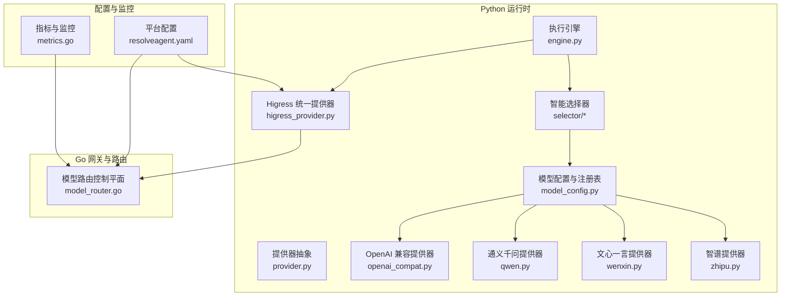
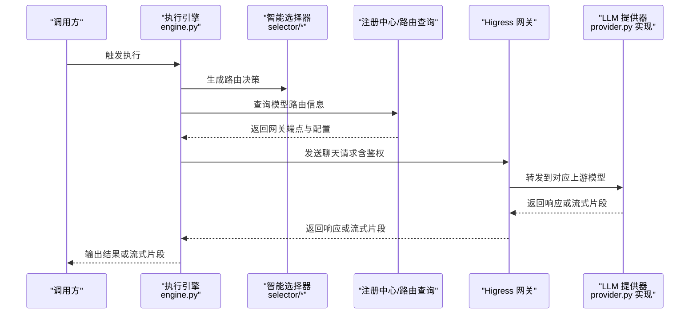
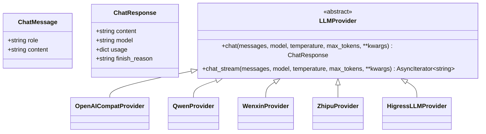
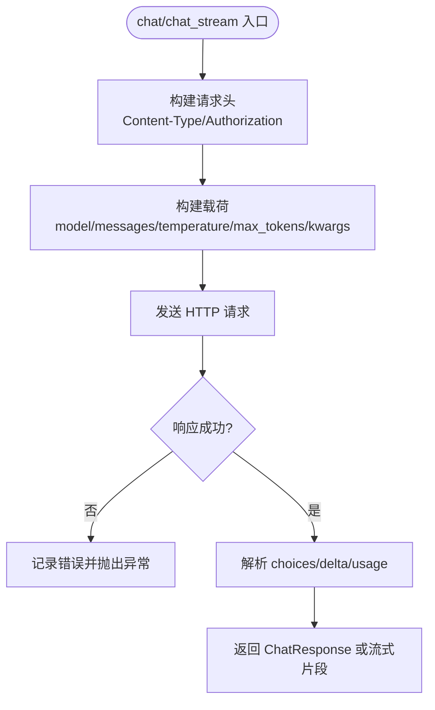
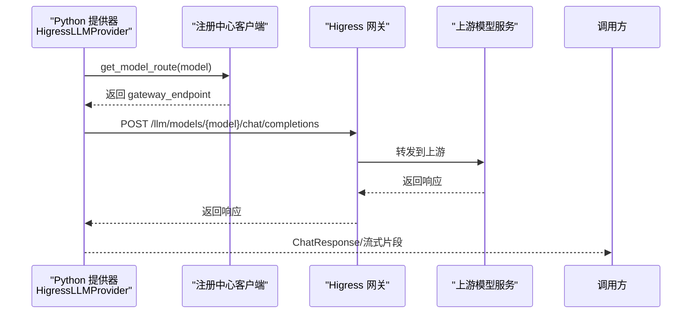
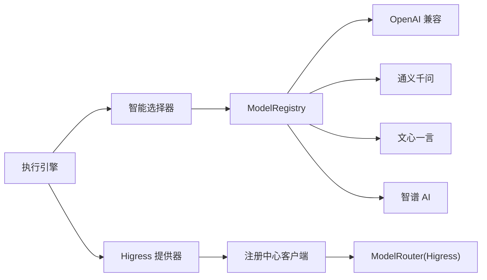

# 提供器扩展

<cite>
**本文引用的文件**
- [provider.py](file://python/src/resolveagent/llm/provider.py)
- [openai_compat.py](file://python/src/resolveagent/llm/openai_compat.py)
- [qwen.py](file://python/src/resolveagent/llm/qwen.py)
- [wenxin.py](file://python/src/resolveagent/llm/wenxin.py)
- [zhipu.py](file://python/src/resolveagent/llm/zhipu.py)
- [higress_provider.py](file://python/src/resolveagent/llm/higress_provider.py)
- [model_config.py](file://python/src/resolveagent/llm/model_config.py)
- [model_router.go](file://pkg/gateway/model_router.go)
- [resolveagent.yaml](file://configs/resolveagent.yaml)
- [engine.py](file://python/src/resolveagent/runtime/engine.py)
- [cache.py](file://python/src/resolveagent/selector/cache.py)
- [metrics.go](file://pkg/telemetry/metrics.go)
</cite>

## 目录
1. [简介](#简介)
2. [项目结构](#项目结构)
3. [核心组件](#核心组件)
4. [架构总览](#架构总览)
5. [详细组件分析](#详细组件分析)
6. [依赖分析](#依赖分析)
7. [性能考虑](#性能考虑)
8. [故障排查指南](#故障排查指南)
9. [结论](#结论)
10. [附录](#附录)

## 简介
本指南面向希望在 ResolveAgent 平台上扩展 LLM 提供器的开发者，系统讲解 LLM 提供器的抽象接口、第三方服务集成模式、认证与请求/响应转换、错误处理、配置管理、路由与网关集成、负载均衡与故障转移策略，并给出性能优化、缓存策略与监控指标的最佳实践路径。

## 项目结构
ResolveAgent 的 LLM 提供器能力由 Python 层的抽象与实现、以及 Go 路由与网关层共同构成：
- Python 层：统一的抽象接口与多种提供器实现（OpenAI 兼容、通义千问、文心一言、智谱 AI），以及通过 Higress 网关进行统一路由与治理。
- Go 层：模型路由控制平面，负责将模型注册到 Higress，实现限流、重试、路径改写与标签化路由。
- 配置层：YAML 配置文件支持启用网关、模型路由、鉴权与负载均衡策略。
- 运行时：执行引擎通过智能选择器与提供器交互，支持流式与非流式输出。

**图表来源**
- [engine.py:1-200](file://python/src/resolveagent/runtime/engine.py#L1-L200)
- [provider.py:1-77](file://python/src/resolveagent/llm/provider.py#L1-L77)
- [openai_compat.py:1-267](file://python/src/resolveagent/llm/openai_compat.py#L1-L267)
- [qwen.py:1-229](file://python/src/resolveagent/llm/qwen.py#L1-L229)
- [wenxin.py:1-240](file://python/src/resolveagent/llm/wenxin.py#L1-L240)
- [zhipu.py:1-254](file://python/src/resolveagent/llm/zhipu.py#L1-L254)
- [higress_provider.py:1-429](file://python/src/resolveagent/llm/higress_provider.py#L1-L429)
- [model_config.py:1-70](file://python/src/resolveagent/llm/model_config.py#L1-L70)
- [model_router.go:1-264](file://pkg/gateway/model_router.go#L1-L264)
- [resolveagent.yaml:1-90](file://configs/resolveagent.yaml#L1-L90)
- [metrics.go:1-292](file://pkg/telemetry/metrics.go#L1-L292)

**章节来源**
- [engine.py:1-200](file://python/src/resolveagent/runtime/engine.py#L1-L200)
- [resolveagent.yaml:1-90](file://configs/resolveagent.yaml#L1-L90)

## 核心组件
- 抽象接口与数据模型
  - ChatMessage：对话消息结构，包含角色与内容。
  - ChatResponse：LLM 响应结构，包含生成内容、模型名、用量统计与结束原因。
  - LLMProvider：抽象基类，定义同步与流式聊天接口，确保所有提供器实现一致的行为契约。
- 提供器实现
  - OpenAI 兼容：支持 OpenAI 及其生态（vLLM、Ollama、LM Studio、LocalAI），自动注入 Authorization 头与参数透传。
  - 通义千问：DashScope OpenAI 兼容端点，支持认证头与 SSE 流式返回。
  - 文心一言：基于访问令牌获取与多模型端点映射，支持 SSE 流式返回。
  - 智谱 AI：基于 JWT 签发认证，支持 OpenAI 兼容端点与 SSE 流式返回。
  - Higress 统一提供器：通过注册中心查询模型路由，集中实现限流、重试、路径改写与统一鉴权，支持 LLM 与 Embedding。
- 模型配置与注册表
  - ModelConfig：描述模型的提供器类型、名称、密钥、基础地址、温度与最大 token 等。
  - ModelRegistry：按模型 ID 注册并按提供器类型实例化具体提供器，便于集中管理与切换。
- 路由与网关
  - ModelRouter：将模型路由同步至 Higress，支持速率限制、失败回退、请求改写与标签化。
- 执行与选择
  - 执行引擎：封装会话上下文、钩子、选择器路由决策与结果流式输出。
- 性能与监控
  - 选择器缓存：TTL-aware LRU 缓存，支持命中率统计。
  - 指标采集：Prometheus + OpenTelemetry，暴露请求数、耗时、活跃请求数、代理执行次数与延迟等。

**章节来源**
- [provider.py:1-77](file://python/src/resolveagent/llm/provider.py#L1-L77)
- [openai_compat.py:1-267](file://python/src/resolveagent/llm/openai_compat.py#L1-L267)
- [qwen.py:1-229](file://python/src/resolveagent/llm/qwen.py#L1-L229)
- [wenxin.py:1-240](file://python/src/resolveagent/llm/wenxin.py#L1-L240)
- [zhipu.py:1-254](file://python/src/resolveagent/llm/zhipu.py#L1-L254)
- [higress_provider.py:1-429](file://python/src/resolveagent/llm/higress_provider.py#L1-L429)
- [model_config.py:1-70](file://python/src/resolveagent/llm/model_config.py#L1-L70)
- [model_router.go:1-264](file://pkg/gateway/model_router.go#L1-L264)
- [engine.py:1-200](file://python/src/resolveagent/runtime/engine.py#L1-L200)
- [cache.py:1-116](file://python/src/resolveagent/selector/cache.py#L1-L116)
- [metrics.go:1-292](file://pkg/telemetry/metrics.go#L1-L292)

## 架构总览
ResolveAgent 将 LLM 请求统一经由 Higress 网关，结合注册中心与路由控制平面，实现：
- 统一入口：Python 提供器通过 HigressLLMProvider 发起请求。
- 路由解析：根据模型 ID 查询注册中心，确定上游端点与改写规则。
- 限流与重试：在 Higress 上配置每模型/租户的速率限制与失败回退策略。
- 认证与可观测性：统一鉴权头与标签，便于追踪与审计。

**图表来源**
- [higress_provider.py:148-288](file://python/src/resolveagent/llm/higress_provider.py#L148-L288)
- [model_router.go:145-263](file://pkg/gateway/model_router.go#L145-L263)
- [engine.py:137-177](file://python/src/resolveagent/runtime/engine.py#L137-L177)

## 详细组件分析

### 抽象接口与数据模型
- ChatMessage：标准化消息结构，用于所有提供器。
- ChatResponse：标准化响应结构，包含用量与结束原因，便于上层统一处理。
- LLMProvider：定义 chat 与 chat_stream 两个异步接口，要求实现者保证幂等与可重复消费的流式语义。

**图表来源**
- [provider.py:11-77](file://python/src/resolveagent/llm/provider.py#L11-L77)
- [openai_compat.py:25-267](file://python/src/resolveagent/llm/openai_compat.py#L25-L267)
- [qwen.py:17-229](file://python/src/resolveagent/llm/qwen.py#L17-L229)
- [wenxin.py:17-240](file://python/src/resolveagent/llm/wenxin.py#L17-L240)
- [zhipu.py:18-254](file://python/src/resolveagent/llm/zhipu.py#L18-L254)
- [higress_provider.py:21-429](file://python/src/resolveagent/llm/higress_provider.py#L21-L429)

**章节来源**
- [provider.py:1-77](file://python/src/resolveagent/llm/provider.py#L1-L77)

### OpenAI 兼容提供器
- 支持 OpenAI 及 vLLM、Ollama、LM Studio、LocalAI 等兼容端点。
- 自动从环境变量读取 API Key 与基础 URL；当存在 API Key 时注入 Authorization 头。
- 同步与流式两种模式，均遵循 OpenAI 的消息与用量字段约定。
- 错误处理：捕获 HTTP 状态码与通用异常，记录详细日志并抛出统一错误。

**图表来源**
- [openai_compat.py:56-138](file://python/src/resolveagent/llm/openai_compat.py#L56-L138)
- [openai_compat.py:139-214](file://python/src/resolveagent/llm/openai_compat.py#L139-L214)

**章节来源**
- [openai_compat.py:1-267](file://python/src/resolveagent/llm/openai_compat.py#L1-L267)

### 通义千问提供器
- 使用 DashScope OpenAI 兼容端点，需要 DASHSCOPE_API_KEY。
- 支持同步与流式，流式采用 SSE 协议，逐行解析 data: 行。
- 错误处理覆盖 HTTP 状态码、超时与 JSON 解析异常。

**章节来源**
- [qwen.py:1-229](file://python/src/resolveagent/llm/qwen.py#L1-L229)

### 文心一言提供器
- 通过 OAuth 获取 access_token，按模型映射不同 RPC 端点。
- 支持同步与流式，流式解析 result 与 is_end 字段。
- 错误处理覆盖令牌获取与 API 返回 error_code 场景。

**章节来源**
- [wenxin.py:1-240](file://python/src/resolveagent/llm/wenxin.py#L1-L240)

### 智谱提供器
- 使用 HS256 JWT 签发认证，payload 包含 api_key、过期时间与时间戳。
- 支持同步与流式，流式解析 choices/delta/content。
- 错误处理覆盖 HTTP 状态码与通用异常。

**章节来源**
- [zhipu.py:1-254](file://python/src/resolveagent/llm/zhipu.py#L1-L254)

### Higress 统一提供器
- 通过注册中心查询模型路由，构造网关端点，支持默认回退路径。
- 统一鉴权头（Authorization），支持流式与非流式两种模式。
- 与 Go 路由控制平面协同，实现集中限流、重试与路径改写。

**图表来源**
- [higress_provider.py:122-147](file://python/src/resolveagent/llm/higress_provider.py#L122-L147)
- [higress_provider.py:148-288](file://python/src/resolveagent/llm/higress_provider.py#L148-L288)
- [model_router.go:205-250](file://pkg/gateway/model_router.go#L205-L250)

**章节来源**
- [higress_provider.py:1-429](file://python/src/resolveagent/llm/higress_provider.py#L1-L429)
- [model_router.go:1-264](file://pkg/gateway/model_router.go#L1-L264)

### 模型配置与注册表
- ModelConfig：集中描述模型的提供器类型、模型名、密钥与基础地址等。
- ModelRegistry：按 provider 类型动态导入并实例化具体提供器，便于运行时切换与扩展。

**章节来源**
- [model_config.py:1-70](file://python/src/resolveagent/llm/model_config.py#L1-L70)

## 依赖分析
- Python 层内部耦合
  - 执行引擎依赖智能选择器与注册中心，选择器通过 ModelRegistry 获取提供器实例。
  - Higress 提供器依赖注册中心客户端以查询模型路由。
- Go 路由控制平面
  - ModelRouter 负责将模型路由同步到 Higress，支持速率限制、重试与路径改写。
- 配置与环境变量
  - YAML 配置文件控制网关开关、同步间隔、默认模型与鉴权策略。
  - 提供器实现广泛使用环境变量作为密钥与基础 URL 的来源。

**图表来源**
- [engine.py:137-177](file://python/src/resolveagent/runtime/engine.py#L137-L177)
- [model_config.py:41-69](file://python/src/resolveagent/llm/model_config.py#L41-L69)
- [higress_provider.py:134-147](file://python/src/resolveagent/llm/higress_provider.py#L134-L147)
- [model_router.go:145-203](file://pkg/gateway/model_router.go#L145-L203)

**章节来源**
- [engine.py:1-200](file://python/src/resolveagent/runtime/engine.py#L1-L200)
- [model_config.py:1-70](file://python/src/resolveagent/llm/model_config.py#L1-L70)
- [higress_provider.py:1-429](file://python/src/resolveagent/llm/higress_provider.py#L1-L429)
- [model_router.go:1-264](file://pkg/gateway/model_router.go#L1-L264)

## 性能考虑
- 缓存策略
  - 选择器路由决策采用 TTL-aware LRU 缓存，键由输入文本、Agent ID 与策略组合并哈希，支持命中率统计与容量控制。
  - 建议：对高重复输入场景开启全局缓存，合理设置 TTL 与容量，定期观察命中率以调整。
- 流式输出
  - OpenAI 兼容、通义千问、文心一言、智谱 AI 均支持流式输出，建议在前端或调用侧以增量方式渲染，降低感知延迟。
- 超时与重试
  - 提供器统一使用 60 秒超时；Higress 层可配置重试策略与每秒请求数限制，避免雪崩效应。
- 指标与观测
  - Prometheus + OpenTelemetry 暴露请求数、耗时、活跃请求数、代理执行次数与延迟等关键指标，建议结合告警策略进行容量规划。

**章节来源**
- [cache.py:1-116](file://python/src/resolveagent/selector/cache.py#L1-L116)
- [openai_compat.py:92-138](file://python/src/resolveagent/llm/openai_compat.py#L92-L138)
- [qwen.py:86-136](file://python/src/resolveagent/llm/qwen.py#L86-L136)
- [wenxin.py:114-157](file://python/src/resolveagent/llm/wenxin.py#L114-L157)
- [zhipu.py:110-156](file://python/src/resolveagent/llm/zhipu.py#L110-L156)
- [metrics.go:131-292](file://pkg/telemetry/metrics.go#L131-L292)

## 故障排查指南
- 常见错误类型
  - HTTP 状态码错误：检查上游服务可用性与鉴权头是否正确注入。
  - API Key/令牌缺失：确认环境变量或配置项已正确设置。
  - 流式解析异常：检查上游是否按 SSE 格式返回，注意过滤空行与注释行。
  - 超时与网络问题：适当提高超时阈值，检查 Higress 重试与健康检查配置。
- 日志与定位
  - 提供器实现均记录调试与错误日志，包含状态码、响应体摘要与关键参数，便于快速定位。
  - Higress 路由控制平面记录路由同步与更新日志，便于核对模型端点与改写规则。
- 建议流程
  - 确认模型 ID 是否已在注册中心配置并同步到 Higress。
  - 检查网关鉴权与默认模型配置，确保请求头与默认模型一致。
  - 对比 OpenAI 兼容格式的消息与参数，确保上游可识别。

**章节来源**
- [openai_compat.py:129-138](file://python/src/resolveagent/llm/openai_compat.py#L129-L138)
- [qwen.py:124-136](file://python/src/resolveagent/llm/qwen.py#L124-L136)
- [wenxin.py:148-157](file://python/src/resolveagent/llm/wenxin.py#L148-L157)
- [zhipu.py:147-156](file://python/src/resolveagent/llm/zhipu.py#L147-L156)
- [model_router.go:145-203](file://pkg/gateway/model_router.go#L145-L203)

## 结论
通过统一的抽象接口与 Higress 网关的集中治理，ResolveAgent 为多提供商、多模型的 LLM 场景提供了可扩展、可观测且具备弹性能力的基础设施。开发者可基于现有提供器实现模式快速接入新的第三方服务，同时借助路由控制平面与监控体系保障生产级稳定性与性能。

## 附录

### 开发自定义 LLM 提供器步骤
- 定义提供器类并继承 LLMProvider，实现 chat 与 chat_stream 两个异步方法。
- 在 ModelRegistry 中新增 provider 类型分支，返回新提供器实例。
- 如需走 Higress 网关，先在 Go 层通过 ModelRouter 注册模型路由，再在 Python 层通过 HigressLLMProvider 调用。
- 配置认证与基础 URL（优先使用环境变量），完善错误处理与日志记录。
- 在 YAML 配置中启用网关与模型路由，设置默认模型与鉴权策略。

**章节来源**
- [provider.py:27-77](file://python/src/resolveagent/llm/provider.py#L27-L77)
- [model_config.py:41-69](file://python/src/resolveagent/llm/model_config.py#L41-L69)
- [higress_provider.py:122-147](file://python/src/resolveagent/llm/higress_provider.py#L122-L147)
- [model_router.go:87-108](file://pkg/gateway/model_router.go#L87-L108)