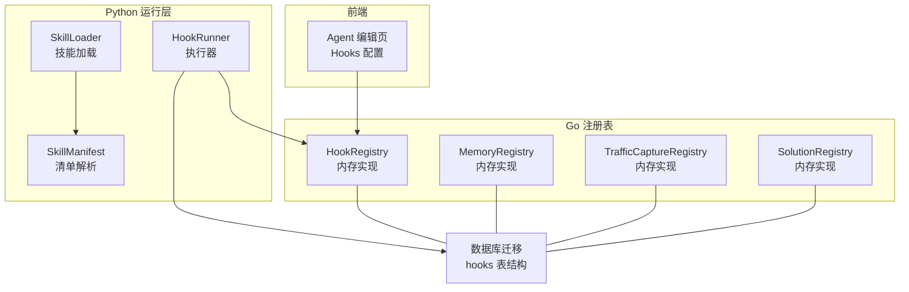
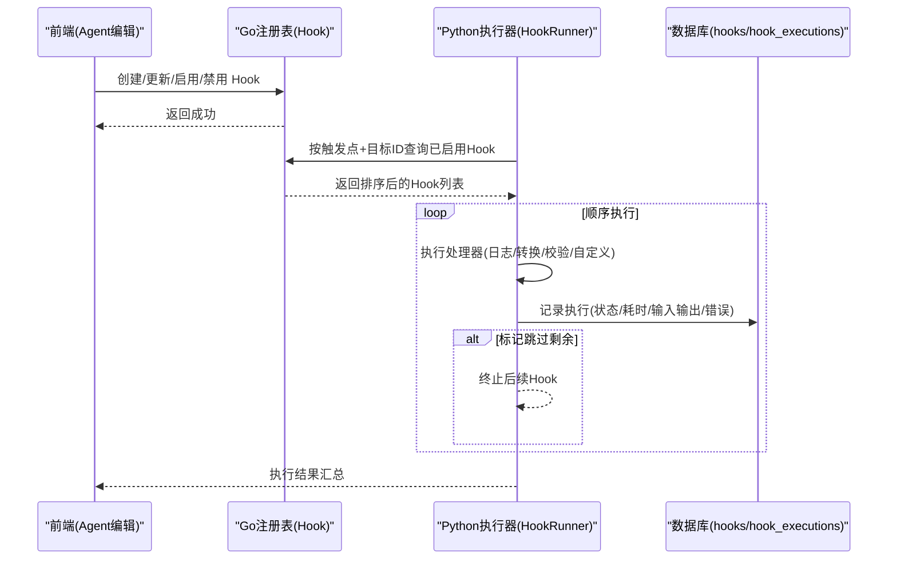
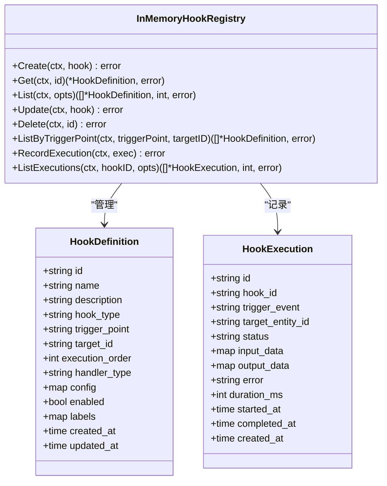
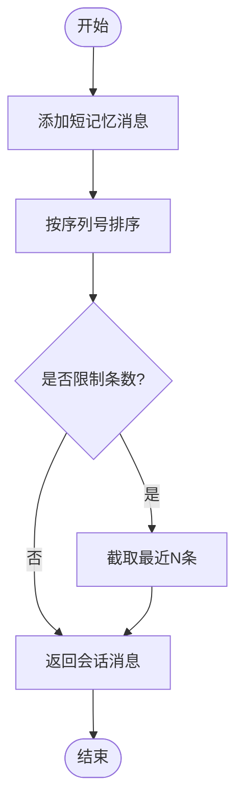
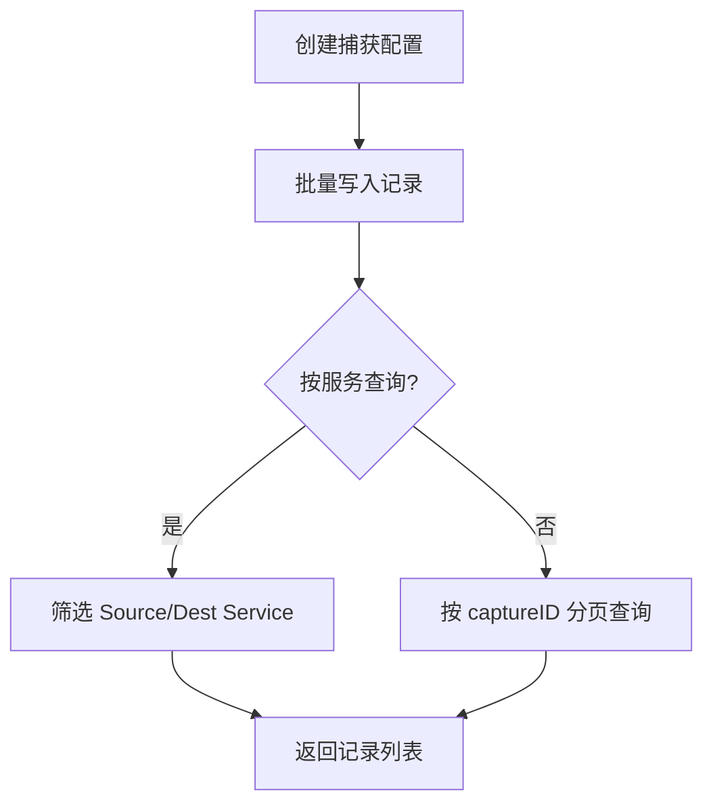
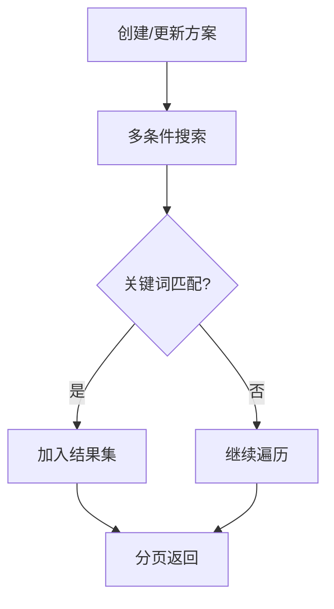
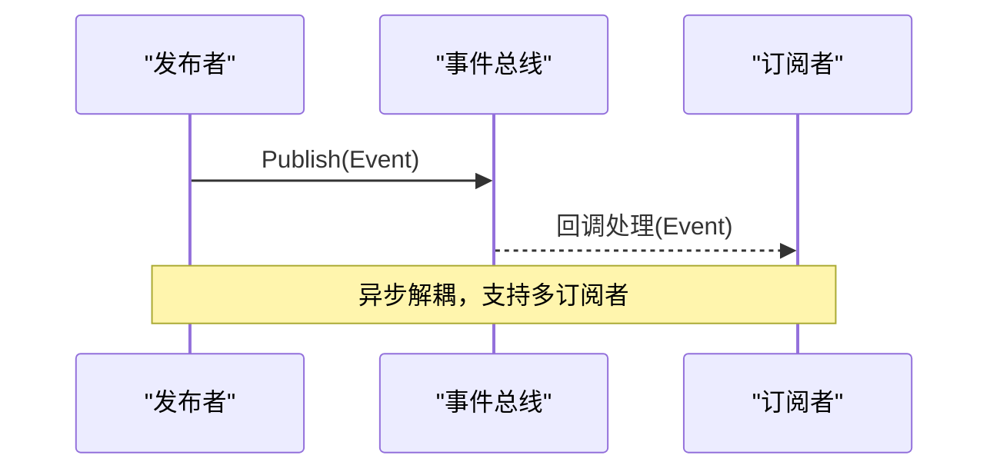
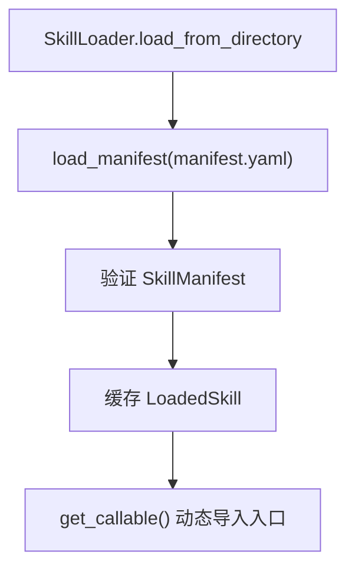
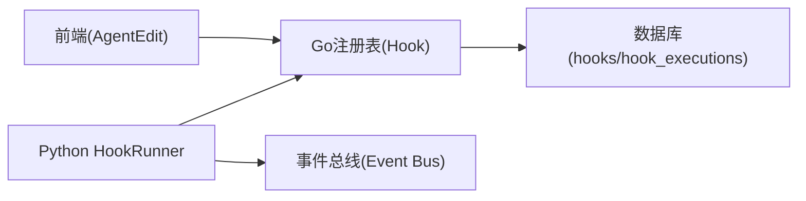

# 插件系统

<cite>
**本文引用的文件**
- [pkg/registry/hook.go](file://pkg/registry/hook.go)
- [pkg/registry/memory.go](file://pkg/registry/memory.go)
- [pkg/registry/solution.go](file://pkg/registry/solution.go)
- [pkg/registry/traffic_capture.go](file://pkg/registry/traffic_capture.go)
- [pkg/event/event.go](file://pkg/event/event.go)
- [python/src/resolveagent/hooks/runner.py](file://python/src/resolveagent/hooks/runner.py)
- [python/src/resolveagent/skills/loader.py](file://python/src/resolveagent/skills/loader.py)
- [python/src/resolveagent/skills/manifest.py](file://python/src/resolveagent/skills/manifest.py)
- [scripts/migration/002_hooks.up.sql](file://scripts/migration/002_hooks.up.sql)
- [web/src/pages/Agents/AgentEdit.tsx](file://web/src/pages/Agents/AgentEdit.tsx)
</cite>

## 目录
1. [简介](#简介)
2. [项目结构](#项目结构)
3. [核心组件](#核心组件)
4. [架构总览](#架构总览)
5. [详细组件分析](#详细组件分析)
6. [依赖关系分析](#依赖关系分析)
7. [性能与可观测性](#性能与可观测性)
8. [故障排查指南](#故障排查指南)
9. [结论](#结论)
10. [附录：开发示例与最佳实践](#附录开发示例与最佳实践)

## 简介
本指南面向 ResolveAgent 的插件系统，围绕钩子（Hook）生命周期、事件驱动机制、以及三类典型插件（内存插件、流量捕获插件、解决方案插件）进行系统化说明。文档涵盖插件注册、事件监听、数据处理、状态管理、插件间通信、依赖管理与冲突解决，并提供测试、调试与性能监控的实践建议。

## 项目结构
ResolveAgent 的插件能力由 Go 层提供持久化与运行时注册表，Python 层提供 Hook 执行器与技能加载器，前端提供可视化配置与管理界面。关键目录与职责如下：
- Go 注册表层：定义并实现 Hook、Memory、Traffic Capture、Solution 等数据模型与内存实现，支持增删改查、按触发点查询、执行记录等。
- Python 运行层：HookRunner 负责按顺序执行匹配的 Hook，记录执行结果；SkillLoader/Manifest 负责发现与加载技能。
- 前端界面：Agent 编辑页提供 Hooks/Middleware 的配置入口，便于启用/禁用、排序与参数设置。
- 数据库迁移：hooks 相关表结构与执行记录表通过 SQL 迁移脚本维护。

图表来源
- [pkg/registry/hook.go:11-54](file://pkg/registry/hook.go#L11-L54)
- [pkg/registry/memory.go:11-60](file://pkg/registry/memory.go#L11-L60)
- [pkg/registry/traffic_capture.go:45-55](file://pkg/registry/traffic_capture.go#L45-L55)
- [pkg/registry/solution.go:11-74](file://pkg/registry/solution.go#L11-L74)
- [python/src/resolveagent/hooks/runner.py:17-101](file://python/src/resolveagent/hooks/runner.py#L17-L101)
- [python/src/resolveagent/skills/loader.py:15-65](file://python/src/resolveagent/skills/loader.py#L15-L65)
- [python/src/resolveagent/skills/manifest.py:95-116](file://python/src/resolveagent/skills/manifest.py#L95-L116)
- [scripts/migration/002_hooks.up.sql:28-51](file://scripts/migration/002_hooks.up.sql#L28-L51)
- [web/src/pages/Agents/AgentEdit.tsx:280-313](file://web/src/pages/Agents/AgentEdit.tsx#L280-L313)

章节来源
- [pkg/registry/hook.go:11-54](file://pkg/registry/hook.go#L11-L54)
- [pkg/registry/memory.go:11-60](file://pkg/registry/memory.go#L11-L60)
- [pkg/registry/traffic_capture.go:45-55](file://pkg/registry/traffic_capture.go#L45-L55)
- [pkg/registry/solution.go:11-74](file://pkg/registry/solution.go#L11-L74)
- [python/src/resolveagent/hooks/runner.py:17-101](file://python/src/resolveagent/hooks/runner.py#L17-L101)
- [python/src/resolveagent/skills/loader.py:15-65](file://python/src/resolveagent/skills/loader.py#L15-L65)
- [python/src/resolveagent/skills/manifest.py:95-116](file://python/src/resolveagent/skills/manifest.py#L95-L116)
- [scripts/migration/002_hooks.up.sql:28-51](file://scripts/migration/002_hooks.up.sql#L28-L51)
- [web/src/pages/Agents/AgentEdit.tsx:280-313](file://web/src/pages/Agents/AgentEdit.tsx#L280-L313)

## 核心组件
- 钩子系统（Hook）
  - 数据结构：HookDefinition（类型、触发点、目标实体、处理器类型、执行顺序、标签等）、HookExecution（执行状态、输入输出、耗时、错误）。
  - 接口：创建、获取、列表、更新、删除、按触发点查询、记录执行、列出执行历史。
  - 内存实现：线程安全读写锁，支持过滤、分页、排序（执行顺序）。
- 内存插件（Memory）
  - 短记忆：会话消息、序列号、角色、内容、Token 计数。
  - 长记忆：跨会话知识、重要性、过期时间、访问计数、嵌入 ID。
  - 接口：会话增删查、长期记忆存取、搜索、清理过期项。
- 流量捕获插件（Traffic Capture）
  - 捕获配置与记录：源服务、目标服务、请求响应、状态码、耗时等。
  - 接口：CRUD、批量写入记录、按服务查询记录。
- 解决方案插件（Solution）
  - 结构化排障方案：问题症状、关键信息、步骤、领域/组件/严重级别、标签、RAG 关联等。
  - 接口：CRUD、多条件搜索、批量创建、执行记录、执行历史。
- 事件总线（Event Bus）
  - 事件结构：类型、主题、数据。
  - 接口：发布、订阅、关闭资源。

章节来源
- [pkg/registry/hook.go:11-54](file://pkg/registry/hook.go#L11-L54)
- [pkg/registry/memory.go:11-60](file://pkg/registry/memory.go#L11-L60)
- [pkg/registry/traffic_capture.go:45-55](file://pkg/registry/traffic_capture.go#L45-L55)
- [pkg/registry/solution.go:11-74](file://pkg/registry/solution.go#L11-L74)
- [pkg/event/event.go:7-22](file://pkg/event/event.go#L7-L22)

## 架构总览
插件系统以“注册表 + 执行器”为核心：
- 注册表（Go）：统一的数据模型与内存实现，提供 CRUD、过滤、分页、排序、执行记录。
- 执行器（Python）：HookRunner 根据上下文匹配并顺序执行 Hook，支持跳过后续、数据链式传递、异常处理与耗时统计。
- 前端：Agent 编辑页提供 Hooks 的可视化配置（名称、类型、动作、启用/禁用、排序）。
- 存储：通过迁移脚本维护 hooks 与 hook_executions 表结构，支持持久化与审计。

图表来源
- [web/src/pages/Agents/AgentEdit.tsx:280-313](file://web/src/pages/Agents/AgentEdit.tsx#L280-L313)
- [pkg/registry/hook.go:167-191](file://pkg/registry/hook.go#L167-L191)
- [python/src/resolveagent/hooks/runner.py:49-101](file://python/src/resolveagent/hooks/runner.py#L49-L101)
- [scripts/migration/002_hooks.up.sql:28-51](file://scripts/migration/002_hooks.up.sql#L28-L51)

## 详细组件分析

### 钩子系统（Hook）
- 设计要点
  - 触发点：如 agent.execute、skill.invoke、workflow.run。
  - 处理器类型：script、transform、validate、log 等，可扩展。
  - 执行顺序：execution_order 控制优先级。
  - 目标范围：target_id 为空表示全局，否则仅对特定实体生效。
  - 执行记录：hook_executions 表记录每次执行的输入输出、状态、耗时与错误。
- 内存实现特性
  - 并发安全：读写锁保护。
  - 过滤与分页：支持按类型、触发点、处理器类型过滤，默认 limit=100。
  - 排序：按 execution_order 升序。
  - 执行记录：RecordExecution/ListExecutions 支持按 HookID 查询。

图表来源
- [pkg/registry/hook.go:11-54](file://pkg/registry/hook.go#L11-L54)
- [pkg/registry/hook.go:56-69](file://pkg/registry/hook.go#L56-L69)
- [pkg/registry/hook.go:71-191](file://pkg/registry/hook.go#L71-L191)
- [pkg/registry/hook.go:194-229](file://pkg/registry/hook.go#L194-L229)

章节来源
- [pkg/registry/hook.go:11-54](file://pkg/registry/hook.go#L11-L54)
- [pkg/registry/hook.go:71-191](file://pkg/registry/hook.go#L71-L191)
- [pkg/registry/hook.go:194-229](file://pkg/registry/hook.go#L194-L229)
- [scripts/migration/002_hooks.up.sql:28-51](file://scripts/migration/002_hooks.up.sql#L28-L51)

### 内存插件（Memory）
- 短记忆：按会话聚合消息，支持序列号排序与限制条数返回。
- 长记忆：跨会话知识，支持重要性排序、过期清理、访问计数。
- 常用操作：AddMessage、GetConversation、DeleteConversation、SearchLongTermMemory、PruneExpiredMemories。

图表来源
- [pkg/registry/memory.go:77-107](file://pkg/registry/memory.go#L77-L107)

章节来源
- [pkg/registry/memory.go:11-60](file://pkg/registry/memory.go#L11-L60)
- [pkg/registry/memory.go:77-107](file://pkg/registry/memory.go#L77-L107)
- [pkg/registry/memory.go:155-224](file://pkg/registry/memory.go#L155-L224)
- [pkg/registry/memory.go:261-274](file://pkg/registry/memory.go#L261-L274)

### 流量捕获插件（Traffic Capture）
- 捕获配置：source_type、status 等字段用于过滤与分页。
- 记录管理：批量写入记录、按 captureID 或 service 查询。
- 删除级联：删除捕获时清理其记录。

图表来源
- [pkg/registry/traffic_capture.go:72-143](file://pkg/registry/traffic_capture.go#L72-L143)
- [pkg/registry/traffic_capture.go:170-219](file://pkg/registry/traffic_capture.go#L170-L219)

章节来源
- [pkg/registry/traffic_capture.go:45-55](file://pkg/registry/traffic_capture.go#L45-L55)
- [pkg/registry/traffic_capture.go:72-143](file://pkg/registry/traffic_capture.go#L72-L143)
- [pkg/registry/traffic_capture.go:170-219](file://pkg/registry/traffic_capture.go#L170-L219)

### 解决方案插件（Solution）
- 结构化排障：包含症状、关键信息、步骤、领域/组件/严重级别、标签、RAG 关联等。
- 搜索能力：按 domain/component/severity/tags/keyword/status 过滤，支持分页。
- 执行追踪：记录执行上下文、状态、效果评分、耗时。

图表来源
- [pkg/registry/solution.go:190-249](file://pkg/registry/solution.go#L190-L249)

章节来源
- [pkg/registry/solution.go:11-74](file://pkg/registry/solution.go#L11-L74)
- [pkg/registry/solution.go:190-249](file://pkg/registry/solution.go#L190-L249)
- [pkg/registry/solution.go:273-308](file://pkg/registry/solution.go#L273-L308)

### 事件驱动机制
- 事件结构：type、subject、data。
- 总线接口：Publish、Subscribe、Close。
- 使用场景：在 Hook 执行前后、技能调用、工作流节点切换时发布事件，供其他模块订阅消费。

图表来源
- [pkg/event/event.go:7-22](file://pkg/event/event.go#L7-L22)

章节来源
- [pkg/event/event.go:7-22](file://pkg/event/event.go#L7-L22)

### 技能加载与清单
- 清单模型：name/version/entry_point/parameters/permissions/scenario 等，支持通用与场景两类技能。
- 加载流程：从本地目录读取 manifest.yaml，解析并缓存 LoadedSkill，按需动态导入入口函数。

图表来源
- [python/src/resolveagent/skills/loader.py:27-65](file://python/src/resolveagent/skills/loader.py#L27-L65)
- [python/src/resolveagent/skills/manifest.py:95-116](file://python/src/resolveagent/skills/manifest.py#L95-L116)

章节来源
- [python/src/resolveagent/skills/loader.py:15-65](file://python/src/resolveagent/skills/loader.py#L15-L65)
- [python/src/resolveagent/skills/manifest.py:95-116](file://python/src/resolveagent/skills/manifest.py#L95-L116)

## 依赖关系分析
- 组件耦合
  - HookRunner 依赖 HookClient（Go 平台）获取 Hook 定义，并在执行后记录执行结果。
  - 前端 Agent 编辑页直接操作 Hook 配置（名称、类型、动作、启用/禁用），影响运行时匹配与执行顺序。
  - 各注册表（Hook/Memory/Traffic/Solution）均提供内存实现，便于开发与测试，生产环境可替换为持久化实现。
- 外部依赖
  - 数据库迁移脚本维护 hooks 与 hook_executions 表结构，确保执行审计与可追溯。
  - 事件总线提供解耦的事件通道，便于扩展监控、告警、链路追踪等横切关注点。

图表来源
- [web/src/pages/Agents/AgentEdit.tsx:280-313](file://web/src/pages/Agents/AgentEdit.tsx#L280-L313)
- [pkg/registry/hook.go:167-191](file://pkg/registry/hook.go#L167-L191)
- [python/src/resolveagent/hooks/runner.py:49-101](file://python/src/resolveagent/hooks/runner.py#L49-L101)
- [scripts/migration/002_hooks.up.sql:28-51](file://scripts/migration/002_hooks.up.sql#L28-L51)
- [pkg/event/event.go:7-22](file://pkg/event/event.go#L7-L22)

章节来源
- [web/src/pages/Agents/AgentEdit.tsx:280-313](file://web/src/pages/Agents/AgentEdit.tsx#L280-L313)
- [pkg/registry/hook.go:167-191](file://pkg/registry/hook.go#L167-L191)
- [python/src/resolveagent/hooks/runner.py:49-101](file://python/src/resolveagent/hooks/runner.py#L49-L101)
- [scripts/migration/002_hooks.up.sql:28-51](file://scripts/migration/002_hooks.up.sql#L28-L51)
- [pkg/event/event.go:7-22](file://pkg/event/event.go#L7-L22)

## 性能与可观测性
- 性能优化建议
  - 合理设置 execution_order，避免高开销 Hook 阻塞关键路径。
  - 使用过滤与分页减少不必要的数据扫描（如按 trigger_point、handler_type、status 过滤）。
  - 长记忆 PruneExpiredMemories 定期清理过期条目，降低内存占用。
  - 流量记录批量写入，减少 I/O 次数。
- 可观测性
  - Hook 执行记录包含 duration_ms、status、error，便于定位慢与失败用例。
  - 可通过事件总线发布执行指标，接入监控系统。
  - 前端展示延迟百分位与执行趋势，辅助性能评估。

[本节为通用指导，不直接分析具体文件]

## 故障排查指南
- 常见问题
  - Hook 未执行：检查 enabled、trigger_point、target_id 是否匹配；确认 execution_order 与排序逻辑。
  - 执行失败：查看 hook_executions.error 字段，定位处理器异常；确认 HandlerType 已正确注册。
  - 数据不一致：核对 Memory 会话消息序列号；检查 Traffic 记录的 Source/Dest Service 是否正确。
  - 解决方案搜索无结果：确认 domain/component/severity/tags/keyword 过滤条件；检查 Status 与版本。
- 诊断步骤
  - 使用 ListByTriggerPoint 获取匹配 Hook，确认排序与过滤。
  - 使用 ListExecutions 查看执行历史，结合 duration_ms 与 error 定位瓶颈。
  - 使用 SearchLongTermMemory 与 GetConversation 验证记忆数据。
  - 使用 GetRecordsByService 验证流量记录。

章节来源
- [pkg/registry/hook.go:167-191](file://pkg/registry/hook.go#L167-L191)
- [pkg/registry/hook.go:194-229](file://pkg/registry/hook.go#L194-L229)
- [pkg/registry/memory.go:86-107](file://pkg/registry/memory.go#L86-L107)
- [pkg/registry/traffic_capture.go:208-219](file://pkg/registry/traffic_capture.go#L208-L219)
- [pkg/registry/solution.go:190-249](file://pkg/registry/solution.go#L190-L249)

## 结论
ResolveAgent 的插件系统以 Hook 为核心，结合内存、流量捕获与解决方案三类插件，形成可扩展、可观测、可审计的运行时能力。通过统一的注册表与执行器，开发者可以灵活地插拔业务逻辑，并通过事件总线实现松耦合通信。配合前端可视化配置与数据库迁移，系统具备良好的可维护性与演进能力。

[本节为总结，不直接分析具体文件]

## 附录：开发示例与最佳实践

### 如何开发自定义插件
- 插件注册
  - 在 Go 注册表中定义 HookDefinition，设置 trigger_point、handler_type、execution_order、enabled 等字段。
  - 通过前端 Agent 编辑页添加 Hook，配置名称、类型、动作与启用状态。
- 事件监听
  - 在 Python HookRunner 中注册处理器（如 log、transform、validate），根据 handler_type 分发执行。
  - 使用事件总线发布/订阅系统事件，实现跨模块通知。
- 数据处理
  - 利用 ShortTermMemory/LongTermMemory 管理会话与长期知识，注意序列号与过期策略。
  - 使用 TrafficCaptureRegistry 批量写入流量记录，并按服务维度检索。
  - 使用 SolutionRegistry 创建/搜索排障方案，记录执行效果与耗时。
- 状态管理
  - 所有注册表方法均支持分页与过滤，避免全量扫描。
  - 执行记录（hook_executions/solution_executions）用于审计与回溯。

章节来源
- [web/src/pages/Agents/AgentEdit.tsx:280-313](file://web/src/pages/Agents/AgentEdit.tsx#L280-L313)
- [python/src/resolveagent/hooks/runner.py:40-101](file://python/src/resolveagent/hooks/runner.py#L40-L101)
- [pkg/registry/memory.go:77-107](file://pkg/registry/memory.go#L77-L107)
- [pkg/registry/traffic_capture.go:170-219](file://pkg/registry/traffic_capture.go#L170-L219)
- [pkg/registry/solution.go:190-249](file://pkg/registry/solution.go#L190-L249)

### 插件间通信、依赖管理与冲突解决
- 通信机制
  - 通过事件总线发布领域事件（如 agent.execute、skill.invoke），订阅者可独立实现处理逻辑。
  - 共享注册表作为状态中心（如 Memory、Solution），避免直接耦合。
- 依赖管理
  - 技能清单声明 dependencies、permissions、timeout_seconds 等，沙箱执行时进行约束。
  - 使用 SkillLoader 缓存 LoadedSkill，避免重复导入。
- 冲突解决
  - 通过 execution_order 明确执行优先级；必要时在处理器内实现 skip_remaining 提前终止。
  - 使用 target_id 限定作用域，避免全局与局部 Hook 相互干扰。

章节来源
- [pkg/event/event.go:7-22](file://pkg/event/event.go#L7-L22)
- [python/src/resolveagent/skills/manifest.py:28-38](file://python/src/resolveagent/skills/manifest.py#L28-L38)
- [python/src/resolveagent/skills/loader.py:24-65](file://python/src/resolveagent/skills/loader.py#L24-L65)
- [pkg/registry/hook.go:167-191](file://pkg/registry/hook.go#L167-L191)

### 测试、调试与性能监控
- 单元测试
  - 针对 HookRunner 的 run 流程，覆盖正常、异常、skip_remaining 分支。
  - 针对注册表的过滤、分页、排序逻辑编写用例。
- 集成测试
  - 使用前端 Mock API 模拟流量图与调用图接口，验证端到端流程。
  - 使用数据库迁移脚本初始化测试环境，验证持久化行为。
- 性能监控
  - 采集 Hook 执行耗时、成功率、错误率，接入监控系统。
  - 观察长记忆过期清理频率与效果，调整过期策略。
  - 使用前端延迟百分位视图评估整体性能。

章节来源
- [web/src/api/client.ts:264-289](file://web/src/api/client.ts#L264-L289)
- [scripts/migration/002_hooks.up.sql:28-51](file://scripts/migration/002_hooks.up.sql#L28-L51)
- [pkg/registry/memory.go:261-274](file://pkg/registry/memory.go#L261-L274)