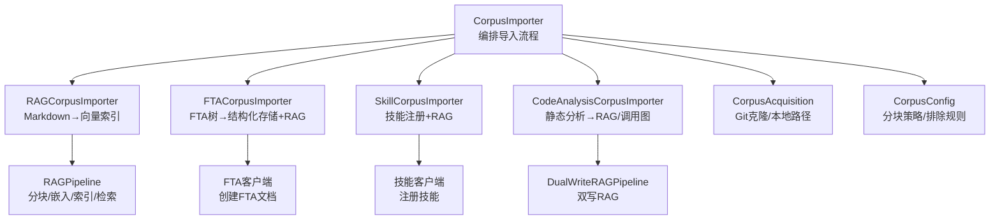
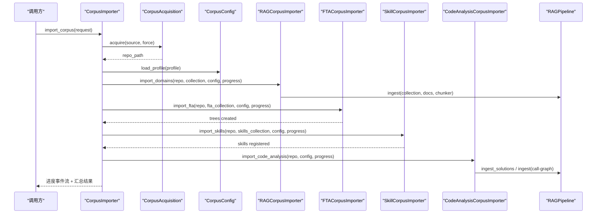
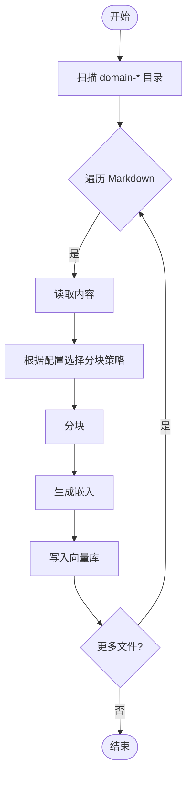
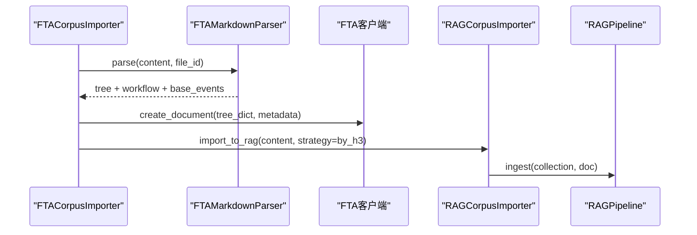
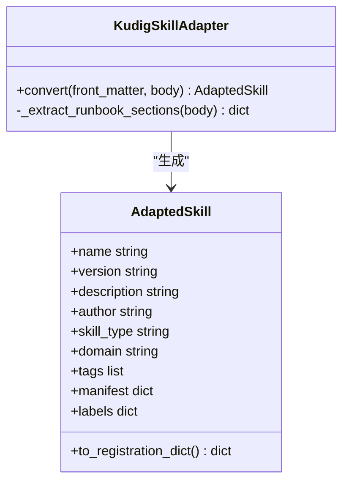
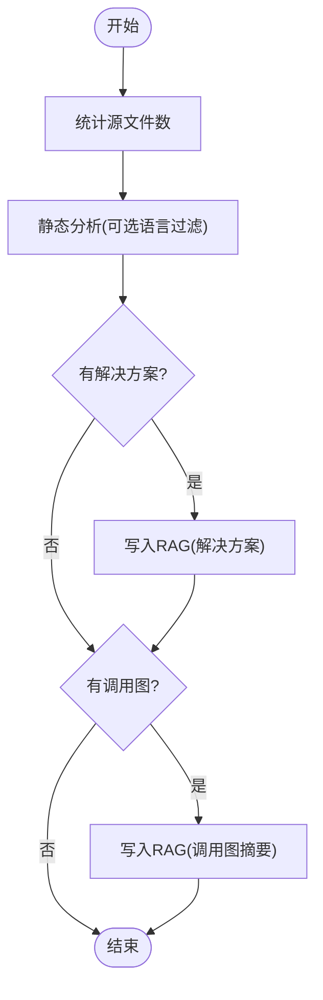
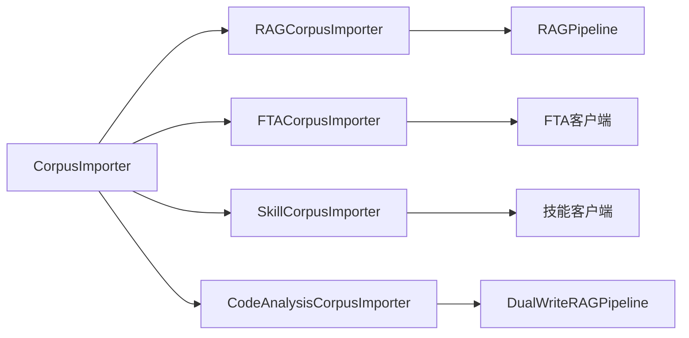

# 第三方集成

<cite>
**本文引用的文件**
- [importer.py](file://python/src/resolveagent/corpus/importer.py)
- [rag_importer.py](file://python/src/resolveagent/corpus/rag_importer.py)
- [fta_importer.py](file://python/src/resolveagent/corpus/fta_importer.py)
- [skill_adapter.py](file://python/src/resolveagent/corpus/skill_adapter.py)
- [code_analysis_importer.py](file://python/src/resolveagent/corpus/code_analysis_importer.py)
- [acquisition.py](file://python/src/resolveagent/corpus/acquisition.py)
- [config.py](file://python/src/resolveagent/corpus/config.py)
- [pipeline.py](file://python/src/resolveagent/rag/pipeline.py)
- [security.md](file://docs/architecture/security.md)
- [test_http_server.py](file://python/tests/test_http_server.py)
- [retry.go](file://pkg/retry/retry.go)
- [breaker.go](file://pkg/circuitbreaker/breaker.go)
- [import-kudig-solutions.ts](file://scripts/import-kudig-solutions.ts)
- [agent.yaml](file://examples/quickstart/agent.yaml)
- [workflow.yaml](file://examples/quickstart/workflow.yaml)
</cite>

## 目录
1. [简介](#简介)
2. [项目结构](#项目结构)
3. [核心组件](#核心组件)
4. [架构总览](#架构总览)
5. [详细组件分析](#详细组件分析)
6. [依赖关系分析](#依赖关系分析)
7. [性能与扩展性](#性能与扩展性)
8. [故障排查指南](#故障排查指南)
9. [结论](#结论)
10. [附录：集成示例与最佳实践](#附录：集成示例与最佳实践)

## 简介
本指南面向需要为 ResolveAgent 接入第三方数据源与服务（如 Kubernetes、外部 API、知识库仓库）的工程师，聚焦以下目标：
- 知识库导入器架构与数据摄取管道
- 格式转换机制（技能适配器、FTA 文档、RAG 文档、代码分析）
- 增量同步策略与错误处理
- 安全认证、速率限制与监控集成最佳实践
- 完整的集成示例（技能适配器、代码分析导入器、RAG 文档导入器、FTA 文档导入器）

## 项目结构
ResolveAgent 的第三方集成主要位于 Python 层的 corpus 与 rag 模块，配合 Go 层的服务端中间件与重试/熔断能力，形成“采集—解析—标准化—向量化—检索”的完整链路。

图表来源
- [importer.py:50-187](file://python/src/resolveagent/corpus/importer.py#L50-L187)
- [rag_importer.py:23-113](file://python/src/resolveagent/corpus/rag_importer.py#L23-L113)
- [fta_importer.py:25-131](file://python/src/resolveagent/corpus/fta_importer.py#L25-L131)
- [skill_adapter.py:71-157](file://python/src/resolveagent/corpus/skill_adapter.py#L71-L157)
- [code_analysis_importer.py:32-162](file://python/src/resolveagent/corpus/code_analysis_importer.py#L32-L162)
- [pipeline.py:18-138](file://python/src/resolveagent/rag/pipeline.py#L18-L138)
- [acquisition.py:20-101](file://python/src/resolveagent/corpus/acquisition.py#L20-L101)
- [config.py:27-86](file://python/src/resolveagent/corpus/config.py#L27-L86)

章节来源
- [importer.py:50-187](file://python/src/resolveagent/corpus/importer.py#L50-L187)
- [pipeline.py:18-138](file://python/src/resolveagent/rag/pipeline.py#L18-L138)

## 核心组件
- CorpusImporter：统一编排数据获取、配置加载、文件统计与各类型导入器的执行，并产出进度事件流。
- RAGCorpusImporter：将 Markdown 知识文档按策略分块、嵌入并索引到向量库，支持便捷方法供其他导入器复用。
- FTACorpusImporter：解析 FTA Markdown 为故障树结构，注册到 FTA 存储，同时将原文以合适粒度入 RAG。
- SkillCorpusImporter：将 kudig 技能文档适配为平台技能定义，注册技能并将运行手册内容入 RAG。
- CodeAnalysisCorpusImporter：对源码进行静态分析，生成解决方案与调用图摘要，写入 RAG；也支持从预构建调用链数据生成结构化 RAG 语料。
- RAGPipeline：端到端 RAG 流水线，负责分块、嵌入、索引、检索与重排序。
- CorpusAcquisition：从 Git 或本地路径获取语料仓库，支持缓存与强制重新克隆。
- CorpusConfig：基于路径模式与配置文件决定分块策略与排除规则。

章节来源
- [importer.py:50-187](file://python/src/resolveagent/corpus/importer.py#L50-L187)
- [rag_importer.py:23-113](file://python/src/resolveagent/corpus/rag_importer.py#L23-L113)
- [fta_importer.py:25-131](file://python/src/resolveagent/corpus/fta_importer.py#L25-L131)
- [skill_adapter.py:71-157](file://python/src/resolveagent/corpus/skill_adapter.py#L71-L157)
- [code_analysis_importer.py:32-162](file://python/src/resolveagent/corpus/code_analysis_importer.py#L32-L162)
- [pipeline.py:18-138](file://python/src/resolveagent/rag/pipeline.py#L18-L138)
- [acquisition.py:20-101](file://python/src/resolveagent/corpus/acquisition.py#L20-L101)
- [config.py:27-86](file://python/src/resolveagent/corpus/config.py#L27-L86)

## 架构总览
下图展示了从数据源到 RAG 检索的端到端流程，以及各导入器如何协同工作。

图表来源
- [importer.py:74-187](file://python/src/resolveagent/corpus/importer.py#L74-L187)
- [rag_importer.py:29-80](file://python/src/resolveagent/corpus/rag_importer.py#L29-L80)
- [fta_importer.py:37-131](file://python/src/resolveagent/corpus/fta_importer.py#L37-L131)
- [code_analysis_importer.py:71-162](file://python/src/resolveagent/corpus/code_analysis_importer.py#L71-L162)
- [pipeline.py:44-138](file://python/src/resolveagent/rag/pipeline.py#L44-L138)

## 详细组件分析

### 知识库导入器（RAGCorpusImporter）
- 功能要点
  - 扫描 domain-* 目录下的 Markdown 文件，按配置选择分块策略与大小。
  - 提取标题与元数据，调用 RAGPipeline 完成分块、嵌入与索引。
  - 提供 import_to_rag 便捷方法，供 FTA/Skills 导入器复用。
- 关键路径
  - 分块策略映射：by_h2/by_section/by_h3/sentence/full_doc 等，默认大小由配置表决定。
  - 元数据包含 source_uri、title、content_type、domain、corpus 等，便于检索过滤。
- 错误处理
  - 单文件异常捕获，记录错误并通过 ProgressTracker 上报。
- 性能考量
  - 批量文档传入 pipeline，减少连接开销；向量维度在首次插入时推断。

图表来源
- [rag_importer.py:29-113](file://python/src/resolveagent/corpus/rag_importer.py#L29-L113)
- [config.py:46-70](file://python/src/resolveagent/corpus/config.py#L46-L70)
- [pipeline.py:44-138](file://python/src/resolveagent/rag/pipeline.py#L44-L138)

章节来源
- [rag_importer.py:29-113](file://python/src/resolveagent/corpus/rag_importer.py#L29-L113)
- [config.py:46-70](file://python/src/resolveagent/corpus/config.py#L46-L70)
- [pipeline.py:44-138](file://python/src/resolveagent/rag/pipeline.py#L44-L138)

### FTA 文档导入器（FTACorpusImporter）
- 功能要点
  - 解析 topic-fta/list/*.md 为故障树结构，注册到 FTA 存储。
  - 将原始 Markdown 以 by_h3 策略分块入 RAG，便于语义检索。
- 关键路径
  - 文件 ID 规范化（slugify），避免特殊字符。
  - 元数据包含 workflow、base_events、source、source_file 等。
- 错误处理
  - 单个文件解析/注册失败不影响其他文件；通过 ProgressTracker 上报错误。

图表来源
- [fta_importer.py:37-131](file://python/src/resolveagent/corpus/fta_importer.py#L37-L131)

章节来源
- [fta_importer.py:37-131](file://python/src/resolveagent/corpus/fta_importer.py#L37-L131)

### 技能适配器（KudigSkillAdapter）
- 功能要点
  - 将 kudig 技能的 YAML front matter 与 Markdown 正文转换为平台技能定义。
  - 提取名称、版本、描述、标签、领域、触发词、运行手册章节等。
  - 输出注册字典，供平台技能注册接口使用。
- 关键路径
  - 名称推导与 slugify，确保唯一性与 URL 安全。
  - 运行手册按二级标题拆分章节，便于结构化展示与检索。
- 错误处理
  - Front matter 解析失败时记录警告并回退为空。

图表来源
- [skill_adapter.py:71-157](file://python/src/resolveagent/corpus/skill_adapter.py#L71-L157)
- [skill_adapter.py:159-204](file://python/src/resolveagent/corpus/skill_adapter.py#L159-L204)

章节来源
- [skill_adapter.py:71-157](file://python/src/resolveagent/corpus/skill_adapter.py#L71-L157)
- [skill_adapter.py:159-204](file://python/src/resolveagent/corpus/skill_adapter.py#L159-L204)

### 代码分析导入器（CodeAnalysisCorpusImporter）
- 功能要点
  - 对仓库源码进行静态分析，生成解决方案与调用图摘要，写入 RAG。
  - 支持从预构建调用链数据生成结构化 RAG 文档（覆盖概述、源文件、函数、流程步骤、交叉引用、问答）。
- 关键路径
  - 语言过滤与源文件计数用于进度跟踪。
  - 调用图摘要作为单一文档入 RAG，便于概览检索。
  - 支持 tags 标注（call-chain、k8s-source、code-analysis）。
- 错误处理
  - 静态分析与 RAG 写入均捕获异常并上报；返回统计信息。

图表来源
- [code_analysis_importer.py:71-162](file://python/src/resolveagent/corpus/code_analysis_importer.py#L71-L162)
- [code_analysis_importer.py:164-247](file://python/src/resolveagent/corpus/code_analysis_importer.py#L164-L247)

章节来源
- [code_analysis_importer.py:71-162](file://python/src/resolveagent/corpus/code_analysis_importer.py#L71-L162)
- [code_analysis_importer.py:164-247](file://python/src/resolveagent/corpus/code_analysis_importer.py#L164-L247)

### 数据获取与配置（CorpusAcquisition & CorpusConfig）
- 数据获取
  - 支持本地路径与 Git 远程仓库；本地路径需包含预期目录；远程仓库支持缓存与强制重新克隆。
  - 超时与错误封装为 AcquisitionError。
- 配置
  - 基于路径模式匹配分块策略与大小；支持 exclude_patterns 排除无关文件。
  - 可从仓库内 profile YAML 加载自定义 sources 与优先级。

章节来源
- [acquisition.py:20-101](file://python/src/resolveagent/corpus/acquisition.py#L20-L101)
- [config.py:27-86](file://python/src/resolveagent/corpus/config.py#L27-L86)
- [config.py:125-137](file://python/src/resolveagent/corpus/config.py#L125-L137)

## 依赖关系分析
- 耦合度
  - CorpusImporter 作为编排者，依赖多个专用导入器与 RAGPipeline，但通过参数注入保持松耦合。
  - 各导入器通过 ProgressTracker 上报进度，解耦 UI/前端消费。
- 外部依赖
  - Git 命令用于克隆仓库；向量库（Milvus）用于索引；平台存储用于 FTA/技能/文档元数据持久化。
- 潜在循环依赖
  - 当前模块间为单向依赖，未见循环引用。

图表来源
- [importer.py:50-187](file://python/src/resolveagent/corpus/importer.py#L50-L187)
- [rag_importer.py:23-113](file://python/src/resolveagent/corpus/rag_importer.py#L23-L113)
- [fta_importer.py:25-131](file://python/src/resolveagent/corpus/fta_importer.py#L25-L131)
- [skill_adapter.py:71-157](file://python/src/resolveagent/corpus/skill_adapter.py#L71-L157)
- [code_analysis_importer.py:32-162](file://python/src/resolveagent/corpus/code_analysis_importer.py#L32-L162)

章节来源
- [importer.py:50-187](file://python/src/resolveagent/corpus/importer.py#L50-L187)

## 性能与扩展性
- 分块与嵌入
  - 不同目录采用不同分块策略，平衡检索精度与上下文长度。
  - 向量维度在首次插入时推断，避免重复建库。
- 并发与批处理
  - 批量文档传入 pipeline 减少连接与网络开销。
  - 可结合上游调度实现并行导入（例如多 domain 并行）。
- 可扩展点
  - 新增导入器：实现类似 FTACorpusImporter 的接口，复用 RAGCorpusImporter 的 import_to_rag。
  - 新增分块策略：在 CorpusConfig 中扩展策略映射与默认大小。
  - 向量后端：RAGPipeline 支持切换后端（当前默认 Milvus）。

[本节为通用指导，不直接分析具体文件]

## 故障排查指南
- 常见问题
  - Git 克隆失败：检查网络、git 安装与超时设置；错误封装为 AcquisitionError。
  - 分块策略不生效：确认文件路径匹配与 CorpusConfig 中的 sources/exclude_patterns。
  - RAG 写入失败：查看日志中的向量库连接与集合创建错误。
- 错误上报
  - 各导入器通过 ProgressTracker.file_error 上报错误，便于前端展示与告警。
- 重试与熔断
  - Go 层提供重试策略（指数退避、抖动、条件重试）与熔断器（半开探测、恢复超时），可用于外部 API 调用场景。

章节来源
- [acquisition.py:66-101](file://python/src/resolveagent/corpus/acquisition.py#L66-L101)
- [config.py:46-86](file://python/src/resolveagent/corpus/config.py#L46-L86)
- [retry.go:1-95](file://pkg/retry/retry.go#L1-L95)
- [breaker.go:92-148](file://pkg/circuitbreaker/breaker.go#L92-L148)

## 结论
ResolveAgent 提供了模块化、可扩展的知识库导入与 RAG 摄取管道。通过统一的编排器与专用导入器，能够高效整合多种第三方数据源（GitHub 仓库、Kubernetes 源码、FTA 文档、技能手册），并以一致的元数据与分块策略入 RAG，支撑后续检索与智能体调用。结合 Go 层的安全中间件、重试与熔断机制，可在生产环境中稳定运行。

[本节为总结，不直接分析具体文件]

## 附录：集成示例与最佳实践

### 集成 Kubernetes 与外部 API
- 数据源
  - 使用 CorpusAcquisition 拉取 GitHub 仓库（如 kudig-database），或指向本地已克隆路径。
  - 通过 CorpusConfig 指定分块策略与排除规则，优化检索效果。
- 外部 API 调用
  - 在导入器中调用平台存储客户端（如 FTA/技能注册），建议结合 Go 层重试策略与熔断器，提升鲁棒性。
  - 参考脚本 import-kudig-solutions.ts，演示批量导入结构化方案至平台 API。

章节来源
- [acquisition.py:20-101](file://python/src/resolveagent/corpus/acquisition.py#L20-L101)
- [config.py:46-86](file://python/src/resolveagent/corpus/config.py#L46-L86)
- [import-kudig-solutions.ts:1-41](file://scripts/import-kudig-solutions.ts#L1-L41)
- [import-kudig-solutions.ts:358-402](file://scripts/import-kudig-solutions.ts#L358-L402)

### 安全认证、速率限制与监控
- 认证
  - Go 平台支持 JWT、API Key、网关透传；建议在生产启用 HTTPS 与最小权限原则。
- 速率限制
  - Python 运行时内置滑动窗口限流（默认 60 RPM/IP），测试用例验证了 429 行为。
- 监控
  - 建议结合重试观察器与熔断状态，收集成功/耗尽指标；在导入器中记录关键步骤耗时。

章节来源
- [security.md:1-96](file://docs/architecture/security.md#L1-L96)
- [test_http_server.py:157-186](file://python/tests/test_http_server.py#L157-L186)
- [retry.go:13-38](file://pkg/retry/retry.go#L13-L38)

### 增量同步策略
- 基于哈希的变更检测
  - 文档同步引擎通过比较源/目标文本哈希，判断是否需要同步或冲突。
  - 支持双向同步与人工审核队列，避免误覆盖。
- 建议
  - 在导入流程中加入增量检查，仅处理变更文档，降低带宽与计算成本。

章节来源
- [docsync/engine.py:271-544](file://python/src/resolveagent/docsync/engine.py#L271-L544)

### 完整集成示例
- 快速启动 Agent 与工作流
  - agent.yaml 定义智能体模型、系统提示与技能列表。
  - workflow.yaml 定义简单 FTA 工作流，调用技能节点。
- 导入流程
  - 使用 CorpusImporter.import_corpus 发起一次性导入，或通过 CLI/服务定时任务触发。
  - 针对 FTA/技能/RAG/代码分析分别启用对应 import_types。

章节来源
- [agent.yaml:1-16](file://examples/quickstart/agent.yaml#L1-L16)
- [workflow.yaml:1-26](file://examples/quickstart/workflow.yaml#L1-L26)
- [importer.py:26-48](file://python/src/resolveagent/corpus/importer.py#L26-L48)
- [importer.py:74-187](file://python/src/resolveagent/corpus/importer.py#L74-L187)