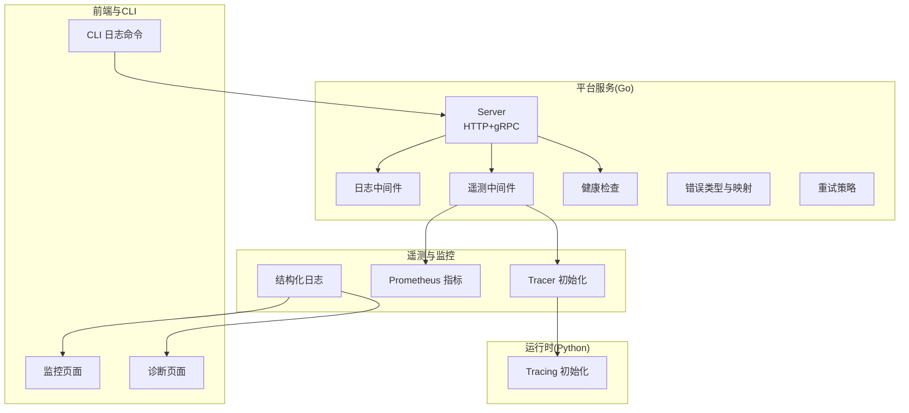
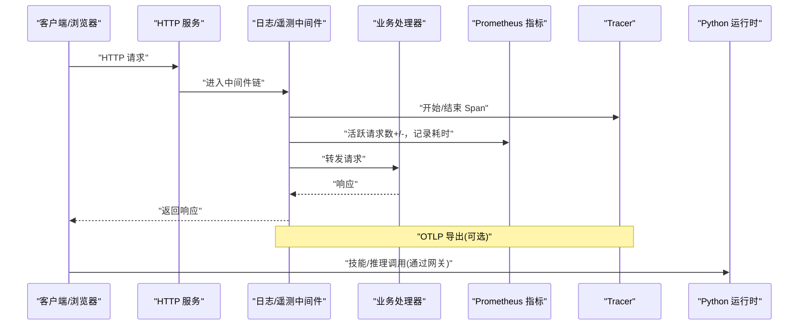
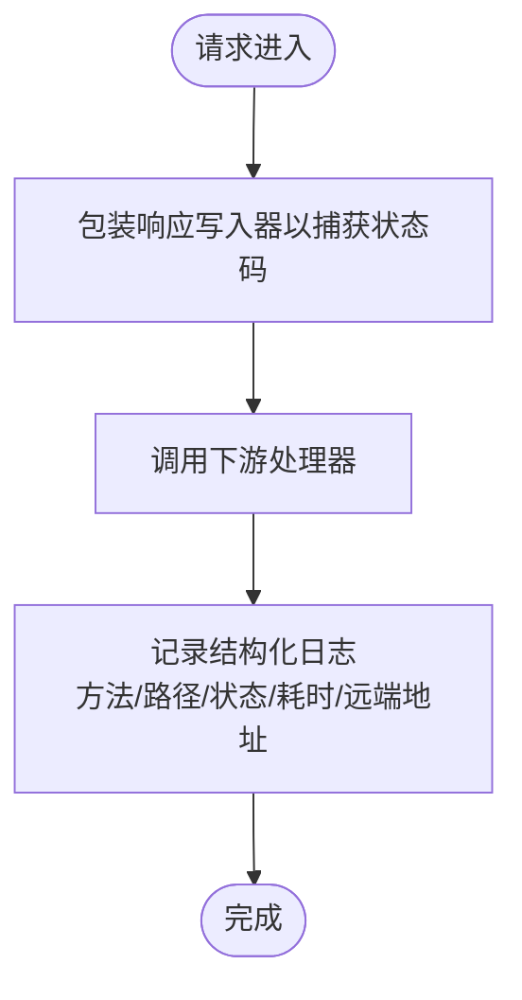
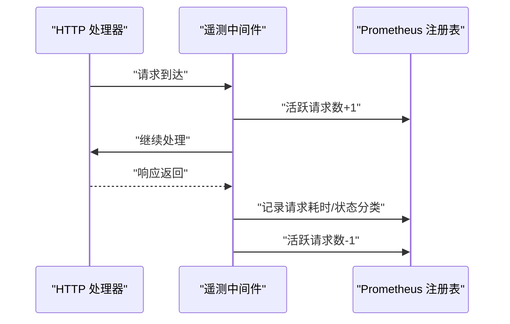
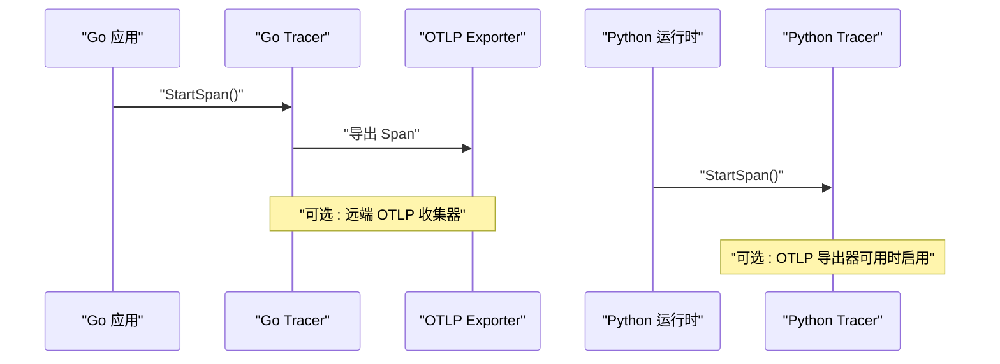
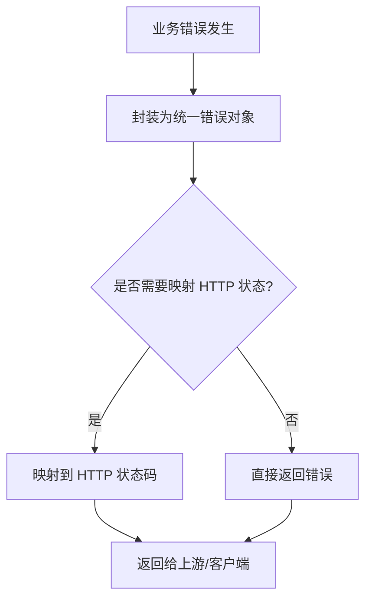
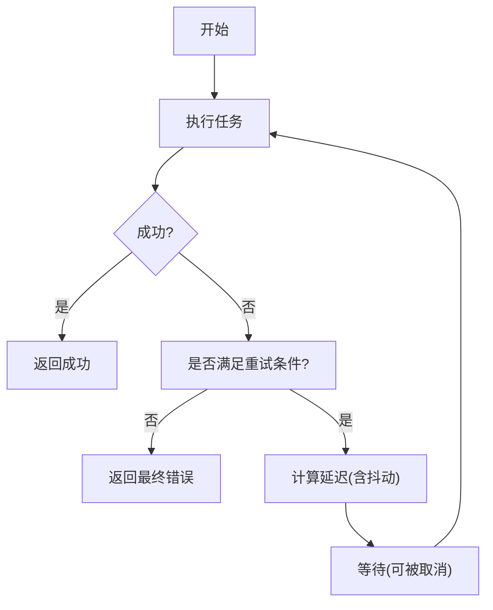
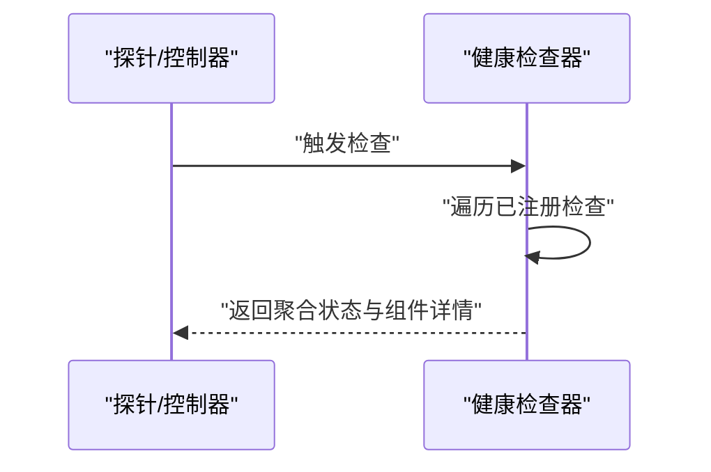
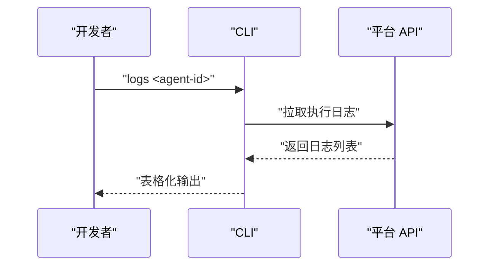
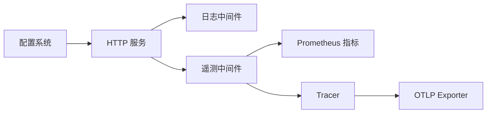

# 故障排除

<cite>
**本文引用的文件**
- [pkg/logger/logger.go](file://pkg/logger/logger.go)
- [pkg/telemetry/logger.go](file://pkg/telemetry/logger.go)
- [pkg/server/middleware/logging.go](file://pkg/server/middleware/logging.go)
- [pkg/server/middleware/telemetry.go](file://pkg/server/middleware/telemetry.go)
- [pkg/telemetry/metrics.go](file://pkg/telemetry/metrics.go)
- [pkg/telemetry/tracer.go](file://pkg/telemetry/tracer.go)
- [python/src/resolveagent/telemetry/tracing.py](file://python/src/resolveagent/telemetry/tracing.py)
- [pkg/errors/errors.go](file://pkg/errors/errors.go)
- [pkg/retry/retry.go](file://pkg/retry/retry.go)
- [pkg/health/health.go](file://pkg/health/health.go)
- [internal/cli/agent/logs.go](file://internal/cli/agent/logs.go)
- [configs/resolveagent.yaml](file://configs/resolveagent.yaml)
- [pkg/config/config.go](file://pkg/config/config.go)
- [pkg/config/types.go](file://pkg/config/types.go)
- [web/src/pages/Monitoring/index.tsx](file://web/src/pages/Monitoring/index.tsx)
- [web/src/pages/Agents/AgentDiagnostics.tsx](file://web/src/pages/Agents/AgentDiagnostics.tsx)
- [web/src/types/index.ts](file://web/src/types/index.ts)
- [docs/demo/demo/skills/log-analyzer/skill.py](file://docs/demo/demo/skills/log-analyzer/skill.py)
- [docs/demo/demo/skills/metrics-checker/manifest.yaml](file://docs/demo/demo/skills/metrics-checker/manifest.yaml)
- [web/src/mocks/codeAnalysis/trafficAnalysis.ts](file://web/src/mocks/codeAnalysis/trafficAnalysis.ts)
</cite>

## 目录
1. [简介](#简介)
2. [项目结构](#项目结构)
3. [核心组件](#核心组件)
4. [架构总览](#架构总览)
5. [详细组件分析](#详细组件分析)
6. [依赖分析](#依赖分析)
7. [性能考量](#性能考量)
8. [故障排除指南](#故障排除指南)
9. [结论](#结论)
10. [附录](#附录)

## 简介
本指南面向 ResolveAgent 平台的运维与开发人员，聚焦于系统故障排除与调试实践。内容涵盖常见问题排查、调试技巧、性能分析、日志分析、系统监控、错误诊断、性能瓶颈识别与解决方案，并提供完整的日志格式说明、调试工具使用与问题定位方法。同时解释生产环境故障处理流程、紧急响应与预防措施。

## 项目结构
ResolveAgent 采用多语言混合架构：后端 Go 服务负责平台核心能力（注册表、路由、健康检查、指标与追踪），Python 运行时负责技能执行与推理；CLI 提供本地调试与日志查看；Web 前端提供监控与诊断界面；配置通过 YAML 文件集中管理。

图表来源
- [pkg/server/server.go:20-81](file://pkg/server/server.go#L20-L81)
- [pkg/server/middleware/logging.go:19-37](file://pkg/server/middleware/logging.go#L19-L37)
- [pkg/server/middleware/telemetry.go:11-41](file://pkg/server/middleware/telemetry.go#L11-L41)
- [pkg/telemetry/tracer.go:82-132](file://pkg/telemetry/tracer.go#L82-L132)
- [python/src/resolveagent/telemetry/tracing.py:15-73](file://python/src/resolveagent/telemetry/tracing.py#L15-L73)
- [pkg/telemetry/metrics.go:144-189](file://pkg/telemetry/metrics.go#L144-L189)
- [web/src/pages/Monitoring/index.tsx:100-127](file://web/src/pages/Monitoring/index.tsx#L100-L127)
- [web/src/pages/Agents/AgentDiagnostics.tsx:73-94](file://web/src/pages/Agents/AgentDiagnostics.tsx#L73-L94)
- [internal/cli/agent/logs.go:13-48](file://internal/cli/agent/logs.go#L13-L48)

章节来源
- [pkg/server/server.go:20-81](file://pkg/server/server.go#L20-L81)
- [configs/resolveagent.yaml:1-90](file://configs/resolveagent.yaml#L1-L90)

## 核心组件
- 结构化日志与日志中间件：统一输出 JSON/文本格式日志，支持上下文注入与组件作用域。
- HTTP 中间件：记录请求方法、路径、状态码、耗时与远端地址。
- 遥测中间件：自动埋点请求延迟、活跃请求数、状态分类统计。
- Prometheus 指标：请求耗时直方图、活跃请求数、代理执行计数与延迟直方图等。
- OpenTelemetry 追踪：初始化全局 Tracer，支持 OTLP 导出与事件标注。
- 错误模型：统一错误码与消息封装，映射 HTTP 状态码。
- 重试策略：指数退避、抖动、可选条件重试与上下文取消。
- 健康检查：聚合组件健康状态，提供就绪/存活探针。
- CLI 日志：查看指定 Agent 执行日志，支持跟随模式占位。
- 配置系统：Viper 加载默认与用户配置，支持环境变量覆盖。
- 前端监控与诊断：系统指标卡片、告警列表、健康评分与部署信息。

章节来源
- [pkg/logger/logger.go:1-117](file://pkg/logger/logger.go#L1-L117)
- [pkg/server/middleware/logging.go:19-37](file://pkg/server/middleware/logging.go#L19-L37)
- [pkg/server/middleware/telemetry.go:11-41](file://pkg/server/middleware/telemetry.go#L11-L41)
- [pkg/telemetry/metrics.go:144-189](file://pkg/telemetry/metrics.go#L144-L189)
- [pkg/telemetry/tracer.go:82-132](file://pkg/telemetry/tracer.go#L82-L132)
- [python/src/resolveagent/telemetry/tracing.py:15-73](file://python/src/resolveagent/telemetry/tracing.py#L15-L73)
- [pkg/errors/errors.go:12-131](file://pkg/errors/errors.go#L12-L131)
- [pkg/retry/retry.go:12-94](file://pkg/retry/retry.go#L12-L94)
- [pkg/health/health.go:13-104](file://pkg/health/health.go#L13-L104)
- [internal/cli/agent/logs.go:13-48](file://internal/cli/agent/logs.go#L13-L48)
- [configs/resolveagent.yaml:1-90](file://configs/resolveagent.yaml#L1-L90)
- [pkg/config/config.go:10-41](file://pkg/config/config.go#L10-L41)
- [pkg/config/types.go:5-36](file://pkg/config/types.go#L5-L36)
- [web/src/pages/Monitoring/index.tsx:100-127](file://web/src/pages/Monitoring/index.tsx#L100-L127)
- [web/src/pages/Agents/AgentDiagnostics.tsx:73-94](file://web/src/pages/Agents/AgentDiagnostics.tsx#L73-L94)
- [web/src/types/index.ts:575-621](file://web/src/types/index.ts#L575-L621)

## 架构总览
下图展示平台服务、中间件、遥测与运行时之间的交互关系，以及前端监控与 CLI 的接入点。

图表来源
- [pkg/server/middleware/logging.go:19-37](file://pkg/server/middleware/logging.go#L19-L37)
- [pkg/server/middleware/telemetry.go:11-41](file://pkg/server/middleware/telemetry.go#L11-L41)
- [pkg/telemetry/metrics.go:144-189](file://pkg/telemetry/metrics.go#L144-L189)
- [pkg/telemetry/tracer.go:155-175](file://pkg/telemetry/tracer.go#L155-L175)
- [python/src/resolveagent/telemetry/tracing.py:84-116](file://python/src/resolveagent/telemetry/tracing.py#L84-L116)

## 详细组件分析

### 日志系统与日志中间件
- 统一结构化日志：支持 JSON/文本格式、级别控制、默认属性注入、组件作用域与上下文传播。
- HTTP 日志中间件：记录方法、路径、状态码、耗时、远端地址，便于快速定位请求级问题。
- 遥测日志：与 Prometheus 指标配合，形成“可观测性闭环”。

图表来源
- [pkg/server/middleware/logging.go:19-37](file://pkg/server/middleware/logging.go#L19-L37)

章节来源
- [pkg/logger/logger.go:1-117](file://pkg/logger/logger.go#L1-L117)
- [pkg/telemetry/logger.go:8-35](file://pkg/telemetry/logger.go#L8-L35)
- [pkg/server/middleware/logging.go:19-37](file://pkg/server/middleware/logging.go#L19-L37)

### 遥测中间件与指标
- 指标维度：活跃请求数、请求耗时直方图、按状态分类的成功/错误计数。
- 与 OpenTelemetry 集成：自动埋点 HTTP 请求生命周期，支持 OTLP 导出。

图表来源
- [pkg/server/middleware/telemetry.go:22-41](file://pkg/server/middleware/telemetry.go#L22-L41)
- [pkg/telemetry/metrics.go:144-189](file://pkg/telemetry/metrics.go#L144-L189)

章节来源
- [pkg/server/middleware/telemetry.go:11-53](file://pkg/server/middleware/telemetry.go#L11-L53)
- [pkg/telemetry/metrics.go:144-189](file://pkg/telemetry/metrics.go#L144-L189)

### 追踪系统
- Go 侧：初始化 TracerProvider，设置采样率、资源属性，支持 OTLP 导出与事件标注。
- Python 侧：初始化 TracerProvider，支持 OTLP 导出与无操作回退。

图表来源
- [pkg/telemetry/tracer.go:82-132](file://pkg/telemetry/tracer.go#L82-L132)
- [python/src/resolveagent/telemetry/tracing.py:15-73](file://python/src/resolveagent/telemetry/tracing.py#L15-L73)

章节来源
- [pkg/telemetry/tracer.go:82-132](file://pkg/telemetry/tracer.go#L82-L132)
- [python/src/resolveagent/telemetry/tracing.py:15-73](file://python/src/resolveagent/telemetry/tracing.py#L15-L73)

### 错误模型与错误诊断
- 统一错误码与消息封装，支持错误链 unwrap，便于上层判断与降级。
- HTTP 状态码映射：根据错误码映射到标准 HTTP 状态，便于 API 表达。

图表来源
- [pkg/errors/errors.go:42-122](file://pkg/errors/errors.go#L42-L122)

章节来源
- [pkg/errors/errors.go:12-131](file://pkg/errors/errors.go#L12-L131)

### 重试策略
- 指数退避与抖动，支持最大重试次数、最大延迟与条件重试。
- 上下文取消感知，避免长时间阻塞。

图表来源
- [pkg/retry/retry.go:41-94](file://pkg/retry/retry.go#L41-L94)

章节来源
- [pkg/retry/retry.go:12-94](file://pkg/retry/retry.go#L12-L94)

### 健康检查
- 组件级健康检查聚合，向上游返回整体状态。
- 提供存活/就绪探针，便于容器编排与自动扩缩容。

图表来源
- [pkg/health/health.go:56-78](file://pkg/health/health.go#L56-L78)

章节来源
- [pkg/health/health.go:13-104](file://pkg/health/health.go#L13-L104)

### CLI 日志与前端诊断
- CLI：查看 Agent 执行日志，支持限制条数与执行 ID 过滤，跟随模式预留。
- 前端：监控页展示系统指标与告警；诊断页展示健康评分与检查项。

图表来源
- [internal/cli/agent/logs.go:18-41](file://internal/cli/agent/logs.go#L18-L41)

章节来源
- [internal/cli/agent/logs.go:13-80](file://internal/cli/agent/logs.go#L13-L80)
- [web/src/pages/Monitoring/index.tsx:100-127](file://web/src/pages/Monitoring/index.tsx#L100-L127)
- [web/src/pages/Agents/AgentDiagnostics.tsx:73-94](file://web/src/pages/Agents/AgentDiagnostics.tsx#L73-L94)
- [web/src/types/index.ts:575-621](file://web/src/types/index.ts#L575-L621)

### 配置系统
- 默认配置与环境变量覆盖，支持服务器地址、数据库、Redis、NATS、网关、遥测与存储等。
- 存储后端可按注册表粒度覆盖，默认内存存储。

章节来源
- [configs/resolveagent.yaml:1-90](file://configs/resolveagent.yaml#L1-L90)
- [pkg/config/config.go:10-41](file://pkg/config/config.go#L10-L41)
- [pkg/config/types.go:5-36](file://pkg/config/types.go#L5-L36)

## 依赖分析
- 组件耦合：日志与遥测中间件对 HTTP 层侵入最小，仅包裹响应写入器与计数器。
- 外部依赖：Prometheus 指标、OpenTelemetry Tracing、HTTP/OTLP Exporter、Viper 配置。
- 可能的循环依赖：未见直接循环导入；中间件与指标解耦良好。

图表来源
- [pkg/server/middleware/logging.go:19-37](file://pkg/server/middleware/logging.go#L19-L37)
- [pkg/server/middleware/telemetry.go:11-41](file://pkg/server/middleware/telemetry.go#L11-L41)
- [pkg/telemetry/metrics.go:144-189](file://pkg/telemetry/metrics.go#L144-L189)
- [pkg/telemetry/tracer.go:135-153](file://pkg/telemetry/tracer.go#L135-L153)
- [pkg/config/config.go:10-41](file://pkg/config/config.go#L10-L41)

章节来源
- [pkg/server/middleware/logging.go:19-37](file://pkg/server/middleware/logging.go#L19-L37)
- [pkg/server/middleware/telemetry.go:11-41](file://pkg/server/middleware/telemetry.go#L11-L41)
- [pkg/telemetry/metrics.go:144-189](file://pkg/telemetry/metrics.go#L144-L189)
- [pkg/telemetry/tracer.go:135-153](file://pkg/telemetry/tracer.go#L135-L153)
- [pkg/config/config.go:10-41](file://pkg/config/config.go#L10-L41)

## 性能考量
- 指标维度：请求耗时直方图、活跃请求数、代理执行计数与延迟直方图，有助于识别慢调用与并发压力。
- 追踪采样：通过采样率控制开销，结合关键路径 Span 标注定位热点。
- 重试策略：合理设置最大重试次数与抖动，避免雪崩效应。
- 健康检查：就绪探针确保流量只进入健康实例，降低失败率。

章节来源
- [pkg/telemetry/metrics.go:144-189](file://pkg/telemetry/metrics.go#L144-L189)
- [pkg/telemetry/tracer.go:100-101](file://pkg/telemetry/tracer.go#L100-L101)
- [pkg/retry/retry.go:28-37](file://pkg/retry/retry.go#L28-L37)
- [pkg/health/health.go:90-103](file://pkg/health/health.go#L90-L103)

## 故障排除指南

### 常见问题与排查步骤
- 服务不可用/5xx
  - 使用就绪探针确认服务状态；检查健康检查器聚合状态与组件详情。
  - 查看 HTTP 日志中间件输出，定位具体路径与状态码。
- 响应缓慢/超时
  - 关注请求耗时直方图与 P99/P95；结合追踪 Span 定位慢调用链路。
  - 检查重试策略配置，避免过度重试放大延迟。
- 内存/CPU 增长
  - 查看系统指标卡片与告警；核对内存使用率阈值。
  - 检查 goroutine 数量与活跃请求数，识别异常峰值。
- 认证/鉴权失败
  - 对照错误码映射，确认 HTTP 状态码是否符合预期。
  - 检查网关认证配置与转发头处理。
- 日志缺失/格式异常
  - 确认日志级别与格式选项；检查组件作用域与上下文注入。
  - 使用 CLI logs 命令查看执行日志，必要时开启跟随模式。

章节来源
- [pkg/health/health.go:56-78](file://pkg/health/health.go#L56-L78)
- [pkg/server/middleware/logging.go:20-34](file://pkg/server/middleware/logging.go#L20-L34)
- [pkg/telemetry/metrics.go:144-189](file://pkg/telemetry/metrics.go#L144-L189)
- [pkg/retry/retry.go:41-94](file://pkg/retry/retry.go#L41-L94)
- [pkg/errors/errors.go:96-122](file://pkg/errors/errors.go#L96-L122)
- [configs/resolveagent.yaml:46-55](file://configs/resolveagent.yaml#L46-L55)
- [pkg/logger/logger.go:49-76](file://pkg/logger/logger.go#L49-L76)
- [internal/cli/agent/logs.go:18-41](file://internal/cli/agent/logs.go#L18-L41)
- [web/src/pages/Monitoring/index.tsx:100-127](file://web/src/pages/Monitoring/index.tsx#L100-L127)

### 调试技巧
- 使用 CLI logs 命令查看 Agent 执行日志，按执行 ID 过滤，限制显示条数。
- 在前端监控页观察系统指标趋势，结合告警筛选未确认告警。
- 在诊断页查看 Agent 健康评分与检查项，定位失败/警告项。
- 启用结构化日志，统一 JSON 输出，便于日志收集与检索。

章节来源
- [internal/cli/agent/logs.go:18-41](file://internal/cli/agent/logs.go#L18-L41)
- [web/src/pages/Monitoring/index.tsx:121-127](file://web/src/pages/Monitoring/index.tsx#L121-L127)
- [web/src/pages/Agents/AgentDiagnostics.tsx:73-94](file://web/src/pages/Agents/AgentDiagnostics.tsx#L73-L94)
- [pkg/logger/logger.go:49-76](file://pkg/logger/logger.go#L49-L76)

### 性能分析与瓶颈识别
- 指标分析：关注请求延迟直方图、活跃请求数、代理执行计数与延迟分布。
- 追踪分析：在关键路径标注事件，定位慢调用与阻塞点。
- 重试分析：检查重试次数与抖动配置，避免放大延迟。
- 资源分析：结合 CPU/内存/网络连通性指标，识别资源瓶颈。

章节来源
- [pkg/telemetry/metrics.go:144-189](file://pkg/telemetry/metrics.go#L144-L189)
- [pkg/telemetry/tracer.go:155-175](file://pkg/telemetry/tracer.go#L155-L175)
- [pkg/retry/retry.go:28-37](file://pkg/retry/retry.go#L28-L37)
- [web/src/pages/Monitoring/index.tsx:100-107](file://web/src/pages/Monitoring/index.tsx#L100-L107)

### 日志格式说明
- 字段规范
  - 时间戳：请求进入时间
  - 方法：HTTP 方法
  - 路径：请求路径
  - 状态：HTTP 状态码
  - 耗时：请求耗时
  - 远端地址：客户端地址
  - 组件：模块/组件名（通过组件作用域注入）
  - 其他上下文键值：由调用方传入
- 输出格式
  - 文本格式：人类可读
  - JSON 格式：便于机器解析与日志收集系统处理

章节来源
- [pkg/server/middleware/logging.go:20-34](file://pkg/server/middleware/logging.go#L20-L34)
- [pkg/logger/logger.go:49-76](file://pkg/logger/logger.go#L49-L76)
- [pkg/telemetry/logger.go:8-35](file://pkg/telemetry/logger.go#L8-L35)

### 调试工具使用
- CLI 日志命令
  - 用法示例：logs <agent-id> [--limit N] [--follow] [--execution ID]
  - 功能：查看历史日志、按执行 ID 过滤、限制条数
- 前端监控与诊断
  - 监控页：系统指标卡片、告警列表、筛选未确认告警
  - 诊断页：健康评分、检查项、最近错误与检查时间

章节来源
- [internal/cli/agent/logs.go:18-48](file://internal/cli/agent/logs.go#L18-L48)
- [web/src/pages/Monitoring/index.tsx:100-127](file://web/src/pages/Monitoring/index.tsx#L100-L127)
- [web/src/pages/Agents/AgentDiagnostics.tsx:73-94](file://web/src/pages/Agents/AgentDiagnostics.tsx#L73-L94)

### 问题定位方法
- 步骤一：确认服务状态（就绪/存活探针）
- 步骤二：查看 HTTP 日志中间件输出，定位路径与状态
- 步骤三：结合 Prometheus 指标与追踪 Span，定位慢调用与阻塞点
- 步骤四：检查错误码映射与重试策略，避免放大效应
- 步骤五：核对配置文件与环境变量，确保参数正确

章节来源
- [pkg/health/health.go:90-103](file://pkg/health/health.go#L90-L103)
- [pkg/server/middleware/logging.go:20-34](file://pkg/server/middleware/logging.go#L20-L34)
- [pkg/telemetry/metrics.go:144-189](file://pkg/telemetry/metrics.go#L144-L189)
- [pkg/telemetry/tracer.go:155-175](file://pkg/telemetry/tracer.go#L155-L175)
- [pkg/errors/errors.go:96-122](file://pkg/errors/errors.go#L96-L122)
- [configs/resolveagent.yaml:1-90](file://configs/resolveagent.yaml#L1-L90)

### 生产环境故障处理流程
- 紧急响应
  - 触发告警：监控系统自动告警，前端展示未确认告警
  - 服务状态核查：就绪探针与健康检查器聚合状态
  - 日志与追踪：查看结构化日志与追踪 Span，定位根因
  - 降级与隔离：临时关闭高风险功能或路由至健康实例
- 预防措施
  - 合理设置健康检查间隔与阈值
  - 启用重试策略与指数退避，避免雪崩
  - 开启遥测与指标，建立基线与告警阈值
  - 定期演练故障场景，完善应急预案

章节来源
- [web/src/pages/Monitoring/index.tsx:121-127](file://web/src/pages/Monitoring/index.tsx#L121-L127)
- [pkg/health/health.go:56-78](file://pkg/health/health.go#L56-L78)
- [pkg/retry/retry.go:28-37](file://pkg/retry/retry.go#L28-L37)
- [pkg/telemetry/metrics.go:144-189](file://pkg/telemetry/metrics.go#L144-L189)

### 示例技能与演示
- 日志分析技能：演示错误模式检测、统计与建议生成，生产环境需对接真实日志系统。
- 指标检查技能：检查 CPU/内存/磁盘/网络/请求延迟等指标是否超过阈值。

章节来源
- [docs/demo/demo/skills/log-analyzer/skill.py:45-215](file://docs/demo/demo/skills/log-analyzer/skill.py#L45-L215)
- [docs/demo/demo/skills/metrics-checker/manifest.yaml:1-57](file://docs/demo/demo/skills/metrics-checker/manifest.yaml#L1-L57)

## 结论
通过统一的日志、中间件、遥测与健康检查机制，ResolveAgent 形成了完善的可观测性体系。结合 CLI 与前端工具，可快速定位问题、评估影响并采取应对措施。建议在生产中持续完善指标阈值、告警策略与演练预案，以提升系统的稳定性与可维护性。

## 附录

### 系统监控与告警
- 系统指标卡片：CPU 使用率、内存使用率、Agent 池使用率、API 延迟 P99、选择器回退率、网络连通性
- 告警筛选：支持显示/隐藏已确认告警，快速聚焦未处理问题

章节来源
- [web/src/pages/Monitoring/index.tsx:100-127](file://web/src/pages/Monitoring/index.tsx#L100-L127)

### 诊断数据模型
- 诊断检查项：类别（运行时/配置/连通性/性能/依赖）、状态（通过/警告/失败）、消息与详情
- 诊断结果：健康评分、总体状态、检查项列表、最近错误与检查时间

章节来源
- [web/src/types/index.ts:575-593](file://web/src/types/index.ts#L575-L593)

### 交通图与调用链可视化（演示）
- 展示服务节点与边的请求量、错误量、平均延迟与协议
- 用于识别关键路径与异常节点

章节来源
- [web/src/mocks/codeAnalysis/trafficAnalysis.ts:38-94](file://web/src/mocks/codeAnalysis/trafficAnalysis.ts#L38-L94)