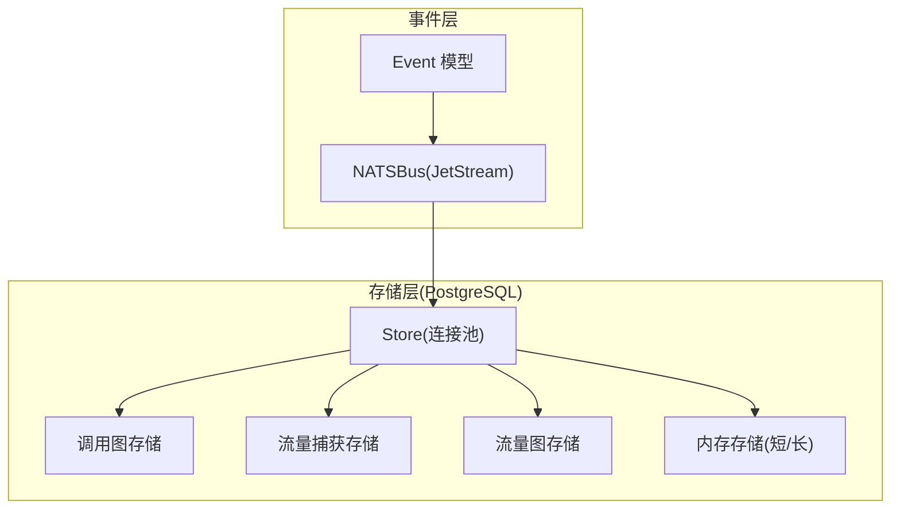
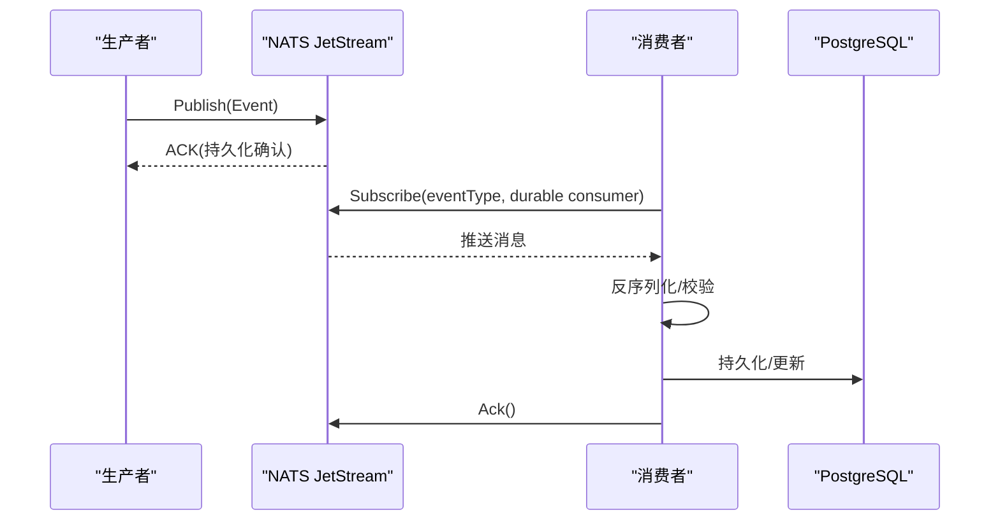
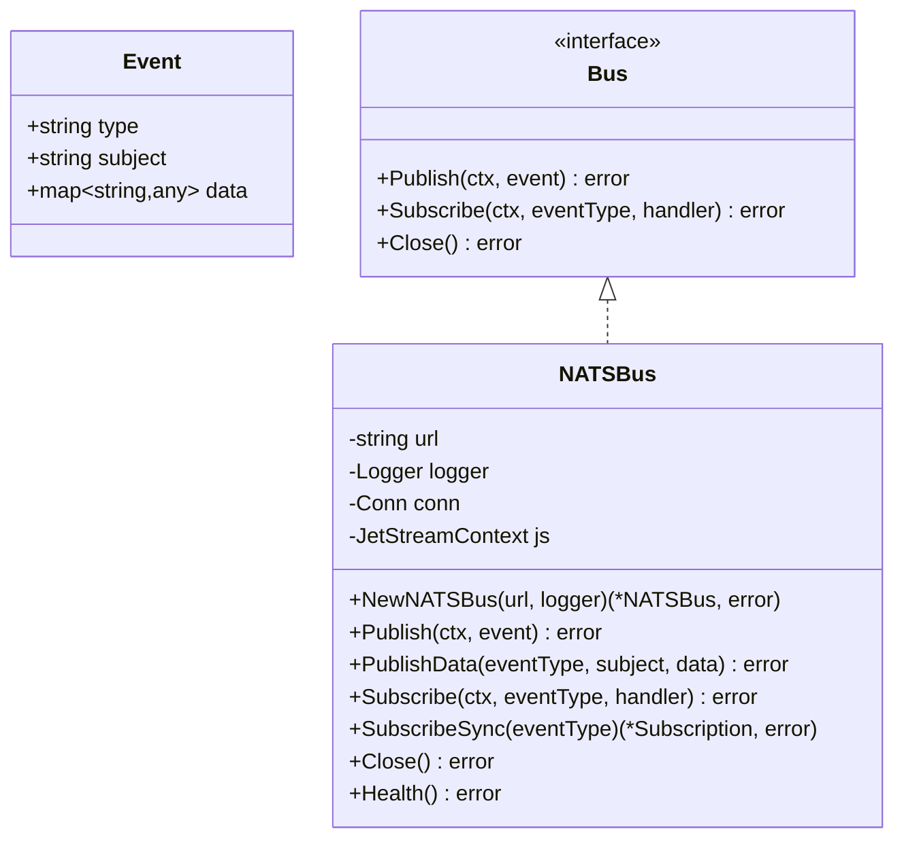
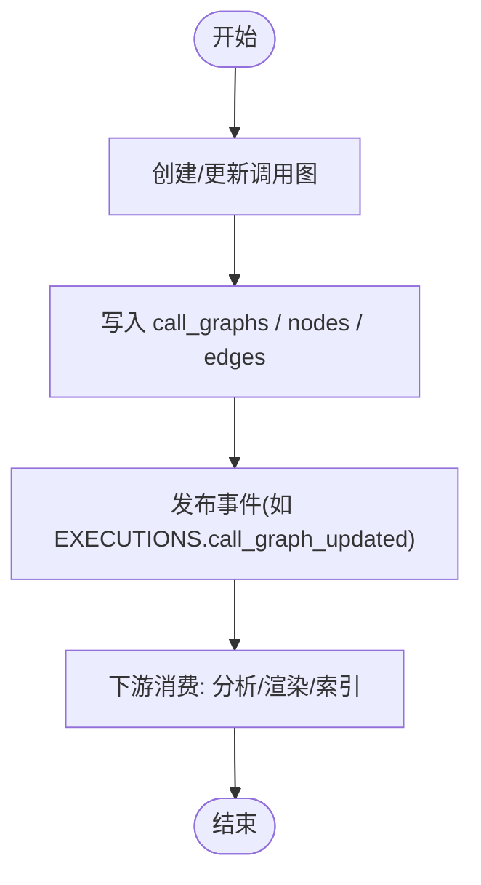
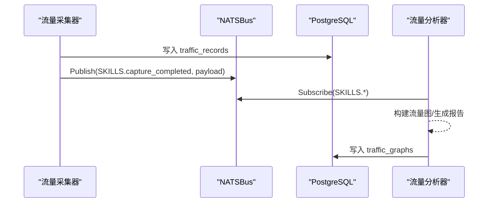
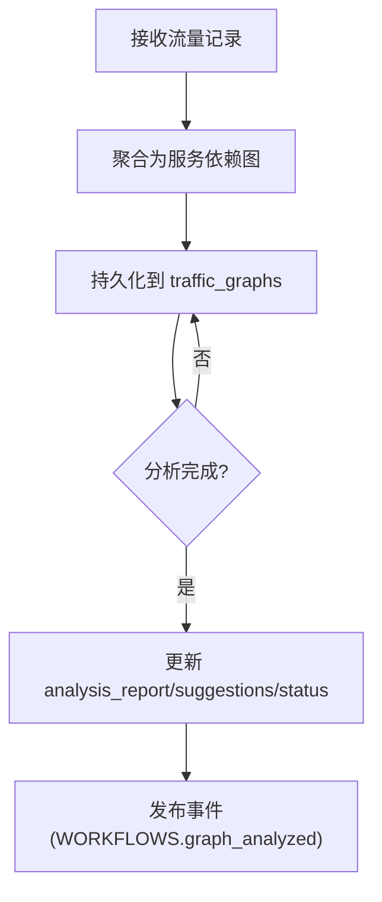
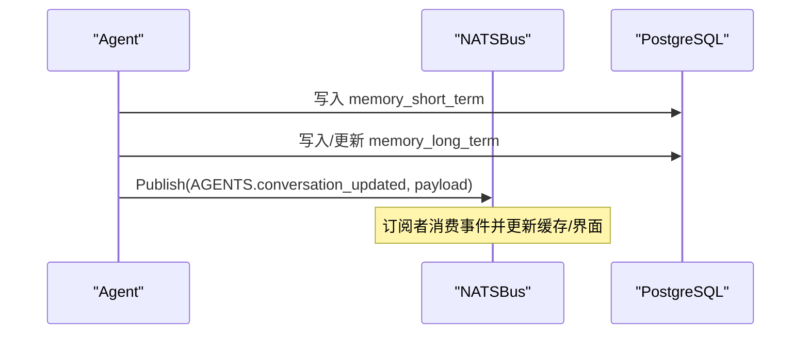
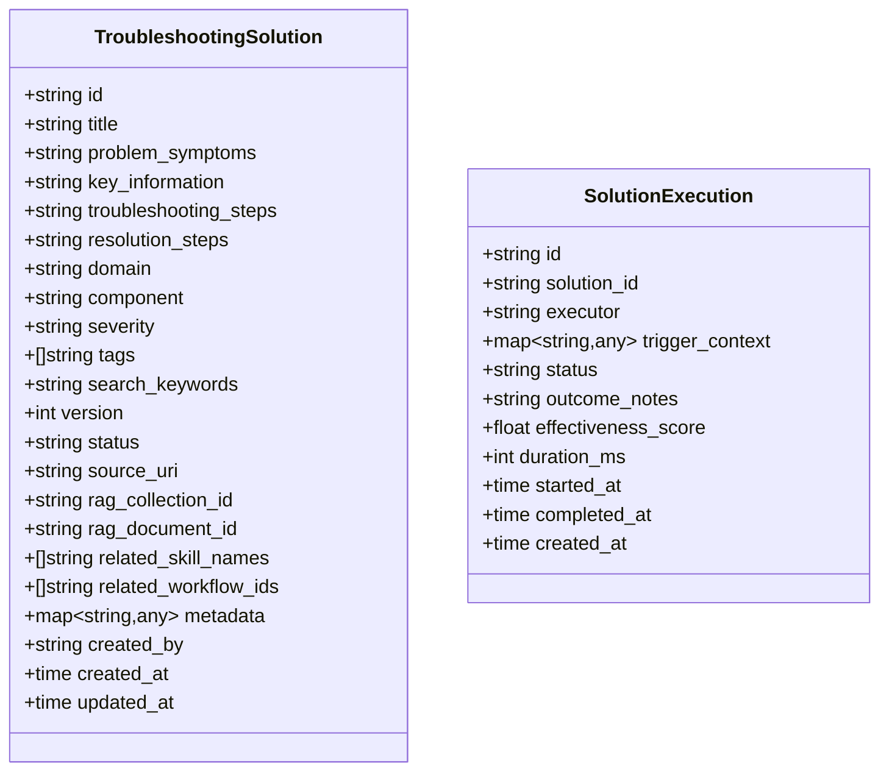
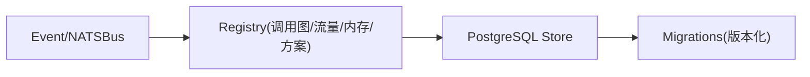

# 事件存储

<cite>
**本文引用的文件**
- [pkg/event/event.go](file://pkg/event/event.go)
- [pkg/event/nats.go](file://pkg/event/nats.go)
- [pkg/store/postgres/postgres.go](file://pkg/store/postgres/postgres.go)
- [pkg/store/postgres/call_graph_store.go](file://pkg/store/postgres/call_graph_store.go)
- [pkg/store/postgres/traffic_capture_store.go](file://pkg/store/postgres/traffic_capture_store.go)
- [pkg/store/postgres/traffic_graph_store.go](file://pkg/store/postgres/traffic_graph_store.go)
- [pkg/store/postgres/memory_store.go](file://pkg/store/postgres/memory_store.go)
- [pkg/registry/solution.go](file://pkg/registry/solution.go)
</cite>

## 目录
1. [简介](#简介)
2. [项目结构](#项目结构)
3. [核心组件](#核心组件)
4. [架构总览](#架构总览)
5. [详细组件分析](#详细组件分析)
6. [依赖关系分析](#依赖关系分析)
7. [性能考量](#性能考量)
8. [故障排查指南](#故障排查指南)
9. [结论](#结论)
10. [附录](#附录)

## 简介
本文件聚焦 ResolveAgent 的事件存储与事件总线机制，围绕基于 NATS JetStream 的异步事件流、持久化策略、事件溯源与审计追踪展开。文档覆盖四类关键事件的定义、序列化格式与存储结构：调用图事件、流量捕获事件、内存状态事件和解决方案事件；并说明事件订阅、重放与清理策略，以及事件驱动的数据更新与状态同步模式。

## 项目结构
事件系统由“事件模型 + 事件总线 + 存储层”构成：
- 事件模型：统一 Event 结构（类型、主体、数据）
- 事件总线：NATSBus 实现，基于 NATS JetStream 提供发布、订阅、持久化与重放能力
- 存储层：PostgreSQL 持久化各类业务实体（调用图、流量捕获、内存、流量图等），并通过迁移脚本管理数据库版本

**图表来源**
- [pkg/event/event.go:7-22](file://pkg/event/event.go#L7-L22)
- [pkg/event/nats.go:13-19](file://pkg/event/nats.go#L13-L19)
- [pkg/store/postgres/postgres.go:12-17](file://pkg/store/postgres/postgres.go#L12-L17)

**章节来源**
- [pkg/event/event.go:7-22](file://pkg/event/event.go#L7-L22)
- [pkg/event/nats.go:13-19](file://pkg/event/nats.go#L13-L19)
- [pkg/store/postgres/postgres.go:12-17](file://pkg/store/postgres/postgres.go#L12-L17)

## 核心组件
- 事件模型 Event：包含 type、subject、data，用于跨服务传递结构化事件载荷
- 事件总线 Bus 接口：定义 Publish、Subscribe、Close 契约，便于替换实现
- NATSBus：基于 NATS JetStream 的实现，提供：
  - 自动创建 Stream（AGENTS、SKILLS、WORKFLOWS、EXECUTIONS）
  - 持久化消息（FileStorage）、至少一次投递（ManualAck）
  - 命名消费者（Durable Consumer）支持重启后恢复
  - 健康检查与优雅关闭

**章节来源**
- [pkg/event/event.go:7-22](file://pkg/event/event.go#L7-L22)
- [pkg/event/nats.go:21-67](file://pkg/event/nats.go#L21-L67)
- [pkg/event/nats.go:69-96](file://pkg/event/nats.go#L69-L96)
- [pkg/event/nats.go:98-178](file://pkg/event/nats.go#L98-L178)
- [pkg/event/nats.go:186-201](file://pkg/event/nats.go#L186-L201)

## 架构总览
事件从生产者通过 NATSBus 发布到 JetStream，消费者以 Durable Consumer 订阅并处理，随后将结果写入 PostgreSQL 进行持久化。该模式天然支持事件溯源（所有变更以事件形式记录）与审计追踪（执行历史可查）。

**图表来源**
- [pkg/event/nats.go:98-178](file://pkg/event/nats.go#L98-L178)
- [pkg/store/postgres/postgres.go:102-105](file://pkg/store/postgres/postgres.go#L102-L105)

## 详细组件分析

### 事件模型与序列化
- Event 结构体：type、subject、data（任意键值对）
- 序列化：JSON 编码为字节流，通过 JetStream 发布
- 反序列化：消费者收到消息后解码为 map[string]interface{}，再构造 Event 对象交给业务处理器

**章节来源**
- [pkg/event/event.go:7-22](file://pkg/event/event.go#L7-L22)
- [pkg/event/nats.go:98-116](file://pkg/event/nats.go#L98-L116)
- [pkg/event/nats.go:135-178](file://pkg/event/nats.go#L135-L178)

### 事件总线（NATSBus）
- 连接与初始化：建立 NATS 连接，启用 JetStream，自动创建四个预置 Stream
- 发布：Publish/PublishData 两种 API，Subject 采用 {TYPE}.{ID} 模式
- 订阅：异步回调与同步拉取；使用 Durable Consumer 与 ManualAck，确保可靠性
- 生命周期：Health 检查、Close 释放资源

**图表来源**
- [pkg/event/event.go:7-22](file://pkg/event/event.go#L7-L22)
- [pkg/event/nats.go:13-19](file://pkg/event/nats.go#L13-L19)
- [pkg/event/nats.go:21-201](file://pkg/event/nats.go#L21-L201)

**章节来源**
- [pkg/event/nats.go:21-67](file://pkg/event/nats.go#L21-L67)
- [pkg/event/nats.go:69-96](file://pkg/event/nats.go#L69-L96)
- [pkg/event/nats.go:98-178](file://pkg/event/nats.go#L98-L178)
- [pkg/event/nats.go:186-201](file://pkg/event/nats.go#L186-L201)

### 调用图事件（Call Graph）
- 存储表：call_graphs、call_graph_nodes、call_graph_edges
- 操作：CRUD、批量添加节点/边、按入口节点递归查询子图
- 事件驱动：当调用图被创建或更新时，可通过事件总线发布 AGENTS.* 或 EXECUTIONS.* 事件，触发下游分析与可视化

**图表来源**
- [pkg/store/postgres/call_graph_store.go:21-121](file://pkg/store/postgres/call_graph_store.go#L21-L121)
- [pkg/store/postgres/call_graph_store.go:123-167](file://pkg/store/postgres/call_graph_store.go#L123-L167)
- [pkg/store/postgres/call_graph_store.go:244-318](file://pkg/store/postgres/call_graph_store.go#L244-L318)

**章节来源**
- [pkg/store/postgres/call_graph_store.go:21-121](file://pkg/store/postgres/call_graph_store.go#L21-L121)
- [pkg/store/postgres/call_graph_store.go:123-167](file://pkg/store/postgres/call_graph_store.go#L123-L167)
- [pkg/store/postgres/call_graph_store.go:169-242](file://pkg/store/postgres/call_graph_store.go#L169-L242)
- [pkg/store/postgres/call_graph_store.go:244-318](file://pkg/store/postgres/call_graph_store.go#L244-L318)

### 流量捕获事件（Traffic Capture）
- 存储表：traffic_captures、traffic_records
- 操作：创建捕获、批量写入记录、按服务过滤查询
- 事件驱动：捕获完成或记录入库后可发布 SKILLS.* 或 WORKFLOWS.* 事件，驱动后续流量图构建与分析

**图表来源**
- [pkg/store/postgres/traffic_capture_store.go:21-112](file://pkg/store/postgres/traffic_capture_store.go#L21-L112)
- [pkg/store/postgres/traffic_capture_store.go:114-210](file://pkg/store/postgres/traffic_capture_store.go#L114-L210)
- [pkg/event/nats.go:98-178](file://pkg/event/nats.go#L98-L178)

**章节来源**
- [pkg/store/postgres/traffic_capture_store.go:21-112](file://pkg/store/postgres/traffic_capture_store.go#L21-L112)
- [pkg/store/postgres/traffic_capture_store.go:114-210](file://pkg/store/postgres/traffic_capture_store.go#L114-L210)

### 流量图事件（Traffic Graph）
- 存储表：traffic_graphs
- 操作：创建、获取、列表、更新报告与建议、删除
- 事件驱动：分析完成后更新 status=analyzed，并发布相应事件供前端刷新或触发告警

**图表来源**
- [pkg/store/postgres/traffic_graph_store.go:21-160](file://pkg/store/postgres/traffic_graph_store.go#L21-L160)
- [pkg/event/nats.go:98-178](file://pkg/event/nats.go#L98-L178)

**章节来源**
- [pkg/store/postgres/traffic_graph_store.go:21-160](file://pkg/store/postgres/traffic_graph_store.go#L21-L160)

### 内存状态事件（Memory）
- 存储表：memory_short_term、memory_long_term
- 操作：会话消息追加、会话查询、长期记忆存取、过期清理
- 事件驱动：会话更新或长期记忆变更可发布 AGENTS.* 或 EXECUTIONS.* 事件，驱动 UI 实时刷新或缓存失效

**图表来源**
- [pkg/store/postgres/memory_store.go:22-77](file://pkg/store/postgres/memory_store.go#L22-L77)
- [pkg/store/postgres/memory_store.go:113-272](file://pkg/store/postgres/memory_store.go#L113-L272)
- [pkg/event/nats.go:98-178](file://pkg/event/nats.go#L98-L178)

**章节来源**
- [pkg/store/postgres/memory_store.go:22-77](file://pkg/store/postgres/memory_store.go#L22-L77)
- [pkg/store/postgres/memory_store.go:113-272](file://pkg/store/postgres/memory_store.go#L113-L272)

### 解决方案事件（Troubleshooting Solution）
- 数据模型：TroubleshootingSolution、SolutionExecution
- 操作：创建、搜索、批量导入、执行记录与查询
- 事件驱动：方案创建/更新/执行可发布 WORKFLOWS.* 或 EXECUTIONS.* 事件，驱动知识库检索、技能推荐与流程编排

**图表来源**
- [pkg/registry/solution.go:11-74](file://pkg/registry/solution.go#L11-L74)

**章节来源**
- [pkg/registry/solution.go:11-74](file://pkg/registry/solution.go#L11-L74)
- [pkg/registry/solution.go:76-309](file://pkg/registry/solution.go#L76-L309)

## 依赖关系分析
- 事件层依赖 NATS JetStream 提供可靠的消息流与持久化
- 存储层依赖 PostgreSQL 提供强一致性与复杂查询能力
- 各 Registry 通过 Store 抽象访问数据库，屏蔽底层差异
- 事件与存储解耦：事件仅负责通知与溯源，实际状态落库由消费者完成

**图表来源**
- [pkg/event/nats.go:69-96](file://pkg/event/nats.go#L69-L96)
- [pkg/store/postgres/postgres.go:107-490](file://pkg/store/postgres/postgres.go#L107-L490)

**章节来源**
- [pkg/event/nats.go:69-96](file://pkg/event/nats.go#L69-L96)
- [pkg/store/postgres/postgres.go:107-490](file://pkg/store/postgres/postgres.go#L107-L490)

## 性能考量
- JetStream Stream 保留策略：默认 MaxAge 24 小时，避免无限增长；可根据业务调整
- 连接池配置：PostgreSQL 连接池大小与空闲策略已内置，可按负载调优
- 批量写入：调用图节点/边、流量记录等采用事务批量插入，降低 IO 次数
- 分页与索引：列表查询均支持 limit/offset，并在常用字段建索引以提升性能
- 消费者可靠性：ManualAck + Durable Consumer 保证至少一次投递，适合高可用场景

[本节为通用指导，不直接分析具体文件]

## 故障排查指南
- 发布失败：检查 NATS 连接与 Stream 是否存在；关注 Publish 错误日志
- 订阅失败：确认 Subject 模式匹配、Consumer 名称唯一性；查看 Subscribe 错误
- 反序列化失败：消费者收到非 JSON 消息会 Nak 并重投；检查上游序列化逻辑
- 数据库异常：检查 Health 与 Migrate 是否成功；核对表结构与索引
- 数据不一致：通过事件溯源（JetStream 重放）与数据库审计记录定位问题

**章节来源**
- [pkg/event/nats.go:98-178](file://pkg/event/nats.go#L98-L178)
- [pkg/store/postgres/postgres.go:64-84](file://pkg/store/postgres/postgres.go#L64-L84)
- [pkg/store/postgres/postgres.go:107-490](file://pkg/store/postgres/postgres.go#L107-L490)

## 结论
ResolveAgent 的事件存储体系以 NATS JetStream 为核心，结合 PostgreSQL 持久化，实现了高可靠、可扩展的事件驱动架构。通过统一的 Event 模型与 Bus 接口，系统能够灵活扩展新的事件类型与存储后端；借助 JetStream 的持久化与重放能力，天然支持事件溯源与审计追踪。针对调用图、流量捕获、内存状态与解决方案四类事件，提供了清晰的存储结构与处理流程，满足复杂业务场景下的数据更新与状态同步需求。

[本节为总结，不直接分析具体文件]

## 附录

### 事件流处理与事件溯源
- 事件溯源：所有状态变更以事件形式记录在 JetStream，支持按时间顺序回放
- 审计追踪：结合 PostgreSQL 的审计表（如 hook_executions）与事件日志，形成完整审计链

**章节来源**
- [pkg/event/nats.go:69-96](file://pkg/event/nats.go#L69-L96)
- [pkg/store/postgres/postgres.go:207-245](file://pkg/store/postgres/postgres.go#L207-L245)

### 事件订阅机制、重放与清理策略
- 订阅机制：异步回调与同步拉取；Durable Consumer 保障重启后继续消费
- 重放：利用 JetStream 的 Stream 持久化，可从指定偏移或时间点重放
- 清理：MaxAge 控制消息保留时长；必要时可配合外部任务清理过期数据

**章节来源**
- [pkg/event/nats.go:135-178](file://pkg/event/nats.go#L135-L178)
- [pkg/event/nats.go:69-96](file://pkg/event/nats.go#L69-L96)

### 结合实际业务场景的事件驱动更新
- 调用图更新：创建/更新后发布事件，下游服务重建索引与视图
- 流量捕获完成：发布事件触发流量图构建与分析，更新分析报告
- 内存会话变更：发布事件使 UI 实时刷新对话上下文
- 解决方案执行：发布事件驱动知识库检索与技能推荐，联动工作流执行

**章节来源**
- [pkg/store/postgres/call_graph_store.go:21-121](file://pkg/store/postgres/call_graph_store.go#L21-L121)
- [pkg/store/postgres/traffic_capture_store.go:21-112](file://pkg/store/postgres/traffic_capture_store.go#L21-L112)
- [pkg/store/postgres/traffic_graph_store.go:21-160](file://pkg/store/postgres/traffic_graph_store.go#L21-L160)
- [pkg/store/postgres/memory_store.go:22-77](file://pkg/store/postgres/memory_store.go#L22-L77)
- [pkg/registry/solution.go:11-74](file://pkg/registry/solution.go#L11-L74)