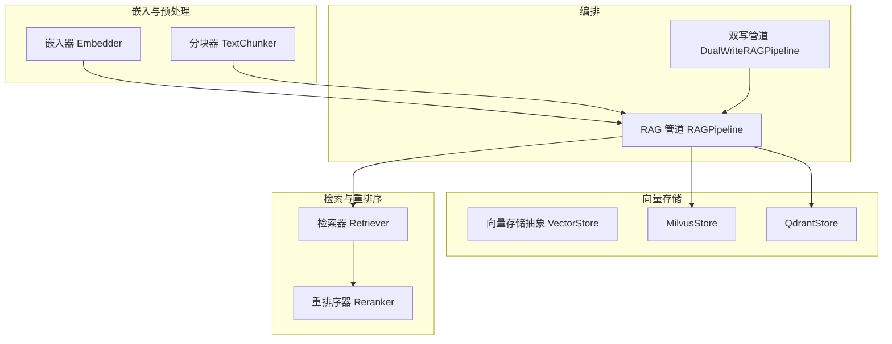
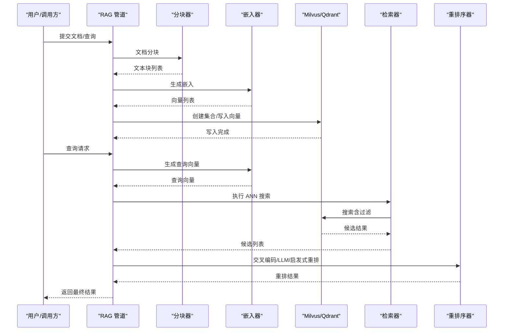
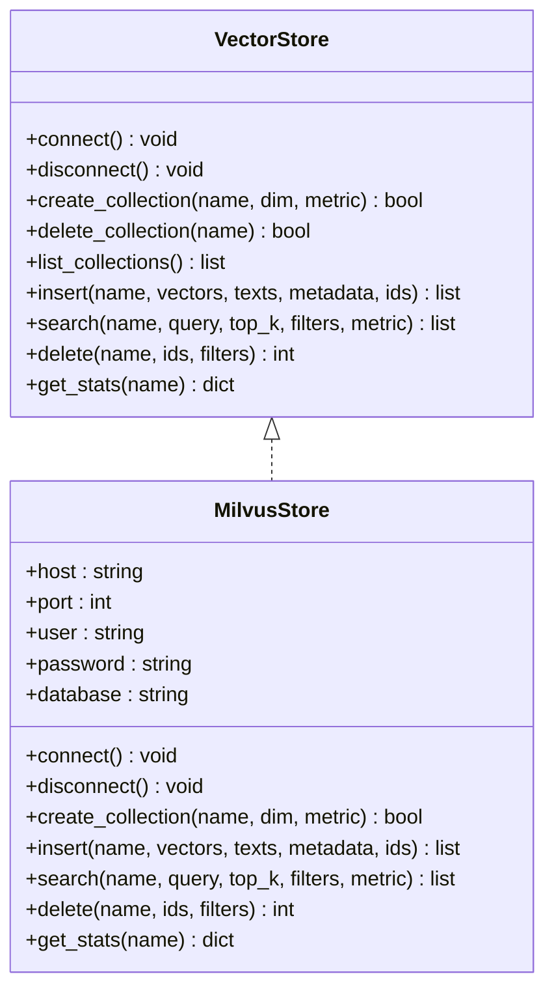
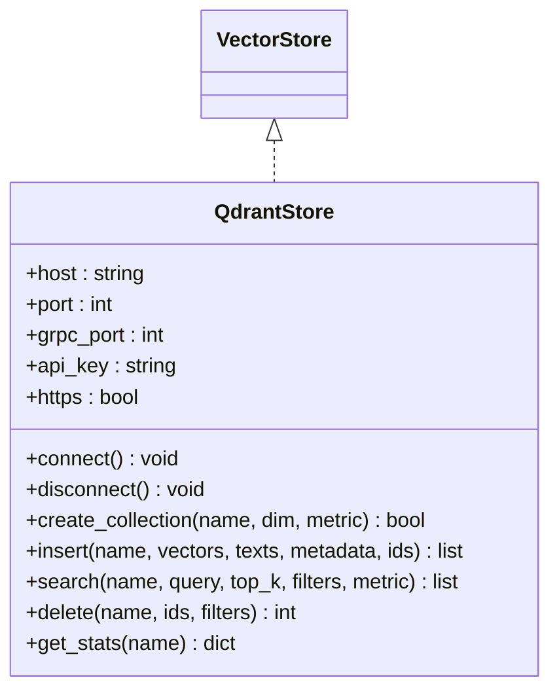
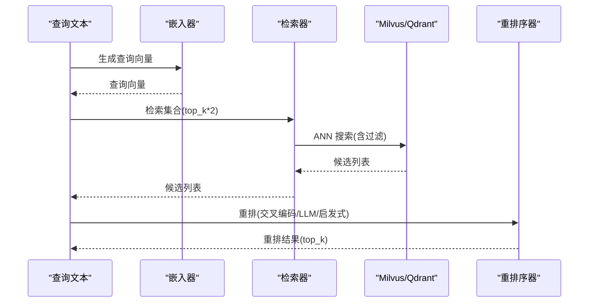
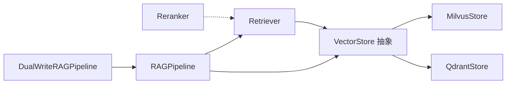

# 向量存储

<cite>
**本文引用的文件**
- [milvus.py](file://python/src/resolveagent/rag/index/milvus.py)
- [qdrant.py](file://python/src/resolveagent/rag/index/qdrant.py)
- [base.py](file://python/src/resolveagent/rag/index/base.py)
- [retriever.py](file://python/src/resolveagent/rag/retrieve/retriever.py)
- [embedder.py](file://python/src/resolveagent/rag/ingest/embedder.py)
- [pipeline.py](file://python/src/resolveagent/rag/pipeline.py)
- [dual_writer.py](file://python/src/resolveagent/rag/dual_writer.py)
- [configuration.md](file://docs/zh/configuration.md)
- [resolveagent.yaml](file://configs/resolveagent.yaml)
- [importer.py](file://python/src/resolveagent/corpus/importer.py)
</cite>

## 目录
1. [简介](#简介)
2. [项目结构](#项目结构)
3. [核心组件](#核心组件)
4. [架构总览](#架构总览)
5. [详细组件分析](#详细组件分析)
6. [依赖分析](#依赖分析)
7. [性能考虑](#性能考虑)
8. [故障排查指南](#故障排查指南)
9. [结论](#结论)
10. [附录](#附录)

## 简介
本章节面向 ResolveAgent 项目的向量存储能力，系统性阐述 Milvus 与 Qdrant 两种向量数据库的集成方式、配置要点、索引与检索策略、嵌入生成流程、批量导入机制、查询优化与近似最近邻（ANN）搜索、以及在 RAG 管道中的最佳实践。文档同时覆盖元数据管理、存储格式、容量规划与故障处理建议，帮助读者在生产环境中稳定、高效地运行向量检索。

## 项目结构
ResolveAgent 的向量存储相关代码主要位于 Python 子模块中，围绕“嵌入生成—索引写入—相似检索—重排序”的 RAG 管道组织：
- 嵌入与分块：嵌入器负责将文本转为向量；分块器负责将长文本切分为适配嵌入模型的片段。
- 向量存储：抽象接口定义统一能力；Milvus 与 Qdrant 分别提供具体实现。
- 检索与重排序：检索器负责调用后端执行 ANN 搜索并返回候选；重排序器对候选进行交叉编码或 LLM/启发式打分，提升召回质量。
- 管道编排：RAG 管道串联上述组件，并支持双写模式以兼容历史集合。

图表来源
- [milvus.py:13-383](file://python/src/resolveagent/rag/index/milvus.py#L13-L383)
- [qdrant.py:13-395](file://python/src/resolveagent/rag/index/qdrant.py#L13-L395)
- [base.py:9-144](file://python/src/resolveagent/rag/index/base.py#L9-L144)
- [retriever.py:14-180](file://python/src/resolveagent/rag/retrieve/retriever.py#L14-L180)
- [embedder.py:14-169](file://python/src/resolveagent/rag/ingest/embedder.py#L14-L169)
- [pipeline.py:18-258](file://python/src/resolveagent/rag/pipeline.py#L18-L258)
- [dual_writer.py:22-162](file://python/src/resolveagent/rag/dual_writer.py#L22-L162)

章节来源
- [milvus.py:13-383](file://python/src/resolveagent/rag/index/milvus.py#L13-L383)
- [qdrant.py:13-395](file://python/src/resolveagent/rag/index/qdrant.py#L13-L395)
- [base.py:9-144](file://python/src/resolveagent/rag/index/base.py#L9-L144)
- [retriever.py:14-180](file://python/src/resolveagent/rag/retrieve/retriever.py#L14-L180)
- [embedder.py:14-169](file://python/src/resolveagent/rag/ingest/embedder.py#L14-L169)
- [pipeline.py:18-258](file://python/src/resolveagent/rag/pipeline.py#L18-L258)
- [dual_writer.py:22-162](file://python/src/resolveagent/rag/dual_writer.py#L22-L162)

## 核心组件
- 向量存储抽象接口：定义连接、集合管理、插入、搜索、删除、统计等统一方法，确保 Milvus 与 Qdrant 可互换替换。
- Milvus 实现：基于 pymilvus 客户端，支持集合创建、索引参数配置、向量插入、过滤搜索、统计查询等。
- Qdrant 实现：基于 qdrant-client，支持集合创建、向量批量 upsert、payload 过滤搜索、统计查询等。
- 检索器：根据后端类型动态选择 Milvus 或 Qdrant，封装检索流程，支持元数据过滤与指标类型控制。
- 嵌入器：支持多种模型维度，通过 HTTP 客户端调用外部嵌入服务，具备批处理与错误回退能力。
- RAG 管道：串联分块、嵌入、索引与检索、重排序，提供文档级编排与状态持久化。
- 双写管道：在保持主集合的同时，向历史集合做“尽力而为”的二次写入，保障兼容性。

章节来源
- [base.py:9-144](file://python/src/resolveagent/rag/index/base.py#L9-L144)
- [milvus.py:13-383](file://python/src/resolveagent/rag/index/milvus.py#L13-L383)
- [qdrant.py:13-395](file://python/src/resolveagent/rag/index/qdrant.py#L13-L395)
- [retriever.py:14-180](file://python/src/resolveagent/rag/retrieve/retriever.py#L14-L180)
- [embedder.py:14-169](file://python/src/resolveagent/rag/ingest/embedder.py#L14-L169)
- [pipeline.py:18-258](file://python/src/resolveagent/rag/pipeline.py#L18-L258)
- [dual_writer.py:22-162](file://python/src/resolveagent/rag/dual_writer.py#L22-L162)

## 架构总览
下图展示了从文档到向量检索的整体流程，涵盖嵌入生成、集合创建、批量写入、检索与重排序：

图表来源
- [pipeline.py:44-258](file://python/src/resolveagent/rag/pipeline.py#L44-L258)
- [embedder.py:51-169](file://python/src/resolveagent/rag/ingest/embedder.py#L51-L169)
- [milvus.py:81-316](file://python/src/resolveagent/rag/index/milvus.py#L81-L316)
- [qdrant.py:87-320](file://python/src/resolveagent/rag/index/qdrant.py#L87-L320)
- [retriever.py:53-113](file://python/src/resolveagent/rag/retrieve/retriever.py#L53-L113)
- [reranker.py:97-135](file://python/src/resolveagent/rag/retrieve/reranker.py#L97-L135)

## 详细组件分析

### Milvus 集成
- 连接与认证：支持用户名/密码与数据库名指定，连接成功后记录日志。
- 集合管理：自动检测集合是否存在；创建 schema 包含主键、向量字段、文本字段与 JSON 元数据；默认创建 IVF_FLAT 索引。
- 插入与批量：校验向量与文本长度一致；自动生成 UUID 主键；支持传入自定义元数据；返回插入 ID 列表。
- 搜索与过滤：支持元数据过滤表达式拼装；加载集合后再搜索；输出包含 id、text、metadata、score 的标准化结果。
- 删除与统计：支持按 ID 删除；统计接口返回行数等信息。

图表来源
- [base.py:9-144](file://python/src/resolveagent/rag/index/base.py#L9-L144)
- [milvus.py:13-383](file://python/src/resolveagent/rag/index/milvus.py#L13-L383)

章节来源
- [milvus.py:51-383](file://python/src/resolveagent/rag/index/milvus.py#L51-L383)

### Qdrant 集成
- 连接与认证：支持 HTTP/gRPC、API Key、HTTPS；连接前会列举集合验证连通性。
- 集合管理：映射 metric 类型到距离枚举；若集合不存在则创建向量配置。
- 插入与批量：使用 Point 结构体携带 payload；按批次 upsert，避免单次过大。
- 搜索与过滤：构造 Filter/FieldCondition；返回带 payload 的结果并剥离文本字段。
- 删除与统计：支持按 ID 列表删除；按过滤条件删除；统计返回点数与向量计数。

图表来源
- [base.py:9-144](file://python/src/resolveagent/rag/index/base.py#L9-L144)
- [qdrant.py:13-395](file://python/src/resolveagent/rag/index/qdrant.py#L13-L395)

章节来源
- [qdrant.py:51-395](file://python/src/resolveagent/rag/index/qdrant.py#L51-L395)

### 检索器与重排序器
- 检索器：根据后端类型创建 Milvus 或 Qdrant 实例；支持元数据过滤与指标类型；封装检索流程并记录日志。
- 重排序器：优先使用跨 encoder（sentence-transformers），其次 LLM 评分，最后启发式（词频+Jaccard）；支持多样性（MMR）增强。

图表来源
- [retriever.py:53-113](file://python/src/resolveagent/rag/retrieve/retriever.py#L53-L113)
- [reranker.py:97-135](file://python/src/resolveagent/rag/retrieve/reranker.py#L97-L135)
- [embedder.py:119-129](file://python/src/resolveagent/rag/ingest/embedder.py#L119-L129)

章节来源
- [retriever.py:14-180](file://python/src/resolveagent/rag/retrieve/retriever.py#L14-L180)
- [reranker.py:28-405](file://python/src/resolveagent/rag/retrieve/reranker.py#L28-L405)

### 嵌入器工作原理与批处理
- 支持多模型维度映射；通过 HTTP 客户端调用外部嵌入服务；具备批处理与错误回退（空 API Key 时返回零向量）。
- 提供整批嵌入与单条查询嵌入两类接口，便于流水线调用。

章节来源
- [embedder.py:14-169](file://python/src/resolveagent/rag/ingest/embedder.py#L14-L169)

### RAG 管道与双写机制
- RAG 管道：串联分块、嵌入、索引与检索、重排序；支持将文档元数据写入平台存储；提供查询入口。
- 双写管道：在主集合写入成功后，尝试向历史集合做“尽力而为”的二次写入，失败不阻断主流程。

章节来源
- [pipeline.py:18-258](file://python/src/resolveagent/rag/pipeline.py#L18-L258)
- [dual_writer.py:22-162](file://python/src/resolveagent/rag/dual_writer.py#L22-L162)

## 依赖分析
- 抽象层：VectorStore 抽象定义了所有后端一致的能力边界，MilvusStore 与 QdrantStore 实现该接口，保证上层调用无需感知后端差异。
- 检索层：Retriever 依赖 VectorStore 接口，通过工厂方法按配置选择后端；Reranker 作为第二阶段精排，独立于向量后端。
- 编排层：RAGPipeline 聚合分块、嵌入、索引与检索；DualWriteRAGPipeline 在其基础上扩展双写逻辑。
- 外部依赖：Milvus 使用 pymilvus，Qdrant 使用 qdrant-client；重排序器可选依赖 sentence-transformers；嵌入器依赖 httpx。

图表来源
- [base.py:9-144](file://python/src/resolveagent/rag/index/base.py#L9-L144)
- [milvus.py:13-383](file://python/src/resolveagent/rag/index/milvus.py#L13-L383)
- [qdrant.py:13-395](file://python/src/resolveagent/rag/index/qdrant.py#L13-L395)
- [retriever.py:14-180](file://python/src/resolveagent/rag/retrieve/retriever.py#L14-L180)
- [reranker.py:28-405](file://python/src/resolveagent/rag/retrieve/reranker.py#L28-L405)
- [pipeline.py:18-258](file://python/src/resolveagent/rag/pipeline.py#L18-L258)
- [dual_writer.py:22-162](file://python/src/resolveagent/rag/dual_writer.py#L22-L162)

## 性能考虑
- 索引与参数
  - Milvus：默认使用 IVF_FLAT 索引，可通过 nlist 控制倒排数量；nprobe 控制扫描的倒排桶数，影响精度与延迟的权衡。
  - Qdrant：HNSW 配置项（如 m、ef_construct）影响索引构建质量与内存占用；优化器配置（如 memmap_threshold）影响磁盘映射阈值。
- 搜索参数
  - top_k：检索阶段扩大倍数（如 2×）再重排，可提升召回质量。
  - 过滤：尽量使用高选择性的过滤条件，减少搜索空间。
- 批量写入
  - Milvus：单次写入批量较小，适合稳定流控；Qdrant：按固定批次 upsert，避免单次过大导致超时。
- 嵌入与网络
  - 嵌入器支持批处理与超时控制；在高并发场景建议限制并发与增加重试策略。
- 重排序成本
  - 交叉编码与 LLM 重排成本较高，建议仅对候选集做有限规模重排。

章节来源
- [milvus.py:128-140](file://python/src/resolveagent/rag/index/milvus.py#L128-L140)
- [qdrant.py:129-133](file://python/src/resolveagent/rag/index/qdrant.py#L129-L133)
- [retriever.py:53-113](file://python/src/resolveagent/rag/retrieve/retriever.py#L53-L113)
- [reranker.py:97-135](file://python/src/resolveagent/rag/retrieve/reranker.py#L97-L135)
- [embedder.py:131-152](file://python/src/resolveagent/rag/ingest/embedder.py#L131-L152)

## 故障排查指南
- 连接失败
  - Milvus：检查 host/port、认证信息与数据库名；确认 pymilvus 已安装。
  - Qdrant：检查 HTTP/gRPC 端口、API Key、HTTPS 设置；确认 qdrant-client 已安装。
- 写入异常
  - 向量与文本长度不匹配：确保 vectors 与 texts 长度一致。
  - 批量 upsert 失败：检查批次大小与网络超时；必要时降低批次或增加重试。
- 搜索异常
  - 未连接：先调用 connect 再执行搜索。
  - 过滤语法：Milvus 使用字符串表达式拼装；Qdrant 使用 Filter/FieldCondition。
- 重排失败
  - 交叉编码模型未安装：sentence-transformers 不可用时自动降级为 LLM 或启发式。
- 平台集成
  - 配置文件中未启用网关或路由不正确时，嵌入器可能无法访问外部服务；检查网关开关与路由配置。

章节来源
- [milvus.py:67-72](file://python/src/resolveagent/rag/index/milvus.py#L67-L72)
- [qdrant.py:73-78](file://python/src/resolveagent/rag/index/qdrant.py#L73-L78)
- [embedder.py:109-117](file://python/src/resolveagent/rag/ingest/embedder.py#L109-L117)
- [reranker.py:17-22](file://python/src/resolveagent/rag/retrieve/reranker.py#L17-L22)

## 结论
ResolveAgent 的向量存储以抽象接口为核心，兼容 Milvus 与 Qdrant，配合嵌入器、分块器、检索器与重排序器，形成完整的 RAG 管道。通过合理的索引参数、批量写入策略与重排机制，可在准确性与性能之间取得平衡。双写机制进一步保障了历史数据的平滑迁移与兼容性。建议在生产环境结合业务规模进行容量规划与参数调优，并建立完善的监控与告警体系。

## 附录

### 配置参考
- 向量存储后端与关键参数
  - Milvus：host/port、认证、索引类型（IVF_FLAT/HNSW）、nlist/nprobe、M/ef_construction/ef、连接池大小。
  - Qdrant：host/port/grpc_port、prefer_grpc、API Key、HNSW 参数、优化器配置。
- 平台配置
  - 网关开关、模型路由、负载均衡等配置位于平台配置文件中，需与向量存储后端协同部署。

章节来源
- [configuration.md:471-534](file://docs/zh/configuration.md#L471-L534)
- [resolveagent.yaml:27-63](file://configs/resolveagent.yaml#L27-L63)

### 数据流与存储格式
- 存储字段
  - 主键：UUID 字符串（Milvus/VDB 自增/自定义）
  - 向量：FLOAT_VECTOR（维度由嵌入模型决定）
  - 文本：VARCHAR（原始文本块）
  - 元数据：JSON（包含 chunk_index、total_chunks 等）
- 写入流程
  - 分块 → 嵌入 → 写入集合 → 统计与状态更新
- 查询流程
  - 查询文本 → 嵌入 → ANN 搜索 → 过滤 → 重排 → 返回

章节来源
- [milvus.py:117-121](file://python/src/resolveagent/rag/index/milvus.py#L117-L121)
- [qdrant.py:219-229](file://python/src/resolveagent/rag/index/qdrant.py#L219-L229)
- [pipeline.py:140-194](file://python/src/resolveagent/rag/pipeline.py#L140-L194)

### 多模态与混合检索
- 当前实现聚焦文本向量检索；若需多模态（如图文），可在 payload 中扩展多模态特征字段，并在过滤与重排阶段引入相应策略。
- 混合检索：结合关键词过滤与向量相似度，先用过滤缩小范围，再用向量搜索与重排提升相关性。

[本节为概念性说明，不直接分析具体文件]

### 最佳实践
- 索引选择：中小规模优先 IVF_FLAT；大规模/高精度需求可评估 HNSW；注意 nlist/nprobe 与 ef/ef_construction 的权衡。
- 写入策略：批量 upsert，控制单批大小；写入前校验维度一致性；失败重试与幂等设计。
- 查询优化：合理设置 top_k 扩大倍数；使用高选择性过滤；缓存热点查询向量。
- 容量规划：依据文档总量、平均 chunk 数与维度估算存储与索引开销；预留扩容空间。
- 故障处理：连接与网络异常、嵌入服务不可用、后端索引重建失败等场景均需有明确的降级与重试策略。

[本节为通用指导，不直接分析具体文件]