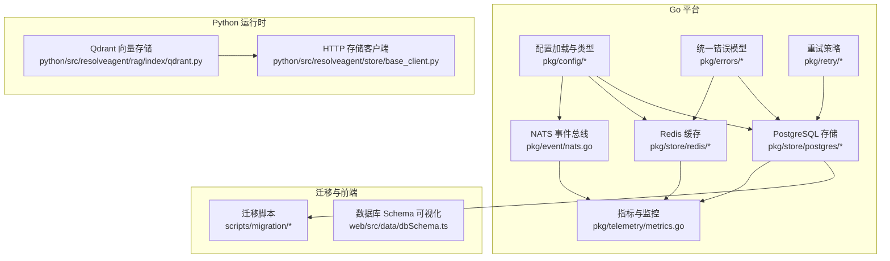
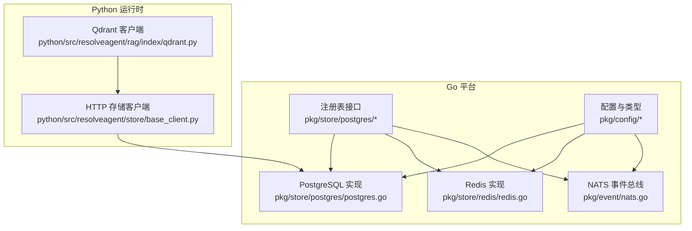
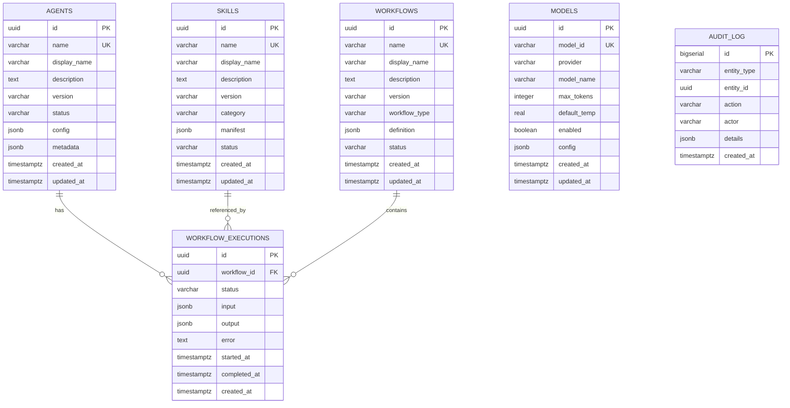
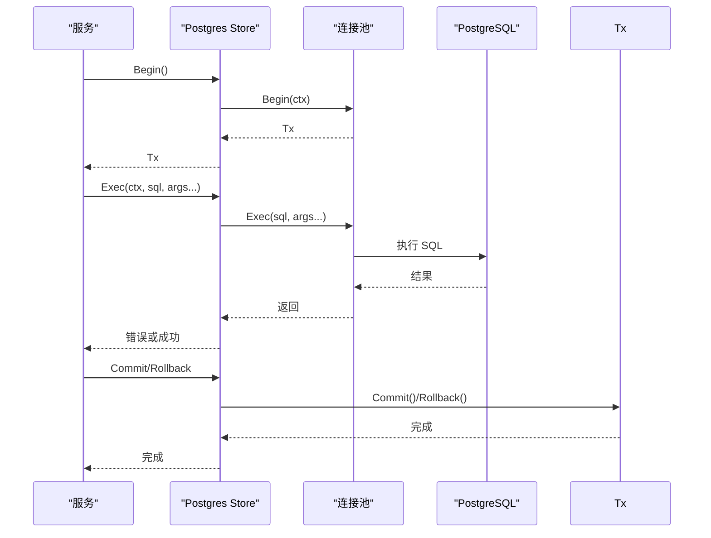
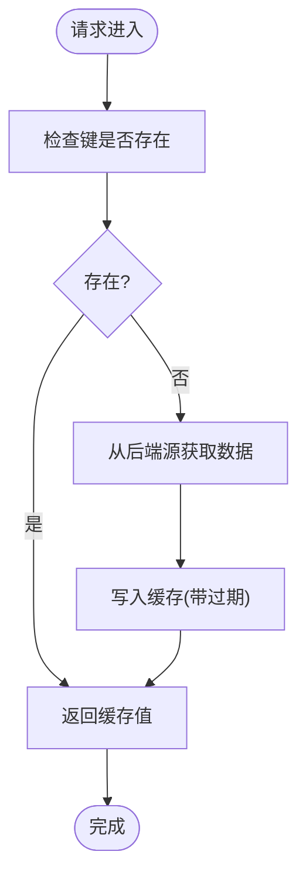
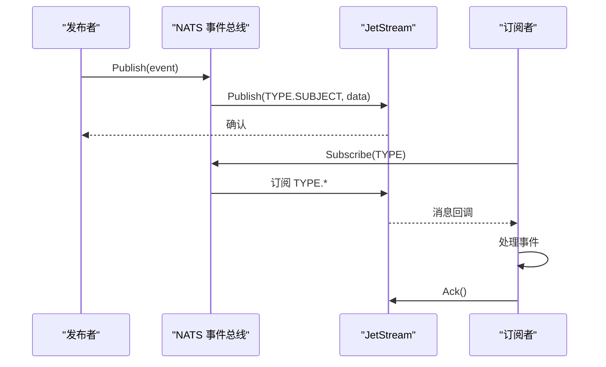
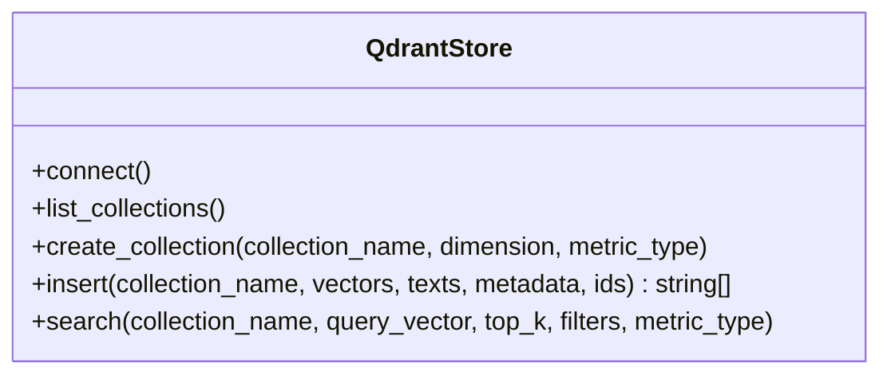
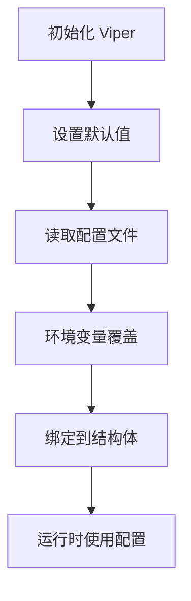
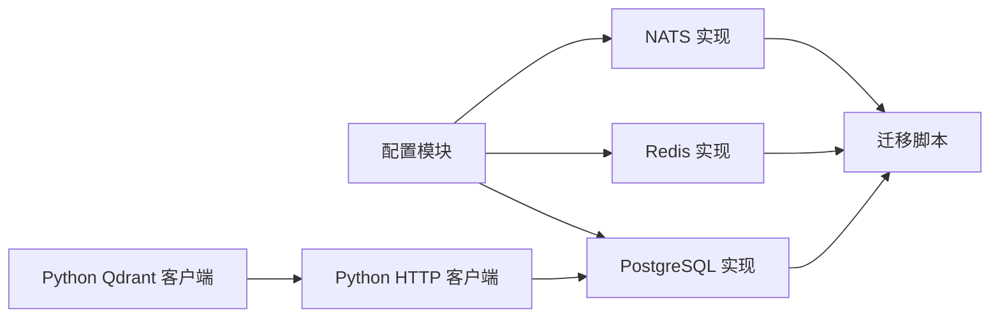

# 数据存储与管理

<cite>
**本文引用的文件**
- [pkg/store/postgres/postgres.go](file://pkg/store/postgres/postgres.go)
- [pkg/store/postgres/skill_store.go](file://pkg/store/postgres/skill_store.go)
- [pkg/store/redis/redis.go](file://pkg/store/redis/redis.go)
- [pkg/event/nats.go](file://pkg/event/nats.go)
- [python/src/resolveagent/rag/index/qdrant.py](file://python/src/resolveagent/rag/index/qdrant.py)
- [scripts/migration/001_init.up.sql](file://scripts/migration/001_init.up.sql)
- [scripts/migration/001_init.down.sql](file://scripts/migration/001_init.down.sql)
- [configs/resolveagent.yaml](file://configs/resolveagent.yaml)
- [pkg/config/config.go](file://pkg/config/config.go)
- [pkg/config/types.go](file://pkg/config/types.go)
- [pkg/store/store.go](file://pkg/store/store.go)
- [python/src/resolveagent/store/base_client.py](file://python/src/resolveagent/store/base_client.py)
- [web/src/data/dbSchema.ts](file://web/src/data/dbSchema.ts)
- [pkg/telemetry/metrics.go](file://pkg/telemetry/metrics.go)
- [pkg/errors/errors.go](file://pkg/errors/errors.go)
- [pkg/retry/retry.go](file://pkg/retry/retry.go)
</cite>

## 目录
1. [简介](#简介)
2. [项目结构](#项目结构)
3. [核心组件](#核心组件)
4. [架构总览](#架构总览)
5. [详细组件分析](#详细组件分析)
6. [依赖关系分析](#依赖关系分析)
7. [性能考量](#性能考量)
8. [故障排除指南](#故障排除指南)
9. [结论](#结论)
10. [附录](#附录)

## 简介
本文件系统性梳理 ResolveAgent 的数据存储与管理体系，覆盖数据库设计、缓存策略、事件存储、向量存储与迁移脚本管理，并解释数据访问模式、事务处理、性能优化与一致性保障机制。同时提供备份恢复策略、监控指标与故障排除指南，帮助开发者与运维人员高效理解与维护平台的数据层。

## 项目结构
数据相关能力主要分布在以下模块：
- Go 平台后端：PostgreSQL 存储、Redis 缓存、NATS 事件总线、配置加载与类型定义
- Python 运行时：向量存储（Qdrant）客户端、HTTP 存储客户端
- 迁移脚本：版本化数据库模式演进
- 前端：数据库模式可视化与 Schema 定义

图表来源
- [pkg/store/postgres/postgres.go:1-120](file://pkg/store/postgres/postgres.go#L1-L120)
- [pkg/store/redis/redis.go:1-116](file://pkg/store/redis/redis.go#L1-L116)
- [pkg/event/nats.go:1-201](file://pkg/event/nats.go#L1-L201)
- [pkg/config/config.go:1-47](file://pkg/config/config.go#L1-L47)
- [pkg/config/types.go:1-36](file://pkg/config/types.go#L1-L36)
- [python/src/resolveagent/rag/index/qdrant.py:1-298](file://python/src/resolveagent/rag/index/qdrant.py#L1-L298)
- [python/src/resolveagent/store/base_client.py:1-93](file://python/src/resolveagent/store/base_client.py#L1-L93)
- [scripts/migration/001_init.up.sql:1-163](file://scripts/migration/001_init.up.sql#L1-L163)
- [web/src/data/dbSchema.ts:1-62](file://web/src/data/dbSchema.ts#L1-L62)

章节来源
- [pkg/store/postgres/postgres.go:1-120](file://pkg/store/postgres/postgres.go#L1-L120)
- [pkg/store/redis/redis.go:1-116](file://pkg/store/redis/redis.go#L1-L116)
- [pkg/event/nats.go:1-201](file://pkg/event/nats.go#L1-L201)
- [pkg/config/config.go:1-47](file://pkg/config/config.go#L1-L47)
- [pkg/config/types.go:1-36](file://pkg/config/types.go#L1-L36)
- [python/src/resolveagent/rag/index/qdrant.py:1-298](file://python/src/resolveagent/rag/index/qdrant.py#L1-L298)
- [python/src/resolveagent/store/base_client.py:1-93](file://python/src/resolveagent/store/base_client.py#L1-L93)
- [scripts/migration/001_init.up.sql:1-163](file://scripts/migration/001_init.up.sql#L1-L163)
- [web/src/data/dbSchema.ts:1-62](file://web/src/data/dbSchema.ts#L1-L62)

## 核心组件
- PostgreSQL 存储：基于连接池的通用数据持久化，支持迁移、健康检查与事务封装
- Redis 缓存：键值缓存与 TTL 管理，提供健康检查与基础 CRUD 操作
- NATS 事件总线：JetStream 流式事件发布订阅，支持流创建、消息确认与订阅生命周期
- 向量存储：Qdrant 客户端，支持集合管理、向量插入与相似度检索
- 配置管理：Viper 驱动的多源配置加载，支持默认值、环境变量与 YAML 文件
- 统一错误模型：结构化错误码与 HTTP 映射，便于可观测与排障
- 重试策略：指数退避、抖动与上下文取消的可配置重试

章节来源
- [pkg/store/postgres/postgres.go:1-120](file://pkg/store/postgres/postgres.go#L1-L120)
- [pkg/store/redis/redis.go:1-116](file://pkg/store/redis/redis.go#L1-L116)
- [pkg/event/nats.go:1-201](file://pkg/event/nats.go#L1-L201)
- [python/src/resolveagent/rag/index/qdrant.py:1-298](file://python/src/resolveagent/rag/index/qdrant.py#L1-L298)
- [pkg/config/config.go:1-47](file://pkg/config/config.go#L1-L47)
- [pkg/config/types.go:1-36](file://pkg/config/types.go#L1-L36)
- [pkg/errors/errors.go:1-131](file://pkg/errors/errors.go#L1-L131)
- [pkg/retry/retry.go:1-95](file://pkg/retry/retry.go#L1-L95)

## 架构总览
平台采用“单一真实来源”的后端 Go 层作为数据中枢，通过 HTTP 接口与 Python 运行时交互；同时结合 Redis 缓存、NATS 事件总线与 Qdrant 向量库，形成完整的数据与事件处理闭环。

图表来源
- [pkg/store/postgres/postgres.go:1-120](file://pkg/store/postgres/postgres.go#L1-L120)
- [pkg/store/redis/redis.go:1-116](file://pkg/store/redis/redis.go#L1-L116)
- [pkg/event/nats.go:1-201](file://pkg/event/nats.go#L1-L201)
- [pkg/config/config.go:1-47](file://pkg/config/config.go#L1-L47)
- [pkg/config/types.go:1-36](file://pkg/config/types.go#L1-L36)
- [python/src/resolveagent/store/base_client.py:1-93](file://python/src/resolveagent/store/base_client.py#L1-L93)
- [python/src/resolveagent/rag/index/qdrant.py:1-298](file://python/src/resolveagent/rag/index/qdrant.py#L1-L298)

## 详细组件分析

### PostgreSQL 数据库设计与访问模式
- 模式与扩展：使用独立 schema 与必要扩展，统一 search_path，确保跨迁移的一致性
- 核心表：注册表（agents、skills、workflows）、执行记录（workflow_executions）、模型注册（models）、审计日志（audit_log）
- 更新时间触发器：自动维护 updated_at 字段，减少重复逻辑
- 权限控制：对 schema 与序列授予最小权限，遵循安全基线
- 访问模式：连接池封装、健康检查、事务开始、查询/执行方法与迁移入口

图表来源
- [scripts/migration/001_init.up.sql:17-163](file://scripts/migration/001_init.up.sql#L17-L163)
- [web/src/data/dbSchema.ts:1-62](file://web/src/data/dbSchema.ts#L1-L62)

章节来源
- [scripts/migration/001_init.up.sql:1-163](file://scripts/migration/001_init.up.sql#L1-L163)
- [scripts/migration/001_init.down.sql:1-16](file://scripts/migration/001_init.down.sql#L1-L16)
- [web/src/data/dbSchema.ts:1-62](file://web/src/data/dbSchema.ts#L1-L62)

### PostgreSQL 访问与事务处理
- 连接池：最大并发、空闲时间等参数可调，Ping 健康检查
- 事务：Begin 返回 pgx.Tx，支持标准事务语义
- 查询：QueryRow/Query/Exec 分层抽象，避免 SQL 注入
- 迁移：内建 schema_migrations 表，按版本顺序执行 up/down

图表来源
- [pkg/store/postgres/postgres.go:102-120](file://pkg/store/postgres/postgres.go#L102-L120)

章节来源
- [pkg/store/postgres/postgres.go:1-120](file://pkg/store/postgres/postgres.go#L1-L120)

### Redis 缓存策略
- 连接与健康：Ping 检查、连接池大小可控
- 基础操作：Get/Set/Delete/Exists，支持过期时间
- 场景：会话缓存、轻量状态存储、热点数据加速

图表来源
- [pkg/store/redis/redis.go:81-116](file://pkg/store/redis/redis.go#L81-L116)

章节来源
- [pkg/store/redis/redis.go:1-116](file://pkg/store/redis/redis.go#L1-L116)

### 事件存储（NATS JetStream）
- 连接与初始化：自动创建流（AGENTS、SKILLS、WORKFLOWS、EXECUTIONS），设置主题与保留策略
- 发布：序列化事件数据，按类型.主题发布
- 订阅：手动确认，消费组持久化，支持同步订阅
- 健康：连接状态检查

图表来源
- [pkg/event/nats.go:98-178](file://pkg/event/nats.go#L98-L178)

章节来源
- [pkg/event/nats.go:1-201](file://pkg/event/nats.go#L1-L201)

### 向量存储集成（Qdrant）
- 连接：支持主机、端口、gRPC、API Key 与 HTTPS
- 集合管理：根据维度与距离度量创建集合，幂等判断存在性
- 插入：批量向量+文本+元数据，自动生成 ID
- 检索：过滤条件构建、TopK 搜索、返回分数与元数据

图表来源
- [python/src/resolveagent/rag/index/qdrant.py:13-298](file://python/src/resolveagent/rag/index/qdrant.py#L13-L298)

章节来源
- [python/src/resolveagent/rag/index/qdrant.py:1-298](file://python/src/resolveagent/rag/index/qdrant.py#L1-L298)

### 配置管理
- 加载：默认值 + 配置文件 + 环境变量，支持分层覆盖
- 类型：集中定义配置结构体，含数据库、Redis、NATS、网关、遥测与存储后端选择
- 存储后端：全局 backend 与按注册表覆盖，内存存储配置项

图表来源
- [pkg/config/config.go:10-47](file://pkg/config/config.go#L10-L47)
- [pkg/config/types.go:1-36](file://pkg/config/types.go#L1-L36)
- [configs/resolveagent.yaml:1-90](file://configs/resolveagent.yaml#L1-L90)

章节来源
- [pkg/config/config.go:1-47](file://pkg/config/config.go#L1-L47)
- [pkg/config/types.go:1-36](file://pkg/config/types.go#L1-L36)
- [configs/resolveagent.yaml:1-90](file://configs/resolveagent.yaml#L1-L90)

### 数据访问模式与一致性
- 事务边界：关键写入（如注册表更新）在事务中执行，失败回滚
- 触发器：统一 updated_at 更新，减少业务分散逻辑
- 唯一约束：名称唯一（agents/skills/workflows），避免歧义
- 健康检查：各存储组件提供 Health 方法，便于探活与熔断

章节来源
- [pkg/store/postgres/postgres.go:64-75](file://pkg/store/postgres/postgres.go#L64-L75)
- [pkg/store/redis/redis.go:57-68](file://pkg/store/redis/redis.go#L57-L68)
- [pkg/event/nats.go:195-201](file://pkg/event/nats.go#L195-L201)
- [scripts/migration/001_init.up.sql:129-153](file://scripts/migration/001_init.up.sql#L129-L153)

## 依赖关系分析
- Go 平台后端依赖配置模块加载数据库/Redis/NATS 地址；PostgreSQL/Redis 实现遵循统一 Store 接口；NATS 提供事件总线能力
- Python 运行时通过 HTTP 客户端访问 Go 平台存储 API；向量检索通过 Qdrant 客户端直连
- 迁移脚本与数据库模式强耦合，版本号决定执行顺序

图表来源
- [pkg/config/config.go:1-47](file://pkg/config/config.go#L1-L47)
- [pkg/store/postgres/postgres.go:1-120](file://pkg/store/postgres/postgres.go#L1-L120)
- [pkg/store/redis/redis.go:1-116](file://pkg/store/redis/redis.go#L1-L116)
- [pkg/event/nats.go:1-201](file://pkg/event/nats.go#L1-L201)
- [python/src/resolveagent/store/base_client.py:1-93](file://python/src/resolveagent/store/base_client.py#L1-L93)
- [python/src/resolveagent/rag/index/qdrant.py:1-298](file://python/src/resolveagent/rag/index/qdrant.py#L1-L298)
- [scripts/migration/001_init.up.sql:1-163](file://scripts/migration/001_init.up.sql#L1-L163)

章节来源
- [pkg/store/store.go:1-14](file://pkg/store/store.go#L1-L14)
- [python/src/resolveagent/store/base_client.py:1-93](file://python/src/resolveagent/store/base_client.py#L1-L93)

## 性能考量
- 连接池与并发：PostgreSQL 连接池上限与最小连接数需结合负载调优；Redis 连接池大小适配 QPS
- 索引与查询：迁移脚本已创建常用字段索引；复杂查询建议评估执行计划
- 事件吞吐：NATS JetStream 流数量与保留策略影响磁盘与内存占用
- 向量检索：Qdrant 集合参数（索引类型、度量、IVF/HNSW 参数）直接影响检索延迟与精度
- 指标监控：Prometheus 指标包括请求总量、时延分布、活跃请求数、代理执行计数与时延直方图

章节来源
- [pkg/store/postgres/postgres.go:43-48](file://pkg/store/postgres/postgres.go#L43-L48)
- [pkg/store/redis/redis.go:40-46](file://pkg/store/redis/redis.go#L40-L46)
- [pkg/event/nats.go:78-93](file://pkg/event/nats.go#L78-L93)
- [python/src/resolveagent/rag/index/qdrant.py:108-133](file://python/src/resolveagent/rag/index/qdrant.py#L108-L133)
- [pkg/telemetry/metrics.go:131-250](file://pkg/telemetry/metrics.go#L131-L250)

## 故障排除指南
- 连接失败
  - PostgreSQL：检查 DSN、网络连通、Ping 健康检查；查看迁移表是否正确创建
  - Redis：确认地址、密码、DB 选择；Ping 检查
  - NATS：确认 URL、JetStream 初始化、流创建
- 查询异常
  - 检查 SQL 语法与参数绑定；确认索引是否生效；观察事务是否正确提交/回滚
- 事件丢失/堆积
  - 检查消费者是否 ACK；确认流保留策略；关注磁盘空间
- 向量检索无结果
  - 确认集合存在且维度一致；检查过滤条件与 TopK 设置
- 错误码映射
  - 使用统一错误模型，HTTP 状态码与错误码映射便于定位问题

章节来源
- [pkg/store/postgres/postgres.go:35-62](file://pkg/store/postgres/postgres.go#L35-L62)
- [pkg/store/redis/redis.go:39-55](file://pkg/store/redis/redis.go#L39-L55)
- [pkg/event/nats.go:36-67](file://pkg/event/nats.go#L36-L67)
- [pkg/errors/errors.go:96-122](file://pkg/errors/errors.go#L96-L122)

## 结论
ResolveAgent 的数据层以 Go 平台为核心，结合 PostgreSQL、Redis、NATS 与 Qdrant，形成高可用、可观测、可扩展的数据与事件处理体系。通过版本化迁移、统一配置与错误模型，以及完善的监控指标，平台能够在复杂场景下保持稳定与可维护性。

## 附录

### 迁移脚本管理
- 版本命名：001_init、002_hooks、003_rag_documents 等，按顺序执行
- 上游/下游：每个版本包含 up.sql 与 down.sql，支持回滚
- 模式演进：新增表、索引、触发器与权限授权

章节来源
- [scripts/migration/001_init.up.sql:1-163](file://scripts/migration/001_init.up.sql#L1-L163)
- [scripts/migration/001_init.down.sql:1-16](file://scripts/migration/001_init.down.sql#L1-L16)

### 备份与恢复策略
- PostgreSQL
  - 使用逻辑备份工具进行定期全量与增量备份
  - 在停机窗口执行恢复验证，确保迁移脚本可逆
- Redis
  - RDB/AOF 持久化策略与周期快照；灾难恢复演练
- NATS
  - JetStream 文件存储的备份与异地复制；流配置备份
- 向量存储（Qdrant）
  - 集合元数据与向量数据的备份策略；索引重建流程

[本节为通用实践建议，不直接分析具体文件]

### 监控指标清单
- 请求级：请求总量、时延直方图、活跃请求数
- 业务级：代理执行次数与时延、错误率
- 系统级：Goroutines 数、堆内存分配、GC 次数
- 存储级：PostgreSQL 连接池使用情况、Redis 命中率、NATS 流大小

章节来源
- [pkg/telemetry/metrics.go:131-250](file://pkg/telemetry/metrics.go#L131-L250)