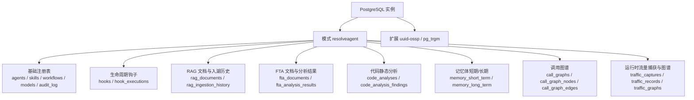
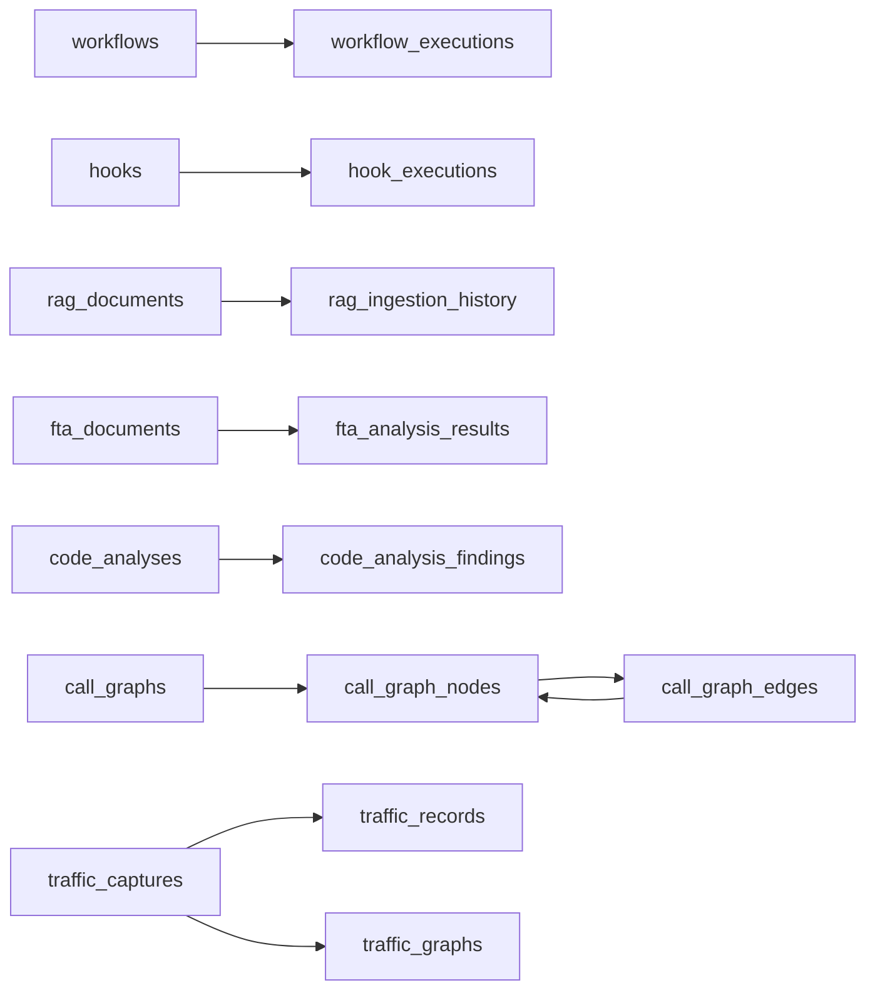

# 数据库设计

<cite>
**本文引用的文件**
- [scripts/migration/001_init.up.sql](file://scripts/migration/001_init.up.sql)
- [scripts/migration/001_init.down.sql](file://scripts/migration/001_init.down.sql)
- [deploy/docker/init-db.sql](file://deploy/docker/init-db.sql)
- [scripts/migration/002_hooks.up.sql](file://scripts/migration/002_hooks.up.sql)
- [scripts/migration/003_rag_documents.up.sql](file://scripts/migration/003_rag_documents.up.sql)
- [scripts/migration/004_fta_documents.up.sql](file://scripts/migration/004_fta_documents.up.sql)
- [scripts/migration/005_code_analysis.up.sql](file://scripts/migration/005_code_analysis.up.sql)
- [scripts/migration/006_memory.up.sql](file://scripts/migration/006_memory.up.sql)
- [scripts/migration/007_indexes.up.sql](file://scripts/migration/007_indexes.up.sql)
- [scripts/migration/008_call_graphs.up.sql](file://scripts/migration/008_call_graphs.up.sql)
- [scripts/migration/009_traffic_captures.up.sql](file://scripts/migration/009_traffic_captures.up.sql)
- [scripts/migration/010_traffic_graphs.up.sql](file://scripts/migration/010_traffic_graphs.up.sql)
- [scripts/seed/seed.sql](file://scripts/seed/seed.sql)
</cite>

## 目录
1. [简介](#简介)
2. [项目结构](#项目结构)
3. [核心组件](#核心组件)
4. [架构总览](#架构总览)
5. [详细组件分析](#详细组件分析)
6. [依赖分析](#依赖分析)
7. [性能考虑](#性能考虑)
8. [故障排查指南](#故障排查指南)
9. [结论](#结论)
10. [附录](#附录)

## 简介
本文件系统性阐述 ResolveAgent 项目的 PostgreSQL 数据库设计与实现，覆盖整体架构、表结构、关系模型、索引策略、数据完整性与并发控制、初始化与迁移管理、查询优化与性能调优、以及备份恢复方案。目标是帮助开发者与运维人员快速理解并高效维护数据库层。

## 项目结构
数据库层以“模式（Schema）+ 多表”的方式组织，采用迁移脚本驱动版本演进，并通过初始化脚本在首次启动时构建初始模式与基础表。核心模式为 resolveagent，所有业务表均位于该模式下；同时使用公共模式保留扩展与通用能力。

- 模式与扩展
  - 模式：resolveagent
  - 扩展：uuid-ossp、pg_trgm
- 初始化与迁移
  - 首次启动：deploy/docker/init-db.sql 自动执行
  - 正式环境：scripts/migration/*.up.sql/*.down.sql 通过迁移工具管理
- 权限与触发器
  - 授予 resolveagent 用户对模式与序列的全部权限
  - 统一的更新时间触发器 update_updated_at_column() 应用于多张表



图表来源
- [deploy/docker/init-db.sql:15-23](file://deploy/docker/init-db.sql#L15-L23)
- [scripts/migration/001_init.up.sql:7-15](file://scripts/migration/001_init.up.sql#L7-L15)

章节来源
- [deploy/docker/init-db.sql:1-171](file://deploy/docker/init-db.sql#L1-L171)
- [scripts/migration/001_init.up.sql:1-163](file://scripts/migration/001_init.up.sql#L1-L163)

## 核心组件
本节概述数据库中最重要的业务实体表及其职责与关键字段，便于快速定位与理解。

- 基础注册表
  - agents：智能体注册与配置
  - skills：技能注册与分类
  - workflows：工作流定义与状态
  - models：模型注册与默认参数
  - audit_log：审计日志
- 生命周期钩子
  - hooks：钩子定义与触发点
  - hook_executions：钩子执行记录
- RAG 文档
  - rag_documents：文档元数据与向量化标识
  - rag_ingestion_history：入湖历史与统计
- FTA 文档
  - fta_documents：FTA 树与元数据
  - fta_analysis_results：分析结果与度量
- 代码静态分析
  - code_analyses：分析任务与摘要
  - code_analysis_findings：具体问题发现
- 记忆体
  - memory_short_term：会话级对话历史
  - memory_long_term：跨会话知识与偏好
- 调用图谱
  - call_graphs：调用图元数据
  - call_graph_nodes：函数节点
  - call_graph_edges：调用关系边
- 运行时流量
  - traffic_captures：捕获会话元数据
  - traffic_records：单条流量记录
  - traffic_graphs：服务依赖图谱与报告

章节来源
- [scripts/migration/001_init.up.sql:20-106](file://scripts/migration/001_init.up.sql#L20-L106)
- [scripts/migration/002_hooks.up.sql:12-52](file://scripts/migration/002_hooks.up.sql#L12-L52)
- [scripts/migration/003_rag_documents.up.sql:13-52](file://scripts/migration/003_rag_documents.up.sql#L13-L52)
- [scripts/migration/004_fta_documents.up.sql:13-52](file://scripts/migration/004_fta_documents.up.sql#L13-L52)
- [scripts/migration/005_code_analysis.up.sql:13-60](file://scripts/migration/005_code_analysis.up.sql#L13-L60)
- [scripts/migration/006_memory.up.sql:14-53](file://scripts/migration/006_memory.up.sql#L14-L53)
- [scripts/migration/008_call_graphs.up.sql:5-57](file://scripts/migration/008_call_graphs.up.sql#L5-L57)
- [scripts/migration/009_traffic_captures.up.sql:5-52](file://scripts/migration/009_traffic_captures.up.sql#L5-L52)
- [scripts/migration/010_traffic_graphs.up.sql:4-27](file://scripts/migration/010_traffic_graphs.up.sql#L4-L27)

## 架构总览
数据库采用“统一模式 + JSONB 结构化存储 + 触发器自动维护时间戳”的架构风格，既保证了结构化数据的强约束，又保留了半结构化元数据的灵活性。核心表之间通过外键建立清晰的父子关系，配合索引提升查询性能。

```mermaid
erDiagram
AGENTS {
uuid id PK
varchar name UK
varchar display_name
text description
varchar version
varchar status
jsonb config
jsonb metadata
timestamptz created_at
timestamptz updated_at
}
SKILLS {
uuid id PK
varchar name UK
varchar display_name
text description
varchar version
varchar category
jsonb manifest
varchar status
timestamptz created_at
timestamptz updated_at
}
WORKFLOWS {
uuid id PK
varchar name UK
varchar display_name
text description
varchar version
varchar workflow_type
jsonb definition
varchar status
timestamptz created_at
timestamptz updated_at
}
MODELS {
uuid id PK
varchar model_id UK
varchar provider
varchar model_name
int max_tokens
float default_temp
bool enabled
jsonb config
timestamptz created_at
timestamptz updated_at
}
AUDIT_LOG {
bigserial id PK
varchar entity_type
uuid entity_id
varchar action
varchar actor
jsonb details
timestamptz created_at
}
WORKFLOW_EXECUTIONS {
uuid id PK
uuid workflow_id FK
varchar status
jsonb input
jsonb output
text error
timestamptz started_at
timestamptz completed_at
timestamptz created_at
}
AGENTS ||--o{ WORKFLOW_EXECUTIONS : "拥有"
WORKFLOWS ||--o{ WORKFLOW_EXECUTIONS : "定义"
HOOKS {
uuid id PK
varchar name UK
text description
varchar hook_type
varchar trigger_point
varchar target_id
int execution_order
varchar handler_type
jsonb config
bool enabled
jsonb labels
timestamptz created_at
timestamptz updated_at
}
HOOK_EXECUTIONS {
uuid id PK
uuid hook_id FK
varchar trigger_event
varchar target_entity_id
varchar status
jsonb input_data
jsonb output_data
text error
int duration_ms
timestamptz started_at
timestamptz completed_at
timestamptz created_at
}
HOOKS ||--o{ HOOK_EXECUTIONS : "触发"
RAG_DOCUMENTS {
uuid id PK
varchar collection_id
varchar title
varchar source_uri
varchar content_hash
varchar content_type
int chunk_count
text[] vector_ids
jsonb metadata
varchar status
bigint size_bytes
timestamptz created_at
timestamptz updated_at
}
RAG_INGESTION_HISTORY {
uuid id PK
varchar collection_id
uuid document_id FK
varchar action
varchar status
int chunks_processed
int vectors_created
text error
int duration_ms
jsonb metadata
timestamptz created_at
}
RAG_DOCUMENTS ||--o{ RAG_INGESTION_HISTORY : "被入湖"
FTA_DOCUMENTS {
uuid id PK
varchar workflow_id
varchar name
text description
jsonb fault_tree
int version
varchar status
jsonb metadata
jsonb labels
varchar created_by
timestamptz created_at
timestamptz updated_at
}
FTA_ANALYSIS_RESULTS {
uuid id PK
uuid document_id FK
uuid execution_id
bool top_event_result
jsonb minimal_cut_sets
jsonb basic_event_probabilities
jsonb gate_results
jsonb importance_measures
varchar status
int duration_ms
jsonb context
timestamptz created_at
}
FTA_DOCUMENTS ||--o{ FTA_ANALYSIS_RESULTS : "产生结果"
CODE_ANALYSES {
uuid id PK
varchar name
varchar repository_url
varchar branch
varchar commit_sha
varchar language
varchar analyzer_type
jsonb config
varchar status
jsonb summary
int duration_ms
jsonb labels
varchar triggered_by
timestamptz started_at
timestamptz completed_at
timestamptz created_at
timestamptz updated_at
}
CODE_ANALYSIS_FINDINGS {
uuid id PK
uuid analysis_id FK
varchar rule_id
varchar severity
varchar category
text message
varchar file_path
int line_start
int line_end
int column_start
int column_end
text snippet
text suggestion
jsonb metadata
timestamptz created_at
}
CODE_ANALYSES ||--o{ CODE_ANALYSIS_FINDINGS : "产出发现"
MEMORY_SHORT_TERM {
uuid id PK
varchar agent_id
varchar conversation_id
varchar role
text content
int token_count
jsonb metadata
int sequence_num
timestamptz created_at
unique(conversation_id, sequence_num)
}
MEMORY_LONG_TERM {
uuid id PK
varchar agent_id
varchar user_id
varchar memory_type
text content
float importance
int access_count
text[] source_conversations
varchar embedding_id
jsonb metadata
timestamptz expires_at
timestamptz last_accessed_at
timestamptz created_at
timestamptz updated_at
}
CALL_GRAPHS {
uuid id PK
uuid analysis_id FK
varchar repository_url
varchar branch
varchar language
varchar entry_point
int node_count
int edge_count
int max_depth
varchar status
jsonb graph_data
timestamptz created_at
timestamptz updated_at
}
CALL_GRAPH_NODES {
uuid id PK
uuid call_graph_id FK
varchar function_name
varchar file_path
int line_start
int line_end
varchar package
varchar node_type
jsonb metadata
}
CALL_GRAPH_EDGES {
uuid id PK
uuid call_graph_id FK
uuid caller_node_id FK
uuid callee_node_id FK
varchar call_type
int weight
jsonb metadata
}
CALL_GRAPHS ||--o{ CALL_GRAPH_NODES : "包含"
CALL_GRAPHS ||--o{ CALL_GRAPH_EDGES : "包含"
CALL_GRAPH_NODES ||--o{ CALL_GRAPH_EDGES : "连接"
TRAFFIC_CAPTURES {
uuid id PK
varchar name
varchar source_type
varchar target_service
timestamptz start_time
timestamptz end_time
varchar status
jsonb config
jsonb summary
jsonb labels
timestamptz created_at
timestamptz updated_at
}
TRAFFIC_RECORDS {
uuid id PK
uuid capture_id FK
varchar source_service
varchar dest_service
varchar protocol
varchar method
varchar path
int status_code
int latency_ms
int request_size
int response_size
varchar trace_id
varchar span_id
timestamptz timestamp
jsonb metadata
}
TRAFFIC_GRAPHS {
uuid id PK
uuid capture_id FK
varchar name
jsonb graph_data
jsonb nodes
jsonb edges
text analysis_report
jsonb suggestions
varchar status
timestamptz created_at
timestamptz updated_at
}
TRAFFIC_CAPTURES ||--o{ TRAFFIC_RECORDS : "产生记录"
TRAFFIC_CAPTURES ||--o{ TRAFFIC_GRAPHS : "生成图谱"
```

图表来源
- [scripts/migration/001_init.up.sql:20-124](file://scripts/migration/001_init.up.sql#L20-L124)
- [scripts/migration/002_hooks.up.sql:12-52](file://scripts/migration/002_hooks.up.sql#L12-L52)
- [scripts/migration/003_rag_documents.up.sql:13-52](file://scripts/migration/003_rag_documents.up.sql#L13-L52)
- [scripts/migration/004_fta_documents.up.sql:13-52](file://scripts/migration/004_fta_documents.up.sql#L13-L52)
- [scripts/migration/005_code_analysis.up.sql:13-60](file://scripts/migration/005_code_analysis.up.sql#L13-L60)
- [scripts/migration/006_memory.up.sql:14-53](file://scripts/migration/006_memory.up.sql#L14-L53)
- [scripts/migration/008_call_graphs.up.sql:5-57](file://scripts/migration/008_call_graphs.up.sql#L5-L57)
- [scripts/migration/009_traffic_captures.up.sql:5-52](file://scripts/migration/009_traffic_captures.up.sql#L5-L52)
- [scripts/migration/010_traffic_graphs.up.sql:4-27](file://scripts/migration/010_traffic_graphs.up.sql#L4-L27)

## 详细组件分析

### 基础注册表（agents、skills、workflows、models、audit_log）
- 设计理念
  - 使用 UUID 主键确保分布式一致性与可移植性
  - JSONB 字段承载灵活配置与元数据，减少频繁变更带来的 DDL 成本
  - 统一的 created_at/updated_at 由触发器自动维护，避免遗漏
- 关键约束
  - name 在 agents/skills/workflows 上唯一，保障命名空间内不冲突
  - model_id 在 models 上唯一，作为外部系统识别键
- 典型查询
  - 按状态过滤（如获取活跃 agents）
  - 按类别/类型筛选（如按 category 查询 skills）
  - 按 provider 快速定位可用模型

章节来源
- [scripts/migration/001_init.up.sql:20-124](file://scripts/migration/001_init.up.sql#L20-L124)

### 工作流执行（workflow_executions）
- 设计要点
  - 外键关联 workflows，删除工作流时级联清理执行记录
  - 输入输出使用 JSONB，便于承载复杂上下文
  - 时间戳字段支持执行生命周期追踪
- 索引策略
  - workflow_id 与 status 建有索引，便于批量调度与状态扫描

章节来源
- [scripts/migration/001_init.up.sql:77-95](file://scripts/migration/001_init.up.sql#L77-L95)

### 生命周期钩子（hooks、hook_executions）
- 设计要点
  - hooks 定义触发点、目标、顺序与处理器类型
  - hook_executions 记录每次执行的输入输出、错误与耗时
- 索引策略
  - trigger_point、enabled、target_id 等列建有索引，支持高效筛选与排序

章节来源
- [scripts/migration/002_hooks.up.sql:12-52](file://scripts/migration/002_hooks.up.sql#L12-L52)

### RAG 文档（rag_documents、rag_ingestion_history）
- 设计要点
  - rag_documents 存储文档元信息与向量化标识数组，便于检索系统定位
  - rag_ingestion_history 记录入湖过程的统计与错误，便于重试与审计
- 索引策略
  - collection_id、content_hash、status 等列建有索引，加速入湖与检索

章节来源
- [scripts/migration/003_rag_documents.up.sql:13-52](file://scripts/migration/003_rag_documents.up.sql#L13-L52)

### FTA 文档（fta_documents、fta_analysis_results）
- 设计要点
  - fta_documents 存放故障树 JSON 与元数据，支持版本化
  - fta_analysis_results 保存分析结果与度量，便于回溯与对比
- 索引策略
  - workflow_id、status 等列建有索引，支持按工作流与状态检索

章节来源
- [scripts/migration/004_fta_documents.up.sql:13-52](file://scripts/migration/004_fta_documents.up.sql#L13-L52)

### 代码静态分析（code_analyses、code_analysis_findings）
- 设计要点
  - code_analyses 记录分析任务与摘要，支持跨仓库/分支/语言
  - code_analysis_findings 以细粒度形式记录问题，便于展示与修复
- 索引策略
  - status、repository_url 等列建有索引，支持大规模扫描与筛选

章节来源
- [scripts/migration/005_code_analysis.up.sql:13-60](file://scripts/migration/005_code_analysis.up.sql#L13-L60)

### 记忆体（memory_short_term、memory_long_term）
- 设计要点
  - short-term：按 conversation_id + sequence_num 唯一，保证有序会话
  - long-term：支持重要性评分、访问计数、过期时间等，适配长期知识管理
- 索引策略
  - agent_id、user_id、memory_type、importance 等列建有索引，支持检索与排序

章节来源
- [scripts/migration/006_memory.up.sql:14-53](file://scripts/migration/006_memory.up.sql#L14-L53)

### 调用图谱（call_graphs、call_graph_nodes、call_graph_edges）
- 设计要点
  - 三层结构：图元数据、节点、边，支持复杂调用关系建模
  - graph_data 与 metadata 采用 JSONB，便于扩展
- 索引策略
  - analysis_id、graph_id、node_id、edge_id 等列建有索引，支持图遍历与查询

章节来源
- [scripts/migration/008_call_graphs.up.sql:5-57](file://scripts/migration/008_call_graphs.up.sql#L5-L57)

### 运行时流量（traffic_captures、traffic_records、traffic_graphs）
- 设计要点
  - traffic_captures 管理捕获会话；traffic_records 记录单条记录；traffic_graphs 生成服务依赖图谱
  - timestamp 字段用于时序分析与可视化
- 索引策略
  - status、source_type、capture_id、trace_id、timestamp 等列建有索引，支持高效检索

章节来源
- [scripts/migration/009_traffic_captures.up.sql:5-52](file://scripts/migration/009_traffic_captures.up.sql#L5-L52)
- [scripts/migration/010_traffic_graphs.up.sql:4-27](file://scripts/migration/010_traffic_graphs.up.sql#L4-L27)

## 依赖分析
- 外键关系
  - workflow_executions.workflows.id
  - hook_executions.hooks.id
  - rag_ingestion_history.rag_documents.id
  - fta_analysis_results.fta_documents.id
  - code_analysis_findings.code_analyses.id
  - call_graph_nodes.call_graphs.id
  - call_graph_edges.call_graphs.id
  - call_graph_edges.call_graph_nodes(id×2)
  - traffic_records.traffic_captures.id
  - traffic_graphs.traffic_captures.id
- 级联策略
  - 删除父表时，子表记录按需级联或置空，确保数据一致性与可追溯性
- 索引覆盖
  - 多表在高频查询列上建立索引，降低全表扫描概率



图表来源
- [scripts/migration/001_init.up.sql:77-95](file://scripts/migration/001_init.up.sql#L77-L95)
- [scripts/migration/002_hooks.up.sql:31-44](file://scripts/migration/002_hooks.up.sql#L31-L44)
- [scripts/migration/003_rag_documents.up.sql:32-44](file://scripts/migration/003_rag_documents.up.sql#L32-L44)
- [scripts/migration/004_fta_documents.up.sql:31-44](file://scripts/migration/004_fta_documents.up.sql#L31-L44)
- [scripts/migration/005_code_analysis.up.sql:36-52](file://scripts/migration/005_code_analysis.up.sql#L36-L52)
- [scripts/migration/008_call_graphs.up.sql:22-43](file://scripts/migration/008_call_graphs.up.sql#L22-L43)
- [scripts/migration/009_traffic_captures.up.sql:21-37](file://scripts/migration/009_traffic_captures.up.sql#L21-L37)
- [scripts/migration/010_traffic_graphs.up.sql:5-16](file://scripts/migration/010_traffic_graphs.up.sql#L5-L16)

## 性能考虑
- 索引策略
  - 针对高频过滤与排序列建立普通/条件/表达式索引，如 status、trigger_point、collection_id、trace_id 等
  - 对 JSONB 列可结合 GIN 索引（在需要时扩展），但当前脚本未显式创建，建议根据查询模式评估
- 查询优化
  - 使用 EXPLAIN/EXPLAIN ANALYZE 分析慢查询，优先利用现有索引
  - 避免 SELECT *，仅取必要列；对大 JSONB 字段按需投影
  - 合理分页与 LIMIT，避免一次性返回大量数据
- 并发与锁
  - 使用合适的隔离级别；长事务尽量缩短
  - 对写密集场景，考虑批量插入与事务合并
- 触发器与更新时间
  - 统一的 update_updated_at_column() 减少手工维护成本，但注意在高并发下的触发器开销

章节来源
- [scripts/migration/007_indexes.up.sql:9-50](file://scripts/migration/007_indexes.up.sql#L9-L50)
- [scripts/migration/001_init.up.sql:129-153](file://scripts/migration/001_init.up.sql#L129-L153)

## 故障排查指南
- 常见问题
  - 表不存在或模式未设置：确认 search_path 与 resolveagent 模式存在
  - 唯一约束冲突：检查 name/model_id 等唯一键是否重复
  - 外键约束失败：确认父表记录是否存在且状态允许
- 审计与回溯
  - 使用 audit_log 按 entity_type/entity_id 过滤操作记录
  - 结合 created_at 排序定位异常时间窗口
- 回滚与重试
  - 使用 down.sql 回滚到上一个版本
  - 对入湖/分析等可重试流程，结合历史表 status 与 error 字段进行重试

章节来源
- [scripts/migration/001_init.down.sql:7-16](file://scripts/migration/001_init.down.sql#L7-L16)
- [scripts/migration/003_rag_documents.up.sql:32-44](file://scripts/migration/003_rag_documents.up.sql#L32-L44)
- [scripts/migration/004_fta_documents.up.sql:31-44](file://scripts/migration/004_fta_documents.up.sql#L31-L44)
- [scripts/migration/005_code_analysis.up.sql:36-52](file://scripts/migration/005_code_analysis.up.sql#L36-L52)
- [scripts/migration/009_traffic_captures.up.sql:21-37](file://scripts/migration/009_traffic_captures.up.sql#L21-L37)

## 结论
本数据库设计以“模式化 + JSONB + 触发器”为核心，兼顾结构化约束与半结构化灵活性；通过完善的索引与外键关系，支撑从智能体、技能、工作流到代码分析、流量分析等全栈能力。建议在生产环境中结合监控与压测持续优化索引与查询计划，并制定规范化的迁移与备份策略。

## 附录

### 数据库初始化与迁移管理
- 初始化脚本
  - deploy/docker/init-db.sql：容器首次启动时自动执行，构建 resolveagent 模式与基础表
- 迁移脚本
  - scripts/migration/001_init.*.sql：基础注册表与审计日志
  - scripts/migration/002_hooks.*.sql：生命周期钩子
  - scripts/migration/003_rag_documents.*.sql：RAG 文档
  - scripts/migration/004_fta_documents.*.sql：FTA 文档
  - scripts/migration/005_code_analysis.*.sql：代码分析
  - scripts/migration/006_memory.*.sql：记忆体
  - scripts/migration/007_indexes.*.sql：性能索引
  - scripts/migration/008_call_graphs.*.sql：调用图谱
  - scripts/migration/009_traffic_captures.*.sql：流量捕获
  - scripts/migration/010_traffic_graphs.*.sql：流量图谱
- 种子数据
  - scripts/seed/seed.sql：默认模型与示例智能体

章节来源
- [deploy/docker/init-db.sql:1-171](file://deploy/docker/init-db.sql#L1-L171)
- [scripts/migration/001_init.up.sql:1-163](file://scripts/migration/001_init.up.sql#L1-L163)
- [scripts/migration/002_hooks.up.sql:1-52](file://scripts/migration/002_hooks.up.sql#L1-L52)
- [scripts/migration/003_rag_documents.up.sql:1-52](file://scripts/migration/003_rag_documents.up.sql#L1-L52)
- [scripts/migration/004_fta_documents.up.sql:1-52](file://scripts/migration/004_fta_documents.up.sql#L1-L52)
- [scripts/migration/005_code_analysis.up.sql:1-60](file://scripts/migration/005_code_analysis.up.sql#L1-L60)
- [scripts/migration/006_memory.up.sql:1-53](file://scripts/migration/006_memory.up.sql#L1-L53)
- [scripts/migration/007_indexes.up.sql:1-50](file://scripts/migration/007_indexes.up.sql#L1-L50)
- [scripts/migration/008_call_graphs.up.sql:1-57](file://scripts/migration/008_call_graphs.up.sql#L1-L57)
- [scripts/migration/009_traffic_captures.up.sql:1-52](file://scripts/migration/009_traffic_captures.up.sql#L1-L52)
- [scripts/migration/010_traffic_graphs.up.sql:1-27](file://scripts/migration/010_traffic_graphs.up.sql#L1-L27)
- [scripts/seed/seed.sql:1-24](file://scripts/seed/seed.sql#L1-L24)

### 版本演进路径
- 001：基础注册表与审计
- 002：生命周期钩子
- 003：RAG 文档
- 004：FTA 文档
- 005：代码静态分析
- 006：记忆体
- 007：性能索引
- 008：调用图谱
- 009：流量捕获
- 010：流量图谱

章节来源
- [scripts/migration/001_init.up.sql:1-163](file://scripts/migration/001_init.up.sql#L1-L163)
- [scripts/migration/002_hooks.up.sql:1-52](file://scripts/migration/002_hooks.up.sql#L1-L52)
- [scripts/migration/003_rag_documents.up.sql:1-52](file://scripts/migration/003_rag_documents.up.sql#L1-L52)
- [scripts/migration/004_fta_documents.up.sql:1-52](file://scripts/migration/004_fta_documents.up.sql#L1-L52)
- [scripts/migration/005_code_analysis.up.sql:1-60](file://scripts/migration/005_code_analysis.up.sql#L1-L60)
- [scripts/migration/006_memory.up.sql:1-53](file://scripts/migration/006_memory.up.sql#L1-L53)
- [scripts/migration/007_indexes.up.sql:1-50](file://scripts/migration/007_indexes.up.sql#L1-L50)
- [scripts/migration/008_call_graphs.up.sql:1-57](file://scripts/migration/008_call_graphs.up.sql#L1-L57)
- [scripts/migration/009_traffic_captures.up.sql:1-52](file://scripts/migration/009_traffic_captures.up.sql#L1-L52)
- [scripts/migration/010_traffic_graphs.up.sql:1-27](file://scripts/migration/010_traffic_graphs.up.sql#L1-L27)

### 查询优化建议
- 基于现有索引的查询模式
  - 按状态过滤：agents.status、workflows.status、hooks.enabled、rag_documents.status、fta_documents.status、code_analyses.status
  - 按名称/键过滤：agents.name、skills.name、workflows.name、models.model_id、fta_documents.workflow_id
  - 按时间范围：audit_log.created_at、traffic_records.timestamp
- 建议
  - 对高频聚合查询（如按 provider/trigger_point/source_type 分组）评估添加复合索引
  - 对 JSONB 列的键值查询，评估 GIN 索引收益

章节来源
- [scripts/migration/001_init.up.sql:33-34](file://scripts/migration/001_init.up.sql#L33-L34)
- [scripts/migration/001_init.up.sql:71-72](file://scripts/migration/001_init.up.sql#L71-L72)
- [scripts/migration/002_hooks.up.sql:10-12](file://scripts/migration/002_hooks.up.sql#L10-L12)
- [scripts/migration/003_rag_documents.up.sql:18-21](file://scripts/migration/003_rag_documents.up.sql#L18-L21)
- [scripts/migration/004_fta_documents.up.sql:14-25](file://scripts/migration/004_fta_documents.up.sql#L14-L25)
- [scripts/migration/005_code_analysis.up.sql:22-29](file://scripts/migration/005_code_analysis.up.sql#L22-L29)
- [scripts/migration/007_indexes.up.sql:9-50](file://scripts/migration/007_indexes.up.sql#L9-L50)

### 数据备份与恢复
- 备份
  - 使用逻辑备份工具导出 resolveagent 模式与数据，保留扩展与权限
  - 建议定期增量备份 + 周期性全量备份
- 恢复
  - 在新实例中先执行初始化脚本，再导入备份数据
  - 如需回滚，使用对应 down.sql 脚本

章节来源
- [deploy/docker/init-db.sql:1-171](file://deploy/docker/init-db.sql#L1-L171)
- [scripts/migration/001_init.down.sql:1-16](file://scripts/migration/001_init.down.sql#L1-L16)