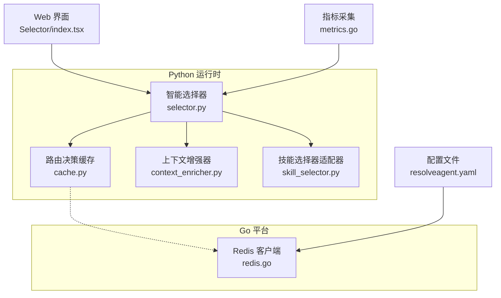
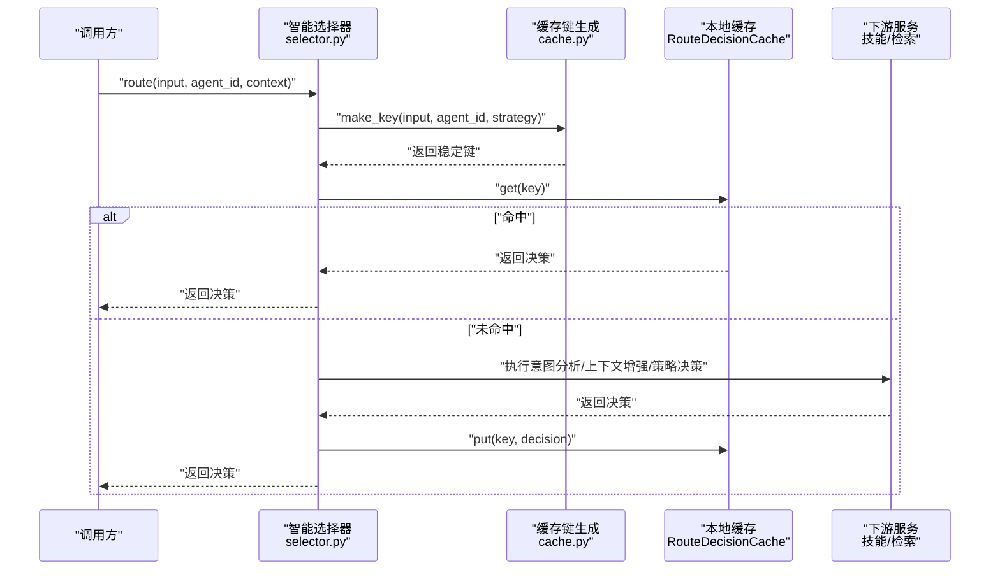
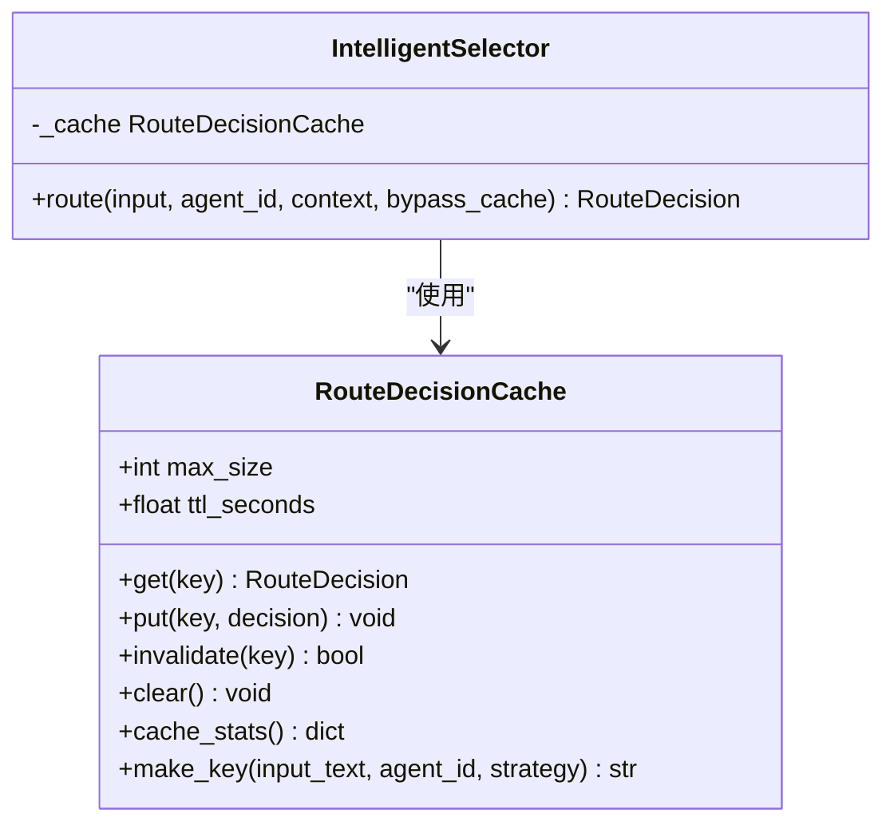
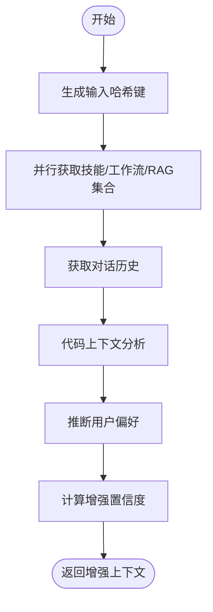
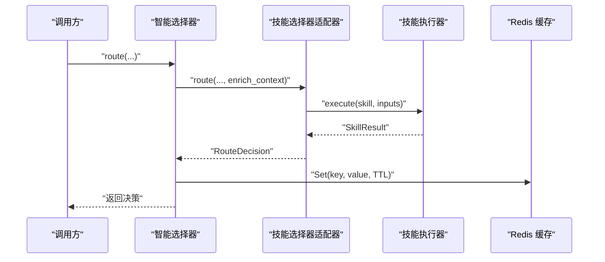
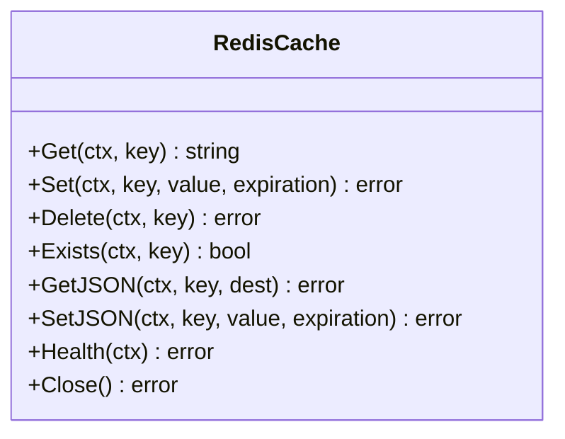
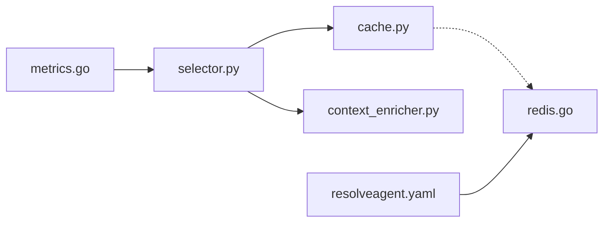

# 缓存策略

<cite>
**本文引用的文件**
- [python/src/resolveagent/selector/cache.py](file://python/src/resolveagent/selector/cache.py)
- [python/src/resolveagent/selector/selector.py](file://python/src/resolveagent/selector/selector.py)
- [python/src/resolveagent/selector/context_enricher.py](file://python/src/resolveagent/selector/context_enricher.py)
- [python/src/resolveagent/selector/skill_selector.py](file://python/src/resolveagent/selector/skill_selector.py)
- [pkg/store/redis/redis.go](file://pkg/store/redis/redis.go)
- [configs/resolveagent.yaml](file://configs/resolveagent.yaml)
- [pkg/telemetry/metrics.go](file://pkg/telemetry/metrics.go)
- [web/src/pages/Selector/index.tsx](file://web/src/pages/Selector/index.tsx)
- [python/tests/unit/test_selector_cache.py](file://python/tests/unit/test_selector_cache.py)
</cite>

## 目录
1. [简介](#简介)
2. [项目结构](#项目结构)
3. [核心组件](#核心组件)
4. [架构总览](#架构总览)
5. [详细组件分析](#详细组件分析)
6. [依赖分析](#依赖分析)
7. [性能考量](#性能考量)
8. [故障排查指南](#故障排查指南)
9. [结论](#结论)
10. [附录](#附录)

## 简介
本文件系统化阐述 ResolveAgent 的缓存策略，覆盖本地内存缓存与 Redis 分布式缓存两类实现，重点包括：
- 智能选择器缓存：基于 TTL 的 LRU 内存缓存，支持实例级与全局共享两种作用域
- 上下文增强器缓存：对输入文本进行哈希以生成稳定键，用于缓存增强后的上下文
- 技能执行结果缓存：通过统一的键空间与过期策略，避免重复执行高成本技能
- 命名规范与过期策略：明确键生成算法、TTL 设定与失效策略
- 防护与治理：缓存穿透、缓存雪崩、热点数据的应对方案
- 配置参数、性能监控与故障恢复：结合配置文件与指标体系给出落地建议

## 项目结构
ResolveAgent 的缓存相关能力分布在以下模块：
- Python 智能选择器与上下文增强器：负责路由决策缓存与上下文缓存
- Go Redis 客户端：提供分布式键值存储与 JSON 序列化能力
- 配置文件：定义 Redis 地址、数据库等基础连接参数
- Web 管理界面：展示缓存键、策略、容量与 TTL 等参数
- 测试用例：验证缓存命中、LRU 淘汰、TTL 过期与统计指标

图表来源
- [python/src/resolveagent/selector/selector.py:162-215](file://python/src/resolveagent/selector/selector.py#L162-L215)
- [python/src/resolveagent/selector/cache.py:20-97](file://python/src/resolveagent/selector/cache.py#L20-L97)
- [python/src/resolveagent/selector/context_enricher.py:201-256](file://python/src/resolveagent/selector/context_enricher.py#L201-L256)
- [python/src/resolveagent/selector/skill_selector.py:37-61](file://python/src/resolveagent/selector/skill_selector.py#L37-L61)
- [pkg/store/redis/redis.go:13-139](file://pkg/store/redis/redis.go#L13-L139)
- [configs/resolveagent.yaml:17-19](file://configs/resolveagent.yaml#L17-L19)
- [web/src/pages/Selector/index.tsx:203-229](file://web/src/pages/Selector/index.tsx#L203-L229)
- [pkg/telemetry/metrics.go:132-178](file://pkg/telemetry/metrics.go#L132-L178)

章节来源
- [python/src/resolveagent/selector/selector.py:162-215](file://python/src/resolveagent/selector/selector.py#L162-L215)
- [python/src/resolveagent/selector/cache.py:20-97](file://python/src/resolveagent/selector/cache.py#L20-L97)
- [pkg/store/redis/redis.go:13-139](file://pkg/store/redis/redis.go#L13-L139)
- [configs/resolveagent.yaml:17-19](file://configs/resolveagent.yaml#L17-L19)
- [web/src/pages/Selector/index.tsx:203-229](file://web/src/pages/Selector/index.tsx#L203-L229)
- [pkg/telemetry/metrics.go:132-178](file://pkg/telemetry/metrics.go#L132-L178)

## 核心组件
- 路由决策缓存（RouteDecisionCache）
  - 支持 TTL 过期与 LRU 淘汰，线程安全
  - 提供命中/未命中计数与命中率统计
  - 支持实例级与全局共享两种作用域
- 智能选择器（IntelligentSelector）
  - 在路由前根据输入、Agent ID 与策略生成稳定键，查询缓存
  - 可选择绕过缓存强制重新计算
- 上下文增强器（ContextEnricher）
  - 对输入文本进行 MD5 截断作为会话元数据键，便于缓存增强上下文
- Redis 缓存客户端（pkg/store/redis）
  - 提供 Get/Set/Delete/Exists 与 JSON 序列化封装
  - 支持健康检查与连接池配置
- 配置与监控
  - 配置文件定义 Redis 地址与数据库编号
  - 指标系统提供请求总量、时延、活跃请求数与代理执行统计

章节来源
- [python/src/resolveagent/selector/cache.py:20-97](file://python/src/resolveagent/selector/cache.py#L20-L97)
- [python/src/resolveagent/selector/selector.py:152-201](file://python/src/resolveagent/selector/selector.py#L152-L201)
- [python/src/resolveagent/selector/context_enricher.py:217-256](file://python/src/resolveagent/selector/context_enricher.py#L217-L256)
- [pkg/store/redis/redis.go:13-139](file://pkg/store/redis/redis.go#L13-L139)
- [configs/resolveagent.yaml:17-19](file://configs/resolveagent.yaml#L17-L19)
- [pkg/telemetry/metrics.go:132-178](file://pkg/telemetry/metrics.go#L132-L178)

## 架构总览
缓存架构分为三层：
- 本地内存层：智能选择器内置的 TTL-aware LRU 缓存，满足高频短生命周期决策的快速复用
- 分布式缓存层：Redis，用于跨进程/跨实例共享缓存，支撑全局作用域与持久化需求
- 数据与上下文层：上下文增强器与技能执行结果可作为缓存对象，采用稳定键绑定

图表来源
- [python/src/resolveagent/selector/selector.py:162-215](file://python/src/resolveagent/selector/selector.py#L162-L215)
- [python/src/resolveagent/selector/cache.py:36-70](file://python/src/resolveagent/selector/cache.py#L36-L70)

## 详细组件分析

### 智能选择器缓存（TTL-aware LRU）
- 键生成：使用输入文本、Agent ID 与策略三元组拼接后经 SHA-256 得到稳定键
- 存储结构：有序字典 + 锁，保证并发安全与访问顺序记录
- 过期策略：按单调时间与 TTL 判断，过期即删除并计入未命中
- 淘汰策略：容量超限时淘汰最久未使用条目
- 统计指标：命中、未命中、命中率、当前大小、最大容量、TTL
- 作用域：实例级（每选择器独立缓存）与全局级（模块级单例）

图表来源
- [python/src/resolveagent/selector/cache.py:20-97](file://python/src/resolveagent/selector/cache.py#L20-L97)
- [python/src/resolveagent/selector/selector.py:152-201](file://python/src/resolveagent/selector/selector.py#L152-L201)

章节来源
- [python/src/resolveagent/selector/cache.py:20-97](file://python/src/resolveagent/selector/cache.py#L20-L97)
- [python/src/resolveagent/selector/selector.py:152-201](file://python/src/resolveagent/selector/selector.py#L152-L201)
- [python/tests/unit/test_selector_cache.py:48-163](file://python/tests/unit/test_selector_cache.py#L48-L163)

### 上下文增强器缓存
- 输入键：对用户输入文本做 MD5 截断，作为会话元数据键，便于缓存增强后的上下文
- 并行增强：技能、工作流、RAG 集合等资源查询并行执行，提升吞吐
- 降维与排序：对可用技能按相关性打分并取 Top-N，降低后续路由成本
- 复杂度估计：基于代码行数与缩进深度估算复杂度，辅助路由决策

图表来源
- [python/src/resolveagent/selector/context_enricher.py:201-256](file://python/src/resolveagent/selector/context_enricher.py#L201-L256)

章节来源
- [python/src/resolveagent/selector/context_enricher.py:201-256](file://python/src/resolveagent/selector/context_enricher.py#L201-L256)

### 技能执行结果缓存
- 执行路径：智能选择器路由到技能选择器适配器，再调用内置 selector 技能
- 结果封装：技能执行结果包含成功标志、输出内容、耗时等元数据
- 缓存建议：以“输入 + Agent + 技能名 + 参数”生成稳定键，结合 TTL 与 LRU 策略复用执行结果

图表来源
- [python/src/resolveagent/selector/skill_selector.py:37-61](file://python/src/resolveagent/selector/skill_selector.py#L37-L61)
- [pkg/store/redis/redis.go:93-139](file://pkg/store/redis/redis.go#L93-L139)

章节来源
- [python/src/resolveagent/selector/skill_selector.py:37-61](file://python/src/resolveagent/selector/skill_selector.py#L37-L61)
- [pkg/store/redis/redis.go:93-139](file://pkg/store/redis/redis.go#L93-L139)

### Redis 缓存客户端
- 连接与健康：初始化时建立连接并 Ping 校验，支持关闭释放
- 基础操作：Get/Set/Delete/Exists，支持 JSON 序列化/反序列化
- 连接池：固定池大小，保障并发稳定性

图表来源
- [pkg/store/redis/redis.go:13-139](file://pkg/store/redis/redis.go#L13-L139)

章节来源
- [pkg/store/redis/redis.go:13-139](file://pkg/store/redis/redis.go#L13-L139)

## 依赖分析
- 模块耦合
  - 智能选择器依赖路由决策缓存与上下文增强器
  - 路由决策缓存与 Redis 客户端解耦，可通过配置切换
- 外部依赖
  - Redis 客户端库与 Prometheus 指标库
- 配置依赖
  - Redis 地址与数据库编号来自配置文件

图表来源
- [python/src/resolveagent/selector/selector.py:152-201](file://python/src/resolveagent/selector/selector.py#L152-L201)
- [python/src/resolveagent/selector/cache.py:20-97](file://python/src/resolveagent/selector/cache.py#L20-L97)
- [pkg/store/redis/redis.go:22-36](file://pkg/store/redis/redis.go#L22-L36)
- [configs/resolveagent.yaml:17-19](file://configs/resolveagent.yaml#L17-L19)
- [pkg/telemetry/metrics.go:132-178](file://pkg/telemetry/metrics.go#L132-L178)

章节来源
- [python/src/resolveagent/selector/selector.py:152-201](file://python/src/resolveagent/selector/selector.py#L152-L201)
- [python/src/resolveagent/selector/cache.py:20-97](file://python/src/resolveagent/selector/cache.py#L20-L97)
- [pkg/store/redis/redis.go:22-36](file://pkg/store/redis/redis.go#L22-L36)
- [configs/resolveagent.yaml:17-19](file://configs/resolveagent.yaml#L17-L19)
- [pkg/telemetry/metrics.go:132-178](file://pkg/telemetry/metrics.go#L132-L178)

## 性能考量
- 命中率优化
  - 使用稳定的键生成策略，确保相同输入在相同 Agent 与策略下命中同一缓存
  - 合理设置 TTL，平衡冷热数据与内存占用
  - 对高频短生命周期决策优先使用本地缓存，减少跨进程/跨实例开销
- 内存管理
  - LRU 淘汰与最大容量限制，避免无限增长
  - 定期清理与统计接口可用于运维观测
- 缓存穿透防护
  - 对空结果也进行缓存，但使用更短 TTL，并在缓存层增加存在性检查
- 缓存雪崩预防
  - 为不同键设置随机抖动 TTL，避免同时过期
  - 采用多级缓存（本地 + 分布式），分布式层承担兜底
- 热点数据处理
  - 对热点键增加副本或读写分离
  - 对热点键的 TTL 设置更短，降低集中失效风险

## 故障排查指南
- 缓存不生效
  - 检查是否启用了绕过缓存选项
  - 核对键生成逻辑与输入参数是否一致
- 命中率低
  - 查看缓存统计指标，确认命中/未命中分布
  - 调整最大容量与 TTL，观察命中率变化
- Redis 连接问题
  - 使用健康检查接口确认连接状态
  - 核对地址、密码与数据库编号配置
- 指标缺失
  - 确认指标服务已启动并暴露端点
  - 检查标签维度（如 agent_id、status）是否正确

章节来源
- [python/src/resolveagent/selector/selector.py:162-215](file://python/src/resolveagent/selector/selector.py#L162-L215)
- [python/src/resolveagent/selector/cache.py:86-97](file://python/src/resolveagent/selector/cache.py#L86-L97)
- [pkg/store/redis/redis.go:57-68](file://pkg/store/redis/redis.go#L57-L68)
- [pkg/telemetry/metrics.go:100-128](file://pkg/telemetry/metrics.go#L100-L128)

## 结论
ResolveAgent 的缓存策略以“本地 TTL-aware LRU + 分布式 Redis”为核心，配合稳定的键生成与完善的统计指标，实现了高命中率与可运维性。通过合理的容量与 TTL 配置、防穿透与防雪崩策略以及热点治理，可在高并发场景下保持稳定性能。

## 附录

### 缓存键命名规范
- 路由决策键
  - 生成方式：对“输入文本 | Agent ID | 策略”拼接后进行 SHA-256
  - 用途：缓存智能选择器的路由决策结果
- 上下文增强键
  - 生成方式：对输入文本做 MD5 截断，作为会话元数据键
  - 用途：缓存增强后的上下文，供后续路由与执行使用
- 技能执行键
  - 生成方式：建议使用“输入 + Agent + 技能名 + 参数”组合后进行哈希
  - 用途：缓存技能执行结果，避免重复调用

章节来源
- [python/src/resolveagent/selector/cache.py:36-40](file://python/src/resolveagent/selector/cache.py#L36-L40)
- [python/src/resolveagent/selector/context_enricher.py:217-225](file://python/src/resolveagent/selector/context_enricher.py#L217-L225)
- [python/src/resolveagent/selector/selector.py:182-188](file://python/src/resolveagent/selector/selector.py#L182-L188)

### 过期策略与失效机制
- TTL 过期
  - 本地缓存按单调时间与 TTL 判断，过期即删除并计入未命中
- 显式失效
  - 支持按键失效与清空缓存，清空后命中/未命中计数归零
- 分布式失效
  - Redis 层支持按键删除与存在性检查，适合外部触发的失效场景

章节来源
- [python/src/resolveagent/selector/cache.py:42-84](file://python/src/resolveagent/selector/cache.py#L42-L84)
- [pkg/store/redis/redis.go:101-116](file://pkg/store/redis/redis.go#L101-L116)

### 缓存配置参数
- 本地缓存
  - 最大容量：默认 1000
  - TTL：默认 300 秒
  - 作用域：实例级或全局级
- Redis
  - 地址：来自配置文件
  - 数据库编号：来自配置文件
  - 连接池大小：固定值
- Web 界面
  - 展示缓存键、策略、容量与 TTL 等参数

章节来源
- [python/src/resolveagent/selector/cache.py:28-30](file://python/src/resolveagent/selector/cache.py#L28-L30)
- [web/src/pages/Selector/index.tsx:213-218](file://web/src/pages/Selector/index.tsx#L213-L218)
- [configs/resolveagent.yaml:17-19](file://configs/resolveagent.yaml#L17-L19)

### 性能监控指标
- 请求级指标
  - 请求总量、请求时延直方图、活跃请求数
- 代理级指标
  - 代理执行总量（按 agent_id 与状态分组）、代理执行时延直方图（按 agent_id 分组）
- 系统级指标
  - Goroutine 数、堆内存分配字节数等

章节来源
- [pkg/telemetry/metrics.go:132-178](file://pkg/telemetry/metrics.go#L132-L178)
- [pkg/telemetry/metrics.go:180-202](file://pkg/telemetry/metrics.go#L180-L202)

### 故障恢复机制
- 健康检查
  - Redis 客户端提供健康检查接口，失败时返回错误
- 连接释放
  - 关闭时释放客户端连接，记录日志
- 回退策略
  - 缓存不可用时自动回退至直接计算，保证服务连续性

章节来源
- [pkg/store/redis/redis.go:57-79](file://pkg/store/redis/redis.go#L57-L79)