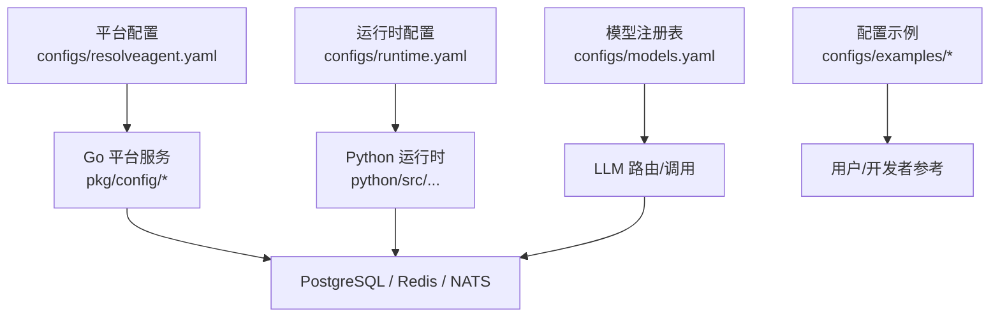
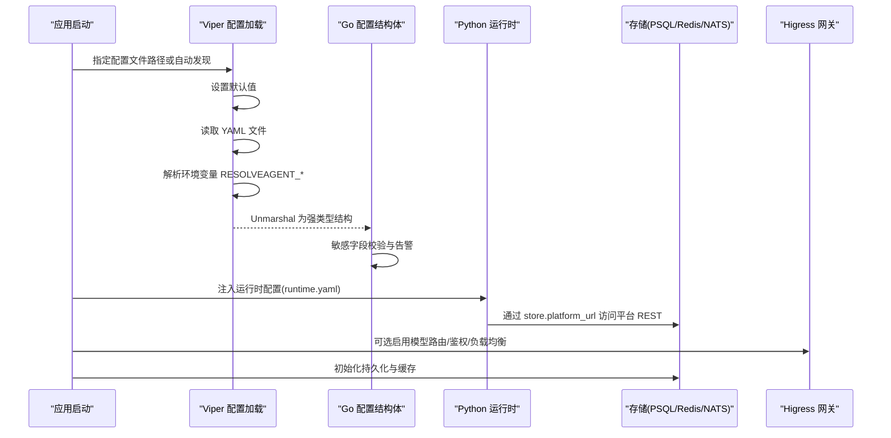
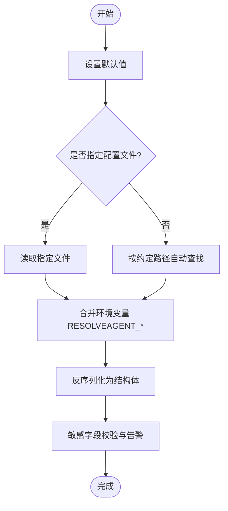
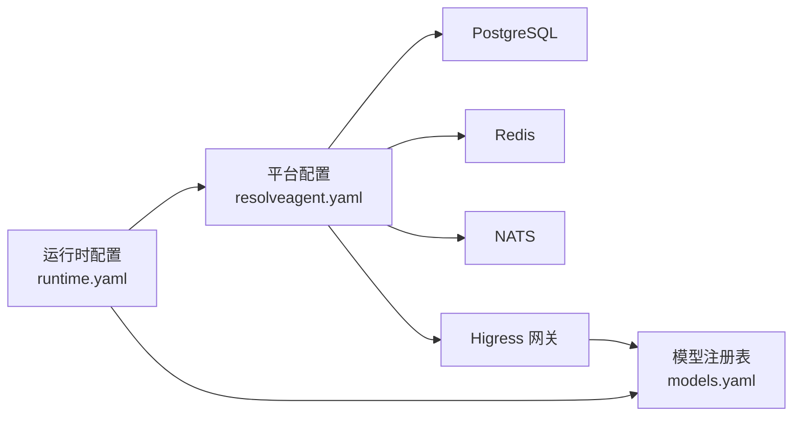

# 配置管理

<cite>
**本文引用的文件**
- [resolveagent.yaml](file://configs/resolveagent.yaml)
- [runtime.yaml](file://configs/runtime.yaml)
- [models.yaml](file://configs/models.yaml)
- [config.go](file://pkg/config/config.go)
- [types.go](file://pkg/config/types.go)
- [configuration.md](file://docs/zh/configuration.md)
- [values.yaml](file://deploy/helm/resolveagent/values.yaml)
- [agent-example.yaml](file://configs/examples/agent-example.yaml)
- [skill-example.yaml](file://configs/examples/skill-example.yaml)
- [workflow-fta-example.yaml](file://configs/examples/workflow-fta-example.yaml)
</cite>

## 目录
1. [简介](#简介)
2. [项目结构](#项目结构)
3. [核心组件](#核心组件)
4. [架构总览](#架构总览)
5. [详细组件分析](#详细组件分析)
6. [依赖关系分析](#依赖关系分析)
7. [性能考虑](#性能考虑)
8. [故障排查指南](#故障排查指南)
9. [结论](#结论)
10. [附录](#附录)

## 简介
本章节面向 ResolveAgent 的配置管理体系，系统性说明配置文件结构、配置项定义与加载机制，覆盖平台配置、运行时配置与模型配置的层次结构与优先级规则；解释配置验证、默认值设置与环境变量替换机制；并给出配置热更新、配置加密与敏感信息保护策略建议，提供配置模板、示例与迁移指南，结合部署场景给出最佳实践与安全建议。

## 项目结构
ResolveAgent 的配置由三部分构成：
- 平台服务配置：位于 configs/resolveagent.yaml，描述 HTTP/gRPC 监听、数据库、Redis、NATS、网关集成、遥测、存储后端等。
- 运行时配置：位于 configs/runtime.yaml，描述 Agent 运行时的服务器、选择器、存储客户端、内存、反馈回路、熔断与自适应行为等。
- 模型注册表：位于 configs/models.yaml，集中声明 LLM 提供商、模型名、最大令牌数、温度等。

此外，examples 下提供 Agent、Skill、FTA 工作流的配置示例，便于快速上手与参考。

图表来源
- [resolveagent.yaml:1-156](file://configs/resolveagent.yaml#L1-L156)
- [runtime.yaml:1-74](file://configs/runtime.yaml#L1-L74)
- [models.yaml:1-66](file://configs/models.yaml#L1-L66)
- [config.go:1-96](file://pkg/config/config.go#L1-L96)
- [types.go:1-115](file://pkg/config/types.go#L1-L115)

章节来源
- [resolveagent.yaml:1-156](file://configs/resolveagent.yaml#L1-L156)
- [runtime.yaml:1-74](file://configs/runtime.yaml#L1-L74)
- [models.yaml:1-66](file://configs/models.yaml#L1-L66)
- [configuration.md:1-103](file://docs/zh/configuration.md#L1-L103)

## 核心组件
- 配置加载器（Go）：通过 Viper 统一读取 YAML 配置文件与环境变量，设置默认值、合并覆盖、反序列化为强类型结构体，并进行敏感字段校验。
- 配置类型定义（Go）：以结构体形式定义平台配置的所有子模块（Server、Database、Redis、NATS、Runtime、Gateway、Telemetry、Store）。
- 运行时配置（Python）：独立 YAML 描述 Agent 运行时行为，包括选择器策略、存储客户端连接、内存策略、反馈回路与熔断等。
- 模型注册表（YAML）：集中声明可用 LLM 模型及其参数，供网关路由与运行时调用。

章节来源
- [config.go:11-75](file://pkg/config/config.go#L11-L75)
- [types.go:5-115](file://pkg/config/types.go#L5-L115)
- [runtime.yaml:1-74](file://configs/runtime.yaml#L1-L74)
- [models.yaml:1-66](file://configs/models.yaml#L1-L66)

## 架构总览
下图展示配置在平台与运行时之间的交互关系，以及环境变量与配置文件的优先级。

图表来源
- [config.go:11-75](file://pkg/config/config.go#L11-L75)
- [types.go:5-115](file://pkg/config/types.go#L5-L115)
- [resolveagent.yaml:1-156](file://configs/resolveagent.yaml#L1-L156)
- [runtime.yaml:1-74](file://configs/runtime.yaml#L1-L74)

## 详细组件分析

### 平台配置（resolveagent.yaml）
- 服务器：HTTP/gRPC 监听地址。
- 数据库：PostgreSQL 主机、端口、用户、密码、库名、SSL 模式。
- Redis：地址、DB、密码（可通过环境变量覆盖）。
- NATS：消息总线 URL。
- 运行时：gRPC 地址用于与 Python 运行时通信。
- 网关（Higress）：是否启用、管理 API 地址、路由同步间隔、模型路由（默认模型、基础路径）、鉴权（JWT 密钥、签发者、API Key 头名）、负载均衡策略与健康检查。
- 遥测：是否启用、OTLP 端点、服务名、指标开关。
- 存储后端：全局 backend（memory/postgres），按 registry 维度覆盖，内存存储的短期/长期策略。
- 反馈与可观测闭环：信号缓冲、聚合窗口、分发目标（webhook/nats/log）、指标与告警规则。

章节来源
- [resolveagent.yaml:5-156](file://configs/resolveagent.yaml#L5-L156)
- [types.go:31-115](file://pkg/config/types.go#L31-L115)

### 运行时配置（runtime.yaml）
- 服务器：Host/Port。
- Agent 池：最大容量、淘汰策略。
- 选择器：默认策略、置信度阈值。
- 遥测：服务名与开关。
- 存储客户端：平台 REST 地址、超时、重试次数与延迟。
- 内存：短期会话消息上限与默认拉取量；长期记忆开关、默认重要性、清理周期。
- 反馈回路：选择器权重更新间隔、RAG 知识增强阈值、技能自适应阈值。
- 熔断器：失败阈值、恢复超时、半开探测次数。
- 自适应：选择器权重动态调整、技能置信度衰减、异常时自动降级。

章节来源
- [runtime.yaml:1-74](file://configs/runtime.yaml#L1-L74)

### 模型配置（models.yaml）
- 模型条目：id、provider、model_name、max_tokens、default_temperature、base_url（部分 provider 需要）。
- 用途：作为 LLM 路由与调用的元数据源，配合网关进行统一入口与鉴权。

章节来源
- [models.yaml:1-66](file://configs/models.yaml#L1-L66)

### 配置加载机制与优先级
- 配置文件位置与查找顺序：命令行指定 > 当前目录 > 用户目录 > 系统目录。
- 环境变量覆盖：RESOLVEAGENT_<SECTION>_<KEY> 形式，支持将带点的键转换为下划线。
- 默认值：在加载前设置，确保缺失时仍具备合理基线。
- 反序列化：将扁平配置映射到强类型结构体，便于类型安全使用。
- 敏感字段校验：对空密码、未设置 JWT 密钥等情况输出警告，提示生产环境必须配置。

图表来源
- [config.go:11-75](file://pkg/config/config.go#L11-L75)
- [configuration.md:7-31](file://docs/zh/configuration.md#L7-L31)

章节来源
- [config.go:11-75](file://pkg/config/config.go#L11-L75)
- [configuration.md:7-31](file://docs/zh/configuration.md#L7-L31)

### 配置验证、默认值与环境变量替换
- 默认值：所有关键子项均提供默认值，避免启动失败。
- 环境变量：通过前缀与键替换实现跨层级覆盖，适合容器化与 CI/CD 注入。
- 校验：对数据库密码、网关 JWT 密钥、Redis 密码等敏感项进行空值检测并输出告警。
- 注意：当前 Go 配置加载器未内置 ${VAR} 语法的环境变量替换；可在上层封装或使用外部工具处理后再传入。

章节来源
- [config.go:15-42](file://pkg/config/config.go#L15-L42)
- [config.go:55-75](file://pkg/config/config.go#L55-L75)
- [config.go:83-95](file://pkg/config/config.go#L83-L95)

### 配置热更新
- 现状：代码中未发现运行时热重载逻辑。
- 建议：
  - 使用文件系统监听（如 inotify）或配置中心（如 etcd/Consul）推送变更，触发配置重加载。
  - 对非侵入性配置（如日志级别、采样率、路由策略）支持热更新；对需重启生效的配置（如网络端口、存储后端）明确标注并要求滚动重启。
  - 引入版本化配置与灰度发布，降低风险。

[本节为通用建议，不直接分析具体文件]

### 配置加密与敏感信息保护
- 建议：
  - 敏感字段（数据库密码、JWT 密钥、Redis 密码）通过环境变量或密钥管理服务（KMS/Secrets Manager）注入，不在配置文件中明文存放。
  - 在 CI/CD 中扫描配置，禁止提交敏感信息。
  - 对静态配置进行最小权限与最小暴露原则，仅挂载必要字段。
  - 开启传输层加密（TLS）与存储加密（磁盘/列级）。

[本节为通用建议，不直接分析具体文件]

### 配置模板、示例与迁移指南
- 模板与示例：
  - 平台服务：参考 resolveagent.yaml。
  - 运行时：参考 runtime.yaml。
  - 模型注册表：参考 models.yaml。
  - Agent/Skill/工作流：参考 examples 下的示例文件。
- 迁移指南：
  - 从旧版配置迁移时，优先对照 types.go 的结构体字段，确保新旧键一致。
  - 逐步将硬编码值迁移至环境变量或密钥管理。
  - 使用 Helm values 管理多环境差异，并通过 --set 或 values 文件注入。

章节来源
- [agent-example.yaml:1-18](file://configs/examples/agent-example.yaml#L1-L18)
- [skill-example.yaml:1-23](file://configs/examples/skill-example.yaml#L1-L23)
- [workflow-fta-example.yaml:1-50](file://configs/examples/workflow-fta-example.yaml#L1-L50)
- [values.yaml:1-66](file://deploy/helm/resolveagent/values.yaml#L1-L66)

### 不同环境的配置最佳实践与安全建议
- 开发环境：
  - 使用本地 PostgreSQL/Redis/NATS，关闭遥测与网关集成，启用调试日志。
  - 允许本地 CORS，简化认证流程。
- 测试环境：
  - 启用基本遥测与指标，模拟真实依赖。
  - 开启网关鉴权与模型路由，使用测试密钥。
- 生产环境：
  - 强制 TLS、启用 SSL 模式为 require/verify-full。
  - 通过 Secret 注入敏感信息，禁用不必要的功能。
  - 配置熔断、自适应与反馈回路，保障稳定性。
  - 使用 Helm values 管理副本数、资源限制与 Ingress。

章节来源
- [resolveagent.yaml:5-156](file://configs/resolveagent.yaml#L5-L156)
- [runtime.yaml:1-74](file://configs/runtime.yaml#L1-L74)
- [values.yaml:1-66](file://deploy/helm/resolveagent/values.yaml#L1-L66)

## 依赖关系分析
- 平台配置依赖：
  - 数据库（PostgreSQL）、缓存（Redis）、消息（NATS）。
  - 网关（Higress）可选集成，负责模型路由与鉴权。
- 运行时配置依赖：
  - 通过 store.platform_url 访问平台 REST API。
  - 内部使用选择器、记忆、熔断与自适应策略。
- 模型配置依赖：
  - 被网关与运行时共同消费，决定实际调用的 LLM 提供方与参数。

图表来源
- [resolveagent.yaml:5-156](file://configs/resolveagent.yaml#L5-L156)
- [runtime.yaml:1-74](file://configs/runtime.yaml#L1-L74)
- [models.yaml:1-66](file://configs/models.yaml#L1-L66)

章节来源
- [resolveagent.yaml:5-156](file://configs/resolveagent.yaml#L5-L156)
- [runtime.yaml:1-74](file://configs/runtime.yaml#L1-L74)
- [models.yaml:1-66](file://configs/models.yaml#L1-L66)

## 性能考虑
- 连接与超时：合理设置数据库连接池、Redis 与 NATS 的连接参数，避免连接泄漏与阻塞。
- 网关路由：启用健康检查与负载均衡，减少单点故障与热点请求。
- 反馈与熔断：根据业务负载调整反馈聚合窗口与熔断阈值，防止雪崩。
- 遥测：在生产环境开启指标采集，关注错误率、延迟与资源使用。

[本节为通用建议，不直接分析具体文件]

## 故障排查指南
- 常见问题定位：
  - 数据库无法连接：检查 host/port/user/password/dbname/sslmode，确认凭据来自环境变量或密钥管理。
  - 网关鉴权失败：确认启用了 gateway.auth.enabled 且设置了 jwt_secret。
  - Redis 无响应：检查 addr/db/password，必要时启用认证。
  - 运行时无法访问平台：核对 store.platform_url 与网络连通性。
- 日志与告警：
  - 关注敏感字段为空时的警告输出。
  - 开启 telemetry 与 observability_loop，收集指标与告警事件。

章节来源
- [config.go:83-95](file://pkg/config/config.go#L83-L95)
- [resolveagent.yaml:65-156](file://configs/resolveagent.yaml#L65-L156)

## 结论
ResolveAgent 的配置体系以 YAML 为主、环境变量为辅，通过强类型结构体保证类型安全与一致性。平台配置聚焦服务与基础设施，运行时配置聚焦 Agent 行为与自愈能力，模型配置统一管理 LLM 元数据。建议在多环境中采用 Helm values 与环境变量管理差异，严格保护敏感信息，并结合反馈回路与熔断提升稳定性。

[本节为总结性内容，不直接分析具体文件]

## 附录
- 配置项速查（节选）：
  - server.http_addr/server.grpc_addr：平台服务监听地址。
  - database.*：PostgreSQL 连接参数。
  - redis.addr/redis.db/redis.password：Redis 连接参数。
  - nats.url：消息总线地址。
  - runtime.grpc_addr：与 Python 运行时通信地址。
  - gateway.*：Higress 集成相关。
  - telemetry.*：遥测与指标。
  - store.backend/registries/memory.*：存储后端与内存策略。
  - feedback/observability_loop：反馈与可观测闭环。
  - runtime.*：运行时行为与自愈策略。
  - models.*：LLM 模型注册表。

章节来源
- [types.go:5-115](file://pkg/config/types.go#L5-L115)
- [resolveagent.yaml:5-156](file://configs/resolveagent.yaml#L5-L156)
- [runtime.yaml:1-74](file://configs/runtime.yaml#L1-L74)
- [models.yaml:1-66](file://configs/models.yaml#L1-L66)