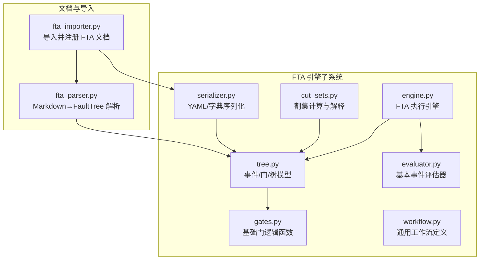
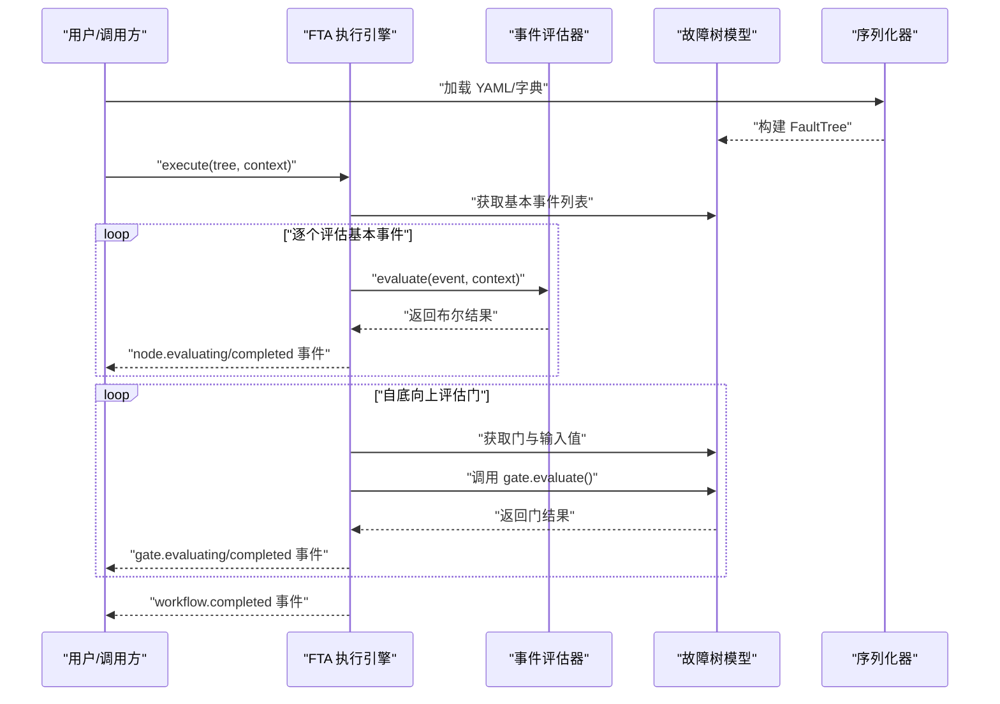
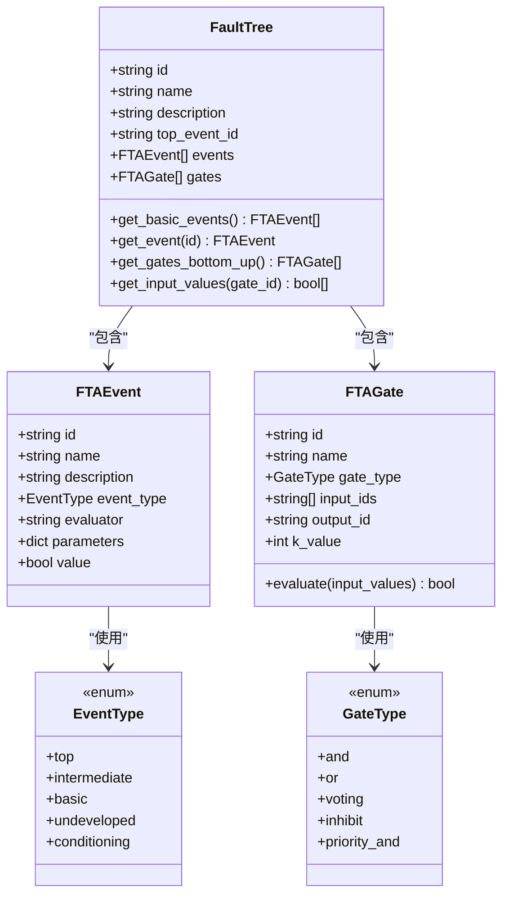
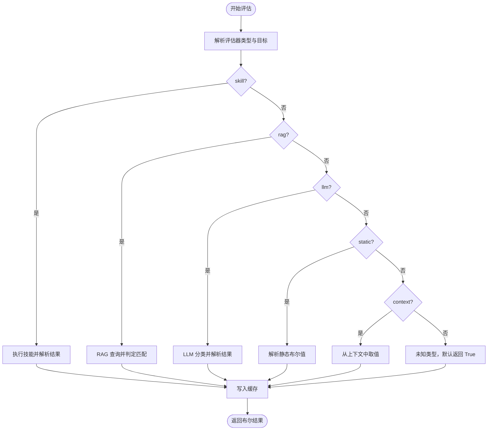
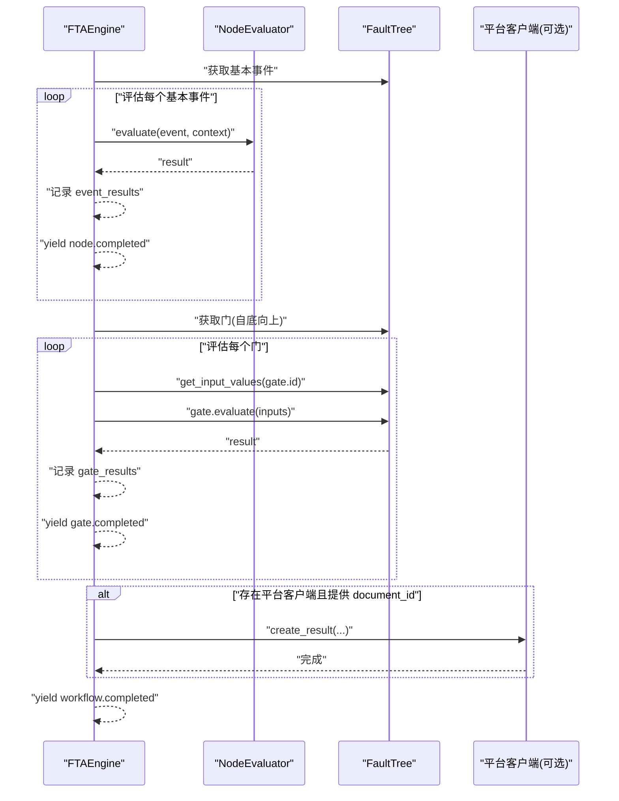
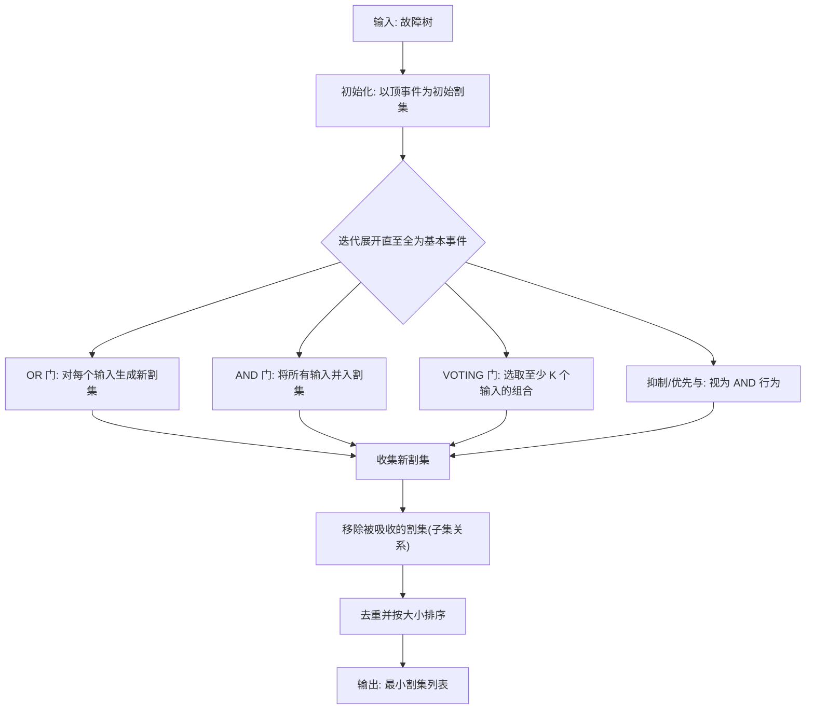
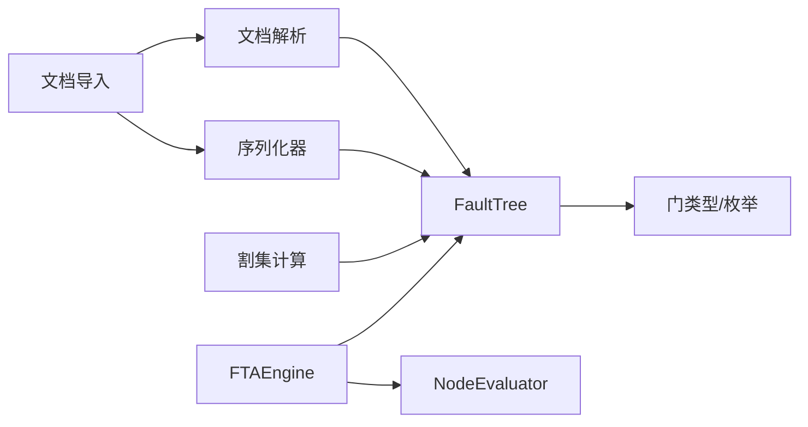

# FTA 工作流引擎

<cite>
**本文档引用的文件**
- [engine.py](file://python/src/resolveagent/fta/engine.py)
- [tree.py](file://python/src/resolveagent/fta/tree.py)
- [gates.py](file://python/src/resolveagent/fta/gates.py)
- [cut_sets.py](file://python/src/resolveagent/fta/cut_sets.py)
- [evaluator.py](file://python/src/resolveagent/fta/evaluator.py)
- [serializer.py](file://python/src/resolveagent/fta/serializer.py)
- [workflow.py](file://python/src/resolveagent/fta/workflow.py)
- [fta_parser.py](file://python/src/resolveagent/corpus/fta_parser.py)
- [fta_importer.py](file://python/src/resolveagent/corpus/fta_importer.py)
- [workflow-fta-example.yaml](file://configs/examples/workflow-fta-example.yaml)
- [sample_fta_tree.yaml](file://python/tests/fixtures/sample_fta_tree.yaml)
- [fta-engine.md](file://docs/zh/fta-engine.md)
- [mega.py](file://python/src/resolveagent/agent/mega.py)
</cite>

## 目录
1. [简介](#简介)
2. [项目结构](#项目结构)
3. [核心组件](#核心组件)
4. [架构总览](#架构总览)
5. [详细组件分析](#详细组件分析)
6. [依赖分析](#依赖分析)
7. [性能考量](#性能考量)
8. [故障排除指南](#故障排除指南)
9. [结论](#结论)
10. [附录](#附录)

## 简介
FTA 工作流引擎是 ResolveAgent 的核心能力之一，支持以故障树（Fault Tree）为载体的多步骤、条件驱动的智能决策与自动化流程。它将传统的自顶向下故障树分析扩展为可执行的工作流：通过“基本事件”（叶节点）结合“技能（Skills）”、“RAG 管道”和“LLM”进行评估，并通过“逻辑门”（与、或、投票、抑制、优先与等）进行组合，最终输出顶级事件的结果。引擎提供异步流式事件输出，便于前端可视化与可观测性集成；同时内置割集计算能力，用于解释性分析与风险量化。

## 项目结构
FTA 相关代码集中在 Python 包 resolveagent/fta 下，包含数据模型、执行引擎、门逻辑、评估器、序列化器、工作流定义以及文档导入/解析工具。下图展示了与 FTA 引擎直接相关的模块关系：

图表来源
- [engine.py:16-126](file://python/src/resolveagent/fta/engine.py#L16-L126)
- [tree.py:30-120](file://python/src/resolveagent/fta/tree.py#L30-L120)
- [gates.py:6-29](file://python/src/resolveagent/fta/gates.py#L6-L29)
- [evaluator.py:22-372](file://python/src/resolveagent/fta/evaluator.py#L22-L372)
- [cut_sets.py:17-317](file://python/src/resolveagent/fta/cut_sets.py#L17-L317)
- [serializer.py:12-113](file://python/src/resolveagent/fta/serializer.py#L12-L113)
- [workflow.py:9-136](file://python/src/resolveagent/fta/workflow.py#L9-L136)
- [fta_parser.py:60-300](file://python/src/resolveagent/corpus/fta_parser.py#L60-L300)
- [fta_importer.py:24-166](file://python/src/resolveagent/corpus/fta_importer.py#L24-L166)

章节来源
- [engine.py:16-126](file://python/src/resolveagent/fta/engine.py#L16-L126)
- [tree.py:30-120](file://python/src/resolveagent/fta/tree.py#L30-L120)
- [gates.py:6-29](file://python/src/resolveagent/fta/gates.py#L6-L29)
- [evaluator.py:22-372](file://python/src/resolveagent/fta/evaluator.py#L22-L372)
- [cut_sets.py:17-317](file://python/src/resolveagent/fta/cut_sets.py#L17-L317)
- [serializer.py:12-113](file://python/src/resolveagent/fta/serializer.py#L12-L113)
- [workflow.py:9-136](file://python/src/resolveagent/fta/workflow.py#L9-L136)
- [fta_parser.py:60-300](file://python/src/resolveagent/corpus/fta_parser.py#L60-L300)
- [fta_importer.py:24-166](file://python/src/resolveagent/corpus/fta_importer.py#L24-L166)

## 核心组件
- 故障树模型（事件/门/树）：定义事件类型（顶事件、中间事件、基本事件、未展开、条件事件）、门类型（与、或、投票、抑制、优先与），并提供自底向上评估所需的输入值提取与拓扑遍历接口。
- 门逻辑：提供基础门函数（与、或、投票、抑制、优先与），并在树模型中统一通过 evaluate 方法调用。
- 事件评估器：支持多种评估器类型（技能、RAG、LLM、静态值、上下文取值），并内置缓存与容错回退。
- 执行引擎：自底向上评估基本事件与门，产出异步事件流，支持持久化结果。
- 割集计算：实现 MOCUS 算法，生成最小割集、解释性说明与按概率排序。
- 序列化器：支持 YAML 与字典之间的互转，便于配置与存储。
- 文档解析与导入：从 Markdown 中解析 Mermaid 图与 JSON 元数据，生成 FaultTree 并注册为文档。
- 通用工作流：提供通用工作流定义与校验，支撑 FTA 工作流的编排与执行。

章节来源
- [tree.py:10-120](file://python/src/resolveagent/fta/tree.py#L10-L120)
- [gates.py:6-29](file://python/src/resolveagent/fta/gates.py#L6-L29)
- [evaluator.py:22-372](file://python/src/resolveagent/fta/evaluator.py#L22-L372)
- [engine.py:16-126](file://python/src/resolveagent/fta/engine.py#L16-L126)
- [cut_sets.py:17-317](file://python/src/resolveagent/fta/cut_sets.py#L17-L317)
- [serializer.py:12-113](file://python/src/resolveagent/fta/serializer.py#L12-L113)
- [workflow.py:9-136](file://python/src/resolveagent/fta/workflow.py#L9-L136)
- [fta_parser.py:60-300](file://python/src/resolveagent/corpus/fta_parser.py#L60-L300)
- [fta_importer.py:24-166](file://python/src/resolveagent/corpus/fta_importer.py#L24-L166)

## 架构总览
FTA 执行引擎的总体流程如下：加载/解析故障树 → 识别基本事件 → 并行评估基本事件 → 自底向上传播门逻辑 → 产出顶级事件结果与持久化。

图表来源
- [engine.py:30-126](file://python/src/resolveagent/fta/engine.py#L30-L126)
- [evaluator.py:52-112](file://python/src/resolveagent/fta/evaluator.py#L52-L112)
- [tree.py:103-120](file://python/src/resolveagent/fta/tree.py#L103-L120)
- [serializer.py:12-71](file://python/src/resolveagent/fta/serializer.py#L12-L71)

章节来源
- [engine.py:30-126](file://python/src/resolveagent/fta/engine.py#L30-L126)
- [evaluator.py:52-112](file://python/src/resolveagent/fta/evaluator.py#L52-L112)
- [tree.py:103-120](file://python/src/resolveagent/fta/tree.py#L103-L120)
- [serializer.py:12-71](file://python/src/resolveagent/fta/serializer.py#L12-L71)

## 详细组件分析

### 故障树数据结构与门逻辑
- 事件类型：顶事件（顶级目标）、中间事件（由门组合）、基本事件（叶节点，需评估）、未展开事件、条件事件（抑制门的条件）。
- 门类型：与门、或门、投票门（K-of-N）、抑制门、优先与门（顺序与）。
- 门评估：在树模型中统一通过 evaluate 方法实现，根据不同类型执行相应逻辑；基础门函数提供独立实现，便于单元测试与复用。

图表来源
- [tree.py:10-120](file://python/src/resolveagent/fta/tree.py#L10-L120)

章节来源
- [tree.py:10-120](file://python/src/resolveagent/fta/tree.py#L10-L120)
- [gates.py:6-29](file://python/src/resolveagent/fta/gates.py#L6-L29)

### 事件评估器（NodeEvaluator）
- 支持的评估器类型：技能（skill:）、RAG（rag:）、LLM（llm:）、静态值（static:）、上下文取值（context:）。
- 执行流程：解析评估器字符串 → 合并上下文参数 → 调用对应执行器 → 解析布尔结果 → 缓存结果。
- 容错策略：异常捕获后返回 False（事件未发生），并记录警告日志；支持缓存避免重复评估。

图表来源
- [evaluator.py:52-372](file://python/src/resolveagent/fta/evaluator.py#L52-L372)

章节来源
- [evaluator.py:52-372](file://python/src/resolveagent/fta/evaluator.py#L52-L372)

### 执行引擎（FTAEngine）
- 自底向上评估：先评估所有基本事件，再按门的拓扑顺序自底向上传播。
- 流式事件：产出 workflow.started、node.evaluating/completed、gate.evaluating/completed、workflow.completed 等事件。
- 结果持久化：可选地将执行结果写入平台客户端（含执行 ID、顶级事件结果、各基本事件概率、门结果、耗时、上下文等）。

图表来源
- [engine.py:30-126](file://python/src/resolveagent/fta/engine.py#L30-L126)

章节来源
- [engine.py:30-126](file://python/src/resolveagent/fta/engine.py#L30-L126)

### 割集计算（最小割集、解释与排序）
- 算法：MOCUS（Method of Obtaining Cut Sets），自顶向下展开，遇到 OR 门复制扩展、遇到 AND 门合并扩展，直到全部为基本事件；随后移除被吸收的割集并去重。
- 输出：最小割集集合、人类可读解释、按概率排序（支持事件概率映射）。
- 注意：抑制门与优先与门在割集计算中按 AND 行为处理。

图表来源
- [cut_sets.py:17-317](file://python/src/resolveagent/fta/cut_sets.py#L17-L317)

章节来源
- [cut_sets.py:17-317](file://python/src/resolveagent/fta/cut_sets.py#L17-L317)

### 序列化与反序列化
- YAML 加载/保存：支持从 YAML 文件或字典加载 FaultTree，也支持将 FaultTree 序列化为 YAML 字符串。
- 字段映射：事件字段（id/name/description/type/evaluator/parameters）与门字段（id/name/type/inputs/output/k_value）完整映射。

章节来源
- [serializer.py:12-113](file://python/src/resolveagent/fta/serializer.py#L12-L113)

### 文档解析与导入
- Markdown 解析：从 Mermaid 图提取节点与边，识别门与事件类型，合成 FaultTree；从 JSON 块提取基础事件参数与工作流元数据。
- 导入流程：注册为 FTA 文档（含故障树与元数据），同时将原始 Markdown 导入 RAG 语料库，便于检索增强。

章节来源
- [fta_parser.py:60-300](file://python/src/resolveagent/corpus/fta_parser.py#L60-L300)
- [fta_importer.py:24-166](file://python/src/resolveagent/corpus/fta_importer.py#L24-L166)

### 通用工作流定义
- 提供通用工作流节点与边的定义、可达性校验、起止节点校验等基础能力，支撑 FTA 工作流的编排与执行。

章节来源
- [workflow.py:9-136](file://python/src/resolveagent/fta/workflow.py#L9-L136)

## 依赖分析
- 组件内聚与耦合
  - FTAEngine 依赖 FaultTree 与 NodeEvaluator，耦合清晰，职责单一。
  - FaultTree 内部聚合事件与门，门逻辑在树模型中统一调用，基础门函数独立便于测试。
  - NodeEvaluator 依赖技能执行器、LLM 提供商与 RAG 管线，通过可选构造参数注入，降低硬依赖。
  - 割集计算模块仅依赖树模型枚举与门类型，保持纯函数式风格。
  - 文档解析与导入模块与引擎解耦，通过序列化器与树模型对接。
- 外部依赖
  - YAML 解析（PyYAML）用于配置文件读写。
  - 日志记录用于运行时可观测性。
  - 可选平台客户端用于持久化执行结果。

图表来源
- [engine.py:16-126](file://python/src/resolveagent/fta/engine.py#L16-L126)
- [tree.py:30-120](file://python/src/resolveagent/fta/tree.py#L30-L120)
- [cut_sets.py:17-317](file://python/src/resolveagent/fta/cut_sets.py#L17-L317)
- [serializer.py:12-113](file://python/src/resolveagent/fta/serializer.py#L12-L113)
- [fta_parser.py:60-300](file://python/src/resolveagent/corpus/fta_parser.py#L60-L300)
- [fta_importer.py:24-166](file://python/src/resolveagent/corpus/fta_importer.py#L24-L166)

章节来源
- [engine.py:16-126](file://python/src/resolveagent/fta/engine.py#L16-L126)
- [tree.py:30-120](file://python/src/resolveagent/fta/tree.py#L30-L120)
- [cut_sets.py:17-317](file://python/src/resolveagent/fta/cut_sets.py#L17-L317)
- [serializer.py:12-113](file://python/src/resolveagent/fta/serializer.py#L12-L113)
- [fta_parser.py:60-300](file://python/src/resolveagent/corpus/fta_parser.py#L60-L300)
- [fta_importer.py:24-166](file://python/src/resolveagent/corpus/fta_importer.py#L24-L166)

## 性能考量
- 评估缓存：NodeEvaluator 内置缓存，避免重复评估相同事件与上下文组合。
- 门短路：OR 门在首个输入为真时可短路（当前实现按输入列表整体计算，建议在上游优化输入顺序以利用短路效果）。
- 自底向上顺序：当前树模型的门遍历采用逆序（TODO 注释提示需拓扑排序），建议实现拓扑排序以保证严格自底向上。
- 异步与并发：基本事件评估通过异步执行器（技能/RAG/LLM）提升吞吐，建议在上层调用处并行触发多个基本事件评估。
- 割集计算复杂度：MOCUS 在大规模树上可能产生指数级割集，建议限制最大迭代次数与输出数量，并对输入进行预处理（如去除冗余门）。

## 故障排除指南
- 事件评估失败
  - 现象：事件评估抛出异常，返回 False。
  - 排查：检查评估器类型与目标是否正确（skill/rag/llm/static/context），确认对应执行器可用；查看日志中的错误信息。
- 未知评估器类型
  - 现象：记录警告并默认返回 True。
  - 排查：修正事件的 evaluator 字段格式（例如 skill:xxx、rag:collection-id 等）。
- 门评估异常
  - 现象：门评估返回 False 或抛出异常。
  - 排查：确认门的输入事件均已评估并具备布尔值；检查门类型与输入数量是否匹配。
- 割集计算异常
  - 现象：警告达到最大迭代次数或输出为空。
  - 排查：检查树结构是否有效（存在顶事件、无循环依赖），适当简化门逻辑或限制输入规模。
- 序列化/反序列化问题
  - 现象：YAML 读取失败或字段缺失。
  - 排查：确认 YAML 格式正确，字段齐全；使用序列化器进行一致性校验。

章节来源
- [evaluator.py:105-111](file://python/src/resolveagent/fta/evaluator.py#L105-L111)
- [cut_sets.py:120-125](file://python/src/resolveagent/fta/cut_sets.py#L120-L125)
- [serializer.py:12-71](file://python/src/resolveagent/fta/serializer.py#L12-L71)

## 结论
FTA 工作流引擎以模块化设计实现了从故障树定义到执行、解释与持久化的完整闭环。通过灵活的事件评估器与门逻辑，引擎既能满足工程化场景的自动化需求，又能提供解释性分析（最小割集）。建议在实际部署中关注拓扑排序、缓存策略与性能优化，以获得更稳定与高效的执行体验。

## 附录

### 实际示例与配置指南
- 示例工作流（YAML）
  - 参考路径：[workflow-fta-example.yaml:1-50](file://configs/examples/workflow-fta-example.yaml#L1-L50)
  - 包含：顶事件、中间事件、基本事件（技能/RAG）、逻辑门（OR）等。
- 示例树（YAML）
  - 参考路径：[sample_fta_tree.yaml:1-23](file://python/tests/fixtures/sample_fta_tree.yaml#L1-L23)
  - 包含：顶事件、两个基本事件（技能评估）、一个 OR 门。
- WebUI 可视化编辑器
  - 参考文档：[FTA 引擎文档:454-474](file://docs/zh/fta-engine.md#L454-L474)

章节来源
- [workflow-fta-example.yaml:1-50](file://configs/examples/workflow-fta-example.yaml#L1-L50)
- [sample_fta_tree.yaml:1-23](file://python/tests/fixtures/sample_fta_tree.yaml#L1-L23)
- [fta-engine.md:454-474](file://docs/zh/fta-engine.md#L454-L474)

### 在 ResolveAgent 中的集成入口
- 智能体执行 FTA 工作流
  - 参考路径：[mega.py:327-365](file://python/src/resolveagent/agent/mega.py#L327-L365)
  - 说明：当路由目标为 FTA 工作流时，加载引擎并执行工作流定义。

章节来源
- [mega.py:327-365](file://python/src/resolveagent/agent/mega.py#L327-L365)