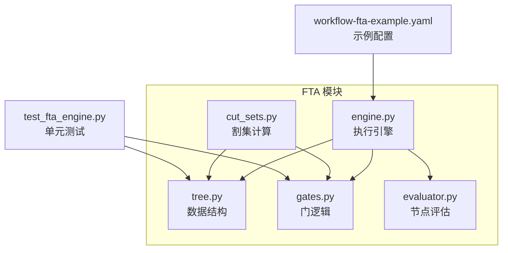
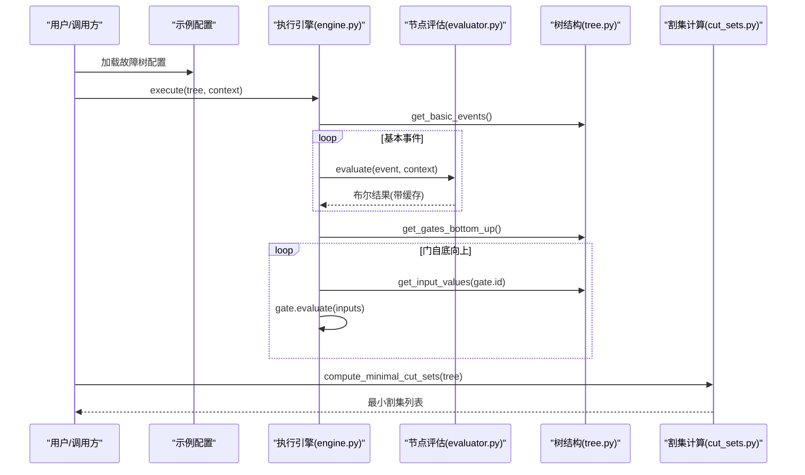
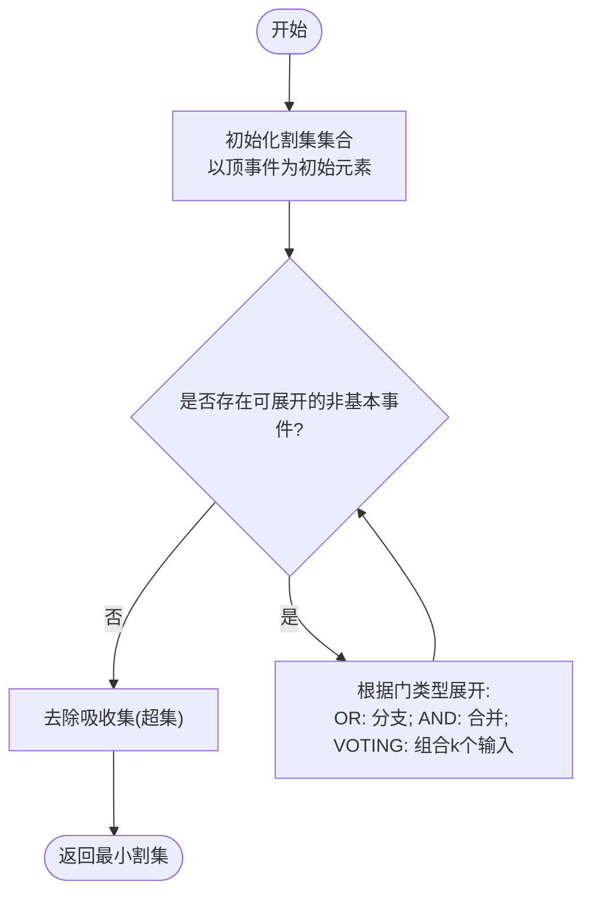
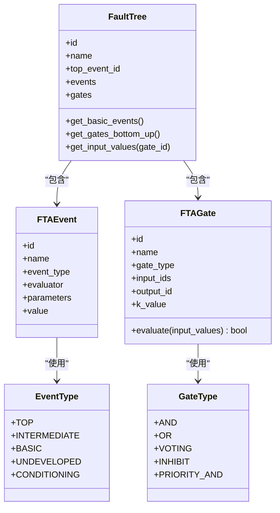
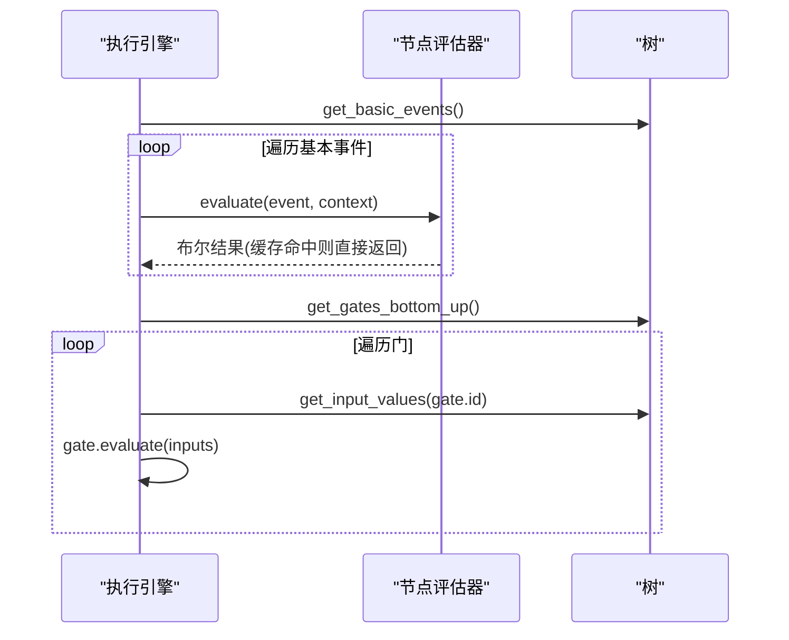
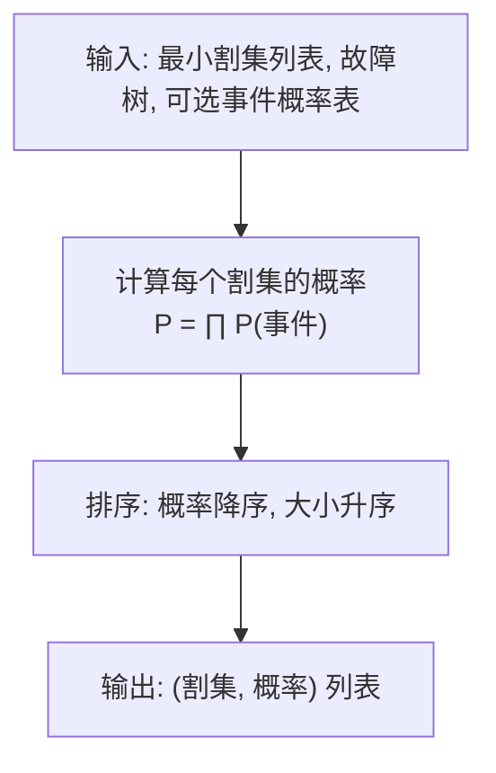
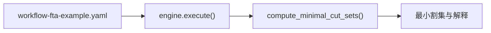
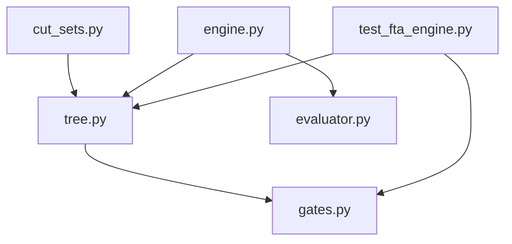

# 割集计算算法

<cite>
**本文引用的文件**
- [cut_sets.py](file://python/src/resolveagent/fta/cut_sets.py)
- [engine.py](file://python/src/resolveagent/fta/engine.py)
- [tree.py](file://python/src/resolveagent/fta/tree.py)
- [evaluator.py](file://python/src/resolveagent/fta/evaluator.py)
- [gates.py](file://python/src/resolveagent/fta/gates.py)
- [workflow-fta-example.yaml](file://configs/examples/workflow-fta-example.yaml)
- [test_fta_engine.py](file://python/tests/unit/test_fta_engine.py)
</cite>

## 目录
1. [简介](#简介)
2. [项目结构](#项目结构)
3. [核心组件](#核心组件)
4. [架构总览](#架构总览)
5. [详细组件分析](#详细组件分析)
6. [依赖关系分析](#依赖关系分析)
7. [性能与复杂度](#性能与复杂度)
8. [故障排查指南](#故障排查指南)
9. [结论](#结论)
10. [附录](#附录)

## 简介
本技术文档围绕故障树分析（FTA）中的割集计算展开，重点说明最小割集的数学原理、MOCUS算法实现、布尔代数简化策略、以及重要度指标在风险评估中的应用。文档同时给出割集生成流程的可视化图示、复杂度分析与优化建议，并结合仓库中的实际代码路径进行溯源。

## 项目结构
本项目在 Python 模块中实现了完整的 FTA 能力：数据结构定义、门逻辑、节点评估、执行引擎以及割集计算与分析工具。关键目录与职责如下：
- fta/tree.py：定义事件、门、故障树等核心数据结构及拓扑排序方法
- fta/gates.py：提供 AND/OR/VOTING/INHIBIT/PRIORITY_AND 等门函数
- fta/evaluator.py：对基本事件进行多源评估（技能、RAG、LLM、静态值、上下文）
- fta/engine.py：自底向上执行故障树评估并产出工作流事件
- fta/cut_sets.py：基于 MOCUS 的最小割集计算、吸收集去除、概率计算与重要性排序
- configs/examples/workflow-fta-example.yaml：示例故障树配置
- python/tests/unit/test_fta_engine.py：基础门逻辑与树结构的单元测试

图表来源
- [tree.py:30-151](file://python/src/resolveagent/fta/tree.py#L30-L151)
- [gates.py:6-29](file://python/src/resolveagent/fta/gates.py#L6-L29)
- [evaluator.py:21-368](file://python/src/resolveagent/fta/evaluator.py#L21-L368)
- [engine.py:20-130](file://python/src/resolveagent/fta/engine.py#L20-L130)
- [cut_sets.py:17-311](file://python/src/resolveagent/fta/cut_sets.py#L17-L311)
- [workflow-fta-example.yaml:1-50](file://configs/examples/workflow-fta-example.yaml#L1-L50)
- [test_fta_engine.py:1-40](file://python/tests/unit/test_fta_engine.py#L1-L40)

章节来源
- [tree.py:30-151](file://python/src/resolveagent/fta/tree.py#L30-L151)
- [gates.py:6-29](file://python/src/resolveagent/fta/gates.py#L6-L29)
- [evaluator.py:21-368](file://python/src/resolveagent/fta/evaluator.py#L21-L368)
- [engine.py:20-130](file://python/src/resolveagent/fta/engine.py#L20-L130)
- [cut_sets.py:17-311](file://python/src/resolveagent/fta/cut_sets.py#L17-L311)
- [workflow-fta-example.yaml:1-50](file://configs/examples/workflow-fta-example.yaml#L1-L50)
- [test_fta_engine.py:1-40](file://python/tests/unit/test_fta_engine.py#L1-L40)

## 核心组件
- 数据结构与树操作：事件类型、门类型、故障树对象、自底向上拓扑排序、输入值获取
- 门逻辑：AND/OR/VOTING(INHIBIT/PRIORITY_AND 行为同 AND) 的布尔运算
- 节点评估：支持 skill/rag/llm/static/context 多种评估方式，带缓存与容错
- 执行引擎：遍历基本事件与门，产出工作流事件，持久化结果（可选）
- 割集计算：MOCUS 自顶向下展开、吸收集去除、概率计算、按概率排序

章节来源
- [tree.py:30-151](file://python/src/resolveagent/fta/tree.py#L30-L151)
- [gates.py:6-29](file://python/src/resolveagent/fta/gates.py#L6-L29)
- [evaluator.py:21-368](file://python/src/resolveagent/fta/evaluator.py#L21-L368)
- [engine.py:20-130](file://python/src/resolveagent/fta/engine.py#L20-L130)
- [cut_sets.py:17-311](file://python/src/resolveagent/fta/cut_sets.py#L17-L311)

## 架构总览
下图展示了从配置到执行与割集分析的端到端流程：

图表来源
- [engine.py:34-130](file://python/src/resolveagent/fta/engine.py#L34-L130)
- [evaluator.py:51-110](file://python/src/resolveagent/fta/evaluator.py#L51-L110)
- [tree.py:92-151](file://python/src/resolveagent/fta/tree.py#L92-L151)
- [cut_sets.py:17-65](file://python/src/resolveagent/fta/cut_sets.py#L17-L65)

## 详细组件分析

### 最小割集计算（MOCUS 算法）
- 目标：找出导致顶事件发生的最小组件失效组合（最小割集）
- 过程：
  - 自顶向下展开：从顶事件开始，遇到 OR 门产生多个候选割集，遇到 AND 门将输入合并为同一割集
  - 迭代展开：直到所有事件均为基本事件
  - 吸收集去除：移除被更小割集包含的超集，得到最小割集
  - 输出：按大小与字典序排序的稳定结果
- 扩展性：支持 VOTING(k-out-of-n)、INHIBIT、PRIORITY_AND（后者在割集层面等价于 AND）

图表来源
- [cut_sets.py:17-65](file://python/src/resolveagent/fta/cut_sets.py#L17-L65)
- [cut_sets.py:68-122](file://python/src/resolveagent/fta/cut_sets.py#L68-L122)
- [cut_sets.py:125-184](file://python/src/resolveagent/fta/cut_sets.py#L125-L184)
- [cut_sets.py:187-221](file://python/src/resolveagent/fta/cut_sets.py#L187-L221)

章节来源
- [cut_sets.py:17-311](file://python/src/resolveagent/fta/cut_sets.py#L17-L311)

### 门逻辑与树结构
- 门类型与语义：
  - AND：全部输入为真才为真
  - OR：任一输入为真即为真
  - VOTING：至少 k 个输入为真
  - INHIBIT/PRIORITY_AND：在割集计算中等价于 AND
- 树结构：
  - 事件：TOP/INTERMEDIATE/BASIC/UNDEVELOPED/CONDITIONING
  - 门：连接事件，含输入/输出 ID 与参数（如 VOTING 的 k）
  - 拓扑排序：自底向上顺序用于评估

图表来源
- [tree.py:10-79](file://python/src/resolveagent/fta/tree.py#L10-L79)
- [tree.py:81-151](file://python/src/resolveagent/fta/tree.py#L81-L151)

章节来源
- [tree.py:10-151](file://python/src/resolveagent/fta/tree.py#L10-L151)
- [gates.py:6-29](file://python/src/resolveagent/fta/gates.py#L6-L29)

### 节点评估与工作流执行
- 节点评估：
  - 支持 skill/rag/llm/static/context 五种评估方式
  - 结果缓存避免重复计算
  - 异常时回退为安全默认值
- 执行引擎：
  - 先评估所有基本事件，再自底向上评估门
  - 产出工作流事件（开始、节点评估、完成、结束）
  - 可选持久化结果

图表来源
- [engine.py:34-130](file://python/src/resolveagent/fta/engine.py#L34-L130)
- [evaluator.py:51-110](file://python/src/resolveagent/fta/evaluator.py#L51-L110)
- [tree.py:92-151](file://python/src/resolveagent/fta/tree.py#L92-L151)

章节来源
- [engine.py:20-130](file://python/src/resolveagent/fta/engine.py#L20-L130)
- [evaluator.py:21-368](file://python/src/resolveagent/fta/evaluator.py#L21-L368)

### 割集解释、概率与重要性排序
- 割集解释：将事件 ID 映射为可读名称，单事件或“AND”连接的多事件
- 割集概率：假设独立事件，割集概率为各事件概率乘积；未提供时使用事件默认概率
- 重要性排序：按割集概率降序、割集大小升序排序，便于优先关注高风险组合

图表来源
- [cut_sets.py:224-311](file://python/src/resolveagent/fta/cut_sets.py#L224-L311)

章节来源
- [cut_sets.py:224-311](file://python/src/resolveagent/fta/cut_sets.py#L224-L311)

### 应用案例：从配置到割集
- 示例配置定义了顶事件、中间事件、基本事件及其评估器，以及一个 OR 门
- 通过执行引擎可评估该故障树，随后用割集计算提取最小割集，辅助定位根因

图表来源
- [workflow-fta-example.yaml:1-50](file://configs/examples/workflow-fta-example.yaml#L1-L50)
- [engine.py:34-130](file://python/src/resolveagent/fta/engine.py#L34-L130)
- [cut_sets.py:17-65](file://python/src/resolveagent/fta/cut_sets.py#L17-L65)

章节来源
- [workflow-fta-example.yaml:1-50](file://configs/examples/workflow-fta-example.yaml#L1-L50)
- [engine.py:34-130](file://python/src/resolveagent/fta/engine.py#L34-L130)
- [cut_sets.py:17-65](file://python/src/resolveagent/fta/cut_sets.py#L17-L65)

## 依赖关系分析
- cut_sets.py 依赖 tree.py 的事件/门/树结构，用于展开与吸收集去除
- engine.py 依赖 evaluator.py 与 tree.py，负责执行与结果收集
- gates.py 提供底层布尔运算，被 tree.py 的门 evaluate 使用
- 测试覆盖 gates 与 tree 的基础行为

图表来源
- [cut_sets.py:17-65](file://python/src/resolveagent/fta/cut_sets.py#L17-L65)
- [engine.py:20-130](file://python/src/resolveagent/fta/engine.py#L20-L130)
- [tree.py:30-151](file://python/src/resolveagent/fta/tree.py#L30-L151)
- [gates.py:6-29](file://python/src/resolveagent/fta/gates.py#L6-L29)
- [test_fta_engine.py:1-40](file://python/tests/unit/test_fta_engine.py#L1-L40)

章节来源
- [cut_sets.py:17-65](file://python/src/resolveagent/fta/cut_sets.py#L17-L65)
- [engine.py:20-130](file://python/src/resolveagent/fta/engine.py#L20-L130)
- [tree.py:30-151](file://python/src/resolveagent/fta/tree.py#L30-L151)
- [gates.py:6-29](file://python/src/resolveagent/fta/gates.py#L6-L29)
- [test_fta_engine.py:1-40](file://python/tests/unit/test_fta_engine.py#L1-L40)

## 性能与复杂度
- 割集展开阶段：
  - 每次迭代扫描当前割集中的事件，寻找首个可展开的非基本事件
  - 时间复杂度近似 O(I·C)，其中 I 为迭代次数，C 为割集数量；受最大迭代次数限制防止无限循环
- 吸收集去除：
  - 先按大小排序，再逐一检查是否被已保留的最小割集包含
  - 时间复杂度近似 O(M^2)，M 为割集数量；去重使用 frozenset 集合转换
- 门展开：
  - OR 门产生分支，可能指数级增长；VOTING 门需枚举 k 组合，进一步增加规模
- 优化建议：
  - 提前剪枝：若某割集已包含已知更小的割集，可直接丢弃
  - 增量维护：在展开过程中维护“已发现最小割集”的索引，尽早判断吸收
  - 并行化：对 OR 分支或不同割集的处理可并行化
  - 控制膨胀：对大规模树采用分层分解或启发式裁剪（例如限制最大割集深度）

[本节为通用性能讨论，不直接分析具体文件]

## 故障排查指南
- 无评估器或未知评估器：
  - 现象：基本事件评估失败或返回默认值
  - 处理：检查 event.evaluator 是否为空或类型未知；确认 skill/rag/llm 可用
  - 参考路径：[evaluator.py:70-110](file://python/src/resolveagent/fta/evaluator.py#L70-L110)
- RAG 查询无结果或阈值过高：
  - 现象：评估结果为 False
  - 处理：调整 query/top_k/threshold；检查集合是否存在
  - 参考路径：[evaluator.py:169-238](file://python/src/resolveagent/fta/evaluator.py#L169-L238)
- LLM 响应歧义：
  - 现象：无法解析 true/false
  - 处理：优化 prompt；降低温度；重试或降级策略
  - 参考路径：[evaluator.py:240-313](file://python/src/resolveagent/fta/evaluator.py#L240-L313)
- 门逻辑错误：
  - 现象：评估结果不符合预期
  - 处理：核对门类型与输入；验证 k 值；参考单元测试
  - 参考路径：[gates.py:6-29](file://python/src/resolveagent/fta/gates.py#L6-L29), [test_fta_engine.py:7-25](file://python/tests/unit/test_fta_engine.py#L7-L25)
- 割集展开超时：
  - 现象：达到最大迭代次数警告
  - 处理：检查树结构是否有环或不连通；优化树规模或引入裁剪策略
  - 参考路径：[cut_sets.py:85-122](file://python/src/resolveagent/fta/cut_sets.py#L85-L122)

章节来源
- [evaluator.py:70-110](file://python/src/resolveagent/fta/evaluator.py#L70-L110)
- [evaluator.py:169-238](file://python/src/resolveagent/fta/evaluator.py#L169-L238)
- [evaluator.py:240-313](file://python/src/resolveagent/fta/evaluator.py#L240-L313)
- [gates.py:6-29](file://python/src/resolveagent/fta/gates.py#L6-L29)
- [test_fta_engine.py:7-25](file://python/tests/unit/test_fta_engine.py#L7-L25)
- [cut_sets.py:85-122](file://python/src/resolveagent/fta/cut_sets.py#L85-L122)

## 结论
本实现提供了完整的最小割集计算能力，基于 MOCUS 算法从顶事件自顶向下展开，结合吸收集去除得到最小割集，并提供概率计算与重要性排序以支撑风险评估。配合执行引擎与节点评估器，可实现从配置到分析的全链路自动化。针对大规模故障树，建议引入剪枝、并行与分层分解等优化手段以提升性能与可扩展性。

[本节为总结性内容，不直接分析具体文件]

## 附录

### 重要度指标说明与应用场景
- 结构重要度（Structural Importance）：仅基于拓扑结构衡量事件对顶事件的影响程度，常用于无概率信息时的优先级排序
- 关键重要度（Criticality Importance）：结合事件发生概率与割集贡献，衡量事件对系统失效概率变化的敏感度，适用于风险评估与预防策略制定
- 在本实现中：
  - 割集概率计算与重要性排序可作为关键重要度的基础
  - 结构重要度可通过统计事件出现在最小割集中的频率来近似估计

[本节为概念性说明，不直接分析具体文件]