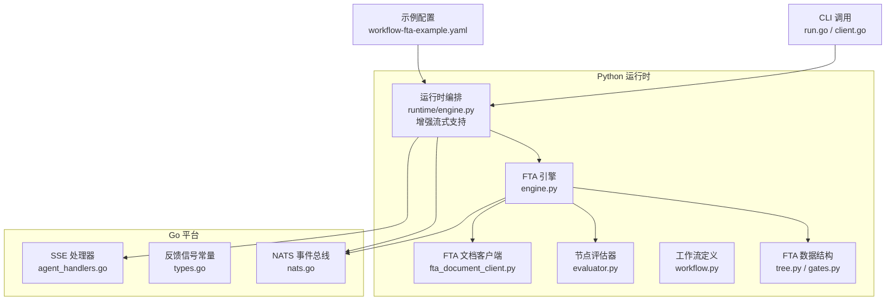
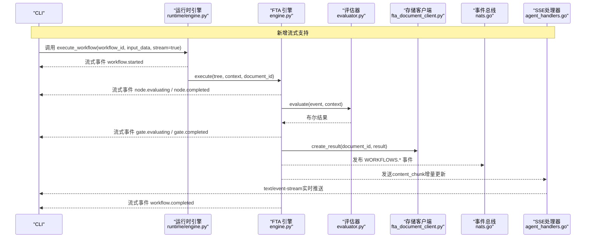
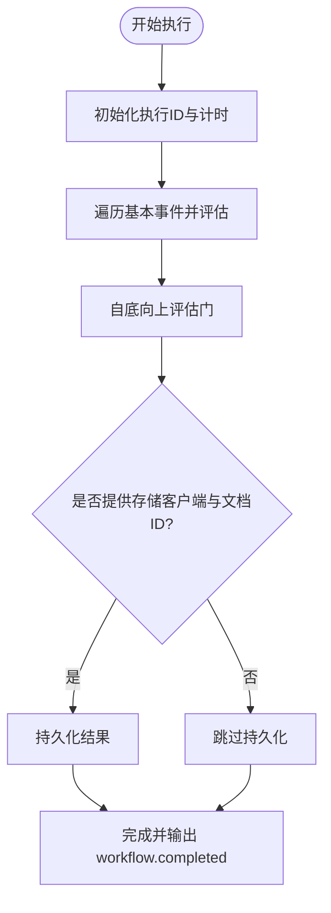
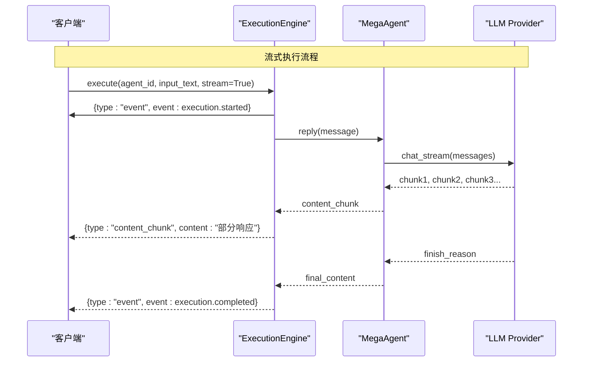
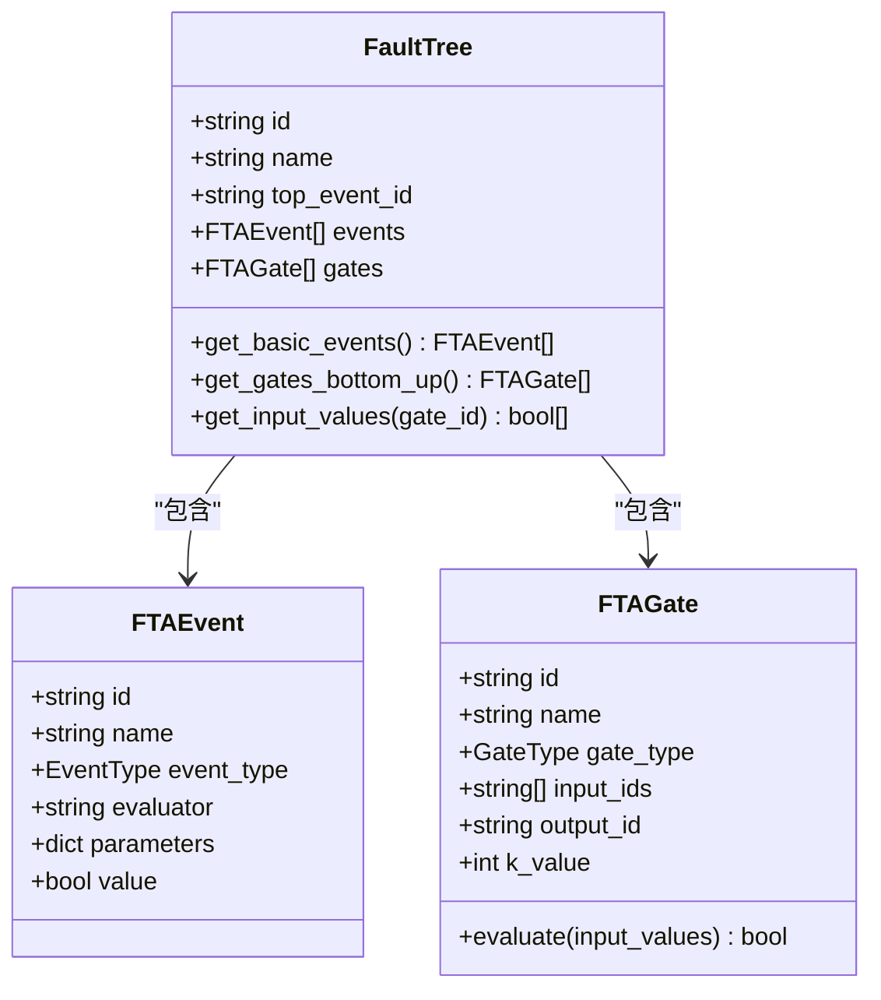
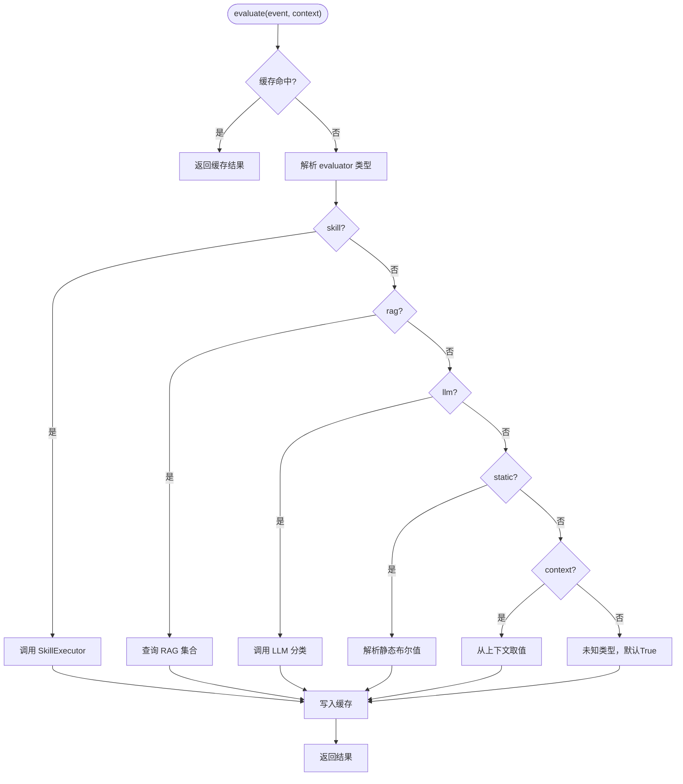
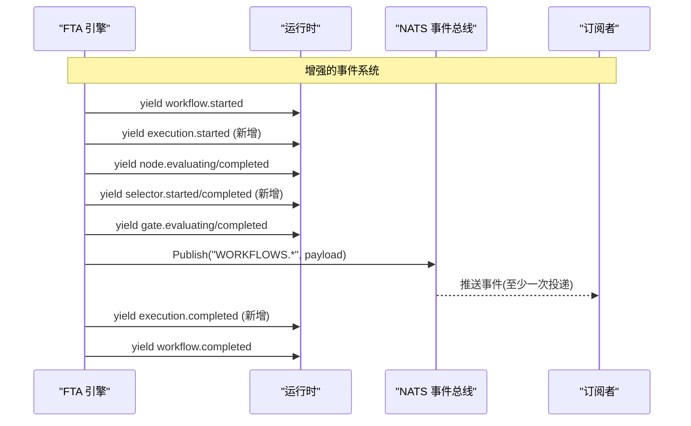
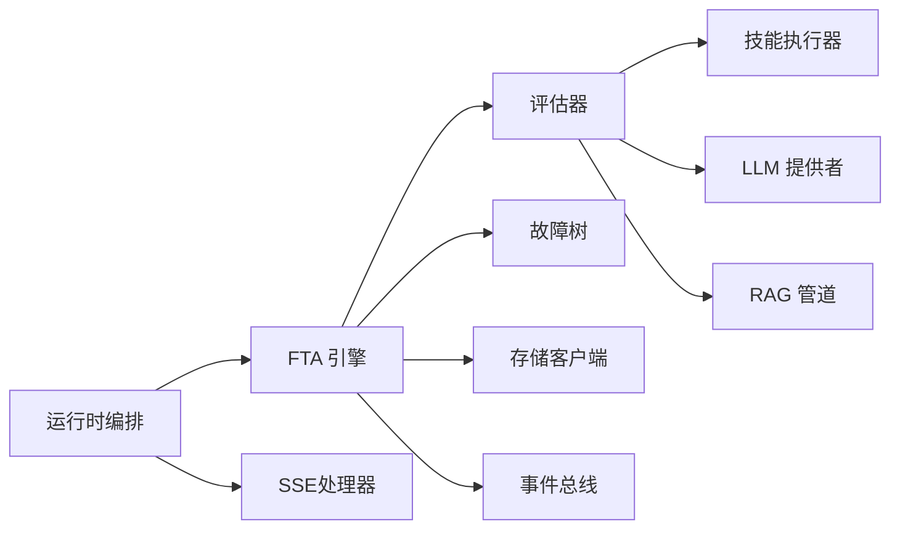

# 工作流执行管理

<cite>
**本文引用的文件**
- [python/src/resolveagent/fta/workflow.py](file://python/src/resolveagent/fta/workflow.py)
- [python/src/resolveagent/fta/engine.py](file://python/src/resolveagent/fta/engine.py)
- [python/src/resolveagent/fta/tree.py](file://python/src/resolveagent/fta/tree.py)
- [python/src/resolveagent/fta/gates.py](file://python/src/resolveagent/fta/gates.py)
- [python/src/resolveagent/fta/evaluator.py](file://python/src/resolveagent/fta/evaluator.py)
- [python/src/resolveagent/runtime/engine.py](file://python/src/resolveagent/runtime/engine.py)
- [python/src/resolveagent/store/fta_document_client.py](file://python/src/resolveagent/store/fta_document_client.py)
- [pkg/event/nats.go](file://pkg/event/nats.go)
- [pkg/feedback/types.go](file://pkg/feedback/types.go)
- [internal/cli/client/client.go](file://internal/cli/client/client.go)
- [internal/cli/workflow/run.go](file://internal/cli/workflow/run.go)
- [configs/examples/workflow-fta-example.yaml](file://configs/examples/workflow-fta-example.yaml)
- [python/tests/test_engine.py](file://python/tests/test_engine.py)
- [python/src/resolveagent/runtime/server.py](file://python/src/resolveagent/runtime/server.py)
- [pkg/server/agent_handlers.go](file://pkg/server/agent_handlers.go)
</cite>

## 更新摘要
**变更内容**
- 增强了Agent执行的流式支持，添加了`stream: true`参数用于实时交互场景
- 更新了运行时引擎以支持增量响应和流式事件处理
- 扩展了工作流执行的生命周期管理，支持更细粒度的状态跟踪
- 改进了事件系统以支持实时数据推送和客户端实时更新

## 目录
1. [简介](#简介)
2. [项目结构](#项目结构)
3. [核心组件](#核心组件)
4. [架构总览](#架构总览)
5. [详细组件分析](#详细组件分析)
6. [依赖关系分析](#依赖关系分析)
7. [性能考量](#性能考量)
8. [故障排查指南](#故障排查指南)
9. [结论](#结论)
10. [附录：使用示例与配置](#附录使用示例与配置)

## 简介
本技术文档围绕 FTA（故障树分析）工作流执行管理，系统性阐述 FTAWorkflow 的设计理念、执行机制、状态管理、事件驱动架构与异步执行模式。重点覆盖以下方面：
- 工作流生命周期：初始化、节点评估、门评估、结果汇总与持久化
- 执行上下文传递与数据共享策略
- 事件系统：事件类型、处理器与订阅机制
- 配置选项与自定义执行策略
- 与平台存储系统的集成与结果持久化
- **新增**：流式执行支持与实时交互场景
- 完整的使用示例：创建、启动与监控 FTA 工作流执行

## 项目结构
FTA 工作流执行由 Python 运行时中的 FTA 引擎与通用工作流编排共同构成，并通过 Go 平台的事件总线与存储层进行协作。关键模块如下：
- FTA 引擎与数据结构：engine.py、tree.py、gates.py、evaluator.py、workflow.py
- 运行时编排：runtime/engine.py（已增强流式支持）
- 存储客户端：store/fta_document_client.py
- 事件总线：pkg/event/nats.go
- CLI 调用入口：internal/cli/workflow/run.go、internal/cli/client/client.go
- 示例配置：configs/examples/workflow-fta-example.yaml

**图表来源**
- [python/src/resolveagent/runtime/engine.py:57-269](file://python/src/resolveagent/runtime/engine.py#L57-L269)
- [pkg/server/agent_handlers.go:155-218](file://pkg/server/agent_handlers.go#L155-L218)

章节来源
- [python/src/resolveagent/runtime/engine.py:57-269](file://python/src/resolveagent/runtime/engine.py#L57-L269)
- [pkg/server/agent_handlers.go:155-218](file://pkg/server/agent_handlers.go#L155-L218)

## 核心组件
- FTAEngine：负责从叶子节点向上遍历并评估故障树，产生流式事件，并在可选时持久化结果。
- FaultTree/FTAEvent/FTAGate：描述故障树的数据结构与拓扑排序、输入值获取等能力。
- NodeEvaluator：对基本事件进行评估，支持 skill、RAG、LLM、静态值、上下文读取等多种评估方式，并提供缓存。
- Workflow/WorkflowNode：通用工作流定义与验证，用于编排节点与边。
- **更新**：Runtime Engine：提供 execute_workflow 的异步迭代接口，封装工作流步骤的执行与事件输出，现已支持流式执行模式。
- NATS Bus：基于 JetStream 的事件总线，提供发布、订阅与持久化消息流。
- FTA Document Client：通过 REST API 与平台交互，创建/查询 FTA 文档与结果。

章节来源
- [python/src/resolveagent/runtime/engine.py:57-269](file://python/src/resolveagent/runtime/engine.py#L57-L269)
- [python/src/resolveagent/fta/engine.py:20-130](file://python/src/resolveagent/fta/engine.py#L20-L130)

## 架构总览
下图展示了 FTA 工作流执行的端到端流程：CLI 触发运行，运行时编排生成或加载工作流，FTA 引擎执行并产出事件，必要时将结果持久化到平台存储，同时通过事件总线广播执行事件。**新增**：支持流式响应，用户可实时接收增量更新。

**图表来源**
- [python/src/resolveagent/runtime/engine.py:174-189](file://python/src/resolveagent/runtime/engine.py#L174-L189)
- [pkg/server/agent_handlers.go:198-218](file://pkg/server/agent_handlers.go#L198-L218)

## 详细组件分析

### FTA 引擎与执行生命周期
- 初始化：构造 FTAEngine，注入 NodeEvaluator；记录执行 ID 与开始时间。
- 节点评估：遍历所有基本事件，逐个评估并将结果写入 event_results。
- 门评估：按自底向上的拓扑顺序评估门，累积 gate_results，最终得到 top_event_result。
- 结果汇总与持久化：计算耗时，若提供 fta_client 与 document_id，则调用 create_result 持久化结果。
- 事件输出：在整个过程中持续 yield 工作流事件，供上层消费。

**图表来源**
- [python/src/resolveagent/fta/engine.py:34-130](file://python/src/resolveagent/fta/engine.py#L34-L130)

章节来源
- [python/src/resolveagent/fta/engine.py:34-130](file://python/src/resolveagent/fta/engine.py#L34-L130)

### 流式执行支持（新增功能）
**更新**：运行时引擎现已支持流式执行模式，允许用户在长时间运行的任务中接收增量更新。

- **流式参数**：`execute()` 方法现在接受 `stream: bool = True` 参数，默认启用流式执行
- **增量响应**：支持 `content_chunk` 类型的增量内容推送，而非等待完整响应
- **实时事件**：在执行过程中持续推送 `execution.started`、`selector.started`、`selector.completed` 等事件
- **SSE支持**：Go层通过Server-Sent Events实现HTTP流式响应

**图表来源**
- [python/src/resolveagent/runtime/engine.py:174-189](file://python/src/resolveagent/runtime/engine.py#L174-L189)
- [python/src/resolveagent/runtime/engine.py:418-452](file://python/src/resolveagent/runtime/engine.py#L418-L452)

章节来源
- [python/src/resolveagent/runtime/engine.py:57-269](file://python/src/resolveagent/runtime/engine.py#L57-L269)
- [python/tests/test_engine.py:19-33](file://python/tests/test_engine.py#L19-L33)

### 故障树数据结构与拓扑排序
- EventType/GateType：枚举基本事件与门的类型。
- FTAEvent/FTAGate：事件与门的属性及门逻辑评估。
- FaultTree：维护事件与门集合，提供 get_basic_events、get_gates_bottom_up、get_input_values 等方法。
- 拓扑排序：使用 Kahn 算法确保门按依赖顺序评估，异常情况下回退为逆序。

**图表来源**
- [python/src/resolveagent/fta/tree.py:30-151](file://python/src/resolveagent/fta/tree.py#L30-L151)

章节来源
- [python/src/resolveagent/fta/tree.py:30-151](file://python/src/resolveagent/fta/tree.py#L30-L151)

### 节点评估器与上下文传递
- 评估策略：支持 skill、rag、llm、static、context 五种评估方式。
- 上下文传递：event.parameters 与 context 合并后传入具体评估器；支持 dot notation 访问嵌套上下文键。
- 缓存机制：以 event.id 与 context 哈希作为缓存键，避免重复评估。
- 容错处理：评估失败默认返回 False（事件未发生），并记录日志。

**图表来源**
- [python/src/resolveagent/fta/evaluator.py:51-110](file://python/src/resolveagent/fta/evaluator.py#L51-L110)
- [python/src/resolveagent/fta/evaluator.py:112-368](file://python/src/resolveagent/fta/evaluator.py#L112-L368)

章节来源
- [python/src/resolveagent/fta/evaluator.py:51-110](file://python/src/resolveagent/fta/evaluator.py#L51-L110)
- [python/src/resolveagent/fta/evaluator.py:112-368](file://python/src/resolveagent/fta/evaluator.py#L112-L368)

### 门逻辑实现
- AND/OR/VOTING/INHIBIT/PRIORITY_AND：根据门类型对输入布尔值进行逻辑运算。
- 在 tree.py 中 FTAGate.evaluate 直接实现上述逻辑，gates.py 提供独立函数便于复用。

章节来源
- [python/src/resolveagent/fta/tree.py:43-79](file://python/src/resolveagent/fta/tree.py#L43-L79)
- [python/src/resolveagent/fta/gates.py:1-29](file://python/src/resolveagent/fta/gates.py#L1-L29)

### 工作流定义与编排
- Workflow/WorkflowNode：定义节点类型（start/end/agent/skill/condition/action）、边与元数据。
- 验证：检查 start/end 存在性、可达性与孤立节点。
- 运行时编排：execute_workflow 动态构建最小工作流并逐步执行节点，输出 step_started/step_completed 事件。

章节来源
- [python/src/resolveagent/fta/workflow.py:9-134](file://python/src/resolveagent/fta/workflow.py#L9-L134)
- [python/src/resolveagent/runtime/engine.py:564-759](file://python/src/resolveagent/runtime/engine.py#L564-L759)

### 事件系统与异步执行
- 事件类型：workflow.started、node.evaluating、node.completed、gate.evaluating、gate.completed、workflow.completed。
- **更新**：新增执行事件：execution.started、execution.completed、execution.failed、selector.started、selector.completed。
- 异步迭代：engine.execute 与 runtime.execute_workflow 均使用 async iterator 逐条产出事件，便于实时消费。
- 事件总线：NATS JetStream 提供持久化消息流，预定义 AGENTS/SKILLS/WORKFLOWS/EXECUTIONS 四个 Stream，支持 Publish/Subscribe。
- 反馈信号：Go 层定义 workflow.complete/workflow.failed 等信号常量，用于跨子系统协调。

**图表来源**
- [python/src/resolveagent/fta/engine.py:55-129](file://python/src/resolveagent/fta/engine.py#L55-L129)
- [python/src/resolveagent/runtime/engine.py:105-223](file://python/src/resolveagent/runtime/engine.py#L105-L223)

章节来源
- [python/src/resolveagent/fta/engine.py:55-129](file://python/src/resolveagent/fta/engine.py#L55-L129)
- [python/src/resolveagent/runtime/engine.py:105-223](file://python/src/resolveagent/runtime/engine.py#L105-L223)

### 与平台存储系统的集成与结果持久化
- FTA 文档客户端：通过 REST API 创建/更新/删除 FTA 文档与结果，支持列表查询与详情获取。
- 持久化时机：FTA 引擎在完成评估后，若提供 fta_client 与 document_id，则将执行结果（含 execution_id、top_event_result、basic_event_probabilities、gate_results、status、duration_ms、context）写入平台。
- 错误处理：持久化失败仅记录警告，不影响事件流继续。

章节来源
- [python/src/resolveagent/store/fta_document_client.py:47-94](file://python/src/resolveagent/store/fta_document_client.py#L47-L94)
- [python/src/resolveagent/fta/engine.py:103-119](file://python/src/resolveagent/fta/engine.py#L103-L119)

## 依赖关系分析
- FTAEngine 依赖 NodeEvaluator 与 FaultTree；NodeEvaluator 可依赖 SkillExecutor、LLMProvider、RAG Pipeline。
- Runtime Engine 依赖 FTA 工作流定义与 FTA 引擎；通过事件总线与外部系统解耦。
- **更新**：新增SSE处理器依赖，支持HTTP流式响应。
- 存储客户端依赖平台 REST API；事件总线依赖 NATS JetStream。

**图表来源**
- [python/src/resolveagent/runtime/engine.py:564-759](file://python/src/resolveagent/runtime/engine.py#L564-L759)
- [pkg/server/agent_handlers.go:155-218](file://pkg/server/agent_handlers.go#L155-L218)

章节来源
- [python/src/resolveagent/runtime/engine.py:564-759](file://python/src/resolveagent/runtime/engine.py#L564-L759)
- [pkg/server/agent_handlers.go:155-218](file://pkg/server/agent_handlers.go#L155-L218)

## 性能考量
- 评估缓存：NodeEvaluator 使用事件与上下文哈希作为缓存键，减少重复评估开销。
- 拓扑排序：FaultTree.get_gates_bottom_up 采用 Kahn 算法保证高效且正确的门评估顺序。
- **更新**：异步流式处理：engine.execute 与 runtime.execute_workflow 使用异步迭代，降低内存占用并提升响应速度，支持增量内容推送。
- 事件持久化：NATS JetStream 提供至少一次投递与消息保留，适合高吞吐场景下的事件追踪。
- **新增**：SSE流式响应：通过HTTP流式传输减少延迟，提升用户体验。

## 故障排查指南
- 评估失败：当 skill/rag/llm 调用异常时，NodeEvaluator 记录错误日志并返回 False，建议检查对应服务可用性与参数配置。
- 持久化失败：若 create_result 抛出异常，仅记录警告，不影响事件流；需检查平台 API 连通性与权限。
- 事件丢失：确认 NATS JetStream 已正确创建 Streams，订阅者使用 ManualAck 并确保成功 Ack。
- 工作流验证失败：检查 Workflow.validate 返回的错误信息，确保存在 start/end 节点且无不可达节点。
- **新增**：流式连接问题：检查SSE连接是否正确建立，确认客户端支持text/event-stream协议。

章节来源
- [python/src/resolveagent/fta/evaluator.py:104-110](file://python/src/resolveagent/fta/evaluator.py#L104-L110)
- [python/src/resolveagent/fta/engine.py:103-119](file://python/src/resolveagent/fta/engine.py#L103-L119)
- [pkg/event/nats.go:135-178](file://pkg/event/nats.go#L135-L178)
- [python/src/resolveagent/fta/workflow.py:47-92](file://python/src/resolveagent/fta/workflow.py#L47-L92)

## 结论
FTA 工作流执行管理通过清晰的职责划分与模块化设计，实现了从节点评估、门逻辑到结果持久化的完整生命周期。**新增的流式执行支持**进一步提升了系统的实时交互能力，使长时任务的执行过程更加透明和用户友好。事件驱动的异步执行模式提升了可扩展性与可观测性，结合 NATS JetStream 与平台存储，提供了可靠的消息流转与结果归档能力。通过灵活的评估策略与上下文传递机制，系统能够适配多种诊断与决策场景。

## 附录：使用示例与配置
- 创建与启动：通过 CLI 调用 run 命令，指定 workflow_id 与输入数据，可选择同步或异步执行。
- **更新**：流式执行：设置 `stream: true` 参数以启用实时增量响应，适用于长时间运行的任务。
- 监控执行：订阅运行时与工作流事件，实时查看节点与门的评估进度。
- 配置选项：参考示例配置文件，定义工作流节点、边与元数据；在评估器中配置 skill/rag/llm/static/context 策略。
- 持久化：在执行时传入 document_id，以便将结果写入平台存储。

章节来源
- [internal/cli/workflow/run.go:13-56](file://internal/cli/workflow/run.go#L13-L56)
- [internal/cli/client/client.go:457-494](file://internal/cli/client/client.go#L457-L494)
- [configs/examples/workflow-fta-example.yaml](file://configs/examples/workflow-fta-example.yaml)
- [python/tests/test_engine.py:19-33](file://python/tests/test_engine.py#L19-L33)